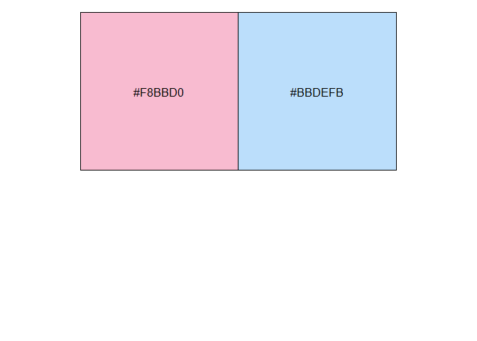
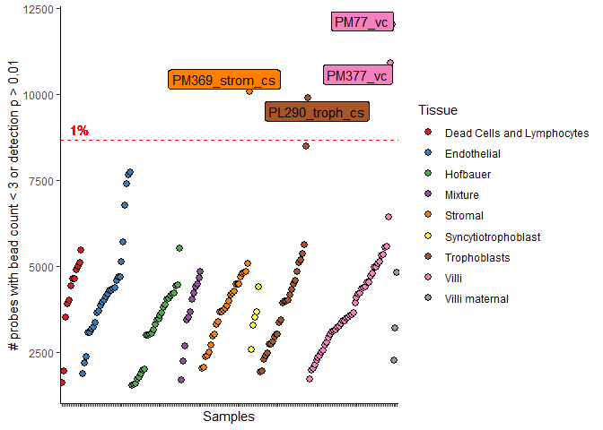
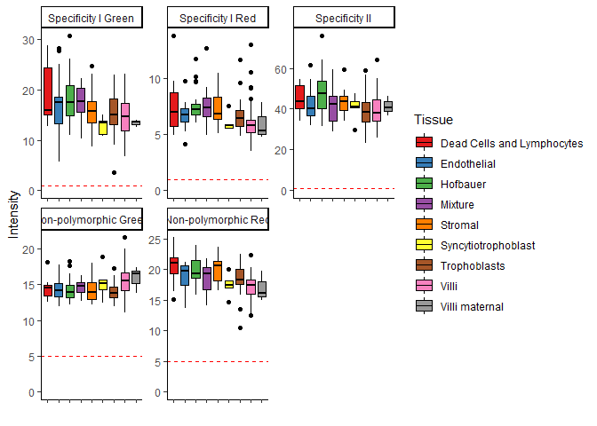
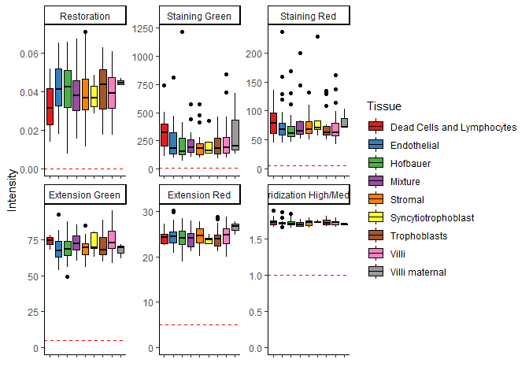
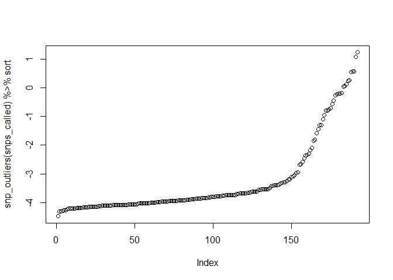
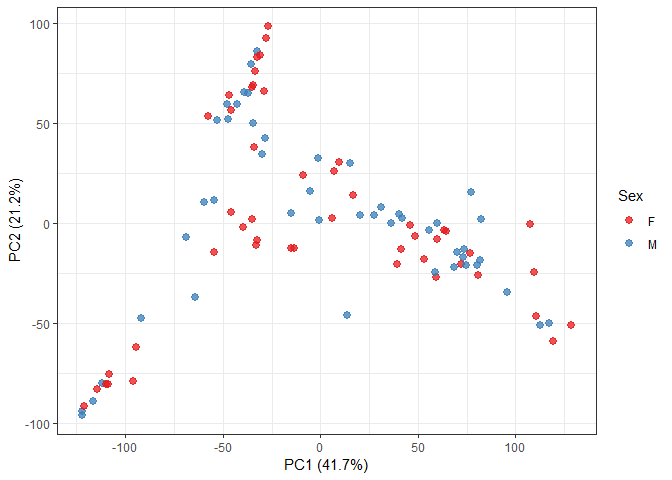

QC week 1 samples (n=96, 12 chips)

# 1.0 Libraries & data


```r
library(tidyr)
library(plyr)
library(minfi)
library(IlluminaHumanMethylationEPICanno.ilm10b4.hg19)
library(IlluminaHumanMethylationEPICmanifest)
library(ggplot2)
library(ggrepel)
library(irlba)
library(wateRmelon)
library(yahew) #install_github('wvictor14/yahew')
library(RColorBrewer)
library(dplyr)
library(kableExtra)
```


```r
rgset <- readRDS('../../data/main/interim/01_rgset_raw.rds')
pDat <- pData(rgset) %>% as_tibble()
```


I tried to load in annotation information and notice that there are more probes in our data than 
what is described in the b4 annotation (the latest version on Illumina's product files webpage). 

So right now I am in contact with Illumina trying to get a more updated annotation.


```r
minfi_anno <- getAnnotation(rgset)

#why probes don't match from rgset and anno?
minfi_anno
x <- rownames(detp)[which(!rownames(detp) %in% rownames(minfi_anno))]
y <- rownames(detp)[which(!rownames(detp) %in% names(ranges(anno)))]
intersect(x, y)

b4 <- read.csv('Z:/Victor/Data/DNAm annotations/MethylationEPIC_v-1-0_B4.csv', skip = 7)
sum(b4$IlmnID %in% rownames(betas_raw)) 
sum(rownames(betas_raw) %in% b4$IlmnID) #865859 / 866091 probes are in b4 annotation

unique_in_ours <- setdiff(rownames(betas_raw), b4$IlmnID)
unique_in_b4 <- setdiff(b4$IlmnID, rownames(betas_raw))

length(unique_in_ours)
length(unique_in_b4)
```

# 2.0 Probe QC

We start with probe qc to remove any failed measurements before going into sample qc

## 2.1 Detection p-value


```r
#get detp matrix
detp <- detectionP(rgset)

# detp p > 0.01
x <- colSums(detp > 0.01)
identical(names(x), pDat$Sentrix) #T
```

```
## [1] TRUE
```

```r
pDat$detP_01 <- x

# plot
ggplot(pDat, aes(x = Tissue, y = detP_01)) +
  geom_boxplot() + geom_point() + 
  theme_bw() +
  labs(x = '', y = '', title = 'Number of probes with detection p > 0.01') +
  geom_hline(yintercept = round(median(pDat$detP_01), 0), linetype ='dashed', color = 'blue') +
  geom_hline(yintercept = 0.01*nrow(detp), linetype = 'dashed', color = 'red') +coord_flip()
```

<!-- -->

No samples have > 8500 (1%) of their probes failing detection p

## 2.2 Beadcount


```r
# total bead count per sample
bc <- beadcount(rgset)
colnames(bc) <- gsub('X', '', colnames(bc))

pDat <- pDat %>% mutate(beadcount = colSums(is.na(bc)))

ggplot(pDat, aes(x = Tissue, y = beadcount)) +
  geom_boxplot() + geom_point() +
  theme_bw() +
  labs(x = '', y = '', 
        title = '# probes with bead count < 3') +
  geom_hline(yintercept = round(median(pDat$detP_01), 0), linetype ='dashed', color = 'blue') +
  geom_hline(yintercept = 0.01*nrow(bc), linetype = 'dashed', color = 'red') +coord_flip()
```

<!-- -->

## 2.3 Detp and bead count


```r
# create a dummy matrix
failed_probes <- matrix(data = F, nrow = nrow(detp), ncol = ncol(detp),
                        dimnames = list(rownames(detp), colnames(detp))) %>% as.data.frame
failed_probes[1:6,1:6]
```

```
##            203067920143_R01C01 203067920143_R02C01 203067920143_R03C01
## cg18478105               FALSE               FALSE               FALSE
## cg09835024               FALSE               FALSE               FALSE
## cg14361672               FALSE               FALSE               FALSE
## cg01763666               FALSE               FALSE               FALSE
## cg12950382               FALSE               FALSE               FALSE
## cg02115394               FALSE               FALSE               FALSE
##            203067920143_R04C01 203067920143_R05C01 203067920143_R06C01
## cg18478105               FALSE               FALSE               FALSE
## cg09835024               FALSE               FALSE               FALSE
## cg14361672               FALSE               FALSE               FALSE
## cg01763666               FALSE               FALSE               FALSE
## cg12950382               FALSE               FALSE               FALSE
## cg02115394               FALSE               FALSE               FALSE
```

```r
# now put 'TRUE' where detp > 0.01, or beadcount is < 3
failed_probes[is.na(bc)] <- T
failed_probes[detp > 0.01] <- T

# now calculate the number of failed probes
pDat <- pDat %>% mutate(failed_probes = colSums(failed_probes))

ggplot(pDat, aes(x = Tissue, y = failed_probes)) +
  geom_boxplot() + geom_point() +
  theme_bw() +
  labs(x = '', y = '', 
        title = '# probes with bead count < 3 or detection p > 0.01') +
  geom_hline(yintercept = round(median(pDat$failed_probes), 0), linetype ='dashed', color = 'blue') +
  geom_hline(yintercept = 0.01*nrow(failed_probes), linetype = 'dashed', color = 'red') +coord_flip()
```

<!-- -->

Number of probes that had a significant amount of failures:


```r
failed_probes_count <- rowSums(failed_probes)
sum(failed_probes_count > 0.025*96) # > 2.5%, 41087
```

```
## [1] 41087
```

```r
sum(failed_probes_count > 0.05*96) # > 5%, 20527
```

```
## [1] 20527
```

```r
sum(failed_probes_count > 0.10*96) # > 10%, 5578
```

```
## [1] 5578
```

```r
sum(failed_probes_count > 0.15*96) # > 15%, 2663
```

```
## [1] 2663
```

```r
sum(failed_probes_count > 0.20*96) # > 20%, 1637
```

```
## [1] 1637
```

```r
sum(failed_probes_count > 0.25*96) # > 25%, 1198
```

```
## [1] 1198
```

```r
fp_plot <- tibble(Percent_failing = seq(0.025, 1, 0.025)) %>% 
  mutate(Number_of_probes_failing = 
           sapply(Percent_failing*96, FUN = function(x) sum(failed_probes_count > x)))


ggplot(fp_plot, aes(x = Percent_failing, y = Number_of_probes_failing)) +
  geom_line() + theme_bw()
```

<!-- -->

```r
sum(failed_probes_count > 0.125*96) # > 12.5%, 3405
```

```
## [1] 3405
```

```r
# add this info to probe annotation
probe_anno <- tibble(probe_ID = rownames(detp)) %>%
  mutate(number_failed_probes = failed_probes_count)
```

## 2.4 Meth and unmeth


```r
mset_raw <- preprocessRaw(rgset)
meth <- getMeth(mset_raw)
unmeth <- getUnmeth(mset_raw)

pDat <- pDat %>% mutate(log2_median_meth = log2(colMedians(meth)), 
                        log2_median_unmeth = log2(colMedians(unmeth)))

ggplot(pDat, aes(x = log2_median_meth, y = log2_median_unmeth)) +
  geom_point() +
  geom_abline(intercept = 10.5*2, slope = -1, col = 'red', linetype = 'dashed') +
  xlim(7.5, 15) + ylim(7.5, 15) + theme_bw()
```

<!-- -->

## 2.5 Control probes


```r
controls <- c("BISULFITE CONVERSION I", "BISULFITE CONVERSION II", "EXTENSION", "HYBRIDIZATION",
              "NON-POLYMORPHIC","SPECIFICITY I", "SPECIFICITY II", "TARGET REMOVAL")

controlStripPlot(rgset, controls = controls)
```

<!-- --><!-- --><!-- --><!-- --><!-- --><!-- --><!-- --><!-- -->

## 2.6 remove probes

Here I generate a list of probes to remove based on :
- poor quality probes (high detp, low beadcount)
- cross hybridizing probes (30bp non-unique, non-unique mapping)
- probes with SNPs within 5bp of the CpG site, in probe direction, including CpG and SBE site 

nonvariable placental probes I compute after normalization


```r
# failed probes, remove if > 10% missing
probe_fail <- probe_anno %>% filter(number_failed_probes > 0.10*96)  %>% pull(probe_ID)
probe_fail %>% length # 5578
```

```
## [1] 5578
```

```r
probe_anno <- probe_anno %>% mutate(remove_failed = ifelse(probe_ID %in% probe_fail, T, F))
sum(probe_anno$remove_failed) # 5578
```

```
## [1] 5578
```

```r
# cross hybridizing AND snp in 5bp of target site, + SBE
# zhou's annotation
zhou_anno <- readRDS('Z:/Victor/Data/DNAm annotations/zhou2017_EPIC.hg19.manifest.rds') 
zhou_anno <- zhou_anno %>% as_tibble() %>% mutate(probe_ID = names(zhou_anno))
glimpse(zhou_anno) # 865,918 
```

```
## Observations: 865,918
## Variables: 58
## $ seqnames                 <fct> chr1, chr1, chr1, chr1, chr1, chr1, c...
## $ start                    <int> 10525, 10848, 10850, 15865, 18827, 29...
## $ end                      <int> 10526, 10849, 10851, 15866, 18828, 29...
## $ width                    <int> 2, 2, 2, 2, 2, 2, 2, 2, 2, 2, 2, 2, 2...
## $ strand                   <fct> -, +, +, -, -, -, -, -, -, +, +, +, -...
## $ address_A                <int> 21611527, 91693541, 82663207, 2665852...
## $ address_B                <int> NA, 47784201, 3701821, 39757192, NA, ...
## $ channel                  <chr> "Both", "Grn", "Grn", "Red", "Both", ...
## $ designType               <chr> "II", "I", "I", "I", "II", "I", "I", ...
## $ nextBase                 <chr> "G/A", "C", "C", "A", "G/A", "A", "T"...
## $ nextBaseRef              <chr> "C", "G", "G", "C", "C", "C", "A", "C...
## $ probeType                <chr> "cg", "cg", "cg", "cg", "cg", "cg", "...
## $ orientation              <chr> "down", "up", "up", "down", "down", "...
## $ probeCpGcnt              <int> 3, 7, 8, 2, 2, 8, 7, 1, 0, 3, 1, 2, 0...
## $ context35                <int> 4, 12, 12, 4, 3, 11, 12, 1, 1, 2, 2, ...
## $ probeBeg                 <int> 10526, 10800, 10802, 15865, 18828, 29...
## $ probeEnd                 <dbl> 10575, 10849, 10851, 15914, 18877, 29...
## $ ProbeSeq_A               <chr> "AAACRAAACTACRTTATCCTCTACACAAATTTCRAT...
## $ ProbeSeq_B               <chr> "", "ACACATACTAACGCGTCGAAATAAAAACGTAA...
## $ gene                     <chr> NA, "DDX11L1", "DDX11L1", "WASH7P", "...
## $ gene_HGNC                <chr> NA, "DDX11L1", "DDX11L1", "WASH7P", "...
## $ chrm_A                   <chr> "chr1", "chr1", "chr1", "chr1", "chr1...
## $ beg_A                    <int> 10526, 10800, 10802, 15865, 18828, 29...
## $ flag_A                   <int> 16, 0, 0, 16, 16, 16, 16, 16, 16, 0, ...
## $ mapQ_A                   <int> 13, 22, 22, 17, 1, 4, 4, 6, 6, 60, 6,...
## $ cigar_A                  <chr> "50M", "50M", "50M", "50M", "50M", "5...
## $ NM_A                     <int> 0, 0, 0, 0, 0, 0, 0, 0, 0, 0, 0, 0, 0...
## $ chrm_B                   <chr> NA, "chr1", "chr1", "chr1", NA, "chr1...
## $ beg_B                    <int> NA, 10800, 10802, 15865, NA, 29407, 2...
## $ flag_B                   <int> NA, 0, 0, 16, NA, 16, 16, NA, NA, NA,...
## $ mapQ_B                   <int> NA, 22, 22, 17, NA, 4, 4, NA, NA, NA,...
## $ cigar_B                  <chr> NA, "50M", "50M", "50M", NA, "50M", "...
## $ NM_B                     <int> NA, 0, 0, 0, NA, 0, 0, NA, NA, NA, NA...
## $ wDecoy_chrm_A            <chr> "chr1", "chr1", "chr1", "chr1", "chr1...
## $ wDecoy_beg_A             <int> 10526, 10800, 10802, 15865, 18828, 29...
## $ wDecoy_flag_A            <int> 16, 0, 0, 16, 16, 16, 16, 16, 16, 0, ...
## $ wDecoy_mapQ_A            <int> 13, 22, 22, 17, 1, 4, 4, 6, 6, 60, 6,...
## $ wDecoy_cigar_A           <chr> "50M", "50M", "50M", "50M", "50M", "5...
## $ wDecoy_NM_A              <int> 0, 0, 0, 0, 0, 0, 0, 0, 0, 0, 0, 0, 0...
## $ wDecoy_chrm_B            <chr> NA, "chr1", "chr1", "chr1", NA, "chr1...
## $ wDecoy_beg_B             <int> NA, 10800, 10802, 15865, NA, 29407, 2...
## $ wDecoy_flag_B            <int> NA, 0, 0, 16, NA, 16, 16, NA, NA, NA,...
## $ wDecoy_mapQ_B            <int> NA, 22, 22, 17, NA, 4, 4, NA, NA, NA,...
## $ wDecoy_cigar_B           <chr> NA, "50M", "50M", "50M", NA, "50M", "...
## $ wDecoy_NM_B              <int> NA, 0, 0, 0, NA, 0, 0, NA, NA, NA, NA...
## $ posMatch                 <lgl> TRUE, TRUE, TRUE, TRUE, TRUE, TRUE, T...
## $ MASK_mapping             <lgl> TRUE, TRUE, TRUE, TRUE, TRUE, TRUE, T...
## $ MASK_typeINextBaseSwitch <lgl> FALSE, FALSE, FALSE, FALSE, FALSE, FA...
## $ MASK_rmsk15              <lgl> TRUE, TRUE, TRUE, FALSE, FALSE, FALSE...
## $ MASK_sub40_copy          <lgl> FALSE, FALSE, FALSE, TRUE, FALSE, FAL...
## $ MASK_sub35_copy          <lgl> FALSE, FALSE, TRUE, TRUE, FALSE, TRUE...
## $ MASK_sub30_copy          <lgl> FALSE, TRUE, TRUE, TRUE, FALSE, TRUE,...
## $ MASK_sub25_copy          <lgl> FALSE, TRUE, TRUE, TRUE, FALSE, TRUE,...
## $ MASK_snp5_common         <lgl> FALSE, FALSE, FALSE, FALSE, FALSE, FA...
## $ MASK_snp5_GMAF1p         <lgl> FALSE, FALSE, FALSE, FALSE, FALSE, FA...
## $ MASK_extBase             <lgl> FALSE, FALSE, FALSE, FALSE, FALSE, FA...
## $ MASK_general             <lgl> TRUE, TRUE, TRUE, TRUE, TRUE, TRUE, T...
## $ probe_ID                 <chr> "cg14817997", "cg26928153", "cg162691...
```

```r
probe_CH_snp <- zhou_anno$probe_ID[zhou_anno$MASK_general == T] 
length(probe_CH_snp) # 99360
```

```
## [1] 99360
```

```r
probe_anno <- probe_anno %>% mutate(remove_CH_SNP = ifelse(probe_ID %in% probe_CH_snp, T, F))
sum(probe_anno$remove_CH_SNP) # 99360
```

```
## [1] 99360
```

```r
# sex probes
zhou_XY <- zhou_anno %>% filter(seqnames %in% c('chrX', 'chrY')) %>% pull(probe_ID)
length(zhou_XY) # 19637
```

```
## [1] 19637
```

```r
XY_probes <- intersect(zhou_XY, rownames(meth))
length(XY_probes) # 19631, 6 xy probes in zhou's anno not in our data
```

```
## [1] 19631
```

```r
probe_anno <- probe_anno %>% mutate(remove_XY = ifelse(probe_ID %in% zhou_XY, T, F))
sum(probe_anno$remove_XY) # 19631
```

```
## [1] 19631
```

```r
# filter raw betas
remove <- probe_anno %>% 
  filter(remove_failed == T | remove_CH_SNP == T | remove_XY == T) %>%
  pull(probe_ID)
length(remove) # 120623
```

```
## [1] 120623
```

```r
betas_raw <- getBeta(rgset)
betas_raw_filt <- betas_raw[setdiff(rownames(betas_raw), remove),]
dim(betas_raw_filt) # 745468 probes
```

```
## [1] 745468     96
```

```r
# remove XY probes
betas_raw_XY <- betas_raw[probe_anno %>% filter(remove_XY == T) %>% pull(probe_ID),]
dim(betas_raw_XY) # 19631 sex probes
```

```
## [1] 19631    96
```

# 3.0 Normalization

## 3.1 Functional normalization

Here I normalize, filter nonvariable probes.


```r
mset_funnorm <- preprocessFunnorm(rgset)
```

```
## [preprocessFunnorm] Background and dye bias correction with noob
```

```
## [preprocessFunnorm] Mapping to genome
```

```
## [preprocessFunnorm] Quantile extraction
```

```
## [preprocessFunnorm] Normalization
```

```r
betas_norm <- getBeta(mset_funnorm)
```

## 3.2 nonvariable probes

We call nonvariable probes after normalization


```r
edgar_nonvar <- read.csv('Z:/Victor/Data/DNAm annotations/Invariant_Placenta_CpGs.csv') %>% 
  as_tibble

# call our data-specific nonvariable probes
Variation <- function(x) {quantile(x, c(0.9), na.rm=T)[[1]]-quantile(x, c(0.1), na.rm=T)[[1]]}
ref_range <- lapply(1:nrow(betas_norm), function(x) Variation(betas_norm[x,]))
ref_range <-unlist(ref_range)
norm_nonvar <- rownames(betas_norm)[ref_range < 0.05]
length(norm_nonvar) # 179677
```

```
## [1] 179677
```

```r
# find intersect
probe_anno <- probe_anno %>%
  mutate(nonvariable_edgar = ifelse(probe_ID %in% edgar_nonvar$CpG, T, F),
         nonvariable_norm = ifelse(probe_ID %in% norm_nonvar, T, F))
sum(probe_anno$nonvariable_edgar) # 179677
```

```
## [1] 95304
```

```r
sum(probe_anno$nonvariable_norm) # 95304
```

```
## [1] 179677
```

```r
nonvar <- probe_anno %>% filter(nonvariable_edgar == T & nonvariable_norm == T) %>% pull(probe_ID)
length(nonvar) #74558
```

```
## [1] 74558
```

```r
# plot one nonvariable probe
probe_anno %>% filter(nonvariable_edgar == T, nonvariable_norm == T)
```

```
## # A tibble: 74,558 x 7
##    probe_ID number_failed_p~ remove_failed remove_CH_SNP remove_XY
##    <chr>               <dbl> <lgl>         <lgl>         <lgl>    
##  1 cg17236~                5 FALSE         FALSE         FALSE    
##  2 cg21650~                2 FALSE         FALSE         FALSE    
##  3 cg24176~                0 FALSE         FALSE         FALSE    
##  4 cg00172~               10 TRUE          FALSE         FALSE    
##  5 cg15775~                0 FALSE         FALSE         FALSE    
##  6 cg17579~                4 FALSE         FALSE         FALSE    
##  7 cg01658~                1 FALSE         FALSE         FALSE    
##  8 cg16315~                0 FALSE         FALSE         FALSE    
##  9 cg22471~                4 FALSE         FALSE         FALSE    
## 10 cg07102~                1 FALSE         FALSE         FALSE    
## # ... with 74,548 more rows, and 2 more variables:
## #   nonvariable_edgar <lgl>, nonvariable_norm <lgl>
```

```r
pDat %>% mutate(cg17236668_norm = betas_norm['cg17236668',]) %>%
  ggplot(aes(x = Tissue, y = cg17236668_norm)) +
  geom_boxplot() + geom_point() + theme_bw() + ylim(0,1) +labs(title = 'Normalized')
```

<!-- -->

```r
pDat %>% mutate(cg17236668_raw = betas_raw['cg17236668',]) %>%
  ggplot(aes(x = Tissue, y = cg17236668_raw)) +
  geom_boxplot() + geom_point() + theme_bw() + ylim(0,1) +labs(title = 'Raw')
```

<!-- -->

```r
#filter out nonvariable probes
filt <- setdiff(rownames(betas_raw_filt), nonvar)
dim(betas_norm) # 865859
```

```
## [1] 865859     96
```

```r
betas_norm_filt <- betas_norm[intersect(rownames(betas_norm), filt),]
betas_raw_filt <- betas_raw_filt[rownames(betas_norm_filt),]
nrow(betas_norm_filt); nrow(betas_raw_filt) # 675227
```

```
## [1] 675227
```

```
## [1] 675227
```

```r
filt_XY <- setdiff(rownames(betas_raw_XY), nonvar)
dim(betas_norm) # 865859
```

```
## [1] 865859     96
```

```r
betas_norm_XY <- betas_norm[intersect(rownames(betas_norm), filt_XY),]
betas_raw_XY <- betas_raw_XY[rownames(betas_norm_XY),]
nrow(betas_norm_XY); nrow(betas_raw_XY) # 19465
```

```
## [1] 19465
```

```
## [1] 19465
```

# 3.0 Sample QC

## 3.1 PCA


```r
# calculate pca
set.seed(2019)
pca_raw <- prcomp_irlba(t(na.omit(betas_raw_filt)), n = 20)
pca_norm <- prcomp_irlba(t(na.omit(betas_norm_filt)), n = 20)

# rename columns
pca_raw_scores <-pca_raw$x %>% as_tibble() %>% mutate(Sample_Name = pDat$Sample_Name) 
colnames(pca_raw_scores)[1:20] <- paste0(colnames(pca_raw_scores)[1:20], '_raw')
pca_norm_scores <- pca_norm$x %>%as_tibble() %>% mutate(Sample_Name = pDat$Sample_Name) 
colnames(pca_norm_scores)[1:20] <- paste0(colnames(pca_norm_scores)[1:20], '_norm')

# correlate with phenodata
pca_raw_cor <- lmmatrix(dep = pca_raw_scores[,1:20],
                        ind = pDat %>% dplyr::select(Case_ID, Tissue, Sex, Trimester, DNA_QP, 
                                                     Chip_number, Sentrix_Position, detP_01,
                                                     beadcount), metric = 'Pvalue')
pca_norm_cor <- lmmatrix(dep = pca_norm_scores[,1:20],
                         ind = pDat %>% dplyr::select(Case_ID, Tissue, Sex, Trimester, DNA_QP, 
                                                     Chip_number, Sentrix_Position, detP_01,
                                                     beadcount), metric = 'Pvalue')

# plot
pca_raw_plot <- pca_raw_cor %>% as.data.frame() %>% 
  
  # add dep variables
  mutate(dep = rownames(pca_raw_cor)) %>%
  
  # reshape
  gather(PC, pval, -dep) %>%
  
  # pvalue categories
  mutate(pval_cat = case_when(
    pval > 0.05  ~ '> 0.05',
    pval < 0.05 & pval > 0.01 ~ '< 0.05',
    pval < 0.01 & pval > 0.001 ~ '< 0.01',
    pval < 0.001 ~ '< 0.001'
  ))

pca_norm_plot <- pca_norm_cor %>% as.data.frame() %>% 
  
  # add dep variables
  mutate(dep = rownames(pca_norm_cor)) %>%
  
  # reshape
  gather(PC, pval, -dep) %>%
  
  # pvalue categories
  mutate(pval_cat = case_when(
    pval > 0.05  ~ '> 0.05',
    pval < 0.05 & pval > 0.01 ~ '< 0.05',
    pval < 0.01 & pval > 0.001 ~ '< 0.01',
    pval < 0.001 ~ '< 0.001'
  ))


p1 <- ggplot(pca_raw_plot, aes(x = PC, y = dep, fill = pval_cat)) +
  geom_tile(col = 'lightgrey') + theme_bw() +
  scale_x_discrete(expand = c(0, 0), labels = 1:20) +
  scale_y_discrete(expand = c(0, 0)) +
  scale_fill_manual(values = c('> 0.05' = 'white', '< 0.05' = '#fee8c8', 
                               '< 0.01' = '#fdbb84', '< 0.001' = '#e34a33'))  + 
  labs(title = 'raw data', y = '', fill = 'P value') + coord_equal();p1
```

<!-- -->

```r
p2 <- ggplot(pca_norm_plot, aes(x = PC, y = dep, fill = pval_cat)) +
  geom_tile(col = 'lightgrey') + theme_bw() +
  scale_x_discrete(expand = c(0, 0), labels = 1:20) +
  scale_y_discrete(expand = c(0, 0)) +
  scale_fill_manual(values = c('> 0.05' = 'white', '< 0.05' = '#fee8c8', 
                               '< 0.01' = '#fdbb84', '< 0.001' = '#e34a33'))  + 
  labs(title = 'normalized data', y = '', fill = 'P value') + coord_equal(); p2
```

<!-- -->

```r
# calculate proportion variance
prop_var <- tibble(Prop_var_raw = pca_raw$sdev^2 *100 / pca_raw$totalvar,
                   Prop_var_norm = pca_norm$sdev^2*100/ pca_norm$totalvar,
                   PC = 1:20)
p1b <- ggplot(prop_var, aes(x = PC, y = Prop_var_raw)) +
  geom_bar(stat = 'identity') + theme_bw() + labs(y = '% variance', title = 'raw') +
  scale_x_continuous(breaks = 1:20);p1b
```

<!-- -->

```r
p2b <- ggplot(prop_var, aes(x = PC, y = Prop_var_norm)) +
  geom_bar(stat = 'identity') + theme_bw() + labs(y = '% variance', title = 'Normalized') +
  scale_x_continuous(breaks = 1:20);p2b
```

<!-- -->

### PC plots


```r
# add pc to data
pDat <- pDat %>% left_join(pca_norm_scores)
```

```
## Joining, by = "Sample_Name"
```

```r
p3 <- ggplot(pDat, aes(x = PC1_norm, y = PC2_norm, col = Tissue, shape = Trimester)) +
  geom_point(size = 2.5, alpha = 0.75) + theme_bw() +
  scale_color_brewer(palette = 'Set1') + labs(x = 'PC1 (41.7%)', y = 'PC2 (21.2%)');p3
```

<!-- -->

```r
p4 <- ggplot(pDat, aes(x = PC3_norm, y = PC4_norm, col = Tissue, shape = Trimester)) +
  geom_point(size = 2.5, alpha = 0.75) + theme_bw() +
  scale_color_brewer(palette = 'Set1') + labs(x = 'PC3 (10.8%)', y = 'PC4 (6.35%)');p4
```

<!-- -->

```r
p5 <- ggplot(pDat, aes(x = PC3_norm, y = PC4_norm, col = Sex)) +
  geom_point(size = 2.5, alpha = 0.75) + theme_bw() +
  scale_color_brewer(palette = 'Set1') + labs(x = 'PC3 (10.8%)', y = 'PC4 (6.35%)');p5
```

<!-- -->

```r
p6<- ggplot(pDat, aes(x = PC1_norm, y = PC2_norm, col = Sex)) +
  geom_point(size = 2.5, alpha = 0.75) + theme_bw() +
  scale_color_brewer(palette = 'Set1') + labs(x = 'PC1 (41.7%)', y = 'PC2 (21.2%)');p6
```

<!-- -->

## 3.2 Sex Prediction

1. minfi approach by comparing median intensity of X and Y probes
2. Methylation patterns on XY probes


```r
# median intensities of XY probes
meth_XY <- getMeth(mset_raw[rownames(betas_norm_XY),])
unmeth_XY <- getUnmeth(mset_raw[rownames(betas_norm_XY),])
pDat <- pDat %>% mutate(meth_XY_med = colMedians(meth_XY),
                unmeth_XY_med = colMedians(unmeth_XY))
ggplot(pDat, aes(x = meth_XY_med, y = unmeth_XY_med, col = Sex)) +
  geom_point()
```

<!-- -->

```r
# PCA / clustering on betas
prcomp_XY <- prcomp(t(na.omit(betas_norm_XY)))
prcomp_XY <- prcomp_XY$x[,1:20]
colnames(prcomp_XY) <- paste0(colnames(prcomp_XY), '_XY')

pDat <- bind_cols(pDat, as.data.frame(prcomp_XY))

ggplot(pDat, aes(x = PC1_XY, y = PC2_XY, col = Sex)) + geom_point()
```

<!-- -->

```r
ggplot(pDat, aes(x = PC1_XY, y = PC2_XY, col = Tissue)) + geom_point()
```

<!-- -->

```r
ggplot(pDat, aes(x = PC1_XY, y = PC2_XY, col = Trimester)) + geom_point()
```

<!-- -->

3. ewastools check sex


```r
library(ewastools) #devtools::install_github("hhhh5/ewastools")
```

```
## 
## Attaching package: 'ewastools'
```

```
## The following object is masked from 'package:minfi':
## 
##     detectionP
```

```
## The following object is masked from 'package:Biostrings':
## 
##     mask
```

```
## The following object is masked from 'package:BiocGenerics':
## 
##     normalize
```

```r
x <- list.files(path = 'Z:/ROBLAB6 Infinium450k John/EPIC Raw data/NIH EPIC Batch 2/IDATs - Week 1/',
                recursive = T)
y <- grep(paste(paste0(pDat$Sentrix, "_Grn.idat"), collapse = "|"), x, value = T)
filepaths <- paste0('Z:/ROBLAB6 Infinium450k John/EPIC Raw data/NIH EPIC Batch 2/IDATs - Week 1/',
                    gsub('_Grn.idat', '', y))
idats <- read_idats(filepaths)
```

```
## [1] 1051815
## 
  |                                                                       
  |                                                                 |   0%
  |                                                                       
  |=                                                                |   1%
  |                                                                       
  |=                                                                |   2%
  |                                                                       
  |==                                                               |   3%
  |                                                                       
  |===                                                              |   4%
  |                                                                       
  |===                                                              |   5%
  |                                                                       
  |====                                                             |   6%
  |                                                                       
  |=====                                                            |   7%
  |                                                                       
  |=====                                                            |   8%
  |                                                                       
  |======                                                           |   9%
  |                                                                       
  |=======                                                          |  10%
  |                                                                       
  |=======                                                          |  11%
  |                                                                       
  |========                                                         |  12%
  |                                                                       
  |=========                                                        |  14%
  |                                                                       
  |=========                                                        |  15%
  |                                                                       
  |==========                                                       |  16%
  |                                                                       
  |===========                                                      |  17%
  |                                                                       
  |============                                                     |  18%
  |                                                                       
  |============                                                     |  19%
  |                                                                       
  |=============                                                    |  20%
  |                                                                       
  |==============                                                   |  21%
  |                                                                       
  |==============                                                   |  22%
  |                                                                       
  |===============                                                  |  23%
  |                                                                       
  |================                                                 |  24%
  |                                                                       
  |================                                                 |  25%
  |                                                                       
  |=================                                                |  26%
  |                                                                       
  |==================                                               |  27%
  |                                                                       
  |==================                                               |  28%
  |                                                                       
  |===================                                              |  29%
  |                                                                       
  |====================                                             |  30%
  |                                                                       
  |====================                                             |  31%
  |                                                                       
  |=====================                                            |  32%
  |                                                                       
  |======================                                           |  33%
  |                                                                       
  |======================                                           |  34%
  |                                                                       
  |=======================                                          |  35%
  |                                                                       
  |========================                                         |  36%
  |                                                                       
  |========================                                         |  38%
  |                                                                       
  |=========================                                        |  39%
  |                                                                       
  |==========================                                       |  40%
  |                                                                       
  |==========================                                       |  41%
  |                                                                       
  |===========================                                      |  42%
  |                                                                       
  |============================                                     |  43%
  |                                                                       
  |============================                                     |  44%
  |                                                                       
  |=============================                                    |  45%
  |                                                                       
  |==============================                                   |  46%
  |                                                                       
  |==============================                                   |  47%
  |                                                                       
  |===============================                                  |  48%
  |                                                                       
  |================================                                 |  49%
  |                                                                       
  |================================                                 |  50%
  |                                                                       
  |=================================                                |  51%
  |                                                                       
  |==================================                               |  52%
  |                                                                       
  |===================================                              |  53%
  |                                                                       
  |===================================                              |  54%
  |                                                                       
  |====================================                             |  55%
  |                                                                       
  |=====================================                            |  56%
  |                                                                       
  |=====================================                            |  57%
  |                                                                       
  |======================================                           |  58%
  |                                                                       
  |=======================================                          |  59%
  |                                                                       
  |=======================================                          |  60%
  |                                                                       
  |========================================                         |  61%
  |                                                                       
  |=========================================                        |  62%
  |                                                                       
  |=========================================                        |  64%
  |                                                                       
  |==========================================                       |  65%
  |                                                                       
  |===========================================                      |  66%
  |                                                                       
  |===========================================                      |  67%
  |                                                                       
  |============================================                     |  68%
  |                                                                       
  |=============================================                    |  69%
  |                                                                       
  |=============================================                    |  70%
  |                                                                       
  |==============================================                   |  71%
  |                                                                       
  |===============================================                  |  72%
  |                                                                       
  |===============================================                  |  73%
  |                                                                       
  |================================================                 |  74%
  |                                                                       
  |=================================================                |  75%
  |                                                                       
  |=================================================                |  76%
  |                                                                       
  |==================================================               |  77%
  |                                                                       
  |===================================================              |  78%
  |                                                                       
  |===================================================              |  79%
  |                                                                       
  |====================================================             |  80%
  |                                                                       
  |=====================================================            |  81%
  |                                                                       
  |=====================================================            |  82%
  |                                                                       
  |======================================================           |  83%
  |                                                                       
  |=======================================================          |  84%
  |                                                                       
  |========================================================         |  85%
  |                                                                       
  |========================================================         |  86%
  |                                                                       
  |=========================================================        |  88%
  |                                                                       
  |==========================================================       |  89%
  |                                                                       
  |==========================================================       |  90%
  |                                                                       
  |===========================================================      |  91%
  |                                                                       
  |============================================================     |  92%
  |                                                                       
  |============================================================     |  93%
  |                                                                       
  |=============================================================    |  94%
  |                                                                       
  |==============================================================   |  95%
  |                                                                       
  |==============================================================   |  96%
  |                                                                       
  |===============================================================  |  97%
  |                                                                       
  |================================================================ |  98%
  |                                                                       
  |================================================================ |  99%
  |                                                                       
  |=================================================================| 100%
```

```r
predicted_sex <- check_sex(idats)
pDat <- pDat %>% mutate(normalized_X_intensity = predicted_sex$X,
                        normalized_Y_intensity = predicted_sex$Y)
ggplot(pDat, aes(x = normalized_X_intensity, y = normalized_Y_intensity, col = Sex)) +
  geom_point() +
  geom_label_repel(data = pDat %>% filter(Sex == 'M', normalized_X_intensity > 0.95), 
            aes(label = Sample_Name)) + theme_bw()
```

<!-- -->

## 3.3 Correlation
## 3.4 SNP clustering


```r
#snps <- getSnpBeta(rgset)

#ewastools pipeline
snps <- idats$manifest[probe_type=="rs",index]
idats <- dont_normalize(idats)
snps <- idats[snps,]

# fit mixture model to call genotypes
snps_called <- call_genotypes(snps, learn = F)

# call genotype clusters
pDat <- pDat %>% mutate(genotype_cluster = enumerate_sample_donors(snps_called))

# find any discrepancies
genotype_issues <- check_snp_agreement(snps_called, donor_ids = pDat$Case_ID, 
                                       sample_ids = pDat$Sample_Name)

kable(genotype_issues[[1]])  %>%
  kable_styling(bootstrap_options = c("striped", "hover", "condensed"), full_width = F)
```

<table class="table table-striped table-hover table-condensed" style="width: auto !important; margin-left: auto; margin-right: auto;">
 <thead>
  <tr>
   <th style="text-align:left;"> donor1 </th>
   <th style="text-align:left;"> sample1 </th>
   <th style="text-align:left;"> donor2 </th>
   <th style="text-align:left;"> sample2 </th>
   <th style="text-align:right;"> agreement </th>
  </tr>
 </thead>
<tbody>
  <tr>
   <td style="text-align:left;"> PL296 </td>
   <td style="text-align:left;"> PL296_v </td>
   <td style="text-align:left;"> PL296 </td>
   <td style="text-align:left;"> PL296_hofb_cs </td>
   <td style="text-align:right;"> 0.7686694 </td>
  </tr>
</tbody>
</table>

```r
kable(genotype_issues[[2]]) %>%
  kable_styling(bootstrap_options = c("striped", "hover", "condensed"), full_width = F)
```

<table class="table table-striped table-hover table-condensed" style="width: auto !important; margin-left: auto; margin-right: auto;">
 <thead>
  <tr>
   <th style="text-align:left;"> donor1 </th>
   <th style="text-align:left;"> sample1 </th>
   <th style="text-align:left;"> donor2 </th>
   <th style="text-align:left;"> sample2 </th>
   <th style="text-align:right;"> agreement </th>
  </tr>
 </thead>
<tbody>
  <tr>
   <td style="text-align:left;"> PL289 </td>
   <td style="text-align:left;"> PL289_hofb_cs </td>
   <td style="text-align:left;"> PL289 </td>
   <td style="text-align:left;"> PL289_endo_cs </td>
   <td style="text-align:right;"> 0.8965844 </td>
  </tr>
  <tr>
   <td style="text-align:left;"> PL289 </td>
   <td style="text-align:left;"> PL289_hofb_cs </td>
   <td style="text-align:left;"> PL289 </td>
   <td style="text-align:left;"> PL289_v </td>
   <td style="text-align:right;"> 0.5594702 </td>
  </tr>
  <tr>
   <td style="text-align:left;"> PL289 </td>
   <td style="text-align:left;"> PL289_hofb_cs </td>
   <td style="text-align:left;"> PL289 </td>
   <td style="text-align:left;"> PL289_strom_cs </td>
   <td style="text-align:right;"> 0.6531240 </td>
  </tr>
</tbody>
</table>

```r
kable(genotype_issues[[3]]) %>%
  kable_styling(bootstrap_options = c("striped", "hover", "condensed"), full_width = F)
```

<table class="table table-striped table-hover table-condensed" style="width: auto !important; margin-left: auto; margin-right: auto;">
 <thead>
  <tr>
   <th style="text-align:left;"> donor1 </th>
   <th style="text-align:left;"> sample1 </th>
   <th style="text-align:left;"> donor2 </th>
   <th style="text-align:left;"> sample2 </th>
   <th style="text-align:right;"> agreement </th>
  </tr>
 </thead>
<tbody>
  <tr>
   <td style="text-align:left;"> PL292 </td>
   <td style="text-align:left;"> PL292_troph_cs </td>
   <td style="text-align:left;"> PL292 </td>
   <td style="text-align:left;"> PL292_v </td>
   <td style="text-align:right;"> 0.823513 </td>
  </tr>
</tbody>
</table>

Looks like there are some low confidence assignments, but these are still the correct Case_IDs for
these samples. So it might be a sample quality issue


```r
genotype_res <- pDat %>% dplyr::select(genotype_cluster, Case_ID, Tissue)%>%
  add_count(genotype_cluster) %>%
  arrange(desc(n), genotype_cluster, Case_ID)

kable(genotype_res) %>%
  kable_styling(bootstrap_options = c("striped", "hover", "condensed"), full_width = F)
```

<table class="table table-striped table-hover table-condensed" style="width: auto !important; margin-left: auto; margin-right: auto;">
 <thead>
  <tr>
   <th style="text-align:right;"> genotype_cluster </th>
   <th style="text-align:left;"> Case_ID </th>
   <th style="text-align:left;"> Tissue </th>
   <th style="text-align:right;"> n </th>
  </tr>
 </thead>
<tbody>
  <tr>
   <td style="text-align:right;"> 2 </td>
   <td style="text-align:left;"> PL295 </td>
   <td style="text-align:left;"> Dead Cells and Lymphocytes </td>
   <td style="text-align:right;"> 5 </td>
  </tr>
  <tr>
   <td style="text-align:right;"> 2 </td>
   <td style="text-align:left;"> PL295 </td>
   <td style="text-align:left;"> Trophoblasts </td>
   <td style="text-align:right;"> 5 </td>
  </tr>
  <tr>
   <td style="text-align:right;"> 2 </td>
   <td style="text-align:left;"> PL295 </td>
   <td style="text-align:left;"> Stromal </td>
   <td style="text-align:right;"> 5 </td>
  </tr>
  <tr>
   <td style="text-align:right;"> 2 </td>
   <td style="text-align:left;"> PL295 </td>
   <td style="text-align:left;"> Endothelial </td>
   <td style="text-align:right;"> 5 </td>
  </tr>
  <tr>
   <td style="text-align:right;"> 2 </td>
   <td style="text-align:left;"> PL295 </td>
   <td style="text-align:left;"> Hofbauer </td>
   <td style="text-align:right;"> 5 </td>
  </tr>
  <tr>
   <td style="text-align:right;"> 3 </td>
   <td style="text-align:left;"> PL293 </td>
   <td style="text-align:left;"> Stromal </td>
   <td style="text-align:right;"> 5 </td>
  </tr>
  <tr>
   <td style="text-align:right;"> 3 </td>
   <td style="text-align:left;"> PL293 </td>
   <td style="text-align:left;"> Hofbauer </td>
   <td style="text-align:right;"> 5 </td>
  </tr>
  <tr>
   <td style="text-align:right;"> 3 </td>
   <td style="text-align:left;"> PL293 </td>
   <td style="text-align:left;"> Villi </td>
   <td style="text-align:right;"> 5 </td>
  </tr>
  <tr>
   <td style="text-align:right;"> 3 </td>
   <td style="text-align:left;"> PL293 </td>
   <td style="text-align:left;"> Trophoblasts </td>
   <td style="text-align:right;"> 5 </td>
  </tr>
  <tr>
   <td style="text-align:right;"> 3 </td>
   <td style="text-align:left;"> PL293 </td>
   <td style="text-align:left;"> Dead Cells and Lymphocytes </td>
   <td style="text-align:right;"> 5 </td>
  </tr>
  <tr>
   <td style="text-align:right;"> 7 </td>
   <td style="text-align:left;"> PM370 </td>
   <td style="text-align:left;"> Hofbauer </td>
   <td style="text-align:right;"> 5 </td>
  </tr>
  <tr>
   <td style="text-align:right;"> 7 </td>
   <td style="text-align:left;"> PM370 </td>
   <td style="text-align:left;"> Dead Cells and Lymphocytes </td>
   <td style="text-align:right;"> 5 </td>
  </tr>
  <tr>
   <td style="text-align:right;"> 7 </td>
   <td style="text-align:left;"> PM370 </td>
   <td style="text-align:left;"> Trophoblasts </td>
   <td style="text-align:right;"> 5 </td>
  </tr>
  <tr>
   <td style="text-align:right;"> 7 </td>
   <td style="text-align:left;"> PM370 </td>
   <td style="text-align:left;"> Villi </td>
   <td style="text-align:right;"> 5 </td>
  </tr>
  <tr>
   <td style="text-align:right;"> 7 </td>
   <td style="text-align:left;"> PM370 </td>
   <td style="text-align:left;"> Stromal </td>
   <td style="text-align:right;"> 5 </td>
  </tr>
  <tr>
   <td style="text-align:right;"> 26 </td>
   <td style="text-align:left;"> PM375 </td>
   <td style="text-align:left;"> Dead Cells and Lymphocytes </td>
   <td style="text-align:right;"> 5 </td>
  </tr>
  <tr>
   <td style="text-align:right;"> 26 </td>
   <td style="text-align:left;"> PM375 </td>
   <td style="text-align:left;"> Mixture </td>
   <td style="text-align:right;"> 5 </td>
  </tr>
  <tr>
   <td style="text-align:right;"> 26 </td>
   <td style="text-align:left;"> PM375 </td>
   <td style="text-align:left;"> Hofbauer </td>
   <td style="text-align:right;"> 5 </td>
  </tr>
  <tr>
   <td style="text-align:right;"> 26 </td>
   <td style="text-align:left;"> PM375 </td>
   <td style="text-align:left;"> Stromal </td>
   <td style="text-align:right;"> 5 </td>
  </tr>
  <tr>
   <td style="text-align:right;"> 26 </td>
   <td style="text-align:left;"> PM375 </td>
   <td style="text-align:left;"> Syncytiotrophoblast </td>
   <td style="text-align:right;"> 5 </td>
  </tr>
  <tr>
   <td style="text-align:right;"> 1 </td>
   <td style="text-align:left;"> PM365 </td>
   <td style="text-align:left;"> Endothelial </td>
   <td style="text-align:right;"> 4 </td>
  </tr>
  <tr>
   <td style="text-align:right;"> 1 </td>
   <td style="text-align:left;"> PM365 </td>
   <td style="text-align:left;"> Villi </td>
   <td style="text-align:right;"> 4 </td>
  </tr>
  <tr>
   <td style="text-align:right;"> 1 </td>
   <td style="text-align:left;"> PM365 </td>
   <td style="text-align:left;"> Trophoblasts </td>
   <td style="text-align:right;"> 4 </td>
  </tr>
  <tr>
   <td style="text-align:right;"> 1 </td>
   <td style="text-align:left;"> PM365 </td>
   <td style="text-align:left;"> Stromal </td>
   <td style="text-align:right;"> 4 </td>
  </tr>
  <tr>
   <td style="text-align:right;"> 6 </td>
   <td style="text-align:left;"> PM376 </td>
   <td style="text-align:left;"> Villi </td>
   <td style="text-align:right;"> 4 </td>
  </tr>
  <tr>
   <td style="text-align:right;"> 6 </td>
   <td style="text-align:left;"> PM376 </td>
   <td style="text-align:left;"> Stromal </td>
   <td style="text-align:right;"> 4 </td>
  </tr>
  <tr>
   <td style="text-align:right;"> 6 </td>
   <td style="text-align:left;"> PM376 </td>
   <td style="text-align:left;"> Hofbauer </td>
   <td style="text-align:right;"> 4 </td>
  </tr>
  <tr>
   <td style="text-align:right;"> 6 </td>
   <td style="text-align:left;"> PM376 </td>
   <td style="text-align:left;"> Decidua </td>
   <td style="text-align:right;"> 4 </td>
  </tr>
  <tr>
   <td style="text-align:right;"> 8 </td>
   <td style="text-align:left;"> PM368 </td>
   <td style="text-align:left;"> Trophoblasts </td>
   <td style="text-align:right;"> 4 </td>
  </tr>
  <tr>
   <td style="text-align:right;"> 8 </td>
   <td style="text-align:left;"> PM368 </td>
   <td style="text-align:left;"> Villi </td>
   <td style="text-align:right;"> 4 </td>
  </tr>
  <tr>
   <td style="text-align:right;"> 8 </td>
   <td style="text-align:left;"> PM368 </td>
   <td style="text-align:left;"> Stromal </td>
   <td style="text-align:right;"> 4 </td>
  </tr>
  <tr>
   <td style="text-align:right;"> 8 </td>
   <td style="text-align:left;"> PM368 </td>
   <td style="text-align:left;"> Endothelial </td>
   <td style="text-align:right;"> 4 </td>
  </tr>
  <tr>
   <td style="text-align:right;"> 9 </td>
   <td style="text-align:left;"> PM372 </td>
   <td style="text-align:left;"> Endothelial </td>
   <td style="text-align:right;"> 4 </td>
  </tr>
  <tr>
   <td style="text-align:right;"> 9 </td>
   <td style="text-align:left;"> PM372 </td>
   <td style="text-align:left;"> Mixture </td>
   <td style="text-align:right;"> 4 </td>
  </tr>
  <tr>
   <td style="text-align:right;"> 9 </td>
   <td style="text-align:left;"> PM372 </td>
   <td style="text-align:left;"> Syncytiotrophoblast </td>
   <td style="text-align:right;"> 4 </td>
  </tr>
  <tr>
   <td style="text-align:right;"> 9 </td>
   <td style="text-align:left;"> PM372 </td>
   <td style="text-align:left;"> Mixture </td>
   <td style="text-align:right;"> 4 </td>
  </tr>
  <tr>
   <td style="text-align:right;"> 12 </td>
   <td style="text-align:left;"> PM371 </td>
   <td style="text-align:left;"> Hofbauer </td>
   <td style="text-align:right;"> 4 </td>
  </tr>
  <tr>
   <td style="text-align:right;"> 12 </td>
   <td style="text-align:left;"> PM371 </td>
   <td style="text-align:left;"> Endothelial </td>
   <td style="text-align:right;"> 4 </td>
  </tr>
  <tr>
   <td style="text-align:right;"> 12 </td>
   <td style="text-align:left;"> PM371 </td>
   <td style="text-align:left;"> Villi </td>
   <td style="text-align:right;"> 4 </td>
  </tr>
  <tr>
   <td style="text-align:right;"> 12 </td>
   <td style="text-align:left;"> PM371 </td>
   <td style="text-align:left;"> Stromal </td>
   <td style="text-align:right;"> 4 </td>
  </tr>
  <tr>
   <td style="text-align:right;"> 15 </td>
   <td style="text-align:left;"> PM364 </td>
   <td style="text-align:left;"> Hofbauer </td>
   <td style="text-align:right;"> 4 </td>
  </tr>
  <tr>
   <td style="text-align:right;"> 15 </td>
   <td style="text-align:left;"> PM364 </td>
   <td style="text-align:left;"> Villi </td>
   <td style="text-align:right;"> 4 </td>
  </tr>
  <tr>
   <td style="text-align:right;"> 15 </td>
   <td style="text-align:left;"> PM364 </td>
   <td style="text-align:left;"> Trophoblasts </td>
   <td style="text-align:right;"> 4 </td>
  </tr>
  <tr>
   <td style="text-align:right;"> 15 </td>
   <td style="text-align:left;"> PM364 </td>
   <td style="text-align:left;"> Endothelial </td>
   <td style="text-align:right;"> 4 </td>
  </tr>
  <tr>
   <td style="text-align:right;"> 20 </td>
   <td style="text-align:left;"> PL289 </td>
   <td style="text-align:left;"> Hofbauer </td>
   <td style="text-align:right;"> 4 </td>
  </tr>
  <tr>
   <td style="text-align:right;"> 20 </td>
   <td style="text-align:left;"> PL289 </td>
   <td style="text-align:left;"> Endothelial </td>
   <td style="text-align:right;"> 4 </td>
  </tr>
  <tr>
   <td style="text-align:right;"> 20 </td>
   <td style="text-align:left;"> PL289 </td>
   <td style="text-align:left;"> Villi </td>
   <td style="text-align:right;"> 4 </td>
  </tr>
  <tr>
   <td style="text-align:right;"> 20 </td>
   <td style="text-align:left;"> PL289 </td>
   <td style="text-align:left;"> Stromal </td>
   <td style="text-align:right;"> 4 </td>
  </tr>
  <tr>
   <td style="text-align:right;"> 4 </td>
   <td style="text-align:left;"> PL292 </td>
   <td style="text-align:left;"> Endothelial </td>
   <td style="text-align:right;"> 3 </td>
  </tr>
  <tr>
   <td style="text-align:right;"> 4 </td>
   <td style="text-align:left;"> PL292 </td>
   <td style="text-align:left;"> Trophoblasts </td>
   <td style="text-align:right;"> 3 </td>
  </tr>
  <tr>
   <td style="text-align:right;"> 4 </td>
   <td style="text-align:left;"> PL292 </td>
   <td style="text-align:left;"> Villi </td>
   <td style="text-align:right;"> 3 </td>
  </tr>
  <tr>
   <td style="text-align:right;"> 14 </td>
   <td style="text-align:left;"> PM374 </td>
   <td style="text-align:left;"> Syncytiotrophoblast </td>
   <td style="text-align:right;"> 3 </td>
  </tr>
  <tr>
   <td style="text-align:right;"> 14 </td>
   <td style="text-align:left;"> PM374 </td>
   <td style="text-align:left;"> Endothelial </td>
   <td style="text-align:right;"> 3 </td>
  </tr>
  <tr>
   <td style="text-align:right;"> 14 </td>
   <td style="text-align:left;"> PM374 </td>
   <td style="text-align:left;"> Mixture </td>
   <td style="text-align:right;"> 3 </td>
  </tr>
  <tr>
   <td style="text-align:right;"> 16 </td>
   <td style="text-align:left;"> PM366 </td>
   <td style="text-align:left;"> Stromal </td>
   <td style="text-align:right;"> 3 </td>
  </tr>
  <tr>
   <td style="text-align:right;"> 16 </td>
   <td style="text-align:left;"> PM366 </td>
   <td style="text-align:left;"> Mixture </td>
   <td style="text-align:right;"> 3 </td>
  </tr>
  <tr>
   <td style="text-align:right;"> 16 </td>
   <td style="text-align:left;"> PM366 </td>
   <td style="text-align:left;"> Trophoblasts </td>
   <td style="text-align:right;"> 3 </td>
  </tr>
  <tr>
   <td style="text-align:right;"> 19 </td>
   <td style="text-align:left;"> PL296 </td>
   <td style="text-align:left;"> Villi </td>
   <td style="text-align:right;"> 3 </td>
  </tr>
  <tr>
   <td style="text-align:right;"> 19 </td>
   <td style="text-align:left;"> PL296 </td>
   <td style="text-align:left;"> Hofbauer </td>
   <td style="text-align:right;"> 3 </td>
  </tr>
  <tr>
   <td style="text-align:right;"> 19 </td>
   <td style="text-align:left;"> PL296 </td>
   <td style="text-align:left;"> Endothelial </td>
   <td style="text-align:right;"> 3 </td>
  </tr>
  <tr>
   <td style="text-align:right;"> 23 </td>
   <td style="text-align:left;"> P131 </td>
   <td style="text-align:left;"> Trophoblasts </td>
   <td style="text-align:right;"> 3 </td>
  </tr>
  <tr>
   <td style="text-align:right;"> 23 </td>
   <td style="text-align:left;"> P131 </td>
   <td style="text-align:left;"> Hofbauer </td>
   <td style="text-align:right;"> 3 </td>
  </tr>
  <tr>
   <td style="text-align:right;"> 23 </td>
   <td style="text-align:left;"> P131 </td>
   <td style="text-align:left;"> Endothelial </td>
   <td style="text-align:right;"> 3 </td>
  </tr>
  <tr>
   <td style="text-align:right;"> 28 </td>
   <td style="text-align:left;"> PM377 </td>
   <td style="text-align:left;"> Endothelial </td>
   <td style="text-align:right;"> 3 </td>
  </tr>
  <tr>
   <td style="text-align:right;"> 28 </td>
   <td style="text-align:left;"> PM377 </td>
   <td style="text-align:left;"> Trophoblasts </td>
   <td style="text-align:right;"> 3 </td>
  </tr>
  <tr>
   <td style="text-align:right;"> 28 </td>
   <td style="text-align:left;"> PM377 </td>
   <td style="text-align:left;"> Hofbauer </td>
   <td style="text-align:right;"> 3 </td>
  </tr>
  <tr>
   <td style="text-align:right;"> 30 </td>
   <td style="text-align:left;"> PM379 </td>
   <td style="text-align:left;"> Villi </td>
   <td style="text-align:right;"> 3 </td>
  </tr>
  <tr>
   <td style="text-align:right;"> 30 </td>
   <td style="text-align:left;"> PM379 </td>
   <td style="text-align:left;"> Hofbauer </td>
   <td style="text-align:right;"> 3 </td>
  </tr>
  <tr>
   <td style="text-align:right;"> 30 </td>
   <td style="text-align:left;"> PM379 </td>
   <td style="text-align:left;"> Trophoblasts </td>
   <td style="text-align:right;"> 3 </td>
  </tr>
  <tr>
   <td style="text-align:right;"> 10 </td>
   <td style="text-align:left;"> PM367 </td>
   <td style="text-align:left;"> Trophoblasts </td>
   <td style="text-align:right;"> 2 </td>
  </tr>
  <tr>
   <td style="text-align:right;"> 10 </td>
   <td style="text-align:left;"> PM367 </td>
   <td style="text-align:left;"> Stromal </td>
   <td style="text-align:right;"> 2 </td>
  </tr>
  <tr>
   <td style="text-align:right;"> 13 </td>
   <td style="text-align:left;"> PM378 </td>
   <td style="text-align:left;"> Villi </td>
   <td style="text-align:right;"> 2 </td>
  </tr>
  <tr>
   <td style="text-align:right;"> 13 </td>
   <td style="text-align:left;"> PM378 </td>
   <td style="text-align:left;"> Endothelial </td>
   <td style="text-align:right;"> 2 </td>
  </tr>
  <tr>
   <td style="text-align:right;"> 17 </td>
   <td style="text-align:left;"> PM362 </td>
   <td style="text-align:left;"> Trophoblasts </td>
   <td style="text-align:right;"> 2 </td>
  </tr>
  <tr>
   <td style="text-align:right;"> 17 </td>
   <td style="text-align:left;"> PM362 </td>
   <td style="text-align:left;"> Villi </td>
   <td style="text-align:right;"> 2 </td>
  </tr>
  <tr>
   <td style="text-align:right;"> 18 </td>
   <td style="text-align:left;"> PL290 </td>
   <td style="text-align:left;"> Villi </td>
   <td style="text-align:right;"> 2 </td>
  </tr>
  <tr>
   <td style="text-align:right;"> 18 </td>
   <td style="text-align:left;"> PL290 </td>
   <td style="text-align:left;"> Dead Cells and Lymphocytes </td>
   <td style="text-align:right;"> 2 </td>
  </tr>
  <tr>
   <td style="text-align:right;"> 21 </td>
   <td style="text-align:left;"> PM359 </td>
   <td style="text-align:left;"> Hofbauer </td>
   <td style="text-align:right;"> 2 </td>
  </tr>
  <tr>
   <td style="text-align:right;"> 21 </td>
   <td style="text-align:left;"> PM359 </td>
   <td style="text-align:left;"> Trophoblasts </td>
   <td style="text-align:right;"> 2 </td>
  </tr>
  <tr>
   <td style="text-align:right;"> 29 </td>
   <td style="text-align:left;"> PM324 </td>
   <td style="text-align:left;"> Villi </td>
   <td style="text-align:right;"> 2 </td>
  </tr>
  <tr>
   <td style="text-align:right;"> 29 </td>
   <td style="text-align:left;"> PM324 </td>
   <td style="text-align:left;"> Villi </td>
   <td style="text-align:right;"> 2 </td>
  </tr>
  <tr>
   <td style="text-align:right;"> 31 </td>
   <td style="text-align:left;"> PM381 </td>
   <td style="text-align:left;"> Endothelial </td>
   <td style="text-align:right;"> 2 </td>
  </tr>
  <tr>
   <td style="text-align:right;"> 31 </td>
   <td style="text-align:left;"> PM381 </td>
   <td style="text-align:left;"> Stromal </td>
   <td style="text-align:right;"> 2 </td>
  </tr>
  <tr>
   <td style="text-align:right;"> 35 </td>
   <td style="text-align:left;"> PM373 </td>
   <td style="text-align:left;"> Dead Cells and Lymphocytes </td>
   <td style="text-align:right;"> 2 </td>
  </tr>
  <tr>
   <td style="text-align:right;"> 35 </td>
   <td style="text-align:left;"> PM373 </td>
   <td style="text-align:left;"> Hofbauer </td>
   <td style="text-align:right;"> 2 </td>
  </tr>
  <tr>
   <td style="text-align:right;"> 5 </td>
   <td style="text-align:left;"> FT73 </td>
   <td style="text-align:left;"> Villi </td>
   <td style="text-align:right;"> 1 </td>
  </tr>
  <tr>
   <td style="text-align:right;"> 11 </td>
   <td style="text-align:left;"> FT82 </td>
   <td style="text-align:left;"> Villi </td>
   <td style="text-align:right;"> 1 </td>
  </tr>
  <tr>
   <td style="text-align:right;"> 22 </td>
   <td style="text-align:left;"> PM369 </td>
   <td style="text-align:left;"> Endothelial </td>
   <td style="text-align:right;"> 1 </td>
  </tr>
  <tr>
   <td style="text-align:right;"> 24 </td>
   <td style="text-align:left;"> FT100 </td>
   <td style="text-align:left;"> Villi </td>
   <td style="text-align:right;"> 1 </td>
  </tr>
  <tr>
   <td style="text-align:right;"> 25 </td>
   <td style="text-align:left;"> FT40 </td>
   <td style="text-align:left;"> Villi </td>
   <td style="text-align:right;"> 1 </td>
  </tr>
  <tr>
   <td style="text-align:right;"> 27 </td>
   <td style="text-align:left;"> FT47 </td>
   <td style="text-align:left;"> Villi </td>
   <td style="text-align:right;"> 1 </td>
  </tr>
  <tr>
   <td style="text-align:right;"> 32 </td>
   <td style="text-align:left;"> PM139 </td>
   <td style="text-align:left;"> Villi </td>
   <td style="text-align:right;"> 1 </td>
  </tr>
  <tr>
   <td style="text-align:right;"> 33 </td>
   <td style="text-align:left;"> PL294 </td>
   <td style="text-align:left;"> Dead Cells and Lymphocytes </td>
   <td style="text-align:right;"> 1 </td>
  </tr>
  <tr>
   <td style="text-align:right;"> 34 </td>
   <td style="text-align:left;"> FT60 </td>
   <td style="text-align:left;"> Villi </td>
   <td style="text-align:right;"> 1 </td>
  </tr>
  <tr>
   <td style="text-align:right;"> 36 </td>
   <td style="text-align:left;"> FT98 </td>
   <td style="text-align:left;"> Villi </td>
   <td style="text-align:right;"> 1 </td>
  </tr>
  <tr>
   <td style="text-align:right;"> 37 </td>
   <td style="text-align:left;"> FT42 </td>
   <td style="text-align:left;"> Villi </td>
   <td style="text-align:right;"> 1 </td>
  </tr>
</tbody>
</table>

```r
# Any Case_IDs assigned to more than one genotype?
genotype_res2 <- genotype_res %>% group_by(Case_ID) %>% 
  summarize(Number_genotype_clusters = n_distinct(genotype_cluster)) 

kable(genotype_res2) %>%
  kable_styling(bootstrap_options = c("striped", "hover", "condensed"), full_width = F)
```

<table class="table table-striped table-hover table-condensed" style="width: auto !important; margin-left: auto; margin-right: auto;">
 <thead>
  <tr>
   <th style="text-align:left;"> Case_ID </th>
   <th style="text-align:right;"> Number_genotype_clusters </th>
  </tr>
 </thead>
<tbody>
  <tr>
   <td style="text-align:left;"> FT100 </td>
   <td style="text-align:right;"> 1 </td>
  </tr>
  <tr>
   <td style="text-align:left;"> FT40 </td>
   <td style="text-align:right;"> 1 </td>
  </tr>
  <tr>
   <td style="text-align:left;"> FT42 </td>
   <td style="text-align:right;"> 1 </td>
  </tr>
  <tr>
   <td style="text-align:left;"> FT47 </td>
   <td style="text-align:right;"> 1 </td>
  </tr>
  <tr>
   <td style="text-align:left;"> FT60 </td>
   <td style="text-align:right;"> 1 </td>
  </tr>
  <tr>
   <td style="text-align:left;"> FT73 </td>
   <td style="text-align:right;"> 1 </td>
  </tr>
  <tr>
   <td style="text-align:left;"> FT82 </td>
   <td style="text-align:right;"> 1 </td>
  </tr>
  <tr>
   <td style="text-align:left;"> FT98 </td>
   <td style="text-align:right;"> 1 </td>
  </tr>
  <tr>
   <td style="text-align:left;"> P131 </td>
   <td style="text-align:right;"> 1 </td>
  </tr>
  <tr>
   <td style="text-align:left;"> PL289 </td>
   <td style="text-align:right;"> 1 </td>
  </tr>
  <tr>
   <td style="text-align:left;"> PL290 </td>
   <td style="text-align:right;"> 1 </td>
  </tr>
  <tr>
   <td style="text-align:left;"> PL292 </td>
   <td style="text-align:right;"> 1 </td>
  </tr>
  <tr>
   <td style="text-align:left;"> PL293 </td>
   <td style="text-align:right;"> 1 </td>
  </tr>
  <tr>
   <td style="text-align:left;"> PL294 </td>
   <td style="text-align:right;"> 1 </td>
  </tr>
  <tr>
   <td style="text-align:left;"> PL295 </td>
   <td style="text-align:right;"> 1 </td>
  </tr>
  <tr>
   <td style="text-align:left;"> PL296 </td>
   <td style="text-align:right;"> 1 </td>
  </tr>
  <tr>
   <td style="text-align:left;"> PM139 </td>
   <td style="text-align:right;"> 1 </td>
  </tr>
  <tr>
   <td style="text-align:left;"> PM324 </td>
   <td style="text-align:right;"> 1 </td>
  </tr>
  <tr>
   <td style="text-align:left;"> PM359 </td>
   <td style="text-align:right;"> 1 </td>
  </tr>
  <tr>
   <td style="text-align:left;"> PM362 </td>
   <td style="text-align:right;"> 1 </td>
  </tr>
  <tr>
   <td style="text-align:left;"> PM364 </td>
   <td style="text-align:right;"> 1 </td>
  </tr>
  <tr>
   <td style="text-align:left;"> PM365 </td>
   <td style="text-align:right;"> 1 </td>
  </tr>
  <tr>
   <td style="text-align:left;"> PM366 </td>
   <td style="text-align:right;"> 1 </td>
  </tr>
  <tr>
   <td style="text-align:left;"> PM367 </td>
   <td style="text-align:right;"> 1 </td>
  </tr>
  <tr>
   <td style="text-align:left;"> PM368 </td>
   <td style="text-align:right;"> 1 </td>
  </tr>
  <tr>
   <td style="text-align:left;"> PM369 </td>
   <td style="text-align:right;"> 1 </td>
  </tr>
  <tr>
   <td style="text-align:left;"> PM370 </td>
   <td style="text-align:right;"> 1 </td>
  </tr>
  <tr>
   <td style="text-align:left;"> PM371 </td>
   <td style="text-align:right;"> 1 </td>
  </tr>
  <tr>
   <td style="text-align:left;"> PM372 </td>
   <td style="text-align:right;"> 1 </td>
  </tr>
  <tr>
   <td style="text-align:left;"> PM373 </td>
   <td style="text-align:right;"> 1 </td>
  </tr>
  <tr>
   <td style="text-align:left;"> PM374 </td>
   <td style="text-align:right;"> 1 </td>
  </tr>
  <tr>
   <td style="text-align:left;"> PM375 </td>
   <td style="text-align:right;"> 1 </td>
  </tr>
  <tr>
   <td style="text-align:left;"> PM376 </td>
   <td style="text-align:right;"> 1 </td>
  </tr>
  <tr>
   <td style="text-align:left;"> PM377 </td>
   <td style="text-align:right;"> 1 </td>
  </tr>
  <tr>
   <td style="text-align:left;"> PM378 </td>
   <td style="text-align:right;"> 1 </td>
  </tr>
  <tr>
   <td style="text-align:left;"> PM379 </td>
   <td style="text-align:right;"> 1 </td>
  </tr>
  <tr>
   <td style="text-align:left;"> PM381 </td>
   <td style="text-align:right;"> 1 </td>
  </tr>
</tbody>
</table>
