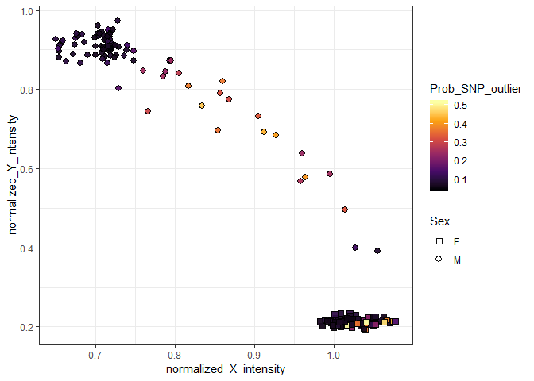
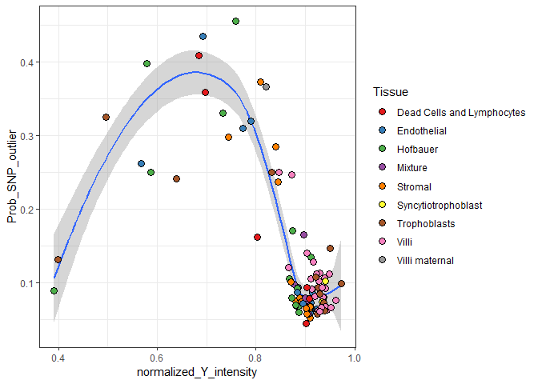
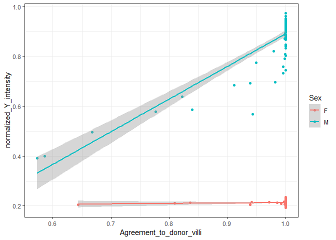
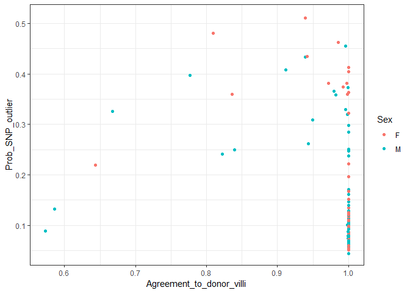
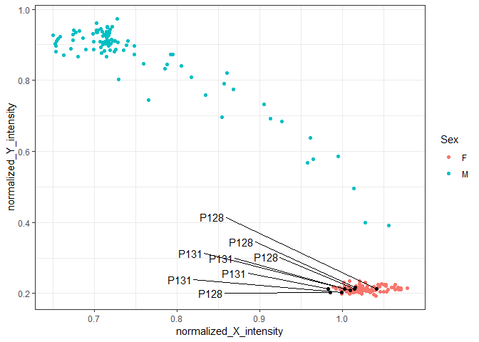
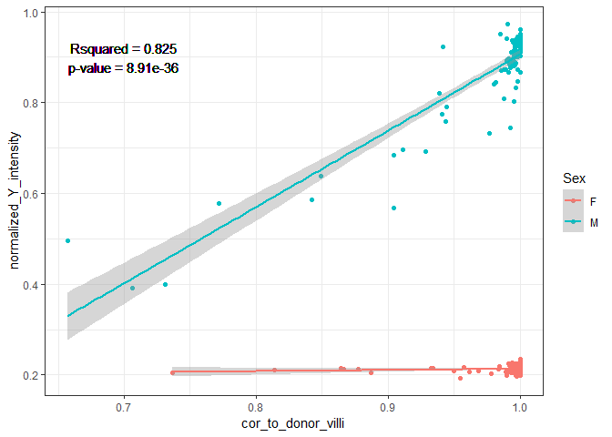
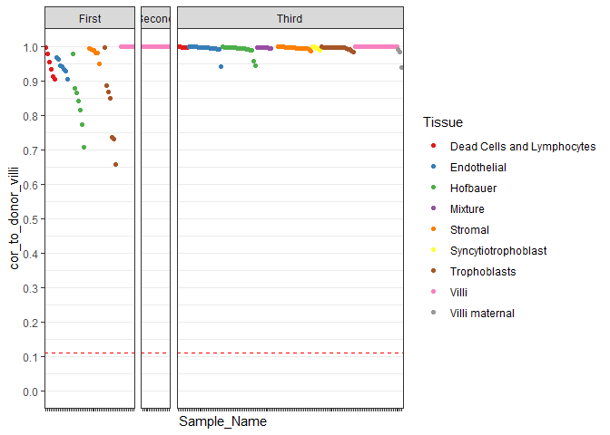
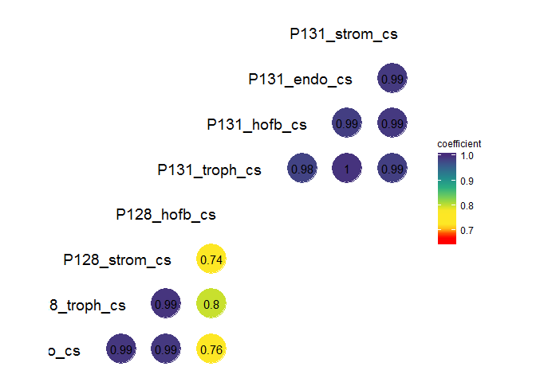
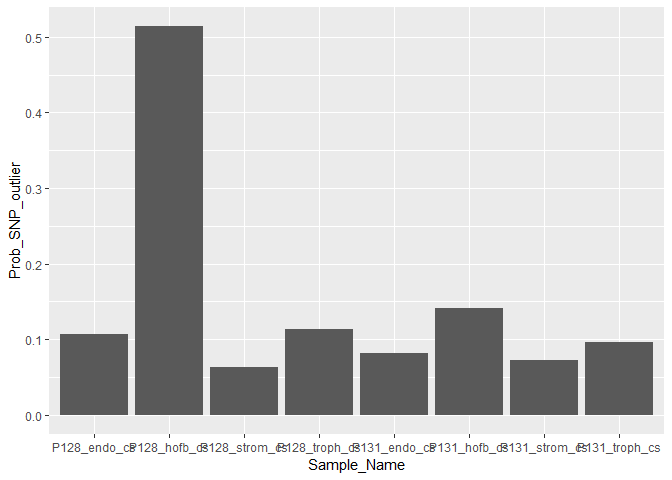

# Setup


```r
library(minfi)
library(ggplot2)
library(dplyr)
library(tidyr)
library(ewastools)
library(ggrepel)
library(viridis)
library(GGally) # for ggcorr
source('../check_snp_agreement2.R') # code to return all agreement scores

pDat <- readRDS('../../data/main/interim/11_pDat.rds')

# called genotypes
snps_called <- readRDS('../../data/main/interim/11_snps_called.rds')


cor_snp <- readRDS('../../data/main/interim/11_cor_matrix_snp_betas.rds')
```

# Limitations of inferring contamination

Normalized Y intensity only applicable for male samples
Probability snp outlier only linearly correlated with the minority genotype


```r
ggplot(pDat, aes(x = normalized_X_intensity, y = normalized_Y_intensity, 
                 fill = Prob_SNP_outlier)) +
  geom_point(aes(shape = Sex), size = 2.5, alpha = 0.95) +
  scale_shape_manual(values = c('M' = 21, 'F' = 22)) +
  theme_bw() +
  scale_fill_viridis_c(option = 'inferno')
```

<!-- -->

```r
ggplot(pDat %>% filter(Sex == 'M'), 
       aes(x = normalized_Y_intensity, y = Prob_SNP_outlier, fill = Prob_SNP_outlier)) +
  geom_point(shape = 21, color = 'black', size = 3) + 
  geom_smooth(method = 'loess')+
  theme_bw() +
  scale_fill_viridis_c(option = 'inferno') 
```

<!-- -->

```r
ggplot(pDat %>% filter(Sex == 'M'), 
       aes(x = normalized_Y_intensity, y = Prob_SNP_outlier)) +
  geom_smooth(method = 'loess')+
  geom_point(shape = 21, color = 'black', size = 3, aes(fill = Tissue)) + 
  theme_bw() +
  scale_fill_brewer(palette = 'Set1')
```

<!-- -->

# Agreement between inferred snps

**Motivation**: Based on previous data, villi are relatively clean (see snp distributions in QC report). Therefore, we can safely assume that fetal genotype is represented by the villi samples. Deviations from villi genotypes, therefore should be a proxy for maternal contamination.

**The measure of maternal contamination:** Based on the probability each sample for each snp is belonging to one of three genotypes, we can determine the proportion of SNPs that agree between all pairwise comparisons between samples. Grouping comparison to those between a villi sample and other samples from the same placenta, we can gain a measure of maternal contamination (assuming that deviation from fetal genotype is always maternal).

To do this, I turn to two approaches. #1 involves using the output of ewastools::check_snp_agreement,
and #2 involves correlations on the snp betas.

## ewastools

I edited the `check_snp_agreement` function and saved as `check_snp_agreement2`, so that all comparisons are returned.


```r
# original function
check_snp_agreement(snps_called, donor_ids = pDat$Case_ID, sample_ids = pDat$Sample_Name) 
```

```
## $`1`
##    donor1 sample1 donor2       sample2 agreement
## 1:  PL290 PL290_v  PL290 PL290_hofb_cs 0.8093798
## 
## $`2`
##    donor1 sample1 donor2        sample2 agreement
## 1:  PL296 PL296_v  PL296  PL296_hofb_cs 0.7767398
## 2:  PL296 PL296_v  PL296 PL296_troph_cs 0.6671205
## 
## $`3`
##    donor1        sample1 donor2        sample2 agreement
## 1:  PL289  PL289_hofb_cs  PL289        PL289_v 0.5728336
## 2:  PL289  PL289_hofb_cs  PL289 PL289_strom_cs 0.8074485
## 3:  PL289        PL289_v  PL289 PL289_troph_cs 0.5854478
## 4:  PL289 PL289_strom_cs  PL289 PL289_troph_cs 0.8279103
## 
## $`4`
##    donor1        sample1 donor2       sample2 agreement
## 1:  PL292 PL292_troph_cs  PL292       PL292_v 0.8221942
## 2:  PL292        PL292_v  PL292 PL292_hofb_cs 0.8394129
## 
## $`5`
##    donor1          sample1 donor2       sample2 agreement
## 1:  PL293 PL293_discard_cs  PL293 PL293_endo_cs 0.8831524
## 
## $`6`
##    donor1 sample1 donor2        sample2 agreement
## 1:  PL294 PL294_v  PL294  PL294_hofb_cs 0.8358081
## 2:  PL294 PL294_v  PL294 PL294_troph_cs 0.6434783
## 
## $`7`
##    donor1       sample1 donor2      sample2 agreement
## 1:   P128  P128_endo_cs   P128 P128_hofb_cs 0.7945382
## 2:   P128 P128_troph_cs   P128 P128_hofb_cs 0.8385738
## 3:   P128 P128_strom_cs   P128 P128_hofb_cs 0.7808438
```

```r
# percent of SNPs concordant 
agreement <- check_snp_agreement2(snps_called, threshold = F, return = 'within-donor',
                                  donor_ids = pDat$Case_ID, sample_ids = pDat$Sample_Name) 

# Filter to within donor group comparisons
agreement <- agreement %>% 
  left_join(pDat %>% select(Sample_Name, Tissue, Prob_SNP_outlier), 
            by = c('sample2' = 'Sample_Name')) %>%
  rename(Tissue2 = Tissue, P_outlier2 = Prob_SNP_outlier) %>%
  left_join(pDat %>% select(Sample_Name, Tissue, Prob_SNP_outlier), 
            by = c('sample1' = 'Sample_Name')) %>%
  rename(Tissue1 = Tissue, P_outlier1 = Prob_SNP_outlier) %>%
  filter(Tissue1 == 'Villi' | Tissue2 == 'Villi') %>%
  select(contains('1'), contains('2'), everything()) %>% as_tibble %>%
  arrange(donor1, donor2, sample1, sample2)

# swap columns such that villi is always in 'sample1'
agreement <- agreement %>% 
  mutate(sample_reference = case_when(Tissue1 == 'Villi' ~ sample1,
                                      Tissue2 == 'Villi' ~ sample2), 
         sample_query = case_when(Tissue1 == 'Villi' ~ sample2,
                                  Tissue2 == 'Villi' ~ sample1),
         
         tissue_query = case_when(Tissue1 == 'Villi' ~ Tissue2,
                                  Tissue2 == 'Villi' ~ Tissue1)) %>%
  rename(donor = donor1) %>%
  select(sample_reference, sample_query, tissue_query, 
         donor, agreement, contains('outlier')) %>%
  arrange(donor, tissue_query) %>%

# average agreement scores when comparing to replicate villi samples
  group_by(donor, tissue_query) %>%
  mutate(agreement_ave = mean(agreement)) %>% ungroup() %>%
  select(sample_query, agreement_ave) %>%
  distinct()

# add to pData
pDat <- pDat %>% 
  left_join(agreement, by = c('Sample_Name' = 'sample_query')) %>%
  rename(Agreement_to_donor_villi = agreement_ave) 
```

For a reference I compare to the average agreement of samples to non-donor samples


```r
# return comparisons for ALL samples
agreement <- check_snp_agreement2(snps_called, threshold = F, return = 'all',
                                  donor_ids = pDat$Case_ID, sample_ids = pDat$Sample_Name) 

# filter to out of donor sample  comparisons 
agreement <- agreement %>% as_tibble() %>%
  filter(donor1 != donor2) %>%
  
  # duplicate the rows so that all comparisons are represented in sample1 column
  bind_rows(agreement %>% rename(donor1 = donor2, sample1 = sample2,
                                 donor2 = donor1, sample2 = sample1)) %>%
  arrange(sample1, sample2)

# check that around 180-190 comparisons for each sample 
table(agreement$sample1)
```

```
## 
##         FT100_vc         FT101_vc          FT40_vc          FT42_vc 
##              192              192              192              192 
##          FT47_vc          FT54_vc          FT58_vc          FT60_vc 
##              192              192              192              192 
##           FT73_v          FT82_vc          FT89_vc          FT98_vc 
##              192              192              192              192 
##        Mixture 1       Mixture 10       Mixture 11       Mixture 12 
##              186              189              184              191 
##       Mixture 13       Mixture 14        Mixture 2        Mixture 3 
##              192              187              192              192 
##        Mixture 6        Mixture 7        Mixture 8        Mixture 9 
##              192              183              190              185 
##          NTD4_vc     P128_endo_cs     P128_hofb_cs    P128_strom_cs 
##              192              189              192              191 
##    P128_troph_cs     P131_endo_cs     P131_hofb_cs    P131_strom_cs 
##              190              191              190              192 
##    P131_troph_cs         PL148_vc         PL149_vc         PL158_vc 
##              189              192              192              192 
## PL289_discard_cs    PL289_endo_cs    PL289_hofb_cs   PL289_strom_cs 
##              191              188              187              190 
##   PL289_troph_cs          PL289_v PL290_discard_cs    PL290_endo_cs 
##              192              189              188              190 
##    PL290_hofb_cs   PL290_strom_cs   PL290_troph_cs          PL290_v 
##              192              189              191              187 
##    PL292_endo_cs    PL292_hofb_cs   PL292_strom_cs   PL292_troph_cs 
##              188              191              192              189 
##          PL292_v PL293_discard_cs    PL293_endo_cs    PL293_hofb_cs 
##              190              190              191              187 
##   PL293_strom_cs   PL293_troph_cs       PL293_v_R1       PL293_v_R2 
##              186              189              192              188 
## PL294_discard_cs    PL294_endo_cs    PL294_hofb_cs   PL294_strom_cs 
##              187              191              189              190 
##   PL294_troph_cs          PL294_v PL295_discard_cs    PL295_endo_cs 
##              192              188              187              190 
##    PL295_hofb_cs   PL295_strom_cs   PL295_troph_cs          PL295_v 
##              191              189              188              192 
## PL296_discard_cs    PL296_endo_cs    PL296_hofb_cs   PL296_strom_cs 
##              190              189              188              191 
##   PL296_troph_cs          PL296_v         PM139_vc         PM324_V1 
##              192              187              192              191 
##         PM324_V4    PM359_endo_cs    PM359_hofb_cs   PM359_strom_cs 
##              192              192              188              190 
##   PM359_troph_cs         PM359_vc    PM362_endo_cs    PM362_hofb_cs 
##              189              191              191              192 
##   PM362_strom_cs   PM362_troph_cs         PM362_vc    PM364_endo_cs 
##              190              188              189              191 
##    PM364_hofb_cs   PM364_strom_cs   PM364_troph_cs         PM364_vc 
##              188              192              190              189 
##    PM365_endo_cs    PM365_hofb_cs   PM365_strom_cs   PM365_troph_cs 
##              188              192              191              190 
##         PM365_vc    PM366_endo_cs    PM366_hofb_cs   PM366_strom_cs 
##              189              188              189              185 
##       PM366_tro2   PM366_troph_cs      PM366_vc_R1      PM366_vc_R2 
##              190              187              191              192 
##    PM367_endo_cs    PM367_hofb_cs   PM367_strom_cs   PM367_troph_cs 
##              192              191              189              188 
##         PM367_vc    PM368_endo_cs    PM368_hofb_cs   PM368_strom_cs 
##              190              191              192              190 
##   PM368_troph_cs         PM368_vc    PM369_endo_cs    PM369_hofb_cs 
##              188              189              188              191 
##   PM369_strom_cs   PM369_troph_cs         PM369_vc PM370_discard_cs 
##              189              192              190              188 
##    PM370_endo_cs    PM370_hofb_cs   PM370_strom_cs   PM370_troph_cs 
##              192              187              191              189 
##         PM370_vc    PM371_endo_cs    PM371_hofb_cs   PM371_strom_cs 
##              190              189              188              191 
##   PM371_troph_cs         PM371_vc PM372_discard_cs    PM372_endo_cs 
##              192              190              192              182 
##    PM372_hofb_cs         PM372_mv   PM372_strom_cs       PM372_tro2 
##              187              188              190              184 
##   PM372_troph_cs         PM372_vc PM373_discard_cs    PM373_endo_cs 
##              189              186              185              187 
##    PM373_hofb_cs   PM373_strom_cs       PM373_tro2   PM373_troph_cs 
##              186              191              188              190 
##         PM373_vc PM374_discard_cs    PM374_endo_cs    PM374_hofb_cs 
##              189              190              186              192 
##   PM374_strom_cs       PM374_tro2   PM374_troph_cs         PM374_vc 
##              188              185              189              191 
## PM375_discard_cs    PM375_endo_cs    PM375_hofb_cs         PM375_mv 
##              183              188              185              192 
##   PM375_strom_cs       PM375_tro2   PM375_troph_cs         PM375_vc 
##              186              187              189              191 
## PM376_discard_cs    PM376_endo_cs    PM376_hofb_cs         PM376_mv 
##              190              192              187              188 
##   PM376_strom_cs   PM376_troph_cs         PM376_vc    PM377_endo_cs 
##              186              191              185              188 
##    PM377_hofb_cs   PM377_strom_cs   PM377_troph_cs         PM377_vc 
##              190              192              189              191 
##    PM378_endo_cs    PM378_hofb_cs   PM378_strom_cs   PM378_troph_cs 
##              189              190              192              191 
##         PM378_vc    PM379_endo_cs    PM379_hofb_cs   PM379_strom_cs 
##              188              192              189              191 
##   PM379_troph_cs         PM379_vc    PM381_endo_cs    PM381_hofb_cs 
##              190              188              188              191 
##   PM381_strom_cs   PM381_troph_cs         PM381_vc          PM77_vc 
##              189              190              192              192
```

```r
# calculate average out of donor SNP agreement scores
agreement <- agreement %>% group_by(sample1) %>%
  summarize(Agreement_to_unrelated = mean(agreement))

pDat <- pDat %>% left_join(agreement, by = c('Sample_Name' = 'sample1')) 

# plot agremeent scores
pDat %>% arrange(Tissue, desc(Agreement_to_donor_villi)) %>% 
  mutate(Sample_Name = factor(as.character(Sample_Name), levels = Sample_Name)) %>%
  ggplot(aes(x = Sample_Name, y = Agreement_to_donor_villi, color = Tissue)) +
  geom_point() +
  scale_color_brewer(palette = 'Set1') +
  scale_y_continuous(limits = c(0,1), breaks = seq(0,1, 0.1)) +
  geom_hline(yintercept = mean(pDat$Agreement_to_unrelated), linetype = 'dashed', color = 'red')  +
  facet_grid(~Trimester, scales = 'free_x', space = 'free_x') +
  theme_bw() +
  theme(axis.text.x = element_blank(),
        panel.grid.minor.x = element_blank(),
        panel.grid.major.x = element_blank())
```

```
## Warning: Removed 11 rows containing missing values (geom_point).
```

<!-- -->

How does this compare to previous measures of contamination?


```r
ggplot(pDat, aes(x = Agreement_to_donor_villi, y = normalized_Y_intensity, color = Sex)) +
  geom_point() + theme_bw() +
  geom_smooth(method = 'lm')
```

```
## Warning: Removed 11 rows containing non-finite values (stat_smooth).
```

```
## Warning: Removed 11 rows containing missing values (geom_point).
```

<!-- -->

```r
ggplot(pDat, aes(x = Agreement_to_donor_villi, y = Prob_SNP_outlier, color = Sex)) +
  geom_point() + theme_bw()
```

```
## Warning: Removed 11 rows containing missing values (geom_point).
```

<!-- -->

In males, SNP agreement to villi is highly correlated with normalized Y intensity.

probability of having SNPs being outliers shows the mountain shaped pattern described previously.

The limitation of this approach, however, is that this requires a clean reference.


```r
# samples without sex information
ggplot(pDat, aes(x = normalized_X_intensity, y= normalized_Y_intensity, color = Sex)) +
  geom_point() + theme_bw() +
  geom_text_repel(data = pDat %>% filter(Case_ID %in% c('P131', 'P128')),
             aes(x = normalized_X_intensity, y= normalized_Y_intensity, label = Case_ID),
             color = 'black', nudge_x = -0.15, nudge_y = 0.1, force = 25)+
  geom_point(data = pDat %>% filter(Case_ID %in% c('P131', 'P128')),
             aes(x = normalized_X_intensity, y= normalized_Y_intensity),
             color = 'black')
```

<!-- -->

## Correlation to donor villi

The idea here is the same, except instead of posterior probabilities on the snp probes, we use the
pairwise correlations on the snp betas. 


```r
# correlation to donor villi
cor_to_donor_villi <- cor_snp %>% as_tibble() %>% mutate(Sample1 = rownames(cor_snp)) %>% 
  left_join(pDat %>% select(Sample_Name, Case_ID, Tissue), by = c('Sample1' = 'Sample_Name')) %>%
  tidyr::gather(key = 'Sample2', value = 'Cor', -Sample1, -Case_ID, -Tissue) %>%
  dplyr::rename(Case_ID1 = Case_ID, Tissue1 = Tissue) %>%
  left_join(pDat %>% select(Sample_Name, Case_ID, Tissue), by = c('Sample2' = 'Sample_Name')) %>%
  dplyr::rename(Case_ID2 = Case_ID, Tissue2 = Tissue) %>% 
  filter(Case_ID1 == Case_ID2, Tissue2 == 'Villi') %>%
  group_by(Sample1) %>%
  summarize(cor_to_donor_villi = mean(Cor))

pDat <- pDat %>% left_join(cor_to_donor_villi, by = c('Sample_Name' = 'Sample1'))

# correlation to unrelated samples
cor_to_unrelated <- cor_snp %>% as_tibble() %>% mutate(Sample1 = rownames(cor_snp)) %>% 
  left_join(pDat %>% select(Sample_Name, Case_ID, Tissue), by = c('Sample1' = 'Sample_Name')) %>%
  tidyr::gather(key = 'Sample2', value = 'Cor', -Sample1, -Case_ID, -Tissue) %>%
  dplyr::rename(Case_ID1 = Case_ID, Tissue1 = Tissue) %>%
  left_join(pDat %>% select(Sample_Name, Case_ID, Tissue), by = c('Sample2' = 'Sample_Name')) %>%
  dplyr::rename(Case_ID2 = Case_ID, Tissue2 = Tissue) %>% 
  filter(Case_ID1 != Case_ID2) %>%
  group_by(Sample1) %>%
  summarize(cor_to_unrelated = mean(Cor))

pDat <- pDat %>% left_join(cor_to_unrelated, by = c('Sample_Name' = 'Sample1'))

# correlation to donor villi compared to unrelated
pDat %>% select(cor_to_donor_villi, cor_to_unrelated) %>% gather() %>%
  ggplot(aes(x = key, y = value)) + theme_bw() + geom_boxplot()
```

```
## Warning: Removed 11 rows containing non-finite values (stat_boxplot).
```

<!-- -->

```r
# correlation to other measures of contamination
ggplot(pDat, aes(x = cor_to_donor_villi, y = Agreement_to_donor_villi)) +
  geom_point() + theme_bw() +stat_smooth(method = 'lm')
```

```
## Warning: Removed 11 rows containing non-finite values (stat_smooth).
```

```
## Warning: Removed 11 rows containing missing values (geom_point).
```

<!-- -->

```r
fit <- lm(cor_to_donor_villi ~ normalized_Y_intensity, data = pDat %>% filter(Sex == 'M'))
fit <- summary(fit)
ggplot(pDat, aes(x = cor_to_donor_villi, y = normalized_Y_intensity, color = Sex)) + 
  geom_point() + theme_bw()+stat_smooth(method = 'lm') +
  geom_text(x = 0.7, y = 0.9, color = 'black',
            label = paste0('Rsquared = ', prettyNum(fit$r.squared, digits = 3), 
                           '\np-value = ', prettyNum(fit$coefficients[2,4], digits = 3)))
```

```
## Warning: Removed 11 rows containing non-finite values (stat_smooth).

## Warning: Removed 11 rows containing missing values (geom_point).
```

<!-- -->

```r
pDat %>% arrange(Tissue, desc(cor_to_donor_villi)) %>% 
  mutate(Sample_Name = factor(as.character(Sample_Name), levels = Sample_Name)) %>%
  ggplot(aes(x = Sample_Name, y = cor_to_donor_villi, color = Tissue)) +
  geom_point() +
  scale_color_brewer(palette = 'Set1') +
  scale_y_continuous(limits = c(0,1), breaks = seq(0,1, 0.1)) +
  facet_grid(~Trimester, scales = 'free_x', space = 'free_x') +
  theme_bw() +
  theme(axis.text.x = element_blank(),
        panel.grid.minor.x = element_blank(),
        panel.grid.major.x = element_blank()) +
  geom_hline(yintercept = mean(pDat$cor_to_unrelated), linetype = 'dashed', color = 'red')
```

```
## Warning: Removed 11 rows containing missing values (geom_point).
```

<!-- -->

Because we are missing villi samples for two first trimester cases, we are also missing inferred
contamination information. However, if we inspect the pairwise correlations, we can see it's likely
OK to pick a different cell type to serve as reference for fetal genotype. Also, based on the other
samples, we can see that first trimester stromal and endothelial cells are less often contaminated.


```r
ind <- pDat %>% 
  add_count(Case_ID) %>%
  filter(Case_ID %in% c('P128', 'P131'))  %>%
  arrange(n, Case_ID) %>%
  pull(Sample_Name)

# plot settings
label_size <- 5
point_size <- 13
r_size <- 4
colors <- c('red', 'red', rev(viridis_pal(option = 'D')(9))[c(1,1,1:8)])
r_limit <- c(0.65,1)

ggcorr(data = NULL, cor_matrix = cor_snp[ind,ind], 
             geom = 'blank', name = expression(rho), size = label_size, hjust = 0.95) +
  geom_point(aes(col = coefficient), size = point_size) +
  geom_text(data = function(x) dplyr::filter(x, coefficient > r_limit[1]), 
            aes(label = prettyNum(coefficient, digits = 2)),
            size = r_size) +
  scale_color_gradientn(colours = colors, 
                        limits = r_limit, na.value = 'white')
```

<!-- -->

```r
ggplot(pDat %>% filter(Sample_Name %in% ind), aes(x = Sample_Name, y = Prob_SNP_outlier)) +
  geom_bar(stat = 'identity')
```

<!-- -->

```r
# check to agreement scores
agreement <- check_snp_agreement2(snps_called, threshold = F, return = 'all',
                                  donor_ids = pDat$Case_ID, sample_ids = pDat$Sample_Name) 
agreement %>% filter(donor1 %in% c('P128', 'P131') | donor2 %in% c('P128', '131'), donor1 == donor2)
```

```
##    donor1       sample1 donor2       sample2 agreement
## 1    P131 P131_troph_cs   P131 P131_troph_cs 1.0000000
## 2    P131 P131_troph_cs   P131  P131_hofb_cs 1.0000000
## 3    P131 P131_troph_cs   P131  P131_endo_cs 1.0000000
## 4    P131 P131_troph_cs   P131 P131_strom_cs 1.0000000
## 5    P131  P131_hofb_cs   P131  P131_hofb_cs 1.0000000
## 6    P131  P131_hofb_cs   P131  P131_endo_cs 1.0000000
## 7    P131  P131_hofb_cs   P131 P131_strom_cs 1.0000000
## 8    P131  P131_endo_cs   P131  P131_endo_cs 1.0000000
## 9    P131  P131_endo_cs   P131 P131_strom_cs 1.0000000
## 10   P128  P128_endo_cs   P128  P128_endo_cs 1.0000000
## 11   P128  P128_endo_cs   P128 P128_troph_cs 1.0000000
## 12   P128  P128_endo_cs   P128 P128_strom_cs 1.0000000
## 13   P128  P128_endo_cs   P128  P128_hofb_cs 0.7945382
## 14   P128 P128_troph_cs   P128 P128_troph_cs 1.0000000
## 15   P128 P128_troph_cs   P128 P128_strom_cs 1.0000000
## 16   P128 P128_troph_cs   P128  P128_hofb_cs 0.8385738
## 17   P128 P128_strom_cs   P128 P128_strom_cs 1.0000000
## 18   P128 P128_strom_cs   P128  P128_hofb_cs 0.7808438
## 19   P131 P131_strom_cs   P131 P131_strom_cs 1.0000000
## 20   P128  P128_hofb_cs   P128  P128_hofb_cs 1.0000000
```

Below I recompute correlations for all samples, making sure that for these two first trimester 
samples, I use stromal cells to serve as the reference genotype (Whereas villi is used for all 
other samples).


```r
cor_to_reference <- cor_snp %>% as_tibble() %>% mutate(Sample1 = rownames(cor_snp)) %>% 
  left_join(pDat %>% select(Sample_Name, Case_ID, Tissue), by = c('Sample1' = 'Sample_Name')) %>%
  tidyr::gather(key = 'Sample2', value = 'Cor', -Sample1, -Case_ID, -Tissue) %>%
  dplyr::rename(Case_ID1 = Case_ID, Tissue1 = Tissue) %>%
  left_join(pDat %>% select(Sample_Name, Case_ID, Tissue), by = c('Sample2' = 'Sample_Name')) %>%
  dplyr::rename(Case_ID2 = Case_ID, Tissue2 = Tissue) %>% 
  filter(Case_ID1 == Case_ID2, 
         Tissue2 == 'Villi' | (Case_ID2 %in% c('P128', 'P131') & Tissue2 == 'Stromal')) %>%
  group_by(Sample1) %>%
  summarize(cor_to_reference = mean(Cor))

pDat <- pDat %>% left_join(cor_to_reference, by = c('Sample_Name' = 'Sample1'))


pDat %>% arrange(Tissue, desc(cor_to_reference)) %>% 
  mutate(Sample_Name = factor(as.character(Sample_Name), levels = Sample_Name)) %>%
  ggplot(aes(x = Sample_Name, y = cor_to_reference, color = Tissue)) +
  geom_point() +
  scale_color_brewer(palette = 'Set1') +
  scale_y_continuous(limits = c(0,1), breaks = seq(0,1, 0.1)) +
  facet_grid(~Trimester, scales = 'free_x', space = 'free_x') +
  theme_bw() +
  theme(axis.text.x = element_blank(),
        panel.grid.minor.x = element_blank(),
        panel.grid.major.x = element_blank()) +
  geom_hline(yintercept = mean(pDat$cor_to_unrelated), linetype = 'dashed', color = 'red')
```

```
## Warning: Removed 3 rows containing missing values (geom_point).
```

<!-- -->

# SessionINfo


```r
sessionInfo()
```

```
## R version 3.6.0 (2019-04-26)
## Platform: x86_64-w64-mingw32/x64 (64-bit)
## Running under: Windows Server x64 (build 14393)
## 
## Matrix products: default
## 
## locale:
## [1] LC_COLLATE=English_Canada.1252  LC_CTYPE=English_Canada.1252   
## [3] LC_MONETARY=English_Canada.1252 LC_NUMERIC=C                   
## [5] LC_TIME=English_Canada.1252    
## 
## attached base packages:
## [1] stats4    parallel  stats     graphics  grDevices utils     datasets 
## [8] methods   base     
## 
## other attached packages:
##  [1] GGally_1.4.0                viridis_0.5.1              
##  [3] viridisLite_0.3.0           ggrepel_0.8.1              
##  [5] ewastools_1.5               tidyr_0.8.3                
##  [7] dplyr_0.8.1                 ggplot2_3.1.1              
##  [9] minfi_1.30.0                bumphunter_1.26.0          
## [11] locfit_1.5-9.1              iterators_1.0.10           
## [13] foreach_1.4.4               Biostrings_2.52.0          
## [15] XVector_0.24.0              SummarizedExperiment_1.14.0
## [17] DelayedArray_0.10.0         BiocParallel_1.17.18       
## [19] matrixStats_0.54.0          Biobase_2.43.1             
## [21] GenomicRanges_1.36.0        GenomeInfoDb_1.20.0        
## [23] IRanges_2.18.0              S4Vectors_0.22.0           
## [25] BiocGenerics_0.29.2        
## 
## loaded via a namespace (and not attached):
##  [1] colorspace_1.4-1         siggenes_1.58.0         
##  [3] mclust_5.4.3             base64_2.0              
##  [5] bit64_0.9-7              AnnotationDbi_1.46.0    
##  [7] xml2_1.2.0               codetools_0.2-16        
##  [9] splines_3.6.0            scrime_1.3.5            
## [11] knitr_1.22               Rsamtools_2.0.0         
## [13] annotate_1.62.0          HDF5Array_1.12.1        
## [15] readr_1.3.1              compiler_3.6.0          
## [17] httr_1.4.0               assertthat_0.2.1        
## [19] Matrix_1.2-17            lazyeval_0.2.2          
## [21] limma_3.40.0             htmltools_0.3.6         
## [23] prettyunits_1.0.2        tools_3.6.0             
## [25] igraph_1.2.4.1           gtable_0.3.0            
## [27] glue_1.3.1               GenomeInfoDbData_1.2.1  
## [29] reshape2_1.4.3           doRNG_1.7.1             
## [31] Rcpp_1.0.1               multtest_2.40.0         
## [33] preprocessCore_1.46.0    nlme_3.1-140            
## [35] rtracklayer_1.44.0       DelayedMatrixStats_1.6.0
## [37] xfun_0.6                 stringr_1.4.0           
## [39] rngtools_1.3.1.1         XML_3.98-1.19           
## [41] beanplot_1.2             zlibbioc_1.30.0         
## [43] MASS_7.3-51.4            scales_1.0.0            
## [45] hms_0.4.2                rhdf5_2.28.0            
## [47] GEOquery_2.52.0          RColorBrewer_1.1-2      
## [49] yaml_2.2.0               memoise_1.1.0           
## [51] gridExtra_2.3            pkgmaker_0.27           
## [53] biomaRt_2.40.0           reshape_0.8.8           
## [55] stringi_1.4.3            RSQLite_2.1.1           
## [57] genefilter_1.66.0        GenomicFeatures_1.36.0  
## [59] bibtex_0.4.2             rlang_0.3.4             
## [61] pkgconfig_2.0.2          bitops_1.0-6            
## [63] nor1mix_1.2-3            evaluate_0.13           
## [65] lattice_0.20-38          purrr_0.3.2             
## [67] Rhdf5lib_1.6.0           GenomicAlignments_1.20.0
## [69] labeling_0.3             bit_1.1-14              
## [71] tidyselect_0.2.5         plyr_1.8.4              
## [73] magrittr_1.5             R6_2.4.0                
## [75] DBI_1.0.0                pillar_1.4.0            
## [77] withr_2.1.2              survival_2.44-1.1       
## [79] RCurl_1.95-4.12          tibble_2.1.1            
## [81] crayon_1.3.4             rmarkdown_1.12.7        
## [83] progress_1.2.0           grid_3.6.0              
## [85] data.table_1.12.2        blob_1.1.1              
## [87] digest_0.6.18            xtable_1.8-4            
## [89] illuminaio_0.26.0        openssl_1.3             
## [91] munsell_0.5.0            registry_0.5-1          
## [93] askpass_1.1              quadprog_1.5-7
```

# save data

```r
pDat <- pDat %>% 
  select(Sample_Name:Prob_SNP_outlier_Logodds, 
         Agreement_to_donor_villi:cor_to_reference,
         PC1_raw:PC20_raw)
saveRDS(pDat, '../../data/main/interim/13_pDat.rds')
```
