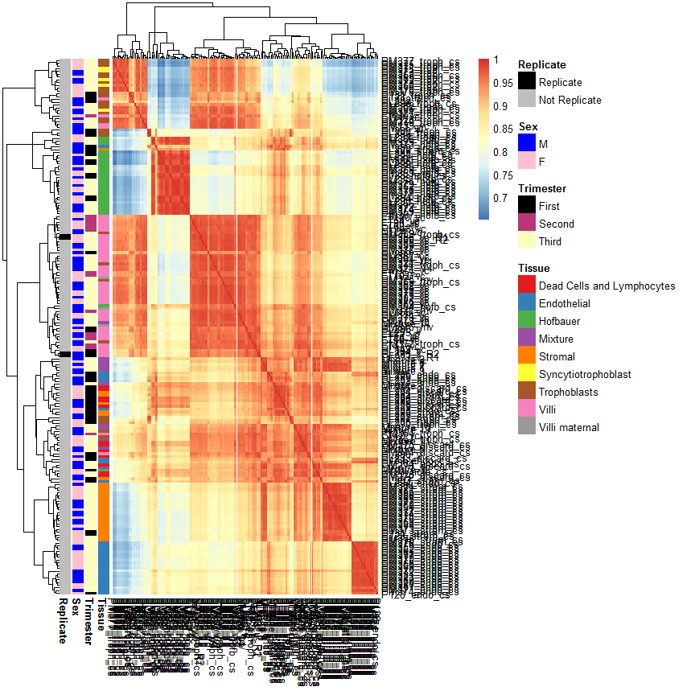

# 1.0 Libraries


```r
# libraries and data
library(ggplot2)
library(dplyr)
library(tidyr)
library(ggrepel)
library(viridis)
library(RColorBrewer)
library(GGally) # for ggcorr
library(minfi)
library(impute)
library(pheatmap)
library(irlba)
library(yahew) # github.com/wvictor14/yahew

# for noob normalization
library(IlluminaHumanMethylationEPICmanifest)
library(IlluminaHumanMethylationEPICanno.ilm10b4.hg19)

# pdata
pDat <- readRDS('../../data/main/interim/13_pDat.rds')

# raw methylation data
rgset <- readRDS('../../data/main/interim/01_rgset_raw.rds')
betas_raw <- getBeta(rgset)
probe_anno <- readRDS('../../data/main/interim/11_probe_anno.rds')

# snp data
snp_betas <- readRDS('../../data/main/interim/11_snp_betas.rds')

# annotation
zhou_anno <- readRDS('Z:/Victor/Data/DNAm annotations/zhou2017_EPIC.hg19.manifest.rds') 
```

# 2.0 Processing

## Normalization

Here I use noob normalization to correct for background noise and dye-bias.


```r
mset_noob <- preprocessNoob(rgset)

# pull betas
betas_noob <- getBeta(mset_noob)
```

saveRDS(mset_noob, '../../data/main/interim/14_mset_noob.rds')


```r
mset_noob <- readRDS('../../data/main/interim/14_mset_noob.rds')
betas_noob <- getBeta(mset_noob)
```

## Filtering

 remove probes with > 5% observations failed
 remove probes CH probes
 separate XY probes 


```r
# unfiltered autosomal probes
ind_probe_unfilt <- probe_anno %>% 
  filter(remove_XY == F) %>%
  pull(probe_ID)

#filtered autosomal probes
ind_probe_filt <- probe_anno %>% 
  filter(remove_XY == F & (remove_failed == F & remove_CH_SNP == F)) %>% 
  pull(probe_ID)

# unfiltered XY probes
ind_probe_unfilt_XY <- probe_anno %>%
  filter(remove_XY == T) %>%
  pull(probe_ID)
  
# filtered XY probes
ind_probe_filt_XY <- probe_anno %>%
  filter(remove_XY == T & (remove_failed == F & remove_CH_SNP == F)) %>% 
  pull(probe_ID)


# filter
betas_raw <- betas_raw[ind_probe_unfilt,]
betas_noob_unfilt <- betas_noob[ind_probe_unfilt,]
betas_noob_filt <- betas_noob[ind_probe_filt,]

betas_raw_XY <- betas_raw[ind_probe_unfilt,]
betas_noob_unfilt_XY <- betas_noob[ind_probe_unfilt_XY,]
betas_noob_filt_XY <- betas_noob[ind_probe_filt_XY,]

data.frame(number_of_probes = c(nrow(betas_noob), nrow(betas_noob_unfilt), nrow(betas_noob_filt),
                                nrow(betas_noob_unfilt_XY), nrow(betas_noob_filt_XY)),
           step = c('all probes', 'all autosomal', 'filtered autosomal', 'all XY', 'filtered XY'),
           object_name = c('betas_noob / betas_raw', 'betas_noob_unfilt', 'betas_noob_filt', 
                           'betas_noob_unfilt_XY / betas_raw_XY', 'betas_noob_filt_XY'))
```

```
##   number_of_probes               step                         object_name
## 1           866091         all probes              betas_noob / betas_raw
## 2           846460      all autosomal                   betas_noob_unfilt
## 3           737050 filtered autosomal                     betas_noob_filt
## 4            19631             all XY betas_noob_unfilt_XY / betas_raw_XY
## 5            16681        filtered XY                  betas_noob_filt_XY
```

# 3.0 Compare processing steps

## Beta distributions

Sample 80000 rows and plot, takes about 1 minute to plot


```r
set.seed(1)

# filter and melt 
x <- betas_raw[sample.int(nrow(betas_raw), size = 80000),] %>% as_tibble() %>%
  gather() %>% 
  left_join(pDat %>% select(Sentrix, Tissue, Trimester), by = c('key' = 'Sentrix')) %>%
  mutate(stage = 'Raw')
y <- betas_noob_unfilt[sample.int(nrow(betas_noob_unfilt), 80000),] %>% as_tibble() %>%
  gather() %>% 
  left_join(pDat %>% select(Sentrix, Tissue, Trimester), by = c('key' = 'Sentrix')) %>%
  mutate(stage = 'Noob')
z <- betas_noob_filt[sample.int(nrow(betas_noob_filt), 80000),] %>% as_tibble() %>%
  gather() %>% 
  left_join(pDat %>% select(Sentrix, Tissue, Trimester), by = c('key' = 'Sentrix')) %>%
  mutate(stage = 'Noob, Filtered')

# combine
densities <- x %>%
  bind_rows(y) %>%
  bind_rows(z)

#plot
ggplot(densities, aes(x = value, col = stage)) +
  geom_density() + theme_bw() + labs(x = 'Beta', col = '', title = '80000 random probes') +
  facet_grid(Tissue ~ Trimester)
```

```
## Warning: Removed 711 rows containing non-finite values (stat_density).
```

<!-- -->

## Replicates


```r
cor_raw <- cor(na.omit(betas_raw))
cor_noob_unfilt <- cor(na.omit(betas_noob_unfilt))
cor_noob_filt <- cor(na.omit(betas_noob_filt))

colnames(cor_raw) <- rownames(cor_raw) <- pDat$Sample_Name
colnames(cor_noob_unfilt) <- rownames(cor_noob_unfilt) <- pDat$Sample_Name
colnames(cor_noob_filt) <- rownames(cor_noob_filt) <- pDat$Sample_Name

pheatmap_anno <- pDat %>% mutate(Replicate = ifelse(grepl('_R', Sample_Name), 'Replicate', 
                                                    'Not Replicate')) %>%
  select(Tissue, Trimester, Sex, Replicate) %>%
  as.data.frame()
rownames(pheatmap_anno) <- pDat$Sample_Name

heatmap_cols <- list(
  Replicate = c('Replicate' = 'Black', 'Not Replicate' = 'Grey'),
  Sex = c('M' = 'Blue', 'F' = 'Pink'),
  Trimester =  setNames(viridis_pal(option = 'A')(3), levels(factor(pDat$Trimester))),
  Tissue = setNames(brewer.pal(9, name = 'Set1'), levels(factor(pDat$Tissue)))
)

pheatmap(cor_raw, annotation_row = pheatmap_anno,
         annotation_colors = heatmap_cols)
```

<!-- -->

```r
pheatmap(cor_noob_unfilt, annotation_row = pheatmap_anno,
         annotation_colors = heatmap_cols)
```

<!-- -->

```r
pheatmap(cor_noob_filt, annotation_row = pheatmap_anno,
         annotation_colors = heatmap_cols)
```

<!-- -->

```r
cor_raw['PL293_v_R1','PL293_v_R2'] # 0.9900
```

```
## [1] 0.9900465
```

```r
cor_noob_unfilt['PL293_v_R1','PL293_v_R2'] # 0.9927
```

```
## [1] 0.9926938
```

```r
cor_noob_filt['PL293_v_R1','PL293_v_R2'] # 0.9933
```

```
## [1] 0.9933326
```

```r
cor_raw['PM366_vc_R1','PM366_vc_R2'] # 0.9961
```

```
## [1] 0.9960764
```

```r
cor_noob_unfilt['PM366_vc_R1','PM366_vc_R2'] # 0.9971
```

```
## [1] 0.9970692
```

```r
cor_noob_filt['PM366_vc_R1','PM366_vc_R2'] # 0.9972
```

```
## [1] 0.9972198
```

## PCA


```r
# calculate pca
set.seed(2019)
pca_norm_filt <- prcomp_irlba(t(na.omit(betas_noob_filt)), n = 20)

# rename columns
pca_norm_filt_scores <-pca_norm_filt$x %>% as_tibble() %>% mutate(Sample_Name = pDat$Sample_Name) 
colnames(pca_norm_filt_scores)[1:20] <- paste0(colnames(pca_norm_filt_scores)[1:20], '_norm_filt')

# factorize some variables encoded as numeric
pDat <- pDat %>%
  mutate(Week = as.factor(as.character(Week)),
         Chip_number = as.factor(as.character(Chip_number)),
         Row = as.factor(as.character(Row)))
  
# correlate with phenodata
pca_norm_filt_cor <- lmmatrix(dep = pca_norm_filt_scores[,1:20],
                        ind = pDat %>% 
                          dplyr::select(Case_ID, Tissue, Sex, Trimester, #bio
                                        Week, Chip_number, Row, Batch_BSC, # batch 
                                        DNA_conc_BSC_adjusted, DNA_conc_before_load, DNA_loaded,
                                        failed_probes, Flag_Sex, Flag_genotype,
                                        Agreement_to_donor_villi), 
                        metric = 'Pvalue')
# plot
pca_norm_filt_plot <- pca_norm_filt_cor %>% as.data.frame() %>% 
  
  # add dep variables
  mutate(dep = rownames(pca_norm_filt_cor)) %>%
  
  # reshape
  gather(PC, pval, -dep) %>%
  
  # pvalue categories
  mutate(pval_cat = factor(case_when(
    pval > 0.05  ~ '> 0.05',
    pval < 0.05 & pval > 0.01 ~ '< 0.05',
    pval < 0.01 & pval > 0.001 ~ '< 0.01',
    pval < 0.001 ~ '< 0.001'
  ), levels = c('> 0.05', '< 0.05','< 0.01', '< 0.001')),
  
  # make PC is encoded with proper levels!!!
  PC = factor(PC, levels = colnames(pca_norm_filt_cor))) %>% as_tibble()

# create color palette
colpal <- c('white', '#fee8c8', '#fdbb84', '#e34a33')
names(colpal) <- levels(pca_norm_filt_plot$pval_cat)

p1 <- ggplot(pca_norm_filt_plot, aes(x = PC, y = dep, fill = pval_cat)) +
  geom_tile(col = 'lightgrey') + theme_bw() +
  scale_x_discrete(expand = c(0, 0), labels = 1:20) +
  scale_y_discrete(expand = c(0, 0)) +
  scale_fill_manual(values = colpal)  + 
  labs(y = '', fill = 'P value') + coord_equal();p1
```

<!-- -->

```r
# calculate proportion variance
prop_var <- tibble(Prop_var_norm_filt = pca_norm_filt$sdev^2 *100 / pca_norm_filt$totalvar,
                   PC = 1:20)
p1b <- ggplot(prop_var, aes(x = PC, y = Prop_var_norm_filt)) +
  geom_bar(stat = 'identity') + theme_bw() + labs(y = '% variance') +
  scale_x_continuous(breaks = 1:20);p1b
```

<!-- -->

# 4.0 Save data


```r
saveRDS(betas_noob_filt, '../../data/main/interim/14_betas_noob_filt.rds')
```

# SessionInfo


```r
sessionInfo()
```

```
## R version 3.6.0 (2019-04-26)
## Platform: x86_64-w64-mingw32/x64 (64-bit)
## Running under: Windows Server x64 (build 14393)
## 
## Matrix products: default
## 
## locale:
## [1] LC_COLLATE=English_Canada.1252  LC_CTYPE=English_Canada.1252   
## [3] LC_MONETARY=English_Canada.1252 LC_NUMERIC=C                   
## [5] LC_TIME=English_Canada.1252    
## 
## attached base packages:
## [1] stats4    parallel  stats     graphics  grDevices utils     datasets 
## [8] methods   base     
## 
## other attached packages:
##  [1] IlluminaHumanMethylationEPICanno.ilm10b4.hg19_0.6.0
##  [2] IlluminaHumanMethylationEPICmanifest_0.3.0         
##  [3] yahew_0.1.0                                        
##  [4] irlba_2.3.3                                        
##  [5] Matrix_1.2-17                                      
##  [6] pheatmap_1.0.12                                    
##  [7] impute_1.58.0                                      
##  [8] minfi_1.30.0                                       
##  [9] bumphunter_1.26.0                                  
## [10] locfit_1.5-9.1                                     
## [11] iterators_1.0.10                                   
## [12] foreach_1.4.4                                      
## [13] Biostrings_2.52.0                                  
## [14] XVector_0.24.0                                     
## [15] SummarizedExperiment_1.14.0                        
## [16] DelayedArray_0.10.0                                
## [17] BiocParallel_1.17.18                               
## [18] matrixStats_0.54.0                                 
## [19] Biobase_2.43.1                                     
## [20] GenomicRanges_1.36.0                               
## [21] GenomeInfoDb_1.20.0                                
## [22] IRanges_2.18.0                                     
## [23] S4Vectors_0.22.0                                   
## [24] BiocGenerics_0.29.2                                
## [25] GGally_1.4.0                                       
## [26] RColorBrewer_1.1-2                                 
## [27] viridis_0.5.1                                      
## [28] viridisLite_0.3.0                                  
## [29] ggrepel_0.8.1                                      
## [30] tidyr_0.8.3                                        
## [31] dplyr_0.8.1                                        
## [32] ggplot2_3.1.1                                      
## 
## loaded via a namespace (and not attached):
##  [1] colorspace_1.4-1         siggenes_1.58.0         
##  [3] mclust_5.4.3             base64_2.0              
##  [5] bit64_0.9-7              AnnotationDbi_1.46.0    
##  [7] xml2_1.2.0               codetools_0.2-16        
##  [9] splines_3.6.0            scrime_1.3.5            
## [11] knitr_1.22               Rsamtools_2.0.0         
## [13] annotate_1.62.0          HDF5Array_1.12.1        
## [15] readr_1.3.1              compiler_3.6.0          
## [17] httr_1.4.0               assertthat_0.2.1        
## [19] lazyeval_0.2.2           limma_3.40.0            
## [21] htmltools_0.3.6          prettyunits_1.0.2       
## [23] tools_3.6.0              gtable_0.3.0            
## [25] glue_1.3.1               GenomeInfoDbData_1.2.1  
## [27] reshape2_1.4.3           doRNG_1.7.1             
## [29] Rcpp_1.0.1               multtest_2.40.0         
## [31] preprocessCore_1.46.0    nlme_3.1-140            
## [33] rtracklayer_1.44.0       DelayedMatrixStats_1.6.0
## [35] xfun_0.6                 stringr_1.4.0           
## [37] rngtools_1.3.1.1         XML_3.98-1.19           
## [39] beanplot_1.2             zlibbioc_1.30.0         
## [41] MASS_7.3-51.4            scales_1.0.0            
## [43] hms_0.4.2                rhdf5_2.28.0            
## [45] GEOquery_2.52.0          yaml_2.2.0              
## [47] memoise_1.1.0            gridExtra_2.3           
## [49] pkgmaker_0.27            biomaRt_2.40.0          
## [51] reshape_0.8.8            stringi_1.4.3           
## [53] RSQLite_2.1.1            genefilter_1.66.0       
## [55] GenomicFeatures_1.36.0   bibtex_0.4.2            
## [57] rlang_0.3.4              pkgconfig_2.0.2         
## [59] bitops_1.0-6             nor1mix_1.2-3           
## [61] evaluate_0.13            lattice_0.20-38         
## [63] purrr_0.3.2              Rhdf5lib_1.6.0          
## [65] labeling_0.3             GenomicAlignments_1.20.0
## [67] bit_1.1-14               tidyselect_0.2.5        
## [69] plyr_1.8.4               magrittr_1.5            
## [71] R6_2.4.0                 DBI_1.0.0               
## [73] pillar_1.4.0             withr_2.1.2             
## [75] survival_2.44-1.1        RCurl_1.95-4.12         
## [77] tibble_2.1.1             crayon_1.3.4            
## [79] rmarkdown_1.12.7         progress_1.2.0          
## [81] grid_3.6.0               data.table_1.12.2       
## [83] blob_1.1.1               digest_0.6.18           
## [85] xtable_1.8-4             illuminaio_0.26.0       
## [87] openssl_1.3              munsell_0.5.0           
## [89] registry_0.5-1           askpass_1.1             
## [91] quadprog_1.5-7
```
