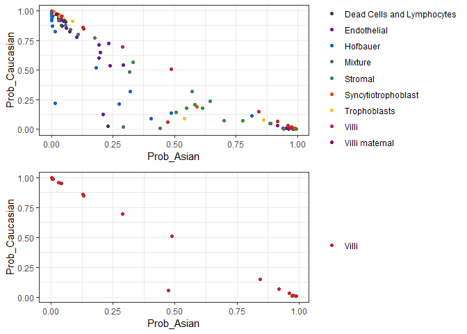

For adding ethnicity/ancestry information to the samples, 


```r
library(planet)
library(minfi)
```

```
## Warning: package 'minfi' was built under R version 3.5.2
```

```
## Loading required package: BiocGenerics
```

```
## Loading required package: parallel
```

```
## 
## Attaching package: 'BiocGenerics'
```

```
## The following objects are masked from 'package:parallel':
## 
##     clusterApply, clusterApplyLB, clusterCall, clusterEvalQ,
##     clusterExport, clusterMap, parApply, parCapply, parLapply,
##     parLapplyLB, parRapply, parSapply, parSapplyLB
```

```
## The following objects are masked from 'package:stats':
## 
##     IQR, mad, sd, var, xtabs
```

```
## The following objects are masked from 'package:base':
## 
##     anyDuplicated, append, as.data.frame, basename, cbind,
##     colMeans, colnames, colSums, dirname, do.call, duplicated,
##     eval, evalq, Filter, Find, get, grep, grepl, intersect,
##     is.unsorted, lapply, lengths, Map, mapply, match, mget, order,
##     paste, pmax, pmax.int, pmin, pmin.int, Position, rank, rbind,
##     Reduce, rowMeans, rownames, rowSums, sapply, setdiff, sort,
##     table, tapply, union, unique, unsplit, which, which.max,
##     which.min
```

```
## Loading required package: GenomicRanges
```

```
## Loading required package: stats4
```

```
## Loading required package: S4Vectors
```

```
## 
## Attaching package: 'S4Vectors'
```

```
## The following object is masked from 'package:base':
## 
##     expand.grid
```

```
## Loading required package: IRanges
```

```
## 
## Attaching package: 'IRanges'
```

```
## The following object is masked from 'package:grDevices':
## 
##     windows
```

```
## Loading required package: GenomeInfoDb
```

```
## Warning: package 'GenomeInfoDb' was built under R version 3.5.2
```

```
## Loading required package: SummarizedExperiment
```

```
## Loading required package: Biobase
```

```
## Welcome to Bioconductor
## 
##     Vignettes contain introductory material; view with
##     'browseVignettes()'. To cite Bioconductor, see
##     'citation("Biobase")', and for packages 'citation("pkgname")'.
```

```
## Loading required package: DelayedArray
```

```
## Loading required package: matrixStats
```

```
## Warning: package 'matrixStats' was built under R version 3.5.2
```

```
## 
## Attaching package: 'matrixStats'
```

```
## The following objects are masked from 'package:Biobase':
## 
##     anyMissing, rowMedians
```

```
## Loading required package: BiocParallel
```

```
## Warning: package 'BiocParallel' was built under R version 3.5.2
```

```
## 
## Attaching package: 'DelayedArray'
```

```
## The following objects are masked from 'package:matrixStats':
## 
##     colMaxs, colMins, colRanges, rowMaxs, rowMins, rowRanges
```

```
## The following objects are masked from 'package:base':
## 
##     aperm, apply
```

```
## Loading required package: Biostrings
```

```
## Warning: package 'Biostrings' was built under R version 3.5.2
```

```
## Loading required package: XVector
```

```
## 
## Attaching package: 'Biostrings'
```

```
## The following object is masked from 'package:DelayedArray':
## 
##     type
```

```
## The following object is masked from 'package:base':
## 
##     strsplit
```

```
## Loading required package: bumphunter
```

```
## Loading required package: foreach
```

```
## Warning: package 'foreach' was built under R version 3.5.2
```

```
## Loading required package: iterators
```

```
## Warning: package 'iterators' was built under R version 3.5.2
```

```
## Loading required package: locfit
```

```
## Warning: package 'locfit' was built under R version 3.5.2
```

```
## locfit 1.5-9.1 	 2013-03-22
```

```
## Setting options('download.file.method.GEOquery'='auto')
```

```
## Setting options('GEOquery.inmemory.gpl'=FALSE)
```

```r
library(wateRmelon)
```

```
## Loading required package: limma
```

```
## 
## Attaching package: 'limma'
```

```
## The following object is masked from 'package:BiocGenerics':
## 
##     plotMA
```

```
## Loading required package: methylumi
```

```
## Loading required package: scales
```

```
## Warning: package 'scales' was built under R version 3.5.2
```

```
## Loading required package: reshape2
```

```
## Warning: package 'reshape2' was built under R version 3.5.2
```

```
## Loading required package: ggplot2
```

```
## Warning: package 'ggplot2' was built under R version 3.5.2
```

```
## Loading required package: FDb.InfiniumMethylation.hg19
```

```
## Loading required package: GenomicFeatures
```

```
## Warning: package 'GenomicFeatures' was built under R version 3.5.2
```

```
## Loading required package: AnnotationDbi
```

```
## Loading required package: TxDb.Hsapiens.UCSC.hg19.knownGene
```

```
## Loading required package: org.Hs.eg.db
```

```
## 
```

```
## Loading required package: lumi
```

```
## 
## Attaching package: 'lumi'
```

```
## The following objects are masked from 'package:methylumi':
## 
##     estimateM, getHistory
```

```
## Loading required package: ROC
```

```
## Loading required package: IlluminaHumanMethylation450kanno.ilmn12.hg19
```

```
## Loading required package: illuminaio
```

```r
library(IlluminaHumanMethylationEPICmanifest)
library(dplyr)
```

```
## Warning: package 'dplyr' was built under R version 3.5.2
```

```
## 
## Attaching package: 'dplyr'
```

```
## The following object is masked from 'package:lumi':
## 
##     combine
```

```
## The following object is masked from 'package:methylumi':
## 
##     combine
```

```
## The following object is masked from 'package:AnnotationDbi':
## 
##     select
```

```
## The following object is masked from 'package:minfi':
## 
##     combine
```

```
## The following objects are masked from 'package:Biostrings':
## 
##     collapse, intersect, setdiff, setequal, union
```

```
## The following object is masked from 'package:XVector':
## 
##     slice
```

```
## The following object is masked from 'package:matrixStats':
## 
##     count
```

```
## The following object is masked from 'package:Biobase':
## 
##     combine
```

```
## The following objects are masked from 'package:GenomicRanges':
## 
##     intersect, setdiff, union
```

```
## The following object is masked from 'package:GenomeInfoDb':
## 
##     intersect
```

```
## The following objects are masked from 'package:IRanges':
## 
##     collapse, desc, intersect, setdiff, slice, union
```

```
## The following objects are masked from 'package:S4Vectors':
## 
##     first, intersect, rename, setdiff, setequal, union
```

```
## The following objects are masked from 'package:BiocGenerics':
## 
##     combine, intersect, setdiff, union
```

```
## The following objects are masked from 'package:stats':
## 
##     filter, lag
```

```
## The following objects are masked from 'package:base':
## 
##     intersect, setdiff, setequal, union
```

```r
library(egg)
```

```
## Warning: package 'egg' was built under R version 3.5.3
```

```
## Loading required package: gridExtra
```

```
## Warning: package 'gridExtra' was built under R version 3.5.3
```

```
## 
## Attaching package: 'gridExtra'
```

```
## The following object is masked from 'package:dplyr':
## 
##     combine
```

```
## The following object is masked from 'package:lumi':
## 
##     combine
```

```
## The following object is masked from 'package:methylumi':
## 
##     combine
```

```
## The following object is masked from 'package:minfi':
## 
##     combine
```

```
## The following object is masked from 'package:Biobase':
## 
##     combine
```

```
## The following object is masked from 'package:BiocGenerics':
## 
##     combine
```

```r
mset_noob <- readRDS('../../data/main/interim/14_mset_noob.rds')
rgset <- readRDS('../../data/main/interim/01_rgset_raw.rds')
pDat <- readRDS('../../data/main/interim/13_pDat.rds')
color_code <- readRDS('../../data/main/interim/11_color_code.rds')
color_code_tissue <- setNames(color_code[[1]]$Colors_Tissue, color_code[[1]]$Tissue)
```


```r
set.seed(1)
betas_bmiq <- BMIQ(mset_noob, nfit = 100000)
```

saveRDS(betas_bmiq, '../../data/main/interim/16_bmiq.rds')


```r
betas_bmiq <- readRDS('../../data/main/interim/16_bmiq.rds')
```


```r
#combine snps
snps <- getSnpBeta(rgset)
data <- rbind(betas_bmiq, snps)
dim(data) # 866150    192
```

```
## [1] 866150    192
```

```r
all(pl_ethnicity_features %in% rownames(data)) #T
```

```
## [1] TRUE
```

```r
colnames(data) <- pDat$Sample_Name

results <- pl_infer_ethnicity(data)
```

```
## [1] "1860 of 1860 predictors present."
```

```r
results$Sample_Name <- pDat$Sample_Name

# add to pData
pDat <- pDat %>% left_join(results %>% select(-Highest_Prob, Predicted_ethnicity))
```

```
## Joining, by = "Sample_Name"
```

# Small analysis


```r
# distribution of calls
pDat %>% filter(Tissue == 'Villi') %>% group_by(Trimester) %>% count(Predicted_ethnicity)
```

```
## # A tibble: 7 x 3
## # Groups:   Trimester [3]
##   Trimester Predicted_ethnicity     n
##   <chr>     <chr>               <int>
## 1 First     Ambiguous               5
## 2 First     Caucasian               3
## 3 Second    Asian                   4
## 4 Second    Caucasian              12
## 5 Third     Ambiguous               3
## 6 Third     Asian                  10
## 7 Third     Caucasian              11
```

```r
# distribution of probabilities, for all samples, including cells
ggplot(pDat, aes(x = Prob_Asian, y = Prob_Caucasian, color = Tissue)) +
  geom_point() + theme_bw() +
  facet_wrap(~Trimester) +
  scale_color_manual(values= color_code_tissue[unique(pDat$Tissue)])
```

<!-- -->

```r
# just villi
pDat %>% 
  filter(Tissue == 'Villi') %>%
  ggplot(aes(x = Prob_Asian, y = Prob_Caucasian)) +
  geom_point() + theme_bw() + labs(title ='Just Villi') +
  facet_wrap(~Trimester)
```

<!-- -->

```r
# just first trimester, by case
pDat %>% filter(Trimester == 'First') %>% {
  ggplot(data = ., aes(x = Prob_Asian, y = Prob_Caucasian, color = Tissue)) +
  geom_point() + theme_bw() +
  facet_wrap(~Case_ID) +
  scale_color_manual(values= color_code_tissue[unique(.$Tissue)])
}
```

<!-- -->

```r
# just third trimester, by case
pDat %>% filter(Trimester == 'Third') %>%
  ggplot(aes(x = Prob_Asian, y = Prob_Caucasian, color = Tissue)) +
  geom_point() + theme_bw() +
  facet_wrap(~Case_ID) +
  scale_color_manual(values= color_code_tissue[unique(pDat$Tissue)])
```

<!-- -->

```r
# comparing cell predictions and villi
p1 <- pDat %>% filter(Trimester == 'Third') %>%
  ggplot(aes(x = Prob_Asian, y = Prob_Caucasian, color = Tissue)) +
  geom_point() + theme_bw() + labs(color = '') +
  scale_color_manual(values= color_code_tissue[unique(pDat$Tissue)]);p1
```

<!-- -->

```r
p2 <- pDat %>% filter(Trimester == 'Third', Tissue == 'Villi') %>%
  ggplot(aes(x = Prob_Asian, y = Prob_Caucasian, color = Tissue)) +
  geom_point() + theme_bw() + labs(color = '') +
  scale_color_manual(values= color_code_tissue['Villi']);p2
```

<!-- -->

```r
ggarrange(p1, p2)
```

<!-- -->

Saving the results for all tissues, in case I want to investigate further later.

For term analysis, I need to use the predicted ethnicity for villi samples only.


```r
pDat_1 <- readRDS('../../data/main/interim/21_pDat_term_cells.rds')

res <- pDat %>% 
  filter(Trimester == 'Third', Tissue == 'Villi') %>% 
  select(Case_ID, contains('ethnicity'), Prob_African, Prob_Asian, Prob_Caucasian)

pDat_1 <- pDat_1 %>% left_join(res, by = 'Case_ID')

p3 <- ggplot(pDat_1, aes(x = Prob_Asian, y = Prob_Caucasian)) +
  geom_point() + theme_bw() 

ggarrange(p2, p3) # should look the same
```

<!-- -->


# Save data


```r
# results for all samples
pDat %>% 
  select(contains('Predicted_ethnicity_nothresh'), Prob_African, Prob_Asian, Prob_Caucasian) %>%
  saveRDS(file = '../../data/main/interim/16_ethnicity_results_all.rds')

# results for term, using villi as final predicted ethnicity
pDat_1 %>%
  saveRDS(file = '../../data/main/interim/16_pDat.rds')
```
