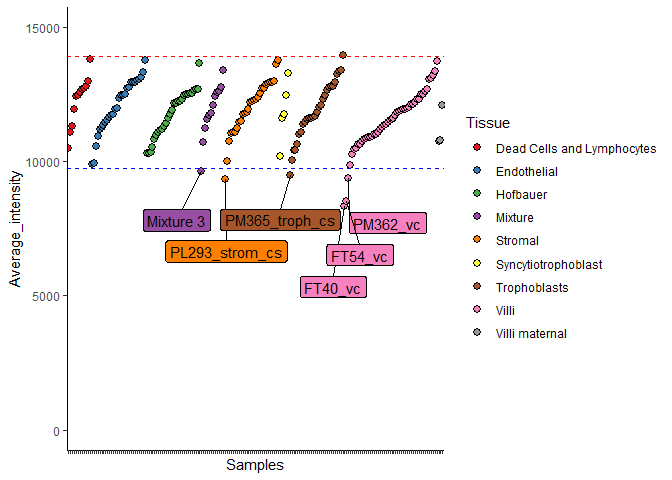
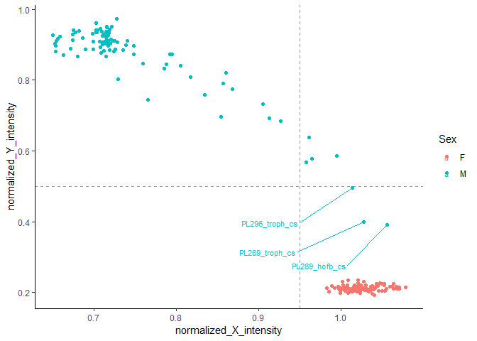
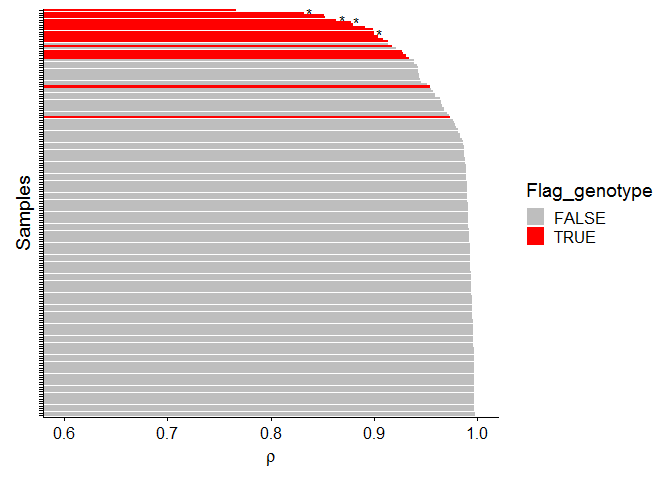
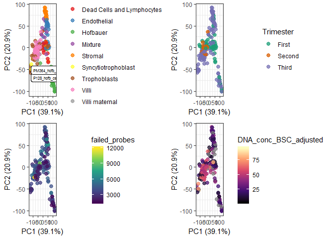

QC week 24 chips, 192 samples

# 1.0 Libraries & data


```r
library(tidyr)
library(plyr)
library(minfi)
library(IlluminaHumanMethylationEPICanno.ilm10b4.hg19)
library(IlluminaHumanMethylationEPICmanifest)
library(ggplot2)
library(ggrepel)
library(irlba)
library(wateRmelon)
library(yahew) #install_github('wvictor14/yahew')
library(RColorBrewer)
library(dplyr)
library(kableExtra)
library(conumee)
library(doParallel)
library(ewastools)
library(stringr)
library(cowplot)
library(dendextend)
library(ggdendro)
library(pheatmap)
library(GGally)
library(grid)
library(yahew) # wvictor14/yahew github
library(umap)
library(egg)
```

Load the data in


```r
rgset <- readRDS('../../data/main/interim/0_1_rgset_raw.rds')
et_meth <- readRDS('../../data/main/interim/0_1_ewastools_loaded_idats.rds')
pDat <- pData(rgset) %>% as_tibble()
```

## 1.1 Colors

Set colors for rest of analysis:

Tissue - Material Design Color Chart htlmcolorcodes.com


```r
#color for tissue
tissue_col <- tibble(
  Tissue = sort(levels(as.factor(pDat$Tissue)))
) %>%
  mutate(Colors_Tissue = c('#424242', '#6A1B9A', '#1565C0',
                           '#546E7A', '#388E3C',    '#E64A19',
                           '#FBC02D', '#C62828', '#880E4F'))

scales::show_col(c('#424242', '#6A1B9A', '#1565C0',
                   '#546E7A', '#388E3C',    '#E64A19',
                   '#FBC02D', '#C62828', '#880E4F'))
```

<!-- -->

```r
pDat <- pDat %>% left_join(tissue_col)
```

```
## Joining, by = "Tissue"
```

Sex    - Dulled pink (f) / blue (m)


```r
#color for sex
sex_col <- tibble(
  Sex = sort(levels(as.factor(pDat$Sex)))
) %>%
  mutate(Colors_Sex = c('#F8BBD0', '#BBDEFB'))

scales::show_col(c('#F8BBD0', '#BBDEFB'))
```

<!-- -->

```r
pDat <- pDat %>% left_join(sex_col)
```

```
## Joining, by = "Sex"
```

Trimester - Greyscale, first (light) -> third (dark)


```r
#color for Trimester
trimester_col <- tibble(
  Trimester = sort(levels(as.factor(pDat$Trimester)))
) %>%
  mutate(Colors_Trimester = c('#E0E0E0', '#616161', '#212121'))

scales::show_col(c('#E0E0E0', '#616161', '#212121'))
```

<!-- -->

```r
pDat <- pDat %>% left_join(trimester_col)
```

```
## Joining, by = "Trimester"
```

```r
color_code <- list(tissue_col, sex_col, trimester_col)
```

## 1.2 pData cleaning

Some variables need to be cleaned up


```r
glimpse(pDat)
```

```
## Observations: 192
## Variables: 23
## $ Sample_Name           <chr> "PM365_endo_cs", "PL295_discard_cs", "PL...
## $ Chip_number           <dbl> 25, 25, 25, 25, 25, 25, 25, 25, 26, 26, ...
## $ Row                   <dbl> 1, 2, 3, 4, 5, 6, 7, 8, 1, 2, 3, 4, 5, 6...
## $ Well                  <chr> "A1", "B1", "C1", "D1", "E1", "F1", "G1"...
## $ Case_ID               <chr> "PM365", "PL295", "PL293", "PL292", "FT7...
## $ Sex                   <chr> "F", "F", "M", "M", "F", "F", "F", "M", ...
## $ GA                    <dbl> NA, 11.6, 9.6, 7.1, NA, NA, NA, NA, NA, ...
## $ Trimester             <chr> "Third", "First", "First", "First", "Sec...
## $ DNA_QP                <chr> "542.5", "701.5", "412.5", "151.5", NA, ...
## $ Week                  <dbl> 1, 1, 1, 1, 1, 1, 1, 1, 1, 1, 1, 1, 1, 1...
## $ Sample_Plate          <chr> "WG6980707-MSA4", "WG6980707-MSA4", "WG6...
## $ Tissue                <chr> "Endothelial", "Dead Cells and Lymphocyt...
## $ Sentrix_ID            <dbl> 203067920143, 203067920143, 203067920143...
## $ Sentrix_Position      <chr> "R01C01", "R02C01", "R03C01", "R04C01", ...
## $ Scratches             <chr> NA, NA, NA, NA, NA, NA, NA, NA, NA, NA, ...
## $ Batch_BSC             <chr> "BSC1", "BSC1", "BSC1", "BSC1", "BSC1", ...
## $ DNA_conc_BSC_adjusted <dbl> 30.19, 42.65, 20.99, 8.04, 49.91, 63.22,...
## $ DNA_conc_before_load  <dbl> 50.31667, 42.65000, 52.47500, 20.10000, ...
## $ DNA_loaded            <dbl> 201.2667, 170.6000, 209.9000, 80.4000, 1...
## $ Sentrix               <chr> "203067920143_R01C01", "203067920143_R02...
## $ Colors_Tissue         <chr> "#6A1B9A", "#424242", "#388E3C", "#6A1B9...
## $ Colors_Sex            <chr> "#F8BBD0", "#F8BBD0", "#BBDEFB", "#BBDEF...
## $ Colors_Trimester      <chr> "#212121", "#E0E0E0", "#E0E0E0", "#E0E0E...
```

```r
# 0 concentration means we did not measure
pDat <- pDat %>%
  mutate(DNA_conc_BSC_adjusted = ifelse(DNA_conc_BSC_adjusted == 0, NA, DNA_conc_BSC_adjusted),
         DNA_conc_before_load = ifelse(DNA_conc_before_load == 0, NA, DNA_conc_before_load),
         DNA_loaded = ifelse(DNA_loaded == 0, NA, DNA_loaded)) %>%
  
  mutate(Row_numeric = as.numeric(Row), Row_factor = factor(Row, levels = 1:8),
         DNA_QP = as.numeric(DNA_QP),
         Week = factor(Week, levels = 1:2),
         Chip_number = factor(Chip_number, levels = 25:48)) %>%
  select(-Row)
```

```
## Warning: NAs introduced by coercion
```

# 2.0 Data QC

We start with probe qc to remove any failed measurements before going into sample qc

## 2.1 Detection p-value

Here I test out EWAS tools. It estimates much more probes failing detection p.

In the end I use Minfi's detection p the conventional way.


```r
#call detection p values using empirical negative control probes
et_meth <- ewastools::detectionP(et_meth)

# evaluate the effectiveness of this strategy
eval_detP_cutoffs(et_meth, males = which(pDat$Sex == 'M'), females = which(pDat$Sex == 'F'))

# set failed probes as NA
et_meth <- mask(et_meth, threshold = 0.5)

# get betas
et_beta <- dont_normalize(et_meth)
sum(is.na(et_beta))

pDat <- pDat %>% 
  mutate(detP_01_ewastools = colSums(is.na(et_beta)))

ggplot(pDat, aes(x = Tissue, y = detP_01_ewastools)) +
  geom_boxplot() + geom_point() +coord_flip() + theme_bw() +
  labs(x = '', y = '# of probes with detection p > 0.01')  +
  geom_hline(yintercept = 0.05*nrow(et_beta), linetype ='dashed', color = 'blue') +
  geom_text(aes(x = 0, y = 0.05*nrow(et_beta), label = '5%', vjust = -0.5, hjust = -0.5),
            color = 'blue') +
  geom_hline(yintercept = 0.10*nrow(et_beta), linetype = 'dashed', color = 'red') +
  geom_text(aes(x = 0, y = 0.10*nrow(et_beta), label = '10%', vjust = -0.5, hjust = -0.5),
            color = 'red')  +
  geom_label_repel(data = pDat %>% filter(detP_01_ewastools > 6e+05), 
                  aes(x = Tissue, y = detP_01_ewastools, label = Sample_Name))

ggplot(pDat %>% filter(detP_01_ewastools < 6e+05), 
       aes(x = Tissue, y = detP_01_ewastools)) +
  geom_boxplot() + geom_point() +coord_flip() + theme_bw() +
  labs(x = '', y = 'Number of probes with detection p > 0.01') +
  geom_hline(yintercept = 0.05*nrow(et_beta), linetype ='dashed', color = 'blue') +
  geom_text(aes(x = 0, y = 0.05*nrow(et_beta), label = '5%', vjust = -0.5, hjust = -0.5),
            color = 'blue') +
  geom_hline(yintercept = 0.10*nrow(et_beta), linetype = 'dashed', color = 'red') +
  geom_text(aes(x = 0, y = 0.10*nrow(et_beta), label = '10%', vjust = -0.5, hjust = -0.5),
            color = 'red')  +
  geom_label_repel(data = pDat %>% filter(detP_01_ewastools > 0.05*nrow(et_beta) &
                                         detP_01_ewastools < 6e+05),
                   force = 150, size = 3.5,
                  aes(x = Tissue, y = detP_01_ewastools, label = Sample_Name))
```


```r
#get detp matrix
detp <- minfi::detectionP(rgset)

# detp p > 0.01
x <- colSums(detp > 0.01)
identical(names(x), pDat$Sentrix) #T
```

```
## [1] TRUE
```

```r
pDat$detP_01_minfi <- x

# plot
pDat %>% 
  arrange(Tissue, detP_01_minfi) %>%
  mutate(Sample_Name = factor(as.character(Sample_Name), levels = Sample_Name)) %>%
  ggplot(aes(x = Sample_Name, y = detP_01_minfi, fill = Tissue))+
  geom_point(shape = 21, col = 'black', size = 2.5) + 
  labs(x = 'Samples', y ='',  title = '# of probes with detection p > 0.01')+
  geom_hline(yintercept = 0.005*nrow(detp), linetype ='dashed', color = 'blue') +
  geom_text(aes(x = 0, y = 0.005*nrow(detp)),
            label = '0.5%', vjust = -0.5, hjust = -0.5, color = 'blue') +
  geom_label_repel(data = pDat %>% filter(detP_01_minfi > 0.005*nrow(detp)),
                   aes(x = Sample_Name, y = detP_01_minfi, label = Sample_Name),
                   show.legend = F) +
  scale_y_continuous(limits = c(0, 7000), breaks = seq(0,7000, 1000)) +
  scale_fill_brewer(palette = 'Set1') +
  theme_classic()+
  theme(axis.text.x = element_blank()) 
```

<!-- -->

No samples have > 8500 (1%) of their probes failing detection p

## 2.2 Beadcount


```r
# total bead count per sample
bc <- beadcount(rgset)
colnames(bc) <- gsub('X', '', colnames(bc))

pDat <- pDat %>% mutate(beadcount = colSums(is.na(bc)))

pDat %>% 
  arrange(Tissue, beadcount) %>%
  mutate(Sample_Name = factor(as.character(Sample_Name), levels = Sample_Name)) %>%
  ggplot(aes(x = Sample_Name, y = beadcount, fill = Tissue)) +
  geom_point(shape = 21, col = 'black', size = 2.5) + 
  geom_hline(yintercept = 0.01*nrow(bc), linetype = 'dashed', color = 'red') +
  geom_text(aes(x = 0, y = 0.01*nrow(bc)), 
            label = '1%', vjust = -0.5, hjust = -0.5, color = 'red')+
  geom_label_repel(data = pDat %>% filter(beadcount > 0.01*nrow(detp)),
                   aes(x = Sample_Name, y = beadcount, label = Sample_Name),
                   nudge_y = 1000, force = 15, show.legend = F)+
  scale_fill_brewer(palette = 'Set1') +
  scale_y_continuous(limits = c(0, 12500), breaks = seq(0, 12500, 2500)) +
  labs(x = 'Samples', y = '', title = '# probes with bead count < 3') +
  theme_classic() +
  theme(axis.text.x = element_blank()) 
```

<!-- -->

## 2.3 Detp and bead count


```r
# create a dummy matrix
failed_probes <- matrix(data = F, nrow = nrow(detp), ncol = ncol(detp),
                        dimnames = list(rownames(detp), colnames(detp))) %>% as.data.frame
failed_probes[1:6,1:6]
```

```
##            203067920143_R01C01 203067920143_R02C01 203067920143_R03C01
## cg18478105               FALSE               FALSE               FALSE
## cg09835024               FALSE               FALSE               FALSE
## cg14361672               FALSE               FALSE               FALSE
## cg01763666               FALSE               FALSE               FALSE
## cg12950382               FALSE               FALSE               FALSE
## cg02115394               FALSE               FALSE               FALSE
##            203067920143_R04C01 203067920143_R05C01 203067920143_R06C01
## cg18478105               FALSE               FALSE               FALSE
## cg09835024               FALSE               FALSE               FALSE
## cg14361672               FALSE               FALSE               FALSE
## cg01763666               FALSE               FALSE               FALSE
## cg12950382               FALSE               FALSE               FALSE
## cg02115394               FALSE               FALSE               FALSE
```

```r
# now put 'TRUE' where detp > 0.01, or beadcount is < 3
failed_probes[is.na(bc)] <- T
failed_probes[detp > 0.01] <- T

# now calculate the number of failed probes
pDat <- pDat %>% mutate(failed_probes = colSums(failed_probes))

pDat %>% 
  arrange(Tissue, failed_probes) %>%
  mutate(Sample_Name = factor(as.character(Sample_Name), levels = Sample_Name)) %>%
  ggplot(aes(x = Sample_Name, y = failed_probes, fill = Tissue)) +
  geom_point(shape = 21, col = 'black', size = 2.5) +
  scale_fill_brewer(palette = 'Set1') +
  labs(x = 'Samples', y = '# probes with bead count < 3 or detection p > 0.01') +
  geom_hline(yintercept = 0.01*nrow(failed_probes), linetype = 'dashed', color = 'red') +
  geom_text(aes(x = 0, y = 0.01*nrow(bc)), 
            label = '1%', vjust = -0.5, hjust = -0.5, color = 'red')+
  geom_label_repel(data = pDat %>% filter(failed_probes > 0.01*nrow(detp)),
                   aes(x = Sample_Name, y = failed_probes, label = Sample_Name),
                   force = 100, show.legend = F)+
  theme_classic()+
  theme(axis.text.x = element_blank()) 
```

<!-- -->

Number of probes that had a significant amount of failures:


```r
n <- ncol(rgset)
failed_probes_count <- rowSums(failed_probes)
sum(failed_probes_count > 0.025*n) # > 2.5%, 40844
```

```
## [1] 40844
```

```r
sum(failed_probes_count > 0.05*n) # > 5%, 15249
```

```
## [1] 15249
```

```r
sum(failed_probes_count > 0.10*n) # > 10%, 3982
```

```
## [1] 3982
```

```r
sum(failed_probes_count > 0.15*n) # > 15%, 2095
```

```
## [1] 2095
```

```r
sum(failed_probes_count > 0.20*n) # > 20%, 1376
```

```
## [1] 1376
```

```r
sum(failed_probes_count > 0.25*n) # > 25%, 1022
```

```
## [1] 1022
```

```r
fp_plot <- tibble(Percent_probes_failing = seq(0.025, 1, 0.025)) %>% 
  mutate(Number_probes_remove = 
           sapply(Percent_probes_failing*n, FUN = function(x) sum(failed_probes_count > x)))


ggplot(fp_plot, aes(x = Percent_probes_failing, y = Number_probes_remove)) +
  geom_line() + theme_bw() + scale_x_continuous(breaks = seq(0, 1, 0.05))+
  geom_hline(yintercept = 0.01*nrow(failed_probes), linetype = 'dashed') +
  geom_text(aes(x = 0, y = 0.01*nrow(bc)), 
            label = '1%', vjust = -0.5, hjust = 1) +
  geom_hline(yintercept = 0.025*nrow(failed_probes), linetype = 'dashed') +
  geom_text(aes(x = 0, y = 0.025*nrow(bc)), 
            label = '2.5%', vjust = -0.5, hjust = 0.5) +
  labs(x = 'Threshold of how many (%) observations can fail before removal',
       y = 'Resulting # of probes that will be removed')
```

<!-- -->

```r
sum(failed_probes_count > 0.125*n) # > 12.5%, 2690
```

```
## [1] 2690
```

```r
# add this info to probe annotation
probe_anno <- tibble(probe_ID = rownames(detp)) %>%
  mutate(number_failed_probes = failed_probes_count)
```

## 2.4 Meth and unmeth


```r
mset_raw <- preprocessRaw(rgset)
meth <- getMeth(mset_raw)
unmeth <- getUnmeth(mset_raw)

pDat <- pDat %>% mutate(log2_median_meth = log2(colMedians(meth)), 
                        log2_median_unmeth = log2(colMedians(unmeth)))

ggplot(pDat, aes(x = log2_median_meth, y = log2_median_unmeth)) +
  geom_point() +
  geom_abline(intercept = 10.5*2, slope = -1, col = 'red', linetype = 'dashed') +
  xlim(7.5, 15) + ylim(7.5, 15) + theme_bw()
```

<!-- -->

## 2.5 Average intensity

Average intensity over green and red


```r
green <- getGreen(rgset)
red <- getRed(rgset)
green_red <- green + red

# add to pDat and plot
pDat <- pDat %>% mutate(Average_intensity = colMeans(green_red))

pDat %>% 
  arrange(Tissue, Average_intensity) %>% 
  mutate(Sample_Name = factor(as.character(Sample_Name), levels = Sample_Name)) %>%
  ggplot(aes(x = Sample_Name, y = Average_intensity, fill = Tissue)) +
  geom_point(shape = 21, col = 'black', size = 2.5) + theme_classic() +
  theme(axis.text.x = element_blank()) +
  geom_hline(yintercept = mean(pDat$Average_intensity) - 2*sd(pDat$Average_intensity),
             linetype = 'dashed', col = 'blue')+
  geom_hline(yintercept = mean(pDat$Average_intensity) + 2*sd(pDat$Average_intensity),
             linetype = 'dashed', col = 'red') +
  geom_label_repel(data = pDat %>% 
                    filter(Average_intensity < mean(pDat$Average_intensity) -
                             2*sd(pDat$Average_intensity)),
                  aes(label = Sample_Name), force = 10, nudge_y = -2500, show.legend = F) +
  scale_fill_brewer(palette ='Set1') +
  scale_y_continuous(limits = c(0, 15000)) +
  labs(x = 'Samples')
```

<!-- -->

## 2.5 Control probes

ewastools


```r
#take out control matrix
ctrls <- control_metrics(et_meth)
sample_failure(ctrls) # no failures
```

```
##   [1] FALSE FALSE FALSE FALSE FALSE FALSE FALSE FALSE FALSE FALSE FALSE
##  [12] FALSE FALSE FALSE FALSE FALSE FALSE FALSE FALSE FALSE FALSE FALSE
##  [23] FALSE FALSE FALSE FALSE FALSE FALSE FALSE FALSE FALSE FALSE FALSE
##  [34] FALSE FALSE FALSE FALSE FALSE FALSE FALSE FALSE FALSE FALSE FALSE
##  [45] FALSE FALSE FALSE FALSE FALSE FALSE FALSE FALSE FALSE FALSE FALSE
##  [56] FALSE FALSE FALSE FALSE FALSE FALSE FALSE FALSE FALSE FALSE FALSE
##  [67] FALSE FALSE FALSE FALSE FALSE FALSE FALSE FALSE FALSE FALSE FALSE
##  [78] FALSE FALSE FALSE FALSE FALSE FALSE FALSE FALSE FALSE FALSE FALSE
##  [89] FALSE FALSE FALSE FALSE FALSE FALSE FALSE FALSE FALSE FALSE FALSE
## [100] FALSE FALSE FALSE FALSE FALSE FALSE FALSE FALSE FALSE FALSE FALSE
## [111] FALSE FALSE FALSE FALSE FALSE FALSE FALSE FALSE FALSE FALSE FALSE
## [122] FALSE FALSE FALSE FALSE FALSE FALSE FALSE FALSE FALSE FALSE FALSE
## [133] FALSE FALSE FALSE FALSE FALSE FALSE FALSE FALSE FALSE FALSE FALSE
## [144] FALSE FALSE FALSE FALSE FALSE FALSE FALSE FALSE FALSE FALSE FALSE
## [155] FALSE FALSE FALSE FALSE FALSE FALSE FALSE FALSE FALSE FALSE FALSE
## [166] FALSE FALSE FALSE FALSE FALSE FALSE FALSE FALSE FALSE FALSE FALSE
## [177] FALSE FALSE FALSE FALSE FALSE FALSE FALSE FALSE FALSE FALSE FALSE
## [188] FALSE FALSE FALSE FALSE FALSE
```

```r
# format as dat aframe
controls <- tibble(control = sapply(names(ctrls), 
                                    function(x) paste0(x, '_', 1:192))  %>%
                     as.vector, 
                   Intensity = unlist(ctrls)) %>%
  separate(control, into = c('Control', 'Sample'), sep = '_') %>%
  mutate(Sample = as.numeric(Sample)) %>%
  dplyr::select(Sample, Control, Intensity) %>%
  spread(key = Control, value = Intensity) %>%
  mutate(Sample_Name = pDat$Sample_Name,
         Tissue = pDat$Tissue) %>%
  dplyr::select(Sample_Name, Tissue, everything()) %>%
  dplyr::select(-Sample)

controls_melt <- controls %>%
  gather(key = Control, value = Intensity, -Sample_Name, -Tissue) %>%
  mutate(Control = factor(Control, levels = names(ctrls)))

# thresholds described per the beadchip manual
controls_thresholds <- tibble(
  Control = factor(levels(controls_melt$Control), levels = levels(controls_melt$Control)),
  Intensity = unlist(sapply(ctrls, attributes))
)
  
# plot
controls_melt %>%
  filter(Control %in% levels(Control)[1:6]) %>%
  ggplot(aes(x = Tissue, y = Intensity, fill = Tissue)) +
  geom_boxplot(col = 'black') + 
  theme_classic() +
  theme(axis.text.x = element_blank()) +
  labs(x = '') +
  scale_fill_brewer(palette = 'Set1') +
  facet_wrap(~Control, scales = 'free') +
  scale_y_continuous(limits = c(0,NA)) +
  geom_hline(data = controls_thresholds %>% filter(Control %in% levels(Control)[1:6]),
             aes(yintercept = Intensity), col = 'red', linetype = 'dashed')
```

<!-- -->

```r
controls_melt %>%
  filter(Control %in% levels(Control)[7:12]) %>%
  ggplot(aes(x = Tissue, y = Intensity, fill = Tissue)) +
  geom_boxplot(col = 'black') + 
  theme_classic() +
  theme(axis.text.x = element_blank()) +
  labs(x = '') +
  scale_fill_brewer(palette = 'Set1') +
  facet_wrap(~Control, scales = 'free')+
  scale_y_continuous(limits = c(0,NA))+
  geom_hline(data = controls_thresholds %>% filter(Control %in% levels(Control)[7:12]),
             aes(yintercept = Intensity), col = 'red', linetype = 'dashed')
```

<!-- -->

```r
controls_melt %>%
  filter(Control %in% levels(Control)[13:17]) %>%
  ggplot(aes(x = Tissue, y = Intensity, fill = Tissue)) +
  geom_boxplot(col = 'black') + 
  theme_classic() +
  theme(axis.text.x = element_blank()) +
  labs(x = '') +
  scale_fill_brewer(palette = 'Set1') +
  facet_wrap(~Control, scales = 'free', nrow = 2)+
  scale_y_continuous(limits = c(0,NA)) +
  geom_hline(data = controls_thresholds %>% filter(Control %in% levels(Control)[13:17]),
             aes(yintercept = Intensity), col = 'red', linetype = 'dashed')
```

<!-- -->

## 2.7 remove probes

Here I generate a list of probes to remove based on :
- poor quality probes (high detp, low beadcount)
- cross hybridizing probes (30bp non-unique, non-unique mapping)
- probes with SNPs within 5bp of the CpG site, in probe direction, including CpG and SBE site 


```r
# failed probes, remove if > 5% missing
probe_fail <- probe_anno %>% filter(number_failed_probes > 0.05*n)  %>% pull(probe_ID)
probe_fail %>% length # 15249
```

```
## [1] 15249
```

```r
probe_anno <- probe_anno %>% mutate(remove_failed = ifelse(probe_ID %in% probe_fail, T, F))
sum(probe_anno$remove_failed) # 15249
```

```
## [1] 15249
```

```r
# cross hybridizing AND snp in 5bp of target site, + SBE
# zhou's annotation
zhou_anno <- readRDS('Z:/Victor/Data/DNAm annotations/zhou2017_EPIC.hg19.manifest.rds') 
zhou_anno <- zhou_anno %>% as_tibble() %>% mutate(probe_ID = names(zhou_anno))
glimpse(zhou_anno) # 865,918 
```

```
## Observations: 865,918
## Variables: 58
## $ seqnames                 <fct> chr1, chr1, chr1, chr1, chr1, chr1, c...
## $ start                    <int> 10525, 10848, 10850, 15865, 18827, 29...
## $ end                      <int> 10526, 10849, 10851, 15866, 18828, 29...
## $ width                    <int> 2, 2, 2, 2, 2, 2, 2, 2, 2, 2, 2, 2, 2...
## $ strand                   <fct> -, +, +, -, -, -, -, -, -, +, +, +, -...
## $ address_A                <int> 21611527, 91693541, 82663207, 2665852...
## $ address_B                <int> NA, 47784201, 3701821, 39757192, NA, ...
## $ channel                  <chr> "Both", "Grn", "Grn", "Red", "Both", ...
## $ designType               <chr> "II", "I", "I", "I", "II", "I", "I", ...
## $ nextBase                 <chr> "G/A", "C", "C", "A", "G/A", "A", "T"...
## $ nextBaseRef              <chr> "C", "G", "G", "C", "C", "C", "A", "C...
## $ probeType                <chr> "cg", "cg", "cg", "cg", "cg", "cg", "...
## $ orientation              <chr> "down", "up", "up", "down", "down", "...
## $ probeCpGcnt              <int> 3, 7, 8, 2, 2, 8, 7, 1, 0, 3, 1, 2, 0...
## $ context35                <int> 4, 12, 12, 4, 3, 11, 12, 1, 1, 2, 2, ...
## $ probeBeg                 <int> 10526, 10800, 10802, 15865, 18828, 29...
## $ probeEnd                 <dbl> 10575, 10849, 10851, 15914, 18877, 29...
## $ ProbeSeq_A               <chr> "AAACRAAACTACRTTATCCTCTACACAAATTTCRAT...
## $ ProbeSeq_B               <chr> "", "ACACATACTAACGCGTCGAAATAAAAACGTAA...
## $ gene                     <chr> NA, "DDX11L1", "DDX11L1", "WASH7P", "...
## $ gene_HGNC                <chr> NA, "DDX11L1", "DDX11L1", "WASH7P", "...
## $ chrm_A                   <chr> "chr1", "chr1", "chr1", "chr1", "chr1...
## $ beg_A                    <int> 10526, 10800, 10802, 15865, 18828, 29...
## $ flag_A                   <int> 16, 0, 0, 16, 16, 16, 16, 16, 16, 0, ...
## $ mapQ_A                   <int> 13, 22, 22, 17, 1, 4, 4, 6, 6, 60, 6,...
## $ cigar_A                  <chr> "50M", "50M", "50M", "50M", "50M", "5...
## $ NM_A                     <int> 0, 0, 0, 0, 0, 0, 0, 0, 0, 0, 0, 0, 0...
## $ chrm_B                   <chr> NA, "chr1", "chr1", "chr1", NA, "chr1...
## $ beg_B                    <int> NA, 10800, 10802, 15865, NA, 29407, 2...
## $ flag_B                   <int> NA, 0, 0, 16, NA, 16, 16, NA, NA, NA,...
## $ mapQ_B                   <int> NA, 22, 22, 17, NA, 4, 4, NA, NA, NA,...
## $ cigar_B                  <chr> NA, "50M", "50M", "50M", NA, "50M", "...
## $ NM_B                     <int> NA, 0, 0, 0, NA, 0, 0, NA, NA, NA, NA...
## $ wDecoy_chrm_A            <chr> "chr1", "chr1", "chr1", "chr1", "chr1...
## $ wDecoy_beg_A             <int> 10526, 10800, 10802, 15865, 18828, 29...
## $ wDecoy_flag_A            <int> 16, 0, 0, 16, 16, 16, 16, 16, 16, 0, ...
## $ wDecoy_mapQ_A            <int> 13, 22, 22, 17, 1, 4, 4, 6, 6, 60, 6,...
## $ wDecoy_cigar_A           <chr> "50M", "50M", "50M", "50M", "50M", "5...
## $ wDecoy_NM_A              <int> 0, 0, 0, 0, 0, 0, 0, 0, 0, 0, 0, 0, 0...
## $ wDecoy_chrm_B            <chr> NA, "chr1", "chr1", "chr1", NA, "chr1...
## $ wDecoy_beg_B             <int> NA, 10800, 10802, 15865, NA, 29407, 2...
## $ wDecoy_flag_B            <int> NA, 0, 0, 16, NA, 16, 16, NA, NA, NA,...
## $ wDecoy_mapQ_B            <int> NA, 22, 22, 17, NA, 4, 4, NA, NA, NA,...
## $ wDecoy_cigar_B           <chr> NA, "50M", "50M", "50M", NA, "50M", "...
## $ wDecoy_NM_B              <int> NA, 0, 0, 0, NA, 0, 0, NA, NA, NA, NA...
## $ posMatch                 <lgl> TRUE, TRUE, TRUE, TRUE, TRUE, TRUE, T...
## $ MASK_mapping             <lgl> TRUE, TRUE, TRUE, TRUE, TRUE, TRUE, T...
## $ MASK_typeINextBaseSwitch <lgl> FALSE, FALSE, FALSE, FALSE, FALSE, FA...
## $ MASK_rmsk15              <lgl> TRUE, TRUE, TRUE, FALSE, FALSE, FALSE...
## $ MASK_sub40_copy          <lgl> FALSE, FALSE, FALSE, TRUE, FALSE, FAL...
## $ MASK_sub35_copy          <lgl> FALSE, FALSE, TRUE, TRUE, FALSE, TRUE...
## $ MASK_sub30_copy          <lgl> FALSE, TRUE, TRUE, TRUE, FALSE, TRUE,...
## $ MASK_sub25_copy          <lgl> FALSE, TRUE, TRUE, TRUE, FALSE, TRUE,...
## $ MASK_snp5_common         <lgl> FALSE, FALSE, FALSE, FALSE, FALSE, FA...
## $ MASK_snp5_GMAF1p         <lgl> FALSE, FALSE, FALSE, FALSE, FALSE, FA...
## $ MASK_extBase             <lgl> FALSE, FALSE, FALSE, FALSE, FALSE, FA...
## $ MASK_general             <lgl> TRUE, TRUE, TRUE, TRUE, TRUE, TRUE, T...
## $ probe_ID                 <chr> "cg14817997", "cg26928153", "cg162691...
```

```r
probe_CH_snp <- zhou_anno$probe_ID[zhou_anno$MASK_general == T] 
length(probe_CH_snp) # 99360
```

```
## [1] 99360
```

```r
probe_anno <- probe_anno %>% mutate(remove_CH_SNP = ifelse(probe_ID %in% probe_CH_snp, T, F))
sum(probe_anno$remove_CH_SNP) # 99360
```

```
## [1] 99360
```

```r
# filter to sex probes 
zhou_XY <- zhou_anno %>% filter(seqnames %in% c('chrX', 'chrY')) %>% pull(probe_ID)
zhou_X <- zhou_anno %>% filter(seqnames %in% c('chrX')) %>% pull(probe_ID)
zhou_Y <- zhou_anno %>% filter(seqnames %in% c('chrY')) %>% pull(probe_ID)
XY_probes <- intersect(zhou_XY, rownames(meth))
X_probes <- intersect(zhou_X, rownames(meth))
Y_probes <- intersect(zhou_Y, rownames(meth))

length(zhou_XY) # 19637
```

```
## [1] 19637
```

```r
length(XY_probes) # 19631, 6 xy probes in zhou's anno not in our data
```

```
## [1] 19631
```

```r
# indicate for sex probe
probe_anno <- probe_anno %>% mutate(remove_XY = ifelse(probe_ID %in% zhou_XY, T, F))
sum(probe_anno$remove_XY) # 19631
```

```
## [1] 19631
```

```r
# filter raw betas
remove <- probe_anno %>% 
  filter(remove_failed == T | remove_CH_SNP == T | remove_XY == T) %>%
  pull(probe_ID)
length(remove) # 129041
```

```
## [1] 129041
```

```r
# how many probes removed based on CH and poor quality
probe_anno %>% 
  filter(remove_failed == T | remove_CH_SNP == T) %>% nrow() # 112360
```

```
## [1] 112360
```

```r
betas_raw <- getBeta(rgset)
betas_raw_filt <- betas_raw[setdiff(rownames(betas_raw), remove),]
dim(betas_raw_filt) # 737050 probes
```

```
## [1] 737050    192
```

```r
# XY probes
XY_filt <- probe_anno %>%
  filter(remove_XY == T & remove_failed == F & remove_CH_SNP == F) %>%
  pull(probe_ID)
length(XY_filt) # 16681
```

```
## [1] 16681
```

```r
betas_raw_XY <- betas_raw[XY_filt,]
```

# 3.0 Sample QC

## 3.1 Sex Prediction

1. minfi approach by comparing median intensity of X and Y probes
2. Methylation patterns on XY probes


```r
# calculat total intensities for each probe
MU_total <- meth + unmeth

# calculate median intensity across X and Y probes
pDat <- pDat %>% 
  mutate(median_X_intensity = colMedians(MU_total[X_probes,]),
         median_Y_intensity = colMedians(MU_total[Y_probes,]))
ggplot(pDat, aes(x = median_X_intensity, y = median_Y_intensity, col = Sex)) +
  geom_point() +
  geom_text_repel(data = pDat %>% filter(Sex == 'M', median_Y_intensity < 5000),
                  aes(label = Sample_Name), nudge_x = -3000, force = 15) +
  geom_hline(yintercept = 5000, linetype = 'dashed', col = '#9B9B9B')
```

<!-- -->

3. ewastools check sex


```r
predicted_sex <- check_sex(et_meth)
pDat <- pDat %>% mutate(normalized_X_intensity = predicted_sex$X,
                        normalized_Y_intensity = predicted_sex$Y)
ggplot(pDat, aes(x = normalized_X_intensity, y = normalized_Y_intensity, col = Sex)) +
  geom_point() +theme_classic() +
  geom_text_repel(data = pDat %>% filter(Sex == 'M', normalized_X_intensity > 0.95,
                                         normalized_Y_intensity < 0.5), 
            aes(label = Sample_Name), size = 3, force = 15, nudge_x = -0.1, nudge_y = -0.1) +
  geom_hline(yintercept = 0.5, linetype = 'dashed', col = '#9B9B9B') + 
  geom_vline(xintercept = 0.95, linetype = 'dashed', col = '#9B9B9B')
```

<!-- -->

Flag samples that appear as outliers


```r
pDat <- pDat %>% 
  mutate(Flag_Sex = case_when(
    Sex == 'M' & (normalized_X_intensity > 0.95 & normalized_Y_intensity <0.5) ~ T,
    Sex == 'M' & median_Y_intensity < 5000 ~ T,
    TRUE ~ F))# if not matched then return 
```

## 3.2 Genotype checking

### ewastools

infers genotypes using 3 component mixture models on snp betas, and another 4th component uniform distribution to catch outliers.


```r
#snps <- getSnpBeta(rgset)

#ewastools pipeline
snps <- et_meth$manifest[probe_type=="rs",index]
et_betas <- dont_normalize(et_meth)
snps <- et_betas[snps,]

# fit mixture model to call genotypes
snps_called <- call_genotypes(snps, learn = T)

# call genotype clusters
pDat <- pDat %>% mutate(genotype_cluster = as.factor(enumerate_sample_donors(snps_called)))

# examine probability outlier
plot(snp_outliers(snps_called) %>% sort)
```

<!-- -->

```r
# find any discrepancies
genotype_issues <- check_snp_agreement(snps_called, donor_ids = pDat$Case_ID, 
                                       sample_ids = pDat$Sample_Name)
genotype_issues_df <- do.call("rbind", genotype_issues) %>% as_tibble

# add sex results
genotype_issues_df <- genotype_issues_df %>% 
  left_join(pDat %>% dplyr::select(Sample_Name, Flag_Sex), 
            by = c('sample1' = 'Sample_Name')) %>% rename(Flag_Sex_sample1 = Flag_Sex) %>%
  left_join(pDat %>% dplyr::select(Sample_Name, Flag_Sex), 
            by = c('sample2' = 'Sample_Name'))  %>% rename(Flag_Sex_sample2 = Flag_Sex) %>%
  select(contains('1'), contains('2'), agreement)


# GROUP ROWS
kable(genotype_issues_df %>% select(-contains('donor'))) %>%
   kable_styling(bootstrap_options = c("striped", "hover", "condensed"), full_width = F) %>%
  pack_rows(index = sapply(genotype_issues, nrow), 
            label_row_css = "background-color: #C0C0C0; color: #fff;")
```

<table class="table table-striped table-hover table-condensed" style="width: auto !important; margin-left: auto; margin-right: auto;">
 <thead>
  <tr>
   <th style="text-align:left;"> sample1 </th>
   <th style="text-align:left;"> Flag_Sex_sample1 </th>
   <th style="text-align:left;"> sample2 </th>
   <th style="text-align:left;"> Flag_Sex_sample2 </th>
   <th style="text-align:right;"> agreement </th>
  </tr>
 </thead>
<tbody>
  <tr grouplength="1"><td colspan="5" style="background-color: #C0C0C0; color: #fff;"><strong>1</strong></td></tr>
<tr>
   <td style="text-align:left; padding-left: 2em;" indentlevel="1"> PL290_v </td>
   <td style="text-align:left;"> FALSE </td>
   <td style="text-align:left;"> PL290_hofb_cs </td>
   <td style="text-align:left;"> FALSE </td>
   <td style="text-align:right;"> 0.8093798 </td>
  </tr>
  <tr grouplength="2"><td colspan="5" style="background-color: #C0C0C0; color: #fff;"><strong>2</strong></td></tr>
<tr>
   <td style="text-align:left; padding-left: 2em;" indentlevel="1"> PL296_v </td>
   <td style="text-align:left;"> FALSE </td>
   <td style="text-align:left;"> PL296_hofb_cs </td>
   <td style="text-align:left;"> TRUE </td>
   <td style="text-align:right;"> 0.7767398 </td>
  </tr>
  <tr>
   <td style="text-align:left; padding-left: 2em;" indentlevel="1"> PL296_v </td>
   <td style="text-align:left;"> FALSE </td>
   <td style="text-align:left;"> PL296_troph_cs </td>
   <td style="text-align:left;"> TRUE </td>
   <td style="text-align:right;"> 0.6671205 </td>
  </tr>
  <tr grouplength="4"><td colspan="5" style="background-color: #C0C0C0; color: #fff;"><strong>3</strong></td></tr>
<tr>
   <td style="text-align:left; padding-left: 2em;" indentlevel="1"> PL289_hofb_cs </td>
   <td style="text-align:left;"> TRUE </td>
   <td style="text-align:left;"> PL289_v </td>
   <td style="text-align:left;"> FALSE </td>
   <td style="text-align:right;"> 0.5728336 </td>
  </tr>
  <tr>
   <td style="text-align:left; padding-left: 2em;" indentlevel="1"> PL289_hofb_cs </td>
   <td style="text-align:left;"> TRUE </td>
   <td style="text-align:left;"> PL289_strom_cs </td>
   <td style="text-align:left;"> FALSE </td>
   <td style="text-align:right;"> 0.8074485 </td>
  </tr>
  <tr>
   <td style="text-align:left; padding-left: 2em;" indentlevel="1"> PL289_v </td>
   <td style="text-align:left;"> FALSE </td>
   <td style="text-align:left;"> PL289_troph_cs </td>
   <td style="text-align:left;"> TRUE </td>
   <td style="text-align:right;"> 0.5854478 </td>
  </tr>
  <tr>
   <td style="text-align:left; padding-left: 2em;" indentlevel="1"> PL289_strom_cs </td>
   <td style="text-align:left;"> FALSE </td>
   <td style="text-align:left;"> PL289_troph_cs </td>
   <td style="text-align:left;"> TRUE </td>
   <td style="text-align:right;"> 0.8279103 </td>
  </tr>
  <tr grouplength="2"><td colspan="5" style="background-color: #C0C0C0; color: #fff;"><strong>4</strong></td></tr>
<tr>
   <td style="text-align:left; padding-left: 2em;" indentlevel="1"> PL292_troph_cs </td>
   <td style="text-align:left;"> FALSE </td>
   <td style="text-align:left;"> PL292_v </td>
   <td style="text-align:left;"> FALSE </td>
   <td style="text-align:right;"> 0.8221942 </td>
  </tr>
  <tr>
   <td style="text-align:left; padding-left: 2em;" indentlevel="1"> PL292_v </td>
   <td style="text-align:left;"> FALSE </td>
   <td style="text-align:left;"> PL292_hofb_cs </td>
   <td style="text-align:left;"> FALSE </td>
   <td style="text-align:right;"> 0.8394129 </td>
  </tr>
  <tr grouplength="1"><td colspan="5" style="background-color: #C0C0C0; color: #fff;"><strong>5</strong></td></tr>
<tr>
   <td style="text-align:left; padding-left: 2em;" indentlevel="1"> PL293_discard_cs </td>
   <td style="text-align:left;"> FALSE </td>
   <td style="text-align:left;"> PL293_endo_cs </td>
   <td style="text-align:left;"> FALSE </td>
   <td style="text-align:right;"> 0.8831524 </td>
  </tr>
  <tr grouplength="2"><td colspan="5" style="background-color: #C0C0C0; color: #fff;"><strong>6</strong></td></tr>
<tr>
   <td style="text-align:left; padding-left: 2em;" indentlevel="1"> PL294_v </td>
   <td style="text-align:left;"> FALSE </td>
   <td style="text-align:left;"> PL294_hofb_cs </td>
   <td style="text-align:left;"> FALSE </td>
   <td style="text-align:right;"> 0.8358081 </td>
  </tr>
  <tr>
   <td style="text-align:left; padding-left: 2em;" indentlevel="1"> PL294_v </td>
   <td style="text-align:left;"> FALSE </td>
   <td style="text-align:left;"> PL294_troph_cs </td>
   <td style="text-align:left;"> FALSE </td>
   <td style="text-align:right;"> 0.6434783 </td>
  </tr>
  <tr grouplength="3"><td colspan="5" style="background-color: #C0C0C0; color: #fff;"><strong>7</strong></td></tr>
<tr>
   <td style="text-align:left; padding-left: 2em;" indentlevel="1"> P128_endo_cs </td>
   <td style="text-align:left;"> FALSE </td>
   <td style="text-align:left;"> P128_hofb_cs </td>
   <td style="text-align:left;"> FALSE </td>
   <td style="text-align:right;"> 0.7945382 </td>
  </tr>
  <tr>
   <td style="text-align:left; padding-left: 2em;" indentlevel="1"> P128_troph_cs </td>
   <td style="text-align:left;"> FALSE </td>
   <td style="text-align:left;"> P128_hofb_cs </td>
   <td style="text-align:left;"> FALSE </td>
   <td style="text-align:right;"> 0.8385738 </td>
  </tr>
  <tr>
   <td style="text-align:left; padding-left: 2em;" indentlevel="1"> P128_strom_cs </td>
   <td style="text-align:left;"> FALSE </td>
   <td style="text-align:left;"> P128_hofb_cs </td>
   <td style="text-align:left;"> FALSE </td>
   <td style="text-align:right;"> 0.7808438 </td>
  </tr>
</tbody>
</table>

```r
# flag samples
pDat <- pDat %>% 
  mutate(Flag_genotype = ifelse(Sample_Name %in% c(genotype_issues_df$sample1,
                                                   genotype_issues_df$sample2), 
                                T, F)) 
```

Looks like there are some low confidence assignments, but these are still the correct Case_IDs for
these samples. So it might be a sample quality issue

### clustering on snps

Here I cluster on snp betas


```r
# extract snp matrix
snp_betas <- getSnpBeta(rgset)
colnames(snp_betas) <- pDat$Sample_Name

#distance
D <- dist(t(snp_betas)) #snp probes

# clustering
clust <- hclust(D)
dendo <- as.dendrogram(clust)   

# get number of tissues and assign a color
#n_class<- length(unique(pDat$Case_ID))
#col_pal <- viridis_pal()(n_class)

# map it to Tissue
#colors_to_use <- col_pal[as.numeric(as.factor(pDat$Case_ID))]

# sort them based on their order in dend:
#colors_to_use <- colors_to_use[order.dendrogram(dendo)]
#colors_to_use

show_col(viridis_pal(option = 'inferno')(8))
```

<!-- -->

```r
#samples to highlight:
Flagged_genotype <- pDat %>% filter(Flag_genotype == T) %>% pull(Sample_Name)
Flagged_sex <- pDat %>% filter(Flag_Sex == T) %>% pull(Sample_Name)

dendo %>% set("labels_cex", 0.6) %>% 
 #set("branches_col", colors_to_use) %>%
  color_labels(labels = Flagged_genotype, col = "#E93535") %>% # red = genotype flagged
  color_labels(labels = Flagged_sex, col = "#B84EFF") %>% # purple = sex flagged
  hang.dendrogram %>% 
  plot(horiz = T)
```

<!-- -->

Hard to see with so many samples. Saving this to as a vector graphic (e.g. pdf) will allow for
an easier view (can zoom in with no loss of resolution).


```r
#save to pdf
pdf('../../outs/11_snp_clustering.pdf')
par(mar=c(2,1,1.5,6))   
dendo %>% set("labels_cex", 0.25) %>% 
  
  # highlight flagged samples
  color_labels(labels = Flagged_genotype, col = "#E93535") %>% # red = genotype flagged
  color_labels(labels = Flagged_sex, col = "#B84EFF") %>% # purple = sex flagged
  hang.dendrogram %>% 
  plot(horiz = T, cex.main = 0.6,
       main = 'Red: flagged for low genotype agreement\nBlue: flagged for unusual sex methylation')
dev.off()
```

### correlation on snps


```r
ind <- pDat %>% 
  add_count(Case_ID) %>%
  arrange(n, Case_ID) %>%
  pull(Sample_Name)

# distance
pheatmap(as.matrix(D)[ind,ind], cluster_cols = F, cluster_rows = F)
```

<!-- -->

```r
# correlation
C <- cor(snp_betas[,ind])
pheatmap(as.matrix(C), cluster_cols = F, cluster_rows = F)
```

<!-- -->

```r
# Save correlation matrix
C_save <- C

# replace upper triangle with NAs
C[upper.tri(C)] <- NA


# reshape
C_melt <- C %>%
  as_tibble() %>% 
  mutate(Sample1 = factor(ind, levels = ind)) %>% 
  gather(key = Sample2, value = Correlation, -Sample1) %>%
  mutate(Sample2 = factor(Sample2, levels = levels(Sample1)))
  
g1 <- ggplot(na.omit(C_melt), aes(x = Sample1, y = Sample2, fill = Correlation)) +
  geom_tile(col = 'grey') +
  geom_text(data = C_melt %>% filter(Sample1 == Sample2),
              aes(x = Sample1, y = Sample2, label = Sample1, hjust = 1)) +
  scale_fill_viridis_c(limits = c(-1, 1))  +
  scale_x_discrete(breaks = NULL, limits = ind) +
  scale_y_discrete(breaks = NULL, limits = ind) +
  labs(x = NULL, y = NULL) +
  coord_equal() +
  theme(panel.background = element_blank(), 
        legend.key = element_blank());g1
```

<!-- -->

```r
# divide into 3 plots

# organize by and trimester
indx <- pDat %>% 
  add_count(Case_ID) %>%
  mutate(Trimester = factor(as.character(Trimester), levels = c('Second', 'First', 'Third'))) %>%
  arrange(Trimester, n, Case_ID) %>%
  pull(Sample_Name)


ind1 <- indx[1:66]
ind2 <- indx[67:123]
ind3 <- indx[124:192]

label_size <- 1.5
point_size <- 2.2
r_size <- 0.85
colors <- c('red', 'red', rev(viridis_pal(option = 'D')(9))[c(1,1,1:8)])
r_limit <- c(0.65,1)

g2 <- ggcorr(data = NULL, cor_matrix = C[ind1,ind1], 
             geom = 'blank', name = expression(rho), size = label_size, hjust = 0.95) +
  geom_point(aes(col = coefficient), size = point_size) +
  geom_text(data = function(x) dplyr::filter(x, coefficient > r_limit[1]), 
            aes(label = prettyNum(coefficient, digits = 2)),
            size = r_size) +
  scale_color_gradientn(colours = colors, 
                        limits = r_limit, na.value = 'white');g2
```

<!-- -->

```r
g3 <- ggcorr(data = NULL, cor_matrix = C[ind2,ind2], 
             geom = 'blank', name = expression(rho), size = label_size, hjust = 0.95) +
  geom_point(aes(col = coefficient), size = point_size) +
  geom_text(data = function(x) dplyr::filter(x, coefficient > r_limit[1]), 
            aes(label = prettyNum(coefficient, digits = 2)),
            size = r_size) +
  scale_color_gradientn(colours = colors, 
                        limits = r_limit, na.value = 'white');g3
```

<!-- -->

```r
g4 <- ggcorr(data = NULL, cor_matrix = C[ind3,ind3], 
             geom = 'blank', name = expression(rho), size = label_size, hjust = 0.95) +
  geom_point(aes(col = coefficient), size = point_size) +
  geom_text(data = function(x) dplyr::filter(x, coefficient > r_limit[1]), 
            aes(label = prettyNum(coefficient, digits = 2)),
            size = r_size) +
  scale_color_gradientn(colours = colors, 
                        limits = r_limit, na.value = 'white');g4
```

<!-- -->


pdf('../../outs/11_snp_cor_set1.pdf')
g2
dev.off()
pdf('../../outs/11_snp_cor_set2.pdf')
g3
dev.off()
pdf('../../outs/11_snp_cor_set3.pdf')
g4
dev.off()

### Within case correlations

To calculate average correlation within group, we need to ensure that we have all comparisons in a single column.

So 

P1_troph - P1_endo
P1_troph - P1_hofb
p1_troph - P1_strom

Needs to be represented as two columns where

P1_troph
P1_troph
p1_troph  

is in columns one, and 

P1_endo
P1_hofb
P1_strom

is in column two


Right now, the data is arranged as:

P1_troph - P1_endo
P1_troph - P1_hofb
P1_strom - p1_troph 

So to fix this, we have to bind these two columns rowwise twice, flipping the columns of one these
sets:

Original matrix:
P1_troph - P1_endo   **
P1_troph - P1_hofb   **
P1_strom - p1_troph 

Plus flipped columns matrix:
P1_endo  - P1_troph  
P1_hofb  - P1_troph
p1_troph - P1_strom  **


```r
# pull out those cases with some samples low correlation
# add in case ID for sample 1 and sample 2
C_melt2 <- C_melt %>% 
  left_join(pDat %>% select(Sample_Name, Case_ID), by = c('Sample1' = 'Sample_Name')) %>%
  rename(Case_ID1 = Case_ID) %>%
  left_join(pDat %>% select(Sample_Name, Case_ID), by = c('Sample2' = 'Sample_Name')) %>%
  rename(Case_ID2 = Case_ID) 
```

```
## Warning: Column `Sample1`/`Sample_Name` joining factor and character
## vector, coercing into character vector
```

```
## Warning: Column `Sample2`/`Sample_Name` joining factor and character
## vector, coercing into character vector
```

```r
# filter such that we have only within case comparisons, 
# excluding the same sample comparison (when correlation = 1)
# note that this removes cases with only a single sample (e.g. 2nd trimester villi)
Ca <- C_melt2 %>% 
  filter(Case_ID1 == Case_ID2, Correlation != 1) 

# flip the matrix
Cb <- C_melt2 %>% 
  filter(Case_ID1 == Case_ID2, Correlation != 1) %>%
  rename(Sample2 = Sample1, Case_ID2 = Case_ID1,
         Sample1 = Sample2, Case_ID1 = Case_ID2) 

C_melt3 <- rbind(Ca, Cb) %>%
  
  # average correlation to all other members of case
  group_by(Sample1) %>%
  summarize(Average_cor = mean(Correlation, na.rm = T)) %>%
  
  # add Tissue and CasE_ID
  left_join(pDat %>% select(Sample_Name, Tissue, Case_ID, contains('Flag')), 
            by = c('Sample1' = 'Sample_Name')) %>%
  
  #Prepare for plotting
  arrange(desc(Average_cor)) %>%
  mutate(Sample1 = factor(as.character(Sample1), levels = Sample1)) 
C_melt3
```

```
## # A tibble: 171 x 6
##    Sample1      Average_cor Tissue           Case_ID Flag_Sex Flag_genotype
##    <fct>              <dbl> <chr>            <chr>   <lgl>    <lgl>        
##  1 PM378_endo_~       0.998 Endothelial      PM378   FALSE    FALSE        
##  2 PM378_hofb_~       0.997 Hofbauer         PM378   FALSE    FALSE        
##  3 PM370_disca~       0.997 Dead Cells and ~ PM370   FALSE    FALSE        
##  4 PM367_strom~       0.997 Stromal          PM367   FALSE    FALSE        
##  5 PM364_strom~       0.997 Stromal          PM364   FALSE    FALSE        
##  6 PM370_endo_~       0.997 Endothelial      PM370   FALSE    FALSE        
##  7 PM367_vc           0.997 Villi            PM367   FALSE    FALSE        
##  8 PM377_endo_~       0.997 Endothelial      PM377   FALSE    FALSE        
##  9 PM367_endo_~       0.997 Endothelial      PM367   FALSE    FALSE        
## 10 PM378_troph~       0.997 Trophoblasts     PM378   FALSE    FALSE        
## # ... with 161 more rows
```

```r
# all samples
#stars indicate flagged for sex
ggplot(C_melt3, aes(x = Sample1, y = Average_cor)) +
  geom_bar(stat = 'identity', aes(fill = Flag_genotype)) +
  geom_text(data = C_melt3 %>% filter(Flag_Sex == T), 
            aes(x = Sample1, y = Average_cor, label = '*'), nudge_y = 0.005) +
  scale_fill_manual(values = c('TRUE' = 'Red', 'FALSE' = 'Grey'))+
  labs(x = 'Samples', y = expression(rho)) +
  coord_flip(ylim = c(0.6, 1))+
  theme(axis.text.y = element_blank()) 
```

<!-- -->

```r
# What are these flagged samples with high snp correlation?
C_melt3 %>% filter(Average_cor > 0.93, Flag_genotype == T) %>% kable %>% kable_styling()
```

<table class="table" style="margin-left: auto; margin-right: auto;">
 <thead>
  <tr>
   <th style="text-align:left;"> Sample1 </th>
   <th style="text-align:right;"> Average_cor </th>
   <th style="text-align:left;"> Tissue </th>
   <th style="text-align:left;"> Case_ID </th>
   <th style="text-align:left;"> Flag_Sex </th>
   <th style="text-align:left;"> Flag_genotype </th>
  </tr>
 </thead>
<tbody>
  <tr>
   <td style="text-align:left;"> PL293_discard_cs </td>
   <td style="text-align:right;"> 0.9730637 </td>
   <td style="text-align:left;"> Dead Cells and Lymphocytes </td>
   <td style="text-align:left;"> PL293 </td>
   <td style="text-align:left;"> FALSE </td>
   <td style="text-align:left;"> TRUE </td>
  </tr>
  <tr>
   <td style="text-align:left;"> PL294_hofb_cs </td>
   <td style="text-align:right;"> 0.9539664 </td>
   <td style="text-align:left;"> Hofbauer </td>
   <td style="text-align:left;"> PL294 </td>
   <td style="text-align:left;"> FALSE </td>
   <td style="text-align:left;"> TRUE </td>
  </tr>
  <tr>
   <td style="text-align:left;"> PL292_troph_cs </td>
   <td style="text-align:right;"> 0.9340620 </td>
   <td style="text-align:left;"> Trophoblasts </td>
   <td style="text-align:left;"> PL292 </td>
   <td style="text-align:left;"> FALSE </td>
   <td style="text-align:left;"> TRUE </td>
  </tr>
  <tr>
   <td style="text-align:left;"> PL292_hofb_cs </td>
   <td style="text-align:right;"> 0.9305104 </td>
   <td style="text-align:left;"> Hofbauer </td>
   <td style="text-align:left;"> PL292 </td>
   <td style="text-align:left;"> FALSE </td>
   <td style="text-align:left;"> TRUE </td>
  </tr>
</tbody>
</table>

```r
## plot just those with low correlation
# first arrange samples by their groups average correlation:
C_melt3 %>% filter(Average_cor < 0.95) %>% 
  group_by(Case_ID) %>% mutate(case_cor = mean(Average_cor)) %>% ungroup() %>% 
  arrange(desc(case_cor), Case_ID, desc(Average_cor)) %>%
  mutate(Sample1 = factor(as.character(Sample1), levels = Sample1)) %>%
  ggplot(aes(x = Sample1, y = Average_cor)) +
  geom_point(aes(fill = Flag_Sex), shape = 21, size = 3) +
  scale_fill_manual(values = c('TRUE' = 'Red', 'FALSE' = 'Black'))+
  geom_segment(aes(col = Flag_genotype, xend = Sample1, yend = Average_cor, y = 0))+
  scale_color_manual(values = c('TRUE' = 'Red', 'FALSE' = 'Black'))+
  geom_text(aes(label = prettyNum(Average_cor, digits = 2)), nudge_y = 0.02, size = 3) +
  labs(x = '', y = expression(rho), title = 'Average SNP correlation to other tissues in same case') +
  coord_flip(ylim = c(0.6, 1))+
  theme_bw() 
```

<!-- -->

These samples with low correlations / agreement on SNP data are a concern because their methylation 
data may be equally messed up. 

It seems apparent that these samples are mostly cell sorted samples from first trimester. Let's add
their average within-case snp correlation to pData and see if we can detect any associations.


```r
pDat <- pDat %>% 
  left_join(C_melt3 %>% select(Sample1, Average_cor), by = c('Sample_Name' = 'Sample1'))
```

```
## Warning: Column `Sample_Name`/`Sample1` joining character vector and
## factor, coercing into character vector
```

```r
# NA is where the case_ID group contains only 1 sample, so here I replace those NAs with 1
pDat <- pDat %>% 
  mutate(Average_cor = ifelse(is.na(Average_cor), 1, Average_cor))  %>%
  rename(Average_SNP_cor_within_donor = Average_cor)

pDat %>% arrange(Trimester, Tissue, Average_SNP_cor_within_donor) %>%
  mutate(Sample_Name = factor(as.character(Sample_Name), levels = Sample_Name)) %>%
  ggplot(aes(x = Sample_Name, y = Average_SNP_cor_within_donor, fill = Tissue, Shape = Trimester)) +
  geom_point(aes(shape = Trimester), col = 'black', size = 2)  +
  labs(x = 'Samples', y = expression(rho), 
       title = 'Average SNP correlation to all other same-case samples') +
  theme_classic() +
  theme(axis.text.x = element_blank()) +
  scale_shape_manual(values = c('First' = 21, 'Second' = 22, 'Third' = 24)) +
  scale_fill_viridis_d(option = "C") +
  guides(fill=guide_legend(override.aes=list(shape=21)))
```

<!-- -->

```r
# flag samples below a certain correlation
pDat <- pDat %>% mutate(Flag_genotype = ifelse(Average_SNP_cor_within_donor < 0.9, T, F)) 

table(pDat$Flag_genotype, pDat$Chip_number)
```

```
##        
##         25 26 27 28 29 30 31 32 33 34 35 36 37 38 39 40 41 42 43 44 45 46
##   FALSE  8  8  8  6  8  8  8  7  8  7  8  8  7  8  8  8  7  8  8  7  8  8
##   TRUE   0  0  0  2  0  0  0  1  0  1  0  0  1  0  0  0  1  0  0  1  0  0
##        
##         47 48
##   FALSE  7  7
##   TRUE   1  1
```

```r
table(pDat$Flag_genotype, pDat$Row_numeric)
```

```
##        
##          1  2  3  4  5  6  7  8
##   FALSE 22 23 23 22 24 23 22 24
##   TRUE   2  1  1  2  0  1  2  0
```

```r
table(pDat$Flag_genotype, pDat$Sex)
```

```
##        
##          F  M
##   FALSE 94 89
##   TRUE   3  6
```

```r
table(pDat$Flag_genotype, pDat$Week)
```

```
##        
##          1  2
##   FALSE 92 91
##   TRUE   4  5
```

```r
table(pDat$Flag_genotype, pDat$Batch_BSC)
```

```
##        
##         BSC_TEST BSC0 BSC1 BSC2 BSC3
##   FALSE        5    8   57   62   51
##   TRUE         3    0    1    2    3
```

Not really strongly associated with anything

Let's see if first trimester samples have variable intensities. Here we use the average intensity
across red and green that we calculated previously:


```r
pDat %>% 
  arrange(Trimester, Tissue, Average_intensity) %>% 
  mutate(Sample_Name = factor(as.character(Sample_Name), levels = Sample_Name)) %>%
  ggplot(aes(x = Sample_Name, y = Average_intensity, fill = Tissue)) +
  geom_point(shape = 21, col = 'black', size = 2.5) + theme_classic() +
  theme(axis.text.x = element_blank()) +
  geom_hline(yintercept = mean(pDat$Average_intensity) - 2*sd(pDat$Average_intensity),
             linetype = 'dashed', col = 'blue')+
  geom_hline(yintercept = mean(pDat$Average_intensity) + 2*sd(pDat$Average_intensity),
             linetype = 'dashed', col = 'red') +
  geom_label_repel(data = pDat %>% 
                    filter(Average_intensity < mean(pDat$Average_intensity) -
                             2*sd(pDat$Average_intensity)),
                  aes(label = Sample_Name), force = 10, nudge_y = -2500, show.legend = F) +
  scale_fill_brewer(palette ='Set1') +
  scale_y_continuous(limits = c(0, 15000)) +
  labs(x = 'Samples') +
  facet_wrap(~Trimester, ncol = 3, scales = 'free_x') 
```

<!-- -->

Doesn't appear to explain these

### Contamination


```r
# ewastools probability belong to the uniform distribution over normals
mxm_(snps_called)
```

<!-- -->

```r
# average probability over all snps being classified to the uniform, for each sample
pDat <- pDat %>% 
  mutate(Prob_SNP_outlier = colMeans(snps_called$outliers, na.rm = T),
         Prob_SNP_outlier_Logodds = snp_outliers(snps_called))

pDat %>% arrange(Trimester, Tissue, Prob_SNP_outlier) %>% 
  mutate(Sample_Name = factor(as.character(Sample_Name), levels = Sample_Name)) %>%
  ggplot(aes(x = Sample_Name, y = Prob_SNP_outlier, fill = Tissue, Shape = Trimester)) +
  geom_point(aes(shape = Trimester), col = 'black', size = 2)  +
  labs(x = 'Samples', y = "P", 
       title = 'Average probability of SNP being an outlier') +
  theme_bw() +
  theme(axis.text.x = element_blank()) +
  scale_shape_manual(values = c('First' = 21, 'Second' = 22, 'Third' = 24)) +
  scale_fill_viridis_d(option = "C") +
  guides(fill=guide_legend(override.aes=list(shape=21))) +
  scale_y_continuous(limits = c(0,1), breaks = seq(0,1,0.1)) +
  scale_x_discrete(breaks = NULL, expand = c(0.02, 0.02))
```

<!-- -->

```r
pDat %>% arrange(Trimester, Tissue, Prob_SNP_outlier) %>% 
  mutate(Sample_Name = factor(as.character(Sample_Name), levels = Sample_Name)) %>%
  ggplot(aes(x = Sample_Name, y = Prob_SNP_outlier_Logodds, fill = Tissue, Shape = Trimester)) +
  geom_point(aes(shape = Trimester), col = 'black', size = 2)  +
  labs(x = 'Samples', y = "P", 
       title = 'Average Log Odds of SNP being an outlier') +
  theme_bw() +
  theme(axis.text.x = element_blank()) +
  scale_shape_manual(values = c('First' = 21, 'Second' = 22, 'Third' = 24)) +
  scale_fill_viridis_d(option = "C") +
  guides(fill=guide_legend(override.aes=list(shape=21))) +
  scale_y_continuous(limits = c(-5,1.5), breaks = -5:1) +
  scale_x_discrete(breaks = NULL, expand = c(0.02, 0.02))
```

<!-- -->

```r
# look at the raw distribution
snp_betas_melt <- t(snp_betas) %>% as_tibble %>% mutate(Sample_Name = colnames(snp_betas)) %>%
  left_join(pDat %>% select(Sample_Name, Tissue, Trimester), by = 'Sample_Name') %>%
  gather(key = 'SNP', value = 'Beta', -Sample_Name, -Tissue, -Trimester)

ggplot(snp_betas_melt, aes(x = SNP, y = Beta)) +
  geom_point(alpha = 0.7, color = 'black') + 
  labs(x = '59 SNPs') + theme_bw() + theme(axis.text.x =element_blank()) +
  facet_grid(Trimester ~ Tissue) +
  theme_bw() +
  theme(axis.text.x = element_blank()) +
  scale_x_discrete(breaks = NULL, expand = c(0.02, 0.02))
```

<!-- -->

## 3.4 PCA


```r
# calculate pca
set.seed(2019)
pca_raw <- prcomp_irlba(t(na.omit(betas_raw)), n = 20)

# rename columns
pca_raw_scores <-pca_raw$x %>% as_tibble() %>% mutate(Sample_Name = pDat$Sample_Name) 
colnames(pca_raw_scores)[1:20] <- paste0(colnames(pca_raw_scores)[1:20], '_raw')

# correlate with phenodata
pca_raw_cor <- lmmatrix(dep = pca_raw_scores[,1:20],
                        ind = pDat %>% 
                          dplyr::select(Case_ID, Tissue, Sex, Trimester, #bio
                                        Week, Chip_number, Row_numeric, Row_factor, 
                                        Batch_BSC, # batch 
                                        DNA_conc_BSC_adjusted, DNA_conc_before_load, DNA_loaded,
                                        failed_probes, Flag_Sex, Flag_genotype), 
                        metric = 'Pvalue')
# plot
pca_raw_plot <- pca_raw_cor %>% as.data.frame() %>% 
  
  # add dep variables
  mutate(dep = rownames(pca_raw_cor)) %>%
  
  # reshape
  gather(PC, pval, -dep) %>%
  
  # pvalue categories
  mutate(pval_cat = factor(case_when(
    pval > 0.05  ~ '> 0.05',
    pval < 0.05 & pval > 0.01 ~ '< 0.05',
    pval < 0.01 & pval > 0.001 ~ '< 0.01',
    pval < 0.001 ~ '< 0.001'
  ), levels = c('> 0.05', '< 0.05','< 0.01', '< 0.001')),
  
  # make PC is encoded with proper levels!!!
  PC = factor(PC, levels = colnames(pca_raw_cor))) %>% as_tibble()

# create color palette
colpal <- c('white', '#fee8c8', '#fdbb84', '#e34a33')
names(colpal) <- levels(pca_raw_plot$pval_cat)

p1 <- ggplot(pca_raw_plot, aes(x = PC, y = dep, fill = pval_cat)) +
  geom_tile(col = 'lightgrey') + theme_bw() +
  scale_x_discrete(expand = c(0, 0), labels = 1:20) +
  scale_y_discrete(expand = c(0, 0)) +
  scale_fill_manual(values = colpal)  + 
  labs(y = '', fill = 'P value')


# calculate proportion variance
prop_var <- tibble(Prop_var_raw = pca_raw$sdev^2 *100 / pca_raw$totalvar,
                   PC = 1:20)
p1b <- ggplot(prop_var, aes(x = PC, y = Prop_var_raw)) +
  geom_bar(stat = 'identity') + theme_bw() + labs(y = '% variance') +
  scale_x_continuous(breaks = 1:20)

ggarrange(p1, p1b, heights = c(3,1))
```

<!-- -->

### PC plots


```r
# add to data
pDat <- pDat %>% left_join(pca_raw_scores)
```

```
## Joining, by = "Sample_Name"
```

```r
PC1_lab <- paste0('PC1 (', prettyNum(prop_var$Prop_var_raw[1],digits =3), '%)')
PC2_lab <- paste0('PC2 (', prettyNum(prop_var$Prop_var_raw[2],digits =3), '%)')
PC3_lab <- paste0('PC3 (', prettyNum(prop_var$Prop_var_raw[3],digits =3), '%)')
PC4_lab <- paste0('PC4 (', prettyNum(prop_var$Prop_var_raw[4],digits =3), '%)')

# PC1 and 2
p3 <- ggplot(pDat, aes(x = PC1_raw, y = PC2_raw, col = Tissue)) +
  geom_point(size = 2.5, alpha = 0.75) + theme_bw() +
  scale_color_brewer(palette = 'Set1') + labs(x = PC1_lab, y = PC2_lab) +
  geom_label_repel(data = pDat %>% filter(Sample_Name == 'P128_hofb_cs'), nudge_x = -50, 
                   col = 'black', aes(x = PC1_raw, y = PC2_raw, label = Sample_Name), size = 2,
                   show.legend = F) +
  geom_label_repel(data = pDat %>% filter(Tissue == 'Hofbauer', PC1_raw < 0), nudge_y = -10,
                   col = 'black', aes(x = PC1_raw, y = PC2_raw, label = Sample_Name), size = 2,
                   show.legend = F)

p4 <- ggplot(pDat, aes(x = PC1_raw, y = PC2_raw, col = Trimester)) +
  geom_point(size = 2.5, alpha = 0.75) + theme_bw() +
  scale_color_brewer(palette = 'Dark2') + labs(x = PC1_lab, y = PC2_lab)

p5 <- ggplot(pDat, aes(x = PC1_raw, y = PC2_raw, col = failed_probes)) +
  geom_point(size = 2.5, alpha = 0.75) + theme_bw() +
  scale_color_viridis_c()+ labs(x = PC1_lab, y = PC2_lab)

p6<- ggplot(pDat, aes(x = PC1_raw, y = PC2_raw, col = DNA_conc_BSC_adjusted)) +
  geom_point(size = 2.5, alpha = 0.75) + theme_bw() +
  scale_color_viridis_c(option = 'magma') + labs(x = PC1_lab, y = PC2_lab)

plot_grid(p3,p4,p5,p6, ncol = 2, nrow = 2, align = 'hv')
```

<!-- -->

```r
## FLAGGED samples on PC1 and PC2
pp1 <- ggplot(pDat, aes(x = PC1_raw, y = PC2_raw, col = Flag_Sex)) +
  geom_point(size = 2.5, alpha = 0.75) + 
  geom_text_repel(data = pDat %>% filter(Flag_Sex == T), force = 30,
                  aes(x = PC1_raw, y = PC2_raw, label = Sample_Name)) + 
  theme_bw() +
  #scale_color_viridis_d(option = 'C') + 
  labs(x = PC1_lab, y = PC2_lab);pp1
```

<!-- -->

```r
pp2 <- ggplot(pDat, aes(x = PC1_raw, y = PC2_raw, col = Flag_genotype)) +
  geom_point(size = 2.5, alpha = 0.75) + 
  geom_text_repel(data = pDat %>% filter(Flag_genotype == T), force = 30,
                  aes(x = PC1_raw, y = PC2_raw, label = Sample_Name)) + 
  theme_bw() +
  #scale_color_viridis_d(option = 'C') + 
  labs(x = PC1_lab, y = PC2_lab);pp2
```

<!-- -->

```r
plot_grid(pp1, pp2, ncol = 2, align = 'hv')
```

<!-- -->

```r
# PC3 PC4 
p7 <- ggplot(pDat, aes(x = PC3_raw, y = PC4_raw, col = Tissue)) +
  geom_point(size = 2.5, alpha = 0.75) + theme_bw() +
  scale_color_brewer(palette = 'Set1') + labs(x = PC3_lab, y = PC4_lab)

p8 <- ggplot(pDat, aes(x = PC3_raw, y = PC4_raw, col = Trimester)) +
  geom_point(size = 2.5, alpha = 0.75) + theme_bw() +
  scale_color_brewer(palette = 'Dark2') + labs(x = PC3_lab, y = PC4_lab)

p9 <- ggplot(pDat, aes(x = PC3_raw, y = PC4_raw, col = Flag_Sex)) +
  geom_point(size = 2.5, alpha = 0.75) + theme_bw()+ 
  labs(x = PC3_lab, y = PC4_lab)

p10<- ggplot(pDat, aes(x = PC3_raw, y = PC4_raw, col = Flag_genotype)) +
  geom_point(size = 2.5, alpha = 0.75) + theme_bw() +
  labs(x = PC3_lab, y = PC4_lab)


plot_grid(p7,p8,p9,p10, ncol = 2, nrow = 2, align = 'hv')
```

<!-- -->

## 3.5 UMAP


```r
# no villi, decidua, dead cells, mixtures
pDat_sub1 <- pDat %>% 
  filter(Tissue %in% c('Trophoblasts', 'Endothelial', 'Stromal', 'Hofbauer'))

#run umap
umap_res1 <- umap(t(na.omit(betas_raw[,pDat_sub1$Sentrix])), random_state = 2019)

# add coordinates to pDat
pDat_sub1 <- pDat_sub1 %>% mutate(UMAP1 = umap_res1$layout[,1], UMAP2 = umap_res1$layout[,2])

#plot
pDat_sub1 %>% mutate(Tissue = ifelse(Tissue == 'Stromal', 'Fibroblast', as.character(Tissue))) %>%
  ggplot(aes(x = UMAP1, y = UMAP2, col = Tissue)) +
  geom_point(aes(shape = Trimester), size = 2) +
  theme_bw() +
  geom_label_repel(data = pDat_sub1 %>% filter(Sample_Name == 'P128_hofb_cs'), 
                   aes(x = UMAP1, y = UMAP2, label = Sample_Name), show.legend = F,
                   nudge_y = -2) +
  scale_color_brewer(palette = 'Set1')
```

<!-- -->

```r
pDat_sub1 %>% mutate(Tissue = ifelse(Tissue == 'Stromal', 'Fibroblast', as.character(Tissue))) %>%
  ggplot(aes(x = UMAP1, y = UMAP2, col = Flag_genotype)) +
  geom_point(size = 2) +
  theme_bw() +
  scale_color_manual(values = c('TRUE' = 'Red', 'FALSE' = 'Grey'))
```

<!-- -->

```r
pDat_sub1 %>% mutate(Tissue = ifelse(Tissue == 'Stromal', 'Fibroblast', as.character(Tissue))) %>%
  ggplot(aes(x = UMAP1, y = UMAP2, col = Flag_Sex)) +
  geom_point(size = 2) +
  theme_bw() +
  scale_color_manual(values = c('TRUE' = 'Red', 'FALSE' = 'Grey'))
```

<!-- -->

```r
pDat_sub1 %>% mutate(Tissue = ifelse(Tissue == 'Stromal', 'Fibroblast', as.character(Tissue))) %>%
  ggplot(aes(x = UMAP1, y = UMAP2, col = Average_SNP_cor_within_donor)) +
  geom_point(size = 2) +
  theme_bw() +
  scale_color_viridis_c()
```

<!-- -->

```r
# all samples 
umap_res2 <- umap(t(na.omit(betas_raw)), random_state = 2019)
pDat <- pDat %>% mutate(UMAP1 = umap_res2$layout[,1], UMAP2 = umap_res2$layout[,2])
pDat %>% mutate(Tissue = ifelse(Tissue == 'Stromal', 'Fibroblast', as.character(Tissue))) %>%
  ggplot(aes(x = UMAP1, y = UMAP2, col = Tissue)) +
  geom_point(aes(shape = Trimester), size = 2) +
  theme_bw() +
  scale_color_brewer(palette = 'Set1')
```

<!-- -->

Only on first trimester cells


```r
pDat_sub2 <- pDat %>% 
  filter(Tissue %in% c('Trophoblasts', 'Endothelial', 'Stromal', 'Hofbauer'), 
         Trimester == 'First')

#run umap
umap_res3 <- umap(t(na.omit(betas_raw[,pDat_sub2$Sentrix])), random_state = 2019)

# add coordinates to pDat
pDat_sub2 <- pDat_sub2 %>% mutate(UMAP1 = umap_res3$layout[,1], UMAP2 = umap_res3$layout[,2]) %>%
  mutate(Tissue = ifelse(Tissue == 'Stromal', 'Fibroblast', as.character(Tissue)))

ggplot(pDat_sub2, aes(x = UMAP1, y = UMAP2, col = Tissue)) +
  geom_point(size = 2) +
  theme_bw() +
  geom_label_repel(data = pDat_sub2 %>% filter(Sample_Name == 'P128_hofb_cs'), 
                   aes(x = UMAP1, y = UMAP2, label = Sample_Name), show.legend = F,nudge_y = -2)  +
  geom_label_repel(data = pDat_sub2 %>% filter(UMAP1 > 0, Tissue == 'Hofbauer'), 
                   aes(x = UMAP1, y = UMAP2, label = Sample_Name), show.legend = F, nudge_y = 2)  
```

<!-- -->

## 3.6 TSNE


```r
library(Rtsne)

Rtsne <- Rtsne(t(na.omit(betas_raw[,pDat_sub1$Sentrix])), verbose = T)
```

```
## Performing PCA
## Read the 112 x 50 data matrix successfully!
## OpenMP is working. 1 threads.
## Using no_dims = 2, perplexity = 30.000000, and theta = 0.500000
## Computing input similarities...
## Building tree...
## Done in 0.02 seconds (sparsity = 0.927296)!
## Learning embedding...
## Iteration 50: error is 49.809806 (50 iterations in 0.01 seconds)
## Iteration 100: error is 50.258466 (50 iterations in 0.02 seconds)
## Iteration 150: error is 49.906453 (50 iterations in 0.02 seconds)
## Iteration 200: error is 50.912923 (50 iterations in 0.02 seconds)
## Iteration 250: error is 51.402019 (50 iterations in 0.02 seconds)
## Iteration 300: error is 1.117146 (50 iterations in 0.01 seconds)
## Iteration 350: error is 0.249625 (50 iterations in 0.01 seconds)
## Iteration 400: error is 0.123425 (50 iterations in 0.01 seconds)
## Iteration 450: error is 0.108964 (50 iterations in 0.01 seconds)
## Iteration 500: error is 0.108153 (50 iterations in 0.01 seconds)
## Iteration 550: error is 0.107856 (50 iterations in 0.01 seconds)
## Iteration 600: error is 0.106815 (50 iterations in 0.01 seconds)
## Iteration 650: error is 0.104888 (50 iterations in 0.01 seconds)
## Iteration 700: error is 0.106706 (50 iterations in 0.01 seconds)
## Iteration 750: error is 0.108181 (50 iterations in 0.01 seconds)
## Iteration 800: error is 0.107545 (50 iterations in 0.01 seconds)
## Iteration 850: error is 0.107258 (50 iterations in 0.01 seconds)
## Iteration 900: error is 0.106819 (50 iterations in 0.01 seconds)
## Iteration 950: error is 0.107083 (50 iterations in 0.01 seconds)
## Iteration 1000: error is 0.106558 (50 iterations in 0.01 seconds)
## Fitting performed in 0.27 seconds.
```

```r
# add coordinates to pDat
pDat_sub1 <- pDat_sub1 %>% mutate(TSNE1 = Rtsne$Y[,1], TSNE2 = Rtsne$Y[,2]) %>%
   mutate(Tissue = ifelse(Tissue == 'Stromal', 'Fibroblast', as.character(Tissue)))

ggplot(pDat_sub1, aes(x = TSNE1, y = TSNE2, col = Tissue)) +
  geom_point(aes(shape = Trimester), size = 2) +
  theme_bw() +
  geom_label_repel(data = pDat_sub1 %>% filter(Sample_Name == 'P128_hofb_cs'), 
                   aes(x = TSNE1, y = TSNE2, label = Sample_Name), nudge_y = -2, show.legend = F) +
  scale_color_brewer(palette = 'Set1')
```

<!-- -->

# for wendy's nih report

Saved for my records. This was done only on Week 1 samples. This same analysis is applied above in
the UMAP section.

Umap projection + clustering


```r
# no villi, decidua, dead cells, mixtures
pDat_sub1 <- pDat %>% 
  filter(Tissue %in% c('Trophoblasts', 'Endothelial', 'Stromal', 'Hofbauer'))
umap_res1 <- umap(t(betas_norm_filt[,pDat_sub1$Sentrix]), random_state = 2019)

pDat_sub1 <- pDat_sub1 %>% mutate(UMAP1 = umap_res1$layout[,1], UMAP2 = umap_res1$layout[,2])

pDat_sub1 %>% mutate(Tissue = ifelse(Tissue == 'Stromal', 'Fibroblast', as.character(Tissue))) %>%
  ggplot(aes(x = UMAP1, y = UMAP2, fill = Tissue)) +
  geom_point(shape = 21, col = 'black', size = 3.5) +
  geom_text_repel(data = pDat_sub1 %>% 
                    mutate(Tissue = ifelse(Tissue == 'Stromal', 
                                           'Fibroblast', 
                                           as.character(Tissue))) %>% 
                    filter(UMAP1 < 0, UMAP2 < -1, Tissue %in% c('Fibroblast', 'Hofbauer')),
                  aes(label = Sample_Name))+
  geom_text_repel(data = pDat_sub1 %>%
                    mutate(Tissue = ifelse(Tissue == 'Stromal',
                                           'Fibroblast',
                                           as.character(Tissue))) %>% 
                    filter(Case_ID == 'PL296'), aes(label = Sample_Name)) +
  theme_bw() +
  scale_fill_brewer(palette = 'Set1')


ggplot(pDat, aes(x = PC1_norm, y = PC2_norm, col = Tissue, shape = Trimester)) +
  geom_point(size = 2.5, alpha = 0.75) + theme_bw() +
  scale_color_brewer(palette = 'Set1') + labs(x = 'PC1 (41.7%)', y = 'PC2 (21.2%)') +
  geom_text_repel(data = pDat %>% filter(Case_ID == 'P131'), aes(label = Sample_Name))
```

# 4.0 Saving data


```r
# save color code
saveRDS(color_code, '../../data/main/interim/1_1_color_code.rds')

# Save all QC metric with pData, except UMAP projections we will only save from the cells data
saveRDS(pDat %>% select(-contains('UMAP')), '../../data/main/interim/1_1_pDat.rds')


# save UMAP and TSNE coordinates
saveRDS(pDat_sub1 %>% select(Sample_Name, Tissue, Trimester, contains('UMAP'), contains('TSNE')),
        '../../data/main/interim/11_dimreduc.rds')

#snp betas
saveRDS(snp_betas, '../../data/main/interim/1_1_snp_betas.rds')

# called genotypes
saveRDS(snps_called, '../../data/main/interim/1_1_snps_called.rds')

# probe QC results
saveRDS(probe_anno, '../../data/main/interim/1_1_probe_anno.rds')

# control probes
saveRDS(list('Data' = controls_melt, 'Thresholds' = controls_thresholds),
        '../../data/main/interim/1_1_control_probes.rds')

# save pairwise snp correlation matrix
saveRDS(C_save, '../../data/main/interim/1_1_cor_matrix_snp_betas.rds')

# PCA association data for plotting
saveRDS(list("Plot_data" = pca_raw_plot,
             "PC_variance" = prop_var),
        '../../data/main/interim/1_1_pca_association_plot.rds')
```
