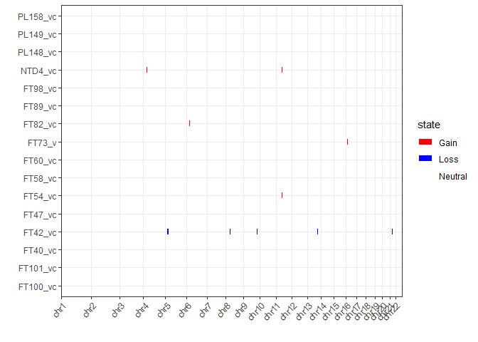
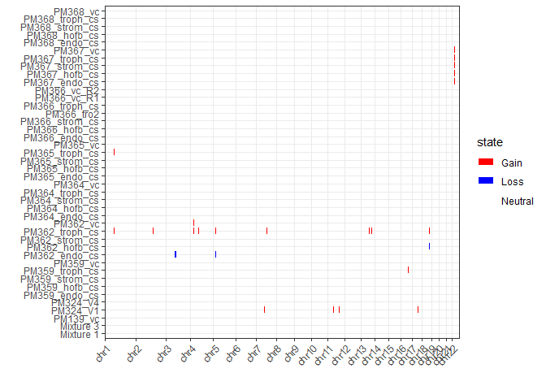

For calling CNVs

# Setup

## Libraries and Data


```r
library(minfi)
library(ggplot2)
library(dplyr)
library(tidyr)
library(conumee)
library(doParallel)

rgset <- readRDS('../../data/main/interim/0_1_rgset_raw.rds')
pDat <- readRDS('../../data/main/interim/1_1_pDat.rds')
probe_anno <- readRDS('../../data/main/interim/1_1_probe_anno.rds')
  
  
all(pDat$Sentrix == colnames(rgset)) # T
```

```
## [1] TRUE
```

## Normalize

We use noob normalization 


```r
mset_noob <- preprocessNoob(rgset)
```

```
## Loading required package: IlluminaHumanMethylationEPICanno.ilm10b4.hg19
```

```
## 
## Attaching package: 'IlluminaHumanMethylationEPICanno.ilm10b4.hg19'
```

```
## The following objects are masked from 'package:IlluminaHumanMethylationEPICanno.ilm10b2.hg19':
## 
##     Islands.UCSC, Locations, Manifest, Other,
##     SNPs.132CommonSingle, SNPs.135CommonSingle,
##     SNPs.137CommonSingle, SNPs.138CommonSingle,
##     SNPs.141CommonSingle, SNPs.142CommonSingle,
##     SNPs.144CommonSingle, SNPs.146CommonSingle,
##     SNPs.147CommonSingle, SNPs.Illumina
```

```
## The following objects are masked from 'package:IlluminaHumanMethylation450kanno.ilmn12.hg19':
## 
##     Islands.UCSC, Locations, Manifest, Other,
##     SNPs.132CommonSingle, SNPs.135CommonSingle,
##     SNPs.137CommonSingle, SNPs.138CommonSingle,
##     SNPs.141CommonSingle, SNPs.142CommonSingle,
##     SNPs.144CommonSingle, SNPs.146CommonSingle,
##     SNPs.147CommonSingle, SNPs.Illumina
```

```r
#get copy number data
cn_noob <- getCN(mset_noob)
colnames(cn_noob) <- pDat$Sample_Name
cn_noob[1:6,1:6]
```

```
##            PM365_endo_cs PL295_discard_cs PL293_strom_cs PL292_endo_cs
## cg18478105      13.44531        13.383378       13.54322     13.637197
## cg09835024      13.43415        13.268718       13.27385     13.370361
## cg14361672      13.11215        13.524372       13.63295     13.764587
## cg01763666      12.32792        12.545584       12.48725     12.621400
## cg12950382      10.53164         9.897865       10.83017      9.960143
## cg02115394      13.33385        13.271807       13.42158     13.518372
##              FT73_v PM376_vc
## cg18478105 13.70721 13.73268
## cg09835024 13.74033 13.60959
## cg14361672 13.54560 13.67993
## cg01763666 12.68057 12.80360
## cg12950382 10.64012 11.12638
## cg02115394 13.68951 13.63238
```

# Conumee

## Setup

Conumee produces an annotation that does not match the probes of current EPIC arrays. Be sure to
run subsetbyoverlaps with the data after running CNV.load


```r
# define controls
CNV_controls <- pDat %>% 
  filter(Trimester == 'Third' & Sex == 'M') %>% 
  pull(Sample_Name) %>% as.character()

# exclude cross hyb probes
# load annotation
zhou_anno <- readRDS('Z:/Victor/Data/DNAm annotations/zhou2017_EPIC.hg19.manifest.rds') 

# subset zhou anno to filtered probes
zhou_anno <- zhou_anno[intersect(rownames(mset_noob), names(zhou_anno)),]

exclude <- zhou_anno[zhou_anno$MASK_general == T,]
exclude <- exclude[!seqnames(exclude) %in% c('chrM','*'),]

# create annotation
CNV_anno <- CNV.create_anno(array_type="EPIC", chrXY=TRUE, 
                            exclude_regions = granges(exclude))
```

```
## using genome annotations from UCSC
```

```
## getting EPIC annotations
```

```
##  - 863904 probes used
```

```
## importing regions to exclude from analysis
```

```
## creating bins
```

```
##  - 156422 bins created
```

```
## merging bins
```

```
##  - 20850 bins remaining
```

```r
# subset annotation to those present in mset
CNV_anno@probes <- subsetByOverlaps(CNV_anno@probes, granges(zhou_anno))

# load into cnv calling format
CNV <- CNV.load(mset_noob[intersect(rownames(mset_noob), names(zhou_anno)),])

#test
#x <- CNV.fit(CNV[2], ref = CNV[setdiff(CNV_controls, names(CNV[2]))], anno = CNV_anno)
#x <- CNV.bin(x)
#x <- CNV.detail(x)
#x <- CNV.segment(x)
#CNV.genomeplot(x)
#CNV.genomeplot(x, chr = 'chr6')
#y2 <- CNV.write(x, what = 'bins')
#head(y2)
```

## Call CNVs


```r
# initilize cluster
cl <- makeCluster(24)
registerDoParallel(cl)

# parallel cnv fit
CNV_calls <- foreach (i =  1:ncol(mset_noob),
                          .export = c("CNV.fit", "CNV.bin", 
                                      "CNV.segment", "CNV.detail")) %dopar%
  CNV.segment(
    CNV.detail(
      CNV.bin(
        CNV.fit(
          CNV[i], ref = CNV[setdiff(CNV_controls, names(CNV[i]))], anno = CNV_anno))))

# kill cluster
stopCluster(cl)

# name the output list
names(CNV_calls) <- pDat$Sample_Name
CNV.genomeplot(CNV_calls[[1]])
```

<!-- -->

```r
# visualize 
#organize by case
Cases <- levels(as.factor(as.character(pDat$Case_ID)))
```

## Output genomeplots


```r
pdf(file='../../outs/11_CNV_conumee.pdf')  
for (i in 1:length(Cases)) {
  Case_i <- Cases[i]
  pDat_i <- pDat %>% filter(Case_ID == Case_i)
  name_i <- as.character(pDat_i$Sample_Name)
  sex_i <- as.character(pDat_i$Sex)
  
  
  # set number of plots per page
  if (length(name_i) == 1) {
    par(mfrow = c(1,1))
  }
  
  if (length(name_i) == 2) {
    par(mfrow = c(2, 1)) # two plots on two rows, better than two plots in two columns
  }
  
  if (length(name_i) > 2) {
    par(mfrow = c(ceiling(length(name_i)/2), 2)) # set two columns and enough rows to hold all plots
  }
  
  
  for (j in 1:length(name_i)){
    CNV.genomeplot(CNV_calls[[name_i[j]]],
                   main = paste0(name_i[j], ' (', sex_i[j], ')' ), set_par = F)
  }
}
dev.off()
```

## Output data types

probes
bins
segments


```r
#segments
CNV_segments <- lapply(CNV_calls, function(x) CNV.write(x, what = 'segments')) %>% bind_rows
head(CNV_segments)
```

```
##              ID chrom loc.start   loc.end num.mark bstat pval seg.mean
## 1 PM365_endo_cs  chr1    856934 249206165     1997    NA   NA    0.000
## 2 PM365_endo_cs chr10    186826 135356166     1023    NA   NA   -0.002
## 3 PM365_endo_cs chr11    213032 134571358     1192    NA   NA    0.002
## 4 PM365_endo_cs chr12    271945 133679770     1078    NA   NA    0.000
## 5 PM365_endo_cs chr13  19548232 115089323      505    NA   NA   -0.004
## 6 PM365_endo_cs chr14  20528192 106323717      713    NA   NA   -0.002
##   seg.median
## 1      0.000
## 2     -0.001
## 3      0.002
## 4      0.002
## 5     -0.002
## 6     -0.001
```

```r
#bins
CNV_bins <- lapply(CNV_calls, function(x) CNV.write(x, what = 'bins')[,5])
names(CNV_bins) <- names(CNV_calls)
CNV_bins <- bind_cols(CNV.write(CNV_calls[[1]], what = 'bins')[,1:4],
                      CNV_bins) %>% as_tibble()
CNV_bins 
```

```
## # A tibble: 20,850 x 196
##    Chromosome  Start    End Feature PM365_endo_cs PL295_discard_cs
##    <fct>       <int>  <int> <fct>           <dbl>            <dbl>
##  1 chr1       8.45e5 8.69e5 chr1-0~         0.012            0.014
##  2 chr1       8.71e5 8.76e5 chr1-0~         0.009           -0.112
##  3 chr1       8.76e5 8.89e5 chr1-0~         0.006            0.014
##  4 chr1       8.95e5 8.99e5 chr1-0~         0.007            0.037
##  5 chr1       8.99e5 9.08e5 chr1-0~         0.024           -0.012
##  6 chr1       9.13e5 9.29e5 chr1-0~        -0.003            0.03 
##  7 chr1       9.29e5 9.43e5 chr1-0~         0.013           -0.005
##  8 chr1       9.57e5 9.85e5 chr1-0~         0.008           -0.005
##  9 chr1       9.86e5 9.94e5 chr1-0~         0.009            0.045
## 10 chr1       1.00e6 1.01e6 chr1-0~        -0.004           -0.024
## # ... with 20,840 more rows, and 190 more variables: PL293_strom_cs <dbl>,
## #   PL292_endo_cs <dbl>, FT73_v <dbl>, PM376_vc <dbl>,
## #   PM370_hofb_cs <dbl>, PM368_troph_cs <dbl>, PM368_vc <dbl>,
## #   PL293_hofb_cs <dbl>, PM372_endo_cs <dbl>, PM376_strom_cs <dbl>,
## #   PM367_troph_cs <dbl>, `Mixture 7` <dbl>, FT82_vc <dbl>,
## #   PM371_hofb_cs <dbl>, PM378_vc <dbl>, PM374_tro2 <dbl>,
## #   PM364_hofb_cs <dbl>, PM374_endo_cs <dbl>, PM366_strom_cs <dbl>,
## #   PM362_troph_cs <dbl>, PL290_v <dbl>, PL295_troph_cs <dbl>,
## #   PL296_v <dbl>, PL289_hofb_cs <dbl>, PM364_vc <dbl>,
## #   PM359_hofb_cs <dbl>, PM369_endo_cs <dbl>, PM367_strom_cs <dbl>,
## #   P131_troph_cs <dbl>, FT100_vc <dbl>, PM365_vc <dbl>, FT40_vc <dbl>,
## #   PM375_discard_cs <dbl>, PM365_troph_cs <dbl>, PL296_hofb_cs <dbl>,
## #   PM371_endo_cs <dbl>, PM368_strom_cs <dbl>, PM362_vc <dbl>,
## #   PL295_strom_cs <dbl>, PM371_vc <dbl>, FT47_vc <dbl>,
## #   PL292_troph_cs <dbl>, `Mixture 11` <dbl>, PL296_endo_cs <dbl>,
## #   PM377_endo_cs <dbl>, P131_hofb_cs <dbl>, PM377_troph_cs <dbl>,
## #   PM371_strom_cs <dbl>, PL292_v <dbl>, PM372_tro2 <dbl>, PM324_V1 <dbl>,
## #   PM375_hofb_cs <dbl>, `Mixture 1` <dbl>, PL295_endo_cs <dbl>,
## #   PM376_hofb_cs <dbl>, PM379_vc <dbl>, PM359_troph_cs <dbl>,
## #   PM366_troph_cs <dbl>, PL289_endo_cs <dbl>, PL289_v <dbl>,
## #   PL290_discard_cs <dbl>, PM375_strom_cs <dbl>, PM379_hofb_cs <dbl>,
## #   PM381_endo_cs <dbl>, PM365_strom_cs <dbl>, PM139_vc <dbl>,
## #   PL294_discard_cs <dbl>, PM364_troph_cs <dbl>, `Mixture 9` <dbl>,
## #   PL293_v_R2 <dbl>, PM378_endo_cs <dbl>, PM377_hofb_cs <dbl>,
## #   P131_endo_cs <dbl>, PL289_strom_cs <dbl>, PL293_troph_cs <dbl>,
## #   PM370_discard_cs <dbl>, PM324_V4 <dbl>, FT60_vc <dbl>, `Mixture
## #   14` <dbl>, PM373_discard_cs <dbl>, PL295_hofb_cs <dbl>,
## #   PM368_endo_cs <dbl>, PM375_tro2 <dbl>, FT98_vc <dbl>,
## #   PM370_troph_cs <dbl>, PM381_strom_cs <dbl>, FT42_vc <dbl>,
## #   PM370_vc <dbl>, PM376_mv <dbl>, PM373_hofb_cs <dbl>,
## #   PM364_endo_cs <dbl>, PM370_strom_cs <dbl>, PM379_troph_cs <dbl>,
## #   PL293_discard_cs <dbl>, PM369_strom_cs <dbl>, PM381_troph_cs <dbl>,
## #   FT89_vc <dbl>, PL294_v <dbl>, PM378_hofb_cs <dbl>,
## #   PL296_discard_cs <dbl>, ...
```

# Visualize


## CNV genome Heatmap

Need to format so that I can plot as heatmap

Y axis will be position in genome

I need a continuous position along the entire genome, not just the chromosome.

So chromosome 2 positions need to have the maximum chromosome 1 length to them, etc.


```r
# create plotting data
plot_data <- CNV_bins %>% 
  mutate(Chromosome = factor(as.character(Chromosome), levels = 
                               paste0('chr', c(1:22, 'X', 'Y'))))

# calculate chromosome lengths
chrom_lengths <- plot_data %>% group_by(Chromosome) %>% 
  dplyr::summarize(max = max(End)) %>%
  mutate(toadd = cumsum(as.numeric(max)) - max) # subtract current chromosome length

plot_data <- chrom_lengths %>% inner_join(plot_data) %>% mutate(position_genome = Start + toadd) %>%
  select(Chromosome, Start, End, Feature, position_genome, everything())
```

```
## Joining, by = "Chromosome"
```

```r
plot_data_melt <- plot_data %>%
  select(-Start, -End, -Feature, -toadd) %>%
  tidyr::gather(key = 'Sample', value = 'Intensity', -Chromosome, -position_genome, -max) %>%
  mutate(State = factor(case_when(
    Intensity < -0.2 ~ 'Loss',
    Intensity > 0.2 ~ 'Gain',
    TRUE ~ 'Neutral'
  ), levels = c('Loss', 'Gain', 'Neutral')))


ggplot(plot_data_melt[1:900000,], 
       aes(x = Sample, y = position_genome, color = State)) +
  geom_point(shape = 15, size = 0.75) +
  scale_color_manual(values = c('Gain' = 'Red', 'Loss' = 'Blue', 'Neutral' = NA)) +
  scale_y_continuous(breaks = chrom_lengths$toadd, labels = chrom_lengths$Chromosome) +
  theme_classic()  +
  theme(axis.text.x = element_text(angle = 45, hjust = 1, vjust = 1))
```

```
## Warning: Removed 886120 rows containing missing values (geom_point).
```

<!-- -->

Too sensitive
TRy with segments


```r
CNV_segments_save <- CNV_segments %>% as_tibble() %>%
  mutate(chrom = factor(as.character(chrom), levels = 
                               paste0('chr', c(1:22, 'X', 'Y')))) %>%
  left_join(chrom_lengths, by = c('chrom' = 'Chromosome')) %>%
  
  # shift genome position for plotting
  # Call gains or losses using thresholds
  mutate(start_genome = loc.start + toadd, 
         end_genome = loc.end + toadd,
         state = case_when(
           seg.median > 0.1 ~ 'Gain',
           seg.median < -0.1 ~ 'Loss',
           TRUE ~ 'Neutral'
         )) %>%
  arrange(ID, chrom, loc.start) 

# remove XY chromosomes for plotting, but keep for saving data
CNV_segments <- CNV_segments_save %>%
  filter(!chrom %in% c('chrX', 'chrY'))


#sample index
Second <- pDat %>% filter(Trimester == 'Second') %>% pull(Sample_Name)
First <- pDat %>% filter(Trimester == 'First') %>% arrange(Case_ID) %>% pull(Sample_Name)
Third <- pDat %>% filter(Trimester == 'Third') %>% arrange(Case_ID) %>% pull(Sample_Name)


plot_cnv <- function(data) {
  p <- ggplot(data = data, aes(x =  ID, color = state)) +
  geom_segment(aes(x =  ID, xend = ID,  y = start_genome, yend = end_genome), size = 3)+
  scale_color_manual(values = c('Gain' = 'Red', 'Loss' = 'Blue', 'Neutral' = NA)) +
  scale_y_continuous(expand = c(0.001, 0), breaks = chrom_lengths$toadd[1:22], 
                     labels = chrom_lengths$Chromosome[1:22]) +
  theme_bw()  +labs(x = '', y = '') +
  theme(axis.text.x = element_text(angle = 45, hjust = 1, vjust = 1),
        panel.grid.minor = element_blank()) +
  coord_flip() 
  
  print(p)
}


#second trim
plot_cnv(data = CNV_segments %>% filter(ID %in% Second))
```

<!-- -->

```r
#First trimester
plot_cnv(CNV_segments %>% filter(ID %in% First[1:25])) 
```

<!-- -->

```r
plot_cnv(CNV_segments %>% filter(ID %in% First[26:50])) 
```

<!-- -->

```r
# third trimester
plot_cnv(CNV_segments %>% filter(ID %in% Third[1:42]))
```

<!-- -->

```r
plot_cnv(CNV_segments %>% filter(ID %in% Third[43:85]))
```

<!-- -->

```r
plot_cnv(CNV_segments %>% filter(ID %in% Third[86:126])) 
```

<!-- -->

Save

pdf('../../outs/12_CNV_heatmap.pdf', width = 12)
plot_cnv(data = CNV_segments %>% filter(ID %in% Second))
plot_cnv(CNV_segments %>% filter(ID %in% First[1:25])) 
plot_cnv(CNV_segments %>% filter(ID %in% First[26:50])) 
plot_cnv(CNV_segments %>% filter(ID %in% Third[1:42]))
plot_cnv(CNV_segments %>% filter(ID %in% Third[43:85]))
plot_cnv(CNV_segments %>% filter(ID %in% Third[86:126])) 
dev.off()


## CNV scatterplots


```r
# repeat editing as with segments, need to gather() this time
CNV_bins_save <- CNV_bins %>% as_tibble() %>%
  mutate(Chromosome = factor(as.character(Chromosome), levels = 
                               paste0('chr', c(1:22, 'X', 'Y')))) %>%
  left_join(chrom_lengths, by = c('Chromosome' = 'Chromosome')) %>%
  mutate(start_genome = Start + toadd, 
         end_genome = End + toadd) %>%
  tidyr::gather(key = 'Sample', value = 'Log2Ratio', -Chromosome, -Start, -End, 
         -start_genome, -end_genome, -Feature)
CNV_bins <- CNV_bins_save  %>%
  filter(!Chromosome %in% c('chrX', 'chrY'))


#plot
plot_cnv_bin <- function(data) {
  ggplot(data, aes(x = start_genome, Log2Ratio)) +
  geom_point(alpha = 0.7) +
  facet_wrap(~Sample, ncol = 1)+
  scale_x_continuous(expand = c(0.001, 0), breaks = chrom_lengths$toadd[1:22], 
                     labels = chrom_lengths$Chromosome[1:22]) +
  theme_bw()+labs(x = '', y = '') +
  theme(axis.text.x = element_text(angle = 45, hjust = 1, vjust = 1),
        panel.grid.minor = element_blank())

}

#Second trimester
plot_cnv_bin(CNV_bins %>% filter(Sample%in%Second[1:8]))
```

<!-- -->

```r
# First

# Third
```

# Future improvements

Determine better cutofss to call deletions and gains

# SessionInfo


```r
sessionInfo()
```

```
## R version 3.6.0 (2019-04-26)
## Platform: x86_64-w64-mingw32/x64 (64-bit)
## Running under: Windows Server x64 (build 14393)
## 
## Matrix products: default
## 
## locale:
## [1] LC_COLLATE=English_Canada.1252  LC_CTYPE=English_Canada.1252   
## [3] LC_MONETARY=English_Canada.1252 LC_NUMERIC=C                   
## [5] LC_TIME=English_Canada.1252    
## 
## attached base packages:
## [1] stats4    parallel  stats     graphics  grDevices utils     datasets 
## [8] methods   base     
## 
## other attached packages:
##  [1] IlluminaHumanMethylationEPICanno.ilm10b4.hg19_0.6.0
##  [2] doParallel_1.0.14                                  
##  [3] conumee_1.18.0                                     
##  [4] IlluminaHumanMethylationEPICmanifest_0.3.0         
##  [5] IlluminaHumanMethylationEPICanno.ilm10b2.hg19_0.6.0
##  [6] IlluminaHumanMethylation450kmanifest_0.4.0         
##  [7] IlluminaHumanMethylation450kanno.ilmn12.hg19_0.6.0 
##  [8] tidyr_0.8.3                                        
##  [9] dplyr_0.8.1                                        
## [10] ggplot2_3.1.1                                      
## [11] minfi_1.30.0                                       
## [12] bumphunter_1.26.0                                  
## [13] locfit_1.5-9.1                                     
## [14] iterators_1.0.10                                   
## [15] foreach_1.4.4                                      
## [16] Biostrings_2.52.0                                  
## [17] XVector_0.24.0                                     
## [18] SummarizedExperiment_1.14.0                        
## [19] DelayedArray_0.10.0                                
## [20] BiocParallel_1.17.18                               
## [21] matrixStats_0.54.0                                 
## [22] Biobase_2.43.1                                     
## [23] GenomicRanges_1.36.0                               
## [24] GenomeInfoDb_1.20.0                                
## [25] IRanges_2.18.0                                     
## [26] S4Vectors_0.22.0                                   
## [27] BiocGenerics_0.29.2                                
## 
## loaded via a namespace (and not attached):
##  [1] colorspace_1.4-1         siggenes_1.58.0         
##  [3] mclust_5.4.3             DNAcopy_1.58.0          
##  [5] base64_2.0               bit64_0.9-7             
##  [7] fansi_0.4.0              AnnotationDbi_1.46.0    
##  [9] xml2_1.2.0               codetools_0.2-16        
## [11] splines_3.6.0            scrime_1.3.5            
## [13] knitr_1.22               zeallot_0.1.0           
## [15] Rsamtools_2.0.0          annotate_1.62.0         
## [17] HDF5Array_1.12.1         readr_1.3.1             
## [19] compiler_3.6.0           httr_1.4.0              
## [21] backports_1.1.4          assertthat_0.2.1        
## [23] Matrix_1.2-17            lazyeval_0.2.2          
## [25] cli_1.1.0                limma_3.40.0            
## [27] htmltools_0.3.6          prettyunits_1.0.2       
## [29] tools_3.6.0              gtable_0.3.0            
## [31] glue_1.3.1               GenomeInfoDbData_1.2.1  
## [33] doRNG_1.7.1              Rcpp_1.0.1              
## [35] vctrs_0.1.0              multtest_2.40.0         
## [37] preprocessCore_1.46.0    nlme_3.1-140            
## [39] rtracklayer_1.44.0       DelayedMatrixStats_1.6.0
## [41] xfun_0.6                 stringr_1.4.0           
## [43] rngtools_1.3.1.1         XML_3.98-1.19           
## [45] beanplot_1.2             zlibbioc_1.30.0         
## [47] MASS_7.3-51.4            scales_1.0.0            
## [49] hms_0.4.2                rhdf5_2.28.0            
## [51] GEOquery_2.52.0          RColorBrewer_1.1-2      
## [53] yaml_2.2.0               memoise_1.1.0           
## [55] pkgmaker_0.27            biomaRt_2.40.0          
## [57] reshape_0.8.8            stringi_1.4.3           
## [59] RSQLite_2.1.1            genefilter_1.66.0       
## [61] GenomicFeatures_1.36.0   bibtex_0.4.2            
## [63] rlang_0.3.4              pkgconfig_2.0.2         
## [65] bitops_1.0-6             nor1mix_1.2-3           
## [67] evaluate_0.13            lattice_0.20-38         
## [69] purrr_0.3.2              Rhdf5lib_1.6.0          
## [71] labeling_0.3             GenomicAlignments_1.20.0
## [73] bit_1.1-14               tidyselect_0.2.5        
## [75] plyr_1.8.4               magrittr_1.5            
## [77] R6_2.4.0                 DBI_1.0.0               
## [79] pillar_1.4.0             withr_2.1.2             
## [81] survival_2.44-1.1        RCurl_1.95-4.12         
## [83] tibble_2.1.1             crayon_1.3.4            
## [85] utf8_1.1.4               rmarkdown_1.12.7        
## [87] progress_1.2.0           grid_3.6.0              
## [89] data.table_1.12.2        blob_1.1.1              
## [91] digest_0.6.18            xtable_1.8-4            
## [93] illuminaio_0.26.0        openssl_1.3             
## [95] munsell_0.5.0            registry_0.5-1          
## [97] askpass_1.1              quadprog_1.5-7
```

# Save data


```r
# probes, takes a long time (1-2hrs)
CNV_probes <- lapply(CNV_calls, function(x) CNV.write(x, what = 'probes')[,5])
names(CNV_probes) <- names(CNV_calls)
CNV_probes <- bind_cols(CNV.write(CNV_calls[[1]], what = 'probes')[,1:4],
                      CNV_probes) %>% as_tibble()

saveRDS(CNV_probes, '../../data/main/interim/1_2_CNV_probes.rds')
saveRDS(CNV_segments_save, '../../data/main/interim/1_2_CNV_segments.rds')
saveRDS(CNV_bins_save, '../../data/main/interim/1_2_CNV_bins.rds')
saveRDS(chrom_lengths, '../../data/main/interim/1_2_chrom_lengths.rds')
```
