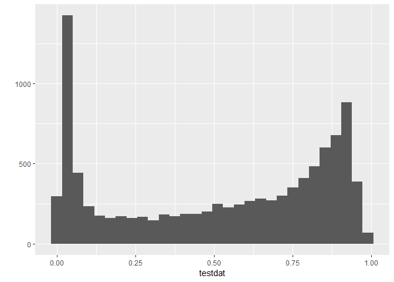
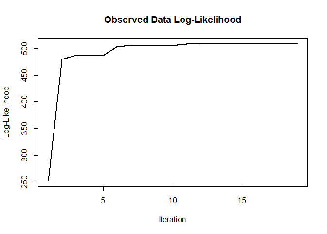
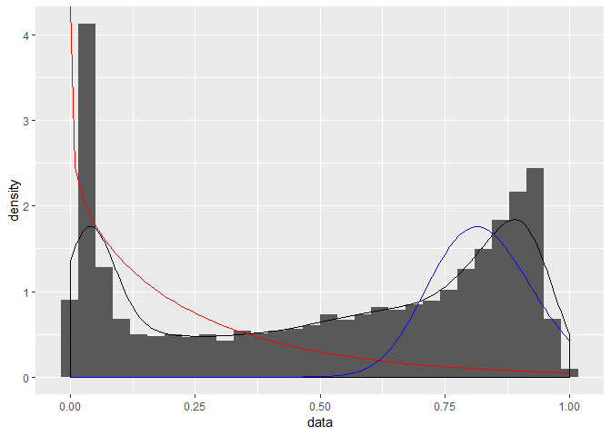
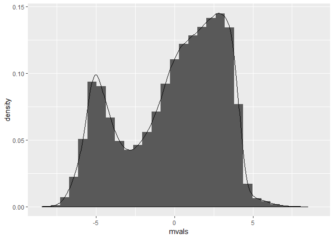

For implementing mixture modelling to classify methylated, intermediate and unmethylated states.


# Setup

## Libraries


```r
library(minfi)
```

```
## Loading required package: BiocGenerics
```

```
## Loading required package: parallel
```

```
## 
## Attaching package: 'BiocGenerics'
```

```
## The following objects are masked from 'package:parallel':
## 
##     clusterApply, clusterApplyLB, clusterCall, clusterEvalQ,
##     clusterExport, clusterMap, parApply, parCapply, parLapply,
##     parLapplyLB, parRapply, parSapply, parSapplyLB
```

```
## The following objects are masked from 'package:stats':
## 
##     IQR, mad, sd, var, xtabs
```

```
## The following objects are masked from 'package:base':
## 
##     anyDuplicated, append, as.data.frame, basename, cbind,
##     colMeans, colnames, colSums, dirname, do.call, duplicated,
##     eval, evalq, Filter, Find, get, grep, grepl, intersect,
##     is.unsorted, lapply, Map, mapply, match, mget, order, paste,
##     pmax, pmax.int, pmin, pmin.int, Position, rank, rbind, Reduce,
##     rowMeans, rownames, rowSums, sapply, setdiff, sort, table,
##     tapply, union, unique, unsplit, which, which.max, which.min
```

```
## Loading required package: GenomicRanges
```

```
## Loading required package: stats4
```

```
## Loading required package: S4Vectors
```

```
## 
## Attaching package: 'S4Vectors'
```

```
## The following object is masked from 'package:base':
## 
##     expand.grid
```

```
## Loading required package: IRanges
```

```
## 
## Attaching package: 'IRanges'
```

```
## The following object is masked from 'package:grDevices':
## 
##     windows
```

```
## Loading required package: GenomeInfoDb
```

```
## Loading required package: SummarizedExperiment
```

```
## Loading required package: Biobase
```

```
## Welcome to Bioconductor
## 
##     Vignettes contain introductory material; view with
##     'browseVignettes()'. To cite Bioconductor, see
##     'citation("Biobase")', and for packages 'citation("pkgname")'.
```

```
## Loading required package: DelayedArray
```

```
## Loading required package: matrixStats
```

```
## 
## Attaching package: 'matrixStats'
```

```
## The following objects are masked from 'package:Biobase':
## 
##     anyMissing, rowMedians
```

```
## Loading required package: BiocParallel
```

```
## Warning: multiple methods tables found for 'rowSums'
```

```
## Warning: multiple methods tables found for 'colSums'
```

```
## Warning: multiple methods tables found for 'rowMeans'
```

```
## Warning: multiple methods tables found for 'colMeans'
```

```
## 
## Attaching package: 'DelayedArray'
```

```
## The following objects are masked from 'package:matrixStats':
## 
##     colMaxs, colMins, colRanges, rowMaxs, rowMins, rowRanges
```

```
## The following objects are masked from 'package:base':
## 
##     aperm, apply, rowsum
```

```
## Loading required package: Biostrings
```

```
## Loading required package: XVector
```

```
## 
## Attaching package: 'Biostrings'
```

```
## The following object is masked from 'package:DelayedArray':
## 
##     type
```

```
## The following object is masked from 'package:base':
## 
##     strsplit
```

```
## Loading required package: bumphunter
```

```
## Loading required package: foreach
```

```
## Loading required package: iterators
```

```
## Loading required package: locfit
```

```
## locfit 1.5-9.1 	 2013-03-22
```

```
## Registered S3 method overwritten by 'openssl':
##   method      from
##   print.bytes Rcpp
```

```
## Setting options('download.file.method.GEOquery'='auto')
```

```
## Setting options('GEOquery.inmemory.gpl'=FALSE)
```

```r
library(tidyverse)
```

```
## Registered S3 methods overwritten by 'ggplot2':
##   method         from 
##   [.quosures     rlang
##   c.quosures     rlang
##   print.quosures rlang
```

```
## Registered S3 method overwritten by 'rvest':
##   method            from
##   read_xml.response xml2
```

```
## -- Attaching packages ------- tidyverse 1.2.1 --
```

```
## v ggplot2 3.1.1     v purrr   0.3.2
## v tibble  2.1.1     v dplyr   0.8.1
## v tidyr   0.8.3     v stringr 1.4.0
## v readr   1.3.1     v forcats 0.4.0
```

```
## -- Conflicts ---------- tidyverse_conflicts() --
## x purrr::accumulate() masks foreach::accumulate()
## x dplyr::collapse()   masks Biostrings::collapse(), IRanges::collapse()
## x dplyr::combine()    masks minfi::combine(), Biobase::combine(), BiocGenerics::combine()
## x purrr::compact()    masks XVector::compact()
## x dplyr::count()      masks matrixStats::count()
## x dplyr::desc()       masks IRanges::desc()
## x tidyr::expand()     masks S4Vectors::expand()
## x dplyr::filter()     masks stats::filter()
## x dplyr::first()      masks S4Vectors::first()
## x dplyr::lag()        masks stats::lag()
## x ggplot2::Position() masks BiocGenerics::Position(), base::Position()
## x purrr::reduce()     masks GenomicRanges::reduce(), IRanges::reduce()
## x dplyr::rename()     masks S4Vectors::rename()
## x purrr::simplify()   masks DelayedArray::simplify()
## x dplyr::slice()      masks XVector::slice(), IRanges::slice()
## x purrr::when()       masks foreach::when()
```

```r
library(mixtools)
```

```
## mixtools package, version 1.1.0, Released 2017-03-10
## This package is based upon work supported by the National Science Foundation under Grant No. SES-0518772.
```

```r
library(betareg)
```

## Real Data


```r
pDat <- readRDS('../../data/main/interim/1_3_pDat.rds')
betas <- readRDS('../../data/main/interim/1_4_betas_noob_filt.rds')
dim(betas)
```

```
## [1] 737050    192
```

```r
dim(pDat)
```

```
## [1] 192  65
```

```r
all(pDat$Sentrix == colnames(betas))
```

```
## [1] TRUE
```

```r
colnames(betas) <- pDat$Sample_Name 
```

# 2 component gamma

Model components:
1. Gamma
2. Gamma

Input:
betas


```r
# subset to 1000
testdat <- sample(betas, size = 10000)

# plot empirical 
qplot(x = testdat) + geom_histogram()
```

```
## `stat_bin()` using `bins = 30`. Pick better value with `binwidth`.
## `stat_bin()` using `bins = 30`. Pick better value with `binwidth`.
```

<!-- -->

```r
fit_gamma <- gammamixEM(testdat,
                        lambda = c(0.5, 0.5),# initial mixing proportions
                        verb = T) 
```

```
## iteration = 1  log-lik diff = 227.3708  log-lik = 479.9679 
## iteration = 2  log-lik diff = 6.58384  log-lik = 486.5517 
## iteration = 3  log-lik diff = 0.6152456  log-lik = 487.167 
## iteration = 4  log-lik diff = 0.0737788  log-lik = 487.2408 
## iteration = 5  log-lik diff = 16.55683  log-lik = 503.7976 
## iteration = 6  log-lik diff = 1.010045  log-lik = 504.8076 
## iteration = 7  log-lik diff = 0.1013203  log-lik = 504.9089 
## iteration = 8  log-lik diff = 0.01340074  log-lik = 504.9223 
## iteration = 9  log-lik diff = 0.002628296  log-lik = 504.925 
## iteration = 10  log-lik diff = 3.320411  log-lik = 508.2454 
## iteration = 11  log-lik diff = 0.1440937  log-lik = 508.3895 
## iteration = 12  log-lik diff = 0.01323643  log-lik = 508.4027 
## iteration = 13  log-lik diff = 0.002205057  log-lik = 508.4049 
## iteration = 14  log-lik diff = 0.0002851957  log-lik = 508.4052 
## iteration = 15  log-lik diff = 2.164642e-05  log-lik = 508.4052 
## iteration = 16  log-lik diff = 7.89239e-07  log-lik = 508.4052 
## iteration = 17  log-lik diff = 2.877846e-08  log-lik = 508.4052 
## iteration = 18  log-lik diff = 1.048761e-09  log-lik = 508.4052 
## number of iterations= 18
```

```r
fit_gamma$all.loglik
```

```
##  [1] 252.5971 479.9679 486.5517 487.1670 487.2408 503.7976 504.8076
##  [8] 504.9089 504.9223 504.9250 508.2454 508.3895 508.4027 508.4049
## [15] 508.4052 508.4052 508.4052 508.4052 508.4052
```

```r
plot(fit_gamma)
```

<!-- -->

```r
densities <- tibble(quantiles = seq(0,1,0.01)) %>%
  mutate(component1 = fit_gamma$lambda[1]*dgamma(quantiles,
                                                 shape =  fit_gamma$gamma.pars[1,1],
                                                 scale = fit_gamma$gamma.pars[2,1]),
         component2 = fit_gamma$lambda[2]*dgamma(quantiles,
                                                 shape =  fit_gamma$gamma.pars[1,2],
                                                 scale = fit_gamma$gamma.pars[2,2]))
tibble(data = testdat) %>%
  ggplot(aes(x = data)) + 
  geom_histogram(aes(y = ..density..)) +
  geom_density() +
  geom_line(data = densities, aes(x = quantiles, y =component1), color = 'red') +
  geom_line(data = densities, aes(x = quantiles, y = component2), color = 'blue')
```

```
## `stat_bin()` using `bins = 30`. Pick better value with `binwidth`.
```

<!-- -->


# 2 component normals


```r
mvals <- logit2(betas)

mvals_test <- sample(mvals, size = 1000000)


data.frame(mvals = mvals_test) %>%
  ggplot(aes(x = mvals)) +
  geom_histogram(aes(y = ..density..)) +
  geom_density()
```

```
## `stat_bin()` using `bins = 30`. Pick better value with `binwidth`.
```

<!-- -->


# 2 component beta

## Initialization

Specify starting parameters for the two beta distributions, we can start by specifying the mean and sd,
then calculate the two shape parameters for the beta distribution. The standard nomenclature for the
two beta distributions parameters is 'beta' and 'alpha'. To avoid confusion, I call beta shape2 and alpha shape1

\[
mu = 0.25, 0.75\\
sigma = 0.1, 0.1\\
alpha = 0.5, 0.5
\]

\[
\mu = \frac{\alpha}{\alpha + \beta} = \frac{shape1}{shape1 + shape2}\\
\sigma^2 = \frac{\mu(1-\mu)}{\alpha + \beta + 1} =\frac{\mu(1-\mu)}{shape1 + shape2 + 1} 
\]

Scratch that, instead of doing math, I will just specify the shape parameters


```r
#shape1 and shape2
shape1 <- c(10, 80)
shape2 <- c(80, 10)

# mixing proportions
alpha <- c(0.5, 0.5)
```

## Expectation

Produce soft labels for each data point, i.e. calculate the posterior probability each sample
belongs to component 1 and component 2

\[
P(x_i \in k_j | x_i) = \frac{P(x_i|x_i \in k_j)P(k_j)}{P(x_i)}
\]


where,
$P(x_i|x_i \in k_j)$ is the probability of the data given it comes from component j, and can be 
calculated using `stats::dbeta`.

$P(k_i)$ is the mixing proportion for component j.

The denominator $P(x_i)$ can be calculated by summing the numerators over all components j.


```r
numerator_k1 <- dbeta(x = testdat, shape1 = shape1[1], shape2 = shape2[1])  * alpha[1]
numerator_k2 <- dbeta(x = testdat, shape1 = shape1[2], shape2 = shape2[2])  * alpha[2]

prob_x <- numerator_k1 + numerator_k2

posterior_k1 <- numerator_k1 / prob_x
posterior_k2 <- numerator_k2 / prob_x
```

Also calculate the starting log odds. Will need to save this for each iteration


```r
log_odds <- sum(log(base = exp(1), x = prob_x)) 
log_odds
```

```
## [1] -57226.02
```

## Maximization

Now that we have posterior probabilities, we can update the parameters of each distribution. We can
rely on mle to estimate shape1 and shape2. Alpha is calculated by the sum over posterior probabilities.

Forbes et al., 2011 gives the method of moments estimators of the shape parameters:

$$\begin{aligned}
shape1 = \mu\left(\frac{\mu(1-\mu)}{\sigma^2}-1\right)\\
shape2 = (1-\mu)\left(\frac{\mu(1-\mu)}{\sigma^2}-1\right)\\
\end{aligned}$$

where the mean $\mu$ and variance $\sigma$ can be calculated by:

\[
\begin{align}
\mu = \frac{1}{n}\sum_{i=1}^{n}{x_i}\\
\sigma^2 = E[(X - \mu)^2] 
         = \frac{1}{n}\sum_{i=1}^{n}{x_i^2 - (\frac{1}{n}\sum_{i=1}^{n}{x_i)^2})}\\
\end{align}
\]

The variance can also be calculated by:

\[
\begin{align}
\sigma^2 = E[X^2] - (E[X])^2\\ 
         = \frac{1}{n}\sum_{i=1}^{n}{(x_i-\mu)^2}\\
\end{align}
\]

although the variance estimator can be replaced with an unbiased estimator of variance:

\[
\sigma^2 = \frac{1}{n-1}\sum_{i=1}^{n}{(x_i-\mu)^2}
\]

For us because we have multiple components we need to weight the observations by their posterior 
probabilities that they belong to that component. So, let's say $\mu_j$ is our estimated mean for
component j, this is

\[
\begin{align}
\mu_j = \frac{1}{n_j}\sum_{i=1}^{n}{x_iP(x_i \in k_j|x_i)}\\
n_j = \sum_{i=1}^{n}{P(x_i \in k_j|x_i)}
\end{align}
\]

$n_j$ is derived from summing all of the probabilities for component $j$

A similar formula for variance is derived:

\[\begin{align}
\sigma_j^2 = E[X_j^2] - (E[X_j])^2 \\
= \frac{1}{n_j}\left(\sum_{i=1}^{n}{P(x_i \in k_j|x_i)x_i^2} - \mu_j^2\right) \\
\end{align}
\]

For an unbiased estimator we can multipy by $\frac{1}{n-1}$ instead of $\frac{1}{n}$:

\[
\sigma_j^2 = \frac{1}{n_j-1}\left(\sum_{i=1}^{n}{P(x_i \in k_j|x_i)x_i^2} - \mu_j^2\right) \\
\]


```r
n <- length(posterior_k1)
n1 <- sum(posterior_k1)
n2 <- sum(posterior_k2)

mean( testdat * n * posterior_k1 / sum(posterior_k1))
```

```
## [1] 0.1646279
```

```r
sum(testdat * posterior_k1 / sum(posterior_k1))
```

```
## [1] 0.1646279
```

```r
mu_1 <- 1/n1 * sum(testdat*posterior_k1)
mu_2 <- 1/n2 * sum(testdat*posterior_k2)
mu <- c(mu_1, mu_2)

var_1 <- ((1/(n1-1)) * sum(posterior_k1 *testdat^2) - mu_1^2)
var_2 <- ((1/(n2-1)) * sum(posterior_k2 *testdat^2) - mu_2^2)
var <- c(var_1, var_2)

shape1 <-       mu[1] * ( (mu[1] * (1 - mu[1]) / var[1]) - 1)
shape2 <- (1 - mu[2]) * ( (mu[2] * (1 - mu[2]) / var[2]) - 1)
```


```r
#MLE
w <- posterior_k1
n <- length(posterior_k1)
x <- testdat
	
n = length(w) 
w = n*w/sum(w)
sample.mean =  mean(w*x)


sample.var  = (mean(w*x^2) - sample.mean^2) * n/(n-1)
v = sample.mean * (1-sample.mean)

if (sample.var < v){
    shape1 = sample.mean * (v/sample.var - 1)
    shape2 = (1 - sample.mean) * (v/sample.var - 1)
} else {
    shape2 = sample.mean * (v/sample.var - 1)
    shape1 = (1 - sample.mean) * (v/sample.var - 1)
}

shape1
shape2
list(shape1 = shape1, shape2 = shape2)
```
