# 1.0 Setup

## Load libraries and data


```r
# libraries and data
library(ggplot2)
library(dplyr)
library(tidyr)
library(ggrepel)
library(viridis)
library(scales)
library(RColorBrewer)
library(impute)
library(pheatmap)
library(irlba)
library(yahew)
library(GGally)
library(cowplot)
library(purrr)
library(tibble)
library(umap)
library(dendextend)
library(stringr)

# pdata
pDat <- readRDS('../../data/main/interim/13_pDat.rds')

# raw methylation data
betas <- readRDS('../../data/main/interim/14_betas_noob_filt.rds')
probe_anno <- readRDS('../../data/main/interim/11_probe_anno.rds')

# snp data
snp_betas <- readRDS('../../data/main/interim/11_snp_betas.rds')

# annotation
zhou_anno <- readRDS('Z:/Victor/Data/DNAm annotations/zhou2017_EPIC.hg19.manifest.rds') 

# color key
color_code <- readRDS('../../data/main/interim/11_color_code.rds')
color_code_tissue <- setNames(color_code[[1]]$Colors_Tissue, color_code[[1]]$Tissue)
```

## Filter to term


```r
dim(betas) #737050  192
```

```
## [1] 737050    192
```

```r
table(pDat$Trimester) # 126 term samples.
```

```
## 
##  First Second  Third 
##     50     16    126
```

```r
all(colnames(betas) == pDat$Sentrix) # verify betas and pDat sample order match
```

```
## [1] TRUE
```

```r
colnames(betas) <- pDat$Sample_Name # input sample names as columna nmaes

pDat %>% filter(Trimester == 'Third') %>% group_by(Tissue) %>% count()
```

```
## # A tibble: 9 x 2
## # Groups:   Tissue [9]
##   Tissue                         n
##   <chr>                      <int>
## 1 Dead Cells and Lymphocytes     6
## 2 Endothelial                   19
## 3 Hofbauer                      19
## 4 Mixture                       12
## 5 Stromal                       19
## 6 Syncytiotrophoblast            5
## 7 Trophoblasts                  19
## 8 Villi                         24
## 9 Villi maternal                 3
```

Some samples will we ran for secondary analysis, e.g. mixtures, maternal villi, and dead cells. 
These I will filter out and save for later

I keep syncytiotrophoblasts for now, since we have a good number of them (n=5), and should be 
relatively clean. Sample number is probably not sufficient for linear modelling though.


```r
pDat_1 <- pDat %>% 
  filter(Trimester == 'Third', 
         !Tissue %in% c('Dead Cells and Lymphocytes', 'Mixture', 'Villi maternal'),
         Case_ID != 'PM324')

betas_1 <- betas[,pDat_1$Sample_Name]

nrow(pDat_1) # 105 samples
```

```
## [1] 103
```

```r
table(pDat_1$Tissue)
```

```
## 
##         Endothelial            Hofbauer             Stromal 
##                  19                  19                  19 
## Syncytiotrophoblast        Trophoblasts               Villi 
##                   5                  19                  22
```

# 2.0 Sample characteristics

Let's look at various sample characteristics


```r
glimpse(pDat_1)
```

```
## Observations: 103
## Variables: 65
## $ Sample_Name                  <chr> "PM365_endo_cs", "PM376_vc", "PM3...
## $ Chip_number                  <fct> 25, 25, 25, 25, 26, 26, 26, 26, 2...
## $ Well                         <chr> "A1", "F1", "G1", "H1", "A2", "C2...
## $ Case_ID                      <chr> "PM365", "PM376", "PM370", "PM368...
## $ Sex                          <chr> "F", "F", "F", "M", "M", "M", "F"...
## $ GA                           <dbl> NA, NA, NA, NA, NA, NA, NA, NA, N...
## $ Trimester                    <chr> "Third", "Third", "Third", "Third...
## $ DNA_QP                       <dbl> 542.5, NA, 71.5, 890.0, NA, 560.5...
## $ Week                         <fct> 1, 1, 1, 1, 1, 1, 1, 1, 1, 1, 1, ...
## $ Sample_Plate                 <chr> "WG6980707-MSA4", "WG6980707-MSA4...
## $ Tissue                       <chr> "Endothelial", "Villi", "Hofbauer...
## $ Sentrix_ID                   <dbl> 203067920143, 203067920143, 20306...
## $ Sentrix_Position             <chr> "R01C01", "R06C01", "R07C01", "R0...
## $ Scratches                    <chr> NA, NA, NA, NA, NA, NA, NA, NA, N...
## $ Batch_BSC                    <chr> "BSC1", "BSC1", "BSC1", "BSC1", "...
## $ DNA_conc_BSC_adjusted        <dbl> 30.19, 63.22, 18.55, 32.39, 57.78...
## $ DNA_conc_before_load         <dbl> 50.31667, 50.00000, 46.37500, 53....
## $ DNA_loaded                   <dbl> 201.2667, 200.0000, 185.5000, 215...
## $ Sentrix                      <chr> "203067920143_R01C01", "203067920...
## $ Colors_Tissue                <chr> "#6A1B9A", "#C62828", "#1565C0", ...
## $ Colors_Sex                   <chr> "#F8BBD0", "#F8BBD0", "#F8BBD0", ...
## $ Colors_Trimester             <chr> "#212121", "#212121", "#212121", ...
## $ Row_numeric                  <dbl> 1, 6, 7, 8, 1, 3, 4, 5, 8, 1, 2, ...
## $ Row_factor                   <fct> 1, 6, 7, 8, 1, 3, 4, 5, 8, 1, 2, ...
## $ detP_01_minfi                <dbl> 1161, 1254, 1444, 2115, 427, 466,...
## $ beadcount                    <dbl> 2943, 4009, 2502, 1962, 5256, 390...
## $ failed_probes                <dbl> 4001, 5125, 3868, 3999, 5561, 429...
## $ log2_median_meth             <dbl> 11.67154, 11.95056, 12.12380, 11....
## $ log2_median_unmeth           <dbl> 12.21310, 12.31203, 11.91663, 11....
## $ Average_intensity            <dbl> 9904.426, 11206.511, 11076.695, 1...
## $ median_X_intensity           <dbl> 10309.5, 11484.0, 11335.0, 5819.0...
## $ median_Y_intensity           <dbl> 424, 487, 560, 7629, 9715, 10637,...
## $ normalized_X_intensity       <dbl> 1.0155989, 1.0338194, 1.0501750, ...
## $ normalized_Y_intensity       <dbl> 0.2040305, 0.2022179, 0.2045537, ...
## $ Flag_Sex                     <lgl> FALSE, FALSE, FALSE, FALSE, FALSE...
## $ genotype_cluster             <fct> 1, 6, 7, 8, 8, 9, 6, 10, 12, 13, ...
## $ Flag_genotype                <lgl> FALSE, FALSE, FALSE, FALSE, FALSE...
## $ Average_SNP_cor_within_donor <dbl> 0.9954983, 0.9946082, 0.9957551, ...
## $ Prob_SNP_outlier             <dbl> 0.08027823, 0.07662033, 0.1157995...
## $ Prob_SNP_outlier_Logodds     <dbl> -3.949816, -4.006298, -3.531703, ...
## $ Agreement_to_donor_villi     <dbl> 1.0000000, 1.0000000, 1.0000000, ...
## $ Agreement_to_unrelated       <dbl> 0.3678490, 0.3921822, 0.3921835, ...
## $ cor_to_donor_villi           <dbl> 0.9960673, 1.0000000, 0.9955159, ...
## $ cor_to_unrelated             <dbl> 0.06523967, 0.15938180, 0.1106942...
## $ cor_to_reference             <dbl> 0.9960673, 1.0000000, 0.9955159, ...
## $ PC1_raw                      <dbl> 39.73355, -73.66252, 88.17396, -1...
## $ PC2_raw                      <dbl> 63.342799, -16.326172, -78.650844...
## $ PC3_raw                      <dbl> 90.79021325, 4.61828420, -1.35052...
## $ PC4_raw                      <dbl> 1.464261, 14.158316, 9.526691, 32...
## $ PC5_raw                      <dbl> 5.9254346, -3.9412918, 19.1652389...
## $ PC6_raw                      <dbl> 10.6816352, 12.6252785, 9.0291779...
## $ PC7_raw                      <dbl> 1.4805490, 4.8108170, -13.3352386...
## $ PC8_raw                      <dbl> -2.198882, -8.538315, -8.577242, ...
## $ PC9_raw                      <dbl> 1.8757038, 3.2082863, -8.8551134,...
## $ PC10_raw                     <dbl> -2.8203244, 2.4087480, -2.7639771...
## $ PC11_raw                     <dbl> 0.02443068, 6.80960877, 0.6475761...
## $ PC12_raw                     <dbl> -5.2314949, -11.2922140, -1.71189...
## $ PC13_raw                     <dbl> 6.40897650, 1.76283072, 6.1719227...
## $ PC14_raw                     <dbl> -3.3441211, -2.9096794, -0.230393...
## $ PC15_raw                     <dbl> 0.01310273, 3.67297196, -4.402728...
## $ PC16_raw                     <dbl> -2.8967795, -3.5119826, -1.862728...
## $ PC17_raw                     <dbl> 1.6113142, -9.3949137, 3.1653742,...
## $ PC18_raw                     <dbl> 8.0795749, 2.5342984, 3.2550134, ...
## $ PC19_raw                     <dbl> -1.1727345, 12.1951309, 2.2165189...
## $ PC20_raw                     <dbl> -1.5818600, -12.5968878, -1.90944...
```

```r
cov_tests <- pDat_1 %>%
  select(Row_numeric, Row_factor, Row_numeric,
         Case_ID, Sex, Week, Tissue, Batch_BSC, failed_probes,
         Average_intensity,
         DNA_loaded,
         cor_to_reference, cor_to_unrelated, Prob_SNP_outlier) %>%
  as.data.frame() %>% pairtest
```

```
## Warning in summary.lm(lm(as.formula(paste0(colnames(df)[x[1]], " ~ ",
## colnames(df[x[2]]))), : essentially perfect fit: summary may be unreliable
```

```
## Warning in chisq.test(df[, x[1]], df[, x[2]]): Chi-squared approximation
## may be incorrect

## Warning in chisq.test(df[, x[1]], df[, x[2]]): Chi-squared approximation
## may be incorrect

## Warning in chisq.test(df[, x[1]], df[, x[2]]): Chi-squared approximation
## may be incorrect

## Warning in chisq.test(df[, x[1]], df[, x[2]]): Chi-squared approximation
## may be incorrect

## Warning in chisq.test(df[, x[1]], df[, x[2]]): Chi-squared approximation
## may be incorrect

## Warning in chisq.test(df[, x[1]], df[, x[2]]): Chi-squared approximation
## may be incorrect

## Warning in chisq.test(df[, x[1]], df[, x[2]]): Chi-squared approximation
## may be incorrect

## Warning in chisq.test(df[, x[1]], df[, x[2]]): Chi-squared approximation
## may be incorrect

## Warning in chisq.test(df[, x[1]], df[, x[2]]): Chi-squared approximation
## may be incorrect

## Warning in chisq.test(df[, x[1]], df[, x[2]]): Chi-squared approximation
## may be incorrect

## Warning in chisq.test(df[, x[1]], df[, x[2]]): Chi-squared approximation
## may be incorrect

## Warning in chisq.test(df[, x[1]], df[, x[2]]): Chi-squared approximation
## may be incorrect

## Warning in chisq.test(df[, x[1]], df[, x[2]]): Chi-squared approximation
## may be incorrect

## Warning in chisq.test(df[, x[1]], df[, x[2]]): Chi-squared approximation
## may be incorrect
```

```r
# make categories
cov_tests <- cov_tests %>% 
  mutate(pval_cat = if_else(p.value < 0.001, '< 0.001',
                            if_else(p.value < 0.01, '< 0.01',
                                    if_else(p.value < 0.05, '< 0.05', '> 0.05'))))

# plot heatmap of associations
ggplot(cov_tests, aes(x=Row, y = Column, fill = pval_cat)) +
  geom_tile(col = 'grey') + theme_bw() +
  scale_x_discrete(expand = c(0, 0)) +
  scale_y_discrete(expand = c(0, 0)) +
  scale_fill_manual(values = c('> 0.05' = 'White', '< 0.05' = '#fee8c8', 
                               '< 0.01' = '#fdbb84', '< 0.001' = '#e34a33')) +
  labs(x = '', y = '', fill = 'p') +
  theme(axis.text.x = element_text(angle = 45, hjust = 1, vjust= 1),
        panel.grid.major.y = element_blank()) +
  coord_equal()
```

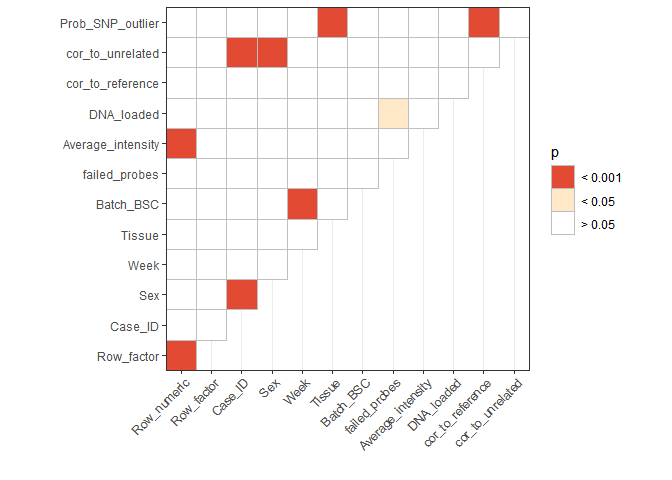<!-- -->

```r
lm(pDat_1$Row_numeric ~ pDat_1$Average_intensity) %>% summary
```

```
## 
## Call:
## lm(formula = pDat_1$Row_numeric ~ pDat_1$Average_intensity)
## 
## Residuals:
##     Min      1Q  Median      3Q     Max 
## -3.2824 -1.6839 -0.4083  1.4591  5.8071 
## 
## Coefficients:
##                            Estimate Std. Error t value Pr(>|t|)    
## (Intercept)              -6.2137498  2.5439326  -2.443   0.0163 *  
## pDat_1$Average_intensity  0.0008971  0.0002141   4.190 5.99e-05 ***
## ---
## Signif. codes:  0 '***' 0.001 '**' 0.01 '*' 0.05 '.' 0.1 ' ' 1
## 
## Residual standard error: 2.152 on 101 degrees of freedom
## Multiple R-squared:  0.1481,	Adjusted R-squared:  0.1396 
## F-statistic: 17.55 on 1 and 101 DF,  p-value: 5.987e-05
```

```r
lm(pDat_1$DNA_loaded ~ pDat_1$failed_probes) %>% summary
```

```
## 
## Call:
## lm(formula = pDat_1$DNA_loaded ~ pDat_1$failed_probes)
## 
## Residuals:
##      Min       1Q   Median       3Q      Max 
## -150.080  -20.790    4.024   20.939  102.639 
## 
## Coefficients:
##                        Estimate Std. Error t value Pr(>|t|)    
## (Intercept)          217.237524  12.827806  16.935   <2e-16 ***
## pDat_1$failed_probes  -0.006817   0.002846  -2.395   0.0187 *  
## ---
## Signif. codes:  0 '***' 0.001 '**' 0.01 '*' 0.05 '.' 0.1 ' ' 1
## 
## Residual standard error: 49.58 on 89 degrees of freedom
##   (12 observations deleted due to missingness)
## Multiple R-squared:  0.06055,	Adjusted R-squared:  0.04999 
## F-statistic: 5.736 on 1 and 89 DF,  p-value: 0.01872
```

Not surprising of the following:

`Sex` - `Case ID`           * Because each case has to be only one sex
`Batch_BSC` - `Week `       * Because each BSC batch was done in a particular week
`Case ID` and `correlation to unrelated` makes sense given that all samples in the same case are
highly correlated at SNP probes, so their correlation to others should be highly similar.

Below I examine the distributions of the other significantly associated covariates:


```r
g1 <- ggplot(pDat_1, aes(y = cor_to_unrelated, x = Sex)) +
  geom_violin() + geom_jitter() + theme_bw() +labs(x = '')

g2 <- ggplot(pDat_1, aes(y = Prob_SNP_outlier, x = Tissue)) +
  geom_boxplot() + geom_jitter() + theme_bw() + labs(x = '') +
  theme(axis.text.x = element_text(angle =45, hjust = 1, vjust = 1))


g3 <- ggplot(pDat_1, aes(x = Row_numeric, y = Average_intensity)) +
  geom_point(alpha = 0.5, position = position_dodge2(0.1)) + theme_bw() + 
  geom_smooth(method = 'loess') + 
  labs(title = 'Rsquared = 0.15')

g4 <- ggplot(pDat_1, aes(x = DNA_loaded, y = failed_probes)) +
  geom_smooth(method = 'lm') + labs(title = 'Rsquared = 0.05', x = 'DNA loaded (ng)') +
  geom_jitter(alpha = 0.5, width = 1) + theme_bw()

plot_grid(g1, g2, g3, g4, ncol = 2)
```

```
## Warning: Removed 12 rows containing non-finite values (stat_smooth).
```

```
## Warning: Removed 12 rows containing missing values (geom_point).
```

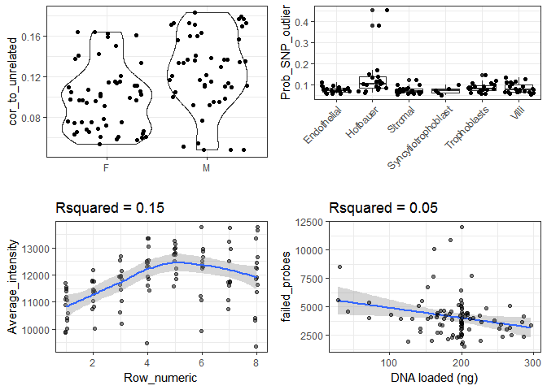<!-- -->

```r
ggplot(pDat_1, aes(x = Row_numeric, y = failed_probes)) +
  geom_point()
```

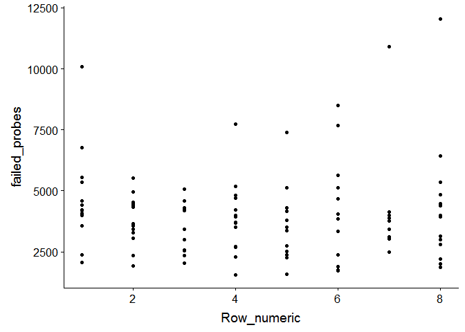<!-- -->

Importantly we see that Tissue is not confounded by any of our other variables.

# 3.0 Global methylation

## Density distributions

Here we plot the density distributions of the betas across each tissue


```r
# pull out sample names for each tissue
list <- list()
for (i in unique(pDat_1$Tissue)) {
  list[[i]] <- pDat_1 %>% filter(Tissue == i) %>% pull(Sample_Name)
}

# for each tissue estimate the density
densities <- tibble(Tissue = names(list),
       betas = lapply(list, function(x) as.vector(betas_1[,x]))) %>%
  mutate(densities = map(betas, ~ density(.))) %>%
  
   # pull out x and y coordinates
  mutate(x = map(densities, 'x'),
         y = map(densities, 'y')) %>%

  # remove input data, and unnest
  select(-betas, -densities) %>%
  unnest()

# plot
ggplot(densities, 
       aes(x = x, y = y, color = Tissue)) +
  geom_line(size = 2, alpha = 1) + theme_bw() +
  scale_x_continuous(breaks = c(0, 0.25, 0.5, 0.75, 1)) +facet_wrap(~Tissue) +
  scale_color_manual(values= color_code_tissue[unique(pDat_1$Tissue)])
```

<!-- -->

Here I plot the median beta value for each cpg for each tissue


```r
med_densities <- tibble(Tissue = names(list),
                        
                        # compute medians across every cpg for each tissue
                        betas = lapply(list, function(x) apply(betas_1[,x], 1, median))) %>% 
  
  # compute density line over medians
  mutate(densities = map(betas, ~ density(.))) %>%
  
  # pull out x and y coordinates for density
  mutate(x = map(densities, 'x'),
         y = map(densities, 'y')) %>%
  
  # unlist
  select(-betas, -densities) %>%
  unnest()

ggplot(med_densities, aes(x = x, y = y, color = Tissue)) +
  geom_line(size = 2, alpha = 0.6) + theme_bw() +
  scale_x_continuous(breaks = c(0, 0.25, 0.5, 0.75, 1))  +
  scale_color_manual(values= color_code_tissue[unique(pDat_1$Tissue)])
```

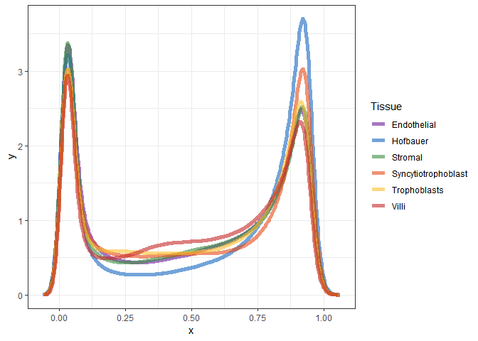<!-- -->

For each sample:


```r
sample_densities <- pDat_1 %>%
  select(Sample_Name, Tissue) %>%
  mutate(densities = apply(betas_1, 2, density)) %>%
  mutate(x = map(densities, 'x'),
         y = map(densities, 'y')) %>%
  select(-densities) %>%
  unnest()

ggplot(sample_densities, aes(x = x, y = y, color = Tissue, group = Sample_Name)) +
  geom_line(size = 1, alpha = 0.5) + theme_bw() +
  scale_x_continuous(breaks = c(0, 0.25, 0.5, 0.75, 1))  +
  facet_wrap(~Tissue) +
  scale_color_manual(values = color_code_tissue[unique(pDat_1$Tissue)]) +
  geom_text_repel(data = sample_densities %>% 
                    filter(Sample_Name == 'PM364_hofb_cs', x > 0.55, x < 0.6) %>%
                    dplyr::slice(1),
                  aes(x = x, y = y, label = Sample_Name), inherit.aes = F,
                  nudge_y = 1, nudge_x = -0.1) +
  labs(x = '% methylation', y = 'density')
```

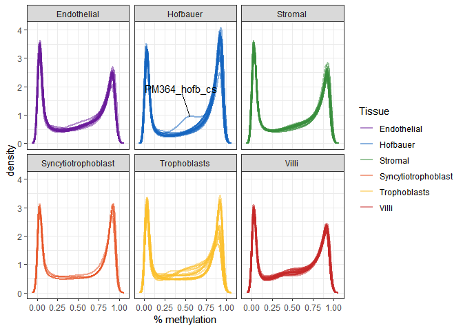<!-- -->

## PCA


```r
# compute pca
set.seed(1)
pca_1 <- prcomp_irlba(t(betas_1), n = 20, center = T, scale = F)

# add pc scores to pdata
pca_scores <- pca_1$x[,1:20] %>% as.data.frame()
colnames(pca_scores) <- paste0(colnames(pca_scores), '_processed')
pDat_1 <- pDat_1 %>% bind_cols(pca_scores) %>% select(-contains('_raw'))

# create proportion variance explained data frame
pc_info <- summary(pca_1)$importance %>% 
  as.data.frame() %>% 
  tibble::rownames_to_column(var = 'variable') %>%
  gather(key = 'PC', value = 'value', -variable) %>%
  as_tibble() %>%
  mutate(PC = factor(as.character(PC), levels = paste0('PC', 1:20)),
         Label = ifelse(variable == 'Proportion of Variance',
                        paste0(PC, ' (', prettyNum(value*100, digits = 2), '%)'),
                        as.character(PC))) %>%
  arrange(variable, PC)

  
# correlate PCs with phenodata
pc_cor <- lmmatrix(dep = pca_1$x[,1:20],
                   ind = pDat_1 %>%
                   dplyr::select(Case_ID, Tissue, Sex, #bio
                                 Week, Chip_number, Row_numeric, Row_factor, Batch_BSC, # batch
                                 DNA_loaded, 
                                 failed_probes,
                                 cor_to_reference, Prob_SNP_outlier),
                   metric = 'Pvalue')
# plot data
pc_cor <- pc_cor %>% as.data.frame() %>% 
  
  # add dep variables
  mutate(dep = rownames(pc_cor)) %>%
  
  # reshape
  gather(PC, pval, -dep) %>%
  
  # pvalue categories
  mutate(pval_cat = factor(case_when(
    pval > 0.05  ~ '> 0.05',
    pval < 0.05 & pval > 0.01 ~ '< 0.05',
    pval < 0.01 & pval > 0.001 ~ '< 0.01',
    pval < 0.001 ~ '< 0.001'
  ), levels = c('> 0.05', '< 0.05','< 0.01', '< 0.001')),
  
  # make PC is encoded with proper levels!!!
  PC = factor(PC, levels = paste0('PC', 1:20))) %>% as_tibble()

# create color palette
colpal <- c('white', '#fee8c8', '#fdbb84', '#e34a33')
names(colpal) <- levels(pc_cor$pval_cat)

p1 <- ggplot(pc_cor, aes(x = PC, y = dep, fill = pval_cat)) +
  geom_tile(col = 'lightgrey') + theme_bw() +
  scale_x_discrete(expand = c(0, 0), labels = 1:20) +
  scale_y_discrete(expand = c(0, 0)) +
  scale_fill_manual(values = colpal)  + 
  labs(y = '', fill = 'P value')

p2 <- ggplot(pc_info %>% filter(variable == 'Proportion of Variance') %>%
               mutate(value = value*100), 
             aes(x = PC, y = value)) +
  geom_bar(stat = 'identity') +
  theme_bw() + 
  scale_x_discrete(expand = c(0, 0), labels = 1:20) + 
  scale_y_continuous(expand = c(0, 0)) +
  labs(y = '% variance explained')

egg::ggarrange(p1, p2, heights = c(3,1))
```

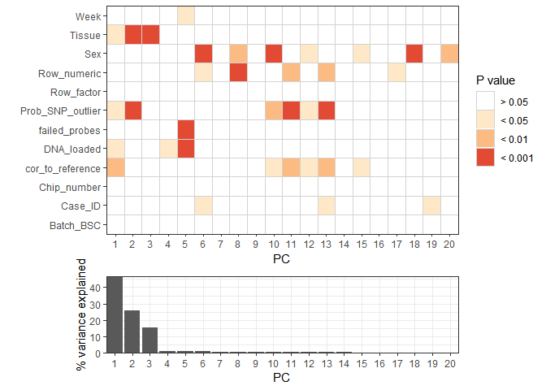<!-- -->

Plot some scatterplots of significantly associated variables


```r
scatter <- function(x, y, fill, point_size = 1){
  xlab <- pc_info %>% filter(variable == 'Proportion of Variance', PC == x) %>% pull(Label)
  ylab <- pc_info %>% filter(variable == 'Proportion of Variance', PC == y) %>% pull(Label)
  
  x <- paste0(x, '_processed')
  y <- paste0(y, '_processed')
  
  out <- ggplot(pDat_1, aes_string(x = x, y = y, fill = fill)) +
    geom_point(shape = 21, size = point_size) + theme_bw() + labs(x = xlab, y = ylab) 
  
  if (is.numeric(as.data.frame(pDat_1)[,fill])){
    out <- out +
      scale_fill_viridis()
  } else {
    out <- out + 
      scale_fill_brewer(palette = 'Set1')
  }
    
  out
}
scatter(x = 'PC1', y = 'PC2', fill = 'Tissue', point_size = 2) +
  scale_fill_manual(values = color_code_tissue[unique(pDat_1$Tissue)]) +
  geom_text_repel(data = pDat_1 %>% filter((Tissue == 'Hofbauer' & PC1_processed < 0)|
                                             Case_ID == 'PM364'),
                  aes(x = PC1_processed, y = PC2_processed, label =Sample_Name),
                  nudge_y = 15, nudge_x = -5)
```

```
## Scale for 'fill' is already present. Adding another scale for 'fill',
## which will replace the existing scale.
```

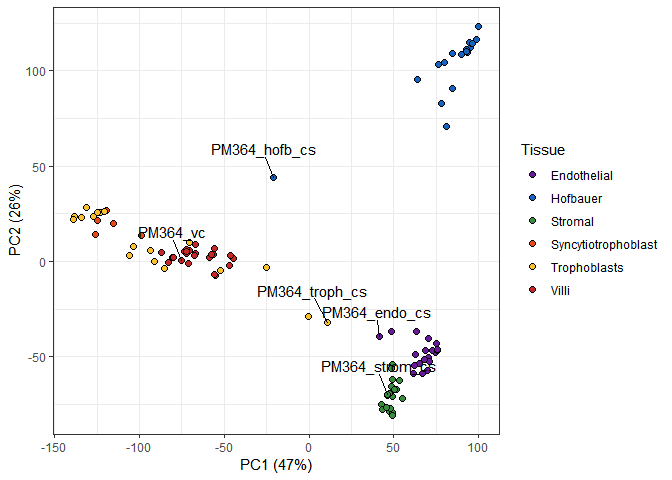<!-- -->

```r
scatter(x = 'PC1', y = 'PC2', fill = 'cor_to_reference', point_size = 2)
```

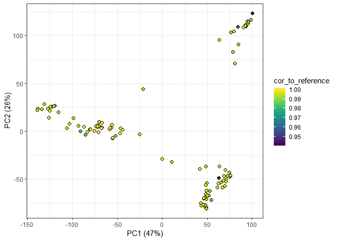<!-- -->

```r
scatter(x = 'PC1', y = 'PC2', fill = 'Prob_SNP_outlier', point_size = 2)
```

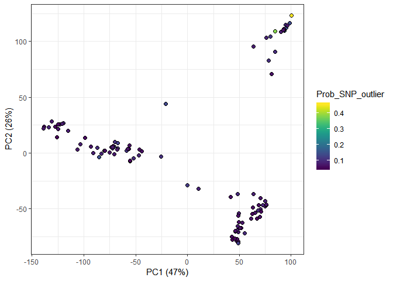<!-- -->

```r
scatter(x = 'PC1', y = 'PC2', fill = 'DNA_loaded', point_size = 2)
```

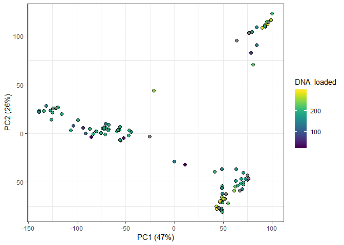<!-- -->

```r
# calculate association after adjusting for tissue effects
scatter(x = 'PC3', y = 'PC4', fill = 'Tissue', point_size = 2) +
  scale_fill_manual(values = color_code_tissue[unique(pDat_1$Tissue)])
```

```
## Scale for 'fill' is already present. Adding another scale for 'fill',
## which will replace the existing scale.
```

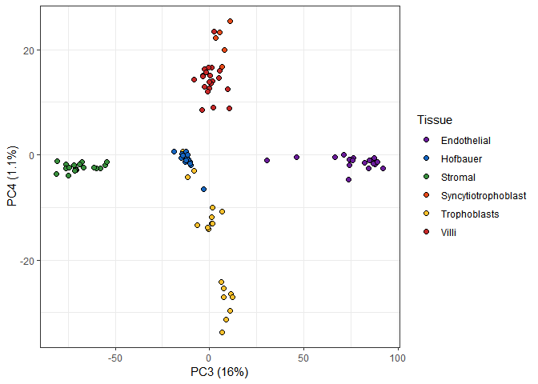<!-- -->

```r
scatter(x = 'PC5', y = 'PC6', fill = 'failed_probes', point_size = 2)
```

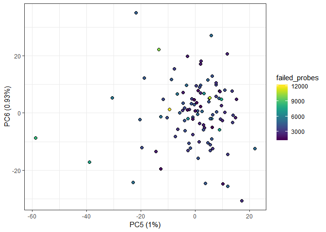<!-- -->

```r
scatter(x = 'PC5', y = 'PC6', fill = 'DNA_loaded', point_size = 2)
```

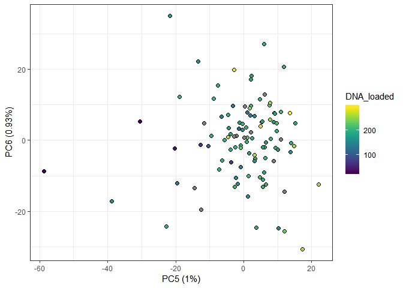<!-- -->

```r
scatter(x = 'PC5', y = 'PC6', fill = 'Week', point_size = 2)
```

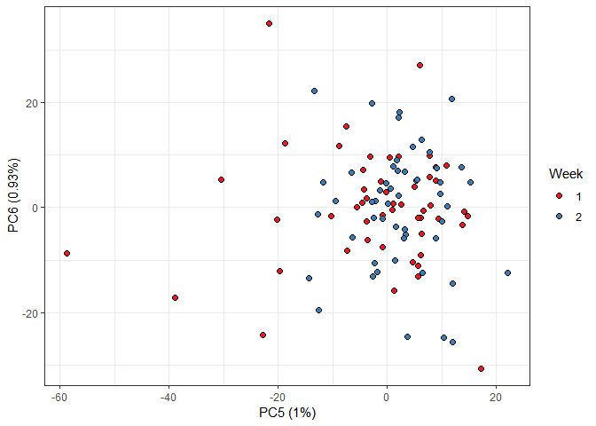<!-- -->

```r
scatter(x = 'PC5', y = 'PC6', fill = 'Sex', point_size = 2)
```

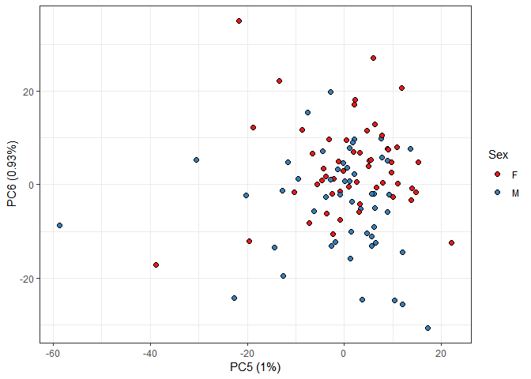<!-- -->

```r
scatter(x = 'PC5', y = 'PC6', fill = 'Row_numeric', point_size = 2)
```

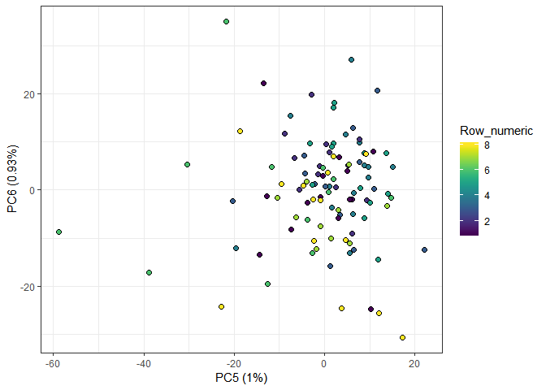<!-- -->

```r
scatter(x = 'PC7', y = 'PC8', fill = 'Sex', point_size = 2)
```

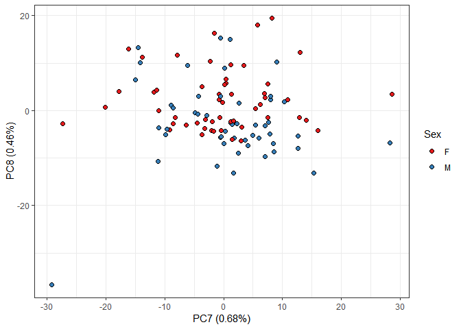<!-- -->

```r
scatter(x = 'PC7', y = 'PC8', fill = 'Row_numeric', point_size = 2)
```

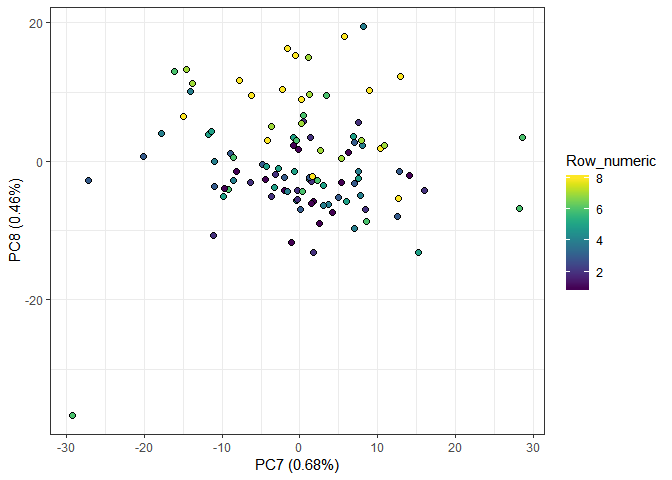<!-- -->

```r
scatter(x = 'PC9', y = 'PC10', fill = 'Sex', point_size = 2)
```

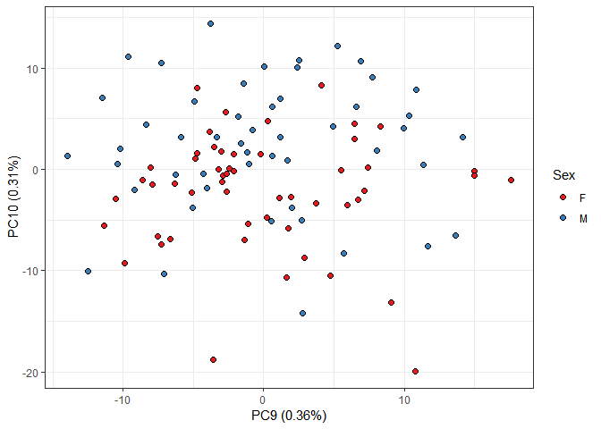<!-- -->

```r
scatter(x = 'PC10', y = 'PC11', fill = 'Prob_SNP_outlier', point_size = 2)
```

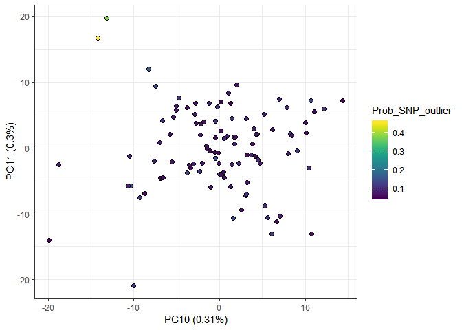<!-- -->

```r
scatter(x = 'PC12', y = 'PC13', fill = 'Prob_SNP_outlier', point_size = 2)
```

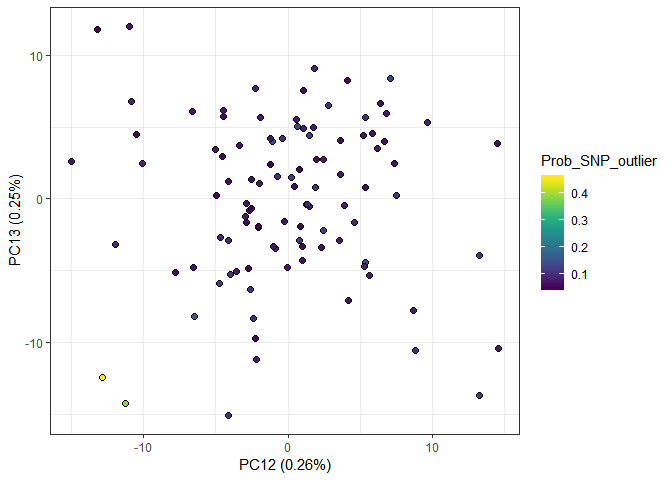<!-- -->

```r
pDat_1 %>%
  arrange(Tissue, cor_to_reference) %>%
  mutate(Sample_Name = factor(as.character(Sample_Name), levels = Sample_Name)) %>%
  ggplot(aes(x = Sample_Name, y = cor_to_reference, fill = Tissue)) +
  geom_point(shape = 21, col = 'black', size = 2.5) + 
  geom_text_repel(data = pDat_1 %>% filter(Sample_Name == 'PM364_hofb_cs'),
                  aes(x = Sample_Name, y = cor_to_reference, label = Sample_Name),
                  nudge_y = -0.01) +
  labs(x = 'Samples', y ='',  title = '')+
  scale_fill_manual(values = color_code_tissue[unique(pDat_1$Tissue)]) +
  theme_bw()+
  theme(axis.text.x = element_blank(),
        panel.grid.minor.x = element_blank(),
        panel.grid.major.x = element_blank()) 
```

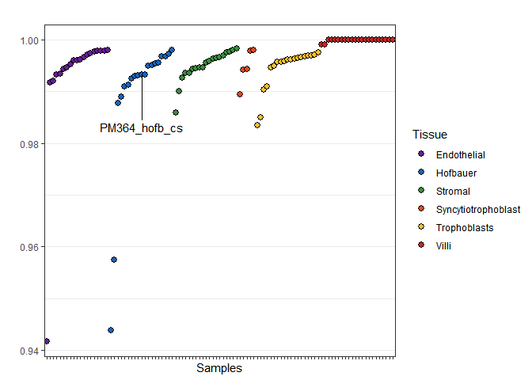<!-- -->

## UMAP


```r
custom_settings <- umap.defaults
custom_settings$n_neighbors <- 6
custom_settings$random_state <- 2

umap_res <- umap(t(betas_1), config = custom_settings)

umap_res$config
```

```
## umap configuration parameters
```

```
##            n_neighbors: 6
```

```
##           n_components: 2
```

```
##                 metric: euclidean
```

```
##               n_epochs: 200
```

```
##                  input: data
```

```
##                   init: spectral
```

```
##               min_dist: 0.1
```

```
##       set_op_mix_ratio: 1
```

```
##     local_connectivity: 1
```

```
##              bandwidth: 1
```

```
##                  alpha: 1
```

```
##                  gamma: 1
```

```
##   negative_sample_rate: 5
```

```
##                      a: 1.57694361269457
```

```
##                      b: 0.895060718151928
```

```
##                 spread: 1
```

```
##           random_state: 2
```

```
##        transform_state: NA
```

```
##            knn_repeats: 1
```

```
##                verbose: FALSE
```

```
##        umap_learn_args: NA
```

```
##                 method: naive
```

```
##        metric.function: [function]
```

```r
x <- umap_res$layout %>% as_tibble() %>% dplyr::rename(UMAP1 = V1, UMAP2 = V2) %>% 
  bind_cols(pDat_1 %>% select(Tissue, Sample_Name))
```

```
## Warning: `as_tibble.matrix()` requires a matrix with column names or a `.name_repair` argument. Using compatibility `.name_repair`.
## This warning is displayed once per session.
```

```r
ggplot(x, aes(x = UMAP1, y = UMAP2, fill = Tissue)) +
  geom_point(shape = 21, size = 3) + theme_bw() +
  scale_fill_manual(values = color_code_tissue[unique(pDat_1$Tissue)]) +
  geom_text_repel(data = x %>% filter(Sample_Name %in% c('PM364_hofb_cs', 'PM364_troph_cs')),
                  aes(x = UMAP1, y = UMAP2, label = Sample_Name), nudge_y = 3.5,
                  force = 15)
```

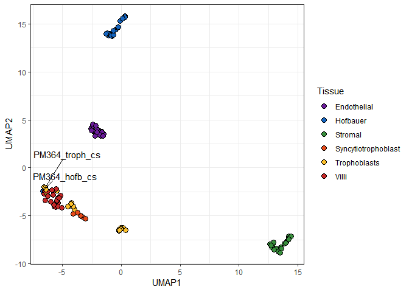<!-- -->

## Hierarchical clustering


```r
# assign sample names as numbers
x <- pDat_1 %>%  select(Sample_Name, Case_ID, Tissue)  %>%
  mutate(Sample_number = as.numeric(as.factor(Case_ID))) %>%
  mutate(Sample_ID = paste0(Sample_number, 
                            '_', 
                            str_extract(pDat_1$Sample_Name, '(?<=_).*')))
x
```

```
## # A tibble: 103 x 5
##    Sample_Name    Case_ID Tissue       Sample_number Sample_ID  
##    <chr>          <chr>   <chr>                <dbl> <chr>      
##  1 PM365_endo_cs  PM365   Endothelial              5 5_endo_cs  
##  2 PM376_vc       PM376   Villi                   16 16_vc      
##  3 PM370_hofb_cs  PM370   Hofbauer                10 10_hofb_cs 
##  4 PM368_troph_cs PM368   Trophoblasts             8 8_troph_cs 
##  5 PM368_vc       PM368   Villi                    8 8_vc       
##  6 PM372_endo_cs  PM372   Endothelial             12 12_endo_cs 
##  7 PM376_strom_cs PM376   Stromal                 16 16_strom_cs
##  8 PM367_troph_cs PM367   Trophoblasts             7 7_troph_cs 
##  9 PM371_hofb_cs  PM371   Hofbauer                11 11_hofb_cs 
## 10 PM378_vc       PM378   Villi                   18 18_vc      
## # ... with 93 more rows
```

```r
# Dissimilarity matrix
colnames(betas_1) <- x$Sample_ID

d <- dist(t(betas_1), method = "euclidean")

# Hierarchical clustering using Complete Linkage
hc1 <- hclust(d, method = "complete" )
dend <- hc1 %>% as.dendrogram

# plot
par(mar = c(8,4,7,1))
dend %>% plot()

# add colored bars
col_bars <- pDat_1 %>% select(Colors_Sex, Colors_Tissue)

colored_bars(colors = col_bars, 
             dend = dend, 
             sort_by_labels_order = T)

legend(legend = names(color_code_tissue[unique(pDat_1$Tissue)]), 
       fill = color_code_tissue[unique(pDat_1$Tissue)], 
       'top', ncol = 3,  cex = .75, pt.cex = 3.5, inset = c(-0.2), xpd=TRUE)
```

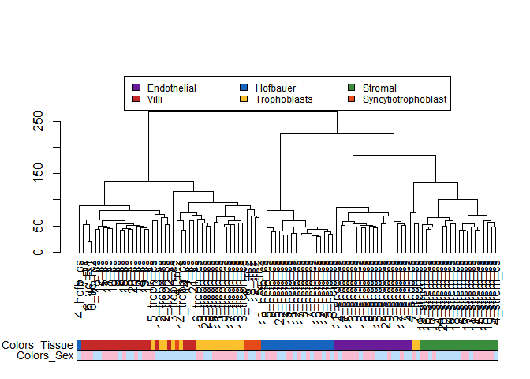<!-- -->

## Correlations


```r
# calculate correlation
colnames(betas_1) <- pDat_1$Sample_Name
cor_betas <- cor(betas_1)

#prepare for plot
colnames(cor_betas) <- rownames(cor_betas) <- x$Sample_ID

# annotation bar
annotation <- pDat_1 %>% select(Tissue, Sex) %>% as.data.frame()
rownames(annotation) <- x$Sample_ID

# colors for annotation
anno_colors <- list(
  Tissue = color_code_tissue[unique(pDat_1$Tissue)],
  Sex = setNames(color_code[[2]]$Colors_Sex, color_code[[2]]$Sex)
)

# pheatmap
pheatmap(cor_betas, annotation_col = annotation, show_rownames = F, show_colnames = F,
         labels_col = x$Sample_number, labels_row = x$Sample_number,
         angle_col = 45, fontsize_row = 6, fontsize_col = 6,
         annotation_colors = anno_colors,
         color = viridis(100, option = 'B'),
         cutree_cols = 6)
```

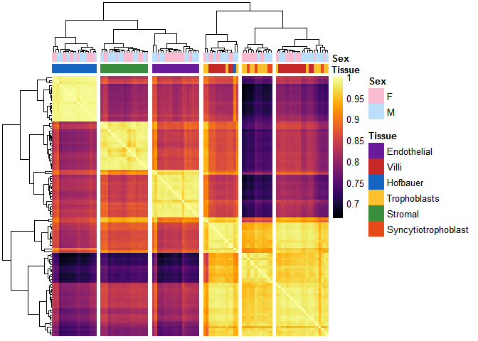<!-- -->

# SessionInfo


```r
sessionInfo()
```

```
## R version 3.6.0 (2019-04-26)
## Platform: x86_64-w64-mingw32/x64 (64-bit)
## Running under: Windows Server x64 (build 14393)
## 
## Matrix products: default
## 
## locale:
## [1] LC_COLLATE=English_Canada.1252  LC_CTYPE=English_Canada.1252   
## [3] LC_MONETARY=English_Canada.1252 LC_NUMERIC=C                   
## [5] LC_TIME=English_Canada.1252    
## 
## attached base packages:
## [1] stats     graphics  grDevices utils     datasets  methods   base     
## 
## other attached packages:
##  [1] stringr_1.4.0      dendextend_1.12.0  umap_0.2.1.0      
##  [4] tibble_2.1.1       purrr_0.3.2        cowplot_0.9.4     
##  [7] GGally_1.4.0       yahew_0.1.0        irlba_2.3.3       
## [10] Matrix_1.2-17      pheatmap_1.0.12    impute_1.58.0     
## [13] RColorBrewer_1.1-2 scales_1.0.0       viridis_0.5.1     
## [16] viridisLite_0.3.0  ggrepel_0.8.1      tidyr_0.8.3       
## [19] dplyr_0.8.1        ggplot2_3.1.1     
## 
## loaded via a namespace (and not attached):
##  [1] reticulate_1.12  tidyselect_0.2.5 xfun_0.6         lattice_0.20-38 
##  [5] colorspace_1.4-1 vctrs_0.1.0      htmltools_0.3.6  yaml_2.2.0      
##  [9] utf8_1.1.4       rlang_0.3.4      pillar_1.4.0     glue_1.3.1      
## [13] withr_2.1.2      plyr_1.8.4       egg_0.4.2        munsell_0.5.0   
## [17] gtable_0.3.0     evaluate_0.13    labeling_0.3     knitr_1.22      
## [21] fansi_0.4.0      Rcpp_1.0.1       backports_1.1.4  jsonlite_1.6    
## [25] RSpectra_0.14-0  gridExtra_2.3    digest_0.6.18    stringi_1.4.3   
## [29] grid_3.6.0       cli_1.1.0        tools_3.6.0      magrittr_1.5    
## [33] lazyeval_0.2.2   crayon_1.3.4     pkgconfig_2.0.2  zeallot_0.1.0   
## [37] assertthat_0.2.1 rmarkdown_1.12.7 reshape_0.8.8    R6_2.4.0        
## [41] compiler_3.6.0
```

# Save data


```r
saveRDS(cov_tests, '../../data/main/interim/21_cov_tests.rds')
saveRDS(sample_densities, '../../data/main/interim/21_sample_densities.rds')
saveRDS(list(pc_cor = pc_cor, pc_info = pc_info), '../../data/main/interim/21_pca.rds')
saveRDS(list(cor_betas = cor_betas, annotation = annotation, anno_colors = anno_colors,
             x = x), '../../data/main/interim/21_pheatmap_data.rds')
```
