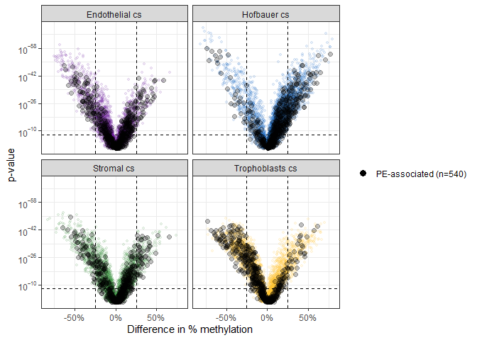
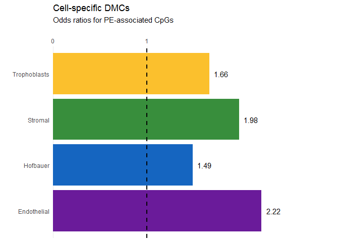
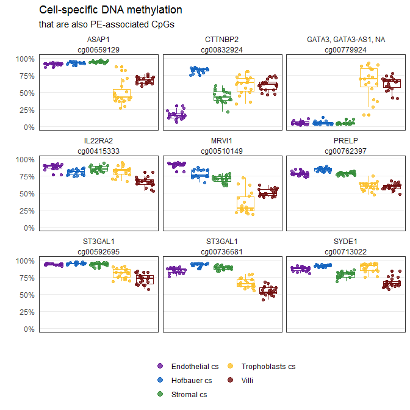
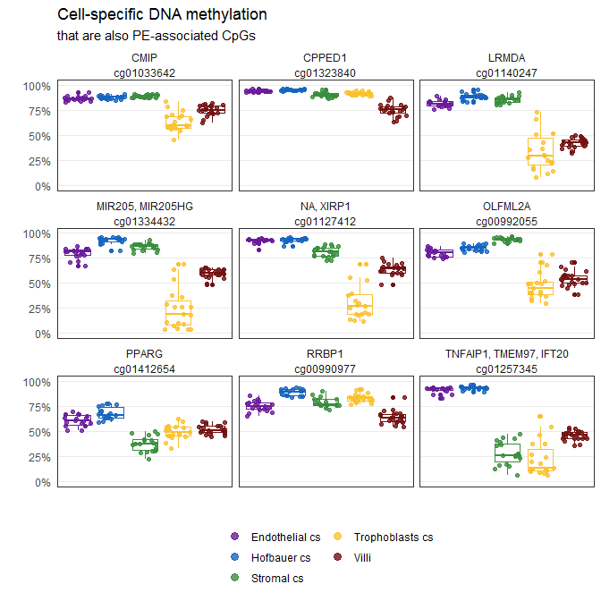
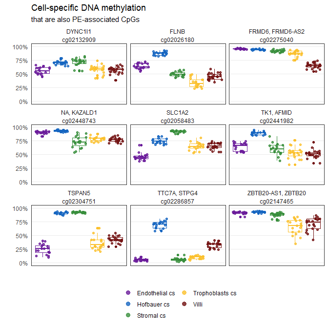
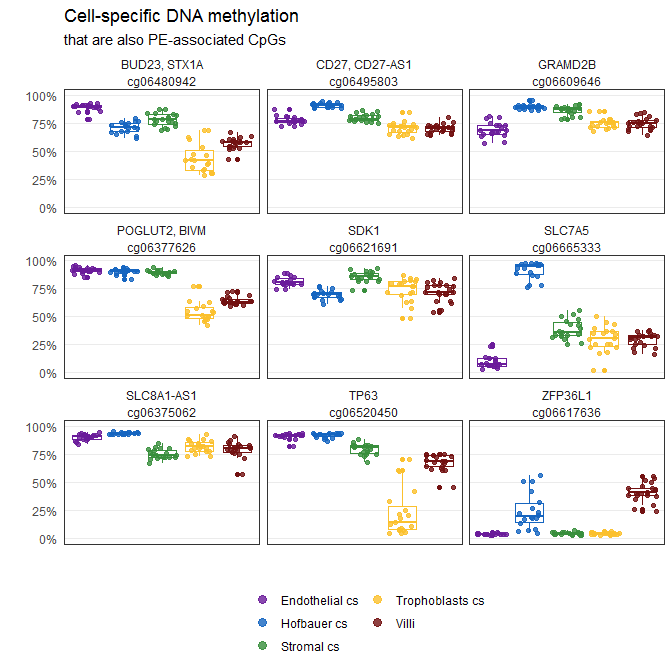
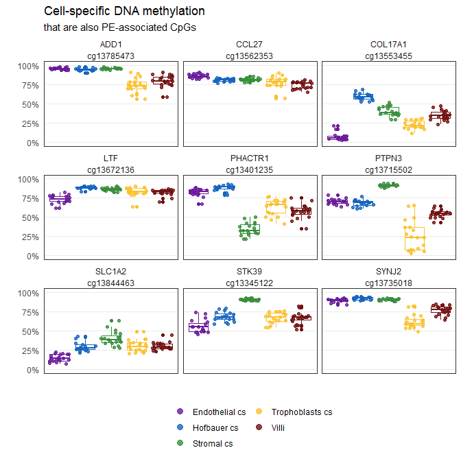
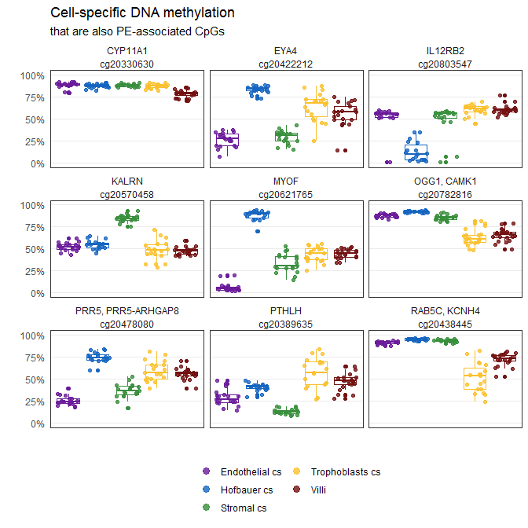

# Setup


```r
library(tidyverse)
library(here)
library(readxl)
library(janitor)
library(scales)
theme_set(theme_bw())

base_path <- file.path('data', 'main', 'interim')

#read in sam's 599 hits
pe_hits <- read_excel(here('data', 'external', 'ddx391_ST1_PersistentHits599_GeneInfo_2017.xlsx')) %>%
  clean_names()

# read in cell dmcs (first/third)
dmcs <- readRDS(here(base_path, '2_4_dmcs.rds'))

#color code
color_code <- readRDS(here(base_path, '2_3_color_code.rds'))
color_code_tissue <- setNames(color_code$Colors_Tissue, color_code$label)
```

# Volcano

Let's take a look at the PE hits overall DMC tests


```r
print(paste(sum(pe_hits$probe %in% dmcs$gene), 'out of', nrow(pe_hits), 'PE-associated CpGs are in my filtered data (n =', nrow(dmcs)/8, ')'))
```

```
## [1] "540 out of 599 PE-associated CpGs are in my filtered data (n = 737050 )"
```

```r
set.seed(1)
dmcs %>%
  filter(grepl('Third', Group1)) %>%
  separate(Group1, sep = '\\.', into = c('Trimester', 'Tissue')) %>%
  mutate(Tissue = case_when(
    Tissue == 'Endo_cs' ~ 'Endothelial cs',
    Tissue == 'Hofb_cs' ~ 'Hofbauer cs',
    Tissue == 'Strom_cs' ~ 'Stromal cs',
    Tissue == 'Troph_cs' ~ 'Trophoblasts cs'),
    
    pe_hit = gene %in% pe_hits$probe) %>%
  {
    ggplot(data = ., aes(x = delta_b, y = p.value)) +
      geom_point(data = group_by(., Tissue) %>%
                   filter(!pe_hit) %>%
                   sample_n(5000),
                 aes(color = Tissue),
                 alpha = 0.1,
                 size = 1) +
      geom_point(data = filter(., pe_hit),
                 aes(fill = 'PE-associated (n=540)'), 
                 alpha = 0.25, 
                 shape = 19, 
                 size = 2) +
      
      # add bonf p = 0.01 line
      geom_hline(data = group_by(., Tissue) %>%
                   filter(bonferroni <= 0.01) %>%
                   arrange(desc(fdr)) %>%
                   summarize(threshold = max(p.value)),
                 linetype = 'dashed',
                 aes(yintercept = threshold)) +
      geom_vline(linetype = 'dashed', xintercept = 0.25) +
      geom_vline(linetype = 'dashed', xintercept = -0.25) + 
      
      facet_wrap(~Tissue) +
      scale_x_continuous(labels = percent) +
      scale_y_continuous(trans = trans_new('neglog', 
                                           transform = function(x)(-log(x)), 
                                           inverse = function(x)(exp(-x)),
                                           breaks = log_breaks()),
                         label = function(x) {
                           parse(text = gsub("1e", "10^", scales::scientific_format()(x)))
                           }) +
      scale_color_manual(values = color_code_tissue[.$Tissue],
                         guide = FALSE) +
      scale_fill_manual(values = c('PE-associated (n=540)' = 'grey'), 
                        guide = guide_legend(override.aes = list(size = 3, alpha = 1))) +
      labs(x = 'Difference in % methylation', y = 'p-value',
           color = '', fill = '')
  }
```

<!-- -->


# Enrichment


```r
# annotation
anno <- readRDS('Z:/Victor/Repositories/EPIC_annotation/hg19_epic_annotation.rds')

p_thresh <- 0.01
b_thresh <- 0.25

# dummy variable all categories
annotation <- anno %>% 
  
  mutate(pe = cpg %in% pe_hits$probe) %>%
  select(cpg, pe)
  
# add gene annotation to dmcs
dmcs <- dmcs %>% left_join(annotation, by = c('gene' = 'cpg'))

# filter to all tested cpgs
annotation <- annotation %>%
  filter(cpg %in% dmcs$gene)
  
# tabulate the background frequency per genomic element
expected <-  annotation %>%
  gather(key = genomic_feature, value = present, -cpg) %>%
  
  group_by(genomic_feature) %>%
  summarize(Expected_n_in = sum(present), 
            
            Expected_n_out = nrow(annotation) - Expected_n_in,
            Expected_p_in = Expected_n_in/ nrow(annotation),
            Expected_p_out = Expected_n_out / nrow(annotation))

# tabulate observed frequency for significant cpgs
observed <- dmcs %>% 
  
  # add hypo hyper as group
  #mutate(Group1 = paste0(Group1, ifelse(delta_b > 0, '.Hyper', '.Hypo'))) %>%
  
  # calculate total dmcs per cell type
  group_by(Group1) %>%
  mutate(n_total = sum(bonferroni < p_thresh & abs(delta_b) > b_thresh )) %>%
  
  # filter to just dmcs
  filter(bonferroni < p_thresh, abs(delta_b) > b_thresh) %>%
  select(Group1, gene, pe, n_total) %>%

  # calculated the number of dmcs in each feature, and then the number out
  gather(key = genomic_feature, value = present, -gene, -Group1, -n_total) %>%
  group_by(Group1, genomic_feature) %>%
  summarize(Observed_n_in = sum(present), 
            
            Observed_n_out = unique(n_total) - Observed_n_in,
            Observed_p_in = Observed_n_in / unique(n_total),
            Observed_p_out = Observed_n_out / unique(n_total))

# fisher's test for enrichment
# (1) # of DMCs on var1 (already calcualted, 'Freq')
# (2) # of non-DMCs on var1
# (3) # of DMCs not on var1
# (4) # of non-DMCs not on var1


# calculate (2) (3) (4), and test enrichment
tests <- observed %>%
  
  ungroup() %>%
  
  # add in all_cpgs datarfame for calculations
  left_join(expected, by = 'genomic_feature') %>%
  
  # calculate (2), (4)
  mutate(Observed_notDMC_in = Expected_n_in - Observed_n_in,   #(2) # non-DMCs in var1
         
         # for (4)
         Observed_notDMC_out = Expected_n_out - Observed_n_out) %>%  # of non-DMCs out of Var1
  
  # test enrichment
  rowwise() %>%
  mutate(test_in = list(matrix(c(Observed_n_in, Observed_notDMC_in, 
                                   Observed_n_out, Observed_notDMC_out),2,2))) %>%
  ungroup() %>%
  
  mutate(test_out = map(test_in, ~fisher.test(., conf.int = 0.95)),
         p = map_dbl(test_out, 'p.value'),
         confidence_interval_min = map_dbl(test_out, ~.$conf.int[1]),
         confidence_interval_max = map_dbl(test_out, ~.$conf.int[2]),
         odds_ratio = map_dbl(test_out, 'estimate'),
         FDR = p.adjust(p, method = 'fdr'),
         bonferroni = p.adjust(p, method = 'bonferroni'),
         FDR01 = FDR < 0.01,
         bonferroni01 = bonferroni < 0.01) %>% 
  select(odds_ratio, contains('confidence'), FDR, FDR01, bonferroni, bonferroni01, p, everything())


tests
```

```
## # A tibble: 8 x 22
##   odds_ratio confidence_inte~ confidence_inte~       FDR FDR01 bonferroni
##        <dbl>            <dbl>            <dbl>     <dbl> <lgl>      <dbl>
## 1       2.64            1.82              3.72 1.11e-  6 TRUE   6.64e-  6
## 2       2.33            1.88              2.86 4.91e- 13 TRUE   9.81e- 13
## 3       1.81            0.930             3.19 4.89e-  2 FALSE  3.91e-  1
## 4       8.18            6.86              9.77 8.45e-122 TRUE   8.45e-122
## 5       2.22            1.78              2.74 1.88e- 11 TRUE   5.63e- 11
## 6       1.49            1.21              1.81 1.73e-  4 TRUE   1.21e-  3
## 7       1.98            1.58              2.46 8.69e-  9 TRUE   3.48e-  8
## 8       1.66            1.36              2.01 7.86e-  7 TRUE   3.93e-  6
## # ... with 16 more variables: bonferroni01 <lgl>, p <dbl>, Group1 <chr>,
## #   genomic_feature <chr>, Observed_n_in <int>, Observed_n_out <int>,
## #   Observed_p_in <dbl>, Observed_p_out <dbl>, Expected_n_in <int>,
## #   Expected_n_out <int>, Expected_p_in <dbl>, Expected_p_out <dbl>,
## #   Observed_notDMC_in <int>, Observed_notDMC_out <int>, test_in <list>,
## #   test_out <list>
```

```r
# clean
tests <- tests %>%
  separate(Group1, into = c('Trimester', 'Celltype', 'Direction'), sep = '\\.') %>%
  mutate(Celltype = case_when(
    Celltype == 'Endo_cs' ~ 'Endothelial cs',
    Celltype == 'Hofb_cs' ~ 'Hofbauer cs',
    Celltype == 'Strom_cs' ~ 'Stromal cs',
    Celltype == 'Troph_cs' ~ 'Trophoblasts cs')) 
```

```
## Warning: Expected 3 pieces. Missing pieces filled with `NA` in 8 rows [1,
## 2, 3, 4, 5, 6, 7, 8].
```

```r
colors <- color_code %>% 
  filter(label %in% c('Endothelial cs', 'Hofbauer cs', 'Stromal cs', 'Trophoblasts cs'))
colors <- setNames(colors$Colors_Tissue, unique(tests$Celltype))

# categorize genomic features
tests <- tests %>% 
  mutate(
    genomic_feature_category = case_when(
      grepl('chr', genomic_feature) ~ 'chr',
      genomic_feature %in% c('1to5kb', '3UTR', '5UTR', 'exon', 'intron', 
                             'intergenic', 'intronexonboundary', 'promoter') ~ 'gene',
      genomic_feature %in% c('island', 'shore', 'shelf', 'sea') ~ 'cpg_island',
      grepl('imprint', genomic_feature) ~ 'imprinting',
      genomic_feature == 'pmd' ~ 'pmd',
      genomic_feature == 'enhancer' ~ 'enhancer'),
    FDR_cat = case_when(
      FDR < 0.05 ~ "FDR < 0.05",
      FDR < 0.01 ~ "FDR < 0.01",
      FDR < 0.001 ~ "FDR < 0.001",
      TRUE ~ "n.s")
    ) 
```

## Visualize


```r
# plot function
plot_enrich <- function(x) {
  g <- ggplot(data = x) +
  geom_hline(yintercept = 1, color = 'black', linetype = 'solid', size = 1) +
  geom_pointrange(aes(x = genomic_feature, 
                      ymin = confidence_interval_min, 
                      ymax = confidence_interval_max,
                      shape = FDR01, y = odds_ratio, color = Celltype),
                  position = position_dodge(width =0.5 )) +
  geom_vline(xintercept = seq(1, 22, 2), alpha = 0.25) +
  facet_grid(Celltype~Direction) +
  scale_color_manual(values= color_code_tissue[unique(tests$Celltype)]) +
  scale_y_log10() +
  scale_shape_manual(values = c('TRUE' = 16, 'FALSE' = 15), 
                     labels = c('Not significant', 'FDR < 0.01')) +
  coord_flip() +
  theme_bw() +
  theme(panel.grid.minor.x = element_blank(),
        panel.grid.major.y = element_blank(),
        axis.text.y = element_text(size = 8))
  print(g)
}

tests %>% 
  filter(Trimester == 'Third') %>%
  ggplot() +
  geom_bar(aes(x = Celltype, 
                      shape = FDR01,
                      y = odds_ratio, 
                      fill = Celltype),
           stat = 'identity') +
  geom_hline(yintercept = 1, color = 'black', linetype = 'dashed', size = 1) +
  geom_text(aes(y = odds_ratio, x = Celltype, label = number(odds_ratio, accuracy = 0.01)),
            hjust = 0,
            nudge_y = 0.05) +
  scale_fill_manual(values= color_code_tissue[unique(tests$Celltype)], guide = FALSE) +
  scale_y_continuous(expand = c(0,0),
                limits = c(0, 3), breaks = c(0, 1), position = 'bottom') +
  scale_shape_manual(values = c('TRUE' = 16, 'FALSE' = 15), 
                     labels = c('FDR < 0.01', 'Not significant'),
                     guide = FALSE) +
  scale_x_discrete(labels = function(x)gsub(' cs', '', x)) +
  coord_flip() +
  theme_bw() +
  theme(panel.grid.minor.x = element_blank(),
        panel.grid.major.y = element_blank(),
        panel.border = element_blank(),
        axis.ticks = element_blank()) +
  labs(y = '', x = '', color = '', title = 'Cell-specific DMCs',
       subtitle = 'Odds ratios for PE-associated CpGs')
```

```
## Warning: Ignoring unknown aesthetics: shape
```

<!-- -->

# Plot some PE-associated CpGs

Here I plot 36 of the 540 PE-associated CpGs by celltype.

These are third trimester samples.


```r
# raw methylation data
betas <- readRDS(here(base_path, '1_4_betas_noob_filt.rds'))

pDat <- readRDS(here(base_path, '2_3_pDat_contam.rds'))
pDat <- pDat %>%
  mutate(Tissue = case_when(
    !(Tissue %in% c('Villi', 'Villi maternal', 'Syncytiotrophoblast')) ~ paste(Tissue, 'cs'),
    Tissue == 'Syncytiotrophoblast' ~ 'Trophoblasts enz',
    TRUE ~ Tissue
  )) 

pDat_filt <- pDat %>% 
  filter(maternal_contamination_norm_flip < 0.35,
         !Sample_Name %in% c('PM364_hofb_cs', 'PL293_v_R2', 'PM366_vc_R2', 'P131_hofb_cs', 
                             'PM324_V4', 'PM324_V1'),
         !Tissue %in% c('Villi maternal', 'Trophoblasts enz', 'Mixture cs', 
                        'Dead Cells and Lymphocytes cs'))

colors <- color_code %>% 
  filter(label %in% c('Endothelial cs', 'Hofbauer cs', 'Stromal cs', 'Trophoblasts cs',
                      'Villi'))
colors <- setNames(colors$Colors_Tissue, unique(pDat_filt$Tissue))

# filter to first trimester
betas_filt <- betas[,pDat_filt$Sentrix]
colnames(betas_filt) <- pDat_filt$Sample_Name

#join betas (PE) to pDat
betas_pe <- betas_filt[intersect(pe_hits$probe, rownames(betas_filt)),] %>%
  t() %>%
  as.data.frame() %>%
  bind_cols(Sample_Name = rownames(.), .) %>%
  pivot_longer(cols = -Sample_Name,
               names_to = 'cpg',
               values_to = 'beta') %>%
  
  # add trimester tissue
  left_join(pDat_filt %>% select(Sample_Name, Trimester, Tissue)) %>%
  
  # add gene name
  left_join(anno %>% select(cpg, genes_symbol)) %>%
  mutate(genes_symbol = str_split(genes_symbol, ', '),
         genes_symbol = map_chr(genes_symbol, ~paste(unique(na.omit(.)), collapse = ', ')))
```

```
## Joining, by = "Sample_Name"
```

```
## Joining, by = "cpg"
```

```r
# plots
betas_pe %>%
  filter(Trimester == 'Third', genes_symbol != '') %>%
  group_by(Sample_Name) %>%
  arrange(cpg) %>%
  dplyr::slice(1:9) %>%
  ggplot(aes(x = Tissue, y = beta, color = Tissue)) +
  geom_boxplot(show.legend = FALSE) +
  geom_jitter(alpha = 0.8) +
  facet_wrap(~genes_symbol + cpg) +
  theme(axis.text.x = element_blank(),
        strip.text  = element_text(margin = margin(2, 0, 2, 0)),
        strip.background = element_blank(),
        panel.grid.major.x = element_blank(),
        panel.grid.minor.y = element_blank(),
        axis.ticks = element_blank(),
        legend.title = element_blank(),
        legend.position = 'bottom',
        legend.direction = 'horizontal') +
  scale_color_manual(values= color_code_tissue[unique(betas_pe$Tissue)],
                     guide = guide_legend(override.aes = list(size = 3),
                                          ncol = 2)) +
  scale_y_continuous(limits = c(0,1), labels = percent) +
  labs(x = '', y = '',
       title = 'Cell-specific DNA methylation', 
       subtitle = 'that are also PE-associated CpGs')
```

<!-- -->

```r
betas_pe %>%
  filter(Trimester == 'Third', genes_symbol != '') %>%
  group_by(Sample_Name) %>%
  arrange(cpg) %>%
  dplyr::slice(10:18) %>%
  ggplot(aes(x = Tissue, y = beta, color = Tissue)) +
  geom_boxplot(show.legend = FALSE) +
  geom_jitter(alpha = 0.8) +
  facet_wrap(~genes_symbol + cpg) +
  theme(axis.text.x = element_blank(),
        strip.text  = element_text(margin = margin(2, 0, 2, 0)),
        strip.background = element_blank(),
        panel.grid.major.x = element_blank(),
        panel.grid.minor.y = element_blank(),
        axis.ticks = element_blank(),
        legend.title = element_blank(),
        legend.position = 'bottom',
        legend.direction = 'horizontal') +
  scale_color_manual(values= color_code_tissue[unique(betas_pe$Tissue)],
                     guide = guide_legend(override.aes = list(size = 3),
                                          ncol = 2)) +
  scale_y_continuous(limits = c(0,1), labels = percent) +
  labs(x = '', y = '',
       title = 'Cell-specific DNA methylation', 
       subtitle = 'that are also PE-associated CpGs')
```

<!-- -->

```r
betas_pe %>%
  filter(Trimester == 'Third', genes_symbol != '') %>%
  group_by(Sample_Name) %>%
  arrange(cpg) %>%
  dplyr::slice(28:36) %>%
  ggplot(aes(x = Tissue, y = beta, color = Tissue)) +
  geom_boxplot(show.legend = FALSE) +
  geom_jitter(alpha = 0.8) +
  facet_wrap(~genes_symbol + cpg) +
  theme(axis.text.x = element_blank(),
        strip.text  = element_text(margin = margin(2, 0, 2, 0)),
        strip.background = element_blank(),
        panel.grid.major.x = element_blank(),
        panel.grid.minor.y = element_blank(),
        axis.ticks = element_blank(),
        legend.title = element_blank(),
        legend.position = 'bottom',
        legend.direction = 'horizontal') +
  scale_color_manual(values= color_code_tissue[unique(betas_pe$Tissue)],
                     guide = guide_legend(override.aes = list(size = 3),
                                          ncol = 2)) +
  scale_y_continuous(limits = c(0,1), labels = percent) +
  labs(x = '', y = '',
       title = 'Cell-specific DNA methylation', 
       subtitle = 'that are also PE-associated CpGs')
```

<!-- -->

```r
betas_pe %>%
  filter(Trimester == 'Third', genes_symbol != '') %>%
  group_by(Sample_Name) %>%
  arrange(cpg) %>%
  dplyr::slice(91:99) %>%
  ggplot(aes(x = Tissue, y = beta, color = Tissue)) +
  geom_boxplot(show.legend = FALSE) +
  geom_jitter(alpha = 0.8) +
  facet_wrap(~genes_symbol + cpg) +
  theme(axis.text.x = element_blank(),
        strip.text  = element_text(margin = margin(2, 0, 2, 0)),
        strip.background = element_blank(),
        panel.grid.major.x = element_blank(),
        panel.grid.minor.y = element_blank(),
        axis.ticks = element_blank(),
        legend.title = element_blank(),
        legend.position = 'bottom',
        legend.direction = 'horizontal') +
  scale_color_manual(values= color_code_tissue[unique(betas_pe$Tissue)],
                     guide = guide_legend(override.aes = list(size = 3),
                                          ncol = 2)) +
  scale_y_continuous(limits = c(0,1), labels = percent) +
  labs(x = '', y = '',
       title = 'Cell-specific DNA methylation', 
       subtitle = 'that are also PE-associated CpGs')
```

<!-- -->

```r
betas_pe %>%
  filter(Trimester == 'Third', genes_symbol != '') %>%
  group_by(Sample_Name) %>%
  arrange(cpg) %>%
  dplyr::slice(201:209) %>%
  ggplot(aes(x = Tissue, y = beta, color = Tissue)) +
  geom_boxplot(show.legend = FALSE) +
  geom_jitter(alpha = 0.8) +
  facet_wrap(~genes_symbol + cpg) +
  theme(axis.text.x = element_blank(),
        strip.text  = element_text(margin = margin(2, 0, 2, 0)),
        strip.background = element_blank(),
        panel.grid.major.x = element_blank(),
        panel.grid.minor.y = element_blank(),
        axis.ticks = element_blank(),
        legend.title = element_blank(),
        legend.position = 'bottom',
        legend.direction = 'horizontal') +
  scale_color_manual(values= color_code_tissue[unique(betas_pe$Tissue)],
                     guide = guide_legend(override.aes = list(size = 3),
                                          ncol = 2)) +
  scale_y_continuous(limits = c(0,1), labels = percent) +
  labs(x = '', y = '',
       title = 'Cell-specific DNA methylation', 
       subtitle = 'that are also PE-associated CpGs')
```

<!-- -->

```r
betas_pe %>%
  filter(Trimester == 'Third', genes_symbol != '') %>%
  group_by(Sample_Name) %>%
  arrange(cpg) %>%
  dplyr::slice(301:309) %>%
  ggplot(aes(x = Tissue, y = beta, color = Tissue)) +
  geom_boxplot(show.legend = FALSE) +
  geom_jitter(alpha = 0.8) +
  facet_wrap(~genes_symbol + cpg) +
  theme(axis.text.x = element_blank(),
        strip.text  = element_text(margin = margin(2, 0, 2, 0)),
        strip.background = element_blank(),
        panel.grid.major.x = element_blank(),
        panel.grid.minor.y = element_blank(),
        axis.ticks = element_blank(),
        legend.title = element_blank(),
        legend.position = 'bottom',
        legend.direction = 'horizontal') +
  scale_color_manual(values= color_code_tissue[unique(betas_pe$Tissue)],
                     guide = guide_legend(override.aes = list(size = 3),
                                          ncol = 2)) +
  scale_y_continuous(limits = c(0,1), labels = percent) +
  labs(x = '', y = '',
       title = 'Cell-specific DNA methylation', 
       subtitle = 'that are also PE-associated CpGs')
```

<!-- -->

