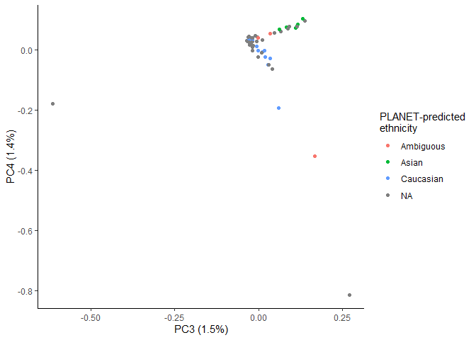
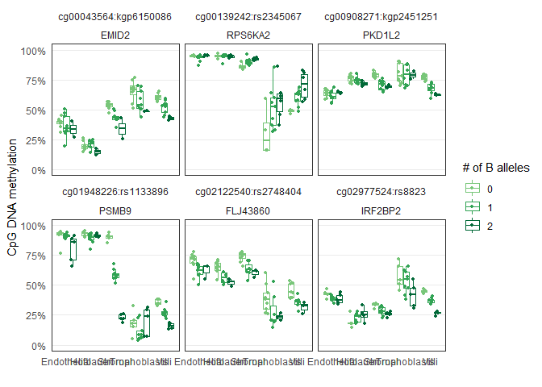

Recently I found out that we do have genotype (Omni 2.5, 2.5 million snps) data for all NIH cells 
samples. This means we can directly compare the mQTL associations found in Delahaye et al. 2019. 

To do this, I need to load in the SNPs and process them.


# Setup

## Libraries


```r
# libraries and data
library(minfi)
library(tidyverse)
library(scales)
library(here)
library(readxl)
library(janitor)
library(HardyWeinberg)
library(MatrixEQTL)
library(broom)
library(UpSetR)
library(ggridges)
theme_set(theme_bw())
```

## Data


```r
base_path <- file.path('data', 'main', 'interim')

# pData
pDat <- readRDS(here(base_path, '2_3_pDat_contam.rds'))
pDat <- pDat %>%
  mutate(Tissue = case_when(
    !(Tissue %in% c('Villi', 'Villi maternal', 'Syncytiotrophoblast')) ~ paste(Tissue, 'cs'),
    Tissue == 'Syncytiotrophoblast' ~ 'Trophoblasts enz',
    TRUE ~ Tissue
  )) 

# raw methylation data
betas <- readRDS(here(base_path, '1_4_betas_noob_filt.rds'))

# annotation
anno <- readRDS('Z:/Victor/Repositories/EPIC_annotation/hg19_epic_annotation.rds')
anno <- anno %>%
  as_tibble() %>%
  filter(cpg %in% rownames(betas)) # filter to filtered betas cpgs

# probe filtered
probe_anno <- readRDS(here(base_path, '1_1_probe_anno.rds'))

# color key
color_code <- readRDS(here(base_path, '2_3_color_code.rds'))
color_code_tissue <- setNames(color_code$Colors_Tissue, color_code$label)
```

## Remove samples


```r
pDat_filt <- pDat %>% 
  filter(maternal_contamination_norm_flip < 0.35,
         !Sample_Name %in% c('PM364_hofb_cs', 'PL293_v_R2', 'PM366_vc_R2', 'P131_hofb_cs', 
                             'PM324_V4', 'PM324_V1', 'PM139_vc', 'PM77_vc'),
         !Tissue %in% c('Villi maternal', 'Trophoblasts enz', 'Mixture cs', 
                        'Dead Cells and Lymphocytes cs'),)

betas_filt <- betas[,pDat_filt$Sentrix]
colnames(betas_filt) <- pDat_filt$Sample_Name
```

## Load genotype data


```r
master_ss <- read_xlsx('Z:/ROBLAB6 InfiniumSequenom/ILLUMINA SNP ARRAYS/MASTER_SAMPLE_SHEET.xlsx',
                       skip = 8)
```

```
## New names:
## * Replicate -> Replicate...11
## * Parent1 -> Parent1...12
## * Parent2 -> Parent2...13
## * Replicate -> Replicate...15
## * Parent1 -> Parent1...16
## * ... and 1 more problem
```

```r
locus_summary <- read_csv(here('data', 'main', 'raw', 
                               'genome_studio_genotyping',
                               'GS_Batch4_Omni25_LocusSummary.csv'), 
                          skip = 2)
```

```
## Parsed with column specification:
## cols(
##   .default = col_double(),
##   Locus_Name = col_character(),
##   `Plus/Minus Strand` = col_character()
## )
```

```
## See spec(...) for full column specifications.
```

```r
# Only third trimester samples have omni
pDat_filt %>%
  mutate(omni = Case_ID %in% master_ss$Sample_Name) %>%
  group_by(Trimester, Tissue, omni) %>%
  count() 
```

```
## # A tibble: 11 x 4
## # Groups:   Trimester, Tissue, omni [11]
##    Trimester Tissue          omni      n
##    <chr>     <chr>           <lgl> <int>
##  1 First     Endothelial cs  FALSE     8
##  2 First     Hofbauer cs     FALSE     3
##  3 First     Stromal cs      FALSE     9
##  4 First     Trophoblasts cs FALSE     5
##  5 First     Villi           FALSE     7
##  6 Second    Villi           FALSE    16
##  7 Third     Endothelial cs  TRUE     19
##  8 Third     Hofbauer cs     TRUE     18
##  9 Third     Stromal cs      TRUE     19
## 10 Third     Trophoblasts cs TRUE     19
## 11 Third     Villi           TRUE     19
```

```r
# subset to just those with omni
pDat_filt <- pDat_filt %>%
  filter(Case_ID %in% master_ss$Sample_Name)

betas_filt <- betas[,pDat_filt$Sentrix]
colnames(betas_filt) <- pDat_filt$Sample_Name

# filter master ss
ss <- master_ss %>% 
  filter(Sample_Name %in% pDat_filt$Case_ID)
ss %>% 
  group_by(Project) %>% 
  summarize(n = n(), samples = paste(Sample_ID, collapse = ', '))
```

```
## # A tibble: 1 x 3
##   Project      n samples                                                        
##   <chr>    <int> <chr>                                                          
## 1 DEL10326    19 PM368_V2, PM370_V3, PM359_V2, PM373_V4, PM362_V2, PM365_V3, PM~
```

```r
ss %>% group_by(SentrixBarcode_A) %>% count
```

```
## # A tibble: 7 x 2
## # Groups:   SentrixBarcode_A [7]
##   SentrixBarcode_A     n
##              <dbl> <int>
## 1     202714610008     2
## 2     202714610009     2
## 3     202714610058     2
## 4     202714610075     4
## 5     202714610077     3
## 6     202714610081     4
## 7     202714610085     2
```

read genomestudio exported data  from Giulia's project folder

GDG did some QC already, looked at call rates and all looks good. Will verify this in this script.


```r
geno <- read_tsv('Z:/Giulia/Projects/Placental_CNVs/BATCH4_Omni25/GS_Batch4_Omni25/GS_Batch4Omni25_FinalReport.txt', skip = 9) %>%
  janitor::clean_names()
```

```
## Parsed with column specification:
## cols(
##   `SNP Name` = col_character(),
##   Chr = col_character(),
##   Position = col_double(),
##   `Sample ID` = col_character(),
##   `Allele1 - AB` = col_character(),
##   `Allele2 - AB` = col_character(),
##   `GC Score` = col_double()
## )
```

I need to verify that all SNPs in the mQTL list are here in our data. This might not be true because the omni 2.5 has several versions with different probes on each.


```r
# load delahaye mqtls
mqtls <- read_excel(here('data', 'external', 'journal.pgen.1007785.s018.xlsx'), skip = 1)
```

```
## Warning in read_fun(path = enc2native(normalizePath(path)), sheet_i = sheet, :
## Expecting numeric in H1586 / R1586C8: got '5.11901415656116e-320'
```

```
## Warning in read_fun(path = enc2native(normalizePath(path)), sheet_i = sheet, :
## Expecting numeric in I1586 / R1586C9: got '2.41092769238639e-314'
```

```r
# how many snps that are mQTLs
mqtls$SNPID %>% 
  unique %>%
  length #3022
```

```
## [1] 3022
```

```r
# how many mQTL snps are in our data
unique(mqtls$SNPID) %in% geno$`SNP Name` %>%
  sum #2867
```

```
## Warning: Unknown or uninitialised column: 'SNP Name'.
```

```
## [1] 0
```

```r
# position of mqtls
mqtls_pos <- paste0(mqtls$chr %>% gsub('chr', '', .), '_', mqtls$snp_position)

#sum(unique(mqtls_pos) %in% paste0(geno$Chr, '_', geno$Position)) #2868, take my word
```

Only 2867/3022 of the mQTL SNPs are present in our data. Let's see if this discrepancy is due to differing array versions:

We used v1.4, I'm guessing delahaye used v1.3

**Note** I previously tried to match on positional information instead of snp name. This still results in the same number of missing probes.


```r
v1_3 <- read_csv('Z:/ROBLAB6 InfiniumSequenom/ILLUMINA SNP ARRAYS/ILLUMINA GS files/HumanOmni2-5-8-v1-3-a1/InfiniumOmni2-5-8v1-3_A1.csv', skip = 7)

sum(unique(mqtls$SNPID) %in% v1_3$Name) #2874
sum(unique(mqtls_pos) %in% paste0(v1_3$Chr, '_', v1_3$MapInfo)) # 2874
```

Only 2874/3022 are present in v1.3. Maybe they used v1.2?


```r
v1_2 <- read_csv('Z:/ROBLAB6 InfiniumSequenom/ILLUMINA SNP ARRAYS/ILLUMINA GS files/HumanOmni2-5-8-v1-2/HumanOmni25-8v1-2_A1.csv', skip = 7)

sum(unique(mqtls$SNPID) %in% v1_2$Name) #2904
sum(unique(mqtls_pos) %in% paste0(v1_2$Chr, '_', v1_2$MapInfo)) #2903
```

It seems that none of the arrays completely account for all mqtl snps. Therefore, this discrepancy must be due to how they annotated their data. They mention in their methods:

```
The DNA samples (n = 303, 151 males, and 152 females) were genotyped on Illumina HumanOmni2.5 Beadchips, followed by initial data processing using Genome Studio. SNPs were annotated using dbSNP138.
```

So they used dbSNP138 to annotate their data. This is confusing to me because the positional information should not change, unless they have remapped their probes. 

For this analysis, I just go ahead with the overlapping probes from our data (v1.4) and their mQTLs.

# Process SNP data

## Filter out SNPs

Here I use the locus summary report exported from genome studio. It contains information on the # of calls, MAF per SNP and HWE.


```r
locus_summary <- locus_summary %>%
  janitor::clean_names() %>%
  select(locus_name, number_no_calls:cluster_sep)

locus_summary_plot_data <- locus_summary %>%
  summarize(`MAF < 0.05` = sum(minor_freq < 0.05),
            `Call rate < 0.95` = sum(call_freq < 0.95),
            `HWE p < 0.001` = sum(chi_test_p100 < 0.001)) %>%
  pivot_longer(cols = everything(),
               names_to = 'step',
               values_to = 'n')

locus_summary_plot_data %>%
  ggplot(aes(x = step, y = n)) +
  geom_bar(stat = 'identity') +
  geom_text(aes(label = scales::number(n)), nudge_y = 150000) +
  theme(panel.border = element_blank(),
        panel.grid.major.x = element_blank(),
        axis.ticks = element_blank()) +
  scale_y_continuous(labels = scales::number) +
  labs(x = '', title = 'Number of SNPs removed', y = '')
```

<!-- -->

```r
# filter to snps that pass thresolds
snps_keep <- locus_summary %>%
  filter(minor_freq > 0.05,
         call_freq > 0.95,
         chi_test_p100 > 0.001)

geno <- geno %>%
  filter(snp_name %in% snps_keep$locus_name)

nrow(snps_keep) # 1 211 961
```

```
## [1] 1211961
```

There are 1211961 remaining after processing.

## Reshape

It is necessary to reshape the the genotype matrix to apply PCA to obtain ancestry calls


```r
geno_df <- geno %>%
  mutate(genotype = paste0(allele1_ab, allele2_ab),
         genotype = ifelse(genotype == '--', NA, genotype)) %>%
  pivot_wider(id_cols = snp_name,
              names_from = sample_id,
              values_from = genotype)

# change encoding to 0/1/2
geno_df[geno_df == 'AA'] <- 0
geno_df[geno_df == 'AB'] <- 1
geno_df[geno_df == 'BB'] <- 2


# coerce to df format for matrixEQTL
geno_df <- geno_df %>%
  mutate_at(vars(-snp_name), as.numeric)

# set rownames and remove snp column
geno_df <- geno_df %>%
  as.data.frame() %>%
  magrittr::set_rownames(.$snp_name) %>%
  select(-snp_name) 
```

## Ancestry coordinates

Now we can apply PCA to the genotype matrix


```r
pca <- prcomp(na.omit(geno_df))
pcs <- pca$rotation[,1:20] %>%
  as.data.frame() %>%
  mutate(sample_id = rownames(.),
         case_id = gsub('_.*', '', sample_id),
         cells_project = case_id %in% pDat_filt$Case_ID) %>%
  as_tibble %>%
  select(sample_id:cells_project, everything())

prop_var <- 
  tibble(PC = gsub('PC', '', colnames(pca$rotation)) %>% as.numeric,
         sd = pca$sdev) %>%
  mutate(p_variance = sd^2 / sum(sd^2)) 

prop_var %>%
  ggplot(aes(x = PC, y = p_variance)) +
  geom_bar(stat = 'identity')   
```

<!-- -->

```r
# get methylation-based ethnicity calls
meth_eth <- readRDS(here(base_path, '1_6_pDat.rds'))

pcs_eth <- pcs %>%
  left_join(meth_eth %>% select(Case_ID, Predicted_ethnicity) %>% distinct(),
            by = c('case_id' = 'Case_ID')) 

pcs_eth %>%
  ggplot(aes(x = PC1, y = PC2, color = Predicted_ethnicity)) +
  geom_point() +
  theme_classic() +
  labs(x = paste0('PC1 (', prop_var$p_variance[1] %>% scales::percent(accuracy = 0.1),')'),
       y = paste0('PC2 (', prop_var$p_variance[2] %>% scales::percent(accuracy = 0.1),')'),
       color = 'PLANET-predicted\nethnicity')
```

<!-- -->

```r
pcs_eth %>%
  ggplot(aes(x = PC3, y = PC4, color = Predicted_ethnicity)) +
  geom_point() +
  theme_classic() +
  labs(x = paste0('PC3 (', prop_var$p_variance[3] %>% scales::percent(accuracy = 0.1),')'),
       y = paste0('PC4 (', prop_var$p_variance[4] %>% scales::percent(accuracy = 0.1),')'),
       color = 'PLANET-predicted\nethnicity')
```

<!-- -->

`NA` are non-cell samples. Many of these likely have methylation data that can also be used to infer ethnicity though.

Let's add this ancestry coordinates to the phenotype data


```r
pDat_filt <- pDat_filt %>% 
  
  # add methylation determined ancestry
  left_join(meth_eth %>% 
              select(Case_ID, Predicted_ethnicity_nothresh:Prob_Caucasian) %>%
              distinct(), 
            by = "Case_ID") %>%
  
  # add genotype PCs
  left_join(pcs %>% 
              select(case_id, contains('PC')) %>%
              dplyr::rename_at(vars(contains('PC')), function(x)paste0(x, '_geno')),
            by = c('Case_ID' = 'case_id'))
```

## Subset to mqtl snps

Note that not all mqtl snps are present in any of the omni manifests. I'm not sure why. There are about 150 snps missing from any given manifest.


```r
length(unique(mqtls$SNPID)) # 3022
```

```
## [1] 3022
```

```r
geno_filt <- geno %>% 
  filter(snp_name %in% mqtls$SNPID)

geno_filt %>%
  select(snp_name) %>%
  distinct() %>%
  nrow() #2668
```

```
## [1] 2668
```

## Subset to samples

Subset to samples of my cells project


```r
geno_filt <- geno_filt %>%
  mutate(case_id = gsub('_.*', '', sample_id)) %>%
  filter(case_id %in% pDat_filt$Case_ID)
```

## Filter to minimum 3 observations per genotype group

It is difficult to trust our stats with so few observations. Therefore, we should explore filtering to SNPs with a high enough B allele frequency. How much is enough?


```r
# calculate counts per genotype, and BAF
geno_stats <- geno_filt %>%
  mutate(genotype = paste0(allele1_ab, allele2_ab),
         genotype = ifelse(genotype == '--', NA, genotype),
         a1 = ifelse(allele1_ab == 'B', 1, 0) %>% as.numeric,
         a2 = ifelse(allele2_ab == 'B', 1, 0) %>% as.numeric) %>%
  group_by(snp_name, genotype) %>%
  summarize(B_alleles = sum(a1 + a2, na.rm = T),
            n = n()) %>%
  
  # calculate BAF
  group_by(snp_name) %>%
  mutate(BAF = sum(B_alleles, na.rm = T) / sum(n*2, na.rm = T)) %>%
  
  ungroup() %>%
  mutate(snp_name = fct_reorder(snp_name, BAF)) %>%
  arrange(BAF, snp_name)


# visualize b allele frequency distribution
geno_stats %>%  
  ggplot(aes(x = snp_name, y = n, fill = genotype)) +
  geom_bar(stat = 'identity') +
  theme_bw() +
  theme(axis.text.x = element_blank(),
        axis.ticks.x = element_blank()) +
  scale_y_continuous(expand = c(0,0)) +
  labs(x = paste0('snps (n=', geno_stats %>% select(snp_name) %>% distinct() %>% nrow(), ')'), 
       y = 'count')
```

<!-- -->

```r
geno_stats %>%
  mutate(MAF = ifelse(BAF > 0.5, 1-BAF, BAF)) %>%
  select(snp_name,MAF) %>%
  distinct() %>%
  ggplot(aes(x = MAF)) +
  geom_histogram(binwidth = 0.05) +
  scale_x_continuous(limits = c(0,1))
```

```
## Warning: Removed 2 rows containing missing values (geom_bar).
```

<!-- -->

There are many SNPs with low MAF, and no AB or BB genotypes represented. We need to remove these as these cannot be validated.

We need to decide on how to filter for those snps that have enough boservations in each genotype per snp.

I think filtering to a MAF > 0.25 is reasonable.


```r
geno_stats_wide <- geno_stats %>% 
  
  # 1 row per snp
  pivot_wider(id_cols = c(snp_name, BAF),
              names_from = genotype,
              values_from = n) %>%
  
  # process columns
  mutate_at(vars(AA:BB), function(x)ifelse(is.na(x), 0, x)) %>%
  mutate(n = AA + AB + BB) %>%
  select(snp_name:AA, AB, BB, `NA`, n) %>%
  dplyr::rename(missing = `NA`) %>%
  
  # to get MAF, If BAF is greater than 0.5, then reverse
  mutate(MAF = ifelse(BAF > 0.5, 1-BAF, BAF)) %>%
  arrange(MAF) %>%
  filter(MAF > 0.25)


nrow(geno_stats_wide) #1902 SNPs remain
```

```
## [1] 1902
```

```r
2668-nrow(geno_stats_wide) #766 SNPs removed
```

```
## [1] 766
```

```r
geno_stats_wide %>%
  pivot_longer(cols = AA:missing,
               names_to = 'genotype',
               values_to = 'count') %>%
  mutate(genotype = ifelse(genotype == 'missing', NA, genotype)) %>%
  ggplot(aes(x = snp_name, y = count, fill = genotype)) +
  geom_bar(stat = 'identity') +
  theme_bw() +
  theme(axis.text.x = element_blank(),
        axis.ticks.x = element_blank()) +
  scale_y_continuous(expand = c(0,0)) +
  labs(x = paste0('snps', ' (n=', nrow(geno_stats_wide), ')'), y = 'count')
```

```
## Warning: Removed 1868 rows containing missing values (position_stack).
```

<!-- -->

```r
geno_stats_wide %>%
  ggplot(aes(x = MAF)) +
  geom_histogram(binwidth = 0.025) +
  scale_x_continuous(limits = c(0,1))
```

```
## Warning: Removed 2 rows containing missing values (geom_bar).
```

<!-- -->

Note that the final report is exported allele calls with the TOP/BOTTOM specification. This means that the A corresponds to the first letter in the SNP column, and B is the second letter.

e.g.

if SNP = [T/C], then

A = T
B = C

This will be helpful to know later on

# CpGs

## filter

Subset down to CpGs that are associated with SNPs


```r
# filter mqtls to those in our processed SNPs
mqtls_filt <- mqtls %>%
  filter(SNPID %in% rownames(geno_df))

nrow(mqtls_filt) #3848
```

```
## [1] 3848
```

```r
length(unique(mqtls_filt$SNPID)) # 2668
```

```
## [1] 2668
```

```r
length(unique(mqtls_filt$cpgID)) # 3848
```

```
## [1] 3848
```

```r
# how many CpGs do we have?
sum(mqtls_filt$cpgID %in% rownames(betas_filt)) #2956 out of 3848
```

```
## [1] 2956
```

We have 2956 cpgs out of 3848 cpgs in our data. Why the discrepancy? Likely because 450k data was used for mqtls and some were removed in processing. 

Let's see if any were removed during processing


```r
# How many mQTL CpGs are in 850k data?
sum(mqtls_filt$cpgID %in% probe_anno$probe_ID) # 3577 / 3848
```

```
## [1] 3577
```

```r
nrow(mqtls_filt)-sum(mqtls_filt$cpgID %in% probe_anno$probe_ID) # 271 are exclusive to 450k
```

```
## [1] 271
```

```r
# Out of those that are in 850k data, how many were removed during processing?

## failed det p or bc
sum(mqtls_filt$cpgID %in% 
      (probe_anno %>%
         filter(remove_failed) %>%
         pull(probe_ID))) # 69
```

```
## [1] 69
```

```r
sum(mqtls_filt$cpgID %in% 
      (probe_anno %>%
         filter(remove_CH_SNP) %>%
         pull(probe_ID))) # 574
```

```
## [1] 574
```

```r
sum(mqtls_filt$cpgID %in% 
      (probe_anno %>%
         filter(remove_XY) %>%
         pull(probe_ID))) # 0
```

```
## [1] 0
```

Actually a high number of these probes were filtered because they are cross hybridizing or have SNPs nearby (n=574). A small number were removed due to quality (n=0).

Filter to cpgs in our data


```r
nrow(mqtls_filt)
```

```
## [1] 3848
```

```r
mqtls_filt <- mqtls_filt %>%
  filter(cpgID %in% rownames(betas_filt))
nrow(mqtls_filt) # 2956 associations to test
```

```
## [1] 2956
```

```r
nrow(geno_df) # 1211961
```

```
## [1] 1211961
```

```r
geno_df <- geno_df[intersect(mqtls_filt$SNPID, rownames(geno_df)),]
nrow(geno_df) # 1999 snps remain
```

```
## [1] 1999
```

```r
1211961 - 1999 # 1209962 snps removed
```

```
## [1] 1209962
```

# Merge

Now I will merge the betas and genotype data frames


```r
#make genotype df long for merging
geno_df_long <- geno_df %>%
  bind_cols(snp_name = rownames(.), .) %>%
  pivot_longer(cols = -snp_name,
               names_to = 'sample_id',
               values_to = 'genotype') %>%
  mutate(case_id = gsub('_.*', '', sample_id))

# filter to cpgs in mqtls
data <- betas_filt[intersect(mqtls$cpgID, rownames(betas_filt)), ] %>%
  as.data.frame() %>%
  rownames_to_column(var = 'cpg') %>%
  as_tibble %>%
  
  pivot_longer(cols = -cpg,
               names_to = 'sample_id',
               values_to = 'betas') %>%
  
  # add case id column which matches to genotype df
  left_join(pDat_filt %>% select(Sample_Name, Case_ID, Tissue, Sex,
                                 PC1_geno, PC2_geno),
            by = c('sample_id' = 'Sample_Name'))  %>%
  
  # pair cpg with the snp id for each specific mqtl
  inner_join(mqtls_filt %>% select(SNPID, cpgID), by = c('cpg' = 'cpgID'))  %>%
  
  # merge to genotype df
  inner_join(geno_df_long %>% select(-sample_id), 
             by = c('Case_ID' = 'case_id', 'SNPID' = 'snp_name'))

data
```

```
## # A tibble: 277,864 x 10
##    cpg    sample_id  betas Case_ID Tissue Sex   PC1_geno PC2_geno SNPID genotype
##    <chr>  <chr>      <dbl> <chr>   <chr>  <chr>    <dbl>    <dbl> <chr>    <dbl>
##  1 cg000~ PM365_en~ 0.0512 PM365   Endot~ F       -0.132  -0.0313 kgp4~        2
##  2 cg000~ PM376_vc  0.421  PM376   Villi  F       -0.132  -0.0393 kgp4~        2
##  3 cg000~ PM370_ho~ 0.0536 PM370   Hofba~ F       -0.135   0.201  kgp4~        1
##  4 cg000~ PM368_tr~ 0.691  PM368   Troph~ M       -0.132  -0.0526 kgp4~        2
##  5 cg000~ PM368_vc  0.414  PM368   Villi  M       -0.132  -0.0526 kgp4~        2
##  6 cg000~ PM372_en~ 0.0702 PM372   Endot~ M       -0.134  -0.104  kgp4~        2
##  7 cg000~ PM376_st~ 0.228  PM376   Strom~ F       -0.132  -0.0393 kgp4~        2
##  8 cg000~ PM367_tr~ 0.108  PM367   Troph~ F       -0.135   0.209  kgp4~        1
##  9 cg000~ PM371_ho~ 0.0592 PM371   Hofba~ F       -0.135  -0.101  kgp4~        1
## 10 cg000~ PM378_vc  0.261  PM378   Villi  M       -0.134  -0.0995 kgp4~        1
## # ... with 277,854 more rows
```

# Analysis

## Apply linear modelling

Test associations between each genotype and each cpg

* correct for sex, first two pcs of genotype data


```r
# apply linear models to each cpg and snp, grouped by tissue
results <- data %>%
  group_by(Tissue, cpg, SNPID) %>%
  nest() %>%
  
  # apply model
  mutate(model = map(data, ~lm(betas ~ genotype + Sex + PC1_geno + PC2_geno, data = .)),
         
         # extract p values and stats
         results = map(model, broom::glance)) %>%
  
  unnest(results) %>%
  select(-model, -data, -(df:df.residual)) %>%
  clean_names() %>%
  
  # mult test correct
  ungroup() %>%
  mutate(fdr = p.adjust(p_value, method = 'fdr')) 

results
```

```
## # A tibble: 14,780 x 9
##    cpg    tissue snpid r_squared adj_r_squared   sigma statistic p_value     fdr
##    <chr>  <chr>  <chr>     <dbl>         <dbl>   <dbl>     <dbl>   <dbl>   <dbl>
##  1 cg000~ Endot~ kgp4~     0.181       -0.0525 0.0139      0.776 5.59e-1 0.670  
##  2 cg000~ Villi  kgp4~     0.774        0.710  0.0490     12.0   1.93e-4 0.00251
##  3 cg000~ Hofba~ kgp4~     0.405        0.222  0.00733     2.21  1.25e-1 0.245  
##  4 cg000~ Troph~ kgp4~     0.623        0.516  0.104       5.80  5.76e-3 0.0284 
##  5 cg000~ Strom~ kgp4~     0.738        0.663  0.0411      9.86  5.22e-4 0.00509
##  6 cg000~ Endot~ rs64~     0.440        0.280  0.0469      2.75  7.04e-2 0.165  
##  7 cg000~ Villi  rs64~     0.505        0.363  0.0548      3.57  3.31e-2 0.0975 
##  8 cg000~ Hofba~ rs64~     0.309        0.0966 0.0164      1.45  2.72e-1 0.416  
##  9 cg000~ Troph~ rs64~     0.347        0.161  0.146       1.86  1.73e-1 0.306  
## 10 cg000~ Strom~ rs64~     0.269        0.0595 0.0141      1.28  3.23e-1 0.467  
## # ... with 14,770 more rows
```

## Number of mQTLs per group

We now have the results of the associations between snp and cpg.

Let's explore these results.

How many were significant across each celltype / tissue?


```r
results %>%
  group_by(tissue) %>%
  
  # how many are significant
  summarize(`FDR < 0.05` = sum(fdr < 0.05),
            `p < 0.05` = sum(p_value < 0.05)) %>%
  
  # reshape for plot
  pivot_longer(cols = -tissue,
               names_to = 'Significance',
               values_to = 'n') %>%
  
  ggplot(aes(x = tissue, y = n)) +
  geom_bar(stat = 'identity') +
  geom_text(aes(label = n), nudge_y = 200) +
  facet_wrap(~Significance, ncol = 1, scales = 'free') +
  theme(panel.border = element_blank(),
        axis.line.x = element_line(),
        axis.ticks = element_blank(),
        panel.grid.major.x = element_blank(),
        panel.grid.minor.y = element_blank(),
        strip.background = element_blank(),
        strip.text = element_text(hjust = 0, face = 'bold')) +
  scale_y_continuous(limits = c(0, 3000)) +
  labs(x = '', y= '', 
       title = 'How many of 2956 mQTLs', subtitle = 'were also mQTLs in our data')
```

<!-- -->

## Overlap between sets

Let's look at overlapping mqtls between cell types / placenta.

Because we are interested in all n-wise comparisons, we will use an "upset" plot.

To do this, we need to dummy variable-ize the results matrix, such that there is one column for each set, and 1s where a snp is significant or not


```r
results_dummy <- results %>%
  mutate(significant = as.numeric(fdr < 0.05),
         tissue = gsub(' cs', '', tissue)) %>%
  select(cpg, tissue, snpid, significant) %>%
  pivot_wider(id_cols = c(cpg, snpid),
              names_from = 'tissue',
              values_from = 'significant') %>% as.data.frame

upset(results_dummy)
```

<!-- -->

```r
upset(results_dummy, 
      mainbar.y.label = 'number of intersecting mQTLs', 
      sets.x.label = 'mQTLs per cell type',
      mb.ratio = c(0.55, 0.45),
      intersections = list(
        
        list('Villi'),
        list('Trophoblasts'),
        list('Hofbauer'),
        list('Endothelial'),
        list('Stromal'),
        
        list('Villi', 'Trophoblasts'),
        list('Villi', 'Hofbauer'),
        list('Villi', 'Endothelial'),
        list('Villi', 'Stromal'),
        
        list('Villi', 'Stromal', 'Endothelial', 'Hofbauer', 'Trophoblasts')
      ),
      queries = list(
        list(query = intersects,
             params = list('Villi'),
             active = TRUE),
        list(query = intersects,
             params = list('Villi', 'Trophoblasts'),
             active = TRUE),
        list(query = intersects,
             params = list('Villi', 'Stromal', 'Endothelial', 'Hofbauer', 'Trophoblasts'),
             active = TRUE)
      ))
```

<!-- -->

We can see trophoblast and villi have the most overlapping mqtls out of all pairwise comparisons to villi.

## Visualize some mqtls

Let's look at the mQTLs that are 

```r
# join results to data
data_results <- data %>%
  left_join(results_dummy,
            by = c('cpg', 'SNPID' = 'snpid')) %>%
  # let's add gene names
  left_join(mqtls %>% select(SNPID, cpgID, gene_name),
            by = c('cpg' = 'cpgID', 'SNPID')) %>%
  mutate(cpg_snp = paste0(cpg, ':', SNPID),
         genotype = as.factor(genotype))

# plotting function
plot_mqtl <- function(x) {
  ggplot(data = x, aes(x = Tissue, y = betas, color = genotype)) +
    geom_boxplot(position = position_dodge(width = 0.8), outlier.shape = NA) +
    geom_jitter(size = 1, 
                position = position_jitterdodge(dodge.width = 0.8)) +
    facet_wrap(vars(cpg_snp, gene_name), ncol = 3) +
    scale_color_manual(values = c('#78c679','#31a354','#006837')) +
    scale_y_continuous(limits = c(0,1), labels = function(x)percent(x, accuracy = 1)) +
    scale_x_discrete(labels = function(x)gsub(' cs', '', x)) +
    theme(axis.ticks = element_blank(),
          panel.grid.major.x = element_blank(),
          panel.grid.minor.y = element_blank(),
          strip.background = element_blank()) +
    labs(color = '# of B alleles', y = 'CpG DNA methylation', x = '') 
}

#  Villi + Trophoblast
data_results %>%
  filter(Villi == 1,
         Endothelial == 0,
         Hofbauer == 0,
         Trophoblasts == 1,
         Stromal == 0)%>%
  
  # take 6 mqtls
  group_by(sample_id) %>%
  arrange(cpg, SNPID) %>%
  dplyr::slice(1:12) %>%
  ungroup() %>%
  plot_mqtl()
```

```
## Warning: Removed 5 rows containing missing values (geom_point).
```

<!-- -->

```r
# Villi + Endo
data_results %>%
  filter(Villi == 1,
         Endothelial == 1,
         Hofbauer == 0,
         Trophoblasts == 0,
         Stromal == 0)%>%
  
  group_by(sample_id) %>%
  arrange(cpg, SNPID) %>%
  dplyr::slice(1:12) %>%
  ungroup() %>%
  plot_mqtl()
```

<!-- -->

```r
# Villi + Stromal
data_results %>%
  filter(Villi == 1,
         Endothelial == 0,
         Hofbauer == 0,
         Trophoblasts == 0,
         Stromal == 1)%>%
  
  group_by(sample_id) %>%
  arrange(cpg, SNPID) %>%
  dplyr::slice(1:6) %>%
  ungroup() %>%
  plot_mqtl()
```

<!-- -->

```r
# Villi + Hofb
data_results %>%
  filter(Villi == 1,
         Endothelial == 0,
         Hofbauer == 1,
         Trophoblasts == 0,
         Stromal == 0)%>%
  
  group_by(sample_id) %>%
  arrange(cpg, SNPID) %>%
  dplyr::slice(1:6) %>%
  ungroup() %>%
  plot_mqtl()
```

<!-- -->

```r
# all
data_results %>%
  filter(Villi == 1,
         Endothelial == 1,
         Hofbauer == 1,
         Trophoblasts == 1,
         Stromal == 1) %>%
  
  group_by(sample_id) %>%
  arrange(cpg, SNPID) %>%
  dplyr::slice(1:6) %>%
  ungroup() %>%
  plot_mqtl()
```

<!-- -->

Some of these are actually mqtls confined to specific cell types. However, many are not -- some are clearly associated but just did not quite make the FDR < 0.05 cutoff. 

Here, I manually selected examples where an mqtl was very obviously confined to 1 or more celltype.

The intersections that I wanted to visualize:

Villi - Troph
Villi - Endo
Villi - Strom
Villi - Hofb
All


```r
# Villi, endo, stromal, hofb, all
data_results %>%
  filter(cpg %in% c('cg00167916', 'cg01643090', 'cg11966998', 'cg11861562', 'cg11030744'),
         SNPID %in% c('rs6938690', 'kgp11830586', 'rs11023685', 'rs8521', 'rs35682'))%>%
  
  mutate(Tissue = fct_rev(Tissue),
         gene_name = fct_relevel(gene_name, 
                                 c('TAP2', 'CAMTA1', 'TAGLN', 'SOX6', 'GHRL')),
         cpg_snp = fct_reorder(cpg_snp, gene_name, function(x)mean(as.numeric(x))),
         
         Tissue_color = case_when(
           Villi == 1 & Tissue == 'Villi' ~ 'Villi',
           Trophoblasts == 1 & Tissue == 'Trophoblasts cs' ~ 'Trophoblasts cs',
           Endothelial == 1 & Tissue == 'Endothelial cs' ~ 'Endothelial cs',
           Stromal == 1 & Tissue == 'Stromal cs' ~ 'Stromal cs',
           Hofbauer == 1 & Tissue == 'Hofbauer cs' ~ 'Hofbauer cs',
           TRUE ~ NA_character_
         )) %>%
  
 ggplot(aes(x = Tissue, y = betas, 
            color = Tissue_color, 
            fill = Tissue_color)) +
  geom_boxplot(position = position_dodge(width = 0.75), 
               aes(alpha = genotype),
               outlier.shape = NA) +
  geom_jitter(size = 1, 
              alpha = 0.5,
              aes(group = genotype),
              position = position_jitterdodge(dodge.width = 0.75,
                                              jitter.width = 0.1)) +
    
  theme(axis.ticks = element_blank(),
        panel.grid.major.x = element_blank(),
        panel.grid.minor.y = element_blank(),
        strip.background = element_blank(),
        axis.text.x = element_text(angle = 45, hjust = 1, vjust = 1)) +
  labs(alpha = '', y = 'CpG DNA methylation', x = '') +
  facet_wrap(vars(cpg_snp, gene_name), ncol = 5) +
  
  scale_color_manual(values = color_code_tissue[unique(data_results$Tissue)], 
                     na.value = '#636363') +
  scale_fill_manual(values = color_code_tissue[unique(data_results$Tissue)],
                    na.value = '#636363') +
  scale_alpha_manual(values = c(0, 0.33, 0.66), guide = 'legend',
                     labels = c('AA', 'AB', 'BB')) +
  scale_y_continuous(limits = c(0,1), labels = function(x)percent(x, accuracy = 1)) +
  scale_x_discrete(labels = function(x)gsub(' cs', '', x)) +
  
  # manually create legend for alpha
  guides(alpha = guide_legend(override.aes = list(fill = '#636363',
                                                  alpha = c(0, 0.33, 0.66),
                                                  color = 'black')),
         color = 'none',
         fill = 'none')
```

<!-- -->


```r
#alternative visualization
data_results %>%
  filter(Villi == 1,
         Endothelial == 0,
         Hofbauer == 0,
         Trophoblasts == 0,
         Stromal == 0)%>%
  
  # take 4 mqtls
  group_by(sample_id) %>%
  arrange(cpg, SNPID) %>%
  dplyr::slice(1:6) %>%
  ungroup() %>% 
  
  ggplot(aes(x = betas, y = Tissue, 
             color = genotype,
             fill = genotype)) +
  ggridges::geom_density_ridges(point_alpha = 1,
                                point_size = 2,
                                point_shape = '|',
                                alpha = 0.25,
                                scale = 1,
                                aes(point_colour = genotype),
                                jittered_points = TRUE, 
                                rel_min_height = 0.01,
                                position = position_points_jitter(height = 0)) +
  facet_wrap(vars(cpg_snp)) +
  scale_discrete_manual('points_color', guide = 'none') +
  scale_color_discrete(guide = 'none') +
  scale_x_continuous(limits = c(0, 1), breaks = c(0,0.5,1), labels = scales::percent) +
  guides(fill = guide_legend(override.aes = list(point_color = NA, color = NA, alpha = 1))) +
  theme(axis.ticks = element_blank(),
        strip.background = element_blank()) +
  labs(fill = '# of B alleles')
```

```
## Picking joint bandwidth of 0.0357
```

```
## Picking joint bandwidth of 0.0139
```

```
## Picking joint bandwidth of 0.0356
```

```
## Picking joint bandwidth of 0.0219
```

```
## Picking joint bandwidth of 0.0269
```

```
## Picking joint bandwidth of 0.019
```

<!-- -->

# Save Data


```r
pDat_filt %>%
  select(Sample_Name, matches('PC[0-9]+_GENO', perl = TRUE), contains('prob'),
         contains('Predicted_ethnicity')) %>%
  saveRDS(here(base_path, '2_11_ancestry.rds'))
saveRDS(data_results, here(base_path, '2_11_mqtl_results_data.rds'))
saveRDS(results, here(base_path, '2_11_mqtl_results.rds'))
saveRDS(list(variance = prop_var, pcs = pcs_eth), here(base_path, '2_11_pcs_geno.rds'))
saveRDS(locus_summary_plot_data, here(base_path, '2_11_locus_summary_plot_data.rds'))
```
