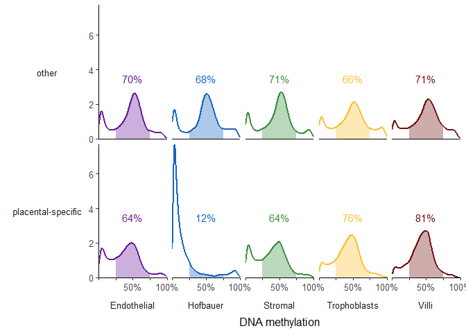

I previously looked at imprinting, but not in great detail. I also have since then compiled a list of imprinted regions and added these to the EPIC annotation.This script is for looking at imprints in more detail with this updated list of imprinted regions.


# Setup

## Libraries


```r
# libraries and data
library(tidyverse)
library(scales)
library(here)
library(readxl)
library(janitor)
theme_set(theme_bw())
```

## Data


```r
base_path <- file.path('data', 'main', 'interim')

# pData
pDat <- readRDS(here(base_path, '2_3_pDat_contam.rds'))
pDat <- pDat %>%
  mutate(Tissue = case_when(
    !(Tissue %in% c('Villi', 'Villi maternal', 'Syncytiotrophoblast')) ~ paste(Tissue, 'cs'),
    Tissue == 'Syncytiotrophoblast' ~ 'Trophoblasts enz',
    TRUE ~ Tissue
  )) 

# raw methylation data
betas <- readRDS(here(base_path, '1_4_betas_noob_filt.rds'))

# annotation
anno <- readRDS('Z:/Victor/Repositories/EPIC_annotation/hg19_epic_annotation.rds')
anno <- anno %>%
  as_tibble() %>%
  filter(cpg %in% rownames(betas)) # filter to filtered betas cpgs


# color key
color_code <- readRDS(here(base_path, '2_3_color_code.rds'))
color_code_tissue <- setNames(color_code$Colors_Tissue, color_code$label)
```

## Remove samples


```r
pDat_filt <- pDat %>% 
  filter(maternal_contamination_norm_flip < 0.35,
         !Sample_Name %in% c('PM364_hofb_cs', 'PL293_v_R2', 'PM366_vc_R2', 'P131_hofb_cs', 
                             'PM324_V4', 'PM324_V1', 'PM139_vc', 'PM77_vc'),
         !Tissue %in% c('Villi maternal', 'Trophoblasts enz', 'Mixture cs', 
                        'Dead Cells and Lymphocytes cs'),
         Trimester != 'Second')

betas_filt <- betas[,pDat_filt$Sentrix]
colnames(betas_filt) <- pDat_filt$Sample_Name
```

# Density

Calculate density


```r
imprint_cpgs <- anno %>%
  filter(!is.na(imprint_sources)) %>%
  select(cpg, imprint_tissue_specificity)

imprint_cpgs %>%
  count(imprint_tissue_specificity)
```

```
## # A tibble: 2 x 2
##   imprint_tissue_specificity     n
##   <chr>                      <int>
## 1 other                       1085
## 2 placental-specific           981
```

```r
# Create data
imprint_df <- betas_filt[imprint_cpgs$cpg,] %>%
  
  #tidy
  t() %>% 
  as.data.frame() %>%
  cbind(Sample_Name = rownames(.), .) %>%
  as_tibble() %>%
  
  pivot_longer(
    cols = -Sample_Name,
    names_to = 'cpg',
    values_to = 'beta'
  ) %>%
  
  # add tissue specificity
  left_join(imprint_cpgs) %>% 
  
  # add pData
  left_join(pDat_filt %>% select(Sample_Name, Tissue))
```

```
## Joining, by = "cpg"Joining, by = "Sample_Name"
```

```
## Warning: Column `Sample_Name` joining factor and character vector, coercing into
## character vector
```

```r
# calculate densities
imprint_density <- imprint_df %>%
  group_by(imprint_tissue_specificity, Tissue ) %>% 
  select(-cpg) %>%
  summarize(p_25_75 = sum(beta > 0.25 & beta < 0.75)/length(beta),
            p_0_25 = sum(beta < 0.25)/length(beta),
            p_75_100 = sum(beta > 0.75)/length(beta),
            beta = list(beta)) %>% 
  
  # get sample names for each tissue
  mutate(
         densities = map(beta, ~ density(.)),
         x = map(densities, 'x'),
         y = map(densities, 'y')) %>%
 # remove input data
  select( Tissue, x, y, contains('p')) %>%
  unnest(cols = c(x, y))

imprint_density
```

```
## # A tibble: 5,120 x 7
## # Groups:   imprint_tissue_specificity [2]
##    Tissue              x       y imprint_tissue_specifi~ p_25_75 p_0_25 p_75_100
##    <chr>           <dbl>   <dbl> <chr>                     <dbl>  <dbl>    <dbl>
##  1 Endothelial ~ -0.0660 0.00141 other                     0.717  0.211   0.0724
##  2 Endothelial ~ -0.0638 0.00193 other                     0.717  0.211   0.0724
##  3 Endothelial ~ -0.0616 0.00262 other                     0.717  0.211   0.0724
##  4 Endothelial ~ -0.0594 0.00352 other                     0.717  0.211   0.0724
##  5 Endothelial ~ -0.0572 0.00473 other                     0.717  0.211   0.0724
##  6 Endothelial ~ -0.0550 0.00633 other                     0.717  0.211   0.0724
##  7 Endothelial ~ -0.0528 0.00838 other                     0.717  0.211   0.0724
##  8 Endothelial ~ -0.0506 0.0110  other                     0.717  0.211   0.0724
##  9 Endothelial ~ -0.0484 0.0143  other                     0.717  0.211   0.0724
## 10 Endothelial ~ -0.0462 0.0184  other                     0.717  0.211   0.0724
## # ... with 5,110 more rows
```

Plot


```r
p <- imprint_density %>%
  {
    ggplot(data = ., aes(x = x, y = y, color = Tissue)) +
      geom_line(size = 1,) +
      geom_area(data = . %>%
                  filter(x < 0.75, x > 0.25),
                aes(fill = Tissue, color = NULL),
                alpha = 0.35) +
      geom_label(data = . %>%
                   select(Tissue, imprint_tissue_specificity, contains('p')) %>%
                   distinct() %>%
                   mutate(p_25_75 = scales::percent(p_25_75, accuracy = 1)),
                 x = 0.5,
                 y = 3,
                 aes(label = p_25_75),
                 show.legend = FALSE) +
      facet_grid(cols = vars(Tissue), 
                 rows = vars(imprint_tissue_specificity),
                 labeller = labeller(.cols = function(x)gsub(' cs', '', x))) +
      scale_color_manual(values = color_code_tissue[unique(imprint_density$Tissue)], 
                         na.value = '#636363',
                         guide = 'none') +
      scale_fill_manual(values = color_code_tissue[unique(imprint_density$Tissue)], 
                         na.value = '#636363',
                         labels = function(x)gsub(' cs', '', x),
                        guide = guide_legend(override.aes = list(alpha = 1))) +
      scale_x_continuous(limits = c(0,1), breaks = c( 0, 0.5, 1), labels = scales::percent) +
      theme_bw(base_size = 6) +
      theme(axis.ticks = element_blank(),
            panel.grid = element_blank(),
            panel.spacing.x = unit(0.5, "mm"),
            strip.background = element_blank()) +
      labs(x = 'DNA methylation', y = 'Density', fill = '')
  };p
```

```
## Warning: Removed 245 rows containing missing values (geom_path).
```

<!-- -->

# Save


```r
saveRDS(imprint_density, here::here(base_path, '2_12_imprint_density.rds'))
```
