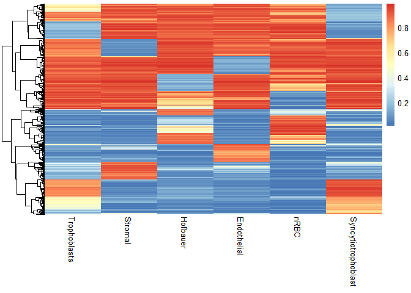
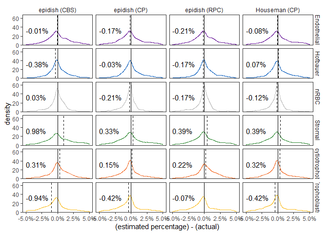
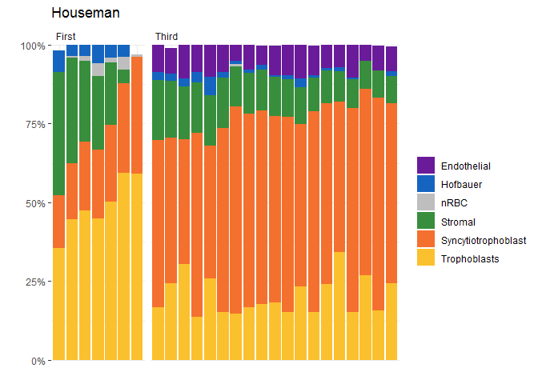
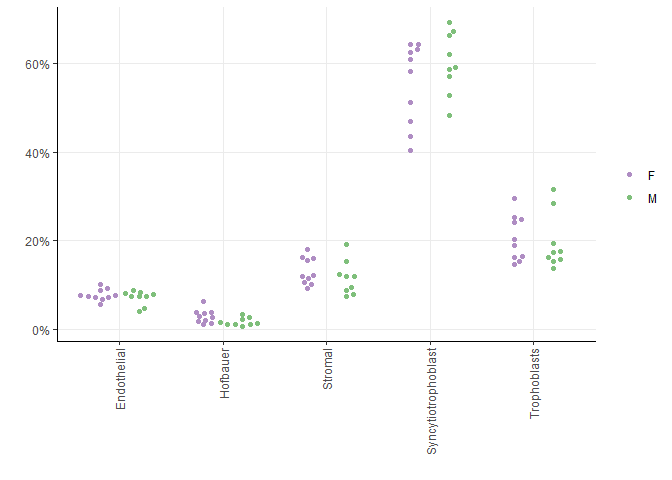
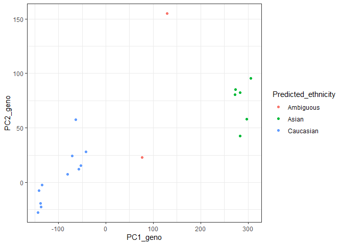

# Setup

## Libraries


```r
# libraries and data
library(tidyverse)
library(scales)
library(here)
library(readxl)
library(janitor)
library(minfi)
library(broom)
library(pheatmap)
theme_set(theme_bw())
library(EpiDISH)
library(yardstick)
library(ggbeeswarm)
```

## Data


```r
base_path <- file.path('data', 'main', 'interim')

# pData
pDat <- readRDS(here(base_path, '2_3_pDat_contam.rds'))
pDat <- pDat %>%
  mutate(Tissue = case_when(
    !(Tissue %in% c('Villi', 'Villi maternal', 'Syncytiotrophoblast', 'Mixture')) ~ paste(Tissue, 'cs'),
    Tissue == 'Syncytiotrophoblast' ~ 'Trophoblasts enz',
    TRUE ~ Tissue
  )) 

# raw methylation data
betas <- readRDS(here(base_path, '1_4_betas_noob_filt.rds'))
mset <- readRDS(here(base_path, '1_4_mset_noob.rds' ))
colnames(mset) <- pData(mset)$Sample_Name

# annotation
anno <- readRDS('Z:/Victor/Repositories/EPIC_annotation/hg19_epic_annotation.rds')
anno <- anno %>%
  as_tibble() %>%
  filter(cpg %in% rownames(betas)) # filter to filtered betas cpgs

# cell proportions for mixtures
mixtures <- read_excel(here::here('data', 'main', 'raw', 'Mixtures.xlsx'))

# color key
color_code <- readRDS(here(base_path, '2_3_color_code.rds'))
color_code_tissue <- setNames(color_code$Colors_Tissue, gsub(' cs', '',color_code$label))

color_code_tissue <- c(color_code_tissue, 'nRBC' = 'grey')

# ancestry information
ancestry <- readRDS(here(base_path, '2_11_ancestry.rds'))
```

## Remove samples


```r
pDat_filt <- pDat %>% 
  filter(maternal_contamination_norm_flip < 0.35,
         !Sample_Name %in% c('PM364_hofb_cs', 'PL293_v_R2', 'PM366_vc_R2', 'P131_hofb_cs', 
                             'PM324_V4', 'PM324_V1', 'PM139_vc', 'PM77_vc'),
         !Tissue %in% c('Villi maternal', 
                        'Trophoblasts enz',
                        'Dead Cells and Lymphocytes cs'),
         Trimester != 'Second')

betas_filt <- betas[,pDat_filt$Sentrix]
colnames(betas_filt) <- pDat_filt$Sample_Name
```

# get nRBC data

Meg's recent publciation provides a curated reference for cord blood data: https://www.ncbi.nlm.nih.gov/pmc/articles/PMC6712867/#CR22
"Systematic evaluation and validation of reference and library selection methods for deconvolution of cord blood DNA methylation data"

https://bioconductor.org/packages/release/data/experiment/vignettes/FlowSorted.CordBloodCombined.450k/inst/doc/FlowSorted.CordBloodCombined.450k.html

Note this is a 450k dataset

```r
if (memory.limit()>8000){
library(ExperimentHub)  

hub <- ExperimentHub()  

myfiles <- query(hub, "FlowSorted.CordBloodCombined.450k")

FlowSorted.CordBloodCombined.450k <- myfiles[[1]]

FlowSorted.CordBloodCombined.450k
}

# subset to nrbc
nrbc <- FlowSorted.CordBloodCombined.450k[,pData(FlowSorted.CordBloodCombined.450k)$CellType == 'nRBC']

pData(nrbc)
nrbc_noob <- preprocessNoob(nrbc)


nrbc_pDat <- pData(nrbc_noob) %>%
  as_tibble() %>%
  dplyr::rename(Tissue = CellType) %>%
  mutate(Trimester = 'Third') %>%
  select(Sample_Name, Tissue, Trimester, Sex, Study) 
  
pData(nrbc_noob) <- DataFrame(nrbc_pDat)

saveRDS(nrbc_noob, here::here(base_path, '2_14_nrbc_noob.rds'))
```


# Houseman Deconvolution

I apply to first and third trimester samples separately, each with their own trimester-specific reference.


```r
# filter to project samples
mset_filt <- mset[,pDat_filt$Sample_Name]
pData(mset_filt) <- DataFrame(pDat_filt)

# necessary column for pickcompprobes
mset$CellType <- mset$Tissue

mset_ref <- mset[,pData(mset)$Tissue %in% c('Trophoblasts', 'Stromal', 'Hofbauer', 'Endothelial')]
mset_test <- mset[,pData(mset)$Tissue %in% c('Mixture', 'Villi')]

# pick probes
probes_third <- minfi:::pickCompProbes(
  mset_ref[, pData(mset_ref)$Trimester == 'Third'], 
  cellTypes = c('Trophoblasts', 'Stromal', 'Hofbauer', 'Endothelial'),
  compositeCellType = 'Placenta',
  probeSelect = "both")

probes_first <- minfi:::pickCompProbes(
  mset_ref[, pData(mset_ref)$Trimester == 'First'], 
  cellTypes = c('Trophoblasts', 'Stromal', 'Hofbauer', 'Endothelial'),
  compositeCellType = 'Placenta',
  probeSelect = "both")


# extract coefficients
coefs_third <- probes_third$coefEsts
coefs_first <- probes_first$coefEsts

# project 
counts_third <- minfi:::projectCellType(
  getBeta(mset_test)[rownames(coefs_third),pData(mset_test)$Trimester == 'Third'], 
  coefs_third,
  lessThanOne = FALSE)

counts_first<- minfi:::projectCellType(
  getBeta(mset_test)[rownames(coefs_first),pData(mset_test)$Trimester == 'First'], 
  coefs_first,
  lessThanOne = FALSE)

res <- rbind(counts_third, counts_first) %>%
  as.data.frame() %>%
  bind_cols(Sample_Name = rownames(.), .) %>%
  inner_join(pData(mset_test) %>% as_tibble());res
```

```
## Joining, by = "Sample_Name"
```

```
## # A tibble: 44 x 25
##    Sample_Name Trophoblasts Stromal Hofbauer Endothelial Chip_number   Row Well 
##    <chr>              <dbl>   <dbl>    <dbl>       <dbl>       <dbl> <dbl> <chr>
##  1 PM376_vc          0.919  0.0280   0.0277       0.0482          25     6 F1   
##  2 PM368_vc          0.872  0.0606   0.0328       0.0677          26     1 A2   
##  3 Mixture 7         0.0366 0.688    0.0403       0.163           26     6 F2   
##  4 PM378_vc          0.866  0.0652   0.0211       0.0640          27     1 A3   
##  5 PM364_vc          0.909  0.0303   0.0238       0.0670          28     3 C4   
##  6 PM365_vc          0.837  0.0743   0.0454       0.0820          29     1 A5   
##  7 PM362_vc          0.964  0.0363   0.0174       0.0361          29     8 H5   
##  8 PM371_vc          0.763  0.122    0.0764       0.0736          30     2 B6   
##  9 Mixture 11        0.426  0.387    0.0463       0.0469          30     5 E6   
## 10 PM324_V1          0.949  0.00559  0.00259      0.0689          31     5 E7   
## # ... with 34 more rows, and 17 more variables: Case_ID <chr>, Sex <chr>,
## #   GA <dbl>, Trimester <chr>, DNA_QP <chr>, Week <dbl>, Sample_Plate <chr>,
## #   Tissue <chr>, Sentrix_ID <dbl>, Sentrix_Position <chr>, Scratches <chr>,
## #   Batch_BSC <chr>, DNA_conc_BSC_adjusted <dbl>, DNA_conc_before_load <dbl>,
## #   DNA_loaded <dbl>, Sentrix <chr>, CellType <chr>
```

```r
# plot
res %>%
  select(Tissue, Sample_Name:Endothelial)  %>%
  pivot_longer(cols = -c(Tissue, Sample_Name),
               names_to = 'Estimates',
               values_to = 'p') %>%
  ggplot(aes(x = Sample_Name, y = p, fill = Estimates)) +
  geom_bar(stat = 'identity', position = 'stack') +
  facet_grid(cols = vars(Tissue), scales = 'free', space = 'free') +
  theme(axis.text.x = element_blank(),
        axis.ticks.x = element_blank()) +
  scale_y_continuous(expand = c(0,0))
```

<!-- -->


# Compare accuracy

Mixture 13 replaces mixture 4 due to failed BSC conversion

Mixture 4 replaces mixture 8 due to failed BSC conversion
Mixture 14 replaces mixture 7 ^ ^ ^ ^
Mixture 7 replaces mixture 5 due to loss of DNA during mixing


```r
mixtures_results <- mixtures %>% select(Sample, Case_ID, contains('%')) %>%
  janitor::clean_names() %>%
  pivot_longer(cols = -c(sample, case_id),
               names_to = 'component',
               values_to = 'actual_percent') %>%
  mutate(component = gsub('_percent', '', component))  %>%
  dplyr::rename(Sample_Name = sample) %>%
  filter(component !='total') %>%
  mutate(Sample_Name = case_when(
    Sample_Name == 'Mixture 4' ~ 'Mixture 13',
    
    Sample_Name == 'Mixture 5' ~ 'Mixture 14',
    TRUE ~ as.character(Sample_Name)
  ))


mixture_results <- res %>%
  select(Sample_Name:Endothelial) %>%
  pivot_longer(cols = -Sample_Name,
               names_to = 'component',
               values_to = 'predicted_percent') %>%
  mutate(component = str_to_lower(component),
         predicted_percent = predicted_percent*100) %>%
  full_join(mixtures_results, by = c('Sample_Name', 'component'))  %>%
  mutate(component = str_to_sentence(component))

# stats
stats <- mixture_results %>%
  filter(grepl('Mix', Sample_Name)) %>%
  nest(data = -component) %>%
  mutate(lm = map(data, ~lm(predicted_percent ~ actual_percent, .)),
         glanced = map(lm, glance)) %>%
  select(-data, -lm) %>%
  unnest(glanced) %>%
  mutate(label = paste0('R2=', signif(r.squared, digits = 2),
                        '\n', pvalue(p.value, add_p = TRUE)))


# scatter plots
mixture_results %>%
  filter(grepl('Mix', Sample_Name)) %>%
  ggplot() +
  geom_point(aes(x = actual_percent, y = predicted_percent, color = component)) +
  geom_smooth(aes(x = actual_percent, y = predicted_percent, color = component),
              method = 'lm', se = FALSE) +
  geom_label(data = stats, aes(label = label),
             x = 0, y = 80, hjust = 0) +
  scale_y_continuous(limits = c(0,100)) +
  facet_wrap(~component) +
  scale_color_manual(values = color_code_tissue[unique(mixture_results$component)], 
                         na.value = '#636363',
                         guide = 'none') 
```

<!-- -->

```r
# bar plots
mixture_results %>%
  filter(grepl('Mix', Sample_Name)) %>%
  mutate(Sample_Name = factor(Sample_Name, 
                              levels = paste0('Mixture ', c(1:3, 13, 14, 6:12)))) %>%
  pivot_longer(cols = contains('percent'),
               names_to = 'type',
               values_to = 'percent') %>%
  mutate(type = gsub('_.*', '', type)) %>%
  ggplot() +
  geom_bar(stat=  'identity',
           aes(x = Sample_Name, y = percent, fill = component)) +
  facet_wrap(ncol = 1, vars(type)) +
  labs(x = '') +
  scale_x_discrete(labels = function(x)gsub('Mixture ', '', x))
```

<!-- -->

```r
mixture_results %>%
  filter(grepl('Mix', Sample_Name)) %>%
  mutate(Sample_Name = factor(Sample_Name, 
                              levels = paste0('Mixture ', c(1:3, 13, 14, 6:12)))) %>%
  pivot_longer(cols = contains('percent'),
               names_to = 'type',
               values_to = 'percent') %>%
  mutate(type = gsub('_.*', '', type)) %>%
  ggplot() +
  geom_bar(stat=  'identity',
           aes(x = Sample_Name, y = percent, fill = component)) +
  facet_grid(rows = vars(type),
             cols = vars(case_id), scales = 'free', space = 'free') +
  labs(x = '') +
  theme(strip.background = element_blank()) +
  scale_x_discrete(labels = function(x)gsub('Mixture ', '', x))
```

<!-- -->

# EPIDISH


```r
epidish_res1 <- epidish(
  beta.m = getBeta(mset_test)[rownames(coefs_third),pData(mset_test)$Trimester == 'Third'],
  ref.m = coefs_third,
  method = 'RPC')

epidish_res2 <- epidish(
  beta.m = getBeta(mset_test)[rownames(coefs_third),pData(mset_test)$Trimester == 'Third'],
  ref.m = coefs_third,
  method = 'CBS')
```

```
## 1
```

```
## 2
```

```
## 3
```

```r
epidish_res3 <- epidish(
  beta.m = getBeta(mset_test)[rownames(coefs_third),pData(mset_test)$Trimester == 'Third'],
  ref.m = coefs_third,
  method = 'CP',
  constraint = 'inequality')
```

```
## 1
```

```
## 2
```

```
## 3
```

```
## 4
```

```
## 5
```

```
## 6
```

```
## 7
```

```
## 8
```

```
## 9
```

```
## 10
```

```
## 11
```

```
## 12
```

```
## 13
```

```
## 14
```

```
## 15
```

```
## 16
```

```
## 17
```

```
## 18
```

```
## 19
```

```
## 20
```

```
## 21
```

```
## 22
```

```
## 23
```

```
## 24
```

```
## 25
```

```
## 26
```

```
## 27
```

```
## 28
```

```
## 29
```

```
## 30
```

```
## 31
```

```
## 32
```

```
## 33
```

```
## 34
```

```
## 35
```

```
## 36
```

```r
#first trime
epidish_res11 <- epidish(
  beta.m = getBeta(mset_test)[rownames(coefs_first),pData(mset_test)$Trimester == 'First'],
  ref.m = coefs_first,
  method = 'RPC')

epidish_res22 <- epidish(
  beta.m = getBeta(mset_test)[rownames(coefs_first),pData(mset_test)$Trimester == 'First'],
  ref.m = coefs_first,
  method = 'CBS')
```

```
## 1
```

```
## 2
```

```
## 3
```

```r
epidish_res33 <- epidish(
  beta.m = getBeta(mset_test)[rownames(coefs_first),pData(mset_test)$Trimester == 'First'],
  ref.m = coefs_first,
  method = 'CP',
  constraint = 'inequality')
```

```
## 1
```

```
## 2
```

```
## 3
```

```
## 4
```

```
## 5
```

```
## 6
```

```
## 7
```

```
## 8
```

```r
str(epidish_res1)
```

```
## List of 3
##  $ estF   : num [1:36, 1:4] 0.9278 0.902 0.0681 0.899 0.9421 ...
##   ..- attr(*, "dimnames")=List of 2
##   .. ..$ : chr [1:36] "PM376_vc" "PM368_vc" "Mixture 7" "PM378_vc" ...
##   .. ..$ : chr [1:4] "Trophoblasts" "Stromal" "Hofbauer" "Endothelial"
##  $ ref    : num [1:400, 1:4] 0.1014 0.0719 0.1507 0.1321 0.1282 ...
##   ..- attr(*, "dimnames")=List of 2
##   .. ..$ : chr [1:400] "cg10590657" "cg00281273" "cg14514160" "cg16156113" ...
##   .. ..$ : chr [1:4] "Trophoblasts" "Stromal" "Hofbauer" "Endothelial"
##  $ dataREF: num [1:400, 1:36] 0.1118 0.0797 0.321 0.2209 0.219 ...
##   ..- attr(*, "dimnames")=List of 2
##   .. ..$ : chr [1:400] "cg10590657" "cg00281273" "cg14514160" "cg16156113" ...
##   .. ..$ : chr [1:36] "PM376_vc" "PM368_vc" "Mixture 7" "PM378_vc" ...
```

```r
epidish_res1 <- epidish_res1$estF %>%
  as.data.frame() %>%
  bind_cols(Sample_Names = rownames(.), .) %>%
  pivot_longer(
    cols = -Sample_Names,
    names_to = 'component',
    values_to = 'percent'
  ) %>%
  mutate(algorithm = 'epidish (RPC)')

epidish_res2 <- epidish_res2$estF %>%
  as.data.frame() %>%
  bind_cols(Sample_Names = rownames(.), .) %>%
  pivot_longer(
    cols = -Sample_Names,
    names_to = 'component',
    values_to = 'percent'
  ) %>%
  mutate(algorithm = 'epidish (CBS)')

epidish_res3 <- epidish_res3$estF %>%
  as.data.frame() %>%
  bind_cols(Sample_Names = rownames(.), .) %>%
  pivot_longer(
    cols = -Sample_Names,
    names_to = 'component',
    values_to = 'percent'
  ) %>%
  mutate(algorithm = 'epidish (CP)')

epidish_res11 <- epidish_res11$estF %>%
  as.data.frame() %>%
  bind_cols(Sample_Names = rownames(.), .) %>%
  pivot_longer(
    cols = -Sample_Names,
    names_to = 'component',
    values_to = 'percent'
  ) %>%
  mutate(algorithm = 'epidish (RPC)')

epidish_res22 <- epidish_res22$estF %>%
  as.data.frame() %>%
  bind_cols(Sample_Names = rownames(.), .) %>%
  pivot_longer(
    cols = -Sample_Names,
    names_to = 'component',
    values_to = 'percent'
  ) %>%
  mutate(algorithm = 'epidish (CBS)')

epidish_res33 <- epidish_res33$estF %>%
  as.data.frame() %>%
  bind_cols(Sample_Names = rownames(.), .) %>%
  pivot_longer(
    cols = -Sample_Names,
    names_to = 'component',
    values_to = 'percent'
  ) %>%
  mutate(algorithm = 'epidish (CP)')

epidish_results <- bind_rows(epidish_res1, epidish_res2, epidish_res3, 
                             epidish_res11, epidish_res22, epidish_res33) %>%
   dplyr::rename(Sample_Name = Sample_Names) %>%
  mutate(percent = percent*100) %>%
  left_join(mixture_results %>% select(Sample_Name, case_id))
```

```
## Joining, by = "Sample_Name"
```

```r
# combine epidish results with houseman
mixture_results_all <- mixture_results %>%
  pivot_longer(
    cols = contains('percent'),
    names_to = 'algorithm',
    values_to = 'percent'
  ) %>%
  mutate(algorithm = gsub('_percent', '', algorithm),
         algorithm = ifelse(algorithm == 'predicted', 'minfi (CP)', algorithm)) %>%
  select(-case_id) %>%
  bind_rows(epidish_results %>% select(-case_id)) %>%
  mutate(algorithm = factor(algorithm, 
                            levels = c('actual', 'epidish (RPC)', 'epidish (CBS)', 
                                       'epidish (CP)', 'minfi (CP)'))) %>%
  distinct()

# bar plot
mixture_results_all %>%
  filter(grepl('Mix', Sample_Name)) %>%
  mutate(Sample_Name = factor(Sample_Name, 
                              levels = paste0('Mixture ', c(1:3, 13, 14, 6:12)))) %>%
  ggplot() +
  geom_bar(stat=  'identity',
           aes(x = Sample_Name, y = percent, fill = component)) +
  facet_wrap(ncol = 1, vars(algorithm)) +
  labs(x = '', y= '') +
  theme(strip.background = element_blank())+
  scale_fill_manual(values = color_code_tissue[unique(mixture_results_all$component)],
                    na.value = '#636363') +
  scale_y_continuous(labels = function(x)paste0(x, '%'), expand = c(0,0))+
  scale_x_discrete(labels = function(x)gsub('Mixture ', '', x), expand = c(0,0))
```

<!-- -->

```r
# stats
stats <- mixture_results_all %>%
  filter(grepl('Mix', Sample_Name)) %>%
  pivot_wider(id_cols = c(Sample_Name, component),
              names_from = 'algorithm',
              values_from = 'percent') %>%
  pivot_longer(cols = -c(Sample_Name, component, actual),
               names_to = 'algorithm',
               values_to = 'predicted') %>%
  
  nest(data = -c(component, algorithm)) %>%
  mutate(lm = map(data, ~lm(predicted ~ actual, .)),
         glanced = map(lm, glance)) %>%
  select(-data, -lm) %>%
  unnest(glanced) %>%
  mutate(label = paste0('R2=', signif(r.squared, digits = 2),
                        '\n', pvalue(p.value, add_p = TRUE)))

mixture_results_all %>%
  filter(grepl('Mix', Sample_Name)) %>%
  pivot_wider(id_cols = c(Sample_Name, component),
              names_from = 'algorithm',
              values_from = 'percent') %>%
  pivot_longer(cols = -c(Sample_Name, component, actual),
               names_to = 'algorithm',
               values_to = 'predicted') %>%
  group_by(algorithm) %>%
  rmse(truth = actual, estimate = predicted)
```

```
## # A tibble: 4 x 4
##   algorithm     .metric .estimator .estimate
##   <chr>         <chr>   <chr>          <dbl>
## 1 epidish (CBS) rmse    standard        21.1
## 2 epidish (CP)  rmse    standard        20.9
## 3 epidish (RPC) rmse    standard        20.9
## 4 minfi (CP)    rmse    standard        20.9
```

```r
stats %>%
  group_by(algorithm) %>%
  summarize(mean_r2 = mean(r.squared))
```

```
## # A tibble: 4 x 2
##   algorithm     mean_r2
##   <chr>           <dbl>
## 1 epidish (CBS) 0.00757
## 2 epidish (CP)  0.00572
## 3 epidish (RPC) 0.00846
## 4 minfi (CP)    0.00561
```

```r
mixture_results_all %>%
  filter(grepl('Mix', Sample_Name)) %>%
  pivot_wider(id_cols = c(Sample_Name, component),
              names_from = 'algorithm',
              values_from = 'percent') %>%
  pivot_longer(cols = -c(Sample_Name, component, actual),
               names_to = 'algorithm',
               values_to = 'predicted')  %>%
  ggplot(aes(x = actual, y = predicted, color = component)) +
  geom_point() +
  geom_smooth(method = 'lm', se = FALSE) +
  geom_label(color = 'black', size = 3, data = stats, aes(label = label),
             x = 0, y = 100, hjust = 0, vjust = 1) +
  facet_grid(cols = vars(algorithm), rows = vars(component)) +
  theme(strip.background = element_blank(),
        panel.grid.minor = element_blank()) +
  scale_color_manual(values = color_code_tissue[unique(mixture_results_all$component)], 
                         na.value = '#636363',
                         guide = 'none') +
  scale_x_continuous(labels = function(x)paste0(x, '%'), breaks = c(0,30,60,100))+
  scale_y_continuous(limits = c(0,100),labels = function(x)paste0(x, '%')) +
  labs(x = 'Actual', y = 'Predicted')
```

<!-- -->

# Heatmap of deconvolution probes


```r
probes_third %>% str
```

```
## List of 3
##  $ coefEsts   : num [1:400, 1:4] 0.1014 0.0719 0.1507 0.1321 0.1282 ...
##   ..- attr(*, "dimnames")=List of 2
##   .. ..$ : chr [1:400] "cg10590657" "cg00281273" "cg14514160" "cg16156113" ...
##   .. ..$ : chr [1:4] "Trophoblasts" "Stromal" "Hofbauer" "Endothelial"
##  $ compTable  :'data.frame':	866091 obs. of  9 variables:
##   ..$ Fstat       : num [1:866091] 0.061 0.0559 87.0695 0.7957 2.1478 ...
##   ..$ p.value     : num [1:866091] 9.80e-01 9.83e-01 6.76e-24 5.00e-01 1.02e-01 ...
##   ..$ Trophoblasts: num [1:866091] 0.0119 0.0245 0.3432 0.9525 0.8267 ...
##   ..$ Stromal     : num [1:866091] 0.012 0.025 0.0847 0.9478 0.8711 ...
##   ..$ Hofbauer    : num [1:866091] 0.0119 0.0243 0.4373 0.9529 0.8743 ...
##   ..$ Endothelial : num [1:866091] 0.0117 0.0246 0.425 0.9554 0.8537 ...
##   ..$ low         : num [1:866091] 0.00715 0.01229 0.02142 0.90207 0.61026 ...
##   ..$ high        : num [1:866091] 0.0161 0.0362 0.6382 0.9809 0.9374 ...
##   ..$ range       : num [1:866091] 0.00894 0.02393 0.61676 0.07888 0.32718 ...
##  $ sampleMeans: Named num [1:76] 0.492 0.506 0.507 0.502 0.494 ...
##   ..- attr(*, "names")= chr [1:76] "Endothelial" "Hofbauer" "Trophoblasts" "Endothelial" ...
```

```r
pheatmap(probes_third$coefEsts, cluster_cols = FALSE, cluster_rows = TRUE,
         show_rownames = FALSE) 
```

<!-- -->

# FACS-determined proportions

So mixture data is potentially garbage. Here I look at the FACS cell proportions.


```r
facs_prop <- read_excel(here::here('data', 'main', 'raw', 'FACS_proportions.xlsx'))

# process
facs_prop <- facs_prop %>%
  as.matrix() %>%
  magrittr::set_rownames(.[,'Cell_type']) %>%
  t() %>%
  as.data.frame %>%
  bind_cols(Sample_Name = rownames(.), .) %>%
  dplyr::slice(-1) %>%
  select(Sample_Name, contains('% of live')) %>%
  pivot_longer(cols = -Sample_Name, names_to = 'component', values_to = 'value') %>%
  mutate(component = gsub(' \\(\\% of live\\)', '', component),
         percent = str_extract(value, '[0-9]?\\.?[0-9]+(?=\\%)') %>% as.numeric(),
         Case_ID = str_extract(Sample_Name, 'PM[0-9]+'),
         component = ifelse(component == 'Fibroblasts', 'Stromal', component)) %>%
  select(-value) %>% 
  
  # REMOVE samples
  filter(!grepl('TB Layer', Sample_Name),
         ) %>% 
  
  # average percentage
  group_by(Case_ID, component) %>%
  summarize(percent = mean(percent)) %>%
  
  # rescale such that sums to 1
  mutate(percent = percent*100 / sum(percent)) %>%
  group_by(Case_ID, component == 'Trophoblasts') %>%
  mutate(percent_constrained = percent*100/ sum(percent)) %>%
  ungroup() %>%
  mutate(percent_constrained = ifelse(percent_constrained == 100, NA,
                                      percent_constrained)) %>%
  select(-`component == "Trophoblasts"`) %>%
  
  pivot_longer(cols = contains('percent'),
               names_to = 'FACS',
               values_to = 'actual') %>%
  mutate(FACS = ifelse(FACS == 'percent', 'FACS',
                       ifelse(FACS == 'percent_constrained', 'FACS - constrained',
                              FACS)))


facs_results <-mixture_results_all %>%
  filter(!grepl('Mix', Sample_Name),
         algorithm != 'actual') %>%
  mutate(Case_ID = str_extract(Sample_Name, 'PM[0-9]+'))  %>%
  
  # constrain to non-troph pops
  filter(component != 'Trophoblasts') %>%
  group_by(Case_ID, algorithm) %>%
  mutate(percent = percent*100/sum(percent)) %>%
  inner_join(facs_prop, by = c('component', 'Case_ID'))
  
plot_scatter <- function(x){
  ggplot(data = x, aes(x = actual, y = percent, color =component)) +
  geom_point() +
  geom_smooth(method = 'lm', se = FALSE) +
  facet_grid(cols = vars(algorithm), rows = vars(component), scales = 'fixed') +
  theme(strip.background = element_blank(),
        panel.grid.minor = element_blank()) +
  scale_color_manual(values = color_code_tissue[unique(facs_results$component)], 
                         na.value = '#636363',
                         guide = 'none') +
  scale_x_continuous(labels = function(x)paste0(x, '%'))+
  scale_y_continuous(labels = function(x)paste0(x, '%')) +
  labs(x = 'Actual', y = 'Predicted') +
    coord_equal()
}

facs_results %>%
  filter(FACS == 'FACS',
         component == 'Endothelial')  %>%
  plot_scatter()
```

<!-- -->

```r
facs_results %>%
  filter(FACS == 'FACS',
         component == 'Hofbauer')  %>%
  plot_scatter()+
  scale_y_continuous(limits = c(0, 60), labels = function(x)paste0(x, '%')) 
```

```
## Scale for 'y' is already present. Adding another scale for 'y', which will
## replace the existing scale.
```

<!-- -->

```r
facs_results %>%
  filter(FACS == 'FACS',
         component == 'Stromal')  %>%
  plot_scatter()
```

<!-- -->

```r
# stats
facs_stats <- facs_results %>%
  filter(FACS == 'FACS - constrained',
         component != 'Trophoblasts') %>%
  nest(data = -c(algorithm, component)) %>%
  mutate(lm = map(data, ~lm(percent ~ actual, .)),
         glanced = map(lm, glance)) %>%
  select(-data, -lm) %>%
  unnest(glanced) %>%
  mutate(label = paste0('R2=', signif(r.squared, digits = 2),
                        '\n', pvalue(p.value, add_p = TRUE)));facs_stats
```

```
## # A tibble: 12 x 14
## # Groups:   algorithm [5]
##    component algorithm r.squared adj.r.squared sigma statistic p.value    df
##    <chr>     <fct>         <dbl>         <dbl> <dbl>     <dbl>   <dbl> <int>
##  1 Stromal   minfi (C~   0.0660        0.0142  10.7      1.27   0.274      2
##  2 Hofbauer  minfi (C~   0.152         0.105    5.33     3.24   0.0888     2
##  3 Endothel~ minfi (C~   0.0143       -0.0405  13.0      0.261  0.616      2
##  4 Stromal   epidish ~   0.0597        0.00749 18.2      1.14   0.299      2
##  5 Hofbauer  epidish ~   0.00928      -0.0458   7.00     0.169  0.686      2
##  6 Endothel~ epidish ~   0.0144       -0.0404  23.1      0.262  0.615      2
##  7 Stromal   epidish ~   0.0439       -0.00923 15.6      0.826  0.375      2
##  8 Hofbauer  epidish ~   0.0547        0.00217  8.08     1.04   0.321      2
##  9 Endothel~ epidish ~   0.0232       -0.0310  20.8      0.428  0.521      2
## 10 Stromal   epidish ~   0.0945        0.0442  12.1      1.88   0.187      2
## 11 Hofbauer  epidish ~   0.113         0.0636   5.72     2.29   0.147      2
## 12 Endothel~ epidish ~   0.0176       -0.0370  14.6      0.322  0.578      2
## # ... with 6 more variables: logLik <dbl>, AIC <dbl>, BIC <dbl>,
## #   deviance <dbl>, df.residual <int>, label <chr>
```

```r
facs_results %>%
  filter(FACS == 'FACS - constrained',
         component != 'Trophoblasts') %>%
  group_by(algorithm) %>%
  rmse(truth = actual, estimate = percent)
```

```
## # A tibble: 4 x 4
##   algorithm     .metric .estimator .estimate
##   <fct>         <chr>   <chr>          <dbl>
## 1 epidish (RPC) rmse    standard        31.1
## 2 epidish (CBS) rmse    standard        28.0
## 3 epidish (CP)  rmse    standard        23.7
## 4 minfi (CP)    rmse    standard        22.8
```

```r
facs_results %>%
  filter(FACS == 'FACS - constrained',
         component != 'Trophoblasts') %>%
  ggplot(aes(x = actual, y = percent, color =component)) +
  geom_point() +
  geom_smooth(method = 'lm', se = FALSE) +  
  geom_label(data = facs_stats, 
             color = 'black', size = 3, 
             aes(label = label),
             x = 10, y = 120, hjust = 0, vjust = 1,
             alpha = 0) +

  facet_grid(cols = vars(algorithm), rows = vars(component), scales = 'fixed') +
  theme(strip.background = element_blank(),
        panel.grid.minor = element_blank()) +
  scale_color_manual(values = color_code_tissue[unique(facs_results$component)], 
                         na.value = '#636363',
                         guide = 'none') +
  scale_x_continuous(labels = function(x)paste0(x, '%'))+
  scale_y_continuous(limits = c(0, 120),labels = function(x)paste0(x, '%')) +
  labs(x = 'Actual', y = 'Predicted') + 
  coord_equal()
```

<!-- -->

```r
facs_stats %>%
  group_by(component, algorithm) %>%
  summarize(r2 = mean(r.squared)) %>%
  group_by(algorithm) %>%
  mutate(overall_r2 = mean(r2)) %>%
  ungroup() %>%
  arrange(algorithm, component)
```

```
## # A tibble: 15 x 4
##    component   algorithm            r2 overall_r2
##    <chr>       <fct>             <dbl>      <dbl>
##  1 Endothelial actual        NaN         NaN     
##  2 Hofbauer    actual        NaN         NaN     
##  3 Stromal     actual        NaN         NaN     
##  4 Endothelial epidish (RPC)   0.0144      0.0278
##  5 Hofbauer    epidish (RPC)   0.00928     0.0278
##  6 Stromal     epidish (RPC)   0.0597      0.0278
##  7 Endothelial epidish (CBS)   0.0232      0.0406
##  8 Hofbauer    epidish (CBS)   0.0547      0.0406
##  9 Stromal     epidish (CBS)   0.0439      0.0406
## 10 Endothelial epidish (CP)    0.0176      0.0750
## 11 Hofbauer    epidish (CP)    0.113       0.0750
## 12 Stromal     epidish (CP)    0.0945      0.0750
## 13 Endothelial minfi (CP)      0.0143      0.0776
## 14 Hofbauer    minfi (CP)      0.152       0.0776
## 15 Stromal     minfi (CP)      0.0660      0.0776
```

# Villi


```r
# both first and third barplots
mixture_results_all %>%
  left_join(pDat_filt %>% select(Sample_Name, Tissue, Trimester)) %>%
  filter(algorithm != 'actual',
         Tissue == 'Villi')   %>%
  ggplot() +
  geom_bar(stat=  'identity',
           aes(x = Sample_Name, y = percent, fill = component)) +
  facet_grid(rows = vars(algorithm), cols = vars(Trimester), 
             scales = 'free', space = 'free') +
  labs(x = '') +
  theme(strip.background = element_blank(),
        axis.text.x = element_blank(),
        axis.ticks.x = element_blank()) +
  scale_fill_manual(values = color_code_tissue[unique(mixture_results_all$component)], 
                    na.value = '#636363') +
  scale_x_discrete(expand = c(0,0)) +
  scale_y_discrete(expand = c(0,1), limits = c(0,100))
```

```
## Joining, by = "Sample_Name"
```

<!-- -->

```r
# averaged
mixture_results_all %>%
  left_join(pDat_filt %>% select(Sample_Name, Tissue, Trimester)) %>%
  filter(algorithm != 'actual',
         Tissue == 'Villi')   %>%
  
  group_by(Trimester, algorithm, component) %>%
  summarize(percent = mean(percent)) %>%
  ggplot() +
  geom_bar(stat=  'identity',
           aes(x = Trimester, y = percent, fill = component)) +
  facet_grid(rows = vars(algorithm), scales = 'free', space = 'free') +
  labs(x = '') +
  theme(strip.background = element_blank(),
        axis.ticks.x = element_blank()) +
  scale_fill_manual(values = color_code_tissue[unique(mixture_results_all$component)], 
                    na.value = '#636363') +
  scale_x_discrete(expand = c(0,0)) +
  scale_y_discrete(expand = c(0,1), limits = c(0,100))
```

```
## Joining, by = "Sample_Name"
```

<!-- -->

```r
# between algorithms
mixture_results_all %>%
  left_join(pDat_filt %>% select(Sample_Name, Tissue, Trimester)) %>%
  filter(algorithm != 'actual',
         Tissue == 'Villi')   %>%
  ggplot() +
  geom_boxplot(aes(x = algorithm, y = percent, fill = component)) +
  facet_grid(cols = vars(component), rows = vars(Trimester), space = 'free') +
  labs(x = '', fill = '') +
  theme(strip.background = element_blank(),
        axis.ticks.x = element_blank(),
        axis.text.x = element_text(angle = 45, hjust = 1, vjust = 1)) +
  scale_fill_manual(values = color_code_tissue[unique(mixture_results_all$component)], 
                    na.value = '#636363',
                    guide = 'none') +
  scale_x_discrete(labels = function(x)gsub('epidish', 'EpiDISH', x)) +
  scale_y_continuous(labels = function(x)paste0(x, '%'))
```

```
## Joining, by = "Sample_Name"
```

<!-- -->

```r
# first to third beeeswarm
mixture_results_all %>%
  left_join(pDat_filt %>% select(Sample_Name, Tissue, Trimester)) %>%
  filter(algorithm != 'actual',
         Tissue == 'Villi') %>%
  ggplot(aes(x = component, y = percent, color = Trimester)) +
  ggbeeswarm::geom_beeswarm(dodge.width = 0.75) +
  facet_grid(rows = vars(algorithm)) +
  theme(strip.background = element_blank(),
        panel.grid.minor = element_blank()) +
  scale_y_continuous(labels = function(x)paste0(x, '%'))
```

```
## Joining, by = "Sample_Name"
```

<!-- -->

# Add nRBC to deconvolution

and apply to villi


```r
mset_filt
```

```
## class: MethylSet 
## dim: 866091 138 
## metadata(0):
## assays(2): Meth Unmeth
## rownames(866091): cg18478105 cg09835024 ... cg10633746 cg12623625
## rowData names(0):
## colnames: NULL
## colData names(68): Sample_Name Chip_number ...
##   maternal_contamination_norm maternal_contamination_norm_flip
## Annotation
##   array: IlluminaHumanMethylationEPIC
##   annotation: ilm10b4.hg19
## Preprocessing
##   Method: NA
##   minfi version: NA
##   Manifest version: NA
```

```r
nrbc_noob <- readRDS(here::here(base_path, '2_14_nrbc_noob.rds'))

pData(mset_filt)$Study <- 'Yuan'

# combine nrbc to placenta data
mset_combined <- combineArrays(nrbc_noob, mset_filt)
```

```
## [convertArray] Casting as IlluminaHumanMethylation450k
```

```
## Loading required package: IlluminaHumanMethylation450kmanifest
```

```r
mset_combined
```

```
## class: MethylSet 
## dim: 452567 149 
## metadata(0):
## assays(2): Meth Unmeth
## rownames(452567): cg00212031 cg00213748 ... ch.22.47579720R
##   ch.22.48274842R
## rowData names(0):
## colnames: NULL
## colData names(70): Sample_Name Tissue ...
##   maternal_contamination_norm_flip ArrayTypes
## Annotation
##   array: IlluminaHumanMethylation450k
##   annotation: ilmn12.hg19
## Preprocessing
##   Method: NA
##   minfi version: NA
##   Manifest version: NA
```

```r
pData(mset_combined) <- pData(mset_combined) %>% as.data.frame() %>%
  select(Sample_Name, Sex, Trimester, Tissue, Study) %>% 
  mutate(Tissue = gsub(' cs', '', Tissue),
         CellType = Tissue) %>% DataFrame()
  
pData(mset_combined) 
```

```
## DataFrame with 149 rows and 6 columns
##                  Sample_Name         Sex   Trimester      Tissue       Study
##                  <character> <character> <character> <character> <character>
## 1                   BakFW001           M       Third        nRBC    Bakulski
## 2                   BakFW007           F       Third        nRBC    Bakulski
## 3                   BakFW002           F       Third        nRBC    Bakulski
## 4                   BakFW016           F       Third        nRBC    Bakulski
## 5   nRBC_stringent_FACS_ind6           F       Third        nRBC     deGoede
## ...                      ...         ...         ...         ...         ...
## 145            PM367_endo_cs           F       Third Endothelial        Yuan
## 146            PM376_endo_cs           F       Third Endothelial        Yuan
## 147           PM364_strom_cs           M       Third     Stromal        Yuan
## 148                  PL295_v           F       First       Villi        Yuan
## 149            PM374_hofb_cs           M       Third    Hofbauer        Yuan
##        CellType
##     <character>
## 1          nRBC
## 2          nRBC
## 3          nRBC
## 4          nRBC
## 5          nRBC
## ...         ...
## 145 Endothelial
## 146 Endothelial
## 147     Stromal
## 148       Villi
## 149    Hofbauer
```

```r
pDat_combined <- pData(mset_combined) %>%
  as_tibble() 
  
# subset to reference
mset_combined_ref <- mset_combined[,pData(mset_combined)$CellType %in% c('Trophoblasts', 'Stromal', 'Hofbauer', 'Endothelial', 'nRBC')]

# pick probes
probes_third_nrbc <- minfi:::pickCompProbes(
  mset_combined_ref[, pData(mset_combined_ref)$Trimester == 'Third'], 
  cellTypes = c('Trophoblasts', 'Stromal', 'Hofbauer', 'Endothelial', 'nRBC'),
  compositeCellType = 'Placenta',
  probeSelect = "both")

probes_first_nrbc <- minfi:::pickCompProbes(
  mset_combined_ref[, pData(mset_combined_ref)$Trimester == 'First' |
             pData(mset_combined_ref)$CellType == 'nRBC'], 
  cellTypes = c('Trophoblasts', 'Stromal', 'Hofbauer', 'Endothelial', 'nRBC'),
  compositeCellType = 'Placenta',
  probeSelect = "both")

# extract coefficients
coefs_combined_third <- probes_third_nrbc$coefEsts
coefs_combined_first <- probes_first_nrbc$coefEsts
```

## Heatmap


```r
pheatmap(coefs_combined_third, cluster_cols = FALSE, cluster_rows = TRUE,
         show_rownames = FALSE) 
```

<!-- -->


## Generate in silico mixtures

For each cell type ("a"),
generate proportions randomly from 0-1.
cell type b proportion is drawn from 0-a
cell type c proportion is drawn from 0-(b+a)
cell type d is 1-(a+b+c)

These are the coefficients for generating mixtures with proportions uniformly distributed between 0-1 for cell type A. 

Apply this to generate mixtures for each cell type.


```r
#### generate in silico mixtures
# filter to coefficient probes
mset_combined_coefs <- 
  mset_combined[unique(c(rownames(coefs_combined_third), rownames(coefs_combined_first))),]

colnames(mset_combined_coefs) <- pData(mset_combined_coefs)$Sample_Name

getBeta(mset_combined_coefs) %>%
  as.data.frame() %>%
  bind_cols(cpg = rownames(.), .) %>%
  pivot_longer(cols = -cpg, names_to = 'Sample_Name', values_to = 'beta') %>%
  left_join(pDat_combined) %>%
  nest(data = c(cpg, beta))
```

```
## Joining, by = "Sample_Name"
```

```
## # A tibble: 149 x 7
##    Sample_Name             Sex   Trimester Tissue Study   CellType          data
##    <chr>                   <chr> <chr>     <chr>  <chr>   <chr>    <list<df[,2]>
##  1 BakFW001                M     Third     nRBC   Bakuls~ nRBC         [874 x 2]
##  2 BakFW007                F     Third     nRBC   Bakuls~ nRBC         [874 x 2]
##  3 BakFW002                F     Third     nRBC   Bakuls~ nRBC         [874 x 2]
##  4 BakFW016                F     Third     nRBC   Bakuls~ nRBC         [874 x 2]
##  5 nRBC_stringent_FACS_in~ F     Third     nRBC   deGoede nRBC         [874 x 2]
##  6 nRBC_stringent_FACS_in~ M     Third     nRBC   deGoede nRBC         [874 x 2]
##  7 nRBC_stringent_FACS_in~ M     Third     nRBC   deGoede nRBC         [874 x 2]
##  8 nRBC_stringent_FACS_in~ F     Third     nRBC   deGoede nRBC         [874 x 2]
##  9 nRBC_stringent_FACS_in~ F     Third     nRBC   deGoede nRBC         [874 x 2]
## 10 nRBC_stringent_FACS_in~ F     Third     nRBC   deGoede nRBC         [874 x 2]
## # ... with 139 more rows
```

```r
# generate beta matrices
b_3_troph <- 
  getBeta(mset_combined_coefs)[,pData(mset_combined_coefs)$Trimester == 'Third' &
                                 pData(mset_combined_coefs)$CellType == 'Trophoblasts']
b_3_endo <- 
  getBeta(mset_combined_coefs)[,pData(mset_combined_coefs)$Trimester == 'Third' &
                                 pData(mset_combined_coefs)$CellType == 'Endothelial']
b_3_strom <- 
  getBeta(mset_combined_coefs)[,pData(mset_combined_coefs)$Trimester == 'Third' &
                                 pData(mset_combined_coefs)$CellType == 'Stromal']
b_3_hofb <- 
  getBeta(mset_combined_coefs)[,pData(mset_combined_coefs)$Trimester == 'Third' &
                                 pData(mset_combined_coefs)$CellType == 'Hofbauer']
b_3_nrbc <- 
  getBeta(mset_combined_coefs)[,pData(mset_combined_coefs)$Trimester == 'Third' &
                                 pData(mset_combined_coefs)$CellType == 'nRBC']

b_1_troph <- 
  getBeta(mset_combined_coefs)[,pData(mset_combined_coefs)$Trimester == 'Third' &
                                 pData(mset_combined_coefs)$CellType == 'Trophoblasts']
b_1_endo <- 
  getBeta(mset_combined_coefs)[,pData(mset_combined_coefs)$Trimester == 'Third' &
                                 pData(mset_combined_coefs)$CellType == 'Endothelial']
b_1_strom <- 
  getBeta(mset_combined_coefs)[,pData(mset_combined_coefs)$Trimester == 'Third' &
                                 pData(mset_combined_coefs)$CellType == 'Stromal']
b_1_hofb <- 
  getBeta(mset_combined_coefs)[,pData(mset_combined_coefs)$Trimester == 'Third' &
                                 pData(mset_combined_coefs)$CellType == 'Hofbauer']

# generate coefficients
n <- 250
a <- runif(n = n)
b <- runif(n = n, min = 0, max = 1-a)
c <- runif(n = n, min = 0, max = 1-(b + a))
d <- runif(n = n, min = 0, max = 1-(c + b + a))
e <- 1-(a+b+c+d)

all(a + b + c + d + e== 1)
```

```
## [1] TRUE
```

```r
props <- tibble(a = a, b=b, c=c, d=d, e=e)
props <- props %>%
  as.matrix() %>%
  rbind(., .[,c(2:5,1)], 
        .[,c(3:5,1:2)], 
        .[,c(4:5,1:3)], 
        .[,c(5,1:4)]) %>%
  as_tibble() %>%
  mutate(sample = 1:(n*5))

# generate mixtures
set.seed(1)
silico_mix <- props %>%
  group_by(sample) %>%
  mutate(mix3 = list(
           a*b_3_troph[,sample(1:ncol(b_3_troph),1)] + 
           b*b_3_strom[,sample(1:ncol(b_3_strom),1)] +
           c*b_3_endo[,sample(1:ncol(b_3_endo),1)] +
           d*b_3_hofb[,sample(1:ncol(b_3_hofb),1)] +
           e*b_3_nrbc[,sample(1:ncol(b_3_nrbc),1)]),
         mix1 = list(
           a*b_1_troph[,sample(1:ncol(b_1_troph),1)] + 
           b*b_1_strom[,sample(1:ncol(b_1_strom),1)] +
           c*b_1_endo[,sample(1:ncol(b_1_endo),1)] +
           d*b_1_hofb[,sample(1:ncol(b_1_hofb),1)] +
           e*b_3_nrbc[,sample(1:ncol(b_3_nrbc),1)]),
         
         cpg= list(rownames(mset_combined_coefs))) %>% ungroup()

silico_pDat <- silico_mix %>%
  select(a:sample) %>%
  mutate(mix3 = 'mix3', mix1 = 'mix1') %>%
   pivot_longer(cols = c(mix3, mix1),
                names_to = 'sample2',
                values_to = 'remove') %>%
  mutate(sample_name = paste0('sample', sample, '_', sample2),
         trimester = ifelse(grepl('mix3', sample_name), 'Third', 'First')) %>%
  select(-sample, -sample2, -remove) 
  

silico_data <- silico_mix %>%
  select(sample, mix3:cpg) %>%
  unnest(c(mix3, mix1, cpg)) %>%
  
  pivot_longer(cols = c(mix3, mix1),
               names_to = 'sample2',
               values_to = 'beta') %>%
  mutate(sample_name = paste0('sample', sample, '_', sample2)) %>%
  select(-sample, -sample2) %>%
  pivot_wider(id_cols = cpg, names_from = 'sample_name', values_from = 'beta' ) %>%
  as.data.frame() %>%
  magrittr::set_rownames(.$cpg) %>%
  select(-cpg) %>%
  as.matrix()
```

Check composition distribution


```r
silico_pDat %>%
  pivot_longer(cols = a:e,
               names_to = 'component',
               values_to = 'proportion') %>%
  mutate(component = case_when(
    component == 'a' ~ 'Trophoblasts',
    component == 'b' ~ 'Stromal',
    component == 'c' ~ 'Endothelial',
    component == 'd' ~ 'Hofbauer',
    component == 'e' ~ 'nRBC',
  )) %>% {
    ggplot(data =., aes(x = proportion, color = component)) +
  geom_density() +
  facet_grid(rows = vars(component), cols = vars(trimester))  +
  scale_color_manual(values = color_code_tissue[unique(.$component)], 
                    na.value = '#636363',
                    guide = 'none') 
    }
```

<!-- -->


## apply to in silico mixtures


```r
# houseman
houseman_silico <- minfi:::projectCellType(
  silico_data[rownames(coefs_combined_third),], 
  coefs_combined_third,
  lessThanOne = FALSE) %>%
  as.data.frame() %>%
  mutate(Sample_Names = rownames(.), .) %>%
  as_tibble() %>%
  pivot_longer(cols = -Sample_Names,
               names_to = 'component',
               values_to = 'percent') %>%
  mutate(algorithm = 'Houseman (CP)')

epidish_res111 <- epidish(
  beta.m = silico_data,
  ref.m = coefs_combined_third,
  method = 'RPC')

epidish_res111 <- epidish_res111$estF %>%
  as.data.frame() %>%
  bind_cols(Sample_Names = rownames(.), .) %>%
  pivot_longer(
    cols = -Sample_Names,
    names_to = 'component',
    values_to = 'percent'
  ) %>%
  mutate(algorithm = 'epidish (RPC)')

epidish_res222 <- epidish(
  beta.m = silico_data,
  ref.m = coefs_combined_third,
  method = 'CBS')
```

```
## 1
```

```
## 2
```

```
## 3
```

```r
epidish_res222 <- epidish_res222$estF %>%
  as.data.frame() %>%
  bind_cols(Sample_Names = rownames(.), .) %>%
  pivot_longer(
    cols = -Sample_Names,
    names_to = 'component',
    values_to = 'percent'
  ) %>%
  mutate(algorithm = 'epidish (CBS)')

epidish_res333 <- epidish(
  beta.m = silico_data,
  ref.m = coefs_combined_third,
  method = 'CP')
```

```
## 1
```

```
## 2
```

```
## 3
```

```
## 4
```

```
## 5
```

```
## 6
```

```
## 7
```

```
## 8
```

```
## 9
```

```
## 10
```

```
## 11
```

```
## 12
```

```
## 13
```

```
## 14
```

```
## 15
```

```
## 16
```

```
## 17
```

```
## 18
```

```
## 19
```

```
## 20
```

```
## 21
```

```
## 22
```

```
## 23
```

```
## 24
```

```
## 25
```

```
## 26
```

```
## 27
```

```
## 28
```

```
## 29
```

```
## 30
```

```
## 31
```

```
## 32
```

```
## 33
```

```
## 34
```

```
## 35
```

```
## 36
```

```
## 37
```

```
## 38
```

```
## 39
```

```
## 40
```

```
## 41
```

```
## 42
```

```
## 43
```

```
## 44
```

```
## 45
```

```
## 46
```

```
## 47
```

```
## 48
```

```
## 49
```

```
## 50
```

```
## 51
```

```
## 52
```

```
## 53
```

```
## 54
```

```
## 55
```

```
## 56
```

```
## 57
```

```
## 58
```

```
## 59
```

```
## 60
```

```
## 61
```

```
## 62
```

```
## 63
```

```
## 64
```

```
## 65
```

```
## 66
```

```
## 67
```

```
## 68
```

```
## 69
```

```
## 70
```

```
## 71
```

```
## 72
```

```
## 73
```

```
## 74
```

```
## 75
```

```
## 76
```

```
## 77
```

```
## 78
```

```
## 79
```

```
## 80
```

```
## 81
```

```
## 82
```

```
## 83
```

```
## 84
```

```
## 85
```

```
## 86
```

```
## 87
```

```
## 88
```

```
## 89
```

```
## 90
```

```
## 91
```

```
## 92
```

```
## 93
```

```
## 94
```

```
## 95
```

```
## 96
```

```
## 97
```

```
## 98
```

```
## 99
```

```
## 100
```

```
## 101
```

```
## 102
```

```
## 103
```

```
## 104
```

```
## 105
```

```
## 106
```

```
## 107
```

```
## 108
```

```
## 109
```

```
## 110
```

```
## 111
```

```
## 112
```

```
## 113
```

```
## 114
```

```
## 115
```

```
## 116
```

```
## 117
```

```
## 118
```

```
## 119
```

```
## 120
```

```
## 121
```

```
## 122
```

```
## 123
```

```
## 124
```

```
## 125
```

```
## 126
```

```
## 127
```

```
## 128
```

```
## 129
```

```
## 130
```

```
## 131
```

```
## 132
```

```
## 133
```

```
## 134
```

```
## 135
```

```
## 136
```

```
## 137
```

```
## 138
```

```
## 139
```

```
## 140
```

```
## 141
```

```
## 142
```

```
## 143
```

```
## 144
```

```
## 145
```

```
## 146
```

```
## 147
```

```
## 148
```

```
## 149
```

```
## 150
```

```
## 151
```

```
## 152
```

```
## 153
```

```
## 154
```

```
## 155
```

```
## 156
```

```
## 157
```

```
## 158
```

```
## 159
```

```
## 160
```

```
## 161
```

```
## 162
```

```
## 163
```

```
## 164
```

```
## 165
```

```
## 166
```

```
## 167
```

```
## 168
```

```
## 169
```

```
## 170
```

```
## 171
```

```
## 172
```

```
## 173
```

```
## 174
```

```
## 175
```

```
## 176
```

```
## 177
```

```
## 178
```

```
## 179
```

```
## 180
```

```
## 181
```

```
## 182
```

```
## 183
```

```
## 184
```

```
## 185
```

```
## 186
```

```
## 187
```

```
## 188
```

```
## 189
```

```
## 190
```

```
## 191
```

```
## 192
```

```
## 193
```

```
## 194
```

```
## 195
```

```
## 196
```

```
## 197
```

```
## 198
```

```
## 199
```

```
## 200
```

```
## 201
```

```
## 202
```

```
## 203
```

```
## 204
```

```
## 205
```

```
## 206
```

```
## 207
```

```
## 208
```

```
## 209
```

```
## 210
```

```
## 211
```

```
## 212
```

```
## 213
```

```
## 214
```

```
## 215
```

```
## 216
```

```
## 217
```

```
## 218
```

```
## 219
```

```
## 220
```

```
## 221
```

```
## 222
```

```
## 223
```

```
## 224
```

```
## 225
```

```
## 226
```

```
## 227
```

```
## 228
```

```
## 229
```

```
## 230
```

```
## 231
```

```
## 232
```

```
## 233
```

```
## 234
```

```
## 235
```

```
## 236
```

```
## 237
```

```
## 238
```

```
## 239
```

```
## 240
```

```
## 241
```

```
## 242
```

```
## 243
```

```
## 244
```

```
## 245
```

```
## 246
```

```
## 247
```

```
## 248
```

```
## 249
```

```
## 250
```

```
## 251
```

```
## 252
```

```
## 253
```

```
## 254
```

```
## 255
```

```
## 256
```

```
## 257
```

```
## 258
```

```
## 259
```

```
## 260
```

```
## 261
```

```
## 262
```

```
## 263
```

```
## 264
```

```
## 265
```

```
## 266
```

```
## 267
```

```
## 268
```

```
## 269
```

```
## 270
```

```
## 271
```

```
## 272
```

```
## 273
```

```
## 274
```

```
## 275
```

```
## 276
```

```
## 277
```

```
## 278
```

```
## 279
```

```
## 280
```

```
## 281
```

```
## 282
```

```
## 283
```

```
## 284
```

```
## 285
```

```
## 286
```

```
## 287
```

```
## 288
```

```
## 289
```

```
## 290
```

```
## 291
```

```
## 292
```

```
## 293
```

```
## 294
```

```
## 295
```

```
## 296
```

```
## 297
```

```
## 298
```

```
## 299
```

```
## 300
```

```
## 301
```

```
## 302
```

```
## 303
```

```
## 304
```

```
## 305
```

```
## 306
```

```
## 307
```

```
## 308
```

```
## 309
```

```
## 310
```

```
## 311
```

```
## 312
```

```
## 313
```

```
## 314
```

```
## 315
```

```
## 316
```

```
## 317
```

```
## 318
```

```
## 319
```

```
## 320
```

```
## 321
```

```
## 322
```

```
## 323
```

```
## 324
```

```
## 325
```

```
## 326
```

```
## 327
```

```
## 328
```

```
## 329
```

```
## 330
```

```
## 331
```

```
## 332
```

```
## 333
```

```
## 334
```

```
## 335
```

```
## 336
```

```
## 337
```

```
## 338
```

```
## 339
```

```
## 340
```

```
## 341
```

```
## 342
```

```
## 343
```

```
## 344
```

```
## 345
```

```
## 346
```

```
## 347
```

```
## 348
```

```
## 349
```

```
## 350
```

```
## 351
```

```
## 352
```

```
## 353
```

```
## 354
```

```
## 355
```

```
## 356
```

```
## 357
```

```
## 358
```

```
## 359
```

```
## 360
```

```
## 361
```

```
## 362
```

```
## 363
```

```
## 364
```

```
## 365
```

```
## 366
```

```
## 367
```

```
## 368
```

```
## 369
```

```
## 370
```

```
## 371
```

```
## 372
```

```
## 373
```

```
## 374
```

```
## 375
```

```
## 376
```

```
## 377
```

```
## 378
```

```
## 379
```

```
## 380
```

```
## 381
```

```
## 382
```

```
## 383
```

```
## 384
```

```
## 385
```

```
## 386
```

```
## 387
```

```
## 388
```

```
## 389
```

```
## 390
```

```
## 391
```

```
## 392
```

```
## 393
```

```
## 394
```

```
## 395
```

```
## 396
```

```
## 397
```

```
## 398
```

```
## 399
```

```
## 400
```

```
## 401
```

```
## 402
```

```
## 403
```

```
## 404
```

```
## 405
```

```
## 406
```

```
## 407
```

```
## 408
```

```
## 409
```

```
## 410
```

```
## 411
```

```
## 412
```

```
## 413
```

```
## 414
```

```
## 415
```

```
## 416
```

```
## 417
```

```
## 418
```

```
## 419
```

```
## 420
```

```
## 421
```

```
## 422
```

```
## 423
```

```
## 424
```

```
## 425
```

```
## 426
```

```
## 427
```

```
## 428
```

```
## 429
```

```
## 430
```

```
## 431
```

```
## 432
```

```
## 433
```

```
## 434
```

```
## 435
```

```
## 436
```

```
## 437
```

```
## 438
```

```
## 439
```

```
## 440
```

```
## 441
```

```
## 442
```

```
## 443
```

```
## 444
```

```
## 445
```

```
## 446
```

```
## 447
```

```
## 448
```

```
## 449
```

```
## 450
```

```
## 451
```

```
## 452
```

```
## 453
```

```
## 454
```

```
## 455
```

```
## 456
```

```
## 457
```

```
## 458
```

```
## 459
```

```
## 460
```

```
## 461
```

```
## 462
```

```
## 463
```

```
## 464
```

```
## 465
```

```
## 466
```

```
## 467
```

```
## 468
```

```
## 469
```

```
## 470
```

```
## 471
```

```
## 472
```

```
## 473
```

```
## 474
```

```
## 475
```

```
## 476
```

```
## 477
```

```
## 478
```

```
## 479
```

```
## 480
```

```
## 481
```

```
## 482
```

```
## 483
```

```
## 484
```

```
## 485
```

```
## 486
```

```
## 487
```

```
## 488
```

```
## 489
```

```
## 490
```

```
## 491
```

```
## 492
```

```
## 493
```

```
## 494
```

```
## 495
```

```
## 496
```

```
## 497
```

```
## 498
```

```
## 499
```

```
## 500
```

```
## 501
```

```
## 502
```

```
## 503
```

```
## 504
```

```
## 505
```

```
## 506
```

```
## 507
```

```
## 508
```

```
## 509
```

```
## 510
```

```
## 511
```

```
## 512
```

```
## 513
```

```
## 514
```

```
## 515
```

```
## 516
```

```
## 517
```

```
## 518
```

```
## 519
```

```
## 520
```

```
## 521
```

```
## 522
```

```
## 523
```

```
## 524
```

```
## 525
```

```
## 526
```

```
## 527
```

```
## 528
```

```
## 529
```

```
## 530
```

```
## 531
```

```
## 532
```

```
## 533
```

```
## 534
```

```
## 535
```

```
## 536
```

```
## 537
```

```
## 538
```

```
## 539
```

```
## 540
```

```
## 541
```

```
## 542
```

```
## 543
```

```
## 544
```

```
## 545
```

```
## 546
```

```
## 547
```

```
## 548
```

```
## 549
```

```
## 550
```

```
## 551
```

```
## 552
```

```
## 553
```

```
## 554
```

```
## 555
```

```
## 556
```

```
## 557
```

```
## 558
```

```
## 559
```

```
## 560
```

```
## 561
```

```
## 562
```

```
## 563
```

```
## 564
```

```
## 565
```

```
## 566
```

```
## 567
```

```
## 568
```

```
## 569
```

```
## 570
```

```
## 571
```

```
## 572
```

```
## 573
```

```
## 574
```

```
## 575
```

```
## 576
```

```
## 577
```

```
## 578
```

```
## 579
```

```
## 580
```

```
## 581
```

```
## 582
```

```
## 583
```

```
## 584
```

```
## 585
```

```
## 586
```

```
## 587
```

```
## 588
```

```
## 589
```

```
## 590
```

```
## 591
```

```
## 592
```

```
## 593
```

```
## 594
```

```
## 595
```

```
## 596
```

```
## 597
```

```
## 598
```

```
## 599
```

```
## 600
```

```
## 601
```

```
## 602
```

```
## 603
```

```
## 604
```

```
## 605
```

```
## 606
```

```
## 607
```

```
## 608
```

```
## 609
```

```
## 610
```

```
## 611
```

```
## 612
```

```
## 613
```

```
## 614
```

```
## 615
```

```
## 616
```

```
## 617
```

```
## 618
```

```
## 619
```

```
## 620
```

```
## 621
```

```
## 622
```

```
## 623
```

```
## 624
```

```
## 625
```

```
## 626
```

```
## 627
```

```
## 628
```

```
## 629
```

```
## 630
```

```
## 631
```

```
## 632
```

```
## 633
```

```
## 634
```

```
## 635
```

```
## 636
```

```
## 637
```

```
## 638
```

```
## 639
```

```
## 640
```

```
## 641
```

```
## 642
```

```
## 643
```

```
## 644
```

```
## 645
```

```
## 646
```

```
## 647
```

```
## 648
```

```
## 649
```

```
## 650
```

```
## 651
```

```
## 652
```

```
## 653
```

```
## 654
```

```
## 655
```

```
## 656
```

```
## 657
```

```
## 658
```

```
## 659
```

```
## 660
```

```
## 661
```

```
## 662
```

```
## 663
```

```
## 664
```

```
## 665
```

```
## 666
```

```
## 667
```

```
## 668
```

```
## 669
```

```
## 670
```

```
## 671
```

```
## 672
```

```
## 673
```

```
## 674
```

```
## 675
```

```
## 676
```

```
## 677
```

```
## 678
```

```
## 679
```

```
## 680
```

```
## 681
```

```
## 682
```

```
## 683
```

```
## 684
```

```
## 685
```

```
## 686
```

```
## 687
```

```
## 688
```

```
## 689
```

```
## 690
```

```
## 691
```

```
## 692
```

```
## 693
```

```
## 694
```

```
## 695
```

```
## 696
```

```
## 697
```

```
## 698
```

```
## 699
```

```
## 700
```

```
## 701
```

```
## 702
```

```
## 703
```

```
## 704
```

```
## 705
```

```
## 706
```

```
## 707
```

```
## 708
```

```
## 709
```

```
## 710
```

```
## 711
```

```
## 712
```

```
## 713
```

```
## 714
```

```
## 715
```

```
## 716
```

```
## 717
```

```
## 718
```

```
## 719
```

```
## 720
```

```
## 721
```

```
## 722
```

```
## 723
```

```
## 724
```

```
## 725
```

```
## 726
```

```
## 727
```

```
## 728
```

```
## 729
```

```
## 730
```

```
## 731
```

```
## 732
```

```
## 733
```

```
## 734
```

```
## 735
```

```
## 736
```

```
## 737
```

```
## 738
```

```
## 739
```

```
## 740
```

```
## 741
```

```
## 742
```

```
## 743
```

```
## 744
```

```
## 745
```

```
## 746
```

```
## 747
```

```
## 748
```

```
## 749
```

```
## 750
```

```
## 751
```

```
## 752
```

```
## 753
```

```
## 754
```

```
## 755
```

```
## 756
```

```
## 757
```

```
## 758
```

```
## 759
```

```
## 760
```

```
## 761
```

```
## 762
```

```
## 763
```

```
## 764
```

```
## 765
```

```
## 766
```

```
## 767
```

```
## 768
```

```
## 769
```

```
## 770
```

```
## 771
```

```
## 772
```

```
## 773
```

```
## 774
```

```
## 775
```

```
## 776
```

```
## 777
```

```
## 778
```

```
## 779
```

```
## 780
```

```
## 781
```

```
## 782
```

```
## 783
```

```
## 784
```

```
## 785
```

```
## 786
```

```
## 787
```

```
## 788
```

```
## 789
```

```
## 790
```

```
## 791
```

```
## 792
```

```
## 793
```

```
## 794
```

```
## 795
```

```
## 796
```

```
## 797
```

```
## 798
```

```
## 799
```

```
## 800
```

```
## 801
```

```
## 802
```

```
## 803
```

```
## 804
```

```
## 805
```

```
## 806
```

```
## 807
```

```
## 808
```

```
## 809
```

```
## 810
```

```
## 811
```

```
## 812
```

```
## 813
```

```
## 814
```

```
## 815
```

```
## 816
```

```
## 817
```

```
## 818
```

```
## 819
```

```
## 820
```

```
## 821
```

```
## 822
```

```
## 823
```

```
## 824
```

```
## 825
```

```
## 826
```

```
## 827
```

```
## 828
```

```
## 829
```

```
## 830
```

```
## 831
```

```
## 832
```

```
## 833
```

```
## 834
```

```
## 835
```

```
## 836
```

```
## 837
```

```
## 838
```

```
## 839
```

```
## 840
```

```
## 841
```

```
## 842
```

```
## 843
```

```
## 844
```

```
## 845
```

```
## 846
```

```
## 847
```

```
## 848
```

```
## 849
```

```
## 850
```

```
## 851
```

```
## 852
```

```
## 853
```

```
## 854
```

```
## 855
```

```
## 856
```

```
## 857
```

```
## 858
```

```
## 859
```

```
## 860
```

```
## 861
```

```
## 862
```

```
## 863
```

```
## 864
```

```
## 865
```

```
## 866
```

```
## 867
```

```
## 868
```

```
## 869
```

```
## 870
```

```
## 871
```

```
## 872
```

```
## 873
```

```
## 874
```

```
## 875
```

```
## 876
```

```
## 877
```

```
## 878
```

```
## 879
```

```
## 880
```

```
## 881
```

```
## 882
```

```
## 883
```

```
## 884
```

```
## 885
```

```
## 886
```

```
## 887
```

```
## 888
```

```
## 889
```

```
## 890
```

```
## 891
```

```
## 892
```

```
## 893
```

```
## 894
```

```
## 895
```

```
## 896
```

```
## 897
```

```
## 898
```

```
## 899
```

```
## 900
```

```
## 901
```

```
## 902
```

```
## 903
```

```
## 904
```

```
## 905
```

```
## 906
```

```
## 907
```

```
## 908
```

```
## 909
```

```
## 910
```

```
## 911
```

```
## 912
```

```
## 913
```

```
## 914
```

```
## 915
```

```
## 916
```

```
## 917
```

```
## 918
```

```
## 919
```

```
## 920
```

```
## 921
```

```
## 922
```

```
## 923
```

```
## 924
```

```
## 925
```

```
## 926
```

```
## 927
```

```
## 928
```

```
## 929
```

```
## 930
```

```
## 931
```

```
## 932
```

```
## 933
```

```
## 934
```

```
## 935
```

```
## 936
```

```
## 937
```

```
## 938
```

```
## 939
```

```
## 940
```

```
## 941
```

```
## 942
```

```
## 943
```

```
## 944
```

```
## 945
```

```
## 946
```

```
## 947
```

```
## 948
```

```
## 949
```

```
## 950
```

```
## 951
```

```
## 952
```

```
## 953
```

```
## 954
```

```
## 955
```

```
## 956
```

```
## 957
```

```
## 958
```

```
## 959
```

```
## 960
```

```
## 961
```

```
## 962
```

```
## 963
```

```
## 964
```

```
## 965
```

```
## 966
```

```
## 967
```

```
## 968
```

```
## 969
```

```
## 970
```

```
## 971
```

```
## 972
```

```
## 973
```

```
## 974
```

```
## 975
```

```
## 976
```

```
## 977
```

```
## 978
```

```
## 979
```

```
## 980
```

```
## 981
```

```
## 982
```

```
## 983
```

```
## 984
```

```
## 985
```

```
## 986
```

```
## 987
```

```
## 988
```

```
## 989
```

```
## 990
```

```
## 991
```

```
## 992
```

```
## 993
```

```
## 994
```

```
## 995
```

```
## 996
```

```
## 997
```

```
## 998
```

```
## 999
```

```
## 1000
```

```
## 1001
```

```
## 1002
```

```
## 1003
```

```
## 1004
```

```
## 1005
```

```
## 1006
```

```
## 1007
```

```
## 1008
```

```
## 1009
```

```
## 1010
```

```
## 1011
```

```
## 1012
```

```
## 1013
```

```
## 1014
```

```
## 1015
```

```
## 1016
```

```
## 1017
```

```
## 1018
```

```
## 1019
```

```
## 1020
```

```
## 1021
```

```
## 1022
```

```
## 1023
```

```
## 1024
```

```
## 1025
```

```
## 1026
```

```
## 1027
```

```
## 1028
```

```
## 1029
```

```
## 1030
```

```
## 1031
```

```
## 1032
```

```
## 1033
```

```
## 1034
```

```
## 1035
```

```
## 1036
```

```
## 1037
```

```
## 1038
```

```
## 1039
```

```
## 1040
```

```
## 1041
```

```
## 1042
```

```
## 1043
```

```
## 1044
```

```
## 1045
```

```
## 1046
```

```
## 1047
```

```
## 1048
```

```
## 1049
```

```
## 1050
```

```
## 1051
```

```
## 1052
```

```
## 1053
```

```
## 1054
```

```
## 1055
```

```
## 1056
```

```
## 1057
```

```
## 1058
```

```
## 1059
```

```
## 1060
```

```
## 1061
```

```
## 1062
```

```
## 1063
```

```
## 1064
```

```
## 1065
```

```
## 1066
```

```
## 1067
```

```
## 1068
```

```
## 1069
```

```
## 1070
```

```
## 1071
```

```
## 1072
```

```
## 1073
```

```
## 1074
```

```
## 1075
```

```
## 1076
```

```
## 1077
```

```
## 1078
```

```
## 1079
```

```
## 1080
```

```
## 1081
```

```
## 1082
```

```
## 1083
```

```
## 1084
```

```
## 1085
```

```
## 1086
```

```
## 1087
```

```
## 1088
```

```
## 1089
```

```
## 1090
```

```
## 1091
```

```
## 1092
```

```
## 1093
```

```
## 1094
```

```
## 1095
```

```
## 1096
```

```
## 1097
```

```
## 1098
```

```
## 1099
```

```
## 1100
```

```
## 1101
```

```
## 1102
```

```
## 1103
```

```
## 1104
```

```
## 1105
```

```
## 1106
```

```
## 1107
```

```
## 1108
```

```
## 1109
```

```
## 1110
```

```
## 1111
```

```
## 1112
```

```
## 1113
```

```
## 1114
```

```
## 1115
```

```
## 1116
```

```
## 1117
```

```
## 1118
```

```
## 1119
```

```
## 1120
```

```
## 1121
```

```
## 1122
```

```
## 1123
```

```
## 1124
```

```
## 1125
```

```
## 1126
```

```
## 1127
```

```
## 1128
```

```
## 1129
```

```
## 1130
```

```
## 1131
```

```
## 1132
```

```
## 1133
```

```
## 1134
```

```
## 1135
```

```
## 1136
```

```
## 1137
```

```
## 1138
```

```
## 1139
```

```
## 1140
```

```
## 1141
```

```
## 1142
```

```
## 1143
```

```
## 1144
```

```
## 1145
```

```
## 1146
```

```
## 1147
```

```
## 1148
```

```
## 1149
```

```
## 1150
```

```
## 1151
```

```
## 1152
```

```
## 1153
```

```
## 1154
```

```
## 1155
```

```
## 1156
```

```
## 1157
```

```
## 1158
```

```
## 1159
```

```
## 1160
```

```
## 1161
```

```
## 1162
```

```
## 1163
```

```
## 1164
```

```
## 1165
```

```
## 1166
```

```
## 1167
```

```
## 1168
```

```
## 1169
```

```
## 1170
```

```
## 1171
```

```
## 1172
```

```
## 1173
```

```
## 1174
```

```
## 1175
```

```
## 1176
```

```
## 1177
```

```
## 1178
```

```
## 1179
```

```
## 1180
```

```
## 1181
```

```
## 1182
```

```
## 1183
```

```
## 1184
```

```
## 1185
```

```
## 1186
```

```
## 1187
```

```
## 1188
```

```
## 1189
```

```
## 1190
```

```
## 1191
```

```
## 1192
```

```
## 1193
```

```
## 1194
```

```
## 1195
```

```
## 1196
```

```
## 1197
```

```
## 1198
```

```
## 1199
```

```
## 1200
```

```
## 1201
```

```
## 1202
```

```
## 1203
```

```
## 1204
```

```
## 1205
```

```
## 1206
```

```
## 1207
```

```
## 1208
```

```
## 1209
```

```
## 1210
```

```
## 1211
```

```
## 1212
```

```
## 1213
```

```
## 1214
```

```
## 1215
```

```
## 1216
```

```
## 1217
```

```
## 1218
```

```
## 1219
```

```
## 1220
```

```
## 1221
```

```
## 1222
```

```
## 1223
```

```
## 1224
```

```
## 1225
```

```
## 1226
```

```
## 1227
```

```
## 1228
```

```
## 1229
```

```
## 1230
```

```
## 1231
```

```
## 1232
```

```
## 1233
```

```
## 1234
```

```
## 1235
```

```
## 1236
```

```
## 1237
```

```
## 1238
```

```
## 1239
```

```
## 1240
```

```
## 1241
```

```
## 1242
```

```
## 1243
```

```
## 1244
```

```
## 1245
```

```
## 1246
```

```
## 1247
```

```
## 1248
```

```
## 1249
```

```
## 1250
```

```
## 1251
```

```
## 1252
```

```
## 1253
```

```
## 1254
```

```
## 1255
```

```
## 1256
```

```
## 1257
```

```
## 1258
```

```
## 1259
```

```
## 1260
```

```
## 1261
```

```
## 1262
```

```
## 1263
```

```
## 1264
```

```
## 1265
```

```
## 1266
```

```
## 1267
```

```
## 1268
```

```
## 1269
```

```
## 1270
```

```
## 1271
```

```
## 1272
```

```
## 1273
```

```
## 1274
```

```
## 1275
```

```
## 1276
```

```
## 1277
```

```
## 1278
```

```
## 1279
```

```
## 1280
```

```
## 1281
```

```
## 1282
```

```
## 1283
```

```
## 1284
```

```
## 1285
```

```
## 1286
```

```
## 1287
```

```
## 1288
```

```
## 1289
```

```
## 1290
```

```
## 1291
```

```
## 1292
```

```
## 1293
```

```
## 1294
```

```
## 1295
```

```
## 1296
```

```
## 1297
```

```
## 1298
```

```
## 1299
```

```
## 1300
```

```
## 1301
```

```
## 1302
```

```
## 1303
```

```
## 1304
```

```
## 1305
```

```
## 1306
```

```
## 1307
```

```
## 1308
```

```
## 1309
```

```
## 1310
```

```
## 1311
```

```
## 1312
```

```
## 1313
```

```
## 1314
```

```
## 1315
```

```
## 1316
```

```
## 1317
```

```
## 1318
```

```
## 1319
```

```
## 1320
```

```
## 1321
```

```
## 1322
```

```
## 1323
```

```
## 1324
```

```
## 1325
```

```
## 1326
```

```
## 1327
```

```
## 1328
```

```
## 1329
```

```
## 1330
```

```
## 1331
```

```
## 1332
```

```
## 1333
```

```
## 1334
```

```
## 1335
```

```
## 1336
```

```
## 1337
```

```
## 1338
```

```
## 1339
```

```
## 1340
```

```
## 1341
```

```
## 1342
```

```
## 1343
```

```
## 1344
```

```
## 1345
```

```
## 1346
```

```
## 1347
```

```
## 1348
```

```
## 1349
```

```
## 1350
```

```
## 1351
```

```
## 1352
```

```
## 1353
```

```
## 1354
```

```
## 1355
```

```
## 1356
```

```
## 1357
```

```
## 1358
```

```
## 1359
```

```
## 1360
```

```
## 1361
```

```
## 1362
```

```
## 1363
```

```
## 1364
```

```
## 1365
```

```
## 1366
```

```
## 1367
```

```
## 1368
```

```
## 1369
```

```
## 1370
```

```
## 1371
```

```
## 1372
```

```
## 1373
```

```
## 1374
```

```
## 1375
```

```
## 1376
```

```
## 1377
```

```
## 1378
```

```
## 1379
```

```
## 1380
```

```
## 1381
```

```
## 1382
```

```
## 1383
```

```
## 1384
```

```
## 1385
```

```
## 1386
```

```
## 1387
```

```
## 1388
```

```
## 1389
```

```
## 1390
```

```
## 1391
```

```
## 1392
```

```
## 1393
```

```
## 1394
```

```
## 1395
```

```
## 1396
```

```
## 1397
```

```
## 1398
```

```
## 1399
```

```
## 1400
```

```
## 1401
```

```
## 1402
```

```
## 1403
```

```
## 1404
```

```
## 1405
```

```
## 1406
```

```
## 1407
```

```
## 1408
```

```
## 1409
```

```
## 1410
```

```
## 1411
```

```
## 1412
```

```
## 1413
```

```
## 1414
```

```
## 1415
```

```
## 1416
```

```
## 1417
```

```
## 1418
```

```
## 1419
```

```
## 1420
```

```
## 1421
```

```
## 1422
```

```
## 1423
```

```
## 1424
```

```
## 1425
```

```
## 1426
```

```
## 1427
```

```
## 1428
```

```
## 1429
```

```
## 1430
```

```
## 1431
```

```
## 1432
```

```
## 1433
```

```
## 1434
```

```
## 1435
```

```
## 1436
```

```
## 1437
```

```
## 1438
```

```
## 1439
```

```
## 1440
```

```
## 1441
```

```
## 1442
```

```
## 1443
```

```
## 1444
```

```
## 1445
```

```
## 1446
```

```
## 1447
```

```
## 1448
```

```
## 1449
```

```
## 1450
```

```
## 1451
```

```
## 1452
```

```
## 1453
```

```
## 1454
```

```
## 1455
```

```
## 1456
```

```
## 1457
```

```
## 1458
```

```
## 1459
```

```
## 1460
```

```
## 1461
```

```
## 1462
```

```
## 1463
```

```
## 1464
```

```
## 1465
```

```
## 1466
```

```
## 1467
```

```
## 1468
```

```
## 1469
```

```
## 1470
```

```
## 1471
```

```
## 1472
```

```
## 1473
```

```
## 1474
```

```
## 1475
```

```
## 1476
```

```
## 1477
```

```
## 1478
```

```
## 1479
```

```
## 1480
```

```
## 1481
```

```
## 1482
```

```
## 1483
```

```
## 1484
```

```
## 1485
```

```
## 1486
```

```
## 1487
```

```
## 1488
```

```
## 1489
```

```
## 1490
```

```
## 1491
```

```
## 1492
```

```
## 1493
```

```
## 1494
```

```
## 1495
```

```
## 1496
```

```
## 1497
```

```
## 1498
```

```
## 1499
```

```
## 1500
```

```
## 1501
```

```
## 1502
```

```
## 1503
```

```
## 1504
```

```
## 1505
```

```
## 1506
```

```
## 1507
```

```
## 1508
```

```
## 1509
```

```
## 1510
```

```
## 1511
```

```
## 1512
```

```
## 1513
```

```
## 1514
```

```
## 1515
```

```
## 1516
```

```
## 1517
```

```
## 1518
```

```
## 1519
```

```
## 1520
```

```
## 1521
```

```
## 1522
```

```
## 1523
```

```
## 1524
```

```
## 1525
```

```
## 1526
```

```
## 1527
```

```
## 1528
```

```
## 1529
```

```
## 1530
```

```
## 1531
```

```
## 1532
```

```
## 1533
```

```
## 1534
```

```
## 1535
```

```
## 1536
```

```
## 1537
```

```
## 1538
```

```
## 1539
```

```
## 1540
```

```
## 1541
```

```
## 1542
```

```
## 1543
```

```
## 1544
```

```
## 1545
```

```
## 1546
```

```
## 1547
```

```
## 1548
```

```
## 1549
```

```
## 1550
```

```
## 1551
```

```
## 1552
```

```
## 1553
```

```
## 1554
```

```
## 1555
```

```
## 1556
```

```
## 1557
```

```
## 1558
```

```
## 1559
```

```
## 1560
```

```
## 1561
```

```
## 1562
```

```
## 1563
```

```
## 1564
```

```
## 1565
```

```
## 1566
```

```
## 1567
```

```
## 1568
```

```
## 1569
```

```
## 1570
```

```
## 1571
```

```
## 1572
```

```
## 1573
```

```
## 1574
```

```
## 1575
```

```
## 1576
```

```
## 1577
```

```
## 1578
```

```
## 1579
```

```
## 1580
```

```
## 1581
```

```
## 1582
```

```
## 1583
```

```
## 1584
```

```
## 1585
```

```
## 1586
```

```
## 1587
```

```
## 1588
```

```
## 1589
```

```
## 1590
```

```
## 1591
```

```
## 1592
```

```
## 1593
```

```
## 1594
```

```
## 1595
```

```
## 1596
```

```
## 1597
```

```
## 1598
```

```
## 1599
```

```
## 1600
```

```
## 1601
```

```
## 1602
```

```
## 1603
```

```
## 1604
```

```
## 1605
```

```
## 1606
```

```
## 1607
```

```
## 1608
```

```
## 1609
```

```
## 1610
```

```
## 1611
```

```
## 1612
```

```
## 1613
```

```
## 1614
```

```
## 1615
```

```
## 1616
```

```
## 1617
```

```
## 1618
```

```
## 1619
```

```
## 1620
```

```
## 1621
```

```
## 1622
```

```
## 1623
```

```
## 1624
```

```
## 1625
```

```
## 1626
```

```
## 1627
```

```
## 1628
```

```
## 1629
```

```
## 1630
```

```
## 1631
```

```
## 1632
```

```
## 1633
```

```
## 1634
```

```
## 1635
```

```
## 1636
```

```
## 1637
```

```
## 1638
```

```
## 1639
```

```
## 1640
```

```
## 1641
```

```
## 1642
```

```
## 1643
```

```
## 1644
```

```
## 1645
```

```
## 1646
```

```
## 1647
```

```
## 1648
```

```
## 1649
```

```
## 1650
```

```
## 1651
```

```
## 1652
```

```
## 1653
```

```
## 1654
```

```
## 1655
```

```
## 1656
```

```
## 1657
```

```
## 1658
```

```
## 1659
```

```
## 1660
```

```
## 1661
```

```
## 1662
```

```
## 1663
```

```
## 1664
```

```
## 1665
```

```
## 1666
```

```
## 1667
```

```
## 1668
```

```
## 1669
```

```
## 1670
```

```
## 1671
```

```
## 1672
```

```
## 1673
```

```
## 1674
```

```
## 1675
```

```
## 1676
```

```
## 1677
```

```
## 1678
```

```
## 1679
```

```
## 1680
```

```
## 1681
```

```
## 1682
```

```
## 1683
```

```
## 1684
```

```
## 1685
```

```
## 1686
```

```
## 1687
```

```
## 1688
```

```
## 1689
```

```
## 1690
```

```
## 1691
```

```
## 1692
```

```
## 1693
```

```
## 1694
```

```
## 1695
```

```
## 1696
```

```
## 1697
```

```
## 1698
```

```
## 1699
```

```
## 1700
```

```
## 1701
```

```
## 1702
```

```
## 1703
```

```
## 1704
```

```
## 1705
```

```
## 1706
```

```
## 1707
```

```
## 1708
```

```
## 1709
```

```
## 1710
```

```
## 1711
```

```
## 1712
```

```
## 1713
```

```
## 1714
```

```
## 1715
```

```
## 1716
```

```
## 1717
```

```
## 1718
```

```
## 1719
```

```
## 1720
```

```
## 1721
```

```
## 1722
```

```
## 1723
```

```
## 1724
```

```
## 1725
```

```
## 1726
```

```
## 1727
```

```
## 1728
```

```
## 1729
```

```
## 1730
```

```
## 1731
```

```
## 1732
```

```
## 1733
```

```
## 1734
```

```
## 1735
```

```
## 1736
```

```
## 1737
```

```
## 1738
```

```
## 1739
```

```
## 1740
```

```
## 1741
```

```
## 1742
```

```
## 1743
```

```
## 1744
```

```
## 1745
```

```
## 1746
```

```
## 1747
```

```
## 1748
```

```
## 1749
```

```
## 1750
```

```
## 1751
```

```
## 1752
```

```
## 1753
```

```
## 1754
```

```
## 1755
```

```
## 1756
```

```
## 1757
```

```
## 1758
```

```
## 1759
```

```
## 1760
```

```
## 1761
```

```
## 1762
```

```
## 1763
```

```
## 1764
```

```
## 1765
```

```
## 1766
```

```
## 1767
```

```
## 1768
```

```
## 1769
```

```
## 1770
```

```
## 1771
```

```
## 1772
```

```
## 1773
```

```
## 1774
```

```
## 1775
```

```
## 1776
```

```
## 1777
```

```
## 1778
```

```
## 1779
```

```
## 1780
```

```
## 1781
```

```
## 1782
```

```
## 1783
```

```
## 1784
```

```
## 1785
```

```
## 1786
```

```
## 1787
```

```
## 1788
```

```
## 1789
```

```
## 1790
```

```
## 1791
```

```
## 1792
```

```
## 1793
```

```
## 1794
```

```
## 1795
```

```
## 1796
```

```
## 1797
```

```
## 1798
```

```
## 1799
```

```
## 1800
```

```
## 1801
```

```
## 1802
```

```
## 1803
```

```
## 1804
```

```
## 1805
```

```
## 1806
```

```
## 1807
```

```
## 1808
```

```
## 1809
```

```
## 1810
```

```
## 1811
```

```
## 1812
```

```
## 1813
```

```
## 1814
```

```
## 1815
```

```
## 1816
```

```
## 1817
```

```
## 1818
```

```
## 1819
```

```
## 1820
```

```
## 1821
```

```
## 1822
```

```
## 1823
```

```
## 1824
```

```
## 1825
```

```
## 1826
```

```
## 1827
```

```
## 1828
```

```
## 1829
```

```
## 1830
```

```
## 1831
```

```
## 1832
```

```
## 1833
```

```
## 1834
```

```
## 1835
```

```
## 1836
```

```
## 1837
```

```
## 1838
```

```
## 1839
```

```
## 1840
```

```
## 1841
```

```
## 1842
```

```
## 1843
```

```
## 1844
```

```
## 1845
```

```
## 1846
```

```
## 1847
```

```
## 1848
```

```
## 1849
```

```
## 1850
```

```
## 1851
```

```
## 1852
```

```
## 1853
```

```
## 1854
```

```
## 1855
```

```
## 1856
```

```
## 1857
```

```
## 1858
```

```
## 1859
```

```
## 1860
```

```
## 1861
```

```
## 1862
```

```
## 1863
```

```
## 1864
```

```
## 1865
```

```
## 1866
```

```
## 1867
```

```
## 1868
```

```
## 1869
```

```
## 1870
```

```
## 1871
```

```
## 1872
```

```
## 1873
```

```
## 1874
```

```
## 1875
```

```
## 1876
```

```
## 1877
```

```
## 1878
```

```
## 1879
```

```
## 1880
```

```
## 1881
```

```
## 1882
```

```
## 1883
```

```
## 1884
```

```
## 1885
```

```
## 1886
```

```
## 1887
```

```
## 1888
```

```
## 1889
```

```
## 1890
```

```
## 1891
```

```
## 1892
```

```
## 1893
```

```
## 1894
```

```
## 1895
```

```
## 1896
```

```
## 1897
```

```
## 1898
```

```
## 1899
```

```
## 1900
```

```
## 1901
```

```
## 1902
```

```
## 1903
```

```
## 1904
```

```
## 1905
```

```
## 1906
```

```
## 1907
```

```
## 1908
```

```
## 1909
```

```
## 1910
```

```
## 1911
```

```
## 1912
```

```
## 1913
```

```
## 1914
```

```
## 1915
```

```
## 1916
```

```
## 1917
```

```
## 1918
```

```
## 1919
```

```
## 1920
```

```
## 1921
```

```
## 1922
```

```
## 1923
```

```
## 1924
```

```
## 1925
```

```
## 1926
```

```
## 1927
```

```
## 1928
```

```
## 1929
```

```
## 1930
```

```
## 1931
```

```
## 1932
```

```
## 1933
```

```
## 1934
```

```
## 1935
```

```
## 1936
```

```
## 1937
```

```
## 1938
```

```
## 1939
```

```
## 1940
```

```
## 1941
```

```
## 1942
```

```
## 1943
```

```
## 1944
```

```
## 1945
```

```
## 1946
```

```
## 1947
```

```
## 1948
```

```
## 1949
```

```
## 1950
```

```
## 1951
```

```
## 1952
```

```
## 1953
```

```
## 1954
```

```
## 1955
```

```
## 1956
```

```
## 1957
```

```
## 1958
```

```
## 1959
```

```
## 1960
```

```
## 1961
```

```
## 1962
```

```
## 1963
```

```
## 1964
```

```
## 1965
```

```
## 1966
```

```
## 1967
```

```
## 1968
```

```
## 1969
```

```
## 1970
```

```
## 1971
```

```
## 1972
```

```
## 1973
```

```
## 1974
```

```
## 1975
```

```
## 1976
```

```
## 1977
```

```
## 1978
```

```
## 1979
```

```
## 1980
```

```
## 1981
```

```
## 1982
```

```
## 1983
```

```
## 1984
```

```
## 1985
```

```
## 1986
```

```
## 1987
```

```
## 1988
```

```
## 1989
```

```
## 1990
```

```
## 1991
```

```
## 1992
```

```
## 1993
```

```
## 1994
```

```
## 1995
```

```
## 1996
```

```
## 1997
```

```
## 1998
```

```
## 1999
```

```
## 2000
```

```
## 2001
```

```
## 2002
```

```
## 2003
```

```
## 2004
```

```
## 2005
```

```
## 2006
```

```
## 2007
```

```
## 2008
```

```
## 2009
```

```
## 2010
```

```
## 2011
```

```
## 2012
```

```
## 2013
```

```
## 2014
```

```
## 2015
```

```
## 2016
```

```
## 2017
```

```
## 2018
```

```
## 2019
```

```
## 2020
```

```
## 2021
```

```
## 2022
```

```
## 2023
```

```
## 2024
```

```
## 2025
```

```
## 2026
```

```
## 2027
```

```
## 2028
```

```
## 2029
```

```
## 2030
```

```
## 2031
```

```
## 2032
```

```
## 2033
```

```
## 2034
```

```
## 2035
```

```
## 2036
```

```
## 2037
```

```
## 2038
```

```
## 2039
```

```
## 2040
```

```
## 2041
```

```
## 2042
```

```
## 2043
```

```
## 2044
```

```
## 2045
```

```
## 2046
```

```
## 2047
```

```
## 2048
```

```
## 2049
```

```
## 2050
```

```
## 2051
```

```
## 2052
```

```
## 2053
```

```
## 2054
```

```
## 2055
```

```
## 2056
```

```
## 2057
```

```
## 2058
```

```
## 2059
```

```
## 2060
```

```
## 2061
```

```
## 2062
```

```
## 2063
```

```
## 2064
```

```
## 2065
```

```
## 2066
```

```
## 2067
```

```
## 2068
```

```
## 2069
```

```
## 2070
```

```
## 2071
```

```
## 2072
```

```
## 2073
```

```
## 2074
```

```
## 2075
```

```
## 2076
```

```
## 2077
```

```
## 2078
```

```
## 2079
```

```
## 2080
```

```
## 2081
```

```
## 2082
```

```
## 2083
```

```
## 2084
```

```
## 2085
```

```
## 2086
```

```
## 2087
```

```
## 2088
```

```
## 2089
```

```
## 2090
```

```
## 2091
```

```
## 2092
```

```
## 2093
```

```
## 2094
```

```
## 2095
```

```
## 2096
```

```
## 2097
```

```
## 2098
```

```
## 2099
```

```
## 2100
```

```
## 2101
```

```
## 2102
```

```
## 2103
```

```
## 2104
```

```
## 2105
```

```
## 2106
```

```
## 2107
```

```
## 2108
```

```
## 2109
```

```
## 2110
```

```
## 2111
```

```
## 2112
```

```
## 2113
```

```
## 2114
```

```
## 2115
```

```
## 2116
```

```
## 2117
```

```
## 2118
```

```
## 2119
```

```
## 2120
```

```
## 2121
```

```
## 2122
```

```
## 2123
```

```
## 2124
```

```
## 2125
```

```
## 2126
```

```
## 2127
```

```
## 2128
```

```
## 2129
```

```
## 2130
```

```
## 2131
```

```
## 2132
```

```
## 2133
```

```
## 2134
```

```
## 2135
```

```
## 2136
```

```
## 2137
```

```
## 2138
```

```
## 2139
```

```
## 2140
```

```
## 2141
```

```
## 2142
```

```
## 2143
```

```
## 2144
```

```
## 2145
```

```
## 2146
```

```
## 2147
```

```
## 2148
```

```
## 2149
```

```
## 2150
```

```
## 2151
```

```
## 2152
```

```
## 2153
```

```
## 2154
```

```
## 2155
```

```
## 2156
```

```
## 2157
```

```
## 2158
```

```
## 2159
```

```
## 2160
```

```
## 2161
```

```
## 2162
```

```
## 2163
```

```
## 2164
```

```
## 2165
```

```
## 2166
```

```
## 2167
```

```
## 2168
```

```
## 2169
```

```
## 2170
```

```
## 2171
```

```
## 2172
```

```
## 2173
```

```
## 2174
```

```
## 2175
```

```
## 2176
```

```
## 2177
```

```
## 2178
```

```
## 2179
```

```
## 2180
```

```
## 2181
```

```
## 2182
```

```
## 2183
```

```
## 2184
```

```
## 2185
```

```
## 2186
```

```
## 2187
```

```
## 2188
```

```
## 2189
```

```
## 2190
```

```
## 2191
```

```
## 2192
```

```
## 2193
```

```
## 2194
```

```
## 2195
```

```
## 2196
```

```
## 2197
```

```
## 2198
```

```
## 2199
```

```
## 2200
```

```
## 2201
```

```
## 2202
```

```
## 2203
```

```
## 2204
```

```
## 2205
```

```
## 2206
```

```
## 2207
```

```
## 2208
```

```
## 2209
```

```
## 2210
```

```
## 2211
```

```
## 2212
```

```
## 2213
```

```
## 2214
```

```
## 2215
```

```
## 2216
```

```
## 2217
```

```
## 2218
```

```
## 2219
```

```
## 2220
```

```
## 2221
```

```
## 2222
```

```
## 2223
```

```
## 2224
```

```
## 2225
```

```
## 2226
```

```
## 2227
```

```
## 2228
```

```
## 2229
```

```
## 2230
```

```
## 2231
```

```
## 2232
```

```
## 2233
```

```
## 2234
```

```
## 2235
```

```
## 2236
```

```
## 2237
```

```
## 2238
```

```
## 2239
```

```
## 2240
```

```
## 2241
```

```
## 2242
```

```
## 2243
```

```
## 2244
```

```
## 2245
```

```
## 2246
```

```
## 2247
```

```
## 2248
```

```
## 2249
```

```
## 2250
```

```
## 2251
```

```
## 2252
```

```
## 2253
```

```
## 2254
```

```
## 2255
```

```
## 2256
```

```
## 2257
```

```
## 2258
```

```
## 2259
```

```
## 2260
```

```
## 2261
```

```
## 2262
```

```
## 2263
```

```
## 2264
```

```
## 2265
```

```
## 2266
```

```
## 2267
```

```
## 2268
```

```
## 2269
```

```
## 2270
```

```
## 2271
```

```
## 2272
```

```
## 2273
```

```
## 2274
```

```
## 2275
```

```
## 2276
```

```
## 2277
```

```
## 2278
```

```
## 2279
```

```
## 2280
```

```
## 2281
```

```
## 2282
```

```
## 2283
```

```
## 2284
```

```
## 2285
```

```
## 2286
```

```
## 2287
```

```
## 2288
```

```
## 2289
```

```
## 2290
```

```
## 2291
```

```
## 2292
```

```
## 2293
```

```
## 2294
```

```
## 2295
```

```
## 2296
```

```
## 2297
```

```
## 2298
```

```
## 2299
```

```
## 2300
```

```
## 2301
```

```
## 2302
```

```
## 2303
```

```
## 2304
```

```
## 2305
```

```
## 2306
```

```
## 2307
```

```
## 2308
```

```
## 2309
```

```
## 2310
```

```
## 2311
```

```
## 2312
```

```
## 2313
```

```
## 2314
```

```
## 2315
```

```
## 2316
```

```
## 2317
```

```
## 2318
```

```
## 2319
```

```
## 2320
```

```
## 2321
```

```
## 2322
```

```
## 2323
```

```
## 2324
```

```
## 2325
```

```
## 2326
```

```
## 2327
```

```
## 2328
```

```
## 2329
```

```
## 2330
```

```
## 2331
```

```
## 2332
```

```
## 2333
```

```
## 2334
```

```
## 2335
```

```
## 2336
```

```
## 2337
```

```
## 2338
```

```
## 2339
```

```
## 2340
```

```
## 2341
```

```
## 2342
```

```
## 2343
```

```
## 2344
```

```
## 2345
```

```
## 2346
```

```
## 2347
```

```
## 2348
```

```
## 2349
```

```
## 2350
```

```
## 2351
```

```
## 2352
```

```
## 2353
```

```
## 2354
```

```
## 2355
```

```
## 2356
```

```
## 2357
```

```
## 2358
```

```
## 2359
```

```
## 2360
```

```
## 2361
```

```
## 2362
```

```
## 2363
```

```
## 2364
```

```
## 2365
```

```
## 2366
```

```
## 2367
```

```
## 2368
```

```
## 2369
```

```
## 2370
```

```
## 2371
```

```
## 2372
```

```
## 2373
```

```
## 2374
```

```
## 2375
```

```
## 2376
```

```
## 2377
```

```
## 2378
```

```
## 2379
```

```
## 2380
```

```
## 2381
```

```
## 2382
```

```
## 2383
```

```
## 2384
```

```
## 2385
```

```
## 2386
```

```
## 2387
```

```
## 2388
```

```
## 2389
```

```
## 2390
```

```
## 2391
```

```
## 2392
```

```
## 2393
```

```
## 2394
```

```
## 2395
```

```
## 2396
```

```
## 2397
```

```
## 2398
```

```
## 2399
```

```
## 2400
```

```
## 2401
```

```
## 2402
```

```
## 2403
```

```
## 2404
```

```
## 2405
```

```
## 2406
```

```
## 2407
```

```
## 2408
```

```
## 2409
```

```
## 2410
```

```
## 2411
```

```
## 2412
```

```
## 2413
```

```
## 2414
```

```
## 2415
```

```
## 2416
```

```
## 2417
```

```
## 2418
```

```
## 2419
```

```
## 2420
```

```
## 2421
```

```
## 2422
```

```
## 2423
```

```
## 2424
```

```
## 2425
```

```
## 2426
```

```
## 2427
```

```
## 2428
```

```
## 2429
```

```
## 2430
```

```
## 2431
```

```
## 2432
```

```
## 2433
```

```
## 2434
```

```
## 2435
```

```
## 2436
```

```
## 2437
```

```
## 2438
```

```
## 2439
```

```
## 2440
```

```
## 2441
```

```
## 2442
```

```
## 2443
```

```
## 2444
```

```
## 2445
```

```
## 2446
```

```
## 2447
```

```
## 2448
```

```
## 2449
```

```
## 2450
```

```
## 2451
```

```
## 2452
```

```
## 2453
```

```
## 2454
```

```
## 2455
```

```
## 2456
```

```
## 2457
```

```
## 2458
```

```
## 2459
```

```
## 2460
```

```
## 2461
```

```
## 2462
```

```
## 2463
```

```
## 2464
```

```
## 2465
```

```
## 2466
```

```
## 2467
```

```
## 2468
```

```
## 2469
```

```
## 2470
```

```
## 2471
```

```
## 2472
```

```
## 2473
```

```
## 2474
```

```
## 2475
```

```
## 2476
```

```
## 2477
```

```
## 2478
```

```
## 2479
```

```
## 2480
```

```
## 2481
```

```
## 2482
```

```
## 2483
```

```
## 2484
```

```
## 2485
```

```
## 2486
```

```
## 2487
```

```
## 2488
```

```
## 2489
```

```
## 2490
```

```
## 2491
```

```
## 2492
```

```
## 2493
```

```
## 2494
```

```
## 2495
```

```
## 2496
```

```
## 2497
```

```
## 2498
```

```
## 2499
```

```
## 2500
```

```r
epidish_res333 <- epidish_res333$estF %>%
  as.data.frame() %>%
  bind_cols(Sample_Names = rownames(.), .) %>%
  pivot_longer(
    cols = -Sample_Names,
    names_to = 'component',
    values_to = 'percent'
  ) %>%
  mutate(algorithm = 'epidish (CP)')

#combine algorithms
epidish_results <- bind_rows(epidish_res111, epidish_res222, epidish_res333, 
                             houseman_silico) %>%
  dplyr::rename(sample_name = Sample_Names) %>%
  left_join(silico_pDat %>%
              pivot_longer(cols = a:e,
                           names_to ='component',
                           values_to = 'actual') %>%
              mutate(component = case_when(
                    component == 'a' ~ 'Trophoblasts',
                    component == 'b' ~ 'Stromal',
                    component == 'c' ~ 'Endothelial',
                    component == 'd' ~ 'Hofbauer',
                    component == 'e' ~ 'nRBC'))) %>%
  dplyr::rename(estimated = percent)
```

```
## Joining, by = c("sample_name", "component")
```

```r
# stats
stats <- epidish_results %>%
  group_by(algorithm, component) %>%
  metrics(estimated, actual) %>%
  mutate(label = number(.estimate, accuracy = 0.01)) %>%
  pivot_wider(id_cols = c(algorithm, component),
              names_from = '.metric',
              values_from = c('label', '.estimate')) %>%
  rowwise() %>%
  mutate(label = paste0('RMSE=', label_rmse,
                        '\nR2=', label_rsq,
                        '\nMAE=', label_mae))

# scatter plot
epidish_results %>%
  filter(trimester == 'Third') %>%
  ggplot(aes(x = actual, y = estimated, color = component)) +
  geom_point(alpha = 0.2) +
  geom_text(data = stats, x= 0.05, y= 1, aes(label = label), color = 'black',
             hjust = 0, vjust = 1) +
  facet_grid(cols = vars(algorithm), rows = vars(component)) +
  scale_color_manual(values = color_code_tissue[unique(epidish_results$component)], 
                    na.value = '#636363',
                    guide = 'none') +
  scale_x_continuous(expand = c(0,0), labels = scales::percent) +
  scale_y_continuous(expand = c(0,0), labels = scales::percent) +
  theme(panel.grid = element_blank())
```

<!-- -->

```r
stats %>%
  group_by(algorithm) %>%
  summarize(rmse = mean(.estimate_rmse),
            rsq = mean(.estimate_rsq),
            mae = mean(.estimate_mae))
```

```
## Warning: Grouping rowwise data frame strips rowwise nature
```

```
## # A tibble: 4 x 4
##   algorithm       rmse   rsq    mae
##   <chr>          <dbl> <dbl>  <dbl>
## 1 epidish (CBS) 0.0458 0.962 0.0264
## 2 epidish (CP)  0.0461 0.962 0.0274
## 3 epidish (RPC) 0.0450 0.963 0.0263
## 4 Houseman (CP) 0.0463 0.962 0.0275
```

```r
# mean difference
epidish_results <- epidish_results %>%
  mutate(deviation = estimated-actual)

epidish_results %>%
  filter(trimester == 'Third') %>%
  ggplot(aes(x = deviation, color = component)) +
  geom_density() +
  geom_vline(data = epidish_results %>%
               filter(trimester == 'Third') %>%
               group_by(algorithm, component) %>%
               summarize(mean_diff = mean(deviation)),
             aes(xintercept = mean_diff),
             linetype = 'dashed') +
  geom_text(data = epidish_results %>%
               filter(trimester == 'Third') %>%
               group_by(algorithm, component) %>%
               summarize(mean_diff = percent(mean(deviation), accuracy = 0.01)),
             aes(label = mean_diff),
            x = -0.05, y = 39, hjust = 0, vjust =1,color = 'black') +
  geom_vline(xintercept = 0) +
  facet_grid(cols = vars(algorithm), rows = vars(component)) +
  scale_color_manual(values = color_code_tissue[unique(epidish_results$component)], 
                    na.value = '#636363',
                    guide = 'none') +
  scale_x_continuous(limits = c(-0.05, 0.05), labels = percent) +
  scale_y_continuous(expand = c(0,0))+
  theme(panel.grid = element_blank(),
        strip.background = element_blank()) +
  labs(x = '(estimated percentage) - (actual)')
```

```
## Warning: Removed 3582 rows containing non-finite values (stat_density).
```

<!-- -->

## apply to villi


```r
# apply deconvolution and process results
epidish_res111 <- epidish(
  beta.m = getBeta(mset_test)[rownames(coefs_combined_third)
                                ,pData(mset_test)$Trimester == 'Third'],
  ref.m = coefs_combined_third,
  method = 'RPC')

epidish_res1111 <- epidish(
  beta.m = getBeta(mset_test)[rownames(coefs_combined_first)
                                ,pData(mset_test)$Trimester == 'First'],
  ref.m = coefs_combined_first,
  method = 'RPC')

epidish_res111 <- epidish_res111$estF %>%
  as.data.frame() %>%
  bind_cols(Sample_Names = rownames(.), .) %>%
  pivot_longer(
    cols = -Sample_Names,
    names_to = 'component',
    values_to = 'percent'
  ) %>%
  mutate(algorithm = 'epidish (RPC)')

epidish_res1111 <- epidish_res1111$estF %>%
  as.data.frame() %>%
  bind_cols(Sample_Names = rownames(.), .) %>%
  pivot_longer(
    cols = -Sample_Names,
    names_to = 'component',
    values_to = 'percent'
  ) %>%
  mutate(algorithm = 'epidish (RPC)')

epidish_rpc <- bind_rows(epidish_res111, epidish_res1111) %>%
  dplyr::rename(Sample_Name = Sample_Names) %>%
  left_join(pDat_filt %>% select(Sample_Name, Sex, Trimester, Tissue))  %>%
  distinct() 
```

```
## Joining, by = "Sample_Name"
```

### plots 


```r
# analyze
epidish_rpc %>%
  filter(Tissue == 'Villi') %>%
  pivot_wider(id_cols = -c(component, percent),
              names_from = 'component',
              values_from = 'percent') %>%
  mutate(Sample_Name = fct_reorder2(Sample_Name, Trophoblasts, Stromal)) %>%
  pivot_longer(cols = Trophoblasts:nRBC,
               names_to = 'component',
               values_to = 'percent') %>%
  ggplot(aes(x = Sample_Name, y = percent, fill = component)) +
  geom_bar(stat = 'identity') +
  scale_fill_manual(values = color_code_tissue[unique(epidish_rpc$component)], 
                    na.value = '#636363') +
  theme(axis.text.x = element_blank(),
        axis.ticks.x = element_blank(),
        panel.border= element_blank(),
        strip.background = element_blank(),
        strip.text = element_text(hjust =0)) +
  scale_y_continuous(expand = c(0,0), labels = percent) +
  labs(x = '', y = '', fill = '') +
  facet_grid(cols = vars(Trimester), scales = 'free', space = 'free')
```

<!-- -->

```r
epidish_rpc %>%
  filter(Tissue == 'Villi') %>%
  ggplot(aes(x = component, y = percent, color = component)) +
  geom_boxplot() +
  geom_jitter() +
  scale_color_manual(values = color_code_tissue[unique(epidish_rpc$component)], 
                    na.value = '#636363', guide = 'none') +
  scale_y_continuous(labels = percent) +
  theme(panel.grid.minor = element_blank(),
        panel.border = element_blank(),
        axis.line = element_line(),
        axis.text.x = element_text(angle = 90, hjust = 1, vjust = 0.5),
        strip.background = element_blank(),
        strip.text = element_text(hjust = 0)) +
  facet_grid(cols = vars(Trimester)) +
  labs(x = '', color = '', y = '') 
```

<!-- -->

```r
epidish_rpc %>%
  filter(Tissue == 'Villi') %>%
  group_by(Trimester, component) %>%
  summarize(mean = mean(percent))
```

```
## # A tibble: 10 x 3
## # Groups:   Trimester [2]
##    Trimester component      mean
##    <chr>     <chr>         <dbl>
##  1 First     Endothelial  0.0212
##  2 First     Hofbauer     0.0600
##  3 First     nRBC         0     
##  4 First     Stromal      0.403 
##  5 First     Trophoblasts 0.515 
##  6 Third     Endothelial  0.0497
##  7 Third     Hofbauer     0.0167
##  8 Third     nRBC         0     
##  9 Third     Stromal      0.0597
## 10 Third     Trophoblasts 0.874
```

### Stats n stuff


```r
# between trimester
epidish_rpc %>%
  filter(Tissue == 'Villi') %>%
  nest(data = -component) %>%
  mutate(lm = map(data, ~lm(percent ~ Trimester, .)),
         glanced = map(lm, glance)) %>%
  select(-data, -lm)  %>%
  unnest(cols = c(glanced)) %>%
  select(component, r.squared, p.value) %>%
  mutate(adj_p = p.adjust(p.value, method = 'bonferroni'),
         p_value = pvalue(adj_p))
```

```
## # A tibble: 5 x 5
##   component    r.squared    p.value      adj_p p_value
##   <chr>            <dbl>      <dbl>      <dbl> <chr>  
## 1 Trophoblasts     0.771   3.87e- 9   1.55e- 8 <0.001 
## 2 Stromal          0.830   1.02e-10   4.07e-10 <0.001 
## 3 Hofbauer         0.668   3.44e- 7   1.37e- 6 <0.001 
## 4 Endothelial      0.362   1.15e- 3   4.62e- 3 0.005  
## 5 nRBC           NaN     NaN        NaN        <NA>
```

```r
# between sex
stats_by_sex <- epidish_rpc %>%
  filter(Tissue == 'Villi') %>%
  filter(Trimester == 'Third', component != 'nRBC') %>%
  nest(data = -component) %>%
  mutate(lm = map(data, ~lm(percent ~ Sex, .)),
         glanced = map(lm, glance)) %>%
  select(-data, -lm)  %>%
  unnest(cols = c(glanced)) %>%
  select(component, r.squared, p.value) %>%
  mutate(adj_p = p.adjust(p.value, method = 'bonferroni'),
         p_value = pvalue(adj_p),
         testing_variable = 'Sex');stats_by_sex
```

```
## # A tibble: 4 x 6
##   component    r.squared p.value adj_p p_value testing_variable
##   <chr>            <dbl>   <dbl> <dbl> <chr>   <chr>           
## 1 Trophoblasts    0.124   0.139  0.557 0.557   Sex             
## 2 Stromal         0.0633  0.299  1     >0.999  Sex             
## 3 Hofbauer        0.224   0.0407 0.163 0.163   Sex             
## 4 Endothelial     0.0730  0.263  1     >0.999  Sex
```

```r
epidish_rpc %>%
  filter(Tissue == 'Villi') %>%
  filter(Trimester == 'Third', component !='nRBC') %>%
  ggplot(aes(x = component, y = percent, color = Sex)) +
  geom_beeswarm(dodge.width = 0.75, cex = 1.5) +
  #geom_jitter(position = position_jitterdodge(dodge.width = 0.75)) +
  scale_y_continuous(labels = function(x)percent(x,accuracy = 1)) +
  scale_color_manual(values = c('#af8dc3', '#7fbf7b')) +
  theme(panel.grid.minor = element_blank(),
        panel.border = element_blank(),
        axis.line = element_line(),
        axis.text.x = element_text(angle = 90, hjust = 1, vjust = 0.5),
        strip.background = element_blank(),
        strip.text = element_text(hjust = 0)) +
  labs(x = '', color = '', y = '') 
```

<!-- -->

```r
epidish_rpc %>%
  filter(Tissue == 'Villi') %>%
  filter(Trimester == 'Third') %>%
  select(Sample_Name, Sex) %>%
  distinct() %>%
  dplyr::count(Sex)
```

```
## # A tibble: 2 x 2
##   Sex       n
##   <chr> <int>
## 1 F        10
## 2 M         9
```

```r
# between ancestry
epidish_rpc  %>%
  filter(Tissue == 'Villi') %>%
  filter(Trimester == 'Third') %>%
  left_join(ancestry) %>%
  ggplot(aes(x = PC1_geno, y = PC2_geno, color = Predicted_ethnicity)) +
  geom_point()
```

```
## Joining, by = "Sample_Name"
```

<!-- -->

```r
epidish_rpc %>%
  left_join(ancestry) %>%
  filter(Tissue == 'Villi') %>%
  filter(Trimester == 'Third', Predicted_ethnicity != 'Ambiguous', component != 'nRBC') %>%
  ggplot(aes(x = component, y = percent, color = Predicted_ethnicity)) +
  geom_beeswarm(dodge.width = 0.75,size = 0.9) +
  #geom_boxplot() +
  #geom_jitter(position = position_jitterdodge(dodge.width = 0.75)) +
  scale_y_continuous(labels = percent) +
  scale_color_manual(values = c('#d8b365', '#5ab4ac')) +
  theme(panel.grid.minor = element_blank(),
        panel.border = element_blank(),
        axis.line = element_line(),
        axis.text.x = element_text(angle = 90, hjust = 1, vjust = 0.5),
        strip.background = element_blank(),
        strip.text = element_text(hjust = 0)) +
  labs(x = '', color = '', y = '')  
```

```
## Joining, by = "Sample_Name"
```

<!-- -->

```r
stats_by_ancestry <- epidish_rpc %>%
  left_join(ancestry) %>%
  filter(Tissue == 'Villi') %>%
  filter(Trimester == 'Third', Predicted_ethnicity != 'Ambiguous', component != 'nRBC') %>%
  nest(data = -component) %>%
  mutate(lm = map(data, ~lm(percent ~ Predicted_ethnicity, .)),
         glanced = map(lm, glance)) %>%
  select(-data, -lm)  %>%
  unnest(cols = c(glanced)) %>%
  select(component, r.squared, p.value) %>%
  mutate(adj_p = p.adjust(p.value, method = 'bonferroni'),
         p_value = pvalue(adj_p),
         testing_variable = 'ancestry'); stats_by_ancestry
```

```
## Joining, by = "Sample_Name"
```

```
## # A tibble: 4 x 6
##   component    r.squared p.value adj_p p_value testing_variable
##   <chr>            <dbl>   <dbl> <dbl> <chr>   <chr>           
## 1 Trophoblasts   0.0110    0.689     1 >0.999  ancestry        
## 2 Stromal        0.0121    0.674     1 >0.999  ancestry        
## 3 Hofbauer       0.00409   0.807     1 >0.999  ancestry        
## 4 Endothelial    0.0305    0.502     1 >0.999  ancestry
```

```r
epidish_rpc %>%
  left_join(ancestry) %>%
  filter(Tissue == 'Villi') %>%
  select(Sample_Name, Predicted_ethnicity) %>%
  distinct() %>%
  dplyr::count(Predicted_ethnicity)
```

```
## Joining, by = "Sample_Name"
```

```
## # A tibble: 4 x 2
##   Predicted_ethnicity     n
##   <chr>               <int>
## 1 Ambiguous               2
## 2 Asian                   6
## 3 Caucasian              11
## 4 <NA>                    7
```


# Save


```r
# 3rd and 1st trimester reference cpgs
coefs_combined_third %>%
  as.data.frame() %>%
  bind_cols(cpg = rownames(.), .) %>%
  write_csv( na = 'NA',
             path = here('outs', '2_14_deconvolution_reference_cpgs_third.csv'))

coefs_combined_first %>%
  as.data.frame() %>%
  bind_cols(cpg = rownames(.), .) %>%
  write_csv(na = 'NA',
            path = here('outs', '2_14_deconvolution_reference_cpgs_first.csv'))

# save deconvolution (nrbc included) estimates on villi
epidish_rpc %>%
  left_join(ancestry) %>%
  saveRDS(here(base_path, '2_14_deconvolution_results.rds'))

# save statistical testing
bind_rows(stats_by_sex, stats_by_ancestry) %>%
  write_csv(na = '', path = here('outs', '2_14_stats_by_sex_ancestry.csv'))

# in silico stuff
epidish_results %>%
  saveRDS(here(base_path, '2_14_in_silico_deconvolution_results.rds'))
stats %>%
  write_csv(here('outs', '2_14_in_silico_deconvolution_stats.csv'))
```

