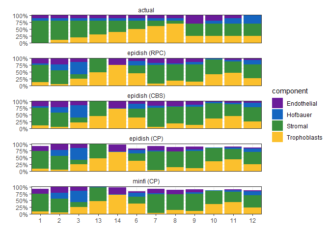

# Setup

## Libraries


```r
# libraries and data
library(tidyverse)
library(scales)
library(here)
library(readxl)
library(janitor)
library(minfi)
library(broom)
library(pheatmap)
theme_set(theme_bw())
library(EpiDISH)
library(yardstick)
```

## Data


```r
base_path <- file.path('data', 'main', 'interim')

# pData
pDat <- readRDS(here(base_path, '2_3_pDat_contam.rds'))
pDat <- pDat %>%
  mutate(Tissue = case_when(
    !(Tissue %in% c('Villi', 'Villi maternal', 'Syncytiotrophoblast', 'Mixture')) ~ paste(Tissue, 'cs'),
    Tissue == 'Syncytiotrophoblast' ~ 'Trophoblasts enz',
    TRUE ~ Tissue
  )) 

# raw methylation data
betas <- readRDS(here(base_path, '1_4_betas_noob_filt.rds'))
mset <- readRDS(here(base_path, '1_4_mset_noob.rds' ))
colnames(mset) <- pData(mset)$Sample_Name

# annotation
anno <- readRDS('Z:/Victor/Repositories/EPIC_annotation/hg19_epic_annotation.rds')
anno <- anno %>%
  as_tibble() %>%
  filter(cpg %in% rownames(betas)) # filter to filtered betas cpgs

# cell proportions for mixtures
mixtures <- read_excel(here::here('data', 'main', 'raw', 'Mixtures.xlsx'))

# color key
color_code <- readRDS(here(base_path, '2_3_color_code.rds'))
color_code_tissue <- setNames(color_code$Colors_Tissue, gsub(' cs', '',color_code$label))
```

## Remove samples


```r
pDat_filt <- pDat %>% 
  filter(maternal_contamination_norm_flip < 0.35,
         !Sample_Name %in% c('PM364_hofb_cs', 'PL293_v_R2', 'PM366_vc_R2', 'P131_hofb_cs', 
                             'PM324_V4', 'PM324_V1', 'PM139_vc', 'PM77_vc'),
         !Tissue %in% c('Villi maternal', 
                        'Trophoblasts enz',
                        'Dead Cells and Lymphocytes cs'),
         Trimester != 'Second')

betas_filt <- betas[,pDat_filt$Sentrix]
colnames(betas_filt) <- pDat_filt$Sample_Name
```

# Houseman Deconvolution

I apply to first and third trimester samples separately, each with their own trimester-specific reference.


```r
# filter to project samples
mset_filt <- mset[,pDat_filt$Sample_Name]
pData(mset_filt) <- DataFrame(pDat_filt)

# necessary column for pickcompprobes
mset$CellType <- mset$Tissue

mset_ref <- mset[,pData(mset)$Tissue %in% c('Trophoblasts', 'Stromal', 'Hofbauer', 'Endothelial')]
mset_test <- mset[,pData(mset)$Tissue %in% c('Mixture', 'Villi')]

# pick probes
probes_third <- minfi:::pickCompProbes(
  mset_ref[, pData(mset_ref)$Trimester == 'Third'], 
  cellTypes = c('Trophoblasts', 'Stromal', 'Hofbauer', 'Endothelial'),
  compositeCellType = 'Placenta',
  probeSelect = "both")

probes_first <- minfi:::pickCompProbes(
  mset_ref[, pData(mset_ref)$Trimester == 'First'], 
  cellTypes = c('Trophoblasts', 'Stromal', 'Hofbauer', 'Endothelial'),
  compositeCellType = 'Placenta',
  probeSelect = "both")


# extract coefficients
coefs_third <- probes_third$coefEsts
coefs_first <- probes_first$coefEsts

# project 
counts_third <- minfi:::projectCellType(
  getBeta(mset_test)[rownames(coefs_third),pData(mset_test)$Trimester == 'Third'], 
  coefs_third,
  lessThanOne = FALSE)

counts_first<- minfi:::projectCellType(
  getBeta(mset_test)[rownames(coefs_first),pData(mset_test)$Trimester == 'First'], 
  coefs_first,
  lessThanOne = FALSE)

res <- rbind(counts_third, counts_first) %>%
  as.data.frame() %>%
  bind_cols(Sample_Name = rownames(.), .) %>%
  inner_join(pData(mset_test) %>% as_tibble());res
```

```
## Joining, by = "Sample_Name"
```

```
## # A tibble: 44 x 25
##    Sample_Name Trophoblasts Stromal Hofbauer Endothelial Chip_number   Row Well 
##    <chr>              <dbl>   <dbl>    <dbl>       <dbl>       <dbl> <dbl> <chr>
##  1 PM376_vc          0.919  0.0280   0.0277       0.0482          25     6 F1   
##  2 PM368_vc          0.872  0.0606   0.0328       0.0677          26     1 A2   
##  3 Mixture 7         0.0366 0.688    0.0403       0.163           26     6 F2   
##  4 PM378_vc          0.866  0.0652   0.0211       0.0640          27     1 A3   
##  5 PM364_vc          0.909  0.0303   0.0238       0.0670          28     3 C4   
##  6 PM365_vc          0.837  0.0743   0.0454       0.0820          29     1 A5   
##  7 PM362_vc          0.964  0.0363   0.0174       0.0361          29     8 H5   
##  8 PM371_vc          0.763  0.122    0.0764       0.0736          30     2 B6   
##  9 Mixture 11        0.426  0.387    0.0463       0.0469          30     5 E6   
## 10 PM324_V1          0.949  0.00559  0.00259      0.0689          31     5 E7   
## # ... with 34 more rows, and 17 more variables: Case_ID <chr>, Sex <chr>,
## #   GA <dbl>, Trimester <chr>, DNA_QP <chr>, Week <dbl>, Sample_Plate <chr>,
## #   Tissue <chr>, Sentrix_ID <dbl>, Sentrix_Position <chr>, Scratches <chr>,
## #   Batch_BSC <chr>, DNA_conc_BSC_adjusted <dbl>, DNA_conc_before_load <dbl>,
## #   DNA_loaded <dbl>, Sentrix <chr>, CellType <chr>
```

```r
# plot
res %>%
  select(Tissue, Sample_Name:Endothelial)  %>%
  pivot_longer(cols = -c(Tissue, Sample_Name),
               names_to = 'Estimates',
               values_to = 'p') %>%
  ggplot(aes(x = Sample_Name, y = p, fill = Estimates)) +
  geom_bar(stat = 'identity', position = 'stack') +
  facet_grid(cols = vars(Tissue), scales = 'free', space = 'free') +
  theme(axis.text.x = element_blank(),
        axis.ticks.x = element_blank()) +
  scale_y_continuous(expand = c(0,0))
```

<!-- -->


# Compare accuracy

Mixture 13 replaces mixture 4 due to failed BSC conversion

Mixture 4 replaces mixture 8 due to failed BSC conversion
Mixture 14 replaces mixture 7 ^ ^ ^ ^
Mixture 7 replaces mixture 5 due to loss of DNA during mixing


```r
mixtures_results <- mixtures %>% select(Sample, Case_ID, contains('%')) %>%
  janitor::clean_names() %>%
  pivot_longer(cols = -c(sample, case_id),
               names_to = 'component',
               values_to = 'actual_percent') %>%
  mutate(component = gsub('_percent', '', component))  %>%
  dplyr::rename(Sample_Name = sample) %>%
  filter(component !='total') %>%
  mutate(Sample_Name = case_when(
    Sample_Name == 'Mixture 4' ~ 'Mixture 13',
    
    Sample_Name == 'Mixture 5' ~ 'Mixture 14',
    TRUE ~ as.character(Sample_Name)
  ))


mixture_results <- res %>%
  select(Sample_Name:Endothelial) %>%
  pivot_longer(cols = -Sample_Name,
               names_to = 'component',
               values_to = 'predicted_percent') %>%
  mutate(component = str_to_lower(component),
         predicted_percent = predicted_percent*100) %>%
  full_join(mixtures_results, by = c('Sample_Name', 'component'))  %>%
  mutate(component = str_to_sentence(component))

# stats
stats <- mixture_results %>%
  filter(grepl('Mix', Sample_Name)) %>%
  nest(data = -component) %>%
  mutate(lm = map(data, ~lm(predicted_percent ~ actual_percent, .)),
         glanced = map(lm, glance)) %>%
  select(-data, -lm) %>%
  unnest(glanced) %>%
  mutate(label = paste0('R2=', signif(r.squared, digits = 2),
                        '\n', pvalue(p.value, add_p = TRUE)))


# scatter plots
mixture_results %>%
  filter(grepl('Mix', Sample_Name)) %>%
  ggplot() +
  geom_point(aes(x = actual_percent, y = predicted_percent, color = component)) +
  geom_smooth(aes(x = actual_percent, y = predicted_percent, color = component),
              method = 'lm', se = FALSE) +
  geom_label(data = stats, aes(label = label),
             x = 0, y = 80, hjust = 0) +
  scale_y_continuous(limits = c(0,100)) +
  facet_wrap(~component) +
  scale_color_manual(values = color_code_tissue[unique(mixture_results$component)], 
                         na.value = '#636363',
                         guide = 'none') 
```

<!-- -->

```r
# bar plots
mixture_results %>%
  filter(grepl('Mix', Sample_Name)) %>%
  mutate(Sample_Name = factor(Sample_Name, 
                              levels = paste0('Mixture ', c(1:3, 13, 14, 6:12)))) %>%
  pivot_longer(cols = contains('percent'),
               names_to = 'type',
               values_to = 'percent') %>%
  mutate(type = gsub('_.*', '', type)) %>%
  ggplot() +
  geom_bar(stat=  'identity',
           aes(x = Sample_Name, y = percent, fill = component)) +
  facet_wrap(ncol = 1, vars(type)) +
  labs(x = '') +
  scale_x_discrete(labels = function(x)gsub('Mixture ', '', x))
```

<!-- -->

```r
mixture_results %>%
  filter(grepl('Mix', Sample_Name)) %>%
  mutate(Sample_Name = factor(Sample_Name, 
                              levels = paste0('Mixture ', c(1:3, 13, 14, 6:12)))) %>%
  pivot_longer(cols = contains('percent'),
               names_to = 'type',
               values_to = 'percent') %>%
  mutate(type = gsub('_.*', '', type)) %>%
  ggplot() +
  geom_bar(stat=  'identity',
           aes(x = Sample_Name, y = percent, fill = component)) +
  facet_grid(rows = vars(type),
             cols = vars(case_id), scales = 'free', space = 'free') +
  labs(x = '') +
  theme(strip.background = element_blank()) +
  scale_x_discrete(labels = function(x)gsub('Mixture ', '', x))
```

<!-- -->

# EPIDISH


```r
epidish_res1 <- epidish(
  beta.m = getBeta(mset_test)[rownames(coefs_third),pData(mset_test)$Trimester == 'Third'],
  ref.m = coefs_third,
  method = 'RPC')

epidish_res2 <- epidish(
  beta.m = getBeta(mset_test)[rownames(coefs_third),pData(mset_test)$Trimester == 'Third'],
  ref.m = coefs_third,
  method = 'CBS')
```

```
## 1
```

```
## 2
```

```
## 3
```

```r
epidish_res3 <- epidish(
  beta.m = getBeta(mset_test)[rownames(coefs_third),pData(mset_test)$Trimester == 'Third'],
  ref.m = coefs_third,
  method = 'CP',
  constraint = 'inequality')
```

```
## 1
```

```
## 2
```

```
## 3
```

```
## 4
```

```
## 5
```

```
## 6
```

```
## 7
```

```
## 8
```

```
## 9
```

```
## 10
```

```
## 11
```

```
## 12
```

```
## 13
```

```
## 14
```

```
## 15
```

```
## 16
```

```
## 17
```

```
## 18
```

```
## 19
```

```
## 20
```

```
## 21
```

```
## 22
```

```
## 23
```

```
## 24
```

```
## 25
```

```
## 26
```

```
## 27
```

```
## 28
```

```
## 29
```

```
## 30
```

```
## 31
```

```
## 32
```

```
## 33
```

```
## 34
```

```
## 35
```

```
## 36
```

```r
#first trime
epidish_res11 <- epidish(
  beta.m = getBeta(mset_test)[rownames(coefs_first),pData(mset_test)$Trimester == 'First'],
  ref.m = coefs_first,
  method = 'RPC')

epidish_res22 <- epidish(
  beta.m = getBeta(mset_test)[rownames(coefs_first),pData(mset_test)$Trimester == 'First'],
  ref.m = coefs_first,
  method = 'CBS')
```

```
## 1
```

```
## 2
```

```
## 3
```

```r
epidish_res33 <- epidish(
  beta.m = getBeta(mset_test)[rownames(coefs_first),pData(mset_test)$Trimester == 'First'],
  ref.m = coefs_first,
  method = 'CP',
  constraint = 'inequality')
```

```
## 1
```

```
## 2
```

```
## 3
```

```
## 4
```

```
## 5
```

```
## 6
```

```
## 7
```

```
## 8
```

```r
str(epidish_res1)
```

```
## List of 3
##  $ estF   : num [1:36, 1:4] 0.9278 0.902 0.0681 0.899 0.9421 ...
##   ..- attr(*, "dimnames")=List of 2
##   .. ..$ : chr [1:36] "PM376_vc" "PM368_vc" "Mixture 7" "PM378_vc" ...
##   .. ..$ : chr [1:4] "Trophoblasts" "Stromal" "Hofbauer" "Endothelial"
##  $ ref    : num [1:400, 1:4] 0.1014 0.0719 0.1507 0.1321 0.1282 ...
##   ..- attr(*, "dimnames")=List of 2
##   .. ..$ : chr [1:400] "cg10590657" "cg00281273" "cg14514160" "cg16156113" ...
##   .. ..$ : chr [1:4] "Trophoblasts" "Stromal" "Hofbauer" "Endothelial"
##  $ dataREF: num [1:400, 1:36] 0.1118 0.0797 0.321 0.2209 0.219 ...
##   ..- attr(*, "dimnames")=List of 2
##   .. ..$ : chr [1:400] "cg10590657" "cg00281273" "cg14514160" "cg16156113" ...
##   .. ..$ : chr [1:36] "PM376_vc" "PM368_vc" "Mixture 7" "PM378_vc" ...
```

```r
epidish_res1 <- epidish_res1$estF %>%
  as.data.frame() %>%
  bind_cols(Sample_Names = rownames(.), .) %>%
  pivot_longer(
    cols = -Sample_Names,
    names_to = 'component',
    values_to = 'percent'
  ) %>%
  mutate(algorithm = 'epidish (RPC)')

epidish_res2 <- epidish_res2$estF %>%
  as.data.frame() %>%
  bind_cols(Sample_Names = rownames(.), .) %>%
  pivot_longer(
    cols = -Sample_Names,
    names_to = 'component',
    values_to = 'percent'
  ) %>%
  mutate(algorithm = 'epidish (CBS)')

epidish_res3 <- epidish_res3$estF %>%
  as.data.frame() %>%
  bind_cols(Sample_Names = rownames(.), .) %>%
  pivot_longer(
    cols = -Sample_Names,
    names_to = 'component',
    values_to = 'percent'
  ) %>%
  mutate(algorithm = 'epidish (CP)')

epidish_res11 <- epidish_res11$estF %>%
  as.data.frame() %>%
  bind_cols(Sample_Names = rownames(.), .) %>%
  pivot_longer(
    cols = -Sample_Names,
    names_to = 'component',
    values_to = 'percent'
  ) %>%
  mutate(algorithm = 'epidish (RPC)')

epidish_res22 <- epidish_res22$estF %>%
  as.data.frame() %>%
  bind_cols(Sample_Names = rownames(.), .) %>%
  pivot_longer(
    cols = -Sample_Names,
    names_to = 'component',
    values_to = 'percent'
  ) %>%
  mutate(algorithm = 'epidish (CBS)')

epidish_res33 <- epidish_res33$estF %>%
  as.data.frame() %>%
  bind_cols(Sample_Names = rownames(.), .) %>%
  pivot_longer(
    cols = -Sample_Names,
    names_to = 'component',
    values_to = 'percent'
  ) %>%
  mutate(algorithm = 'epidish (CP)')

epidish_results <- bind_rows(epidish_res1, epidish_res2, epidish_res3, 
                             epidish_res11, epidish_res22, epidish_res33) %>%
   dplyr::rename(Sample_Name = Sample_Names) %>%
  mutate(percent = percent*100) %>%
  left_join(mixture_results %>% select(Sample_Name, case_id))
```

```
## Joining, by = "Sample_Name"
```

```r
# combine epidish results with houseman
mixture_results_all <- mixture_results %>%
  pivot_longer(
    cols = contains('percent'),
    names_to = 'algorithm',
    values_to = 'percent'
  ) %>%
  mutate(algorithm = gsub('_percent', '', algorithm),
         algorithm = ifelse(algorithm == 'predicted', 'minfi (CP)', algorithm)) %>%
  select(-case_id) %>%
  bind_rows(epidish_results %>% select(-case_id)) %>%
  mutate(algorithm = factor(algorithm, 
                            levels = c('actual', 'epidish (RPC)', 'epidish (CBS)', 
                                       'epidish (CP)', 'minfi (CP)'))) %>%
  distinct()

# bar plot
mixture_results_all %>%
  filter(grepl('Mix', Sample_Name)) %>%
  mutate(Sample_Name = factor(Sample_Name, 
                              levels = paste0('Mixture ', c(1:3, 13, 14, 6:12)))) %>%
  ggplot() +
  geom_bar(stat=  'identity',
           aes(x = Sample_Name, y = percent, fill = component)) +
  facet_wrap(ncol = 1, vars(algorithm)) +
  labs(x = '', y= '') +
  theme(strip.background = element_blank())+
  scale_fill_manual(values = color_code_tissue[unique(mixture_results_all$component)],
                    na.value = '#636363') +
  scale_y_continuous(labels = function(x)paste0(x, '%'), expand = c(0,0))+
  scale_x_discrete(labels = function(x)gsub('Mixture ', '', x), expand = c(0,0))
```

<!-- -->

```r
# stats
stats <- mixture_results_all %>%
  filter(grepl('Mix', Sample_Name)) %>%
  pivot_wider(id_cols = c(Sample_Name, component),
              names_from = 'algorithm',
              values_from = 'percent') %>%
  pivot_longer(cols = -c(Sample_Name, component, actual),
               names_to = 'algorithm',
               values_to = 'predicted') %>%
  
  nest(data = -c(component, algorithm)) %>%
  mutate(lm = map(data, ~lm(predicted ~ actual, .)),
         glanced = map(lm, glance)) %>%
  select(-data, -lm) %>%
  unnest(glanced) %>%
  mutate(label = paste0('R2=', signif(r.squared, digits = 2),
                        '\n', pvalue(p.value, add_p = TRUE)))

mixture_results_all %>%
  filter(grepl('Mix', Sample_Name)) %>%
  pivot_wider(id_cols = c(Sample_Name, component),
              names_from = 'algorithm',
              values_from = 'percent') %>%
  pivot_longer(cols = -c(Sample_Name, component, actual),
               names_to = 'algorithm',
               values_to = 'predicted') %>%
  group_by(algorithm) %>%
  rmse(truth = actual, estimate = predicted)
```

```
## # A tibble: 4 x 4
##   algorithm     .metric .estimator .estimate
##   <chr>         <chr>   <chr>          <dbl>
## 1 epidish (CBS) rmse    standard        21.1
## 2 epidish (CP)  rmse    standard        20.9
## 3 epidish (RPC) rmse    standard        20.9
## 4 minfi (CP)    rmse    standard        20.9
```

```r
stats %>%
  group_by(algorithm) %>%
  summarize(mean_r2 = mean(r.squared))
```

```
## # A tibble: 4 x 2
##   algorithm     mean_r2
##   <chr>           <dbl>
## 1 epidish (CBS) 0.00757
## 2 epidish (CP)  0.00572
## 3 epidish (RPC) 0.00846
## 4 minfi (CP)    0.00561
```

```r
mixture_results_all %>%
  filter(grepl('Mix', Sample_Name)) %>%
  pivot_wider(id_cols = c(Sample_Name, component),
              names_from = 'algorithm',
              values_from = 'percent') %>%
  pivot_longer(cols = -c(Sample_Name, component, actual),
               names_to = 'algorithm',
               values_to = 'predicted')  %>%
  ggplot(aes(x = actual, y = predicted, color = component)) +
  geom_point() +
  geom_smooth(method = 'lm', se = FALSE) +
  geom_label(color = 'black', size = 3, data = stats, aes(label = label),
             x = 0, y = 100, hjust = 0, vjust = 1) +
  facet_grid(cols = vars(algorithm), rows = vars(component)) +
  theme(strip.background = element_blank(),
        panel.grid.minor = element_blank()) +
  scale_color_manual(values = color_code_tissue[unique(mixture_results_all$component)], 
                         na.value = '#636363',
                         guide = 'none') +
  scale_x_continuous(labels = function(x)paste0(x, '%'), breaks = c(0,30,60,100))+
  scale_y_continuous(limits = c(0,100),labels = function(x)paste0(x, '%')) +
  labs(x = 'Actual', y = 'Predicted')
```

<!-- -->

# Heatmap of deconvolution probes


```r
probes_third %>% str
```

```
## List of 3
##  $ coefEsts   : num [1:400, 1:4] 0.1014 0.0719 0.1507 0.1321 0.1282 ...
##   ..- attr(*, "dimnames")=List of 2
##   .. ..$ : chr [1:400] "cg10590657" "cg00281273" "cg14514160" "cg16156113" ...
##   .. ..$ : chr [1:4] "Trophoblasts" "Stromal" "Hofbauer" "Endothelial"
##  $ compTable  :'data.frame':	866091 obs. of  9 variables:
##   ..$ Fstat       : num [1:866091] 0.061 0.0559 87.0695 0.7957 2.1478 ...
##   ..$ p.value     : num [1:866091] 9.80e-01 9.83e-01 6.76e-24 5.00e-01 1.02e-01 ...
##   ..$ Trophoblasts: num [1:866091] 0.0119 0.0245 0.3432 0.9525 0.8267 ...
##   ..$ Stromal     : num [1:866091] 0.012 0.025 0.0847 0.9478 0.8711 ...
##   ..$ Hofbauer    : num [1:866091] 0.0119 0.0243 0.4373 0.9529 0.8743 ...
##   ..$ Endothelial : num [1:866091] 0.0117 0.0246 0.425 0.9554 0.8537 ...
##   ..$ low         : num [1:866091] 0.00715 0.01229 0.02142 0.90207 0.61026 ...
##   ..$ high        : num [1:866091] 0.0161 0.0362 0.6382 0.9809 0.9374 ...
##   ..$ range       : num [1:866091] 0.00894 0.02393 0.61676 0.07888 0.32718 ...
##  $ sampleMeans: Named num [1:76] 0.492 0.506 0.507 0.502 0.494 ...
##   ..- attr(*, "names")= chr [1:76] "Endothelial" "Hofbauer" "Trophoblasts" "Endothelial" ...
```

```r
pheatmap(probes_third$coefEsts, cluster_cols = FALSE, cluster_rows = TRUE,
         show_rownames = FALSE) 
```

<!-- -->

# FACS-determined proportions

So mixture data is potentially garbage. Here I look at the FACS cell proportions.


```r
facs_prop <- read_excel(here::here('data', 'main', 'raw', 'FACS_proportions.xlsx'))

# process
facs_prop <- facs_prop %>%
  as.matrix() %>%
  magrittr::set_rownames(.[,'Cell_type']) %>%
  t() %>%
  as.data.frame %>%
  bind_cols(Sample_Name = rownames(.), .) %>%
  dplyr::slice(-1) %>%
  select(Sample_Name, contains('% of live')) %>%
  pivot_longer(cols = -Sample_Name, names_to = 'component', values_to = 'value') %>%
  mutate(component = gsub(' \\(\\% of live\\)', '', component),
         percent = str_extract(value, '[0-9]?\\.?[0-9]+(?=\\%)') %>% as.numeric(),
         Case_ID = str_extract(Sample_Name, 'PM[0-9]+'),
         component = ifelse(component == 'Fibroblasts', 'Stromal', component)) %>%
  select(-value) %>% 
  
  # REMOVE samples
  filter(!grepl('TB Layer', Sample_Name),
         ) %>% 
  
  # average percentage
  group_by(Case_ID, component) %>%
  summarize(percent = mean(percent)) %>%
  
  # rescale such that sums to 1
  mutate(percent = percent*100 / sum(percent)) %>%
  group_by(Case_ID, component == 'Trophoblasts') %>%
  mutate(percent_constrained = percent*100/ sum(percent)) %>%
  ungroup() %>%
  mutate(percent_constrained = ifelse(percent_constrained == 100, NA,
                                      percent_constrained)) %>%
  select(-`component == "Trophoblasts"`) %>%
  
  pivot_longer(cols = contains('percent'),
               names_to = 'FACS',
               values_to = 'actual') %>%
  mutate(FACS = ifelse(FACS == 'percent', 'FACS',
                       ifelse(FACS == 'percent_constrained', 'FACS - constrained',
                              FACS)))


facs_results <-mixture_results_all %>%
  filter(!grepl('Mix', Sample_Name),
         algorithm != 'actual') %>%
  mutate(Case_ID = str_extract(Sample_Name, 'PM[0-9]+'))  %>%
  
  # constrain to non-troph pops
  filter(component != 'Trophoblasts') %>%
  group_by(Case_ID, algorithm) %>%
  mutate(percent = percent*100/sum(percent)) %>%
  inner_join(facs_prop, by = c('component', 'Case_ID'))
  
plot_scatter <- function(x){
  ggplot(data = x, aes(x = actual, y = percent, color =component)) +
  geom_point() +
  geom_smooth(method = 'lm', se = FALSE) +
  facet_grid(cols = vars(algorithm), rows = vars(component), scales = 'fixed') +
  theme(strip.background = element_blank(),
        panel.grid.minor = element_blank()) +
  scale_color_manual(values = color_code_tissue[unique(facs_results$component)], 
                         na.value = '#636363',
                         guide = 'none') +
  scale_x_continuous(labels = function(x)paste0(x, '%'))+
  scale_y_continuous(labels = function(x)paste0(x, '%')) +
  labs(x = 'Actual', y = 'Predicted') +
    coord_equal()
}

facs_results %>%
  filter(FACS == 'FACS',
         component == 'Endothelial')  %>%
  plot_scatter()
```

<!-- -->

```r
facs_results %>%
  filter(FACS == 'FACS',
         component == 'Hofbauer')  %>%
  plot_scatter()+
  scale_y_continuous(limits = c(0, 60), labels = function(x)paste0(x, '%')) 
```

```
## Scale for 'y' is already present. Adding another scale for 'y', which will
## replace the existing scale.
```

<!-- -->

```r
facs_results %>%
  filter(FACS == 'FACS',
         component == 'Stromal')  %>%
  plot_scatter()
```

<!-- -->

```r
# stats
facs_stats <- facs_results %>%
  filter(FACS == 'FACS - constrained',
         component != 'Trophoblasts') %>%
  nest(data = -c(algorithm, component)) %>%
  mutate(lm = map(data, ~lm(percent ~ actual, .)),
         glanced = map(lm, glance)) %>%
  select(-data, -lm) %>%
  unnest(glanced) %>%
  mutate(label = paste0('R2=', signif(r.squared, digits = 2),
                        '\n', pvalue(p.value, add_p = TRUE)));facs_stats
```

```
## # A tibble: 12 x 14
## # Groups:   algorithm [5]
##    component algorithm r.squared adj.r.squared sigma statistic p.value    df
##    <chr>     <fct>         <dbl>         <dbl> <dbl>     <dbl>   <dbl> <int>
##  1 Stromal   minfi (C~   0.0660        0.0142  10.7      1.27   0.274      2
##  2 Hofbauer  minfi (C~   0.152         0.105    5.33     3.24   0.0888     2
##  3 Endothel~ minfi (C~   0.0143       -0.0405  13.0      0.261  0.616      2
##  4 Stromal   epidish ~   0.0597        0.00749 18.2      1.14   0.299      2
##  5 Hofbauer  epidish ~   0.00928      -0.0458   7.00     0.169  0.686      2
##  6 Endothel~ epidish ~   0.0144       -0.0404  23.1      0.262  0.615      2
##  7 Stromal   epidish ~   0.0439       -0.00923 15.6      0.826  0.375      2
##  8 Hofbauer  epidish ~   0.0547        0.00217  8.08     1.04   0.321      2
##  9 Endothel~ epidish ~   0.0232       -0.0310  20.8      0.428  0.521      2
## 10 Stromal   epidish ~   0.0945        0.0442  12.1      1.88   0.187      2
## 11 Hofbauer  epidish ~   0.113         0.0636   5.72     2.29   0.147      2
## 12 Endothel~ epidish ~   0.0176       -0.0370  14.6      0.322  0.578      2
## # ... with 6 more variables: logLik <dbl>, AIC <dbl>, BIC <dbl>,
## #   deviance <dbl>, df.residual <int>, label <chr>
```

```r
facs_results %>%
  filter(FACS == 'FACS - constrained',
         component != 'Trophoblasts') %>%
  group_by(algorithm) %>%
  rmse(truth = actual, estimate = percent)
```

```
## # A tibble: 4 x 4
##   algorithm     .metric .estimator .estimate
##   <fct>         <chr>   <chr>          <dbl>
## 1 epidish (RPC) rmse    standard        31.1
## 2 epidish (CBS) rmse    standard        28.0
## 3 epidish (CP)  rmse    standard        23.7
## 4 minfi (CP)    rmse    standard        22.8
```

```r
facs_results %>%
  filter(FACS == 'FACS - constrained',
         component != 'Trophoblasts') %>%
  ggplot(aes(x = actual, y = percent, color =component)) +
  geom_point() +
  geom_smooth(method = 'lm', se = FALSE) +  
  geom_label(data = facs_stats, 
             color = 'black', size = 3, 
             aes(label = label),
             x = 10, y = 120, hjust = 0, vjust = 1,
             alpha = 0) +

  facet_grid(cols = vars(algorithm), rows = vars(component), scales = 'fixed') +
  theme(strip.background = element_blank(),
        panel.grid.minor = element_blank()) +
  scale_color_manual(values = color_code_tissue[unique(facs_results$component)], 
                         na.value = '#636363',
                         guide = 'none') +
  scale_x_continuous(labels = function(x)paste0(x, '%'))+
  scale_y_continuous(limits = c(0, 120),labels = function(x)paste0(x, '%')) +
  labs(x = 'Actual', y = 'Predicted') + 
  coord_equal()
```

<!-- -->

```r
facs_stats %>%
  group_by(component, algorithm) %>%
  summarize(r2 = mean(r.squared)) %>%
  group_by(algorithm) %>%
  mutate(overall_r2 = mean(r2)) %>%
  ungroup() %>%
  arrange(algorithm, component)
```

```
## # A tibble: 15 x 4
##    component   algorithm            r2 overall_r2
##    <chr>       <fct>             <dbl>      <dbl>
##  1 Endothelial actual        NaN         NaN     
##  2 Hofbauer    actual        NaN         NaN     
##  3 Stromal     actual        NaN         NaN     
##  4 Endothelial epidish (RPC)   0.0144      0.0278
##  5 Hofbauer    epidish (RPC)   0.00928     0.0278
##  6 Stromal     epidish (RPC)   0.0597      0.0278
##  7 Endothelial epidish (CBS)   0.0232      0.0406
##  8 Hofbauer    epidish (CBS)   0.0547      0.0406
##  9 Stromal     epidish (CBS)   0.0439      0.0406
## 10 Endothelial epidish (CP)    0.0176      0.0750
## 11 Hofbauer    epidish (CP)    0.113       0.0750
## 12 Stromal     epidish (CP)    0.0945      0.0750
## 13 Endothelial minfi (CP)      0.0143      0.0776
## 14 Hofbauer    minfi (CP)      0.152       0.0776
## 15 Stromal     minfi (CP)      0.0660      0.0776
```

# Villi


```r
# both first and third barplots
mixture_results_all %>%
  left_join(pDat_filt %>% select(Sample_Name, Tissue, Trimester)) %>%
  filter(algorithm != 'actual',
         Tissue == 'Villi')   %>%
  ggplot() +
  geom_bar(stat=  'identity',
           aes(x = Sample_Name, y = percent, fill = component)) +
  facet_grid(rows = vars(algorithm), cols = vars(Trimester), 
             scales = 'free', space = 'free') +
  labs(x = '') +
  theme(strip.background = element_blank(),
        axis.text.x = element_blank(),
        axis.ticks.x = element_blank()) +
  scale_fill_manual(values = color_code_tissue[unique(mixture_results_all$component)], 
                    na.value = '#636363') +
  scale_x_discrete(expand = c(0,0)) +
  scale_y_discrete(expand = c(0,1), limits = c(0,100))
```

```
## Joining, by = "Sample_Name"
```

<!-- -->

```r
# averaged
mixture_results_all %>%
  left_join(pDat_filt %>% select(Sample_Name, Tissue, Trimester)) %>%
  filter(algorithm != 'actual',
         Tissue == 'Villi')   %>%
  
  group_by(Trimester, algorithm, component) %>%
  summarize(percent = mean(percent)) %>%
  ggplot() +
  geom_bar(stat=  'identity',
           aes(x = Trimester, y = percent, fill = component)) +
  facet_grid(rows = vars(algorithm), scales = 'free', space = 'free') +
  labs(x = '') +
  theme(strip.background = element_blank(),
        axis.ticks.x = element_blank()) +
  scale_fill_manual(values = color_code_tissue[unique(mixture_results_all$component)], 
                    na.value = '#636363') +
  scale_x_discrete(expand = c(0,0)) +
  scale_y_discrete(expand = c(0,1), limits = c(0,100))
```

```
## Joining, by = "Sample_Name"
```

<!-- -->

```r
# between algorithms
mixture_results_all %>%
  left_join(pDat_filt %>% select(Sample_Name, Tissue, Trimester)) %>%
  filter(algorithm != 'actual',
         Tissue == 'Villi')   %>%
  ggplot() +
  geom_boxplot(aes(x = algorithm, y = percent, fill = component)) +
  facet_grid(cols = vars(component), rows = vars(Trimester), space = 'free') +
  labs(x = '', fill = '') +
  theme(strip.background = element_blank(),
        axis.ticks.x = element_blank(),
        axis.text.x = element_text(angle = 45, hjust = 1, vjust = 1)) +
  scale_fill_manual(values = color_code_tissue[unique(mixture_results_all$component)], 
                    na.value = '#636363',
                    guide = 'none') +
  scale_x_discrete(labels = function(x)gsub('epidish', 'EpiDISH', x)) +
  scale_y_continuous(labels = function(x)paste0(x, '%'))
```

```
## Joining, by = "Sample_Name"
```

<!-- -->

```r
# first to third beeeswarm
mixture_results_all %>%
  left_join(pDat_filt %>% select(Sample_Name, Tissue, Trimester)) %>%
  filter(algorithm != 'actual',
         Tissue == 'Villi') %>%
  ggplot(aes(x = component, y = percent, color = Trimester)) +
  ggbeeswarm::geom_beeswarm(dodge.width = 0.75) +
  facet_grid(rows = vars(algorithm)) +
  theme(strip.background = element_blank(),
        panel.grid.minor = element_blank()) +
  scale_y_continuous(labels = function(x)paste0(x, '%'))
```

```
## Joining, by = "Sample_Name"
```

<!-- -->

# In silico mixtures

For each cell type ("a"),
generate proportions randomly from 0-1.
cell type b proportion is drawn from 0-a
cell type c proportion is drawn from 0-(b+a)
cell type d is 1-(a+b+c)

These are the coefficients for generating mixtures with proportions uniformly distributed between 0-1 for cell type A. 

Apply this to generate mixtures for each cell type.


```r
# generate coefficients
n <- 250
a <- runif(n = n);a
```

```
##   [1] 0.15362535 0.65672802 0.36870603 0.06156968 0.22447241 0.79564218
##   [7] 0.86769585 0.40321792 0.52204973 0.57808778 0.50021156 0.10631895
##  [13] 0.41500602 0.41590966 0.96817676 0.98514786 0.54645839 0.63695665
##  [19] 0.84589616 0.45287607 0.13604910 0.53163923 0.74391962 0.13283147
##  [25] 0.18019649 0.41516122 0.98198210 0.07090024 0.01615316 0.59056154
##  [31] 0.10800383 0.79096767 0.41700487 0.68844859 0.85481695 0.77122762
##  [37] 0.72132492 0.63936749 0.28418716 0.80817084 0.85921595 0.69195714
##  [43] 0.39545725 0.75861633 0.92757089 0.11924955 0.69696773 0.85390636
##  [49] 0.25601120 0.50230999 0.04405732 0.36249815 0.27020803 0.65695922
##  [55] 0.36225395 0.80290730 0.74764979 0.78700870 0.82594362 0.47262120
##  [61] 0.33043720 0.91975666 0.79797861 0.76935725 0.40657426 0.40550353
##  [67] 0.24000577 0.07831395 0.19459573 0.66306983 0.62653006 0.23390505
##  [73] 0.36059868 0.71803151 0.09912156 0.08088730 0.27941042 0.32473154
##  [79] 0.26656811 0.04024116 0.07727869 0.99967829 0.59510032 0.47200888
##  [85] 0.24573451 0.98147251 0.89724224 0.05560042 0.99319287 0.98879545
##  [91] 0.46762734 0.48510027 0.73817887 0.38354328 0.51450397 0.46692911
##  [97] 0.52652929 0.38422779 0.99656223 0.27707912 0.14346586 0.48163446
## [103] 0.32741071 0.63580840 0.57552719 0.63761104 0.42121218 0.84144687
## [109] 0.20371571 0.86415929 0.75880201 0.20565397 0.54114241 0.26509974
## [115] 0.92318489 0.54920022 0.84895794 0.95518067 0.91856554 0.69174894
## [121] 0.53141599 0.81430270 0.84015074 0.34329796 0.94915099 0.38953875
## [127] 0.05343228 0.66880584 0.22651110 0.70956367 0.84421755 0.67883467
## [133] 0.66202600 0.62933230 0.43192982 0.10931624 0.11297285 0.60028328
## [139] 0.38100101 0.52756110 0.90160665 0.94617442 0.14725833 0.92728508
## [145] 0.94741835 0.81226912 0.29536642 0.24885456 0.88331284 0.51867433
## [151] 0.65087455 0.31427305 0.08095984 0.67721738 0.71910470 0.18783428
## [157] 0.60437104 0.41024325 0.50704285 0.25390194 0.44918380 0.01849541
## [163] 0.36433946 0.21724095 0.20180780 0.11067549 0.14011211 0.19219803
## [169] 0.30884379 0.91404809 0.08392864 0.55991545 0.98578629 0.62557089
## [175] 0.39756231 0.29979688 0.36388426 0.23822644 0.45918611 0.79175340
## [181] 0.89004757 0.07763047 0.62952731 0.70734052 0.80524878 0.21154321
## [187] 0.31852678 0.79536206 0.04389859 0.13467301 0.15402385 0.47805372
## [193] 0.74266017 0.53150820 0.90562803 0.19658468 0.24849286 0.21616268
## [199] 0.28291507 0.58505100 0.43765929 0.38005104 0.94090606 0.85764205
## [205] 0.54584326 0.78653231 0.92309518 0.71391588 0.16109065 0.62055311
## [211] 0.83048426 0.04466701 0.93082647 0.60662500 0.67689502 0.38120217
## [217] 0.67642311 0.51595591 0.54554440 0.78881704 0.62184826 0.03814821
## [223] 0.74840481 0.12183363 0.77762079 0.33943000 0.21083000 0.46514298
## [229] 0.90856999 0.55831658 0.30365788 0.51982690 0.80136149 0.02509423
## [235] 0.51217349 0.70788695 0.25636350 0.79469120 0.24449393 0.29594579
## [241] 0.29802585 0.38316177 0.49531974 0.79856891 0.20953576 0.69447853
## [247] 0.02778305 0.92313325 0.63831844 0.29337903
```

```r
b <- runif(n = n, min = 0, max = 1-a);b
```

```
##   [1] 0.6835469735 0.1855419639 0.3785242546 0.9343983500 0.5860211005
##   [6] 0.0746125033 0.0616441408 0.3606008973 0.0025988977 0.3860904832
##  [11] 0.1577604345 0.6507357948 0.2365790718 0.3356089773 0.0037406688
##  [16] 0.0021420348 0.4172008757 0.1040158325 0.0172032396 0.4740814307
##  [21] 0.8174240605 0.1483056503 0.2264868284 0.1460965984 0.2055254619
##  [26] 0.4607440509 0.0169478833 0.8106275271 0.5933982750 0.2177966472
##  [31] 0.3929710140 0.1954282203 0.5809224513 0.0057818478 0.0831147053
##  [36] 0.1017641585 0.2137626718 0.3134495538 0.3259945229 0.0328444227
##  [41] 0.0751814077 0.1871199380 0.4589170748 0.0720685692 0.0058278155
##  [46] 0.0641986814 0.2616250407 0.0348408897 0.0380196949 0.2121026275
##  [51] 0.7810027704 0.2575223416 0.3044402383 0.0931899099 0.0080951026
##  [56] 0.1565745271 0.0642542961 0.0045889610 0.1305773327 0.0626465461
##  [61] 0.0401599952 0.0632746561 0.0076850516 0.1254633719 0.5169525573
##  [66] 0.2577658974 0.1227795066 0.1502299820 0.1769502147 0.3208999859
##  [71] 0.1237018502 0.0952961511 0.3370318579 0.1679514704 0.2147146558
##  [76] 0.7844153912 0.3804959369 0.5294650052 0.0399767007 0.0371822645
##  [81] 0.5627099765 0.0002474305 0.3163275630 0.1067799187 0.0305064159
##  [86] 0.0146478967 0.0603845490 0.5687545652 0.0040459007 0.0086823801
##  [91] 0.1115685047 0.2265235447 0.0282924386 0.3451566858 0.1684871289
##  [96] 0.1216268468 0.2707217221 0.5583243530 0.0017073556 0.0484650788
## [101] 0.8247054315 0.4003357701 0.0517303645 0.3176638557 0.0209104005
## [106] 0.1402065688 0.4092893379 0.0728175793 0.0736025529 0.0839616984
## [111] 0.0273346632 0.5335245042 0.4209449453 0.3964883995 0.0292586696
## [116] 0.4095449713 0.0413292474 0.0179831331 0.0603859630 0.0363671543
## [121] 0.4219319443 0.1047567260 0.0296211731 0.4749150022 0.0309456939
## [126] 0.5906931494 0.9137487596 0.1934470253 0.4506375393 0.0991842177
## [131] 0.1323800867 0.0881270284 0.2753986409 0.1242122295 0.4362643641
## [136] 0.3829489975 0.8277838685 0.2504146424 0.6088391441 0.1085472778
## [141] 0.0527915952 0.0052421132 0.8422345067 0.0382951299 0.0425235320
## [146] 0.1564906803 0.5585107420 0.0492852893 0.0525676758 0.3452858179
## [151] 0.0784823321 0.5147415409 0.7157156538 0.1543010146 0.2171958765
## [156] 0.7537920501 0.2520019669 0.1251811471 0.4354037232 0.2020371421
## [161] 0.3388271667 0.3708742267 0.2927657670 0.3152010143 0.7054164124
## [166] 0.1078254340 0.2419306951 0.3439523935 0.0258197571 0.0250356305
## [171] 0.0177846717 0.2578396754 0.0010366650 0.0871339903 0.1097586691
## [176] 0.3110422402 0.5333270382 0.5990538208 0.4097587780 0.1356712986
## [181] 0.0396630290 0.9146803858 0.0524264394 0.2638695525 0.1492505592
## [186] 0.2800786582 0.2362315710 0.2036352088 0.4223348743 0.4057203678
## [191] 0.6135960303 0.0518125641 0.0035959334 0.4326292848 0.0574178469
## [196] 0.4841016207 0.0065341673 0.7519460671 0.2540971634 0.3576810457
## [201] 0.3094571317 0.4387857084 0.0402685496 0.0683702402 0.0075677952
## [206] 0.1762854661 0.0736388075 0.0261892653 0.3824198706 0.1357660868
## [211] 0.1663277195 0.5160573438 0.0466597441 0.1026698720 0.0423016114
## [216] 0.4910657278 0.2125133493 0.4075840452 0.4352591398 0.0737403829
## [221] 0.3245266701 0.8312444595 0.1238231617 0.4892797246 0.0548006088
## [226] 0.2673047080 0.0799383683 0.3825234932 0.0519166553 0.0379027985
## [231] 0.0031277608 0.1645622179 0.1979132906 0.1099077823 0.4255848748
## [236] 0.0732360664 0.3159752707 0.0242433420 0.6647528554 0.1416791068
## [241] 0.5446203124 0.2159023399 0.2621487767 0.0048294023 0.1843038418
## [246] 0.1357820741 0.6688901159 0.0371244843 0.2947445523 0.6166736425
```

```r
c <- runif(n = n, min = 0, max = 1-(b + a));c
```

```
##   [1] 9.733440e-02 6.759864e-02 1.614607e-01 1.657683e-03 1.696170e-01
##   [6] 7.339547e-02 4.464132e-02 8.855118e-02 1.234819e-01 4.878322e-03
##  [11] 2.982787e-02 2.360951e-01 2.869258e-02 2.015976e-01 1.994575e-02
##  [16] 5.368859e-03 8.111145e-04 3.462256e-03 2.102972e-02 4.071752e-02
##  [21] 3.374744e-02 1.744666e-01 1.489665e-02 6.294647e-02 5.249983e-01
##  [26] 5.980257e-02 1.464137e-04 3.992580e-02 2.159386e-01 1.606121e-02
##  [31] 2.255479e-01 1.146021e-02 1.745562e-03 2.972005e-02 2.557303e-02
##  [36] 9.444592e-02 5.350666e-03 2.190806e-02 3.283847e-01 7.719729e-02
##  [41] 2.547932e-02 2.875216e-02 2.658553e-02 1.473204e-01 1.369008e-02
##  [46] 3.554461e-01 9.081305e-03 4.196280e-02 5.280658e-01 7.919526e-02
##  [51] 7.440561e-02 1.395230e-02 2.942337e-01 1.504066e-01 4.216352e-01
##  [56] 1.260650e-02 1.445978e-01 9.178962e-03 1.256071e-02 2.113321e-02
##  [61] 8.522164e-02 9.944597e-03 6.316241e-02 4.338133e-02 2.287603e-02
##  [66] 3.340540e-01 3.399803e-01 6.257859e-03 1.841181e-01 1.516502e-02
##  [71] 7.156586e-02 4.164549e-01 5.532161e-02 6.965890e-02 1.342426e-02
##  [76] 1.069697e-01 1.598248e-01 9.365015e-02 2.423952e-02 5.636860e-01
##  [81] 1.307737e-01 4.243601e-05 1.131774e-02 1.281520e-01 3.323164e-01
##  [86] 2.633230e-03 5.883453e-03 3.076067e-01 2.619911e-03 2.232376e-03
##  [91] 2.787561e-01 5.339337e-02 2.080102e-01 1.236794e-01 1.323484e-01
##  [96] 3.970068e-01 9.061592e-02 3.484951e-03 1.043426e-03 2.811473e-02
## [101] 8.703866e-03 4.904192e-02 2.771537e-01 3.517434e-02 2.639926e-01
## [106] 4.555631e-02 1.212444e-03 5.715864e-02 4.417266e-01 1.410112e-02
## [111] 1.961559e-01 5.610211e-02 2.148319e-02 3.367433e-01 1.454286e-03
## [116] 3.143463e-03 3.441462e-02 2.491009e-02 1.943493e-02 2.788739e-02
## [121] 2.821175e-02 5.720888e-03 1.281583e-01 1.559716e-01 1.760187e-02
## [126] 1.168495e-02 2.773277e-02 3.334555e-02 4.692372e-02 2.956275e-02
## [131] 1.398884e-02 4.048952e-03 1.818470e-02 1.684729e-01 2.092444e-02
## [136] 7.568583e-02 5.578923e-02 6.857983e-02 3.899650e-04 1.652920e-01
## [141] 3.634973e-02 4.287983e-02 6.957159e-03 3.338929e-02 9.003061e-03
## [146] 8.436059e-03 1.005748e-01 2.621047e-01 3.575019e-02 8.728749e-02
## [151] 1.447142e-01 1.558173e-01 1.023384e-01 1.273242e-01 9.136521e-03
## [156] 5.766893e-02 6.072079e-02 1.228285e-01 1.875450e-02 2.766385e-01
## [161] 3.421406e-02 2.904093e-01 5.491885e-02 2.451539e-01 4.029058e-02
## [166] 6.991290e-01 2.891953e-01 2.592695e-01 1.755443e-01 1.166648e-02
## [171] 7.936551e-02 1.462658e-01 2.448738e-03 1.489644e-01 7.546338e-02
## [176] 2.176204e-01 3.312819e-03 1.488213e-01 2.912940e-02 1.492073e-02
## [181] 5.530651e-02 2.026049e-03 6.533352e-02 2.000281e-02 4.188821e-02
## [186] 4.633942e-01 4.124889e-01 8.751872e-04 1.939107e-01 1.807896e-01
## [191] 6.902063e-02 9.603039e-02 1.845469e-01 1.512223e-03 1.901386e-02
## [196] 3.771033e-02 4.013919e-01 9.305076e-03 3.354951e-01 2.251208e-02
## [201] 1.535015e-01 1.406816e-01 9.520982e-03 6.994755e-02 2.917827e-01
## [206] 1.678049e-02 2.759981e-03 1.888303e-01 4.316495e-01 1.218956e-01
## [211] 8.196788e-04 4.331140e-01 1.212536e-02 9.426590e-02 2.141571e-01
## [216] 4.690807e-02 8.561938e-02 4.909199e-02 4.703153e-03 1.162272e-01
## [221] 1.114638e-02 9.707856e-02 6.436789e-02 3.791318e-01 1.251631e-01
## [226] 2.987982e-01 3.265024e-01 3.979447e-02 1.753780e-02 3.325755e-01
## [231] 2.639884e-01 2.758589e-01 9.410825e-06 2.382374e-02 2.893973e-02
## [236] 1.999978e-01 4.164789e-01 1.809498e-01 8.197187e-02 4.959270e-01
## [241] 5.476431e-02 3.542162e-01 1.209558e-01 1.554310e-01 5.813816e-01
## [246] 4.851812e-02 3.088971e-02 6.529916e-03 5.135966e-02 6.468197e-04
```

```r
d <- 1-(a+b+c);d
```

```
##   [1] 6.549328e-02 9.013138e-02 9.130906e-02 2.374287e-03 1.988947e-02
##   [6] 5.634984e-02 2.601868e-02 1.476300e-01 3.518694e-01 3.094342e-02
##  [11] 3.122001e-01 6.850110e-03 3.197223e-01 4.688374e-02 8.136822e-03
##  [16] 7.341251e-03 3.552962e-02 2.555653e-01 1.158709e-01 3.232498e-02
##  [21] 1.277940e-02 1.455885e-01 1.469690e-02 6.581255e-01 8.927976e-02
##  [26] 6.429216e-02 9.236055e-04 7.854643e-02 1.745100e-01 1.755806e-01
##  [31] 2.734772e-01 2.143906e-03 3.271160e-04 2.760495e-01 3.649531e-02
##  [36] 3.256231e-02 5.956174e-02 2.527489e-02 6.143359e-02 8.178745e-02
##  [41] 4.012332e-02 9.217077e-02 1.190401e-01 2.199468e-02 5.291121e-02
##  [46] 4.611057e-01 3.232592e-02 6.928994e-02 1.779033e-01 2.063921e-01
##  [51] 1.005343e-01 3.660272e-01 1.311180e-01 9.944424e-02 2.080157e-01
##  [56] 2.791167e-02 4.349815e-02 1.992234e-01 3.091834e-02 4.435990e-01
##  [61] 5.441812e-01 7.024082e-03 1.311739e-01 6.179806e-02 5.359715e-02
##  [66] 2.676534e-03 2.972344e-01 7.651982e-01 4.443360e-01 8.651651e-04
##  [71] 1.782022e-01 2.543439e-01 2.470479e-01 4.435812e-02 6.727395e-01
##  [76] 2.772765e-02 1.802689e-01 5.215331e-02 6.692157e-01 3.588906e-01
##  [81] 2.292377e-01 3.184417e-05 7.725437e-02 2.930593e-01 3.914427e-01
##  [86] 1.246365e-03 3.648976e-02 6.803832e-02 1.413200e-04 2.897936e-04
##  [91] 1.420481e-01 2.349828e-01 2.551854e-02 1.476207e-01 1.846605e-01
##  [96] 1.443721e-02 1.121331e-01 5.396290e-02 6.869865e-04 6.463411e-01
## [101] 2.312485e-02 6.898785e-02 3.437052e-01 1.135340e-02 1.395698e-01
## [106] 1.766261e-01 1.682860e-01 2.857691e-02 2.809551e-01 3.777790e-02
## [111] 1.770741e-02 2.047194e-01 1.642946e-02 1.668606e-03 4.610215e-02
## [116] 3.811135e-02 7.529820e-02 1.926108e-03 1.613565e-03 2.439965e-01
## [121] 1.844032e-02 7.521968e-02 2.069836e-03 2.581547e-02 2.301452e-03
## [126] 8.083150e-03 5.086190e-03 1.044016e-01 2.759276e-01 1.616894e-01
## [131] 9.413523e-03 2.289894e-01 4.439065e-02 7.798254e-02 1.108814e-01
## [136] 4.320489e-01 3.454052e-03 8.072225e-02 9.769882e-03 1.985996e-01
## [141] 9.252023e-03 5.703635e-03 3.550002e-03 1.030496e-03 1.055055e-03
## [146] 2.280414e-02 4.554806e-02 4.397554e-01 2.836930e-02 4.875237e-02
## [151] 1.259290e-01 1.516815e-02 1.009861e-01 4.115738e-02 5.456290e-02
## [156] 7.047484e-04 8.290620e-02 3.417471e-01 3.879893e-02 2.674224e-01
## [161] 1.777750e-01 3.202210e-01 2.879759e-01 2.224041e-01 5.248521e-02
## [166] 8.237012e-02 3.287619e-01 2.045801e-01 4.897922e-01 4.924980e-02
## [171] 8.189212e-01 3.597907e-02 1.072831e-02 1.383307e-01 4.172156e-01
## [176] 1.715405e-01 9.947588e-02 1.389841e-02 1.019257e-01 5.765457e-02
## [181] 1.498289e-02 5.663096e-03 2.527127e-01 8.787117e-03 3.612447e-03
## [186] 4.498395e-02 3.275274e-02 1.275459e-04 3.398558e-01 2.788170e-01
## [191] 1.633595e-01 3.741033e-01 6.919702e-02 3.435029e-02 1.794026e-02
## [196] 2.816034e-01 3.435811e-01 2.258617e-02 1.274926e-01 3.475588e-02
## [201] 9.938204e-02 4.048161e-02 9.304405e-03 4.040160e-03 1.548062e-01
## [206] 2.040173e-02 5.060293e-04 7.106454e-02 2.483998e-02 1.217852e-01
## [211] 2.368343e-03 6.161696e-03 1.038842e-02 1.964392e-01 6.664627e-02
## [216] 8.082403e-02 2.544416e-02 2.736805e-02 1.449331e-02 2.121539e-02
## [221] 4.247869e-02 3.352877e-02 6.340414e-02 9.754827e-03 4.241553e-02
## [226] 9.446705e-02 3.827292e-01 1.125391e-01 2.197555e-02 7.120515e-02
## [231] 4.292260e-01 3.975202e-02 7.158104e-04 8.411742e-01 3.330191e-02
## [236] 1.887916e-02 1.118233e-02 1.156997e-04 8.781345e-03 6.644805e-02
## [241] 1.025895e-01 4.671969e-02 1.215756e-01 4.117072e-02 2.477883e-02
## [246] 1.212213e-01 2.724371e-01 3.321235e-02 1.557735e-02 8.930051e-02
```

```r
all(a + b + c + d == 1)
```

```
## [1] TRUE
```

```r
# generate in silico mixtures
```


# Save


```r
saveRDS(mixture_results_all, here(base_path,'2_14_mixture_results_all.rds'))
saveRDS(facs_results, here(base_path,'2_14_facs_results.rds'))
saveRDS(facs_stats, here(base_path,'2_14_facs_stats.rds'))
saveRDS(stats, here(base_path,'2_14_stats.rds'))
```

