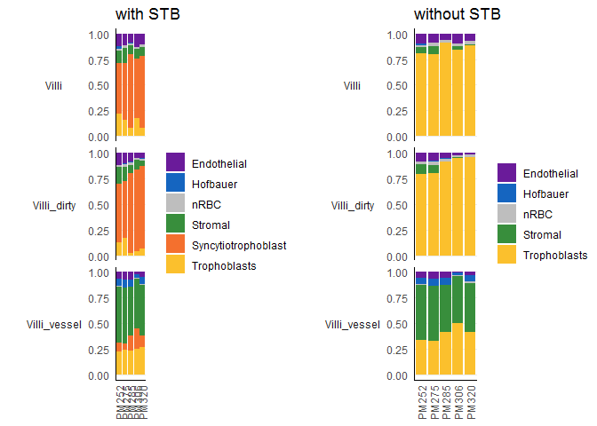
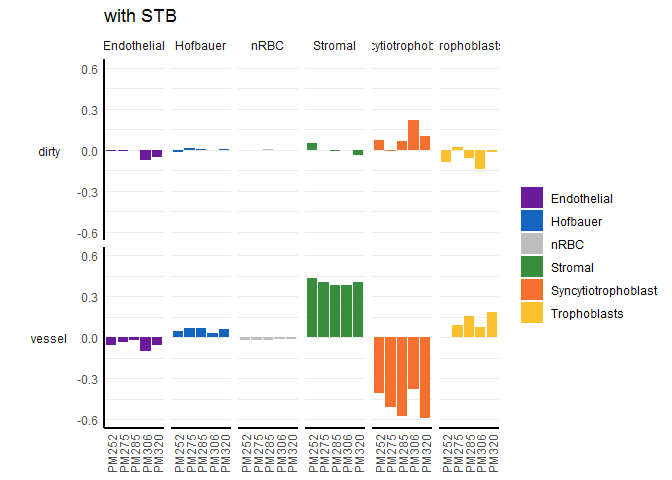
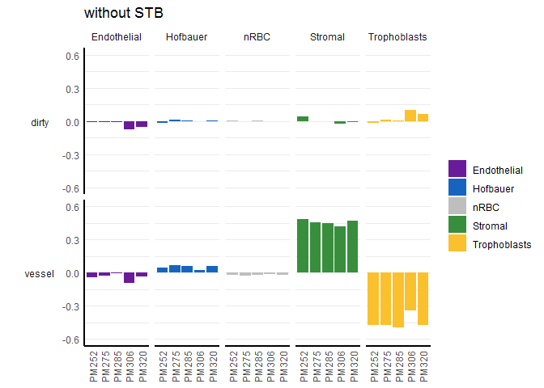
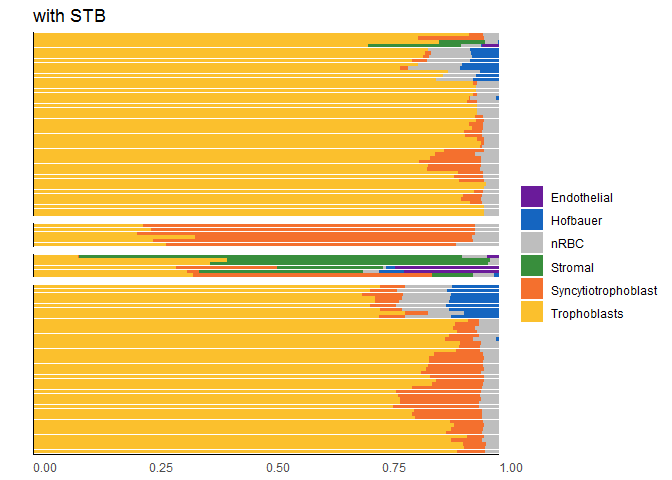
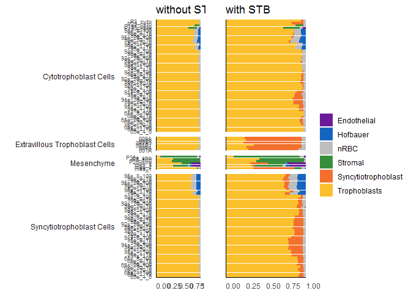

In response to reviewer's comments, I validate cell composition estimates on samples with expected altered cell composition.

# Setup

## Libraries


```r
# libraries and data
library(here)
library(minfi)
library(readxl)
library(wateRmelon)
library(planet)
library(EpiDISH)
library(tidyverse)
theme_set(theme_bw())
library(cowplot)
```

## Data


```r
base_path <- file.path('data', 'main', 'interim')

# pData
pDat <- readRDS(here(base_path, '2_3_pDat_contam.rds'))
pDat <- pDat %>%
  mutate(Tissue = case_when(
    !(Tissue %in% c('Villi', 'Villi maternal', 'Syncytiotrophoblast')) ~ paste(Tissue, 'cs'),
    Tissue == 'Syncytiotrophoblast' ~ 'Trophoblasts enz',
    TRUE ~ Tissue
  )) 

# raw methylation data
betas <- readRDS(here(base_path, '1_4_betas_noob_filt.rds'))

# annotation
anno <- readRDS('Z:/Victor/Repositories/EPIC_annotation/hg19_epic_annotation.rds')
anno <- anno %>%
  as_tibble() %>%
  filter(cpg %in% rownames(betas)) # filter to filtered betas cpgs

# probe filtered
probe_anno <- readRDS(here(base_path, '1_1_probe_anno.rds'))

# color key
color_code <- readRDS(here(base_path, '2_3_color_code.rds'))
color_code_tissue <- setNames(color_code$Colors_Tissue, gsub(' cs', '', color_code$label))
color_code_tissue <- c(color_code_tissue, 'nRBC' = 'grey')
color_code_tissue <- c(color_code_tissue, 'Syncytiotrophoblast' = '#f4702e')

#no stb coefficients
coefs_combined_third_nostb <-
  readRDS(here::here('data', 'main', 'processed', '2_14_coefs_combined_third_nostb.rds'))

coefs_combined_first_nostb <-
  readRDS(here::here('data', 'main', 'processed', '2_14_coefs_combined_first_nostb.rds'))
```

## Remove samples


```r
pDat_filt <- pDat %>% 
  filter(maternal_contamination_norm_flip < 0.35,
         !Sample_Name %in% c('PM364_hofb_cs', 'PL293_v_R2', 'PM366_vc_R2', 'P131_hofb_cs', 
                             'PM324_V4', 'PM324_V1', 'PM139_vc', 'PM77_vc'),
         !Tissue %in% c('Villi maternal', 'Trophoblasts enz', 'Mixture cs', 
                        'Dead Cells and Lymphocytes cs'),)

betas_filt <- betas[,pDat_filt$Sentrix]
colnames(betas_filt) <- pDat_filt$Sample_Name
```


# Load vessel


```r
#load samples
master_ss <- read_xlsx('Z:/ROBLAB6 InfiniumSequenom/Master_Sample_Sheet.xlsx')

vessel_ss <- master_ss %>% 
  group_by(Case_ID) %>%
  filter(any(grepl('(vessel)', Tissue))) %>%
  ungroup() %>%
  filter(grepl('Villi', Tissue))

rgset_vessel <- read.metharray.exp(targets = vessel_ss, verbose = TRUE)
```

```
## [read.metharray] Reading 100946200071_R06C01_Grn.idat
```

```
## [read.metharray] Reading 10005833024_R02C01_Grn.idat
```

```
## [read.metharray] Reading 10005833024_R04C02_Grn.idat
```

```
## [read.metharray] Reading 10005833024_R05C01_Grn.idat
```

```
## [read.metharray] Reading 10005833024_R05C02_Grn.idat
```

```
## [read.metharray] Reading 10005833037_R04C01_Grn.idat
```

```
## [read.metharray] Reading 10005833037_R06C02_Grn.idat
```

```
## [read.metharray] Reading 10005833038_R03C01_Grn.idat
```

```
## [read.metharray] Reading 10005833038_R05C01_Grn.idat
```

```
## [read.metharray] Reading 10005833110_R02C02_Grn.idat
```

```
## [read.metharray] Reading 10005833110_R03C02_Grn.idat
```

```
## [read.metharray] Reading 10005833110_R05C01_Grn.idat
```

```
## [read.metharray] Reading 9977525013_R01C02_Grn.idat
```

```
## [read.metharray] Reading 9977525013_R03C02_Grn.idat
```

```
## [read.metharray] Reading 9977525015_R02C02_Grn.idat
```

```
## [read.metharray] Reading 9977525015_R03C02_Grn.idat
```

```
## [read.metharray] Reading 9977525015_R05C01_Grn.idat
```

```
## [read.metharray] Reading 100946200071_R06C01_Red.idat
```

```
## [read.metharray] Reading 10005833024_R02C01_Red.idat
```

```
## [read.metharray] Reading 10005833024_R04C02_Red.idat
```

```
## [read.metharray] Reading 10005833024_R05C01_Red.idat
```

```
## [read.metharray] Reading 10005833024_R05C02_Red.idat
```

```
## [read.metharray] Reading 10005833037_R04C01_Red.idat
```

```
## [read.metharray] Reading 10005833037_R06C02_Red.idat
```

```
## [read.metharray] Reading 10005833038_R03C01_Red.idat
```

```
## [read.metharray] Reading 10005833038_R05C01_Red.idat
```

```
## [read.metharray] Reading 10005833110_R02C02_Red.idat
```

```
## [read.metharray] Reading 10005833110_R03C02_Red.idat
```

```
## [read.metharray] Reading 10005833110_R05C01_Red.idat
```

```
## [read.metharray] Reading 9977525013_R01C02_Red.idat
```

```
## [read.metharray] Reading 9977525013_R03C02_Red.idat
```

```
## [read.metharray] Reading 9977525015_R02C02_Red.idat
```

```
## [read.metharray] Reading 9977525015_R03C02_Red.idat
```

```
## [read.metharray] Reading 9977525015_R05C01_Red.idat
```

```
## [read.metharray] Read idat files in 13.5 seconds
```

```
## [read.metharray] Creating data matrices ... done in 15.4 seconds
## [read.metharray] Instantiating final object ... done in 0.1 seconds
```

```
## Warning: Setting row names on a tibble is deprecated.
```

```r
noob_vessel <- preprocessNoob(rgset_vessel)
```

```
## Loading required package: IlluminaHumanMethylation450kmanifest
```

```r
bmiq_vessel <- BMIQ(noob_vessel)
```

```
## Warning: package 'RPMM' was built under R version 3.6.3
```

```r
# estimate cell comp
epidish_RPC_vessel <- epidish(
  beta.m = bmiq_vessel[rownames(pl_cell_cpgs_third),],
  ref.m = pl_cell_cpgs_third,
  method = 'RPC')

epidish_RPC_vessel_nostb <- epidish(
  beta.m = bmiq_vessel[rownames(coefs_combined_third_nostb),],
  ref.m = coefs_combined_third_nostb,
  method = 'RPC')

# add to pdat
epidish_RPC_vessel <- epidish_RPC_vessel$estF %>% 
  as_tibble %>%
  mutate(Sentrix = rownames(epidish_RPC_vessel$estF))

epidish_RPC_vessel_nostb <- epidish_RPC_vessel_nostb$estF %>% 
  as_tibble %>%
  mutate(Sentrix = rownames(epidish_RPC_vessel_nostb$estF))

vessel_ss <- vessel_ss %>%
  mutate(Sentrix = paste0(Sentrix_ID, '_', Sentrix_Position)) %>%
  left_join(epidish_RPC_vessel, by = 'Sentrix')

epidish_RPC_vessel_nostb <-epidish_RPC_vessel_nostb %>%
  left_join(vessel_ss %>% select(Sentrix, Case_ID, Tissue))
```

```
## Joining, by = "Sentrix"
```

# Visualize vessel


```r
p1<- vessel_ss %>%
  dplyr::select(Sample_Name, Case_ID, Tissue, Trophoblasts:Syncytiotrophoblast)  %>%
  pivot_longer(cols = Trophoblasts:Syncytiotrophoblast,
               names_to = 'component',
               values_to = 'proportion') %>%
  group_by(Case_ID, Tissue, component) %>%
  summarize(proportion = mean(proportion)) %>%
  ggplot(aes(x = Case_ID, y = proportion, fill = component)) +
  geom_bar(stat = 'identity') +
  facet_grid(Tissue~., switch = 'y') +
  scale_fill_manual(values = color_code_tissue, na.value = 'grey') +
  theme(axis.text.x = element_text(angle = 90, hjust = 1, vjust = 0.5),
        axis.title.x = element_blank(),
        panel.border = element_blank(),
        axis.ticks = element_blank(),
        axis.line = element_line(),
        strip.background = element_blank(),
        strip.placement = 'outside',
        strip.text.y.left = element_text(angle = 0),
        panel.grid.major.x = element_blank(),
        panel.grid.minor.x = element_blank(),
        panel.grid.minor.y = element_blank()) +
  coord_cartesian(ylim = c(0,1)) +
  labs(x = '', y = '', fill = '', title = 'with STB')
```

```
## `summarise()` regrouping output by 'Case_ID', 'Tissue' (override with `.groups` argument)
```

```r
p2 <- epidish_RPC_vessel_nostb %>%
  pivot_longer(cols = Trophoblasts:nRBC,
               names_to = 'component',
               values_to = 'proportion') %>%
  group_by(Case_ID, Tissue, component) %>%
  summarize(proportion = mean(proportion)) %>%
  ggplot(aes(x = Case_ID, y = proportion, fill = component)) +
  geom_bar(stat = 'identity') +
  facet_grid(Tissue~., switch = 'y') +
  scale_fill_manual(values = color_code_tissue, na.value = 'grey') +
  theme(axis.text.x = element_text(angle = 90, hjust = 1, vjust = 0.5),
        axis.title.x = element_blank(),
        panel.border = element_blank(),
        axis.ticks = element_blank(),
        axis.line = element_line(),
        strip.background = element_blank(),
        strip.placement = 'outside',
        strip.text.y.left = element_text(angle = 0),
        panel.grid.major.x = element_blank(),
        panel.grid.minor.x = element_blank(),
        panel.grid.minor.y = element_blank()) +
  coord_cartesian(ylim = c(0,1)) +
  labs(x = '', y = '', fill = '', title = 'without STB')
```

```
## `summarise()` regrouping output by 'Case_ID', 'Tissue' (override with `.groups` argument)
```

```r
plot_grid(p1, p2)
```

<!-- -->

Vessel produces much more stromal cells and less trophoblasts.

Not much difference between dirty and villi.

Not much difference between with STB and without.

## Difference from villi


```r
vessel_ss %>%
  dplyr::select(Sample_Name, Case_ID, Tissue, Trophoblasts:Syncytiotrophoblast)  %>%
  pivot_longer(cols = Trophoblasts:Syncytiotrophoblast,
               names_to = 'component',
               values_to = 'proportion') %>%
  group_by(Case_ID, Tissue, component) %>%
  summarize(proportion = mean(proportion)) %>%
  ungroup() %>%
  pivot_wider(id_cols = -c(Tissue, proportion),
              names_from = 'Tissue',
              values_from = 'proportion') %>%
  mutate(dirty = Villi_dirty - Villi,
         vessel = Villi_vessel - Villi) %>%
  
  pivot_longer(cols = c(dirty, vessel),
               names_to = 'type',
               values_to = 'proportion') %>%
  
  ggplot(aes(x = Case_ID, y = proportion, fill = component)) +
  geom_bar(stat = 'identity') +
  facet_grid(type~component, switch = 'y') +
  scale_fill_manual(values = color_code_tissue, na.value = 'grey') +
  theme(axis.text.x = element_text(angle = 90, hjust = 1, vjust = 0.5),
        axis.title.x = element_blank(),
        panel.border = element_blank(),
        axis.ticks = element_blank(),
        axis.line = element_line(size = 1),
        strip.background = element_blank(),
        strip.placement = 'outside',
        strip.text.y.left = element_text(angle = 0),
        panel.grid.major.x = element_blank(),
        panel.grid.minor.x = element_blank()) +
  scale_y_continuous(limits = c(-0.6, 0.6)) +
  labs(x = '', y = '', fill = '', title = 'with STB')
```

```
## `summarise()` regrouping output by 'Case_ID', 'Tissue' (override with `.groups` argument)
```

<!-- -->

```r
epidish_RPC_vessel_nostb %>%
  dplyr::select(Case_ID, Tissue, Trophoblasts:nRBC)  %>%
  pivot_longer(cols = Trophoblasts:nRBC,
               names_to = 'component',
               values_to = 'proportion') %>%
  group_by(Case_ID, Tissue, component) %>%
  summarize(proportion = mean(proportion)) %>%
  ungroup() %>%
  pivot_wider(id_cols = -c(Tissue, proportion),
              names_from = 'Tissue',
              values_from = 'proportion') %>%
  mutate(dirty = Villi_dirty - Villi,
         vessel = Villi_vessel - Villi) %>%
  
  pivot_longer(cols = c(dirty, vessel),
               names_to = 'type',
               values_to = 'proportion') %>%
  
  ggplot(aes(x = Case_ID, y = proportion, fill = component)) +
  geom_bar(stat = 'identity') +
  facet_grid(type~component, switch = 'y') +
  scale_fill_manual(values = color_code_tissue, na.value = 'grey') +
  theme(axis.text.x = element_text(angle = 90, hjust = 1, vjust = 0.5),
        axis.title.x = element_blank(),
        panel.border = element_blank(),
        axis.ticks = element_blank(),
        axis.line = element_line(size = 1),
        strip.background = element_blank(),
        strip.placement = 'outside',
        strip.text.y.left = element_text(angle = 0),
        panel.grid.major.x = element_blank(),
        panel.grid.minor.x = element_blank()) +
  scale_y_continuous(limits = c(-0.6, 0.6)) +
  labs(x = '', y = '', fill = '', title = 'without STB')
```

```
## `summarise()` regrouping output by 'Case_ID', 'Tissue' (override with `.groups` argument)
```

<!-- -->

# other samples


```r
ss_other <- master_ss %>% 
  group_by(Case_ID) %>%
  filter(any(grepl('(Mesenchyme|Cyto)', Tissue))) %>%
  ungroup() %>%
  filter(!grepl(perl = TRUE,
                '(Maternal Blood|Buccal|Nucleated Red Blood Cells|Mono|T Cell|Cord)', Tissue),
         !is.na(Tissue),
         Tissue != 'Villi') 

rgset_other <- read.metharray.exp(targets = ss_other, verbose = TRUE)
```

```
## [read.metharray] Reading 9296930114_R01C02_Grn.idat
```

```
## [read.metharray] Reading 9296930114_R04C02_Grn.idat
```

```
## [read.metharray] Reading 9296930124_R01C02_Grn.idat
```

```
## [read.metharray] Reading 9296930155_R01C01_Grn.idat
```

```
## [read.metharray] Reading 9296930155_R01C02_Grn.idat
```

```
## [read.metharray] Reading 9296930155_R04C01_Grn.idat
```

```
## [read.metharray] Reading 9406922117_R05C02_Grn.idat
```

```
## [read.metharray] Reading 9285451020_R03C01_Grn.idat
```

```
## [read.metharray] Reading 9296930098_R03C02_Grn.idat
```

```
## [read.metharray] Reading 9296930123_R02C02_Grn.idat
```

```
## [read.metharray] Reading 6042308119_R01C01_Grn.idat
```

```
## [read.metharray] Reading 6042308119_R03C02_Grn.idat
```

```
## [read.metharray] Reading 6042308119_R05C01_Grn.idat
```

```
## [read.metharray] Reading 6042308139_R01C01_Grn.idat
```

```
## [read.metharray] Reading 6042308139_R01C02_Grn.idat
```

```
## [read.metharray] Reading 6042308139_R02C01_Grn.idat
```

```
## [read.metharray] Reading 6042308139_R02C02_Grn.idat
```

```
## [read.metharray] Reading 6042308139_R03C01_Grn.idat
```

```
## [read.metharray] Reading 6042308139_R03C02_Grn.idat
```

```
## [read.metharray] Reading 6042308139_R04C01_Grn.idat
```

```
## [read.metharray] Reading 6042308139_R04C02_Grn.idat
```

```
## [read.metharray] Reading 6042308139_R05C01_Grn.idat
```

```
## [read.metharray] Reading 6042308139_R05C02_Grn.idat
```

```
## [read.metharray] Reading 6042308139_R06C01_Grn.idat
```

```
## [read.metharray] Reading 6042308139_R06C02_Grn.idat
```

```
## [read.metharray] Reading 6042308141_R01C01_Grn.idat
```

```
## [read.metharray] Reading 6042308141_R01C02_Grn.idat
```

```
## [read.metharray] Reading 6042308141_R02C01_Grn.idat
```

```
## [read.metharray] Reading 6042308141_R02C02_Grn.idat
```

```
## [read.metharray] Reading 6042308141_R03C01_Grn.idat
```

```
## [read.metharray] Reading 6042308141_R03C02_Grn.idat
```

```
## [read.metharray] Reading 6042308141_R04C01_Grn.idat
```

```
## [read.metharray] Reading 6042308141_R04C02_Grn.idat
```

```
## [read.metharray] Reading 6042308141_R05C01_Grn.idat
```

```
## [read.metharray] Reading 6042308141_R05C02_Grn.idat
```

```
## [read.metharray] Reading 6042308141_R06C01_Grn.idat
```

```
## [read.metharray] Reading 6042308141_R06C02_Grn.idat
```

```
## [read.metharray] Reading 6042308143_R01C01_Grn.idat
```

```
## [read.metharray] Reading 6042308143_R03C02_Grn.idat
```

```
## [read.metharray] Reading 6042308143_R05C01_Grn.idat
```

```
## [read.metharray] Reading 6042324107_R01C01_Grn.idat
```

```
## [read.metharray] Reading 6042324107_R01C02_Grn.idat
```

```
## [read.metharray] Reading 6042324107_R02C01_Grn.idat
```

```
## [read.metharray] Reading 6042324107_R02C02_Grn.idat
```

```
## [read.metharray] Reading 6042324107_R03C01_Grn.idat
```

```
## [read.metharray] Reading 6042324107_R03C02_Grn.idat
```

```
## [read.metharray] Reading 6042324107_R04C01_Grn.idat
```

```
## [read.metharray] Reading 6042324107_R04C02_Grn.idat
```

```
## [read.metharray] Reading 6042324107_R05C01_Grn.idat
```

```
## [read.metharray] Reading 6042324107_R05C02_Grn.idat
```

```
## [read.metharray] Reading 6042324107_R06C01_Grn.idat
```

```
## [read.metharray] Reading 6042324107_R06C02_Grn.idat
```

```
## [read.metharray] Reading 6042324115_R01C01_Grn.idat
```

```
## [read.metharray] Reading 6042324115_R01C02_Grn.idat
```

```
## [read.metharray] Reading 6042324115_R02C01_Grn.idat
```

```
## [read.metharray] Reading 6042324115_R02C02_Grn.idat
```

```
## [read.metharray] Reading 6042324115_R03C01_Grn.idat
```

```
## [read.metharray] Reading 6042324115_R03C02_Grn.idat
```

```
## [read.metharray] Reading 6042324115_R04C01_Grn.idat
```

```
## [read.metharray] Reading 6042324115_R04C02_Grn.idat
```

```
## [read.metharray] Reading 6042324115_R05C01_Grn.idat
```

```
## [read.metharray] Reading 6042324115_R05C02_Grn.idat
```

```
## [read.metharray] Reading 6042324115_R06C01_Grn.idat
```

```
## [read.metharray] Reading 6042324115_R06C02_Grn.idat
```

```
## [read.metharray] Reading 6042324118_R01C01_Grn.idat
```

```
## [read.metharray] Reading 6042324118_R01C02_Grn.idat
```

```
## [read.metharray] Reading 6042324118_R02C01_Grn.idat
```

```
## [read.metharray] Reading 6042324118_R02C02_Grn.idat
```

```
## [read.metharray] Reading 6042324118_R03C01_Grn.idat
```

```
## [read.metharray] Reading 6042324118_R03C02_Grn.idat
```

```
## [read.metharray] Reading 6042324118_R04C01_Grn.idat
```

```
## [read.metharray] Reading 6042324118_R04C02_Grn.idat
```

```
## [read.metharray] Reading 6042324118_R05C01_Grn.idat
```

```
## [read.metharray] Reading 6042324118_R05C02_Grn.idat
```

```
## [read.metharray] Reading 6042324118_R06C01_Grn.idat
```

```
## [read.metharray] Reading 6042324118_R06C02_Grn.idat
```

```
## [read.metharray] Reading 6042324125_R01C01_Grn.idat
```

```
## [read.metharray] Reading 6042324125_R01C02_Grn.idat
```

```
## [read.metharray] Reading 6042324125_R02C01_Grn.idat
```

```
## [read.metharray] Reading 6042324125_R02C02_Grn.idat
```

```
## [read.metharray] Reading 6042324125_R03C01_Grn.idat
```

```
## [read.metharray] Reading 6042324125_R03C02_Grn.idat
```

```
## [read.metharray] Reading 6042324125_R04C01_Grn.idat
```

```
## [read.metharray] Reading 6042324125_R05C01_Grn.idat
```

```
## [read.metharray] Reading 6042324125_R06C01_Grn.idat
```

```
## [read.metharray] Reading 6042324128_R01C01_Grn.idat
```

```
## [read.metharray] Reading 6042324128_R01C02_Grn.idat
```

```
## [read.metharray] Reading 6042324128_R02C01_Grn.idat
```

```
## [read.metharray] Reading 6042324128_R02C02_Grn.idat
```

```
## [read.metharray] Reading 6042324128_R03C01_Grn.idat
```

```
## [read.metharray] Reading 6042324128_R03C02_Grn.idat
```

```
## [read.metharray] Reading 6042324128_R04C01_Grn.idat
```

```
## [read.metharray] Reading 6042324128_R04C02_Grn.idat
```

```
## [read.metharray] Reading 6042324128_R05C01_Grn.idat
```

```
## [read.metharray] Reading 6042324128_R05C02_Grn.idat
```

```
## [read.metharray] Reading 6042324128_R06C01_Grn.idat
```

```
## [read.metharray] Reading 6042324128_R06C02_Grn.idat
```

```
## [read.metharray] Reading 6042324158_R01C01_Grn.idat
```

```
## [read.metharray] Reading 6042324158_R01C02_Grn.idat
```

```
## [read.metharray] Reading 6042324158_R02C01_Grn.idat
```

```
## [read.metharray] Reading 6042324158_R02C02_Grn.idat
```

```
## [read.metharray] Reading 6042324158_R03C01_Grn.idat
```

```
## [read.metharray] Reading 6042324158_R03C02_Grn.idat
```

```
## [read.metharray] Reading 6042324158_R04C01_Grn.idat
```

```
## [read.metharray] Reading 6042324158_R05C01_Grn.idat
```

```
## [read.metharray] Reading 6042324158_R06C01_Grn.idat
```

```
## [read.metharray] Reading 9296930114_R01C02_Red.idat
```

```
## [read.metharray] Reading 9296930114_R04C02_Red.idat
```

```
## [read.metharray] Reading 9296930124_R01C02_Red.idat
```

```
## [read.metharray] Reading 9296930155_R01C01_Red.idat
```

```
## [read.metharray] Reading 9296930155_R01C02_Red.idat
```

```
## [read.metharray] Reading 9296930155_R04C01_Red.idat
```

```
## [read.metharray] Reading 9406922117_R05C02_Red.idat
```

```
## [read.metharray] Reading 9285451020_R03C01_Red.idat
```

```
## [read.metharray] Reading 9296930098_R03C02_Red.idat
```

```
## [read.metharray] Reading 9296930123_R02C02_Red.idat
```

```
## [read.metharray] Reading 6042308119_R01C01_Red.idat
```

```
## [read.metharray] Reading 6042308119_R03C02_Red.idat
```

```
## [read.metharray] Reading 6042308119_R05C01_Red.idat
```

```
## [read.metharray] Reading 6042308139_R01C01_Red.idat
```

```
## [read.metharray] Reading 6042308139_R01C02_Red.idat
```

```
## [read.metharray] Reading 6042308139_R02C01_Red.idat
```

```
## [read.metharray] Reading 6042308139_R02C02_Red.idat
```

```
## [read.metharray] Reading 6042308139_R03C01_Red.idat
```

```
## [read.metharray] Reading 6042308139_R03C02_Red.idat
```

```
## [read.metharray] Reading 6042308139_R04C01_Red.idat
```

```
## [read.metharray] Reading 6042308139_R04C02_Red.idat
```

```
## [read.metharray] Reading 6042308139_R05C01_Red.idat
```

```
## [read.metharray] Reading 6042308139_R05C02_Red.idat
```

```
## [read.metharray] Reading 6042308139_R06C01_Red.idat
```

```
## [read.metharray] Reading 6042308139_R06C02_Red.idat
```

```
## [read.metharray] Reading 6042308141_R01C01_Red.idat
```

```
## [read.metharray] Reading 6042308141_R01C02_Red.idat
```

```
## [read.metharray] Reading 6042308141_R02C01_Red.idat
```

```
## [read.metharray] Reading 6042308141_R02C02_Red.idat
```

```
## [read.metharray] Reading 6042308141_R03C01_Red.idat
```

```
## [read.metharray] Reading 6042308141_R03C02_Red.idat
```

```
## [read.metharray] Reading 6042308141_R04C01_Red.idat
```

```
## [read.metharray] Reading 6042308141_R04C02_Red.idat
```

```
## [read.metharray] Reading 6042308141_R05C01_Red.idat
```

```
## [read.metharray] Reading 6042308141_R05C02_Red.idat
```

```
## [read.metharray] Reading 6042308141_R06C01_Red.idat
```

```
## [read.metharray] Reading 6042308141_R06C02_Red.idat
```

```
## [read.metharray] Reading 6042308143_R01C01_Red.idat
```

```
## [read.metharray] Reading 6042308143_R03C02_Red.idat
```

```
## [read.metharray] Reading 6042308143_R05C01_Red.idat
```

```
## [read.metharray] Reading 6042324107_R01C01_Red.idat
```

```
## [read.metharray] Reading 6042324107_R01C02_Red.idat
```

```
## [read.metharray] Reading 6042324107_R02C01_Red.idat
```

```
## [read.metharray] Reading 6042324107_R02C02_Red.idat
```

```
## [read.metharray] Reading 6042324107_R03C01_Red.idat
```

```
## [read.metharray] Reading 6042324107_R03C02_Red.idat
```

```
## [read.metharray] Reading 6042324107_R04C01_Red.idat
```

```
## [read.metharray] Reading 6042324107_R04C02_Red.idat
```

```
## [read.metharray] Reading 6042324107_R05C01_Red.idat
```

```
## [read.metharray] Reading 6042324107_R05C02_Red.idat
```

```
## [read.metharray] Reading 6042324107_R06C01_Red.idat
```

```
## [read.metharray] Reading 6042324107_R06C02_Red.idat
```

```
## [read.metharray] Reading 6042324115_R01C01_Red.idat
```

```
## [read.metharray] Reading 6042324115_R01C02_Red.idat
```

```
## [read.metharray] Reading 6042324115_R02C01_Red.idat
```

```
## [read.metharray] Reading 6042324115_R02C02_Red.idat
```

```
## [read.metharray] Reading 6042324115_R03C01_Red.idat
```

```
## [read.metharray] Reading 6042324115_R03C02_Red.idat
```

```
## [read.metharray] Reading 6042324115_R04C01_Red.idat
```

```
## [read.metharray] Reading 6042324115_R04C02_Red.idat
```

```
## [read.metharray] Reading 6042324115_R05C01_Red.idat
```

```
## [read.metharray] Reading 6042324115_R05C02_Red.idat
```

```
## [read.metharray] Reading 6042324115_R06C01_Red.idat
```

```
## [read.metharray] Reading 6042324115_R06C02_Red.idat
```

```
## [read.metharray] Reading 6042324118_R01C01_Red.idat
```

```
## [read.metharray] Reading 6042324118_R01C02_Red.idat
```

```
## [read.metharray] Reading 6042324118_R02C01_Red.idat
```

```
## [read.metharray] Reading 6042324118_R02C02_Red.idat
```

```
## [read.metharray] Reading 6042324118_R03C01_Red.idat
```

```
## [read.metharray] Reading 6042324118_R03C02_Red.idat
```

```
## [read.metharray] Reading 6042324118_R04C01_Red.idat
```

```
## [read.metharray] Reading 6042324118_R04C02_Red.idat
```

```
## [read.metharray] Reading 6042324118_R05C01_Red.idat
```

```
## [read.metharray] Reading 6042324118_R05C02_Red.idat
```

```
## [read.metharray] Reading 6042324118_R06C01_Red.idat
```

```
## [read.metharray] Reading 6042324118_R06C02_Red.idat
```

```
## [read.metharray] Reading 6042324125_R01C01_Red.idat
```

```
## [read.metharray] Reading 6042324125_R01C02_Red.idat
```

```
## [read.metharray] Reading 6042324125_R02C01_Red.idat
```

```
## [read.metharray] Reading 6042324125_R02C02_Red.idat
```

```
## [read.metharray] Reading 6042324125_R03C01_Red.idat
```

```
## [read.metharray] Reading 6042324125_R03C02_Red.idat
```

```
## [read.metharray] Reading 6042324125_R04C01_Red.idat
```

```
## [read.metharray] Reading 6042324125_R05C01_Red.idat
```

```
## [read.metharray] Reading 6042324125_R06C01_Red.idat
```

```
## [read.metharray] Reading 6042324128_R01C01_Red.idat
```

```
## [read.metharray] Reading 6042324128_R01C02_Red.idat
```

```
## [read.metharray] Reading 6042324128_R02C01_Red.idat
```

```
## [read.metharray] Reading 6042324128_R02C02_Red.idat
```

```
## [read.metharray] Reading 6042324128_R03C01_Red.idat
```

```
## [read.metharray] Reading 6042324128_R03C02_Red.idat
```

```
## [read.metharray] Reading 6042324128_R04C01_Red.idat
```

```
## [read.metharray] Reading 6042324128_R04C02_Red.idat
```

```
## [read.metharray] Reading 6042324128_R05C01_Red.idat
```

```
## [read.metharray] Reading 6042324128_R05C02_Red.idat
```

```
## [read.metharray] Reading 6042324128_R06C01_Red.idat
```

```
## [read.metharray] Reading 6042324128_R06C02_Red.idat
```

```
## [read.metharray] Reading 6042324158_R01C01_Red.idat
```

```
## [read.metharray] Reading 6042324158_R01C02_Red.idat
```

```
## [read.metharray] Reading 6042324158_R02C01_Red.idat
```

```
## [read.metharray] Reading 6042324158_R02C02_Red.idat
```

```
## [read.metharray] Reading 6042324158_R03C01_Red.idat
```

```
## [read.metharray] Reading 6042324158_R03C02_Red.idat
```

```
## [read.metharray] Reading 6042324158_R04C01_Red.idat
```

```
## [read.metharray] Reading 6042324158_R05C01_Red.idat
```

```
## [read.metharray] Reading 6042324158_R06C01_Red.idat
```

```
## [read.metharray] Read idat files in 92.4 seconds
```

```
## [read.metharray] Creating data matrices ... done in 125.1 seconds
## [read.metharray] Instantiating final object ... done in 0.1 seconds
```

```
## Warning: Setting row names on a tibble is deprecated.
```

```r
noob_other <- preprocessNoob(rgset_other)
bmiq_other <- BMIQ(noob_other)

# estimate cell comp
epidish_RPC_other <- epidish(
  beta.m = bmiq_other[rownames(pl_cell_cpgs_third),],
  ref.m = pl_cell_cpgs_third,
  method = 'RPC')

epidish_RPC_other_nostb <- epidish(
  beta.m = bmiq_other[rownames(coefs_combined_third_nostb),],
  ref.m = coefs_combined_third_nostb,
  method = 'RPC')

# add to pdat
epidish_RPC_other <- epidish_RPC_other$estF %>% 
  as_tibble %>%
  mutate(Sentrix = rownames(epidish_RPC_other$estF))

epidish_RPC_other_nostb <- epidish_RPC_other_nostb$estF %>% 
  as_tibble %>%
  mutate(Sentrix = rownames(epidish_RPC_other_nostb$estF))

epidish_RPC_other <-epidish_RPC_other %>%
  left_join(ss_other %>% 
              mutate(Sentrix = paste0(Sentrix_ID, '_', Sentrix_Position)) %>%
              select(Sentrix, Sample_Name, Case_ID, Tissue))
```

```
## Joining, by = "Sentrix"
```

```r
epidish_RPC_other_nostb <-epidish_RPC_other_nostb %>%
  left_join(ss_other %>% 
              mutate(Sentrix = paste0(Sentrix_ID, '_', Sentrix_Position)) %>%
              select(Sentrix, Sample_Name, Case_ID, Tissue))
```

```
## Joining, by = "Sentrix"
```


```r
p3<- epidish_RPC_other %>%
   pivot_longer(cols = Trophoblasts:Syncytiotrophoblast,
               names_to = 'component',
               values_to = 'proportion') %>%
  ggplot(aes(x = Sample_Name, y = proportion, fill = component)) +
  geom_bar(stat = 'identity') +
  facet_grid(Tissue~., switch = 'y', scales = 'free_y', space = 'free') +
  scale_fill_manual(values = color_code_tissue, na.value = 'grey') +
  theme(axis.text.x = element_text(angle = 0, hjust = 0, vjust = 0.5),
        axis.text.y = element_blank(),
        axis.title.x = element_blank(),
        panel.border = element_blank(),
        axis.ticks = element_blank(),
        axis.line = element_line(),
        strip.background = element_blank(),
        strip.placement = 'outside',
        strip.text.y.left = element_blank(),
        panel.grid.major.x = element_blank(),
        panel.grid.minor.x = element_blank(),
        panel.grid.minor.y = element_blank()) +
  scale_y_continuous(expand = c(0,0)) +
  coord_flip() +
  labs(x = '', y = '', fill = '', title = 'with STB');p3
```

<!-- -->

```r
p4 <- epidish_RPC_other_nostb %>%
  pivot_longer(cols = Trophoblasts:nRBC,
               names_to = 'component',
               values_to = 'proportion') %>%
  ggplot(aes(x = Sample_Name, y = proportion, fill = component)) +
  geom_bar(stat = 'identity') +
  facet_grid(Tissue~., switch = 'y', scales = 'free_y', space = 'free') +
  scale_fill_manual(values = color_code_tissue, na.value = 'grey') +
  theme(axis.text.x = element_text(angle = 0, hjust = 0, vjust = 0.5),
        axis.text.y = element_text(size = 7),
        axis.title.x = element_blank(),
        panel.border = element_blank(),
        axis.ticks = element_blank(),
        axis.line = element_line(),
        strip.background = element_blank(),
        strip.placement = 'outside',
        strip.text.y.left = element_text(angle = 0, hjust = 1),
        panel.grid.major.x = element_blank(),
        panel.grid.minor.x = element_blank(),
        panel.grid.minor.y = element_blank(),
        legend.position = '') +
  scale_y_continuous(expand = c(0,0)) +
  coord_flip() +
  labs(x = '', y = '', fill = '', title = 'without STB')

plot_grid(p4, p3, ncol = 2)
```

<!-- -->
