This is part 2 of the term analysis.

In part 1, 21_Term.Rmd, I found a 4 contaminated samples. Here I reproduce
some of plots without contaminated samples, and continue with linear modelling analysis.

# Setup

## Load libraries and data


```r
# libraries and data
library(ggplot2)
library(tidyverse)
library(ggrepel)
library(viridis)
library(scales)
library(RColorBrewer)
library(pheatmap)
library(irlba)
library(yahew) # 0.1.1 github/wvictor14/yahew
library(GGally)
library(cowplot)
library(umap)
library(dendextend)
library(stringr)
library(minfi)
library(limma)
library(biobroom)
library(missMethyl)
library(ggridges)
library(UpSetR)
library(egg)
```

## Data

Here I call 'syncytiotrophoblasts' into 'Trophoblasts enz' and add 'cs' suffixes to the cell sorted
samples.


```r
# pdata
pDat_term  <- readRDS('../../data/main/interim/1_6_pDat.rds')
pDat_term <- pDat_term %>% 
  mutate(Tissue = case_when(
    Tissue %in% c('Endothelial', 'Hofbauer', 'Stromal', 'Trophoblasts') ~ paste(Tissue, 'cs'),
    Tissue == 'Syncytiotrophoblast' ~ 'Trophoblasts enz',
    TRUE ~ Tissue
  )) %>%
  
  # REMOVE CONTAMINED HOFBAUER SAMPLES
  filter(!Sample_Name %in% c('PM364_hofb_cs', 'PM381_hofb_cs', 'PM366_hofb_cs'))

# methylation data
betas <- readRDS('../../data/main/interim/1_4_betas_noob_filt.rds')
betas_term <- betas[,pDat_term$Sentrix]
colnames(betas_term) <- pDat_term$Sample_Name

# get m values and filter to term samples
mset_noob <- readRDS('../../data/main/interim/1_4_mset_noob.rds')
mvals_term <- getM(mset_noob)
colnames(mvals_term) <- pData(mset_noob)$Sample_Name
mvals_term <- mvals_term[rownames(betas_term),pDat_term$Sample_Name]

# probe annotation
probe_anno <- readRDS('../../data/main/interim/1_1_probe_anno.rds')

# snp data
snp_betas <- readRDS('../../data/main/interim/1_1_snp_betas.rds')

# annotation
anno <- getAnnotation(readRDS('../../data/main/interim/0_1_rgset_raw.rds'))
```

```
## Loading required package: IlluminaHumanMethylationEPICanno.ilm10b4.hg19
```

```r
# filter to filtered betas cpgs
anno <- anno %>%
  as_tibble() %>%
  filter(Name %in% rownames(betas_term))

# color key
color_code <- readRDS('../../data/main/interim/1_1_color_code.rds')
color_code[[1]] <- color_code[[1]]  %>%
  mutate(Tissue = case_when(Tissue %in% c('Endothelial', 'Hofbauer', 'Stromal', 'Trophoblasts', 
                                          'Dead Cells and Lymphocytes') ~ paste(Tissue, 'cs'),
                                          Tissue == 'Syncytiotrophoblast' ~ 'Trophoblasts enz',
                                          TRUE ~ Tissue),
         Colors_Tissue = ifelse(Tissue == 'Villi', '#911515', 
                                ifelse(Tissue == 'Villi maternal', '#e072d7', Colors_Tissue)))
color_code
```

```
## [[1]]
## # A tibble: 9 x 2
##   Tissue                        Colors_Tissue
##   <chr>                         <chr>        
## 1 Dead Cells and Lymphocytes cs #424242      
## 2 Endothelial cs                #6A1B9A      
## 3 Hofbauer cs                   #1565C0      
## 4 Mixture                       #546E7A      
## 5 Stromal cs                    #388E3C      
## 6 Trophoblasts enz              #E64A19      
## 7 Trophoblasts cs               #FBC02D      
## 8 Villi                         #911515      
## 9 Villi maternal                #e072d7      
## 
## [[2]]
## # A tibble: 2 x 2
##   Sex   Colors_Sex
##   <chr> <chr>     
## 1 F     #F8BBD0   
## 2 M     #BBDEFB   
## 
## [[3]]
## # A tibble: 3 x 2
##   Trimester Colors_Trimester
##   <chr>     <chr>           
## 1 First     #E0E0E0         
## 2 Second    #616161         
## 3 Third     #212121
```

```r
color_code_tissue <- setNames(color_code[[1]]$Colors_Tissue, color_code[[1]]$Tissue)

# correlation data 
cor_data <- readRDS('../../data/main/interim/2_1_pheatmap_data.rds')
```

# 1.0 FACS markers

Cell stains used:

7-AAD – Live Stain
CD235a – Red Blood Cells (Gate out)
CD45+/CD14+ – Hofbauer Cells
CD34+ – Endothelial
EGFR+ – Trophoblasts
All negative for markers – Stromal


### EGFR - trophoblast


```r
# filter to EGFR
anno_EGFR <- anno %>%filter(grepl('NM_201284', UCSC_RefGene_Accession)) %>%
  arrange(pos)

# subset EGFR cpgs in data
betas_EGFR <- t(betas_term[anno_EGFR$Name,]) %>% as_tibble %>% 
  mutate(Sample_Name = colnames(betas_term)) %>%
  
  # melt/gather
  gather(key = 'CpG', value = 'beta', -Sample_Name)  %>%
  
  # add tissue info
  left_join(pDat_term %>% select(Sample_Name, Tissue)) %>%
  
  # add cpg coords
  left_join(anno_EGFR %>% select(Name, pos, UCSC_RefGene_Group), by = c('CpG' = 'Name')) %>%
  mutate(gene_element = str_extract(UCSC_RefGene_Group, "^[A-z0-9\\']+")) %>%
  
  # calculate median tissue value
  group_by(Tissue, CpG) %>%
  mutate(beta_med = median(beta)) %>%
  
  # order on cpg position
  ungroup() %>%
  arrange(pos) %>%
  mutate(CpG = factor(CpG, levels = unique(CpG)),
         
         # create an annotation column          
         Annotation_gene_element = 'Gene_element',
         
         # ExonBnd should be body
         gene_element = ifelse(gene_element == 'ExonBnd', 'Body', gene_element) )%>%
  mutate(gene_element = factor(as.character(gene_element), levels = c("TSS1500", "5'UTR", "Body", "3'UTR"))) 
```

```
## Joining, by = "Sample_Name"
```

```r
#plot
# bar plot
betas_EGFR %>%
  mutate(y = 0) %>%
  ggplot() +
  geom_segment(aes(x = pos, xend = pos, y = y, yend  = beta_med, col = gene_element)) +
  scale_y_continuous(limits = c(0,1), breaks = c(0,0.5,1)) +
  theme_bw() +
  facet_wrap(~Tissue, ncol = 1, strip.position = 'right')
```

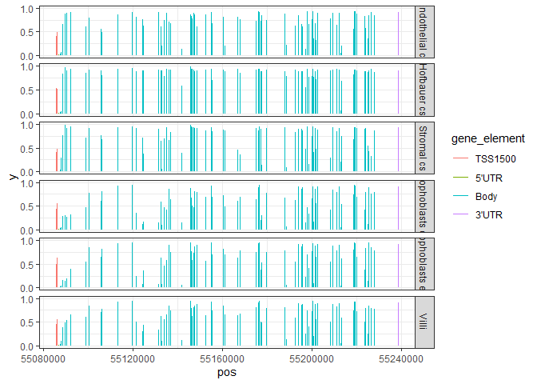<!-- -->

```r
# line plot
colors <- color_code_tissue[unique(pDat_term$Tissue)]
colors[c('Endothelial cs', 'Hofbauer cs', 'Stromal cs')] <- 'Grey'
ggplot(betas_EGFR, aes(x = pos, y = beta_med, color = Tissue)) +
  geom_point() + theme_bw() +
  scale_y_continuous(limits = c(0,1), breaks = c(0,0.5,1)) +
  scale_color_manual(values= colors) +
  geom_smooth()
```

```
## `geom_smooth()` using method = 'gam' and formula 'y ~ s(x, bs = "cs")'
```

```
## Warning: Removed 4 rows containing missing values (geom_smooth).
```

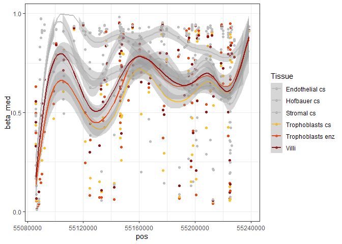<!-- -->

```r
p1 <- betas_EGFR %>%
  ggplot(aes(x = CpG, y = Tissue, fill = beta_med)) +
  geom_tile() +
  scale_fill_viridis(breaks = c(0, 0.5, 1), limits = c(0,1)) + coord_equal() +
  theme(axis.text.x = element_blank(), axis.ticks.x = element_blank()) +
  labs(fill = '% methylation', y = '', x= '', title = 'EGFR cpgs')

p2 <- betas_EGFR %>%
  ggplot(aes(x = CpG, y = Annotation_gene_element, fill = gene_element)) +
  geom_tile() +
  coord_equal() +
  theme(axis.text.x = element_blank(), axis.ticks.x = element_blank()) +
  labs(fill = '', y = '', x = 'CpG') +
  scale_fill_brewer(palette = 'Set2')

egg::ggarrange(p1, p2, ncol = 1)
```

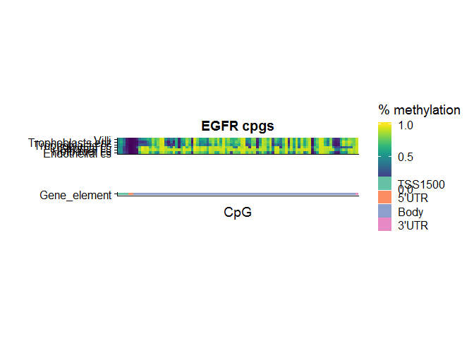<!-- -->

### CD14+


```r
# filter to EGFR
anno_CD14 <- anno %>%filter(grepl('NM_000591', UCSC_RefGene_Accession)) %>%
  arrange(pos)

# subset EGFR cpgs in data
betas_CD14 <- t(betas_term[anno_CD14$Name,]) %>% as_tibble %>% 
  mutate(Sample_Name = colnames(betas_term)) %>%
  
  # melt/gather
  gather(key = 'CpG', value = 'beta', -Sample_Name)  %>%
  
  # add tissue info
  left_join(pDat_term %>% select(Sample_Name, Tissue)) %>%
  
  # add cpg coords
  left_join(anno_CD14 %>% select(Name, pos, UCSC_RefGene_Group), by = c('CpG' = 'Name')) %>%
  mutate(gene_element = str_extract(UCSC_RefGene_Group, "^[A-z0-9\\']+")) %>%
  mutate(gene_element = factor(gene_element, levels = c('TSS1500', "1stExon", "Body", "3'UTR"))) %>%
  
  # calculate median tissue value
  group_by(Tissue, CpG) %>%
  mutate(beta_med = median(beta)) %>%
  
  # order on cpg position
  ungroup() %>%
  arrange(desc(pos)) %>%
  mutate(CpG = factor(CpG, levels = unique(CpG)),
         
         # create an annotation column          
         Annotation_gene_element = 'Gene_element')
```

```
## Joining, by = "Sample_Name"
```

```r
p3 <- betas_CD14 %>%
  ggplot(aes(x = CpG, y = Tissue, fill = beta_med)) +
  geom_tile() +
  scale_fill_viridis(breaks = c(0, 0.5, 1), limits = c(0,1)) +
  coord_equal() +
  theme(axis.text.x = element_blank(), axis.ticks.x = element_blank()) +
  labs(fill = '% methylation', y = '', x= '', title = 'CD14 cpgs')

p4 <- betas_CD14 %>%
  ggplot(aes(x = CpG, y = Annotation_gene_element, fill = gene_element)) +
  geom_tile() +
  coord_equal() +
  theme(axis.text.x = element_blank(), axis.ticks.x = element_blank()) +
  labs(fill = '', y = '', x = 'CpG') +
  scale_fill_brewer(palette = 'Set2')

egg::ggarrange(p3, p4, ncol = 1)
```

<!-- -->

### CD34


```r
# filter to EGFR
anno_CD34 <- anno %>%filter(grepl('NM_001773', UCSC_RefGene_Accession)) %>%
  arrange(pos)

# subset EGFR cpgs in data
betas_CD34 <- t(betas_term[anno_CD34$Name,]) %>% as_tibble %>% 
  mutate(Sample_Name = colnames(betas_term)) %>%
  
  # melt/gather
  gather(key = 'CpG', value = 'beta', -Sample_Name)  %>%
  
  # add tissue info
  left_join(pDat_term %>% select(Sample_Name, Tissue)) %>%
  
  # add cpg coords
  left_join(anno_CD34 %>% select(Name, pos, UCSC_RefGene_Group), by = c('CpG' = 'Name')) %>%
  mutate(gene_element = str_extract(UCSC_RefGene_Group, "^[A-z0-9\\']+")) %>%
  
  # calculate median tissue value
  group_by(Tissue, CpG) %>%
  mutate(beta_med = median(beta)) %>%
  
  # order on cpg position
  ungroup() %>%
  arrange(desc(pos)) %>%
  mutate(CpG = factor(CpG, levels = unique(CpG)),
         
         # create an annotation column          
         Annotation_gene_element = 'Gene_element',
         
         # ExonBnd should be body
         gene_element = ifelse(gene_element == '1stExon', "5'UTR", 
                               ifelse(gene_element == 'ExonBnd', 'Body', gene_element))) %>%
  # change factor level ordering for plot
  mutate(gene_element = factor(gene_element, levels = c("TSS1500", "TSS200", "5'UTR", "Body", "3'UTR"))) 
```

```
## Joining, by = "Sample_Name"
```

```r
p5 <- betas_CD34 %>%
  ggplot(aes(x = CpG, y = Tissue, fill = beta_med)) +
  geom_tile() +
  scale_fill_viridis(breaks = c(0, 0.5, 1), limits = c(0,1)) +
  coord_equal() +
  theme(axis.text.x = element_blank(), axis.ticks.x = element_blank()) +
  labs(fill = '% methylation', y = '', x= '', title = 'CD34 cpgs')

p6 <- betas_CD34 %>%
  ggplot(aes(x = CpG, y = Annotation_gene_element, fill = gene_element)) +
  geom_tile() +
  coord_equal() +
  theme(axis.text.x = element_blank(), axis.ticks.x = element_blank()) +
  labs(fill = '', y = '', x = 'CpG') +
  scale_fill_brewer(palette = 'Set2')

egg::ggarrange(p5, p6, ncol = 1)
```

<!-- -->

# 2.0 Global methylation

## Density distributions

Here we plot the density distributions of the betas across each tissue


```r
# pull out sample names for each tissue
list <- list()
for (i in unique(pDat_term$Tissue)) {
  list[[i]] <- pDat_term %>% filter(Tissue == i) %>% pull(Sample_Name)
}

# for each tissue estimate the density
densities <- tibble(Tissue = names(list),
       betas = lapply(list, function(x) as.vector(betas_term[,x]))) %>%
  mutate(densities = map(betas, ~ density(.))) %>%
  
   # pull out x and y coordinates
  mutate(x = map(densities, 'x'),
         y = map(densities, 'y')) %>%

  # remove input data, and unnest
  select(-betas, -densities) %>%
  unnest()

# plot
ggplot(densities, 
       aes(x = x, y = y, color = Tissue)) +
  geom_line(size = 2, alpha = 0.5) + theme_bw() +
  scale_x_continuous(breaks = c(0, 0.25, 0.5, 0.75, 1)) +#facet_wrap(~Tissue) +
  scale_color_manual(values= color_code_tissue[unique(pDat_term$Tissue)])
```

<!-- -->

Density for each sample:


```r
sample_densities <- pDat_term %>%
  select(Sample_Name, Tissue) %>%
  mutate(densities = apply(betas_term, 2, density)) %>%
  mutate(x = map(densities, 'x'),
         y = map(densities, 'y')) %>%
  select(-densities) %>%
  unnest()

ggplot(sample_densities, aes(x = x, y = y, color = Tissue, group = Sample_Name)) +
  geom_line(size = 1, alpha = 0.5) + theme_bw() +
  scale_x_continuous(breaks = c(0, 0.25, 0.5, 0.75, 1), labels = c(0, 25, 50, 75, 100))  +
  facet_wrap(~Tissue) +
  scale_color_manual(values = color_code_tissue[unique(pDat_term$Tissue)]) +
  geom_text_repel(data = sample_densities %>% 
                    filter(Sample_Name == 'PM364_hofb_cs', x > 0.55, x < 0.6) %>%
                    dplyr::slice(1),
                  aes(x = x, y = y, label = Sample_Name), inherit.aes = F,
                  nudge_y = 1, nudge_x = -0.1) +
  labs(x = '% methylation', y = 'density')
```

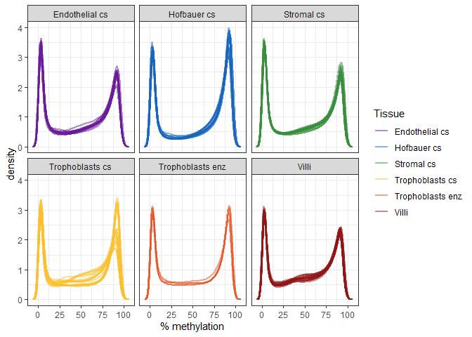<!-- -->

TODO:: Apply mixture modelling to determine hyper, hypomethylated, and hemi-methylated CpGs. Compare
number of CpGs falling to each distribution. 3 component mixture: 2 beta distributions and one 
uniform

## PCA


```r
# compute pca
set.seed(1)
pca <- prcomp_irlba(t(betas_term), n = 20, center = T, scale = F)

# add pc scores to pdata
pca_scores <- pca$x[,1:20] %>% as.data.frame()
colnames(pca_scores) <- paste0(colnames(pca_scores), '_processed')
pDat_term <- pDat_term %>% 
  select(-contains('processed')) %>%
  bind_cols(pca_scores)

# create proportion variance explained data frame
pc_info <- summary(pca)$importance %>% 
  as.data.frame() %>% 
  tibble::rownames_to_column(var = 'variable') %>%
  gather(key = 'PC', value = 'value', -variable) %>%
  as_tibble() %>%
  mutate(PC = factor(as.character(PC), levels = paste0('PC', 1:20)),
         Label = ifelse(variable == 'Proportion of Variance',
                        paste0(PC, ' (', prettyNum(value*100, digits = 2), '%)'),
                        as.character(PC))) %>%
  arrange(variable, PC)

  
# correlate PCs with phenodata
pc_cor <- lmmatrix(dep = pca$x[,1:20, drop = F],
                   ind = pDat_term %>%
                   dplyr::select(Case_ID, Tissue, Sex, Predicted_ethnicity_nothresh,#bio
                                 Prob_African, Prob_Asian, Prob_Caucasian,
                                 Week, Chip_number, Row_numeric, Row_factor, Batch_BSC, # batch
                                 DNA_loaded, 
                                 failed_probes,
                                 cor_to_reference, Prob_SNP_outlier),
                   metric = 'Pvalue')
# plot data
pc_cor <- pc_cor %>% as.data.frame() %>% 
  
  # add dep variables
  mutate(dep = rownames(pc_cor)) %>%
  
  # reshape
  gather(PC, pval, -dep) %>%
  
  # pvalue categories
  mutate(pval_cat = factor(case_when(
    pval > 0.05  ~ '> 0.05',
    pval < 0.05 & pval > 0.01 ~ '< 0.05',
    pval < 0.01 & pval > 0.001 ~ '< 0.01',
    pval < 0.001 ~ '< 0.001'
  ), levels = c('> 0.05', '< 0.05','< 0.01', '< 0.001')),
  
  # make PC is encoded with proper levels!!!
  PC = factor(PC, levels = paste0('PC', 1:20))) %>% as_tibble()

# create color palette
colpal <- c('white', '#fee8c8', '#fdbb84', '#e34a33')
names(colpal) <- levels(pc_cor$pval_cat)

# relevel
pc_cor <- pc_cor %>% 
  mutate(dep = factor(dep, levels = c('Case_ID', 'Tissue', 'Sex', 'Predicted_ethnicity_nothresh',#bio
                                     'Prob_African', 'Prob_Asian', 'Prob_Caucasian',
                                     'Week', 'Chip_number', 'Row_numeric', 'Row_factor', 
                                     'Batch_BSC', # batch
                                     'DNA_loaded',
                                     'failed_probes',
                                     'cor_to_reference', 'Prob_SNP_outlier')))
                                     
p7 <- ggplot(pc_cor, aes(x = PC, y = dep, fill = pval_cat)) +
  geom_tile(col = 'lightgrey') + theme_bw() +
  scale_x_discrete(expand = c(0, 0), labels = 1:20) +
  scale_y_discrete(expand = c(0, 0)) +
  scale_fill_manual(values = colpal)  + 
  labs(y = '', fill = 'P value')

p8 <- ggplot(pc_info %>% filter(variable == 'Proportion of Variance') %>%
               mutate(value = value*100), 
             aes(x = PC, y = value)) +
  geom_bar(stat = 'identity') +
  theme_bw() + 
  scale_x_discrete(expand = c(0, 0), labels = 1:20) + 
  scale_y_continuous(expand = c(0, 0)) +
  labs(y = '% variance explained')

egg::ggarrange(p7, p8, heights = c(3,1))
```

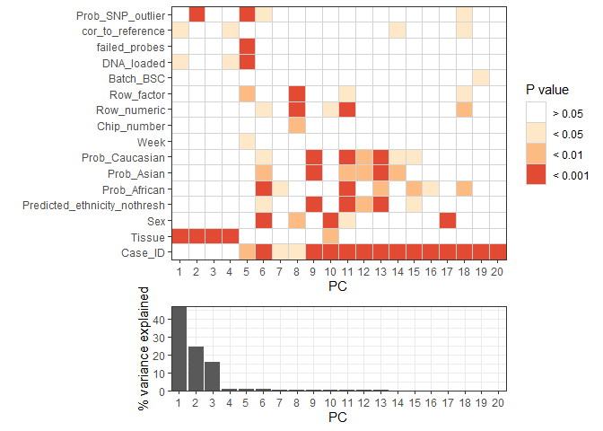<!-- -->

```r
# create another without all variables
var_interest <- c('Tissue', 'Sex', 'Prob_Caucasian', 'Prob_Asian', 'Prob_African','Case_ID',
                  'Week', 'Chip_number', 'Row_numeric', 'Row_factor', 'Batch_BSC')

p9 <- pc_cor %>% 
  filter(dep %in% var_interest) %>%
  mutate(dep = ifelse(dep %in% var_interest[7:11], paste0('TECH_', dep), as.character(dep))) %>%
  mutate(dep = factor(dep, levels = c('TECH_Week', 'TECH_Chip_number', 'TECH_Row_numeric',
                                      'TECH_Row_factor', 'TECH_Batch_BSC', 
                                      'Prob_Caucasian', 'Prob_Asian', 'Prob_African',  'Sex',
                                      'Case_ID', 'Tissue'))) %>%
  ggplot(aes(x = PC, y = dep, fill = pval_cat)) +
  geom_tile(col = 'lightgrey') + theme_bw() +
  scale_x_discrete(expand = c(0, 0), labels = 1:20) +
  scale_y_discrete(expand = c(0, 0)) +
  scale_fill_manual(values = colpal)  + 
  labs(y = '', fill = 'P value')

egg::ggarrange(p9, p8, heights = c(3,1))
```

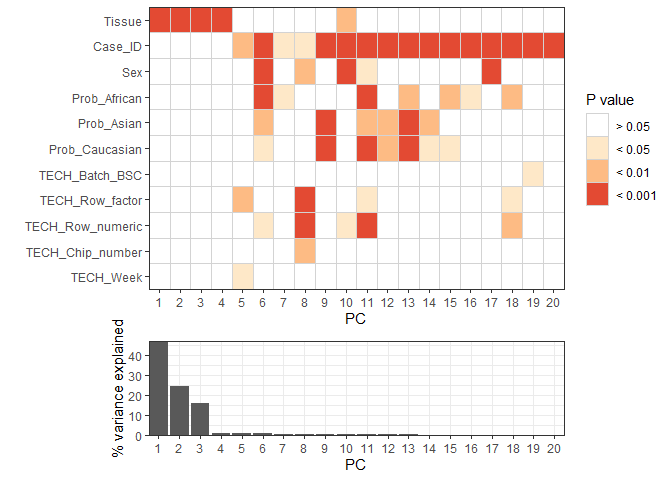<!-- -->

Scatterplots


```r
scatter <- function(x, y, fill, point_size = 1){
  xlab <- pc_info %>% filter(variable == 'Proportion of Variance', PC == x) %>% pull(Label)
  ylab <- pc_info %>% filter(variable == 'Proportion of Variance', PC == y) %>% pull(Label)
  
  x <- paste0(x, '_processed')
  y <- paste0(y, '_processed')
  
  out <- ggplot(pDat_term, aes_string(x = x, y = y, fill = fill)) +
    geom_point(shape = 21, size = point_size) + theme_bw() + labs(x = xlab, y = ylab) 
  
  if (is.numeric(as.data.frame(pDat_term)[,fill])){
    out <- out +
      scale_fill_viridis()
  } else {
    out <- out + 
      scale_fill_brewer(palette = 'Set1')
  }
    
  out
}

scatter(x = 'PC1', y = 'PC2', fill = 'Tissue', point_size = 2) +
  scale_fill_manual(values = color_code_tissue[unique(pDat_term$Tissue)])  +
  labs(fill = '')
```

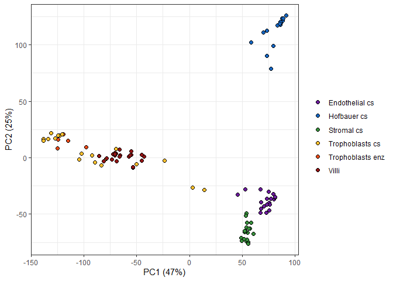<!-- -->

```r
scatter(x = 'PC3', y = 'PC4', fill = 'Tissue', point_size = 2) +
  scale_fill_manual(values = color_code_tissue[unique(pDat_term$Tissue)]) +
  labs(fill = '')
```

<!-- -->

```r
scatter(x = 'PC5', y = 'PC6', fill = 'Tissue', point_size = 2) +
  scale_fill_manual(values = color_code_tissue[unique(pDat_term$Tissue)]) +
  labs(fill = '')
```

<!-- -->

```r
ggplot(pDat_term, aes(x = PC5_processed, y = PC6_processed, color = Case_ID)) +
  geom_point() + theme_bw()
```

<!-- -->

```r
ggplot(pDat_term, aes(x = PC4_processed, y = PC5_processed, color = Prob_Asian)) +
  geom_point()
```

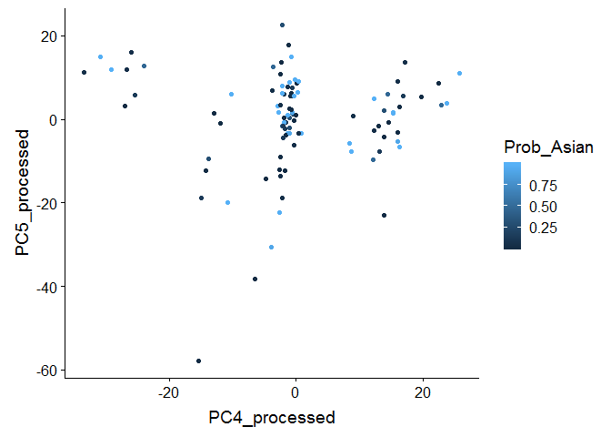<!-- -->

## Pairwise correlations

Computed this is 22_Term_contamination.Rmd, just loaded it back in and filter to our final samples.


```r
# filter to our samples
cor_betas <- cor_data$cor_betas[pDat_term$Sample_Name,pDat_term$Sample_Name]
rownames(cor_data$annotation) <-  cor_data$x$Sample_Name

# update the tissue annotation
pheatmap_anno <- pDat_term %>% select(Tissue, Sex, Prob_Caucasian, Prob_Asian) %>% as.data.frame()
rownames(pheatmap_anno) <- pDat_term$Sample_Name

# update color annotation
cor_data$anno_colors$Tissue = color_code_tissue[levels(as.factor(pDat_term$Tissue))]
cor_data$anno_colors$Prob_Caucasian = c('grey', 'black')
cor_data$anno_colors$Prob_Asian = c('grey', 'black')

# pheatmap
pheatmap(cor_betas, annotation_col = pheatmap_anno, 
         annotation_row = pheatmap_anno[,c('Tissue'), drop = F],
         show_rownames = F, show_colnames = F,
         angle_col = 45, fontsize_row = 6, fontsize_col = 6,
         annotation_colors = cor_data$anno_colors,
         color = viridis(100, option = 'B'),
         cutree_cols = 6)
```

<!-- -->

# 3.0 Linear modelling

## fit pairwise comparisons

Include Case_ID to adjust for the individual effect.
Drop the villi replicates

*	PM366_vc_R1 - keep, less failed probes
* PM366_vc_R2 - drop
* PM77_vc - drop, interbatch replicate
* PM139_vc - drop, interbatch replicate


```r
# drop villi replicates
n1 <- nrow(pDat_term)
pDat_term <- pDat_term %>% filter(!Sample_Name %in% c('PM366_vc_R2', 'PM77_vc', 'PM139_vc'))
n2 <- nrow(pDat_term)
print(paste(n1, 'samples filtered down to', n2))
```

```
## [1] "100 samples filtered down to 97"
```

```r
betas_term <- betas_term[,pDat_term$Sample_Name]
mvals_term <- mvals_term[,pDat_term$Sample_Name]
ncol(betas_term) == n2
```

```
## [1] TRUE
```

```r
ncol(mvals_term) == n2
```

```
## [1] TRUE
```

```r
# create a design matrix
design <- model.matrix(~0+Tissue + Case_ID, 
                       data = pDat_term)
colnames(design) <- gsub('Tissue', '', gsub('Case_ID', '', colnames(design)))
colnames(design) <- case_when(
  colnames(design) == 'Endothelial cs' ~ 'Endo_cs',
  colnames(design) == 'Hofbauer cs' ~ 'Hofb_cs',
  colnames(design) == 'Trophoblasts cs' ~ 'Troph_cs',
  colnames(design) == 'Trophoblasts enz' ~ 'Troph_enz',
  colnames(design) == 'Stromal cs' ~ 'Strom_cs',
  colnames(design) == 'Villi' ~ 'Villi',
  TRUE ~ colnames(design)
)

# create a contrast matrix for specific comparisons
contMatrix <- makeContrasts(Endo_cs-Hofb_cs,
                           Endo_cs-Strom_cs,
                           Endo_cs-Troph_cs,
                           Endo_cs-Troph_enz,
                           Endo_cs-Villi,
                           
                           Hofb_cs-Strom_cs,
                           Hofb_cs-Troph_cs,
                           Hofb_cs-Troph_enz,
                           Hofb_cs-Villi,
                           
                           Strom_cs-Troph_cs,
                           Strom_cs-Troph_enz,
                           Strom_cs-Villi,
                           
                           Troph_cs-Troph_enz,
                           Troph_cs-Villi,
                           
                           Troph_enz-Villi,
                           
                           levels=design)
```


```r
# fit the linear model 
fit <- lmFit(mvals_term, design)

# fit contrasts
fit2 <- contrasts.fit(fit, contMatrix)
fit2 <- eBayes(fit2) # moderate t stats

# pull out dmcs
dmcs <- broom::tidy(fit2) %>%
  separate(term, into = c('Group1', 'Group2'), sep = '\\s-\\s', remove = F) %>%
  group_by(Group1, Group2) %>%
  mutate(fdr = p.adjust(p.value, method = "fdr"),
         bonferroni = p.adjust(p.value, method = 'bonferroni')) %>%
  ungroup()
```

We need to conver the effect sizes in terms of beta values. To do this we fit the linear models over
the beta values and join that to the mvalue results.

Basically, we are using the p values and other stats calculated on m values. And using the effect 
sizes from the beta values.


```r
fit_b <- lmFit(betas_term, design)
fit_b2 <- contrasts.fit(fit_b, contMatrix)
fit_b2 <- eBayes(fit_b2) # moderate t stats

# pull out effect sizes
effect_sizes <- broom::tidy(fit_b2) %>% 
  dplyr::rename(estimate_b = estimate) %>%
  select(gene, term, estimate_b) # join on term and gene, add in estimate

# join
dmcs <- dmcs %>% dplyr::rename(estimate_m = estimate) %>%
  left_join(effect_sizes)
```

```
## Joining, by = c("gene", "term")
```

estimate_b -> effect size based on beta values
estimate_m -> effect size based on m values


Last thing to do is to get a list of cpgs that vary between cell types using the f stat


```r
summary(decideTests(fit2), method = 'nestedF', adjust.method = 'fdr', p.value = 0.05)
```

```
##        Endo_cs - Hofb_cs Endo_cs - Strom_cs Endo_cs - Troph_cs
## Down              349182             207162             245372
## NotSig            269221             339788             244848
## Up                118647             190100             246830
##        Endo_cs - Troph_enz Endo_cs - Villi Hofb_cs - Strom_cs
## Down                242190          248357             137038
## NotSig              295922          260984             270099
## Up                  198938          227709             329913
##        Hofb_cs - Troph_cs Hofb_cs - Troph_enz Hofb_cs - Villi
## Down               168079              165023          168629
## NotSig             198107              299798          196787
## Up                 370864              272229          371634
##        Strom_cs - Troph_cs Strom_cs - Troph_enz Strom_cs - Villi
## Down                254524               244300           258138
## NotSig              219275               286351           231747
## Up                  263251               206399           247165
##        Troph_cs - Troph_enz Troph_cs - Villi Troph_enz - Villi
## Down                  48418           119507             91034
## NotSig               665362           557759            546316
## Up                    23270            59784             99700
```

## analyze model results

It takes too long to plot all points ,so I  subsetted to 150000 points, which is around 10,000
plots per comparison

I also use bonferroni adjusted p values, because almost everything is significant


```r
# view p value histogram
ggplot(dmcs, aes(x = p.value)) +
  geom_histogram() +
  theme_bw() +
  scale_x_continuous(breaks = c(0,0.5,1)) +
  facet_wrap(~ term, scales = 'free_y')
```

```
## `stat_bin()` using `bins = 30`. Pick better value with `binwidth`.
```

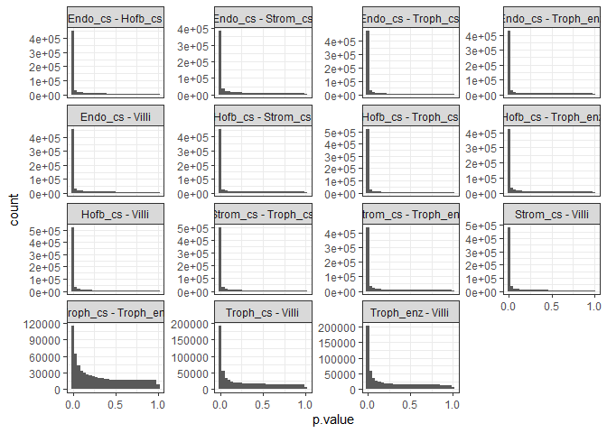<!-- -->

```r
#volcano
dmcs %>%
  sample_n(150000) %>%
  ggplot(aes(estimate_b, bonferroni)) +
  geom_point(alpha = 0.5) +
  facet_wrap(~ term, scales = "free") +
  geom_hline(yintercept = 0.05, col = 'blue', linetype = 'dashed') +
  scale_y_log10()  +
  scale_x_continuous(limits = c(-1, 1), breaks = c(-1, -0.5, 0, 0.5, 1)) +
  labs(title = '10000 points per plot shown',  y= 'log10 of bonferroni-adjusted\np value')
```

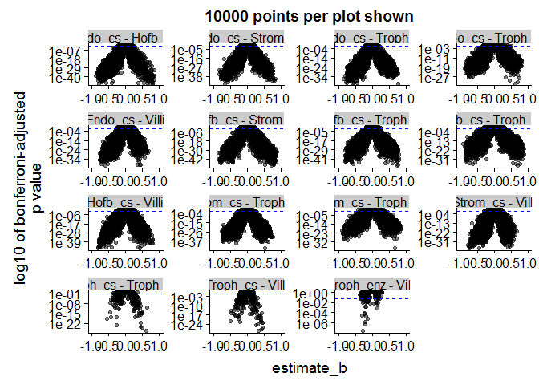<!-- -->

```r
stat_thresholds <- dmcs %>%
  group_by(term) %>%
  summarize(fdr01_deltb05 = sum(fdr < 0.01 & abs(estimate_b) > 0.05),
            fdr01_deltb10 = sum(fdr < 0.01 & abs(estimate_b) > 0.1),
            fdr01_deltb15 = sum(fdr < 0.01 & abs(estimate_b) > 0.15),
            fdr01_deltb20 = sum(fdr < 0.01 & abs(estimate_b) > 0.2))
stat_thresholds
```

```
## # A tibble: 15 x 5
##    term             fdr01_deltb05 fdr01_deltb10 fdr01_deltb15 fdr01_deltb20
##    <fct>                    <int>         <int>         <int>         <int>
##  1 Endo_cs - Hofb_~        354174        271072        208921        163162
##  2 Endo_cs - Strom~        292902        213908        159518        121637
##  3 Endo_cs - Troph~        380978        300775        239960        190716
##  4 Endo_cs - Troph~        375571        320804        265263        217167
##  5 Endo_cs - Villi         365269        280527        212524        159792
##  6 Hofb_cs - Strom~        364520        285412        225549        179671
##  7 Hofb_cs - Troph~        401600        317539        260739        218463
##  8 Hofb_cs - Troph~        368937        319719        273504        233230
##  9 Hofb_cs - Villi         395723        313817        253704        204836
## 10 Strom_cs - Trop~        387698        302781        239995        189255
## 11 Strom_cs - Trop~        379950        323631        268189        219498
## 12 Strom_cs - Villi        367237        279693        210622        156329
## 13 Troph_cs - Trop~         33485         24819         15617          9278
## 14 Troph_cs - Villi         93660         38515         13644          6660
## 15 Troph_enz - Vil~        113670         83273         44590         16795
```

### Upset plot


```r
dmcs_wide <- dmcs %>%
  mutate(significant = ifelse(fdr < 0.01 & abs(estimate_b) > 0.1, 1, 0)) %>%
  select(gene, term, significant) %>%
  mutate(term = gsub('\\s-\\s', '_', term)) %>%
  spread(key = term, value = significant) 
dmcs_wide
```

```
## # A tibble: 737,050 x 16
##    gene  Endo_cs_Hofb_cs Endo_cs_Strom_cs Endo_cs_Troph_cs Endo_cs_Troph_e~
##    <chr>           <dbl>            <dbl>            <dbl>            <dbl>
##  1 cg00~               0                0                0                0
##  2 cg00~               0                0                0                0
##  3 cg00~               0                0                0                0
##  4 cg00~               0                0                0                0
##  5 cg00~               0                0                1                1
##  6 cg00~               0                0                0                0
##  7 cg00~               1                1                1                1
##  8 cg00~               0                0                0                0
##  9 cg00~               1                0                1                0
## 10 cg00~               1                0                0                0
## # ... with 737,040 more rows, and 11 more variables: Endo_cs_Villi <dbl>,
## #   Hofb_cs_Strom_cs <dbl>, Hofb_cs_Troph_cs <dbl>,
## #   Hofb_cs_Troph_enz <dbl>, Hofb_cs_Villi <dbl>, Strom_cs_Troph_cs <dbl>,
## #   Strom_cs_Troph_enz <dbl>, Strom_cs_Villi <dbl>,
## #   Troph_cs_Troph_enz <dbl>, Troph_cs_Villi <dbl>, Troph_enz_Villi <dbl>
```

```r
upset(nsets = 15, data.frame(dmcs_wide))
```

<!-- -->

### top 1000 DMCs


```r
dmcs_top1000 <- dmcs %>%
  group_by(term) %>%
  arrange(fdr) %>%
  dplyr::slice(1:1000) %>%
  ungroup()

# widen
dmcs_top1000 %>% select(-estimate_m:-estimate_b) %>% mutate()
```

```
## # A tibble: 15,000 x 4
##    gene       term              Group1  Group2 
##    <chr>      <fct>             <chr>   <chr>  
##  1 cg26543150 Endo_cs - Hofb_cs Endo_cs Hofb_cs
##  2 cg13980609 Endo_cs - Hofb_cs Endo_cs Hofb_cs
##  3 cg05926358 Endo_cs - Hofb_cs Endo_cs Hofb_cs
##  4 cg00482162 Endo_cs - Hofb_cs Endo_cs Hofb_cs
##  5 cg06971029 Endo_cs - Hofb_cs Endo_cs Hofb_cs
##  6 cg19256314 Endo_cs - Hofb_cs Endo_cs Hofb_cs
##  7 cg11118690 Endo_cs - Hofb_cs Endo_cs Hofb_cs
##  8 cg18356123 Endo_cs - Hofb_cs Endo_cs Hofb_cs
##  9 cg25073689 Endo_cs - Hofb_cs Endo_cs Hofb_cs
## 10 cg23475787 Endo_cs - Hofb_cs Endo_cs Hofb_cs
## # ... with 14,990 more rows
```

```r
# join to genes, first filter to selected columns
anno_reduced <- anno %>% 
  select(Name, chr, pos, strand, Islands_Name, Relation_to_Island, contains('UCSC'), 
         contains('Phantom'), 'DMR', 'Methyl450_Loci')

dmcs_top1000 <- dmcs_top1000 %>%
  ungroup() %>%
  left_join(anno_reduced, by = c('gene' = 'Name'), order.by = 'freq')
```


## fit 1 vs all comparisons

1 cell type vs all other cell types

excluding villi and troph enz


```r
contMatrix_1vAll <- makeContrasts(Endo_cs - (Hofb_cs + Strom_cs + Troph_cs)/3,
                            Hofb_cs - (Endo_cs + Strom_cs + Troph_cs)/3,
                            Strom_cs - (Endo_cs + Hofb_cs + Troph_cs)/3,
                            Troph_cs - (Endo_cs + Hofb_cs + Strom_cs)/3,
                            levels=design)
# fit contrasts
fit3 <- contrasts.fit(fit, contMatrix_1vAll)
fit3 <- eBayes(fit3) # moderate t stats

# how many are significant
ntests <- nrow(fit3$p.value)
fdr_thresh <- 0.001
nfsig <- sum(topTableF(fit3, n = ntests, adjust.method = 'BH', p.value = 0.05)$adj.P.Val < fdr_thresh)

print(paste(nfsig, 'out of', ntests, 'CpGs were found significant at an FDR <', fdr_thresh))
```

```
## [1] "573821 out of 737050 CpGs were found significant at an FDR < 0.001"
```

```r
# 573821 CpGs

# pull out dmcs
dmcs_1vall <- broom::tidy(fit3) %>%
  mutate(term = gsub('\\(.*', 'All', term)) %>%
  dplyr::rename(estimate_m = estimate) %>%
  separate(term, into = c('Group1', 'Group2'), sep = '\\s-\\s', remove = F) %>%
  group_by(Group1, Group2) %>%
  mutate(fdr = p.adjust(p.value, method = "fdr"),
         bonferroni = p.adjust(p.value, method = 'bonferroni')) %>%
  ungroup()

# join effect sizes information based on betas
fit_b3 <- contrasts.fit(fit_b, contMatrix_1vAll)
fit_b3 <- eBayes(fit_b3) # moderate t stats

effect_sizes_1vall <- broom::tidy(fit_b3) %>% 
  dplyr::rename(estimate_b = estimate)  %>%
  separate(term, into = c('Group1', 'Group2'), sep = '\\s-\\s', remove = F) %>%
  select(gene, Group1, estimate_b)

dmcs_1vall <- dmcs_1vall  %>%
  left_join(effect_sizes_1vall)
```

```
## Joining, by = c("gene", "Group1")
```

column estimate_b refers to the effect size in terms of beta value


```r
# p value histogram
dmcs_1vall %>%
  ggplot(aes(x = p.value)) +
  geom_histogram() +
  theme_bw() +
  facet_wrap(~Group1)
```

```
## `stat_bin()` using `bins = 30`. Pick better value with `binwidth`.
```

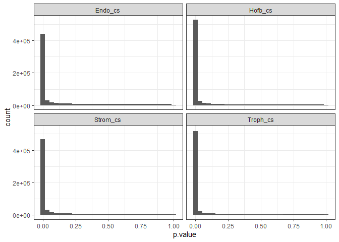<!-- -->

```r
# volcano plot
dmcs_1vall %>%
  sample_n(400000) %>%
  mutate(neglog10p = -log(bonferroni, base = 10)) %>%
  ggplot(aes(x = estimate_b, y = neglog10p)) +
  geom_point(alpha = 0.1) +
  facet_wrap(~Group1)+
  geom_hline(yintercept = 0.01, col = 'blue', linetype = 'dashed') +
  scale_x_continuous(limits = c(-1, 1), breaks = c(-1, -0.5, 0, 0.5, 1)) +
  labs(title = '100,000 points per plot shown',  y= '-log10 of bonferroni-adjusted\np value')
```

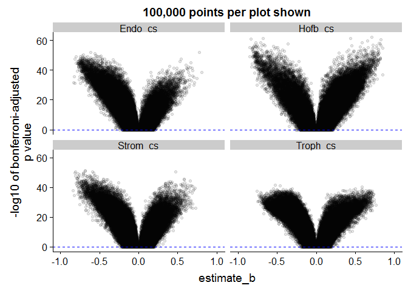<!-- -->

# 4.0 Densities of DMCs

## hyper / hypo


```r
# number of significant cpgs per cell
dmcs_1vall_sig <- dmcs_1vall %>% 
  group_by(Group1) %>% 
  summarize(b001db50_all = sum(bonferroni < 0.001 & abs(estimate_b) > 0.5), 
            b001db50_hypo = 
              sum(bonferroni < 0.001 & abs(estimate_b) > 0.5 & estimate_m < 0),
            b001db50_hyper = 
              sum(bonferroni < 0.001 & abs(estimate_b) > 0.5 & estimate_m > 0)) %>%
  gather('group', 'n_cpg', -Group1) %>%
  separate(group, into = c('pvalue', 'delta_b')) %>%
  mutate(Group1_label = case_when(
    Group1 == 'Endo_cs' ~ 'Endothelial cs',
    Group1 == 'Hofb_cs' ~ 'Hofbauer cs',
    Group1 == 'Strom_cs' ~ 'Stromal cs',
    Group1 == 'Troph_cs' ~ 'Trophoblasts cs'
  ))

dmcs_1vall_sig %>% 
  
  # calculate proportions
  spread(key = delta_b, value = n_cpg) %>%
  mutate(hyper_p = hyper/all,
         hypo_p = hypo/all) %>%
  gather(key = cpg, value = n_cpg, -(Group1:Group1_label), -(hyper_p:hypo_p)) %>%
  mutate(p_cpg = prettyNum(digits = 2, 
                           100*case_when(
    cpg == 'hyper' ~ hyper_p,
    cpg == 'hypo' ~ hypo_p,
    cpg == 'all' ~ 1))) %>%
  select(-hyper_p, -hypo_p) %>%
  filter(cpg != 'all') %>%
  arrange(Group1, cpg) %>%
  mutate(label = paste0(p_cpg, '%')) %>%
  
  #plot
  ggplot(aes(x = Group1_label, y = n_cpg, fill = cpg)) +
  geom_bar(stat = 'identity', position = 'stack', color = 'black') +
  geom_text(aes(label = label, y = n_cpg), position = position_stack(vjust = 0.5)) +
  labs(y = 'Number DMCs (in thousands)', x = '', fill = '')  +
  theme_bw() +
  theme(axis.text.x = element_text(angle = 45, vjust = 1, hjust =1)) +
  scale_y_continuous(limits = c(0, 20000),
                     breaks = seq(0, 20000, 5000), 
                     labels = as.character(seq(0,20,5)),
                     expand = c(0,0)) +
  scale_fill_manual(values = c('#6BAED6', '#DEEBF7'), labels = c('Hypermethylated', 'Hypomethylated'))
```

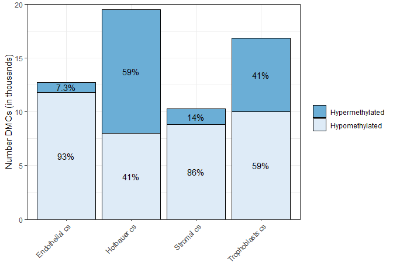<!-- -->

Here I use the density distribution code from above to calculate tissue densities again, but over
tissue specific CpGs

I also compute a background density line for each tissue, which is the the density over all betas
for a given tissue (not just dmcs).


```r
dmcs_1vall_densities <- dmcs_1vall %>%
  
  # filter to significant cpgs (dmcs)
  filter(bonferroni < 0.001, abs(estimate_b) > 0.5) %>%
  mutate(Group1_label = case_when(
    Group1 == 'Endo_cs' ~ 'Endothelial cs',
    Group1 == 'Hofb_cs' ~ 'Hofbauer cs',
    Group1 == 'Strom_cs' ~ 'Stromal cs',
    Group1 == 'Troph_cs' ~ 'Trophoblasts cs')) %>% 
  
  # get dmcs in list colu,m
  group_by(Group1, Group1_label) %>% 
  nest(gene) %>% mutate(dmcs = map(data, ~.$gene)) %>% select(-data) %>%
  
  # get sample names for each tissue
  mutate(samples = lapply(Group1_label, function(x) pDat_term %>% 
                            filter(Tissue == x) %>% 
                            pull(Sample_Name)),
         
         # 1. get betas for each tissue, filtering to mdmcs
         betas = map2(dmcs, samples, ~as.vector(betas_term[.x,.y])),
         
         # 2. get x and y coordinates for densites on these betas
         densities = map(betas, ~ density(.)),
         x = map(densities, 'x'),
         y = map(densities, 'y'),
         
         # Repeat 1. and 2. but for all cpgs, not just dmcs
         betas_all = map(samples, ~as.vector(betas_term[,.y])),
         densities_all = map(betas_all, ~ density(.)),
         x_all = map(densities_all, 'x'),
         y_all = map(densities_all, 'y')) %>%
  
  # remove input data
  select(contains('Group1'), x, y, x_all, y_all) %>%
  unnest()
  

ggplot(dmcs_1vall_densities) +
  geom_line(aes(x = x_all, y = y_all, color = 'All CpGs'),
            linetype = 'longdash', alpha = 0.8, size = 2) +
  geom_line(size = 2,aes(x = x, y = y, color = Group1_label)) + theme_bw() +
  scale_x_continuous(breaks = c(0, 0.25, 0.5, 0.75, 1)) +
  facet_wrap(~Group1_label) +
  scale_color_manual(values= c(color_code_tissue[unique(dmcs_1vall_densities$Group1_label)],
                               'All CpGs' = 'grey')) +
  labs(x = '% methylation', y = 'density', color = '')
```

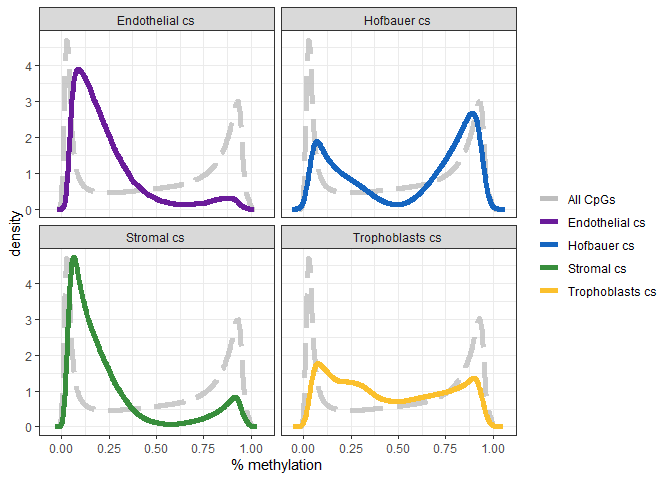<!-- -->

# 5.0 Enrichment

## Chromosome enrichment


First I add genome variables for each cpg, then I count cpgs per genomic location.


```r
# add gene annotation to cpgs
dmcs_1vall <- dmcs_1vall %>% left_join(anno, by = c('gene' = 'Name'))

# tabulate the frequency per genomic element
all_tested_cpgs <-  
  
  ## Relation to gene bodies
  table(unlist(str_extract(anno$UCSC_RefGene_Group, "^[A-z0-9']+"))) %>% 
  as.data.frame %>%
  mutate(relation = 'Relation to genes') %>%
  
  ## Is it an enhancer?
  rbind(data.frame(Var1 = 'Enhancer', 
                   Freq = sum(anno$Phantom5_Enhancers != '', na.rm = T),
                   relation = 'Relation to genes')) %>%
  mutate(probeset = paste0('All analyzed CpGs (n=', nrow(betas), ')')) %>%

  ## relation to cpg islands
  rbind(anno$Relation_to_Island %>% table %>% as.data.frame() %>% dplyr::rename(Var1 = '.') %>%
          mutate(probeset = paste0('All analyzed CpGs (n=', nrow(betas), ')'),
                 relation = 'Relation to CpG islands')) %>%
  mutate(Var1 = ifelse(Var1 == "5'UTR", "UTR_5prime", 
                       ifelse(Var1 == "3'UTR", "UTR_3prime",
                              ifelse(Var1 == "1stExon", "Exon1", as.character(Var1)))))

# do the same for only significant CpGs
enrich_df <- dmcs_1vall %>% 
  filter(bonferroni < 0.001, abs(estimate_b) > 0.5) %>%   
  
  # created nested column by cell type-dmcs
  group_by(Group1) %>% 
  select(Group1, UCSC_RefGene_Group, Phantom5_Enhancers, Relation_to_Island) %>%
  nest(.key = 'anno') %>%
  mutate(Group1_label = case_when(
    Group1 == 'Endo_cs' ~ 'Endothelial cs',
    Group1 == 'Hofb_cs' ~ 'Hofbauer cs',
    Group1 == 'Strom_cs' ~ 'Stromal cs',
    Group1 == 'Troph_cs' ~ 'Trophoblasts cs')) %>% 
  
  # tally up the locations
  mutate(UCSC_RefGene_Group = map2(anno, Group1_label, 
                                   
                                   # tally up unique occurences for each gene element for each cpg
                                   ~summarize(.x,
                                              TSS1500 = sum(grepl('TSS1500', UCSC_RefGene_Group)),
                                              TSS1500 = sum(grepl('TSS1500', UCSC_RefGene_Group)),
                                              TSS200 = sum(grepl('TSS200', UCSC_RefGene_Group)),
                                              UTR_5prime = sum(grepl("5'UTR", UCSC_RefGene_Group)),
                                              Exon1 = sum(grepl('1stExon', UCSC_RefGene_Group)),
                                              Body = sum(grepl('Body', UCSC_RefGene_Group)),
                                              ExonBnd = sum(grepl('ExonBnd', UCSC_RefGene_Group)),
                                              UTR_3prime = sum(grepl("3'UTR", UCSC_RefGene_Group))) %>%
                                     
                                     # melt it
                                     gather(key = Var1, value = Freq) %>%
                                     mutate(probeset = paste0(.y, ' DMCs (n=', nrow(.x), ')'),
                                            relation =  paste0('Relation to genes'))),
                                              
         Phantom5_Enhancers = map2(anno, Group1_label, 
                                   ~data.frame(Var1 = 'Enhancer',
                                               Freq = sum(.x$Phantom5_Enhancers != "", na.rm = T),
                                               probeset = paste0(.y, ' DMCs (n=', nrow(.x),')'),
                                               relation = 'Relation to genes')),
         Relation_to_Island = map2(anno, Group1_label,
                                   ~as.data.frame(table(.x$Relation_to_Island)) %>%
                                    mutate(probeset = paste0(.y, ' DMCs (n=', nrow(.x),')'),
                                           relation = paste0('Relation to CpG islands'))))

# combine each data frame
enrich_df <- bind_rows(all_tested_cpgs,
                       bind_rows(enrich_df$UCSC_RefGene_Group),
                       bind_rows(enrich_df$Phantom5_Enhancers),
                       bind_rows(enrich_df$Relation_to_Island)) %>% 
  as_tibble %>%
  
  # calculate frequency
  group_by(probeset, relation) %>%
  mutate(Proportion = Freq/sum(Freq))
```

```
## Warning in bind_rows_(x, .id): Unequal factor levels: coercing to character
```

```
## Warning in bind_rows_(x, .id): binding character and factor vector,
## coercing into character vector

## Warning in bind_rows_(x, .id): binding character and factor vector,
## coercing into character vector

## Warning in bind_rows_(x, .id): binding character and factor vector,
## coercing into character vector

## Warning in bind_rows_(x, .id): binding character and factor vector,
## coercing into character vector

## Warning in bind_rows_(x, .id): binding character and factor vector,
## coercing into character vector

## Warning in bind_rows_(x, .id): binding character and factor vector,
## coercing into character vector

## Warning in bind_rows_(x, .id): binding character and factor vector,
## coercing into character vector
```

Now I calculate fishers test


```r
# fisher's test for enrichment
# (1) # of DMCs on var1 (already calcualted, 'Freq')
# (2) # of non-DMCs on var1
# (3) # of DMCs not on var1
# (4) # of non-DMCs not on var1

# all cpgs dataframe necessary to calculate (2) and (4)
all_cpgs <- enrich_df %>% filter(probeset == 'All analyzed CpGs (n=737050)') %>%
  ungroup()%>%
  dplyr::rename(Freq_all_in = Freq, # total cpgs tested that are in var1 location
                Expected = Proportion) %>% 
  mutate(Freq_all = as.numeric(str_extract(probeset, '[0-9]+')), # total cpgs tested
         Freq_all_out = Freq_all - Freq_all_in) %>%              # total cpgs tested, not in var1
  select(Var1, Expected, Freq_all_in, Freq_all_out, Freq_all)


# calculate (2) (3) (4), and test enrichment
enrich_results <- enrich_df %>% filter(probeset != 'All analyzed CpGs (n=737050)') %>%
  ungroup() %>%
  # rename to make more informative
  dplyr::rename(Observed = Proportion,
                Freq_DMC_in = Freq) %>%  #(1) # of DMCs in Var1
  
  # add in all_cpgs datarfame for calculations
  left_join(all_cpgs, by = 'Var1') %>%
  select(probeset, relation, Var1, Observed, Expected, 
         Freq_all, Freq_all_in, Freq_all_out, Freq_DMC_in) %>%
  
  # calculate (2), (3), (4)
  mutate(Freq_notDMC_in = Freq_all_in - Freq_DMC_in,   #(2) # non-DMCs in var1
         
         # for (3)
         Freq_DMC = as.numeric(str_extract(probeset, '[0-9]+')), # total # of DMCs
         Freq_DMC_out = Freq_DMC - Freq_DMC_in,  # of DMCs not on Var1
         
         # for (4)
         Freq_notDMC_out = Freq_all_out - Freq_DMC_out) %>% 
  
  # test enrichment
  rowwise() %>%
  mutate(fisher_in = list(matrix(c(Freq_DMC_in, Freq_notDMC_in, 
                                   Freq_DMC_out, Freq_notDMC_out),2,2))) %>%
  ungroup() %>%
  mutate(fisher_out = map(fisher_in, ~fisher.test(., alternative = 'greater')),
         p = map_dbl(fisher_out, 'p.value'),
         odds_ratio = map_dbl(fisher_out, 'estimate'),
         FDR = p.adjust(p, method = 'fdr'),
         bonferroni = p.adjust(p, method = 'bonferroni'),
         FDR01 = ifelse(FDR < 0.01, T, F)) %>% 
  select(FDR, FDR01, bonferroni, p, odds_ratio, everything()) %>% # add back in the all cpgs probeset
  
  bind_rows(data.frame(probeset = 'All analyzed CpGs (n=737050)',
                       Observed = .$Expected,
                       relation = .$relation,
                       Var1 = .$Var1))
```

```
## Warning in bind_rows_(x, .id): binding character and factor vector,
## coercing into character vector

## Warning in bind_rows_(x, .id): binding character and factor vector,
## coercing into character vector

## Warning in bind_rows_(x, .id): binding character and factor vector,
## coercing into character vector
```

```r
# color code
colors <- color_code[[1]] %>% 
  filter(Tissue %in% c('Endothelial cs', 'Hofbauer cs', 'Stromal cs', 'Trophoblasts cs'))
colors <- setNames(c(colors$Colors_Tissue, '#525252'), unique(enrich_results$probeset))

enrich_results %>% 
  # ordering in plot
  mutate(Var1 = factor(as.character(Var1), 
                       levels = c('UTR_3prime', 'Body', 'ExonBnd', 'Exon1', 'UTR_5prime', 
                       'TSS200', 'TSS1500', 'Enhancer', 
                       'OpenSea', 'N_Shelf', 'N_Shore', 'Island', 'S_Shore', 'S_Shelf'))) %>%
  ggplot() +
  geom_bar(aes(x = Var1, y = Observed, fill = probeset),
           stat = 'identity', position = position_dodge(width = 0.75), color = 'black', 
           width = 0.8) +
  scale_fill_manual(values = colors)  + 
  facet_grid(relation ~., scales = 'free_y', space = 'free',
             labeller = as_labeller(
               setNames(c('Relation to CpG islands', 'Enhancers', 'Relation to genes'),
                        c('Relation to CpG islands', 'Relation to Enhancers', 'Relation to genes'))
               )) +
  coord_flip() +
  scale_y_continuous(limits = c(0,1), expand = c(0,0)) +
  theme_bw(base_size = 14) + 
  theme(axis.text.x = element_text(angle = 90, vjust = 0.5), 
        legend.position = 'right', legend.direction = 'vertical',
        legend.spacing.y = unit(-0.2, 'cm')) +
  labs(fill = '', x = '', y = 'Frequency', shape = '') +
  
  # add significance
  geom_point(aes(x = Var1, y = Observed + 0.03, group = probeset, shape = FDR01),
             position = position_dodge(0.75), size = 4) +
  scale_shape_manual(values = c('TRUE' = '*', 'FALSE' = ''), na.translate = F, 
                     labels = c('', 'Enriched (FDR < 0.01)'))
```

```
## Warning: Removed 56 rows containing missing values (geom_point).
```

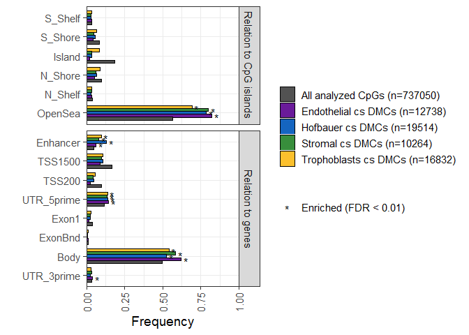<!-- -->

```r
## TODO change the genomic location axes to numeric, so that I can nudge the asterisks over a slight
##amount
```

## functional enrichment missmethyl 

### GO


```r
#GO
gst <- dmcs_1vall %>% group_by(Group1) %>%
  nest(.key = lm_summary) %>%
  mutate(GO_results = map(lm_summary, . %>% 
                            filter(bonferroni < 0.001, abs(estimate_b) > 0.5) %>%
                            pull(gene) %>% 
                            gometh(all.cpg= rownames(betas_term), 
                                   collection = 'GO',
                                   array.type = 'EPIC') %>%
                            mutate(ID = rownames(.)) %>%
                            arrange(FDR)),
         # number significnat at FDR < 0.05
         FDR05_signif = map_dbl(GO_results, . %>% filter(FDR < 0.05) %>% nrow())) 
```

Since some tissue DMCs do not produce any statistically significant pathways, I examine the 20 top-
ranked for each tissue.


```r
top_GO <- gst %>% 
  mutate(top_GO = map(GO_results, . %>% 
                       arrange(P.DE) %>% 
                       dplyr::slice(1:10))) %>%
  select(Group1, top_GO) %>%
  unnest() %>%
  mutate(Generatio = DE/N) %>% # number of differentially methylated genes out of total per go term
  
  # set up ordering of terms for plotting
  arrange(Group1, Generatio) %>%
  mutate(Order = row_number(),
         neg_log_P = -log(P.DE, base = 10))

ggplot(top_GO, aes(x = Order, y = Generatio, fill = neg_log_P)) +
  geom_segment(aes(x = Order, xend = Order, y = 0, yend = Generatio)) +
  geom_point(stat = 'identity', shape = 21, color = 'black', size = 3) +
  theme_bw() +
  facet_wrap(~Group1, scales = 'free_y', ncol = 1) +
  scale_x_continuous(breaks = top_GO$Order,
                     labels = top_GO$TERM) +
  coord_flip() +
  scale_y_continuous(expand = c(0,0), limits = c(0,1)) +
  scale_fill_viridis_c(option = 'A', direction = 1, 
                       limits = c(0, 5), breaks = 1:5, na.value = viridis(option = 'A', 10)[10]) +
  labs(fill = '-log10(P)', x = '', 
       y = '(# of genes with DMCs) / (# of genes associated with GO term)')
```

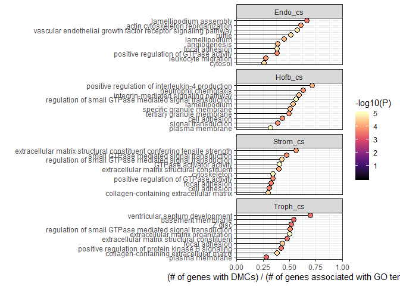<!-- -->

### KEGG


# 6.0 CpG plots

Here I show some top hit for each cell type


```r
cpgs_ex <- dmcs_1vall %>% filter(bonferroni < 0.001, abs(estimate_b) > 0.5) %>% group_by(Group1) %>%
  arrange(bonferroni) %>%
  dplyr::slice(1) %>% pull(gene)

cbind(pDat_term %>% select(Sample_Name, Tissue),
      t(betas_term[cpgs_ex,])) %>% as_tibble  %>%
  gather(key = cpg, value = beta, -Sample_Name, -Tissue) %>% {
    ggplot(., aes(x = Tissue, y = beta, fill = Tissue)) +
      geom_violin(color = 'black') +
      geom_jitter(alpha = 0.5, shape = 21, color = 'black', show.legend = F) +
      facet_wrap(~cpg) +
      scale_fill_manual(values= color_code_tissue[unique(.$Tissue)]) +
      scale_color_manual(values= color_code_tissue[unique(.$Tissue)]) +
      theme_bw() +
      theme(axis.text.x = element_text(angle = 45, hjust = 1, vjust = 1)) +
      labs(x = '')+
      scale_y_continuous(limits = c(0,1)) 
  }
```

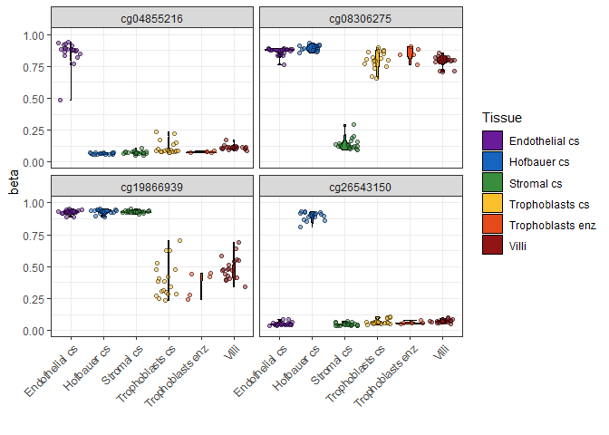<!-- -->


## ggridges


```r
dmcs_1vall_allcpg <- dmcs_1vall # save this

# Create a gene label column, unique genes that each cpg maps to
dmcs_1vall <- dmcs_1vall %>% 
  filter(bonferroni < 0.001, abs(estimate_b) > 0.5) %>% 
  
  mutate(Direction = ifelse(estimate_b > 0, 'Hypermethylated', 'Hypomethylated')) %>%
  group_by(Group1, Direction)%>% 
  arrange(bonferroni) %>%
  # identify the unique genes that each cpg maps to
  mutate(gene_label = str_extract_all(UCSC_RefGene_Name, '[^;]*')) %>%
  mutate(gene_label = map_chr(gene_label, ~paste(unique(.), collapse = ','))) %>%
  mutate(gene_label = gsub(',$', '', gsub(',,', ',', gene_label))) %>%
  dplyr::rename(cpg = gene) %>%
  
  # reorder columns
  select(Group1, cpg, gene_label, Direction, everything())


topdmcs <- dmcs_1vall %>% 
  
  # select top n for hypo hyper per group
  group_by(Group1, Direction) %>%
  arrange(bonferroni) %>%
  top_n(-5, bonferroni) %>%
  ungroup() %>%
  
  mutate(cpg_gene_label = paste(cpg, gene_label, sep = '; '))


# pull out betas
topdmcs_b <- 
  
  # combine betas to pDat
  bind_cols(pDat_term %>% select(Sample_Name, Tissue),
            as.data.frame(t(betas_term[topdmcs$cpg,]))) %>%
  gather(key = cpg, value = beta, -Sample_Name, -Tissue) %>%
  
  # Join to annotation
  left_join(topdmcs %>% select(cpg, Group1, Direction, cpg_gene_label, gene_label, p.value, estimate_b), 
            by =c('cpg')) %>%
  arrange(Group1, estimate_b) %>%
  mutate(cpg_gene_label = factor(as.character(cpg_gene_label), 
                                 levels = unique(as.character(cpg_gene_label))),
         DMCs_for_class = case_when(Group1 == 'Hofb_cs' ~ 'Hofbauer cs',
                                    Group1 == 'Strom_cs' ~ 'Stromal cs', 
                                    Group1 == 'Endo_cs' ~ 'Endothelial cs',
                                    Group1 == 'Troph_cs' ~ 'Trophoblasts cs')) 

g_top <- ggplot(topdmcs_b, aes(x = beta, y = cpg_gene_label)) +
  geom_density_ridges(alpha = 0.4, aes(fill = Tissue)) +
  facet_wrap(~DMCs_for_class, scales = 'free_y', labeller = 'label_both') +
  theme_bw() +
  scale_x_continuous(limits = c(0, 1), breaks = c(0, 0.25, 0.5, 0.75, 1.0), labels = c(0, 25, 50, 75, 100)) +
  scale_fill_manual(values= color_code_tissue[unique(topdmcs_b$Tissue)]) +
  labs(x = '% methylated', y = '')
g_top
```

```
## Picking joint bandwidth of 0.0119
```

```
## Picking joint bandwidth of 0.00845
```

```
## Picking joint bandwidth of 0.0197
```

```
## Picking joint bandwidth of 0.0202
```

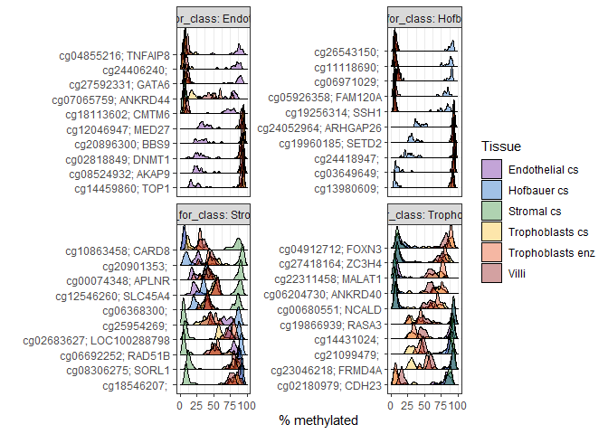<!-- -->

## DNMT1


```r
anno_dnmt1 <- anno %>% filter(grepl('DNMT1', UCSC_RefGene_Name))  %>% 
  select(pos, Name, UCSC_RefGene_Group, UCSC_RefGene_Name, Relation_to_Island, contains('Enhancer'))  %>%
  mutate(UCSC_RefGene_Group = str_extract(UCSC_RefGene_Group, '^[A-z]*'),
         UCSC_RefGene_Name = str_extract(UCSC_RefGene_Name, '^[A-z]*'),
         
         # distnace to tss
         TSS_distance = pos-10305755) %>%
  arrange(pos)


betas_dnmt1 <- t(betas_term[anno_dnmt1$Name,]*100) %>% as_tibble %>% 
  mutate(Sample_Name = colnames(betas_term)) %>%
  
  # melt/gather
  gather(key = 'CpG', value = 'beta', -Sample_Name)  %>%
  
  # add tissue info
  left_join(pDat_term %>% select(Sample_Name, Tissue)) %>%
  
  # add cpg coords
  left_join(anno_dnmt1, by = c('CpG' = 'Name')) %>%
  mutate(gene_element = UCSC_RefGene_Group) %>%
  mutate(gene_element = factor(gene_element, levels = c('', "TSS", "Body", "ExonBnd"))) %>%
  
  # calculate median tissue value
  group_by(Tissue, CpG) %>%
  
  # order on cpg position
  ungroup() %>%
  arrange(desc(pos)) %>%
  mutate(CpG = factor(CpG, levels = unique(CpG)),
         
         # create an annotation column          
         Annotation_gene_element = 'Gene_element')
```

```
## Joining, by = "Sample_Name"
```

```r
pdnmt1_a <- betas_dnmt1 %>% group_by(CpG, Tissue) %>%
  summarize(mean = mean(beta),
            sd = sd(beta)) %>%
  mutate(lower = mean-sd, upper = mean+sd) %>%
  ggplot() +
  geom_linerange(alpha = 0.75, size = 1, aes(x = CpG, ymin =lower, ymax = upper, color = Tissue)) +
  geom_point(alpha = 0.75, aes(x = CpG, y = mean, color = Tissue), size = 2) +
  theme_bw() +
  coord_flip() +
  theme(axis.text.y = element_blank(), plot.margin=margin(l=-0.1,unit="cm")) +
  scale_y_continuous(limits = c(0, 100)) +
  scale_x_discrete(expand = c(0.01,0.01))+
  scale_color_manual(values= color_code_tissue[unique(topdmcs_b$Tissue)]) +
  labs(y = '% methylation', x = '') 

pdnmt1_b <- ggplot(betas_dnmt1, aes(x = CpG, y = TSS_distance)) +
  geom_bar(stat = 'identity') +
  coord_flip() + 
  theme_bw() +
  labs(y = 'Distnace to TSS\n(in millions of bp)', x = '') +
  scale_y_continuous(breaks = c(-6e06, -4e06, -2e06, 0), labels = c(-6, -4, -2, 0),
                     expand = c(0.01,0.01)) +
  scale_x_discrete(expand = c(0, 0))

pdnmt1_c <- anno_dnmt1 %>% select(pos:X450k_Enhancer, -UCSC_RefGene_Name) %>%
  gather(key = CpG_Group, value = value, -Name, -pos) %>%
  mutate(value = ifelse(value == '', NA, value),# repleace blanks with NA
         value = factor(as.character(value), levels = as.character(unique(value))),
         CpG_Group = factor(as.character(CpG_Group), levels = as.character(unique(CpG_Group)))) %>%
  arrange(desc(pos)) %>%
  mutate(Name = factor(as.character(Name), levels = unique(as.character(Name)))) %>%
  ggplot(aes(x = CpG_Group, y = Name, fill = value)) +
  geom_tile(color = 'grey') +
  theme_bw() +
  scale_fill_manual(values =c(brewer.pal(n = 3, name = 'PuRd'), # body/exon/tss
                              brewer.pal(n = 6, name = 'BrBG'),
                              'grey', 'grey'),
                    na.value = 'white', 
                    na.translate = F) +
  theme(axis.text.x = element_text(angle = 90, 
                                   vjust = 0,
                                   hjust = 0), 
        axis.text.y = element_blank(), 
        plot.margin = margin(l=-0.6,unit="cm"),
        panel.grid.major = element_blank(),
        panel.grid.minor = element_blank())  +
  scale_x_discrete(expand = c(0,0))+
  labs(x = '', y = '', fill = '')

plot_grid(ggarrange(pdnmt1_b, 
                    pdnmt1_c + theme(legend.position = ''),
                    pdnmt1_a + theme(legend.position = ''),
                    ncol = 3, widths = c(0.5, 0.25, 3)),
          plot_grid(get_legend(pdnmt1_c), 
                    get_legend(pdnmt1_a), 
                    ncol = 1, align = 'hv'), 
          ncol = 2, rel_widths = c(5,1))
```

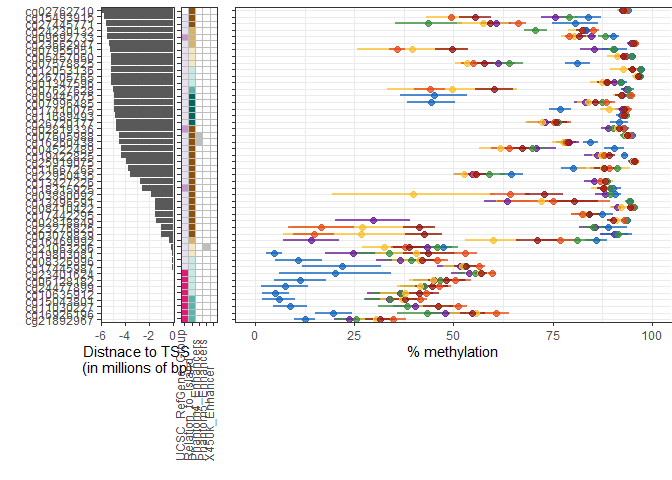<!-- -->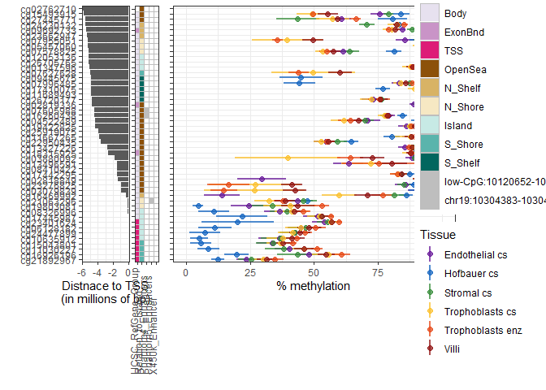<!-- -->

# Save data


```r
dmcs_1vall_allcpg %>% 
  dplyr::rename(cpg = gene, Cell_type = Group1) %>%
  select(cpg, Cell_type, p.value, fdr, bonferroni:strand, Islands_Name, Relation_to_Island, 
         contains('UCSC'), Phantom5_Enhancers, HMM_Island) %>%
  saveRDS('../../data/main/interim/2_2_Term_DMCs_alltests.rds')

dmcs_1vall_allcpg %>% filter(bonferroni < 0.001, abs(estimate_b) > 0.5) %>% 
  dplyr::rename(cpg = gene, Cell_type = Group1) %>%
  select(cpg, Cell_type, p.value, fdr, bonferroni:strand, Islands_Name, Relation_to_Island, 
         contains('UCSC'), Phantom5_Enhancers, HMM_Island) %>%
  write.table('../../data/main/processed/2_2_Term_DMCs.txt', sep = '\t', quote = F, row.names = F)
```

# SessionInfo


```r
sessionInfo()
```

```
## R version 3.6.0 (2019-04-26)
## Platform: x86_64-w64-mingw32/x64 (64-bit)
## Running under: Windows Server x64 (build 14393)
## 
## Matrix products: default
## 
## locale:
## [1] LC_COLLATE=English_Canada.1252  LC_CTYPE=English_Canada.1252   
## [3] LC_MONETARY=English_Canada.1252 LC_NUMERIC=C                   
## [5] LC_TIME=English_Canada.1252    
## 
## attached base packages:
## [1] stats4    parallel  stats     graphics  grDevices utils     datasets 
## [8] methods   base     
## 
## other attached packages:
##  [1] IlluminaHumanMethylationEPICanno.ilm10b4.hg19_0.6.0
##  [2] egg_0.4.2                                          
##  [3] gridExtra_2.3                                      
##  [4] UpSetR_1.4.0                                       
##  [5] ggridges_0.5.1                                     
##  [6] missMethyl_1.18.0                                  
##  [7] biobroom_1.16.0                                    
##  [8] broom_0.5.2                                        
##  [9] limma_3.40.2                                       
## [10] minfi_1.30.0                                       
## [11] bumphunter_1.26.0                                  
## [12] locfit_1.5-9.1                                     
## [13] iterators_1.0.10                                   
## [14] foreach_1.4.4                                      
## [15] Biostrings_2.52.0                                  
## [16] XVector_0.24.0                                     
## [17] SummarizedExperiment_1.14.0                        
## [18] DelayedArray_0.10.0                                
## [19] BiocParallel_1.17.18                               
## [20] matrixStats_0.54.0                                 
## [21] Biobase_2.44.0                                     
## [22] GenomicRanges_1.36.0                               
## [23] GenomeInfoDb_1.20.0                                
## [24] IRanges_2.18.1                                     
## [25] S4Vectors_0.22.0                                   
## [26] BiocGenerics_0.30.0                                
## [27] dendextend_1.12.0                                  
## [28] umap_0.2.2.0                                       
## [29] cowplot_0.9.4                                      
## [30] GGally_1.4.0                                       
## [31] yahew_0.1.1                                        
## [32] irlba_2.3.3                                        
## [33] Matrix_1.2-17                                      
## [34] pheatmap_1.0.12                                    
## [35] RColorBrewer_1.1-2                                 
## [36] scales_1.0.0                                       
## [37] viridis_0.5.1                                      
## [38] viridisLite_0.3.0                                  
## [39] ggrepel_0.8.1                                      
## [40] forcats_0.4.0                                      
## [41] stringr_1.4.0                                      
## [42] dplyr_0.8.1                                        
## [43] purrr_0.3.2                                        
## [44] readr_1.3.1                                        
## [45] tidyr_0.8.3                                        
## [46] tibble_2.1.3                                       
## [47] tidyverse_1.2.1                                    
## [48] ggplot2_3.2.0                                      
## 
## loaded via a namespace (and not attached):
##   [1] readxl_1.3.1                                      
##   [2] backports_1.1.4                                   
##   [3] plyr_1.8.4                                        
##   [4] lazyeval_0.2.2                                    
##   [5] splines_3.6.0                                     
##   [6] digest_0.6.19                                     
##   [7] htmltools_0.3.6                                   
##   [8] GO.db_3.8.2                                       
##   [9] fansi_0.4.0                                       
##  [10] magrittr_1.5                                      
##  [11] memoise_1.1.0                                     
##  [12] annotate_1.62.0                                   
##  [13] modelr_0.1.4                                      
##  [14] askpass_1.1                                       
##  [15] siggenes_1.58.0                                   
##  [16] prettyunits_1.0.2                                 
##  [17] colorspace_1.4-1                                  
##  [18] blob_1.1.1                                        
##  [19] rvest_0.3.4                                       
##  [20] BiasedUrn_1.07                                    
##  [21] haven_2.1.0                                       
##  [22] xfun_0.7                                          
##  [23] crayon_1.3.4                                      
##  [24] RCurl_1.95-4.12                                   
##  [25] jsonlite_1.6                                      
##  [26] genefilter_1.66.0                                 
##  [27] zeallot_0.1.0                                     
##  [28] GEOquery_2.52.0                                   
##  [29] IlluminaHumanMethylationEPICmanifest_0.3.0        
##  [30] survival_2.44-1.1                                 
##  [31] glue_1.3.1                                        
##  [32] ruv_0.9.7                                         
##  [33] registry_0.5-1                                    
##  [34] gtable_0.3.0                                      
##  [35] zlibbioc_1.30.0                                   
##  [36] Rhdf5lib_1.6.0                                    
##  [37] HDF5Array_1.12.1                                  
##  [38] DBI_1.0.0                                         
##  [39] rngtools_1.3.1.1                                  
##  [40] bibtex_0.4.2                                      
##  [41] Rcpp_1.0.1                                        
##  [42] xtable_1.8-4                                      
##  [43] progress_1.2.2                                    
##  [44] reticulate_1.12                                   
##  [45] bit_1.1-14                                        
##  [46] mclust_5.4.3                                      
##  [47] preprocessCore_1.46.0                             
##  [48] httr_1.4.0                                        
##  [49] pkgconfig_2.0.2                                   
##  [50] reshape_0.8.8                                     
##  [51] XML_3.98-1.20                                     
##  [52] utf8_1.1.4                                        
##  [53] reshape2_1.4.3                                    
##  [54] labeling_0.3                                      
##  [55] tidyselect_0.2.5                                  
##  [56] rlang_0.4.0                                       
##  [57] AnnotationDbi_1.46.0                              
##  [58] munsell_0.5.0                                     
##  [59] cellranger_1.1.0                                  
##  [60] tools_3.6.0                                       
##  [61] cli_1.1.0                                         
##  [62] generics_0.0.2                                    
##  [63] RSQLite_2.1.1                                     
##  [64] evaluate_0.14                                     
##  [65] yaml_2.2.0                                        
##  [66] org.Hs.eg.db_3.8.2                                
##  [67] knitr_1.23                                        
##  [68] bit64_0.9-7                                       
##  [69] beanplot_1.2                                      
##  [70] methylumi_2.30.0                                  
##  [71] scrime_1.3.5                                      
##  [72] nlme_3.1-140                                      
##  [73] doRNG_1.7.1                                       
##  [74] nor1mix_1.3-0                                     
##  [75] xml2_1.2.0                                        
##  [76] biomaRt_2.40.0                                    
##  [77] compiler_3.6.0                                    
##  [78] rstudioapi_0.10                                   
##  [79] statmod_1.4.32                                    
##  [80] stringi_1.4.3                                     
##  [81] IlluminaHumanMethylation450kanno.ilmn12.hg19_0.6.0
##  [82] GenomicFeatures_1.36.2                            
##  [83] lattice_0.20-38                                   
##  [84] vctrs_0.1.0                                       
##  [85] IlluminaHumanMethylation450kmanifest_0.4.0        
##  [86] multtest_2.40.0                                   
##  [87] pillar_1.4.1                                      
##  [88] data.table_1.12.2                                 
##  [89] bitops_1.0-6                                      
##  [90] rtracklayer_1.44.0                                
##  [91] R6_2.4.0                                          
##  [92] codetools_0.2-16                                  
##  [93] MASS_7.3-51.4                                     
##  [94] assertthat_0.2.1                                  
##  [95] rhdf5_2.28.0                                      
##  [96] openssl_1.4                                       
##  [97] pkgmaker_0.27                                     
##  [98] withr_2.1.2                                       
##  [99] GenomicAlignments_1.20.1                          
## [100] Rsamtools_2.0.0                                   
## [101] GenomeInfoDbData_1.2.1                            
## [102] mgcv_1.8-28                                       
## [103] hms_0.4.2                                         
## [104] quadprog_1.5-7                                    
## [105] grid_3.6.0                                        
## [106] base64_2.0                                        
## [107] rmarkdown_1.13                                    
## [108] DelayedMatrixStats_1.6.0                          
## [109] illuminaio_0.26.0                                 
## [110] lubridate_1.7.4
```


