# Setup

## Load libraries and data


```r
# libraries and data
library(ggplot2)
library(tidyverse)
library(ggrepel)
library(viridis)
library(scales)
library(RColorBrewer)
library(pheatmap)
library(irlba)
library(yahew) # 0.1.1 github/wvictor14/yahew
library(GGally)
library(cowplot)
library(umap)
library(dendextend)
library(stringr)
library(minfi)
library(limma)
library(biobroom)
library(missMethyl)
library(ggridges)
library(ggpmisc)
```

## Data

Here I call 'syncytiotrophoblasts' into 'Trophoblasts enz' and add 'cs' suffixes to the cell sorted
samples.


```r
# pdata
pDat <- readRDS('../../data/main/interim/1_3_pDat.rds')

# filter to first trimester samples
pDat_first <- pDat %>%
  filter(Trimester == 'First', Tissue != 'Dead Cells and Lymphocytes') %>%
  
  # update tissue annotation
  mutate(Tissue = case_when(Tissue != 'Villi' ~ paste(Tissue, 'cs'),
                            Tissue == 'Villi' ~ Tissue))

# raw methylation data
betas <- readRDS('../../data/main/interim/1_4_betas_noob_filt.rds')
mset_noob <- readRDS('../../data/main/interim/1_4_mset_noob.rds')
colnames(mset_noob) <- colnames(betas) <- pDat$Sample_Name
mvals <- getM(mset_noob)

# filter to first trimester
mvals_first <- mvals[rownames(betas),pDat_first$Sample_Name]
betas_first <- betas[,pDat_first$Sample_Name]

# annotation
anno <- getAnnotation(mset_noob)
```

```
## Loading required package: IlluminaHumanMethylationEPICanno.ilm10b4.hg19
```

```r
anno <- anno %>%
  as_tibble() %>%
  filter(Name %in% rownames(betas_first)) # filter to filtered betas cpgs
probe_anno <- readRDS('../../data/main/interim/1_1_probe_anno.rds')

# snp data
snp_betas <- readRDS('../../data/main/interim/1_1_snp_betas.rds')

# color key
color_code <- readRDS('../../data/main/interim/1_1_color_code.rds')
color_code[[1]] <- color_code[[1]] %>% 
  mutate(label = ifelse(Tissue == 'Syncytiotrophoblast', 'Trophoblasts enz', Tissue)) %>%
  mutate(label = ifelse(!label %in% c('Trophoblasts enz', 'Villi', 'Villi maternal'), 
                        paste(label, 'cs'),
                        label),
         Colors_Tissue = ifelse(label == 'Villi', '#721111', Colors_Tissue),
         Colors_Tissue = ifelse(label == 'Trophoblasts enz', '#f4702e', Colors_Tissue))
saveRDS(color_code[[1]], '../../data/main/interim/2_3_color_code.rds')

color_code_tissue <- setNames(color_code[[1]]$Colors_Tissue, color_code[[1]]$label)
```


# 1.0 Global methylation

## Density distributions

Here we plot the density distributions of the betas across each tissue

Density for each sample:


```r
sample_densities <- pDat_first %>%
  select(Sample_Name, Tissue) %>%
  mutate(densities = apply(betas_first, 2, density)) %>%
  mutate(x = map(densities, 'x'),
         y = map(densities, 'y')) %>%
  select(-densities) %>%
  unnest()

sample_densities %>%
  left_join(pDat_first %>% select(Sample_Name, cor_to_reference)) %>%
  mutate(cor_to_reference95 = ifelse(cor_to_reference < 0.95, 'Contaminated', 'Not contaminated')) %>%
  ggplot(aes(x = x, y = y, color = Tissue, group = Sample_Name)) +
  geom_line(size = 1, alpha = 0.5) + theme_bw() +
  scale_x_continuous(breaks = c(0, 0.25, 0.5, 0.75, 1), labels = c(0, 25, 50, 75, 100))  +
  facet_grid(cor_to_reference95~Tissue) +
  scale_color_manual(values = color_code_tissue[unique(pDat_first$Tissue)]) +
  guides(colour = guide_legend(override.aes = list(alpha = 1))) +
  geom_text_repel(data = sample_densities %>% 
                    filter(Sample_Name == 'PM364_hofb_cs', x > 0.55, x < 0.6) %>%
                    dplyr::slice(1),
                  aes(x = x, y = y, label = Sample_Name), inherit.aes = F,
                  nudge_y = 1, nudge_x = -0.1) +
  labs(x = '% methylation', y = 'density')
```

```
## Joining, by = "Sample_Name"
```

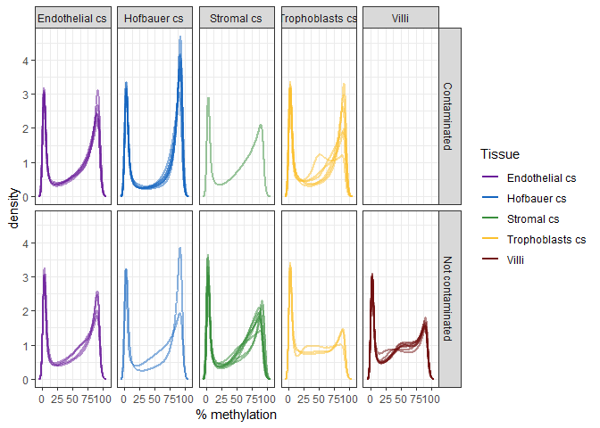<!-- -->

```r
ggplot(sample_densities, aes(x = x, y = y, color = Tissue, group = Sample_Name)) +
  geom_line(size = 1, alpha = 0.5) + theme_bw() +
  scale_x_continuous(breaks = c(0, 0.25, 0.5, 0.75, 1), labels = c(0, 25, 50, 75, 100))  +
  facet_wrap(~Tissue) +
  scale_color_manual(values = color_code_tissue[unique(pDat_first$Tissue)]) +
  guides(colour = guide_legend(override.aes = list(alpha = 1))) +
  geom_text_repel(data = sample_densities %>% 
                    filter(Sample_Name == 'PM364_hofb_cs', x > 0.55, x < 0.6) %>%
                    dplyr::slice(1),
                  aes(x = x, y = y, label = Sample_Name), inherit.aes = F,
                  nudge_y = 1, nudge_x = -0.1) +
  labs(x = '% methylation', y = 'density')
```

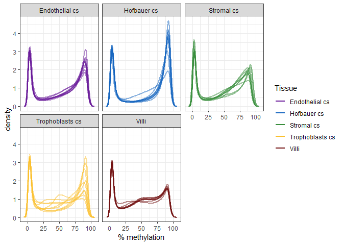<!-- -->

## PCA


```r
# compute pca
set.seed(1)
pca <- prcomp_irlba(t(betas_first), n = 20, center = T, scale = F)

# add pc scores to pdata
pca_scores <- pca$x[,1:20] %>% as.data.frame()
colnames(pca_scores) <- paste0(colnames(pca_scores), '_processed')
pDat_first <- pDat_first %>% 
  select(-contains('processed')) %>%
  bind_cols(pca_scores)

# create proportion variance explained data frame
pc_info <- summary(pca)$importance %>% 
  as.data.frame() %>% 
  tibble::rownames_to_column(var = 'variable') %>%
  gather(key = 'PC', value = 'value', -variable) %>%
  as_tibble() %>%
  mutate(PC = factor(as.character(PC), levels = paste0('PC', 1:20)),
         Label = ifelse(variable == 'Proportion of Variance',
                        paste0(PC, ' (', prettyNum(value*100, digits = 2), '%)'),
                        as.character(PC))) %>%
  arrange(variable, PC)

  
# correlate PCs with phenodata
pc_cor <- lmmatrix(dep = pca$x[,1:20, drop = F],
                   ind = pDat_first %>%
                   dplyr::select(Case_ID, Tissue, Sex,#bio
                                 Week, Chip_number, Row_numeric, Row_factor, Batch_BSC, # batch
                                 DNA_loaded, 
                                 failed_probes,
                                 cor_to_reference, Prob_SNP_outlier),
                   metric = 'Pvalue')
# plot data
pc_cor <- pc_cor %>% as.data.frame() %>% 
  
  # add dep variables
  mutate(dep = rownames(pc_cor)) %>%
  
  # reshape
  gather(PC, pval, -dep) %>%
  
  # pvalue categories
  mutate(pval_cat = factor(case_when(
    pval > 0.05  ~ '> 0.05',
    pval < 0.05 & pval > 0.01 ~ '< 0.05',
    pval < 0.01 & pval > 0.001 ~ '< 0.01',
    pval < 0.001 ~ '< 0.001'
  ), levels = c('> 0.05', '< 0.05','< 0.01', '< 0.001')),
  
  # make PC is encoded with proper levels!!!
  PC = factor(PC, levels = paste0('PC', 1:20))) %>% as_tibble()

# create color palette
colpal <- c('white', '#fee8c8', '#fdbb84', '#e34a33')
names(colpal) <- levels(pc_cor$pval_cat)

# relevel
pc_cor <- pc_cor %>% 
  mutate(dep = factor(dep, levels = c('Case_ID', 'Tissue', 'Sex',
                                     'Week', 'Chip_number', 'Row_numeric', 'Row_factor', 
                                     'Batch_BSC', # batch
                                     'DNA_loaded',
                                     'failed_probes',
                                     'cor_to_reference', 'Prob_SNP_outlier')))
                                     
p7 <- ggplot(pc_cor, aes(x = PC, y = dep, fill = pval_cat)) +
  geom_tile(col = 'lightgrey') + theme_bw() +
  scale_x_discrete(expand = c(0, 0), labels = 1:20) +
  scale_y_discrete(expand = c(0, 0)) +
  scale_fill_manual(values = colpal)  + 
  labs(y = '', fill = 'P value')

p8 <- ggplot(pc_info %>% filter(variable == 'Proportion of Variance') %>%
               mutate(value = value*100), 
             aes(x = PC, y = value)) +
  geom_bar(stat = 'identity') +
  theme_bw() + 
  scale_x_discrete(expand = c(0, 0), labels = 1:20) + 
  scale_y_continuous(expand = c(0, 0)) +
  labs(y = '% variance explained')

egg::ggarrange(p7, p8, heights = c(3,1))
```

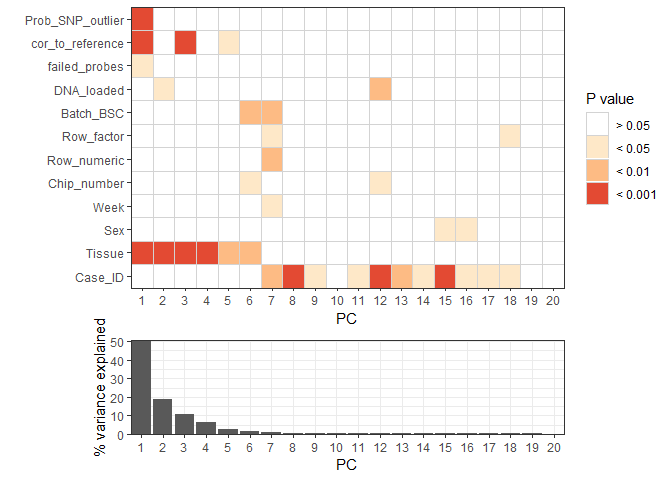<!-- -->

```r
# create another without all variables
var_interest <- c('Tissue', 'Sex', 'cor_to_reference','Case_ID',
                  'Week', 'Chip_number', 'Row_numeric', 'Row_factor', 'Batch_BSC')

p9 <- pc_cor %>% 
  filter(dep %in% var_interest) %>%
  mutate(dep = ifelse(dep %in% var_interest[5:10], paste0('TECH_', dep), as.character(dep))) %>%
  mutate(dep = factor(dep, levels = c('TECH_Week', 'TECH_Chip_number', 'TECH_Row_numeric',
                                      'TECH_Row_factor', 'TECH_Batch_BSC', 
                                      'cor_to_reference',  'Sex',
                                      'Case_ID', 'Tissue'))) %>%
  ggplot(aes(x = PC, y = dep, fill = pval_cat)) +
  geom_tile(col = 'lightgrey') + theme_bw() +
  scale_x_discrete(expand = c(0, 0), labels = 1:20) +
  scale_y_discrete(expand = c(0, 0)) +
  scale_fill_manual(values = colpal)  + 
  labs(y = '', fill = 'P value')

egg::ggarrange(p9, p8, heights = c(3,1))
```

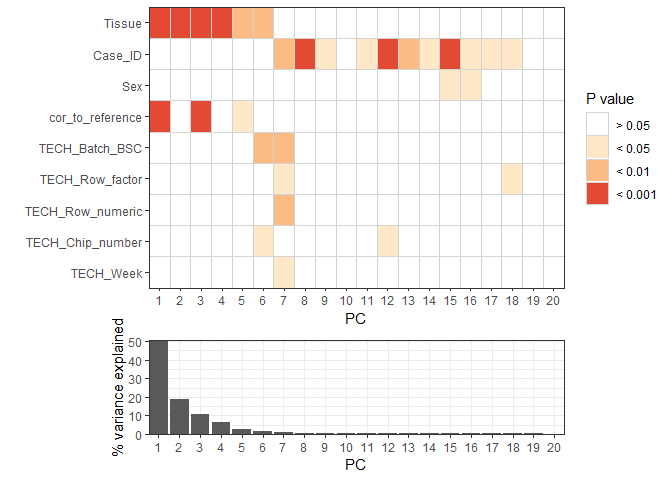<!-- -->


Scatterplots


```r
scatter <- function(x, y, fill, point_size = 1){
  xlab <- pc_info %>% filter(variable == 'Proportion of Variance', PC == x) %>% pull(Label)
  ylab <- pc_info %>% filter(variable == 'Proportion of Variance', PC == y) %>% pull(Label)
  
  x <- paste0(x, '_processed')
  y <- paste0(y, '_processed')
  
  out <- ggplot(pDat_first, aes_string(x = x, y = y, fill = fill)) +
    geom_point(shape = 21, size = point_size) + theme_bw() + labs(x = xlab, y = ylab) 
  
  if (is.numeric(as.data.frame(pDat_first)[,fill])){
    out <- out +
      scale_fill_viridis()
  } else {
    out <- out + 
      scale_fill_brewer(palette = 'Set1')
  }
    
  out
}

scatter(x = 'PC1', y = 'PC2', fill = 'Tissue', point_size = 2) +
  scale_fill_manual(values = color_code_tissue[unique(pDat_first$Tissue)])  +
  labs(fill = '')
```

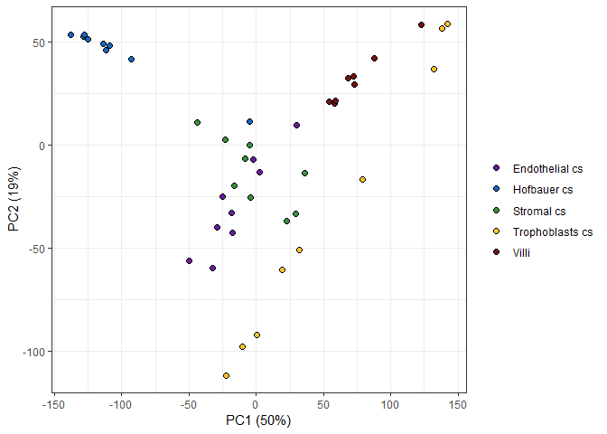<!-- -->

```r
scatter(x = 'PC1', y = 'PC2', fill = 'cor_to_reference', point_size = 2) 
```

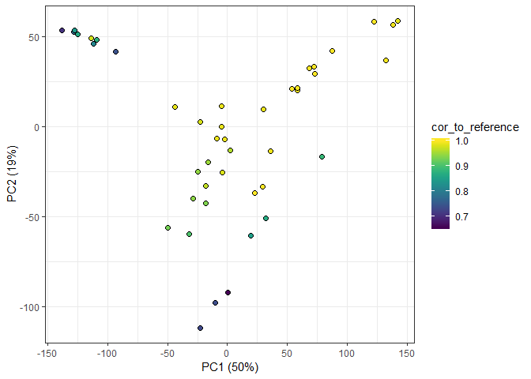<!-- -->

```r
scatter2 <- function(x) {
  xlab <- pc_info %>% filter(variable == 'Proportion of Variance', PC == x) %>% pull(Label)
  
  x <- paste0(x, '_processed')
  
  out <- ggplot(pDat_first, aes_string(x = x, y = 'cor_to_reference', fill = 'cor_to_reference')) +
            geom_point(shape = 21, size = 2) +
            theme_bw() +
            scale_fill_viridis() +
            facet_wrap(~Tissue, scales = 'free_x') +
            geom_smooth(method = 'lm') +
            stat_fit_glance(method = "lm", 
                            method.args = list(formula = y~x),
                            label.x = "left",
                            label.y = "top",
                            aes(label = sprintf('R^2~"="~%.3f~~italic(P)~"="~%.4f',
                                stat(r.squared), stat(p.value))),
                            parse = TRUE) +
            labs(x = xlab, y = 'Correlation to reference')

  out
}

scatter2(x = 'PC1')
```

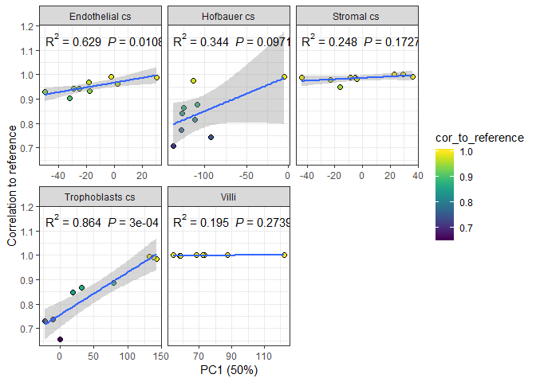<!-- -->

```r
scatter2(x = 'PC2')
```

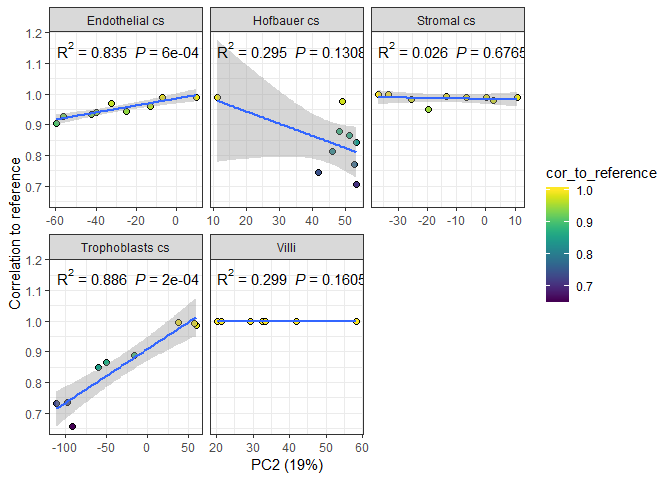<!-- -->

```r
scatter(x = 'PC3', y = 'PC4', fill = 'Tissue', point_size = 2) +
  scale_fill_manual(values = color_code_tissue[unique(pDat_first$Tissue)]) +
  labs(fill = '')
```

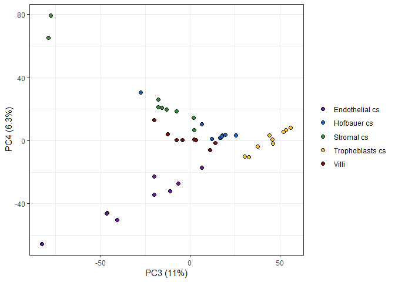<!-- -->

```r
scatter(x = 'PC3', y = 'PC4', fill = 'cor_to_reference', point_size = 2) 
```

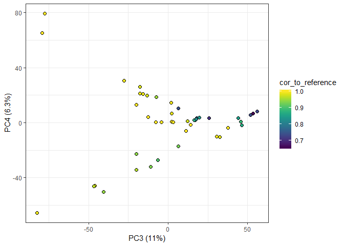<!-- -->

```r
scatter2(x = 'PC3')
```

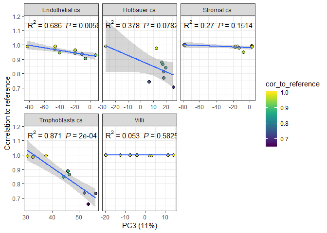<!-- -->

```r
scatter2(x = 'PC4')
```

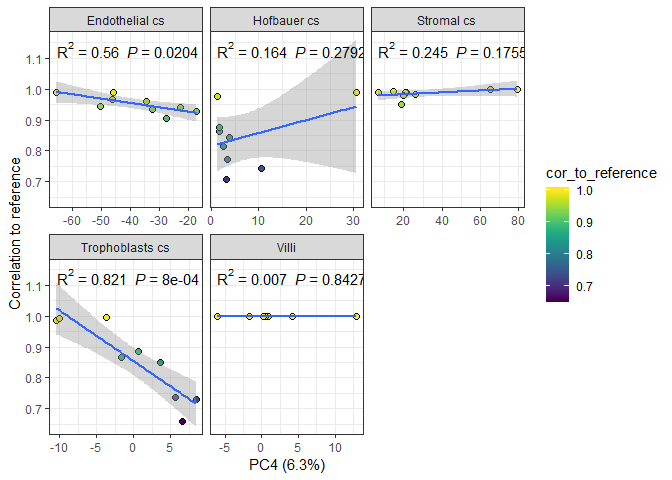<!-- -->

```r
scatter(x = 'PC5', y = 'PC6', fill = 'Tissue', point_size = 2) +
  scale_fill_manual(values = color_code_tissue[unique(pDat_first$Tissue)]) +
  labs(fill = '')
```

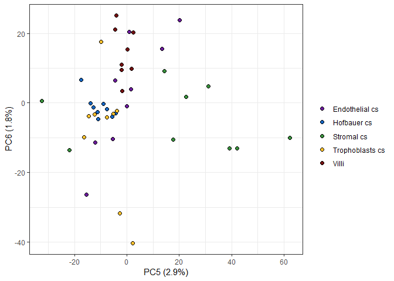<!-- -->

```r
scatter(x = 'PC5', y = 'PC6', fill = 'cor_to_reference', point_size = 2) 
```

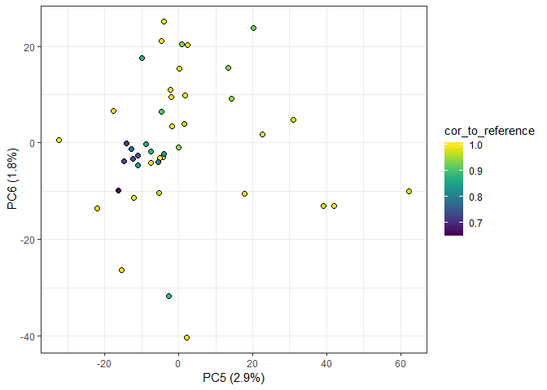<!-- -->

```r
scatter2(x = 'PC5')
```

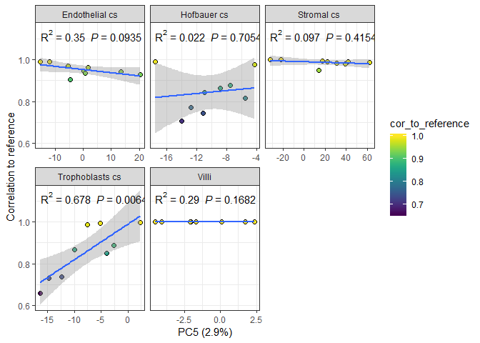<!-- -->

```r
scatter2(x = 'PC6')
```

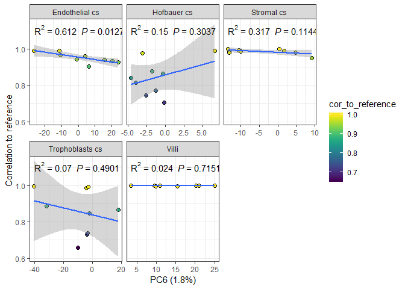<!-- -->

## Pairwise Correlation


```r
cor_betas <- cor(betas_first)

# annotation bar
annotation <- pDat_first %>% select(Tissue, Sex, cor_to_reference) %>% as.data.frame()
rownames(annotation) <- pDat_first$Sample_Name

#colors for heatmap
anno_colors <- list(
  Tissue = color_code_tissue[unique(pDat_first$Tissue)],
  Sex = setNames(color_code[[2]]$Colors_Sex, color_code[[2]]$Sex),
  cor_to_reference = viridis(n = 3, option = 'B')
)


# pheatmap
pheatmap(cor_betas, annotation_col = annotation, annotation_row = annotation[,'Tissue', drop = F],
         show_rownames = F, show_colnames = F,
         annotation_colors = anno_colors,
         color = viridis(100, option = 'B'),
         cutree_cols = 5)
```

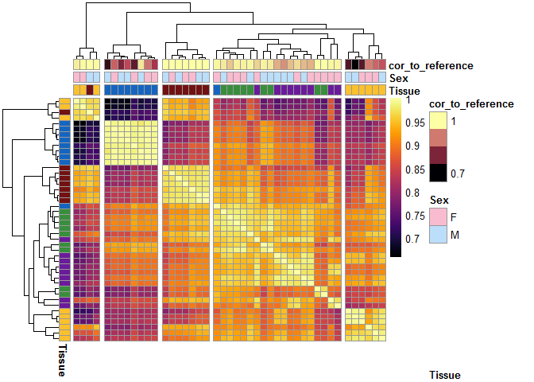<!-- -->


# 2.0 Linear modelling

## 1 vs all

Include Case_ID to adjust for the individual effect.
Drop the villi replicates

*	PL293_v_R1 - keep, less failed probes
* PL293_v_R2 - drop


```r
# drop villi replicates
n1 <- nrow(pDat_first)
pDat_first <- pDat_first %>% filter(!Sample_Name %in% 'PL293_v_R2')
n2 <- nrow(pDat_first)
print(paste(n1, 'samples filtered down to', n2))
```

```
## [1] "44 samples filtered down to 43"
```

```r
betas_first <- betas_first[,pDat_first$Sample_Name]
mvals_first <- mvals_first[,pDat_first$Sample_Name]
ncol(betas_first) == n2
```

```
## [1] TRUE
```

```r
ncol(mvals_first) == n2
```

```
## [1] TRUE
```

```r
# create a design matrix
design <- model.matrix(~0+Tissue + Case_ID + cor_to_reference + Tissue:cor_to_reference, 
                       data = pDat_first)
colnames(design) <- gsub('Tissue', '', gsub('Case_ID', '', colnames(design))) # rename columns
colnames(design) <-
  gsub('Endothelial cs', 'Endo_cs',
       gsub('Hofbauer cs', 'Hofb_cs',
            gsub('Trophoblasts cs', 'Troph_cs',
                 gsub('Stromal cs', 'Strom_cs',
                      gsub(':', '\\.', 
                           colnames(design))))))

# fit the linear model 
fit_m <- lmFit(mvals_first, design)

# fit contrasts
contMatrix_1vAll <- makeContrasts(Endo_cs - (Hofb_cs + Strom_cs + Troph_cs)/3,
                            Hofb_cs - (Endo_cs + Strom_cs + Troph_cs)/3,
                            Strom_cs - (Endo_cs + Hofb_cs + Troph_cs)/3,
                            Troph_cs - (Endo_cs + Hofb_cs + Strom_cs)/3,
                            levels=design)
fit_m <- contrasts.fit(fit_m, contMatrix_1vAll)
fit_m <- eBayes(fit_m) # moderate t stats

# pull out dmcs
dmcs <- broom::tidy(fit_m) %>%
  separate(term, into = c('Group1', 'Group2'), sep = '\\s-\\s', remove = F) %>%
  group_by(Group1, Group2) %>%
  mutate(fdr = p.adjust(p.value, method = "fdr"),
         bonferroni = p.adjust(p.value, method = 'bonferroni')) %>%
  ungroup() %>%
  select(-term, -Group2)

# add delta betas
fit_b <- lmFit(betas_first, design) %>% 
  contrasts.fit(contMatrix_1vAll) %>%
  eBayes %>%
  tidy() %>%
  separate(term, into = c('Group1', 'Group2'), sep = '\\s-\\s', remove = F) %>%
  dplyr::rename(delta_b = estimate) %>%
  select(gene, Group1, delta_b)
  
dmcs <- dmcs %>% left_join(fit_b) 
```

```
## Joining, by = c("gene", "Group1")
```


```r
# repeat without adjusting for contamination
design_noadj <- model.matrix(~0+Tissue + Case_ID, 
                       data = pDat_first)
colnames(design_noadj) <- gsub('Tissue', '', gsub('Case_ID', '', colnames(design_noadj))) # rename columns
colnames(design_noadj) <-
  gsub('Endothelial cs', 'Endo_cs',
       gsub('Hofbauer cs', 'Hofb_cs',
            gsub('Trophoblasts cs', 'Troph_cs',
                 gsub('Stromal cs', 'Strom_cs',
                      gsub(':', '\\.', 
                           colnames(design_noadj))))))
contMatrix_1vAll_noadj <- makeContrasts(Endo_cs - (Hofb_cs + Strom_cs + Troph_cs)/3,
                            Hofb_cs - (Endo_cs + Strom_cs + Troph_cs)/3,
                            Strom_cs - (Endo_cs + Hofb_cs + Troph_cs)/3,
                            Troph_cs - (Endo_cs + Hofb_cs + Strom_cs)/3,
                            levels=design_noadj)

# fit the linear model 
fit_m_noadj <- lmFit(mvals_first, design_noadj) %>%
  contrasts.fit(contMatrix_1vAll_noadj) %>%
  eBayes() %>%
  broom::tidy() %>%
  separate(term, into = c('Group1', 'Group2'), sep = '\\s-\\s') %>%
  group_by(Group1) %>%
  mutate(fdr = p.adjust(p.value, method = "fdr"),
         bonferroni = p.adjust(p.value, method = 'bonferroni'))  %>%
  ungroup() %>%
  select(-Group2)

# add delta betas
fit_b_noadj <- lmFit(betas_first, design_noadj) %>%
  contrasts.fit(contMatrix_1vAll_noadj) %>%
  eBayes() %>%
  tidy() %>%
  separate(term, into = c('Group1', 'Group2'), sep = '\\s-\\s') %>%
  dplyr::rename(delta_b = estimate) %>%
  select(gene, Group1, delta_b)

dmcs_noadj <- fit_m_noadj %>% left_join(fit_b_noadj)
```

```
## Joining, by = c("gene", "Group1")
```

```r
effects <- full_join(
  dmcs %>% group_by(Group1) %>%
    summarize(with_adj = sum(fdr < 0.01 & abs(delta_b) > 0.1)),
  dmcs_noadj %>% group_by(Group1) %>%
    summarize(without_adj = sum(fdr < 0.01 & abs(delta_b) > 0.1))) %>%
  gather(key = key, value = count, -Group1) 
```

```
## Joining, by = "Group1"
```

```r
effects %>% 
  ggplot(aes(x = key, y = count, color = Group1)) +
  geom_point() +
  geom_line(aes(group = Group1)) + theme_bw()
```

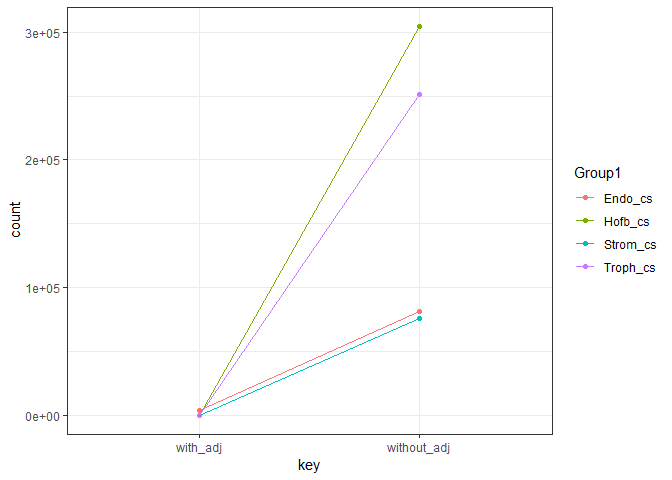<!-- -->


