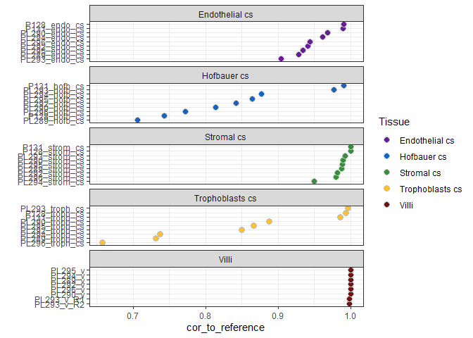
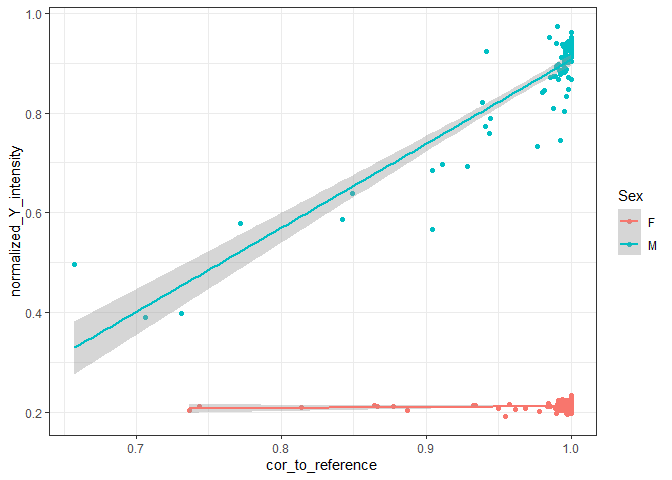
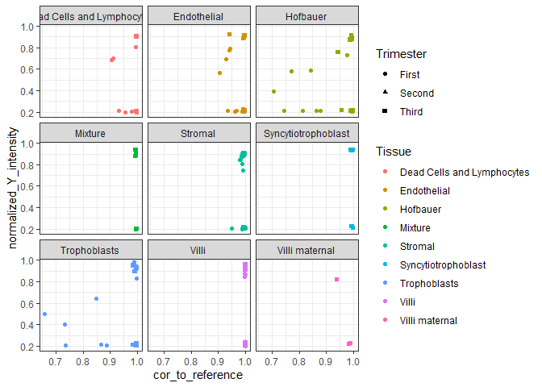
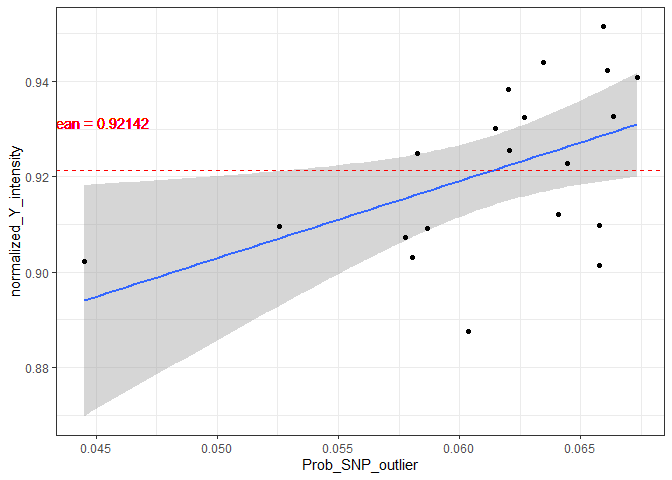
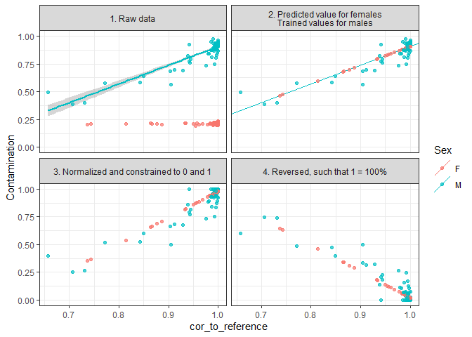
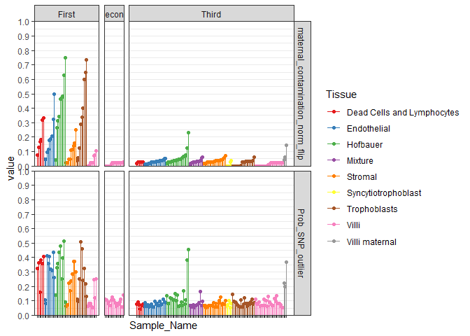
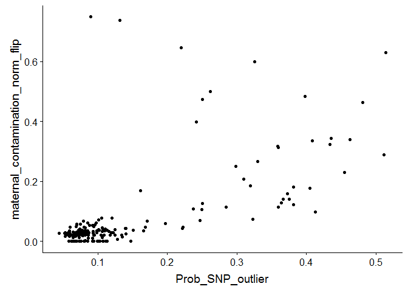
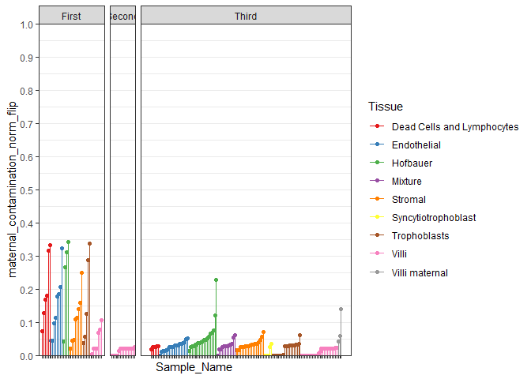
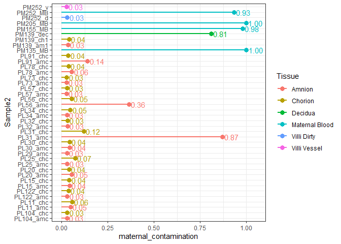

I'ved decided to analyze both first and third trimester samples together, after removing severely contaminated samples.

First it's important to consider the level of maternal contamination. Previously I hadn't been able to quantify the absolute levels of contamination. So first I develop and approach to do so, and then I do linear modelling.

# Setup

## Load libraries and data


```r
# libraries and data
library(ggplot2)
library(tidyverse)
library(ggrepel)
library(viridis)
library(scales)
library(RColorBrewer)
library(pheatmap)
library(irlba)
library(plomics) # 0.2 github/wvictor14/plomics
library(GGally)
library(cowplot)
library(umap)
library(dendextend)
library(stringr)
library(minfi)
library(ggridges)
library(ggpmisc)
library(egg)
```

## Data

Here I call 'syncytiotrophoblasts' into 'Trophoblasts enz' and add 'cs' suffixes to the cell sorted
samples.


```r
# pdata
pDat <- readRDS('../../data/main/interim/1_3_pDat.rds')

# filter to first trimester samples
pDat_first <- pDat %>%
  filter(Trimester == 'First', Tissue != 'Dead Cells and Lymphocytes') %>%
  
  # update tissue annotation
  mutate(Tissue = case_when(Tissue != 'Villi' ~ paste(Tissue, 'cs'),
                            Tissue == 'Villi' ~ Tissue))

# raw methylation data
betas <- readRDS('../../data/main/interim/1_4_betas_noob_filt.rds')
mset_noob <- readRDS('../../data/main/interim/1_4_mset_noob.rds')
colnames(mset_noob) <- colnames(betas) <- pDat$Sample_Name
mvals <- getM(mset_noob)

# filter to first trimester
mvals_first <- mvals[rownames(betas),pDat_first$Sample_Name]
betas_first <- betas[,pDat_first$Sample_Name]

# annotation
anno <- getAnnotation(mset_noob)
```

```
## Loading required package: IlluminaHumanMethylationEPICanno.ilm10b4.hg19
```

```r
anno <- anno %>%
  as_tibble() %>%
  filter(Name %in% rownames(betas_first)) # filter to filtered betas cpgs
probe_anno <- readRDS('../../data/main/interim/1_1_probe_anno.rds')

# snp data
snp_betas <- readRDS('../../data/main/interim/1_1_snp_betas.rds')

# color key
color_code <- readRDS('../../data/main/interim/1_1_color_code.rds')
color_code[[1]] <- color_code[[1]] %>% 
  mutate(label = ifelse(Tissue == 'Syncytiotrophoblast', 'Trophoblasts enz', Tissue)) %>%
  mutate(label = ifelse(!label %in% c('Trophoblasts enz', 'Villi', 'Villi maternal'), 
                        paste(label, 'cs'),
                        label),
         Colors_Tissue = ifelse(label == 'Villi', '#721111', Colors_Tissue),
         Colors_Tissue = ifelse(label == 'Trophoblasts enz', '#f4702e', Colors_Tissue))
saveRDS(color_code[[1]], '../../data/main/interim/2_3_color_code.rds')

color_code_tissue <- setNames(color_code[[1]]$Colors_Tissue, color_code[[1]]$label)
```

# Contamination

## Training

These are the levels of contamination that we are dealing with:

```r
pDat_first %>% arrange(Tissue, cor_to_reference) %>%
  mutate(Sample_Name = factor(Sample_Name, levels = Sample_Name)) %>%
  ggplot(aes(x = Sample_Name, y = cor_to_reference)) +
  geom_point(shape = 21, aes(fill = Tissue), color = 'grey', size = 3) +
  scale_fill_manual(values = color_code_tissue[unique(pDat_first$Tissue)]) +
  facet_wrap(~Tissue, scales = 'free_y', ncol = 1) + theme_bw() + labs(x = '') + coord_flip()
```

<!-- -->

But we can't equate this to % contamination because we don't have a clear reference point.

We can kind of tell based using the normalized Y intensity in males, because it will go to 0 as
they get closer to 100% maternal contamination


```r
p_c1 <- ggplot(pDat, aes(x = cor_to_reference, y = normalized_Y_intensity, color = Sex)) +
  geom_point() + theme_bw() + stat_smooth(method = 'lm');p_c1  
```

```
## Warning: Removed 3 rows containing non-finite values (stat_smooth).
```

```
## Warning: Removed 3 rows containing missing values (geom_point).
```

<!-- -->

```r
ggplot(pDat, aes(x = cor_to_reference, y = normalized_Y_intensity, Shape = Sex, color = Tissue,
                 shape = Trimester)) +
  geom_point() + theme_bw()  + facet_wrap(~Tissue)
```

```
## Warning: Removed 3 rows containing missing values (geom_point).
```

<!-- -->


```r
fit_ycor <-lm(normalized_Y_intensity ~ cor_to_reference, pDat %>% filter(Sex == 'M'))
summary(fit_ycor)
```

```
## 
## Call:
## lm(formula = normalized_Y_intensity ~ cor_to_reference, data = pDat %>% 
##     filter(Sex == "M"))
## 
## Residuals:
##      Min       1Q   Median       3Q      Max 
## -0.17820 -0.01625  0.00728  0.02685  0.16673 
## 
## Coefficients:
##                  Estimate Std. Error t value Pr(>|t|)    
## (Intercept)      -0.77467    0.07972  -9.717 1.11e-15 ***
## cor_to_reference  1.68078    0.08172  20.567  < 2e-16 ***
## ---
## Signif. codes:  0 '***' 0.001 '**' 0.01 '*' 0.05 '.' 0.1 ' ' 1
## 
## Residual standard error: 0.04923 on 90 degrees of freedom
##   (3 observations deleted due to missingness)
## Multiple R-squared:  0.8246,	Adjusted R-squared:  0.8226 
## F-statistic:   423 on 1 and 90 DF,  p-value: < 2.2e-16
```


`normalized_Y_intensity` is our measure of contamination for males.  With the maximum values 
representing samples that are nearly 100% fetal and 0 % contaminated with maternal DNA. The minimum 
value for males represent the most contaminated male samples. However we since we don't know the 
true levels of contamination of these samples, we can't comment if the minimum values in males 
represent 100% contamination / 0% fetal. However, instead we can say that the normalized_Y_intensity
mean for female samples can represent *what a male's normalized Y intensity value would look like if it was 100% contaminated with maternal cells*. 

Therefore, it makes sense to transform / normalize this range to:

1. Maximum -> the average `normalized_Y_intensity` for males when contamination is lowest 
2. Minimum -> the average `normalized_Y_intensity` for females.


For 1. It makes sense to use male samples with a low probability that SNPs are outliers instead of
the correlation to the reference villi. Because `cor_to_reference` assumes villi samples are 100%
not contaminated, whereas the probability of a SNP being an outlier is an unsupervised measure of
contamination. The only thing we need to be careful about is when a male sample is 100% contaminated
with maternal DNA, it's probability will also be 0, but these should be easy to spot if we look at
normalized_Y_intensity as well.

Here I look the top 20 male samples with the lowest probability of their SNPs being outliers, and 
calculate their average normalized Y intensity, this will represent our maximum value of the 
normalized range:


```r
# calculate minmum maximum of normalized range
pDat %>% 
  filter(Sex == 'M') %>% 
  arrange(Prob_SNP_outlier) %>% 
  select(Sample_Name, Sex, Prob_SNP_outlier, normalized_Y_intensity) %>% 
  
  # display top 30
  dplyr::slice(1:20) %>%
  as.data.frame() %>% {
    ggplot(., aes(x = Prob_SNP_outlier, y = normalized_Y_intensity)) +
      geom_smooth(method = 'lm') + geom_point() +
      geom_hline(., yintercept = mean(.$normalized_Y_intensity), 
                 linetype = 'dashed', color = 'red') +
      geom_text(x = min(.$Prob_SNP_outlier) + 0.0005, y = mean(.$normalized_Y_intensity) + 0.01,
                label = paste0('mean = ', formatC(mean(.$normalized_Y_intensity)), digits = 2), 
                col = 'red') +
      theme_bw()
}
```

```
## Warning in geom_hline(., yintercept = mean(.$normalized_Y_intensity), linetype = "dashed", : Using both `yintercept` and `mapping` may not have the desired result as mapping is overwritten if `yintercept` is specified
```

<!-- -->

```r
max_Y <- pDat %>% 
  filter(Sex == 'M') %>% 
  arrange(Prob_SNP_outlier) %>%
  dplyr::slice(1:20) %>%
  pull(normalized_Y_intensity) %>%
  mean()
```

Now for 1., the minimum of our normalized range will be the average female y intensity:


```r
min_Y <- pDat %>% filter(Sex == 'F') %>%
  pull(normalized_Y_intensity) %>%
  mean()

min_Y
```

```
## [1] 0.2123048
```

## Predict on females

To calculate our measure of contamination for females:

1. predict normalized_Y_intensity based on cor_to_reference using model trained in males
2. Normalize to 0 and 1, based on min and max
3. Samples falling outside of min and max are set to 0 and 1 respectively
4. Reverse the scale such that 1 is 100% maternal contamination and 0 is 0%

For females, we skip step 1, and do step 2. and 3.


```r
pDat <- pDat %>% 
  
  # 1.
  ## predict values for females
  mutate(maternal_contamination = predict(fit_ycor, pDat %>% select(cor_to_reference))) %>%
  
  ## set as normalized_y_intensity for males
  mutate(maternal_contamination = ifelse(Sex == 'M', normalized_Y_intensity, maternal_contamination)) %>%
  

  mutate(maternal_contamination_norm = case_when(
    
    #2.
    maternal_contamination > max_Y ~ 1,
    maternal_contamination < min_Y ~ 0,
    
    #3.
    TRUE ~ ((maternal_contamination - min_Y) / (max_Y - min_Y))
  )) %>%
  
  #4.
  mutate(maternal_contamination_norm_flip = 1-maternal_contamination_norm)

pDat %>%
  select(Sex, contains('maternal_contamination'), cor_to_reference, normalized_Y_intensity) %>%
  gather(key = step, value = Contamination, -Sex, -cor_to_reference) %>%
  mutate(step = factor(case_when(
    step == 'normalized_Y_intensity' ~ '1. Raw data',
    step == 'maternal_contamination' ~ '2. Predicted value for females\nTrained values for males',
    step == 'maternal_contamination_norm' ~ '3. Normalized and constrained to 0 and 1',
    step == 'maternal_contamination_norm_flip' ~ '4. Reversed, such that 1 = 100%'
  ), levels = c('1. Raw data', 
                '2. Predicted value for females\nTrained values for males',
                '3. Normalized and constrained to 0 and 1', 
                '4. Reversed, such that 1 = 100%'))) %>% 
  {
    ggplot(., aes(x = cor_to_reference, y = Contamination, color = Sex)) +
      geom_smooth(data = . %>% filter(step == '1. Raw data', Sex == 'M'), method = 'lm',
                  show.legend = F) +
      geom_abline(data = data.frame(slope = fit_ycor$coefficients[2], 
                                    intercept = fit_ycor$coefficients[1],
                                    step = c('2. Predicted value for females\nTrained values for males'),
                                    Sex = c('M')),
                  aes(slope = slope, intercept = intercept, color = Sex)) +
      geom_point(alpha = 0.7, size = 1.5) +
      facet_wrap(~step, ncol = 2) +
      theme_bw()
}
```

```
## Warning: Removed 3 rows containing non-finite values (stat_smooth).
```

```
## Warning: Removed 12 rows containing missing values (geom_point).
```

<!-- -->

One thing to note is that there are a large number of samples that are estimated to have 
contamination > 50%

I experiment removing samples with > 35% contamination.


```r
pDat %>% arrange(Tissue, maternal_contamination_norm_flip) %>% 
  mutate(Sample_Name = factor(as.character(Sample_Name), levels = Sample_Name)) %>%
  gather(key = Contamination, value = value, maternal_contamination_norm_flip, Prob_SNP_outlier) %>%
  ggplot(aes(x = Sample_Name, y = value, color = Tissue)) +
  geom_point() + 
  geom_segment(aes(y = 0, yend = value, 
                   x = Sample_Name, xend = Sample_Name))+
  scale_color_brewer(palette = 'Set1') +
  scale_y_continuous(limits = c(0,1), expand = c(0,0), breaks = seq(0,1, 0.1)) +
  scale_x_discrete(expand = c(0.05, 0.05)) +
  facet_grid(Contamination~Trimester, scales = 'free_x', space = 'free_x') +
  theme_bw() +
  theme(axis.text.x = element_blank(),
        panel.grid.minor.x = element_blank(),
        panel.grid.major.x = element_blank()) 
```

<!-- -->

```r
ggplot(pDat, aes(y = maternal_contamination_norm_flip, x = Prob_SNP_outlier)) +
  geom_point() 
```

<!-- -->

```r
pDat %>% arrange(Tissue, maternal_contamination_norm_flip) %>% 
  filter(maternal_contamination_norm_flip < 0.35) %>%
  mutate(Sample_Name = factor(as.character(Sample_Name), levels = Sample_Name)) %>%
  ggplot(aes(x = Sample_Name, y = maternal_contamination_norm_flip, color = Tissue)) +
  geom_point() + 
  geom_segment(aes(y = 0, yend = maternal_contamination_norm_flip, 
                   x = Sample_Name, xend = Sample_Name))+
  scale_color_brewer(palette = 'Set1') +
  scale_y_continuous(limits = c(0,1), expand = c(0,0), breaks = seq(0,1, 0.1)) +
  scale_x_discrete(expand = c(0.05, 0.05)) +
  facet_grid(.~Trimester, scales = 'free_x', space = 'free_x') +
  theme_bw() +
  theme(axis.text.x = element_blank(),
        panel.grid.minor.x = element_blank(),
        panel.grid.major.x = element_blank()) 
```

<!-- -->

```r
ggplot(pDat, aes(y = maternal_contamination_norm_flip, x = Prob_SNP_outlier)) +
  geom_point() 
```

<!-- -->

```r
# join to subsets first rtimester pdat
pDat_first <- pDat_first %>%
  left_join(pDat %>% select(Sample_Name, maternal_contamination_norm_flip))
```

```
## Joining, by = "Sample_Name"
```

maternal_contamination_norm_flip: final measure of absolute contamination

## Predict on mat blood

To test our approach we can apply the model to samples where we know (roguhly) the composition. For
example, maternal tissue such as blood or decidua should be 100% maternal. Here I load in mat blood
and decidua + other tissues from previously collected datasets:

First I define the function of our trained model


```r
# trained parameters
intercept <- fit_ycor$coefficients[1]
slope <- fit_ycor$coefficients[2]

infer_maternal <- function(x) {
  
  # 1. predict normalized_Y_intensity based on cor_to_reference using model trained in males
  y <- slope*x + intercept
  
  # 2 & 3 Normalize to 0 and 1, based on min and max, constrain to min max
  y_norm <- 
    
    case_when(
      #2.
      y > max_Y ~ 1,
      y < min_Y ~ 0,
      
      #3.
      TRUE ~ ((y - min_Y) / (max_Y - min_Y))
    )
  
  # 4. Reverse the scale such that 1 is 100% maternal contamination and 0 is 0%
  y_norm_flip <- 1 - y_norm
  
  return(y_norm_flip)
}

# check that this matches our previous manual calculation
pDat %>% filter(Sex == 'F') %>%
  mutate(out = infer_maternal(cor_to_reference)) %>%
  select(out, maternal_contamination_norm_flip)
```

```
## # A tibble: 97 x 2
##       out maternal_contamination_norm_flip
##     <dbl>                            <dbl>
##  1 0.0308                           0.0308
##  2 0.129                            0.129 
##  3 0.0215                           0.0215
##  4 0.0215                           0.0215
##  5 0.0321                           0.0321
##  6 0.0272                           0.0272
##  7 0.0292                           0.0292
##  8 0.0421                           0.0421
##  9 0.0342                           0.0342
## 10 0.0215                           0.0215
## # ... with 87 more rows
```

Now I read in other tissues:


```r
ss <- readxl::read_xlsx('Z:/ROBLAB6 Infinium450k John/Master_Sample_Sheet.xlsx')

table(ss$Tissue)
```

```
## 
##                         Amnion                        B Cells 
##                             21                              7 
##                          Blood                          Brain 
##                              7                             29 
##                         Buccal                    CD4 T Cells 
##                             43                              7 
##                    CD8 T Cells                        Chorion 
##                              6                             21 
##                           Cord                     Cord Blood 
##                              1                              7 
##   Cord Blood Mononuclear Cells          Cytotrophoblast Cells 
##                              6                             49 
##                         Debris                        Decidua 
##                              1                              3 
##                        Discard              Endothelial Cells 
##                              1                              1 
## Extravillous Trophoblast Cells               Fibroblast Cells 
##                             23                              1 
##                   Granulocytes                 Hofbauer Cells 
##                             15                              6 
##                         Kidney                 Maternal Blood 
##                             64                             20 
##                     Mesenchyme                      Monocytes 
##                              6                             23 
##                         Muscle           Natural Killer Cells 
##                             45                              7 
##      Nucleated Red Blood Cells                    Spinal Cord 
##                             24                             37 
##      Syncytiotrophoblast Cells                        T Cells 
##                             45                             15 
##              Trophoblast Cells                          Villi 
##                              5                            551 
##                    Villi Dirty                   Villi Vessel 
##                              5                              5 
##                         Villi? 
##                              1
```

```r
ss_matched <- ss %>% 
  filter(Platform != '27k') %>%
  group_by(Case_ID) %>%
  filter(any(Tissue %in% c('Maternal Blood', 'Amnion', 'Chorion', 'Decidua')) & 
           any(Tissue == 'Villi')) %>%
  ungroup() %>% arrange(desc(Platform), Case_ID, Tissue) %>%
  
  # remove duplicated rows
  group_by(Basename) %>% 
  dplyr::slice(1) %>%
  ungroup()

rgset_matched_450k <- read.metharray.exp(targets = ss_matched %>% filter(Platform == '450k'))
```

```
## Warning: Setting row names on a tibble is deprecated.
```

```r
rgset_matched_850k <- read.metharray.exp(targets = ss_matched %>% filter(Platform == '850k'))
```

```
## Warning: Setting row names on a tibble is deprecated.
```

```r
snps_matched_450k <- getSnpBeta(rgset_matched_450k)
```

```
## Loading required package: IlluminaHumanMethylation450kmanifest
```

```r
snps_matched_850k <- getSnpBeta(rgset_matched_850k)
```

```
## Loading required package: IlluminaHumanMethylationEPICmanifest
```

```r
colnames(snps_matched_450k) <- ss_matched %>% filter(Platform == '450k') %>% pull(Sample_Name)
colnames(snps_matched_850k) <- ss_matched %>% filter(Platform == '850k') %>% pull(Sample_Name)

# calculate for all pairwise comparisons
cor(snps_matched_450k)
```

```
##              PM139v2(1)    PL11v2v3     PL25v1v2    PL56v1v2    PM139_dec
## PM139v2(1)  1.000000000 -0.04351483  0.034832653  0.15551494  0.656957006
## PL11v2v3   -0.043514835  1.00000000  0.098022756  0.39789776 -0.122348222
## PL25v1v2    0.034832653  0.09802276  1.000000000  0.07821225  0.082115047
## PL56v1v2    0.155514940  0.39789776  0.078212248  1.00000000  0.056691495
## PM139_dec   0.656957006 -0.12234822  0.082115047  0.05669149  1.000000000
## PM139_am1   0.997151400 -0.04996460  0.049041668  0.13530914  0.653957268
## PM139_ch1   0.998017592 -0.03355871  0.046892841  0.15899560  0.653058004
## PM139v2     0.991227152 -0.07755702  0.038321107  0.12331248  0.669773559
## PL104       0.303322185 -0.02873458  0.131010486  0.18985952  0.162342945
## PM135      -0.008602493  0.17429147  0.156375788  0.27628217 -0.103906317
## PL32        0.318797069 -0.13925161  0.056098286  0.09787406  0.286435150
## PM135_MB    0.056493703  0.01339541  0.282631201  0.19879720 -0.006427502
## PM155_MB    0.117264280  0.17402702  0.003343900  0.10400886  0.145877237
## PM252_MB    0.234811938  0.06035283  0.165802476  0.06318232  0.104500535
## PM205      -0.222565296  0.05494450  0.017594322 -0.04496496 -0.085967147
## PM205_MB   -0.220525758 -0.10464823 -0.091071473  0.03408562 -0.155799765
## PM139       0.993311334 -0.05130941  0.049556591  0.13582809  0.668301010
## PM155       0.073102745  0.12043705  0.007002477  0.12145279 -0.087355882
## PM252_v     0.266120159  0.27139752  0.357200359  0.30168396  0.173694852
## PM252_d     0.273643305  0.26406605  0.366029879  0.27771171  0.185586780
## PM139_r2    0.982538666 -0.06495941  0.046648229  0.10002015  0.675101646
## PM252       0.265624434  0.25693372  0.361429433  0.28111910  0.170582536
##              PM139_am1    PM139_ch1      PM139v2       PL104        PM135
## PM139v2(1)  0.99715140  0.998017592  0.991227152  0.30332219 -0.008602493
## PL11v2v3   -0.04996460 -0.033558706 -0.077557022 -0.02873458  0.174291466
## PL25v1v2    0.04904167  0.046892841  0.038321107  0.13101049  0.156375788
## PL56v1v2    0.13530914  0.158995597  0.123312485  0.18985952  0.276282173
## PM139_dec   0.65395727  0.653058004  0.669773559  0.16234295 -0.103906317
## PM139_am1   1.00000000  0.998593380  0.995208169  0.28939865 -0.011829083
## PM139_ch1   0.99859338  1.000000000  0.992134457  0.29904078 -0.007813467
## PM139v2     0.99520817  0.992134457  1.000000000  0.29254070 -0.006063247
## PL104       0.28939865  0.299040777  0.292540705  1.00000000  0.193736000
## PM135      -0.01182908 -0.007813467 -0.006063247  0.19373600  1.000000000
## PL32        0.30516369  0.310983180  0.311636417  0.33597928  0.143777215
## PM135_MB    0.05784213  0.055043010  0.061982335  0.29512981  0.571178253
## PM155_MB    0.12338748  0.121028585  0.122251156 -0.12813020  0.229594159
## PM252_MB    0.23203045  0.234272753  0.223057078  0.28709363  0.219129670
## PM205      -0.21377379 -0.211462862 -0.197250044  0.01625554  0.140446606
## PM205_MB   -0.21611165 -0.207796716 -0.203747703  0.01674675  0.256375159
## PM139       0.99742689  0.995307790  0.996809811  0.29057589 -0.017066785
## PM155       0.07452052  0.075105772  0.066473029  0.25607082  0.397376106
## PM252_v     0.26582866  0.273594940  0.254757957  0.16567874  0.308465262
## PM252_d     0.27772594  0.283380929  0.271088004  0.16283599  0.310625209
## PM139_r2    0.98825681  0.983219313  0.994213952  0.29654362 -0.026477576
## PM252       0.26675993  0.273641022  0.257225940  0.15646504  0.305833153
##                   PL32     PM135_MB    PM155_MB    PM252_MB       PM205
## PM139v2(1)  0.31879707  0.056493703  0.11726428  0.23481194 -0.22256530
## PL11v2v3   -0.13925161  0.013395408  0.17402702  0.06035283  0.05494450
## PL25v1v2    0.05609829  0.282631201  0.00334390  0.16580248  0.01759432
## PL56v1v2    0.09787406  0.198797199  0.10400886  0.06318232 -0.04496496
## PM139_dec   0.28643515 -0.006427502  0.14587724  0.10450054 -0.08596715
## PM139_am1   0.30516369  0.057842133  0.12338748  0.23203045 -0.21377379
## PM139_ch1   0.31098318  0.055043010  0.12102859  0.23427275 -0.21146286
## PM139v2     0.31163642  0.061982335  0.12225116  0.22305708 -0.19725004
## PL104       0.33597928  0.295129806 -0.12813020  0.28709363  0.01625554
## PM135       0.14377722  0.571178253  0.22959416  0.21912967  0.14044661
## PL32        1.00000000  0.287015623 -0.17718041  0.34208453 -0.01504407
## PM135_MB    0.28701562  1.000000000 -0.01392407  0.06447104  0.03896640
## PM155_MB   -0.17718041 -0.013924074  1.00000000  0.05686214  0.08128338
## PM252_MB    0.34208453  0.064471039  0.05686214  1.00000000  0.03855221
## PM205      -0.01504407  0.038966405  0.08128338  0.03855221  1.00000000
## PM205_MB   -0.07995370  0.071999465  0.14386105 -0.05908977  0.58794162
## PM139       0.31044428  0.048931281  0.12006386  0.23264241 -0.21691955
## PM155      -0.02138427  0.238704210  0.59540978  0.29182006  0.06807139
## PM252_v     0.34542526  0.236311690  0.06475338  0.60449928  0.12078591
## PM252_d     0.34939291  0.237499745  0.08860870  0.61990049  0.12542911
## PM139_r2    0.31938261  0.054561444  0.11617394  0.22885842 -0.21078896
## PM252       0.35747559  0.229724687  0.06830952  0.61579471  0.12079927
##               PM205_MB       PM139        PM155     PM252_v     PM252_d
## PM139v2(1) -0.22052576  0.99331133  0.073102745  0.26612016  0.27364330
## PL11v2v3   -0.10464823 -0.05130941  0.120437054  0.27139752  0.26406605
## PL25v1v2   -0.09107147  0.04955659  0.007002477  0.35720036  0.36602988
## PL56v1v2    0.03408562  0.13582809  0.121452789  0.30168396  0.27771171
## PM139_dec  -0.15579976  0.66830101 -0.087355882  0.17369485  0.18558678
## PM139_am1  -0.21611165  0.99742689  0.074520523  0.26582866  0.27772594
## PM139_ch1  -0.20779672  0.99530779  0.075105772  0.27359494  0.28338093
## PM139v2    -0.20374770  0.99680981  0.066473029  0.25475796  0.27108800
## PL104       0.01674675  0.29057589  0.256070816  0.16567874  0.16283599
## PM135       0.25637516 -0.01706679  0.397376106  0.30846526  0.31062521
## PL32       -0.07995370  0.31044428 -0.021384271  0.34542526  0.34939291
## PM135_MB    0.07199946  0.04893128  0.238704210  0.23631169  0.23749974
## PM155_MB    0.14386105  0.12006386  0.595409781  0.06475338  0.08860870
## PM252_MB   -0.05908977  0.23264241  0.291820059  0.60449928  0.61990049
## PM205       0.58794162 -0.21691955  0.068071391  0.12078591  0.12542911
## PM205_MB    1.00000000 -0.22593983  0.040713678 -0.05278164 -0.04392956
## PM139      -0.22593983  1.00000000  0.074632975  0.26986227  0.28554329
## PM155       0.04071368  0.07463297  1.000000000  0.19882946  0.21969129
## PM252_v    -0.05278164  0.26986227  0.198829457  1.00000000  0.99279442
## PM252_d    -0.04392956  0.28554329  0.219691290  0.99279442  1.00000000
## PM139_r2   -0.22877911  0.99459650  0.068555121  0.25429957  0.27504309
## PM252      -0.04625566  0.27225523  0.202502727  0.99764425  0.99604389
##               PM139_r2       PM252
## PM139v2(1)  0.98253867  0.26562443
## PL11v2v3   -0.06495941  0.25693372
## PL25v1v2    0.04664823  0.36142943
## PL56v1v2    0.10002015  0.28111910
## PM139_dec   0.67510165  0.17058254
## PM139_am1   0.98825681  0.26675993
## PM139_ch1   0.98321931  0.27364102
## PM139v2     0.99421395  0.25722594
## PL104       0.29654362  0.15646504
## PM135      -0.02647758  0.30583315
## PL32        0.31938261  0.35747559
## PM135_MB    0.05456144  0.22972469
## PM155_MB    0.11617394  0.06830952
## PM252_MB    0.22885842  0.61579471
## PM205      -0.21078896  0.12079927
## PM205_MB   -0.22877911 -0.04625566
## PM139       0.99459650  0.27225523
## PM155       0.06855512  0.20250273
## PM252_v     0.25429957  0.99764425
## PM252_d     0.27504309  0.99604389
## PM139_r2    1.00000000  0.25860368
## PM252       0.25860368  1.00000000
```

```r
res_450k <- cor(snps_matched_450k) %>% as_tibble() %>% 
  mutate(Sample1 = colnames(.)) %>% 
  
  # add case_ID and tissue
  left_join(ss_matched %>% select(Sample_Name, Case_ID, Tissue), by = c('Sample1' = 'Sample_Name')) %>%
  
  # longate the dataframe, each row is a single pairwise comparison
  gather(key = 'Sample2', value = 'Cor', -Sample1, -Case_ID, -Tissue) %>%
  
  # pData needs to refer to the right sample (1 or 2)
  dplyr::rename(Case_ID1 = Case_ID, Tissue1 = Tissue) %>%
  
  # add info for sample 2
  left_join(ss_matched %>% select(Sample_Name, Case_ID, Tissue), by = c('Sample2' = 'Sample_Name')) %>%
  dplyr::rename(Case_ID2 = Case_ID, Tissue2 = Tissue) %>% 
  
  # only interested in within-case comparisons, not to each other
  filter(Case_ID1 == Case_ID2, Sample1 != Sample2,
         Tissue1 == 'Villi', Tissue2 != 'Villi') %>%
  
  # for samples with more than one villi, take the mean correlation to all of theme
  group_by(Sample2) %>%
  summarize(cor_to_villi = mean(Cor)) %>%
  
  left_join(ss_matched %>% select(Sample_Name, Tissue, Case_ID), by = c('Sample2' = 'Sample_Name')) %>%
  
  # calculat maternal contam
  mutate(maternal_contamination = infer_maternal(cor_to_villi))

# repeat for 850k
res_850k <- cor(snps_matched_850k) %>% as_tibble() %>% 
  mutate(Sample1 = colnames(.)) %>% 
  left_join(ss_matched %>% select(Sample_Name, Case_ID, Tissue), by = c('Sample1' = 'Sample_Name')) %>%
  gather(key = 'Sample2', value = 'Cor', -Sample1, -Case_ID, -Tissue) %>%
  dplyr::rename(Case_ID1 = Case_ID, Tissue1 = Tissue) %>%
  left_join(ss_matched %>% select(Sample_Name, Case_ID, Tissue), by = c('Sample2' = 'Sample_Name')) %>%
  dplyr::rename(Case_ID2 = Case_ID, Tissue2 = Tissue) %>% 
  filter(Case_ID1 == Case_ID2, Sample1 != Sample2,
         Tissue1 == 'Villi', Tissue2 != 'Villi') %>%
  group_by(Sample2) %>%
  summarize(cor_to_villi = mean(Cor)) %>%
  left_join(ss_matched %>% select(Sample_Name, Tissue, Case_ID), by = c('Sample2' = 'Sample_Name')) %>%
  mutate(maternal_contamination = infer_maternal(cor_to_villi))

res <- bind_rows(res_850k, res_450k) 

# plot
res %>%
  ggplot(aes(x = Sample2, y = maternal_contamination, color = Tissue)) +
  geom_point(size = 3) +
  geom_segment(aes(y = 0, yend = maternal_contamination, 
                   x = Sample2, xend = Sample2), size = 1) +
  geom_text(data = . %>%
              mutate(label = formatC(maternal_contamination, 2, format = 'f')),
            aes(label = label), nudge_y = 0.05, show.legend = F) +
  theme_bw() + 
  coord_flip()
```

<!-- -->

PL31 is a case of funisitis, a condition associated with heavy maternal leukocyte infiltration.

# save data


```r
saveRDS(pDat, '../../data/main/interim/2_3_pDat_contam.rds')
saveRDS(res, '../../data/main/interim/2_3_mat_contam_results.rds')
```


