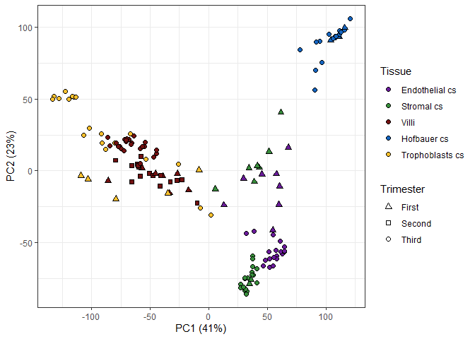
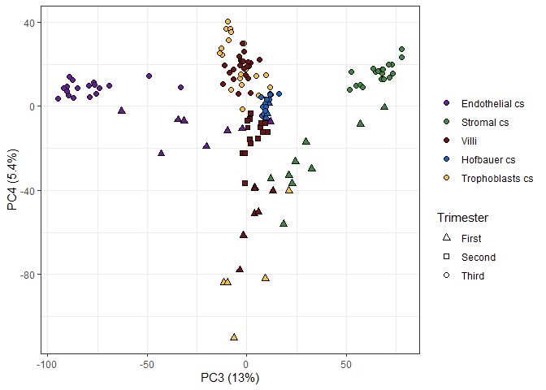
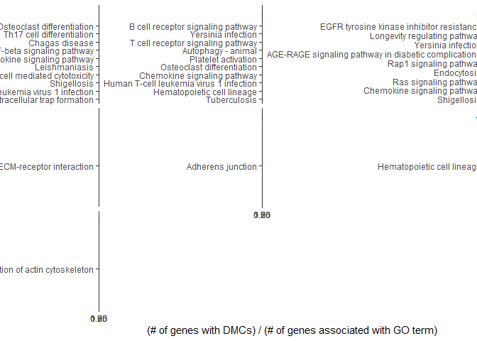

# Setup

## Libraries


```r
# libraries and data
library(ggplot2)
library(tidyverse)
```

```
## -- Attaching packages ----------------------------------------------- tidyverse 1.2.1 --
```

```
## v tibble  2.1.3     v purrr   0.3.2
## v tidyr   0.8.3     v dplyr   0.8.1
## v readr   1.3.1     v stringr 1.4.0
## v tibble  2.1.3     v forcats 0.4.0
```

```
## -- Conflicts -------------------------------------------------- tidyverse_conflicts() --
## x dplyr::filter() masks stats::filter()
## x dplyr::lag()    masks stats::lag()
```

```r
library(ggrepel)
library(viridis)
```

```
## Loading required package: viridisLite
```

```r
library(scales)
```

```
## 
## Attaching package: 'scales'
```

```
## The following object is masked from 'package:viridis':
## 
##     viridis_pal
```

```
## The following object is masked from 'package:purrr':
## 
##     discard
```

```
## The following object is masked from 'package:readr':
## 
##     col_factor
```

```r
library(RColorBrewer)
library(pheatmap)
library(irlba)
```

```
## Loading required package: Matrix
```

```
## 
## Attaching package: 'Matrix'
```

```
## The following object is masked from 'package:tidyr':
## 
##     expand
```

```r
library(plomics) # 0.2 github/wvictor14/plomics
library(GGally)
```

```
## Registered S3 method overwritten by 'GGally':
##   method from   
##   +.gg   ggplot2
```

```
## 
## Attaching package: 'GGally'
```

```
## The following object is masked from 'package:dplyr':
## 
##     nasa
```

```r
library(cowplot)
```

```
## 
## Attaching package: 'cowplot'
```

```
## The following object is masked from 'package:ggplot2':
## 
##     ggsave
```

```r
library(umap)
library(dendextend)
```

```
## 
## ---------------------
## Welcome to dendextend version 1.12.0
## Type citation('dendextend') for how to cite the package.
## 
## Type browseVignettes(package = 'dendextend') for the package vignette.
## The github page is: https://github.com/talgalili/dendextend/
## 
## Suggestions and bug-reports can be submitted at: https://github.com/talgalili/dendextend/issues
## Or contact: <tal.galili@gmail.com>
## 
## 	To suppress this message use:  suppressPackageStartupMessages(library(dendextend))
## ---------------------
```

```
## 
## Attaching package: 'dendextend'
```

```
## The following object is masked from 'package:stats':
## 
##     cutree
```

```r
library(stringr)
library(minfi)
```

```
## Loading required package: BiocGenerics
```

```
## Loading required package: parallel
```

```
## 
## Attaching package: 'BiocGenerics'
```

```
## The following objects are masked from 'package:parallel':
## 
##     clusterApply, clusterApplyLB, clusterCall, clusterEvalQ,
##     clusterExport, clusterMap, parApply, parCapply, parLapply,
##     parLapplyLB, parRapply, parSapply, parSapplyLB
```

```
## The following object is masked from 'package:Matrix':
## 
##     which
```

```
## The following objects are masked from 'package:dplyr':
## 
##     combine, intersect, setdiff, union
```

```
## The following objects are masked from 'package:stats':
## 
##     IQR, mad, sd, var, xtabs
```

```
## The following objects are masked from 'package:base':
## 
##     anyDuplicated, append, as.data.frame, basename, cbind,
##     colnames, dirname, do.call, duplicated, eval, evalq, Filter,
##     Find, get, grep, grepl, intersect, is.unsorted, lapply, Map,
##     mapply, match, mget, order, paste, pmax, pmax.int, pmin,
##     pmin.int, Position, rank, rbind, Reduce, rownames, sapply,
##     setdiff, sort, table, tapply, union, unique, unsplit, which,
##     which.max, which.min
```

```
## Loading required package: GenomicRanges
```

```
## Loading required package: stats4
```

```
## Loading required package: S4Vectors
```

```
## 
## Attaching package: 'S4Vectors'
```

```
## The following object is masked from 'package:Matrix':
## 
##     expand
```

```
## The following objects are masked from 'package:dplyr':
## 
##     first, rename
```

```
## The following object is masked from 'package:tidyr':
## 
##     expand
```

```
## The following object is masked from 'package:base':
## 
##     expand.grid
```

```
## Loading required package: IRanges
```

```
## 
## Attaching package: 'IRanges'
```

```
## The following objects are masked from 'package:dplyr':
## 
##     collapse, desc, slice
```

```
## The following object is masked from 'package:purrr':
## 
##     reduce
```

```
## The following object is masked from 'package:grDevices':
## 
##     windows
```

```
## Loading required package: GenomeInfoDb
```

```
## Loading required package: SummarizedExperiment
```

```
## Loading required package: Biobase
```

```
## Welcome to Bioconductor
## 
##     Vignettes contain introductory material; view with
##     'browseVignettes()'. To cite Bioconductor, see
##     'citation("Biobase")', and for packages 'citation("pkgname")'.
```

```
## Loading required package: DelayedArray
```

```
## Loading required package: matrixStats
```

```
## 
## Attaching package: 'matrixStats'
```

```
## The following objects are masked from 'package:Biobase':
## 
##     anyMissing, rowMedians
```

```
## The following object is masked from 'package:dplyr':
## 
##     count
```

```
## Loading required package: BiocParallel
```

```
## 
## Attaching package: 'DelayedArray'
```

```
## The following objects are masked from 'package:matrixStats':
## 
##     colMaxs, colMins, colRanges, rowMaxs, rowMins, rowRanges
```

```
## The following object is masked from 'package:purrr':
## 
##     simplify
```

```
## The following objects are masked from 'package:base':
## 
##     aperm, apply, rowsum
```

```
## Loading required package: Biostrings
```

```
## Loading required package: XVector
```

```
## 
## Attaching package: 'XVector'
```

```
## The following object is masked from 'package:purrr':
## 
##     compact
```

```
## 
## Attaching package: 'Biostrings'
```

```
## The following object is masked from 'package:DelayedArray':
## 
##     type
```

```
## The following object is masked from 'package:dendextend':
## 
##     nnodes
```

```
## The following object is masked from 'package:base':
## 
##     strsplit
```

```
## Loading required package: bumphunter
```

```
## Loading required package: foreach
```

```
## 
## Attaching package: 'foreach'
```

```
## The following objects are masked from 'package:purrr':
## 
##     accumulate, when
```

```
## Loading required package: iterators
```

```
## Loading required package: locfit
```

```
## locfit 1.5-9.1 	 2013-03-22
```

```
## Setting options('download.file.method.GEOquery'='auto')
```

```
## Setting options('GEOquery.inmemory.gpl'=FALSE)
```

```r
library(ggridges)
```

```
## 
## Attaching package: 'ggridges'
```

```
## The following object is masked from 'package:ggplot2':
## 
##     scale_discrete_manual
```

```r
library(ggpmisc)
```

```
## For news about 'ggpmisc', please, see https://www.r4photobiology.info/
```

```r
library(egg)
```

```
## Loading required package: gridExtra
```

```
## 
## Attaching package: 'gridExtra'
```

```
## The following object is masked from 'package:minfi':
## 
##     combine
```

```
## The following object is masked from 'package:Biobase':
## 
##     combine
```

```
## The following object is masked from 'package:BiocGenerics':
## 
##     combine
```

```
## The following object is masked from 'package:dplyr':
## 
##     combine
```

```r
library(limma)
```

```
## 
## Attaching package: 'limma'
```

```
## The following object is masked from 'package:BiocGenerics':
## 
##     plotMA
```

```r
library(broom)
library(missMethyl)
```

```
## 
```

```
## 
```

```r
library(kableExtra)
```

```
## 
## Attaching package: 'kableExtra'
```

```
## The following object is masked from 'package:dplyr':
## 
##     group_rows
```

```r
library(DMRcate)
```

```
## Loading required package: DSS
```

```
## Loading required package: bsseq
```

```
## Registered S3 method overwritten by 'R.oo':
##   method        from       
##   throw.default R.methodsS3
```

```
## 
## Attaching package: 'bsseq'
```

```
## The following object is masked from 'package:minfi':
## 
##     getMeth
```

```
## Loading required package: splines
```

```
## Loading required package: DMRcatedata
```

```r
library(biobroom)
```

```
## Registered S3 methods overwritten by 'biobroom':
##   method      from 
##   glance.list broom
##   tidy.list   broom
```

```r
library(IlluminaHumanMethylationEPICanno.ilm10b4.hg19)
```

## Data


```r
pDat <- readRDS('../../data/main/interim/2_3_pDat_contam.rds')
pDat <- pDat %>%
  mutate(Tissue = case_when(
    !(Tissue %in% c('Villi', 'Villi maternal', 'Syncytiotrophoblast')) ~ paste(Tissue, 'cs'),
    Tissue == 'Syncytiotrophoblast' ~ 'Trophoblasts enz',
    TRUE ~ Tissue
  )) 

# raw methylation data
betas <- readRDS('../../data/main/interim/1_4_betas_noob_filt.rds')

mset_noob <- readRDS('../../data/main/interim/1_4_mset_noob.rds') # for mvals
colnames(mset_noob) <- colnames(betas) <- pDat$Sample_Name
mvals <- getM(mset_noob)

# annotation
anno <- readRDS('Z:/Victor/Repositories/EPIC_annotation/hg19_epic_annotation.rds')
anno <- anno %>%
  as_tibble() %>%
  filter(cpg %in% rownames(betas)) # filter to filtered betas cpgs
probe_anno <- readRDS('../../data/main/interim/1_1_probe_anno.rds')

# color key
pheatmap_color_code <- readRDS('../../data/main/interim/1_1_color_code.rds')

color_code <- readRDS('../../data/main/interim/2_3_color_code.rds')
color_code_tissue <- setNames(color_code$Colors_Tissue, color_code$label)
```

## Remove contaminated samples

Here I remove samples with > 35% maternal contamination based on previous analyses.


```r
#Before contamination
pDat %>%
  filter(!Tissue %in% c('Villi maternal', 'Trophoblasts enz', 'Mixture cs', 'Dead Cells and Lymphocytes cs')) %>%
  arrange(Tissue, maternal_contamination_norm_flip) %>% 
  mutate(Sample_Name = factor(as.character(Sample_Name), levels = Sample_Name)) %>%
  ggplot(aes(x = Sample_Name, y = maternal_contamination_norm_flip, color = Tissue)) +
  geom_point() + 
  geom_segment(aes(y = 0, yend = maternal_contamination_norm_flip, 
                   x = Sample_Name, xend = Sample_Name))+
  scale_color_manual(values = color_code_tissue) +
  scale_y_continuous(limits = c(0,1), expand = c(0,0), breaks = seq(0,1, 0.1)) +
  scale_x_discrete(expand = c(0.05, 0.05)) +
  facet_grid(Trimester~., scales = 'free_y', space = 'free_y') +
  theme_bw() +
  theme(axis.text.y = element_blank(),
        panel.grid.minor.y = element_blank(),
        panel.grid.major.y = element_blank(),
        axis.title.y = element_text(angle = 0, vjust = 0.5))  +
  labs(x = 'Samples', y = 'Maternal contamination') +
  coord_flip() +
  geom_hline(yintercept = 0.35, col = 'red', linetype = 'dashed')
```

<!-- -->

```r
# after
pDat %>%
  filter(!Tissue %in% c('Villi maternal', 'Trophoblasts enz', 'Mixture cs', 'Dead Cells and Lymphocytes cs')) %>%
  arrange(Tissue, maternal_contamination_norm_flip) %>% 
  mutate(Sample_Name = factor(as.character(Sample_Name), levels = Sample_Name)) %>%
  filter(maternal_contamination_norm_flip < 0.35) %>%
  ggplot(aes(x = Sample_Name, y = maternal_contamination_norm_flip, color = Tissue)) +
  geom_point() + 
  geom_segment(aes(y = 0, yend = maternal_contamination_norm_flip, 
                   x = Sample_Name, xend = Sample_Name))+
  scale_color_manual(values = color_code_tissue) +
  scale_y_continuous(limits = c(0,1), expand = c(0,0), breaks = seq(0,1, 0.1)) +
  scale_x_discrete(expand = c(0.05, 0.05)) +
  facet_grid(Trimester~., scales = 'free_y', space = 'free_y') +
  theme_bw() +
  theme(axis.text.y = element_blank(),
        panel.grid.minor.y = element_blank(),
        panel.grid.major.y = element_blank())  +
  labs(x = 'Samples', y = 'Maternal contamination') +
  coord_flip() +
  geom_hline(yintercept = 0.35, col = 'red', linetype = 'dashed')
```

<!-- -->

```r
#summarize filtering
x <- pDat %>%
  group_by(Trimester, Tissue) %>%
  summarize(Before_filter = n())
y <- pDat %>%
  filter(maternal_contamination_norm_flip < 0.35) %>%
  group_by(Trimester, Tissue) %>%
  summarize(After_filter = n())
removed_df <- x %>% 
  ungroup %>%
  mutate(After_filter = y$After_filter,
         Number_removed = Before_filter-After_filter)

removed_df %>%
  kable(align = 'c', escape = F) %>%
  kable_styling(c("striped", "condensed"),full_width = F) %>%
  row_spec(which(removed_df$Number_removed>0), bold = T) 
```

<table class="table table-striped table-condensed" style="width: auto !important; margin-left: auto; margin-right: auto;">
 <thead>
  <tr>
   <th style="text-align:center;"> Trimester </th>
   <th style="text-align:center;"> Tissue </th>
   <th style="text-align:center;"> Before_filter </th>
   <th style="text-align:center;"> After_filter </th>
   <th style="text-align:center;"> Number_removed </th>
  </tr>
 </thead>
<tbody>
  <tr>
   <td style="text-align:center;"> First </td>
   <td style="text-align:center;"> Dead Cells and Lymphocytes cs </td>
   <td style="text-align:center;"> 6 </td>
   <td style="text-align:center;"> 6 </td>
   <td style="text-align:center;"> 0 </td>
  </tr>
  <tr>
   <td style="text-align:center;font-weight: bold;"> First </td>
   <td style="text-align:center;font-weight: bold;"> Endothelial cs </td>
   <td style="text-align:center;font-weight: bold;"> 9 </td>
   <td style="text-align:center;font-weight: bold;"> 8 </td>
   <td style="text-align:center;font-weight: bold;"> 1 </td>
  </tr>
  <tr>
   <td style="text-align:center;font-weight: bold;"> First </td>
   <td style="text-align:center;font-weight: bold;"> Hofbauer cs </td>
   <td style="text-align:center;font-weight: bold;"> 9 </td>
   <td style="text-align:center;font-weight: bold;"> 4 </td>
   <td style="text-align:center;font-weight: bold;"> 5 </td>
  </tr>
  <tr>
   <td style="text-align:center;"> First </td>
   <td style="text-align:center;"> Stromal cs </td>
   <td style="text-align:center;"> 9 </td>
   <td style="text-align:center;"> 9 </td>
   <td style="text-align:center;"> 0 </td>
  </tr>
  <tr>
   <td style="text-align:center;font-weight: bold;"> First </td>
   <td style="text-align:center;font-weight: bold;"> Trophoblasts cs </td>
   <td style="text-align:center;font-weight: bold;"> 9 </td>
   <td style="text-align:center;font-weight: bold;"> 5 </td>
   <td style="text-align:center;font-weight: bold;"> 4 </td>
  </tr>
  <tr>
   <td style="text-align:center;"> First </td>
   <td style="text-align:center;"> Villi </td>
   <td style="text-align:center;"> 8 </td>
   <td style="text-align:center;"> 8 </td>
   <td style="text-align:center;"> 0 </td>
  </tr>
  <tr>
   <td style="text-align:center;"> Second </td>
   <td style="text-align:center;"> Villi </td>
   <td style="text-align:center;"> 16 </td>
   <td style="text-align:center;"> 16 </td>
   <td style="text-align:center;"> 0 </td>
  </tr>
  <tr>
   <td style="text-align:center;"> Third </td>
   <td style="text-align:center;"> Dead Cells and Lymphocytes cs </td>
   <td style="text-align:center;"> 6 </td>
   <td style="text-align:center;"> 6 </td>
   <td style="text-align:center;"> 0 </td>
  </tr>
  <tr>
   <td style="text-align:center;"> Third </td>
   <td style="text-align:center;"> Endothelial cs </td>
   <td style="text-align:center;"> 19 </td>
   <td style="text-align:center;"> 19 </td>
   <td style="text-align:center;"> 0 </td>
  </tr>
  <tr>
   <td style="text-align:center;"> Third </td>
   <td style="text-align:center;"> Hofbauer cs </td>
   <td style="text-align:center;"> 19 </td>
   <td style="text-align:center;"> 19 </td>
   <td style="text-align:center;"> 0 </td>
  </tr>
  <tr>
   <td style="text-align:center;"> Third </td>
   <td style="text-align:center;"> Mixture cs </td>
   <td style="text-align:center;"> 12 </td>
   <td style="text-align:center;"> 12 </td>
   <td style="text-align:center;"> 0 </td>
  </tr>
  <tr>
   <td style="text-align:center;"> Third </td>
   <td style="text-align:center;"> Stromal cs </td>
   <td style="text-align:center;"> 19 </td>
   <td style="text-align:center;"> 19 </td>
   <td style="text-align:center;"> 0 </td>
  </tr>
  <tr>
   <td style="text-align:center;"> Third </td>
   <td style="text-align:center;"> Trophoblasts cs </td>
   <td style="text-align:center;"> 19 </td>
   <td style="text-align:center;"> 19 </td>
   <td style="text-align:center;"> 0 </td>
  </tr>
  <tr>
   <td style="text-align:center;"> Third </td>
   <td style="text-align:center;"> Trophoblasts enz </td>
   <td style="text-align:center;"> 5 </td>
   <td style="text-align:center;"> 5 </td>
   <td style="text-align:center;"> 0 </td>
  </tr>
  <tr>
   <td style="text-align:center;"> Third </td>
   <td style="text-align:center;"> Villi </td>
   <td style="text-align:center;"> 24 </td>
   <td style="text-align:center;"> 24 </td>
   <td style="text-align:center;"> 0 </td>
  </tr>
  <tr>
   <td style="text-align:center;"> Third </td>
   <td style="text-align:center;"> Villi maternal </td>
   <td style="text-align:center;"> 3 </td>
   <td style="text-align:center;"> 3 </td>
   <td style="text-align:center;"> 0 </td>
  </tr>
</tbody>
</table>

## Remove outliers

Previsouly had flagged term and 1st trimester samples with odd methylation profiles. Here I remove
these.

I previously stated in 2_1_Term_contamination.Rmd that I would remove hofbauer samples PM366, PM381 due
to contamination. However these are all below our contamination threshold. Therefore I just remove
PM364, since this ample appeared to be highly 'trophoblastic' with respect to DNA methylation.


I also remove: 
* tissues that I won't look at for this analysis.
* replicates
*P131_hofb_cs as we think is contaminated with endo/stromal cells


```r
pDat_filt <- pDat %>% 
  filter(maternal_contamination_norm_flip < 0.35,
         !Sample_Name %in% c('PM364_hofb_cs', 'PL293_v_R2', 'PM366_vc_R2', 'P131_hofb_cs'),
         !Tissue %in% c('Villi maternal', 'Trophoblasts enz', 'Mixture cs', 'Dead Cells and Lymphocytes cs'))

# filter to first trimester
mvals_filt <- mvals[rownames(betas),pDat_filt$Sample_Name]
betas_filt <- betas[,pDat_filt$Sample_Name]
```


# 1.0 Global methylation

## Density distributions

Here we plot the density distributions of the betas across each tissue

Density for each sample:


```r
#calculate densities
sample_densities <- pDat_filt %>%
  select(Sample_Name, Tissue) %>%
  mutate(densities = apply(betas_filt, 2, density)) %>%
  mutate(x = map(densities, 'x'),
         y = map(densities, 'y')) %>%
  select(-densities) %>%
  unnest() %>%
  # add Trimester information
  left_join(pDat_filt %>% select(Sample_Name, maternal_contamination_norm_flip, Trimester)) 
```

```
## Joining, by = "Sample_Name"
```

```r
# plot all densities
sample_densities %>%
  filter(Trimester != 'Second') %>%
  
  # plot
  ggplot(aes(x = x, y = y, color = Tissue, group = Sample_Name)) +
  geom_line(size = 1, alpha = 0.5) + theme_bw() +
  scale_x_continuous(breaks = c(0, 0.25, 0.5, 0.75, 1), labels = c(0, 25, 50, 75, 100))  +
  facet_grid(Trimester~Tissue) +
  scale_color_manual(values = color_code_tissue[unique(pDat_filt$Tissue)]) +
  guides(colour = guide_legend(override.aes = list(alpha = 1))) +
  labs(x = '% methylation', y = 'density')
```

<!-- -->

```r
# just trophoblast from first
sample_densities %>%
  filter(Tissue == 'Trophoblasts cs', Trimester == 'First') %>%
  ggplot(aes(x = x, y = y, color = Sample_Name, group = Sample_Name)) +
  geom_line(size = 1, alpha = 0.5) + theme_bw()  +
  guides(colour = guide_legend(override.aes = list(alpha = 1))) 
```

<!-- -->

```r
sample_densities %>%
  filter(Tissue == 'Trophoblasts cs', Trimester == 'First') %>%
  ggplot(aes(x = x, y = y, color = maternal_contamination_norm_flip, group = Sample_Name)) +
  geom_line(size = 1, alpha = 0.5) + theme_bw()  +
  guides(colour = guide_legend(override.aes = list(alpha = 1))) 
```

<!-- -->

PL290 has an odd peak in the middle

## PCA


```r
# compute pca
set.seed(1)
pca <- prcomp_irlba(t(betas_filt), n = 20, center = T, scale = F)

# add pc scores to pdata
pca_scores <- pca$x[,1:20] %>% as.data.frame()
colnames(pca_scores) <- paste0(colnames(pca_scores), '_processed')
pDat_filt <- pDat_filt %>% 
  bind_cols(pca_scores)

# create proportion variance explained data frame
pc_info <- summary(pca)$importance %>% 
  as.data.frame() %>% 
  tibble::rownames_to_column(var = 'variable') %>%
  gather(key = 'PC', value = 'value', -variable) %>%
  as_tibble() %>%
  mutate(PC = factor(as.character(PC), levels = paste0('PC', 1:20)),
         Label = ifelse(variable == 'Proportion of Variance',
                        paste0(PC, ' (', prettyNum(value*100, digits = 2), '%)'),
                        as.character(PC))) %>%
  arrange(variable, PC)

  
# correlate PCs with phenodata
pc_cor <- lmmatrix(dep = pca$x[,1:20, drop = F],
                   ind = pDat_filt %>%
                   dplyr::select(Case_ID, Tissue, Sex, Trimester, #bio
                                 Week, Chip_number, Row_numeric, Row_factor, Batch_BSC, # batch
                                 DNA_loaded, 
                                 failed_probes,
                                 maternal_contamination_norm_flip),
                   metric = 'Pvalue')
# plot data
pc_cor <- pc_cor %>% as.data.frame() %>% 
  
  # add dep variables
  mutate(dep = rownames(pc_cor)) %>%
  
  # reshape
  gather(PC, pval, -dep) %>%
  
  # pvalue categories
  mutate(pval_cat = factor(case_when(
    pval > 0.05  ~ '> 0.05',
    pval < 0.05 & pval > 0.01 ~ '< 0.05',
    pval < 0.01 & pval > 0.001 ~ '< 0.01',
    pval < 0.001 ~ '< 0.001'
  ), levels = c('> 0.05', '< 0.05','< 0.01', '< 0.001')),
  
  # make PC is encoded with proper levels!!!
  PC = factor(PC, levels = paste0('PC', 1:20))) %>% as_tibble()

# create color palette
colpal <- c('white', '#fee8c8', '#fdbb84', '#e34a33')
names(colpal) <- levels(pc_cor$pval_cat)

# relevel
pc_cor <- pc_cor %>% 
  mutate(dep = factor(dep, levels = c('Case_ID', 'Tissue', 'Sex', 'Trimester',
                                     'Week', 'Chip_number', 'Row_numeric', 'Row_factor', 
                                     'Batch_BSC', # batch
                                     'DNA_loaded',
                                     'failed_probes',
                                     'maternal_contamination_norm_flip')))
                                     
p7 <- ggplot(pc_cor, aes(x = PC, y = dep, fill = pval_cat)) +
  geom_tile(col = 'lightgrey') + theme_bw() +
  scale_x_discrete(expand = c(0, 0), labels = 1:20) +
  scale_y_discrete(expand = c(0, 0)) +
  scale_fill_manual(values = colpal)  + 
  labs(y = '', fill = 'P value')

p8 <- ggplot(pc_info %>% filter(variable == 'Proportion of Variance') %>%
               mutate(value = value*100), 
             aes(x = PC, y = value)) +
  geom_bar(stat = 'identity') +
  theme_bw() + 
  scale_x_discrete(expand = c(0, 0), labels = 1:20) + 
  scale_y_continuous(expand = c(0, 0)) +
  labs(y = '% variance explained')

egg::ggarrange(p7, p8, heights = c(3,1))
```

<!-- -->

```r
# create another without all variables
var_interest <- c('Tissue', 'Sex', 'Trimester', 'maternal_contamination_norm_flip','Case_ID',
                  'Week', 'Chip_number', 'Row_numeric', 'Row_factor', 'Batch_BSC')

p9 <- pc_cor %>% 
  filter(dep %in% var_interest) %>%
  mutate(dep = ifelse(dep %in% var_interest[6:11], paste0('TECH_', dep), as.character(dep)),
         dep = gsub('maternal_contamination_norm_flip', 'Percent_maternal', dep)) %>%
  mutate(dep = factor(dep, levels = c('TECH_Week', 'TECH_Chip_number', 'TECH_Row_numeric',
                                      'TECH_Row_factor', 'TECH_Batch_BSC', 
                                      'Percent_maternal',  'Sex',
                                      'Case_ID', 'Trimester', 'Tissue'))) %>%
  ggplot(aes(x = PC, y = dep, fill = pval_cat)) +
  geom_tile(col = 'lightgrey') + theme_bw() +
  scale_x_discrete(expand = c(0, 0), labels = 1:20) +
  scale_y_discrete(expand = c(0, 0)) +
  scale_fill_manual(values = colpal)  + 
  labs(y = '', fill = 'P value')

egg::ggarrange(p9, p8, heights = c(3,1))
```

<!-- -->

Scatterplots


```r
scatter <- function(x, y, fill, point_size = 1){
  xlab <- pc_info %>% filter(variable == 'Proportion of Variance', PC == x) %>% pull(Label)
  ylab <- pc_info %>% filter(variable == 'Proportion of Variance', PC == y) %>% pull(Label)
  
  x <- paste0(x, '_processed')
  y <- paste0(y, '_processed')
  
  out <- ggplot(pDat_filt, aes_string(x = x, y = y, fill = fill, shape = 'Trimester')) +
    geom_point(size = point_size) + theme_bw() + labs(x = xlab, y = ylab) +
    scale_shape_manual(values = c('First' = 24, 'Second' = 22, 'Third' = 21))+
    guides(fill=guide_legend(override.aes=list(shape=21)))
  
  if (is.numeric(as.data.frame(pDat_filt)[,fill])){
    out <- out +
      scale_fill_viridis()
  } else {
    out <- out + 
      scale_fill_brewer(palette = 'Set2')
  }
    
  out
}

scatter(x = 'PC1', y = 'PC2', fill = 'Tissue', point_size = 2) +
  scale_fill_manual(values = color_code_tissue[unique(pDat_filt$Tissue)]) 
```

<!-- -->

```r
scatter(x = 'PC1', y = 'PC2', fill = 'maternal_contamination_norm_flip', point_size = 2) 
```

<!-- -->

```r
scatter(x = 'PC3', y = 'PC4', fill = 'Tissue', point_size = 2) +
  scale_fill_manual(values = color_code_tissue[unique(pDat_filt$Tissue)]) +
  labs(fill = '') #+
```

<!-- -->

```r
  #geom_text_repel(data = pDat_filt %>% filter(Tissue == 'Trophoblasts cs', 
  #                                            PC4_processed < 50,
  #                                            Trimester == 'First'),
  #                aes(x = PC3_processed, y = PC4_processed, label = Sample_Name)) 

scatter(x = 'PC3', y = 'PC4', fill = 'maternal_contamination_norm_flip', point_size = 2) +
  scale_fill_viridis()  +
  labs(fill = '') 
```

<!-- -->

```r
scatter(x = 'PC5', y = 'PC6', fill = 'Tissue', point_size = 2) +
  scale_fill_manual(values = color_code_tissue[unique(pDat_filt$Tissue)]) +
  labs(fill = '')
```

<!-- -->

## Pairwise Correlation


```r
cor_betas <- cor(betas_filt)

# annotation bar
annotation <- pDat_filt %>%
  select(Tissue, Trimester, Sex, maternal_contamination_norm_flip) %>% as.data.frame()
rownames(annotation) <- pDat_filt$Sample_Name

#colors for heatmap
anno_colors <- list(
  Tissue = color_code_tissue[unique(pDat_filt$Tissue)],
  Sex = setNames(pheatmap_color_code[[2]]$Colors_Sex, pheatmap_color_code[[2]]$Sex),
  Trimester = setNames(pheatmap_color_code[[3]]$Colors_Trimester, pheatmap_color_code[[3]]$Trimester),
  maternal_contamination_norm_flip = viridis(n = 3, option = 'B')
)


# pheatmap
pheatmap(cor_betas, annotation_col = annotation, annotation_row = annotation[,'Tissue', drop = F],
         show_rownames = F, show_colnames = F,
         annotation_colors = anno_colors,
         labels_col = '',
         color = viridis(100, option = 'B'),
         cutree_cols = 5)
```

<!-- -->

# 2.0 Linear modelling

## DMCs


```r
# desing matrix with Tissue and trimester
design <- pDat_filt  %>% select(Tissue, Case_ID, Trimester) %>%
  mutate(Tissue = gsub('Endothelial cs', 'Endo_cs',
                       gsub('Hofbauer cs', 'Hofb_cs',
                            gsub('Trophoblasts cs', 'Troph_cs',
                                 gsub('Stromal cs', 'Strom_cs',
                                      gsub(':', '\\.', 
                                           Tissue))))))

design <- model.matrix(~0 + Trimester:Tissue + Case_ID, data = design)
colnames(design) <- gsub(':', '\\.', 
                               gsub('Tissue', '',
                                    gsub('Trimester', '', 
                                         colnames(design)))) # rename columns

# account for subject-specific variation
#corfit <- duplicateCorrelation(mvals_filt, design, block = pDat_filt$Case_ID)
#corfitb <- duplicateCorrelation(betas_filt, design, block = pDat_filt$Case_ID)
#saveRDS(list(m = corfit, b = corfitb), '../../data/main/interim/2_4_corfit_mvals.rds')
#corfit <- readRDS('../../data/main/interim/2_4_corfit_mvals.rds')
#corfitb <- corfit$b
#corfitm <- corfit$m;rm(corfit)

#START HEREE JULY 9
contMatrix <- makeContrasts(
  First.Endo_cs - (First.Hofb_cs + First.Strom_cs + First.Troph_cs)/3,
  First.Hofb_cs - (First.Endo_cs + First.Strom_cs + First.Troph_cs)/3,
  First.Strom_cs - (First.Endo_cs + First.Hofb_cs + First.Troph_cs)/3,
  First.Troph_cs - (First.Endo_cs + First.Hofb_cs + First.Strom_cs)/3,
  
  Third.Endo_cs - (Third.Hofb_cs + Third.Strom_cs + Third.Troph_cs)/3,
  Third.Hofb_cs - (Third.Endo_cs + Third.Strom_cs + Third.Troph_cs)/3,
  Third.Strom_cs - (Third.Endo_cs + Third.Hofb_cs + Third.Troph_cs)/3,
  Third.Troph_cs - (Third.Endo_cs + Third.Hofb_cs + Third.Strom_cs)/3,
  
  levels=design)

# fit the linear model ☺
fit_m <- lmFit(mvals_filt, design) %>%
  contrasts.fit(contMatrix) %>%
  eBayes()%>%
  tidy()  %>%
  separate(term, into = c('Group1', 'Group2'), sep = '\\s-\\s') %>%
  group_by(Group1) %>%
  mutate(fdr = p.adjust(p.value, method = "fdr"),
         bonferroni = p.adjust(p.value, method = 'bonferroni'))  %>%
  ungroup() %>%
  select(-Group2)
```

```
## Coefficients not estimable: Second.Endo_cs Second.Hofb_cs Second.Strom_cs Second.Troph_cs First.Villi Second.Villi Third.Villi
```

```
## Warning: Partial NA coefficients for 737050 probe(s)
```

```r
# add delta betas
fit_b <- lmFit(betas_filt, design) %>%
  contrasts.fit(contMatrix) %>%
  eBayes() %>%
  tidy() %>%
  separate(term, into = c('Group1', 'Group2'), sep = '\\s-\\s') %>%
  dplyr::rename(delta_b = estimate) %>%
  select(gene, Group1, delta_b)
```

```
## Coefficients not estimable: Second.Endo_cs Second.Hofb_cs Second.Strom_cs Second.Troph_cs First.Villi Second.Villi Third.Villi
```

```
## Warning: Partial NA coefficients for 737050 probe(s)
```

```r
dmcs <- fit_m %>% left_join(fit_b)
```

```
## Joining, by = c("gene", "Group1")
```

## DMRs

Here I use dmrcate to find DMRs


```r
myannotation <- cpg.annotate("array", 
                             mvals_filt, 
                             analysis.type="differential", 
                             what  = "M",
                             design=design,
                             contrasts = T, cont.matrix = contMatrix,
                             fdr = 0.05,
                             coef = colnames(contMatrix)[1])
dmrcoutput <- dmrcate(myannotation, lambda=1000, C=2, p.adjust.method = 'fdr')

results.ranges <- extractRanges(dmrcoutput, genome = "hg19")
results.ranges %>% tidy()
```

I skip DMRs for now

## hypo/hyper


```r
# define cutoffs
p_thresh <- 0.01
b_thresh <- 0.25

# count number of significant cpgs per cell
dmcs_sig <- dmcs %>% 
  group_by(Group1) %>% 
  summarize(b001db50_all = sum(bonferroni < p_thresh & abs(delta_b) > b_thresh), 
            b001db50_hypo = sum(bonferroni < p_thresh & delta_b < -b_thresh),
            b001db50_hyper = sum(bonferroni < p_thresh & delta_b > b_thresh)) %>%
  separate(Group1, into = c('Trimester', 'Celltype'), sep = '\\.') %>%
  gather('group', 'n_cpg', -Trimester, -Celltype) %>%
  separate(group, into = c('pvalue', 'delta_b')) %>%
  mutate(Group1_label = paste0(Trimester, ' - ', case_when(
    Celltype == 'Endo_cs' ~ 'Endothelial cs',
    Celltype == 'Hofb_cs' ~ 'Hofbauer cs',
    Celltype == 'Strom_cs' ~ 'Stromal cs',
    Celltype == 'Troph_cs' ~ 'Trophoblasts cs'
  )))

dmcs_sig %>% 
  # calculate proportions
  spread(key = delta_b, value = n_cpg) %>%
  mutate(hyper_p = hyper/all,
         hypo_p = hypo/all) %>%
  gather(key = cpg, value = n_cpg, -(Trimester:Group1_label), -(hyper_p:hypo_p)) %>%
  mutate(p_cpg = prettyNum(digits = 2, 
                           100*case_when(
    cpg == 'hyper' ~ hyper_p,
    cpg == 'hypo' ~ hypo_p,
    cpg == 'all' ~ 1))) %>%
  select(-hyper_p, -hypo_p) %>%
  filter(cpg != 'all') %>%
  arrange(Celltype, cpg) %>%
  mutate(label = paste0(p_cpg, '%')) %>%
  
  #plot
  {
    ggplot(data = ., aes(x = Group1_label, y = n_cpg, fill = cpg)) +
    geom_bar(stat = 'identity', position = 'stack', color = 'black') +
    geom_text(data = . %>% 
                filter(!Group1_label %in% c('First - Endothelial cs', 'First - Stromal cs')),
              aes(label = label, y = n_cpg), position = position_stack(vjust = 0.5)) +
    labs(y = 'Number DMCs (in thousands)', x = '', fill = '')  +
    theme_bw() +
    theme(axis.text.x = element_text(angle = 45, vjust = 1, hjust =1)) +
    scale_y_continuous(expand = expand_scale(mult = c(0, 0.05)),
                       labels = function(x)x/1000) +
    scale_fill_manual(values = c('#6BAED6', '#DEEBF7'), labels = c('Hypermethylated', 'Hypomethylated'))
  }
```

<!-- -->

```r
dmcs_sig %>% 
  # calculate proportions
  spread(key = delta_b, value = n_cpg) %>%
  mutate(hyper_p = hyper*100/all,
         hypo_p = hypo*100/all) %>%
  select(-Trimester, -Celltype, -pvalue) %>%
  
  mutate(Hypermethylated = paste0(hyper, ' (', prettyNum(hyper_p, digits = 2), '%)'),
         Hypomethylated = paste0(hypo, ' (', prettyNum(hypo_p, digits = 2), '%)')) %>%
  
  # specify color of cells
  mutate(Hypermethylated = cell_spec(Hypermethylated, color = 'white', 
                                     background = spec_color(hyper_p, end = 0.5, direction = -1)),
         Hypomethylated = cell_spec(Hypomethylated, color = 'white', 
                                     background = spec_color(hypo_p, end = 0.5, direction = -1))) %>%
  separate(Group1_label, into = c('Trimester', 'Celltype'), sep = ' - ') %>%
  select(-(hyper:hypo_p)) %>%
  dplyr::rename(Num_sig = all) %>%
  kable(escape = F) %>%
  kable_styling(full_width = F) %>%
  column_spec(1, bold = T) %>%
  collapse_rows(columns = 1)
```

<table class="table" style="width: auto !important; margin-left: auto; margin-right: auto;">
 <thead>
  <tr>
   <th style="text-align:left;"> Trimester </th>
   <th style="text-align:left;"> Celltype </th>
   <th style="text-align:right;"> Num_sig </th>
   <th style="text-align:left;"> Hypermethylated </th>
   <th style="text-align:left;"> Hypomethylated </th>
  </tr>
 </thead>
<tbody>
  <tr>
   <td style="text-align:left;font-weight: bold;vertical-align: middle !important;" rowspan="4"> First </td>
   <td style="text-align:left;"> Endothelial cs </td>
   <td style="text-align:right;"> 18867 </td>
   <td style="text-align:left;"> <span style="     color: white !important;border-radius: 4px; padding-right: 4px; padding-left: 4px; background-color: rgba(68, 57, 131, 1) !important;">10088 (53%)</span> </td>
   <td style="text-align:left;"> <span style="     color: white !important;border-radius: 4px; padding-right: 4px; padding-left: 4px; background-color: rgba(48, 104, 142, 1) !important;">8779 (47%)</span> </td>
  </tr>
  <tr>
   
   <td style="text-align:left;"> Hofbauer cs </td>
   <td style="text-align:right;"> 78309 </td>
   <td style="text-align:left;"> <span style="     color: white !important;border-radius: 4px; padding-right: 4px; padding-left: 4px; background-color: rgba(70, 8, 91, 1) !important;">56281 (72%)</span> </td>
   <td style="text-align:left;"> <span style="     color: white !important;border-radius: 4px; padding-right: 4px; padding-left: 4px; background-color: rgba(34, 140, 141, 1) !important;">22028 (28%)</span> </td>
  </tr>
  <tr>
   
   <td style="text-align:left;"> Stromal cs </td>
   <td style="text-align:right;"> 9136 </td>
   <td style="text-align:left;"> <span style="     color: white !important;border-radius: 4px; padding-right: 4px; padding-left: 4px; background-color: rgba(48, 105, 142, 1) !important;">2939 (32%)</span> </td>
   <td style="text-align:left;"> <span style="     color: white !important;border-radius: 4px; padding-right: 4px; padding-left: 4px; background-color: rgba(69, 56, 131, 1) !important;">6197 (68%)</span> </td>
  </tr>
  <tr>
   
   <td style="text-align:left;"> Trophoblasts cs </td>
   <td style="text-align:right;"> 117528 </td>
   <td style="text-align:left;"> <span style="     color: white !important;border-radius: 4px; padding-right: 4px; padding-left: 4px; background-color: rgba(33, 144, 140, 1) !important;">13987 (12%)</span> </td>
   <td style="text-align:left;"> <span style="     color: white !important;border-radius: 4px; padding-right: 4px; padding-left: 4px; background-color: rgba(68, 1, 84, 1) !important;">103541 (88%)</span> </td>
  </tr>
  <tr>
   <td style="text-align:left;font-weight: bold;vertical-align: middle !important;" rowspan="4"> Third </td>
   <td style="text-align:left;"> Endothelial cs </td>
   <td style="text-align:right;"> 75525 </td>
   <td style="text-align:left;"> <span style="     color: white !important;border-radius: 4px; padding-right: 4px; padding-left: 4px; background-color: rgba(42, 120, 142, 1) !important;">18500 (24%)</span> </td>
   <td style="text-align:left;"> <span style="     color: white !important;border-radius: 4px; padding-right: 4px; padding-left: 4px; background-color: rgba(72, 37, 118, 1) !important;">57025 (76%)</span> </td>
  </tr>
  <tr>
   
   <td style="text-align:left;"> Hofbauer cs </td>
   <td style="text-align:right;"> 130733 </td>
   <td style="text-align:left;"> <span style="     color: white !important;border-radius: 4px; padding-right: 4px; padding-left: 4px; background-color: rgba(68, 1, 84, 1) !important;">96790 (74%)</span> </td>
   <td style="text-align:left;"> <span style="     color: white !important;border-radius: 4px; padding-right: 4px; padding-left: 4px; background-color: rgba(33, 144, 140, 1) !important;">33943 (26%)</span> </td>
  </tr>
  <tr>
   
   <td style="text-align:left;"> Stromal cs </td>
   <td style="text-align:right;"> 80153 </td>
   <td style="text-align:left;"> <span style="     color: white !important;border-radius: 4px; padding-right: 4px; padding-left: 4px; background-color: rgba(48, 105, 142, 1) !important;">25464 (32%)</span> </td>
   <td style="text-align:left;"> <span style="     color: white !important;border-radius: 4px; padding-right: 4px; padding-left: 4px; background-color: rgba(69, 56, 130, 1) !important;">54689 (68%)</span> </td>
  </tr>
  <tr>
   
   <td style="text-align:left;"> Trophoblasts cs </td>
   <td style="text-align:right;"> 135553 </td>
   <td style="text-align:left;"> <span style="     color: white !important;border-radius: 4px; padding-right: 4px; padding-left: 4px; background-color: rgba(55, 91, 141, 1) !important;">52909 (39%)</span> </td>
   <td style="text-align:left;"> <span style="     color: white !important;border-radius: 4px; padding-right: 4px; padding-left: 4px; background-color: rgba(63, 73, 137, 1) !important;">82644 (61%)</span> </td>
  </tr>
</tbody>
</table>


## functional enrichment missmethyl 

### GO


```r
#GO testing
gst <- dmcs %>% group_by(Group1) %>%
  nest(.key = lm_summary) %>%
  mutate(GO_results = map(lm_summary, . %>% 
                            filter(bonferroni < p_thresh, abs(delta_b) > b_thresh) %>%
                            pull(gene) %>% 
                            gometh(all.cpg= rownames(betas), 
                                   collection = 'GO',
                                   array.type = 'EPIC') %>%
                            mutate(ID = rownames(.)) %>%
                            arrange(FDR)),
         # number significnat at FDR < 0.05
         FDR05_signif = map_dbl(GO_results, . %>% filter(FDR < 0.05) %>% nrow())) 

# process results
gst <- gst %>%  
  separate(Group1, into = c('Trimester', 'Celltype'), sep = '\\.') %>%
  mutate(Celltype = case_when(
    Celltype == 'Endo_cs' ~ 'Endothelial cs',
    Celltype == 'Hofb_cs' ~ 'Hofbauer cs',
    Celltype == 'Strom_cs' ~ 'Stromal cs',
    Celltype == 'Troph_cs' ~ 'Trophoblasts cs'),
    Label = paste0(Trimester, ' - ', Celltype))  %>%
  mutate(GO_sig = map(GO_results, . %>% filter(FDR < 0.05))) %>%
  unnest(GO_sig) %>% 
  mutate(Generatio = DE/N, # number of DE cpgs per total cpgs in each gene
         neg_log_P = -log(P.DE, base = 10)) %>%
  
  # set up ordering for plot
  arrange(Trimester, Celltype, Generatio) %>%
  mutate(Order = row_number(),
         neg_log_P = -log(P.DE, base = 10))

# plot results
gst %>%
  # take top n significant
  group_by(Label) %>%
  dplyr::slice(1:10) %>%
  
  ggplot(aes(x = Order, y = Generatio, fill = neg_log_P)) +
  geom_segment(aes(x = Order, xend = Order, y = 0, yend = Generatio)) +
  geom_point(stat = 'identity', shape = 21, color = 'black', size = 3) +
  theme_bw() +
  facet_wrap(vars(Label), scales = 'free_y') +
  scale_x_continuous(breaks = gst$Order,
                     labels = gst$TERM) +
  coord_flip() +
  scale_y_continuous(expand = c(0,0), limits = c(0,1)) +
  scale_fill_viridis_c(option = 'B', begin = 0, limits = c(0, NA)) +
  labs(fill = '-log10(P)', x = '', 
       y = '(# of genes with DMCs) / (# of genes associated with GO term)')
```

<!-- -->

### KEGG


```r
#KEGG testing
kegg <- dmcs %>% group_by(Group1) %>%
  nest(.key = lm_summary) %>%
  mutate(KEGG_results = map(lm_summary, . %>% 
                            filter(bonferroni < p_thresh, abs(delta_b) > b_thresh) %>%
                            pull(gene) %>% 
                            gometh(all.cpg= rownames(betas), 
                                   collection = 'KEGG',
                                   array.type = 'EPIC') %>%
                            mutate(ID = rownames(.)) %>%
                            arrange(FDR)),
         # number significnat at FDR < 0.05
         FDR05_signif = map_dbl(KEGG_results, . %>% filter(FDR < 0.05) %>% nrow())) 

# process results
kegg <- kegg %>%  
  separate(Group1, into = c('Trimester', 'Celltype'), sep = '\\.') %>%
  mutate(Celltype = case_when(
    Celltype == 'Endo_cs' ~ 'Endothelial cs',
    Celltype == 'Hofb_cs' ~ 'Hofbauer cs',
    Celltype == 'Strom_cs' ~ 'Stromal cs',
    Celltype == 'Troph_cs' ~ 'Trophoblasts cs'),
    Label = paste0(Trimester, ' - ', Celltype))  %>%
  mutate(KEGG_sig = map(KEGG_results, . %>% filter(FDR < 0.05))) %>%
  unnest(KEGG_sig) %>% 
  mutate(Generatio = DE/N, # number of DE cpgs per total cpgs in each gene
         neg_log_P = -log(P.DE, base = 10)) %>%
  
  # set up ordering for plot
  arrange(Trimester, Celltype, Generatio) %>%
  mutate(Order = row_number(),
         neg_log_P = -log(P.DE, base = 10))

# plot results
kegg %>%
  # take top n significant
  group_by(Label) %>%
  dplyr::slice(1:10) %>%
  
  ggplot(aes(x = Order, y = Generatio, fill = neg_log_P)) +
  geom_segment(aes(x = Order, xend = Order, y = 0, yend = Generatio)) +
  geom_point(stat = 'identity', shape = 21, color = 'black', size = 3) +
  theme_bw() +
  facet_wrap(vars(Label), scales = 'free_y') +
  scale_x_continuous(breaks = kegg$Order,
                     labels = kegg$Description) +
  coord_flip() +
  scale_y_continuous(expand = c(0,0), limits = c(0,1)) +
  scale_fill_viridis_c(option = 'B', begin = 0, limits = c(0, NA)) +
  labs(fill = '-log10(P)', x = '', 
       y = '(# of genes with DMCs) / (# of genes associated with GO term)')
```

<!-- -->


## Top DMCs


```r
## ggridges

topdmcs <- dmcs %>% 
  filter(bonferroni < p_thresh, abs(delta_b) > b_thresh) %>% 
  
  mutate(Direction = ifelse(delta_b > 0, 'Hypermethylated', 'Hypomethylated')) %>%
  group_by(Group1, Direction)%>% 
  arrange(bonferroni) %>%
  # identify the unique genes that each cpg maps to
  mutate(gene_label = str_split(genes_symbol, ', ') %>%
           
           # remove duplicated symbols
           map(unique)  %>%
           
           # discard the character NAs
           map(., ~purrr::discard(., . == 'NA')) %>%
           
           # discard the NAs
           map(., ~ifelse(is.na(.), '', .)) %>%
           
           # paste it back together with comma delimiter
           map_chr(., ~paste(., collapse = ', '))) %>%
  dplyr::rename(cpg = gene) %>%
  
  # reorder columns
  select(Group1, cpg, gene_label, Direction, everything()) %>% 
  
  # select top n for hypo hyper per group
  group_by(Group1, Direction) %>%
  arrange(bonferroni) %>%
  top_n(-5, bonferroni) %>%
  ungroup() %>%
  
  mutate(cpg_gene_label = paste(cpg, gene_label, sep = '; '))


# pull out betas
topdmcs_b <- 
  
  # combine betas to pDat
  bind_cols(pDat_filt %>% select(Sample_Name, Tissue),
            as.data.frame(t(betas_filt[topdmcs$cpg,]))) %>%
  gather(key = cpg, value = beta, -Sample_Name, -Tissue) %>%
  
  # Join to annotation
  left_join(topdmcs %>% 
              select(cpg, Group1, Direction, cpg_gene_label, gene_label, p.value, delta_b), 
            by =c('cpg')) %>%
  arrange(Group1, delta_b) %>%
  mutate(cpg_gene_label = factor(as.character(cpg_gene_label), 
                                 levels = unique(as.character(cpg_gene_label)))) %>%
  separate(Group1, into = c('Trimester', 'Celltype'), sep = '\\.') %>%
  
  mutate(Celltype = gsub('Hofb_cs', 'Hofbauer cs',
                              gsub('Strom_cs', 'Stromal cs',
                                   gsub('Endo_cs', 'Endothelial cs',
                                        gsub('Troph_cs', 'Trophoblasts cs', Celltype)))),
         DMCs_for_class = paste(Trimester, ' - ', Celltype)) 

g_top <- ggplot(topdmcs_b, aes(x = beta, y = cpg_gene_label)) +
  geom_density_ridges(alpha = 0.4, aes(fill = Tissue)) +
  facet_wrap(~DMCs_for_class, scales = 'free_y') +
  theme_bw() +
  scale_x_continuous(limits = c(0, 1), 
                     breaks = c(0, 0.25, 0.5, 0.75, 1.0), 
                     labels = c(0, 25, 50, 75, 100)) +
  scale_fill_manual(values= color_code_tissue[unique(topdmcs_b$Tissue)]) +
  labs(x = '% methylated', y = '')
g_top
```


# 3.0 Correlation

Here I look at the correlation between first and third trimester cell types


```r
# calculate means
cell_mean <- pDat_filt %>% 
  select(Tissue, Trimester, Sample_Name) %>%
  group_by(Tissue, Trimester) %>%
  
  # nest, calculate means, unnest
  summarize(Sample_Names = list(Sample_Name)) %>%
  mutate(mean_meth = map(Sample_Names, ~ enframe(rowMeans(betas_filt[,.]), 
                                                 name = 'cpg', value = 'mean_meth'))) %>%
  unnest(mean_meth) %>% 
  mutate(key = paste0(Trimester, '-', Tissue)) %>%
  ungroup() %>%
  select(-Tissue, -Trimester) %>%
  spread(key = key, value = mean_meth)

cell_calcs <- expand.grid(colnames(cell_mean)[-1], colnames(cell_mean)[-1]) %>% as_tibble %>%
  mutate_at(c('Var1', 'Var2'), as.character) %>%
  filter(str_extract(Var1, 'First|Second|Third') != str_extract(Var2, 'First|Second|Third')) %>%
  mutate(diff = map2(Var1, Var2, ~ tibble(cpg = cell_mean$cpg, 
                                          diff = cell_mean[[.x]] -
                                            cell_mean[[.y]],
                                          mean_meth_a = cell_mean[[.x]],
                                          mean_meth_b = cell_mean[[.y]])),
         cor = map2_dbl(Var1, Var2, ~ cor(cell_mean[,.x], cell_mean[,.y]))) %>%
  separate(Var1, into = c('Trimester_a', 'Tissue_a'), sep = '-') %>%
  separate(Var2, into = c('Trimester_b', 'Tissue_b'), sep = '-') %>%
  unnest(diff)


# hex plot
cell_calcs %>%
  filter(Trimester_a == 'First', Trimester_b == 'Third') %>%
  mutate(key_a = paste0(Trimester_a, ' - ', Tissue_a),
         key_b = paste0(Trimester_b, ' - ', Tissue_b)) %>% 
  {
    ggplot(data = ., aes(x = mean_meth_a, y = mean_meth_b)) +
      geom_hex() +
      geom_label(data = . %>% select(key_a, key_b, Trimester_a:cor) %>% distinct(),
                 aes(x = 0.8, y = 0.075,
                 label = paste0("italic(r)==", prettyNum(cor, digits = 2))),
                 parse = T, hjust = 0, size = 3) +
      facet_grid(key_a ~ key_b)  +
      scale_fill_viridis_c(trans = 'log10', 
                           breaks = c(1, 10, 100, 1000, 10000, 100000, 1000000), 
                           labels =scales::trans_format('log10',scales::math_format(10^.x)))
           
    }
```

<!-- -->

```r
#correlogram
cell_calcs %>%
    filter(Trimester_a == 'First', Trimester_b == 'Third') %>%
    mutate(key_a = paste0(Trimester_a, ' - ', Tissue_a),
           key_b = paste0(Trimester_b, ' - ', Tissue_b)) %>% 
  select(key_a, key_b, Trimester_a:cor) %>% 
  distinct() %>%
  ggplot(aes(x = key_a, y = key_b, fill = cor)) +
  geom_tile() +
  geom_text(aes(label  = prettyNum(cor, digits = 2)), color = 'white') +
  coord_equal(expand = F) +
  scale_fill_viridis_c(limits = c(NA, 1)) 
```

<!-- -->

# Save Data


```r
saveRDS(cell_calcs, '../../data/main/interim/2_4_cell_calcs.rds')
saveRDS(removed_df, '../../data/main/interim/2_4_removed_samples')
saveRDS(sample_densities, '../../data/main/interim/2_4_sample_densities.rds')
saveRDS(dmcs, '../../data/main/interim/2_4_dmcs.rds')
saveRDS(dmcs_sig, '../../main/interim/2_4_dmcs_summary.rds')
saveRDS(list(kegg = kegg, GO = gst, chrom = enrich_results), '../../data/main/interim/2_4_dmcs.rds')
saveRDS(list(cell_mean_cor, cell_mean), '../../data/main/interim/2_4_cell_means.rds')
```

# SessionInfo


```r
sessionInfo()
```

```
## R version 3.6.0 (2019-04-26)
## Platform: x86_64-w64-mingw32/x64 (64-bit)
## Running under: Windows Server x64 (build 14393)
## 
## Matrix products: default
## 
## locale:
## [1] LC_COLLATE=English_Canada.1252  LC_CTYPE=English_Canada.1252   
## [3] LC_MONETARY=English_Canada.1252 LC_NUMERIC=C                   
## [5] LC_TIME=English_Canada.1252    
## 
## attached base packages:
##  [1] splines   stats4    parallel  stats     graphics  grDevices utils    
##  [8] datasets  methods   base     
## 
## other attached packages:
##  [1] IlluminaHumanMethylationEPICanno.ilm10b4.hg19_0.6.0
##  [2] biobroom_1.16.0                                    
##  [3] DMRcate_1.20.0                                     
##  [4] DMRcatedata_1.20.0                                 
##  [5] DSS_2.32.0                                         
##  [6] bsseq_1.20.0                                       
##  [7] kableExtra_1.1.0                                   
##  [8] missMethyl_1.18.0                                  
##  [9] broom_0.5.2                                        
## [10] limma_3.40.2                                       
## [11] egg_0.4.2                                          
## [12] gridExtra_2.3                                      
## [13] ggpmisc_0.3.1                                      
## [14] ggridges_0.5.1                                     
## [15] minfi_1.30.0                                       
## [16] bumphunter_1.26.0                                  
## [17] locfit_1.5-9.1                                     
## [18] iterators_1.0.10                                   
## [19] foreach_1.4.4                                      
## [20] Biostrings_2.52.0                                  
## [21] XVector_0.24.0                                     
## [22] SummarizedExperiment_1.14.0                        
## [23] DelayedArray_0.10.0                                
## [24] BiocParallel_1.17.18                               
## [25] matrixStats_0.54.0                                 
## [26] Biobase_2.44.0                                     
## [27] GenomicRanges_1.36.0                               
## [28] GenomeInfoDb_1.20.0                                
## [29] IRanges_2.18.1                                     
## [30] S4Vectors_0.22.0                                   
## [31] BiocGenerics_0.30.0                                
## [32] dendextend_1.12.0                                  
## [33] umap_0.2.2.0                                       
## [34] cowplot_0.9.4                                      
## [35] GGally_1.4.0                                       
## [36] plomics_0.2.0                                      
## [37] irlba_2.3.3                                        
## [38] Matrix_1.2-17                                      
## [39] pheatmap_1.0.12                                    
## [40] RColorBrewer_1.1-2                                 
## [41] scales_1.0.0                                       
## [42] viridis_0.5.1                                      
## [43] viridisLite_0.3.0                                  
## [44] ggrepel_0.8.1                                      
## [45] forcats_0.4.0                                      
## [46] stringr_1.4.0                                      
## [47] dplyr_0.8.1                                        
## [48] purrr_0.3.2                                        
## [49] readr_1.3.1                                        
## [50] tidyr_0.8.3                                        
## [51] tibble_2.1.3                                       
## [52] tidyverse_1.2.1                                    
## [53] ggplot2_3.2.0                                      
## 
## loaded via a namespace (and not attached):
##   [1] reticulate_1.12                                   
##   [2] R.utils_2.9.0                                     
##   [3] tidyselect_0.2.5                                  
##   [4] htmlwidgets_1.3                                   
##   [5] RSQLite_2.1.1                                     
##   [6] AnnotationDbi_1.46.0                              
##   [7] grid_3.6.0                                        
##   [8] munsell_0.5.0                                     
##   [9] codetools_0.2-16                                  
##  [10] preprocessCore_1.46.0                             
##  [11] statmod_1.4.32                                    
##  [12] withr_2.1.2                                       
##  [13] colorspace_1.4-1                                  
##  [14] knitr_1.23                                        
##  [15] rstudioapi_0.10                                   
##  [16] labeling_0.3                                      
##  [17] GenomeInfoDbData_1.2.1                            
##  [18] bit64_0.9-7                                       
##  [19] rhdf5_2.28.0                                      
##  [20] generics_0.0.2                                    
##  [21] xfun_0.7                                          
##  [22] biovizBase_1.32.0                                 
##  [23] R6_2.4.0                                          
##  [24] illuminaio_0.26.0                                 
##  [25] AnnotationFilter_1.8.0                            
##  [26] bitops_1.0-6                                      
##  [27] reshape_0.8.8                                     
##  [28] assertthat_0.2.1                                  
##  [29] IlluminaHumanMethylation450kanno.ilmn12.hg19_0.6.0
##  [30] nnet_7.3-12                                       
##  [31] gtable_0.3.0                                      
##  [32] methylumi_2.30.0                                  
##  [33] ensembldb_2.8.0                                   
##  [34] rlang_0.4.0                                       
##  [35] genefilter_1.66.0                                 
##  [36] rtracklayer_1.44.2                                
##  [37] lazyeval_0.2.2                                    
##  [38] acepack_1.4.1                                     
##  [39] GEOquery_2.52.0                                   
##  [40] hexbin_1.27.3                                     
##  [41] selectr_0.4-1                                     
##  [42] dichromat_2.0-0                                   
##  [43] checkmate_1.9.3                                   
##  [44] reshape2_1.4.3                                    
##  [45] yaml_2.2.0                                        
##  [46] modelr_0.1.4                                      
##  [47] GenomicFeatures_1.36.2                            
##  [48] backports_1.1.4                                   
##  [49] Hmisc_4.2-0                                       
##  [50] tools_3.6.0                                       
##  [51] nor1mix_1.3-0                                     
##  [52] siggenes_1.58.0                                   
##  [53] Rcpp_1.0.1                                        
##  [54] plyr_1.8.4                                        
##  [55] base64enc_0.1-3                                   
##  [56] progress_1.2.2                                    
##  [57] zlibbioc_1.30.0                                   
##  [58] RCurl_1.95-4.12                                   
##  [59] BiasedUrn_1.07                                    
##  [60] prettyunits_1.0.2                                 
##  [61] rpart_4.1-15                                      
##  [62] openssl_1.4                                       
##  [63] IlluminaHumanMethylationEPICmanifest_0.3.0        
##  [64] cluster_2.1.0                                     
##  [65] haven_2.1.0                                       
##  [66] magrittr_1.5                                      
##  [67] data.table_1.12.2                                 
##  [68] ProtGenerics_1.16.0                               
##  [69] hms_0.4.2                                         
##  [70] evaluate_0.14                                     
##  [71] xtable_1.8-4                                      
##  [72] XML_3.98-1.20                                     
##  [73] mclust_5.4.3                                      
##  [74] readxl_1.3.1                                      
##  [75] compiler_3.6.0                                    
##  [76] biomaRt_2.40.0                                    
##  [77] crayon_1.3.4                                      
##  [78] R.oo_1.22.0                                       
##  [79] htmltools_0.3.6                                   
##  [80] Formula_1.2-3                                     
##  [81] lubridate_1.7.4                                   
##  [82] DBI_1.0.0                                         
##  [83] MASS_7.3-51.4                                     
##  [84] permute_0.9-5                                     
##  [85] cli_1.1.0                                         
##  [86] quadprog_1.5-7                                    
##  [87] R.methodsS3_1.7.1                                 
##  [88] Gviz_1.28.0                                       
##  [89] pkgconfig_2.0.2                                   
##  [90] GenomicAlignments_1.20.1                          
##  [91] registry_0.5-1                                    
##  [92] foreign_0.8-71                                    
##  [93] IlluminaHumanMethylation450kmanifest_0.4.0        
##  [94] xml2_1.2.0                                        
##  [95] annotate_1.62.0                                   
##  [96] rngtools_1.3.1.1                                  
##  [97] pkgmaker_0.27                                     
##  [98] multtest_2.40.0                                   
##  [99] beanplot_1.2                                      
## [100] webshot_0.5.1                                     
## [101] ruv_0.9.7                                         
## [102] bibtex_0.4.2                                      
## [103] rvest_0.3.4                                       
## [104] doRNG_1.7.1                                       
## [105] scrime_1.3.5                                      
## [106] VariantAnnotation_1.30.1                          
## [107] digest_0.6.19                                     
## [108] rmarkdown_1.13                                    
## [109] base64_2.0                                        
## [110] cellranger_1.1.0                                  
## [111] htmlTable_1.13.1                                  
## [112] DelayedMatrixStats_1.6.0                          
## [113] curl_3.3                                          
## [114] Rsamtools_2.0.0                                   
## [115] gtools_3.8.1                                      
## [116] nlme_3.1-140                                      
## [117] jsonlite_1.6                                      
## [118] Rhdf5lib_1.6.0                                    
## [119] askpass_1.1                                       
## [120] BSgenome_1.52.0                                   
## [121] pillar_1.4.1                                      
## [122] lattice_0.20-38                                   
## [123] httr_1.4.0                                        
## [124] survival_2.44-1.1                                 
## [125] GO.db_3.8.2                                       
## [126] glue_1.3.1                                        
## [127] bit_1.1-14                                        
## [128] stringi_1.4.3                                     
## [129] HDF5Array_1.12.1                                  
## [130] blob_1.1.1                                        
## [131] org.Hs.eg.db_3.8.2                                
## [132] latticeExtra_0.6-28                               
## [133] memoise_1.1.0
```

