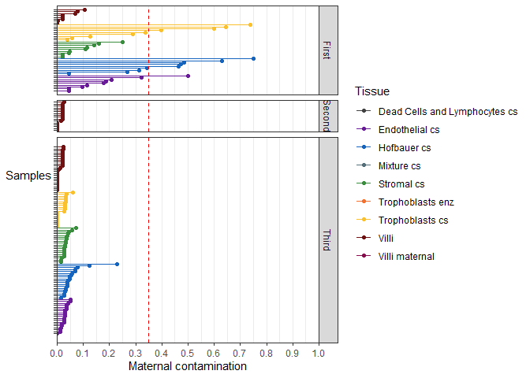
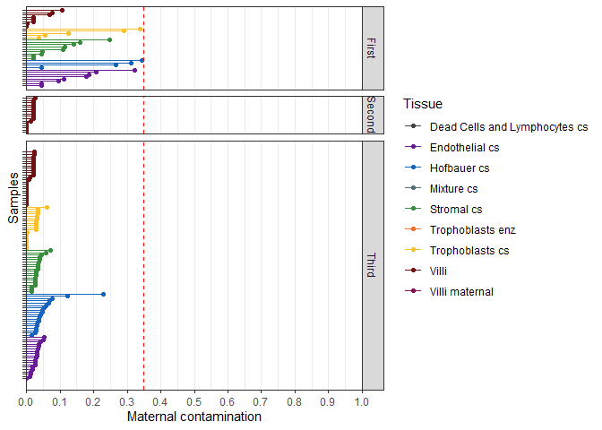
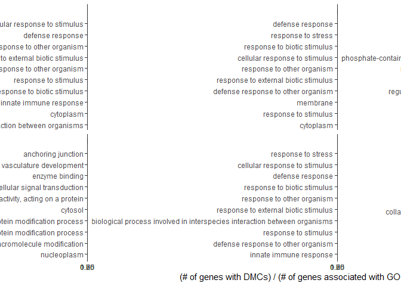

# Setup

## Libraries


```r
# libraries and data
library(ggrepel)
library(viridis)
library(RColorBrewer)
library(pheatmap)
library(irlba)
library(plomics) # 0.2 github/wvictor14/plomics
library(GGally)
library(cowplot)
library(umap)
library(dendextend)
library(stringr)
library(minfi)
library(ggridges)
library(ggpmisc)
library(egg)
library(limma)
library(broom)
library(missMethyl)
library(kableExtra)
library(DMRcate)
library(biobroom)
library(IlluminaHumanMethylationEPICanno.ilm10b4.hg19)
library(here)
library(tidyverse)
```

## Data


```r
base_path <- file.path('data', 'main', 'interim')

pDat <- readRDS(here(base_path, '2_3_pDat_contam.rds'))
pDat <- pDat %>%
  mutate(Tissue = case_when(
    !(Tissue %in% c('Villi', 'Villi maternal', 'Syncytiotrophoblast')) ~ paste(Tissue, 'cs'),
    Tissue == 'Syncytiotrophoblast' ~ 'Trophoblasts enz',
    TRUE ~ Tissue
  )) 

# raw methylation data
betas <- readRDS(here(base_path, '1_4_betas_noob_filt.rds'))

mset_noob <- readRDS(here(base_path, '1_4_mset_noob.rds')) # for mvals
colnames(mset_noob) <- colnames(betas) <- pDat$Sample_Name
mvals <- getM(mset_noob)

# annotation
anno <- readRDS('Z:/Victor/Repositories/EPIC_annotation/hg19_epic_annotation.rds')
anno <- anno %>%
  as_tibble() %>%
  filter(cpg %in% rownames(betas)) # filter to filtered betas cpgs
probe_anno <- readRDS(here(base_path, '1_1_probe_anno.rds'))

# color key
pheatmap_color_code <- readRDS(here(base_path, '1_1_color_code.rds'))

color_code <- readRDS(here(base_path, '2_3_color_code.rds'))
color_code_tissue <- setNames(color_code$Colors_Tissue, color_code$label)
```

## Remove contaminated samples

Here I remove samples with > 35% maternal contamination based on previous analyses.


```r
#Before contamination
pDat %>%
  filter(!Tissue %in% c('Villi maternal', 'Trophoblasts enz', 'Mixture cs', 'Dead Cells and Lymphocytes cs')) %>%
  arrange(Tissue, maternal_contamination_norm_flip) %>% 
  mutate(Sample_Name = factor(as.character(Sample_Name), levels = Sample_Name)) %>%
  ggplot(aes(x = Sample_Name, y = maternal_contamination_norm_flip, color = Tissue)) +
  geom_point() + 
  geom_segment(aes(y = 0, yend = maternal_contamination_norm_flip, 
                   x = Sample_Name, xend = Sample_Name))+
  scale_color_manual(values = color_code_tissue) +
  scale_y_continuous(limits = c(0,1), expand = c(0,0), breaks = seq(0,1, 0.1)) +
  scale_x_discrete(expand = c(0.05, 0.05)) +
  facet_grid(Trimester~., scales = 'free_y', space = 'free_y') +
  theme_bw() +
  theme(axis.text.y = element_blank(),
        panel.grid.minor.y = element_blank(),
        panel.grid.major.y = element_blank(),
        axis.title.y = element_text(angle = 0, vjust = 0.5))  +
  labs(x = 'Samples', y = 'Maternal contamination') +
  coord_flip() +
  geom_hline(yintercept = 0.35, col = 'red', linetype = 'dashed')
```

<!-- -->

```r
# after
pDat %>%
  filter(!Tissue %in% c('Villi maternal', 'Trophoblasts enz', 'Mixture cs', 'Dead Cells and Lymphocytes cs')) %>%
  arrange(Tissue, maternal_contamination_norm_flip) %>% 
  mutate(Sample_Name = factor(as.character(Sample_Name), levels = Sample_Name)) %>%
  filter(maternal_contamination_norm_flip < 0.35) %>%
  ggplot(aes(x = Sample_Name, y = maternal_contamination_norm_flip, color = Tissue)) +
  geom_point() + 
  geom_segment(aes(y = 0, yend = maternal_contamination_norm_flip, 
                   x = Sample_Name, xend = Sample_Name))+
  scale_color_manual(values = color_code_tissue) +
  scale_y_continuous(limits = c(0,1), expand = c(0,0), breaks = seq(0,1, 0.1)) +
  scale_x_discrete(expand = c(0.05, 0.05)) +
  facet_grid(Trimester~., scales = 'free_y', space = 'free_y') +
  theme_bw() +
  theme(axis.text.y = element_blank(),
        panel.grid.minor.y = element_blank(),
        panel.grid.major.y = element_blank())  +
  labs(x = 'Samples', y = 'Maternal contamination') +
  coord_flip() +
  geom_hline(yintercept = 0.35, col = 'red', linetype = 'dashed')
```

<!-- -->

```r
#summarize filtering
x <- pDat %>%
  group_by(Trimester, Tissue) %>%
  summarize(Before_filter = n())
```

```
## `summarise()` has grouped output by 'Trimester'. You can override using the `.groups` argument.
```

```r
y <- pDat %>%
  filter(maternal_contamination_norm_flip < 0.35) %>%
  group_by(Trimester, Tissue) %>%
  summarize(After_filter = n())
```

```
## `summarise()` has grouped output by 'Trimester'. You can override using the `.groups` argument.
```

```r
removed_df <- x %>% 
  ungroup %>%
  mutate(After_filter = y$After_filter,
         Number_removed = Before_filter-After_filter)

removed_df %>%
  kable(align = 'c', escape = F) %>%
  kable_styling(c("striped", "condensed"),full_width = F) %>%
  row_spec(which(removed_df$Number_removed>0), bold = T) 
```

<table class="table table-striped table-condensed" style="width: auto !important; margin-left: auto; margin-right: auto;">
 <thead>
  <tr>
   <th style="text-align:center;"> Trimester </th>
   <th style="text-align:center;"> Tissue </th>
   <th style="text-align:center;"> Before_filter </th>
   <th style="text-align:center;"> After_filter </th>
   <th style="text-align:center;"> Number_removed </th>
  </tr>
 </thead>
<tbody>
  <tr>
   <td style="text-align:center;"> First </td>
   <td style="text-align:center;"> Dead Cells and Lymphocytes cs </td>
   <td style="text-align:center;"> 6 </td>
   <td style="text-align:center;"> 6 </td>
   <td style="text-align:center;"> 0 </td>
  </tr>
  <tr>
   <td style="text-align:center;font-weight: bold;"> First </td>
   <td style="text-align:center;font-weight: bold;"> Endothelial cs </td>
   <td style="text-align:center;font-weight: bold;"> 9 </td>
   <td style="text-align:center;font-weight: bold;"> 8 </td>
   <td style="text-align:center;font-weight: bold;"> 1 </td>
  </tr>
  <tr>
   <td style="text-align:center;font-weight: bold;"> First </td>
   <td style="text-align:center;font-weight: bold;"> Hofbauer cs </td>
   <td style="text-align:center;font-weight: bold;"> 9 </td>
   <td style="text-align:center;font-weight: bold;"> 4 </td>
   <td style="text-align:center;font-weight: bold;"> 5 </td>
  </tr>
  <tr>
   <td style="text-align:center;"> First </td>
   <td style="text-align:center;"> Stromal cs </td>
   <td style="text-align:center;"> 9 </td>
   <td style="text-align:center;"> 9 </td>
   <td style="text-align:center;"> 0 </td>
  </tr>
  <tr>
   <td style="text-align:center;font-weight: bold;"> First </td>
   <td style="text-align:center;font-weight: bold;"> Trophoblasts cs </td>
   <td style="text-align:center;font-weight: bold;"> 9 </td>
   <td style="text-align:center;font-weight: bold;"> 5 </td>
   <td style="text-align:center;font-weight: bold;"> 4 </td>
  </tr>
  <tr>
   <td style="text-align:center;"> First </td>
   <td style="text-align:center;"> Villi </td>
   <td style="text-align:center;"> 8 </td>
   <td style="text-align:center;"> 8 </td>
   <td style="text-align:center;"> 0 </td>
  </tr>
  <tr>
   <td style="text-align:center;"> Second </td>
   <td style="text-align:center;"> Villi </td>
   <td style="text-align:center;"> 16 </td>
   <td style="text-align:center;"> 16 </td>
   <td style="text-align:center;"> 0 </td>
  </tr>
  <tr>
   <td style="text-align:center;"> Third </td>
   <td style="text-align:center;"> Dead Cells and Lymphocytes cs </td>
   <td style="text-align:center;"> 6 </td>
   <td style="text-align:center;"> 6 </td>
   <td style="text-align:center;"> 0 </td>
  </tr>
  <tr>
   <td style="text-align:center;"> Third </td>
   <td style="text-align:center;"> Endothelial cs </td>
   <td style="text-align:center;"> 19 </td>
   <td style="text-align:center;"> 19 </td>
   <td style="text-align:center;"> 0 </td>
  </tr>
  <tr>
   <td style="text-align:center;"> Third </td>
   <td style="text-align:center;"> Hofbauer cs </td>
   <td style="text-align:center;"> 19 </td>
   <td style="text-align:center;"> 19 </td>
   <td style="text-align:center;"> 0 </td>
  </tr>
  <tr>
   <td style="text-align:center;"> Third </td>
   <td style="text-align:center;"> Mixture cs </td>
   <td style="text-align:center;"> 12 </td>
   <td style="text-align:center;"> 12 </td>
   <td style="text-align:center;"> 0 </td>
  </tr>
  <tr>
   <td style="text-align:center;"> Third </td>
   <td style="text-align:center;"> Stromal cs </td>
   <td style="text-align:center;"> 19 </td>
   <td style="text-align:center;"> 19 </td>
   <td style="text-align:center;"> 0 </td>
  </tr>
  <tr>
   <td style="text-align:center;"> Third </td>
   <td style="text-align:center;"> Trophoblasts cs </td>
   <td style="text-align:center;"> 19 </td>
   <td style="text-align:center;"> 19 </td>
   <td style="text-align:center;"> 0 </td>
  </tr>
  <tr>
   <td style="text-align:center;"> Third </td>
   <td style="text-align:center;"> Trophoblasts enz </td>
   <td style="text-align:center;"> 5 </td>
   <td style="text-align:center;"> 5 </td>
   <td style="text-align:center;"> 0 </td>
  </tr>
  <tr>
   <td style="text-align:center;"> Third </td>
   <td style="text-align:center;"> Villi </td>
   <td style="text-align:center;"> 24 </td>
   <td style="text-align:center;"> 24 </td>
   <td style="text-align:center;"> 0 </td>
  </tr>
  <tr>
   <td style="text-align:center;"> Third </td>
   <td style="text-align:center;"> Villi maternal </td>
   <td style="text-align:center;"> 3 </td>
   <td style="text-align:center;"> 3 </td>
   <td style="text-align:center;"> 0 </td>
  </tr>
</tbody>
</table>

## Remove outliers

Previsouly had flagged term and 1st trimester samples with odd methylation profiles. Here I remove
these.

I previously stated in 2_1_Term_contamination.Rmd that I would remove hofbauer samples PM366, PM381 due
to contamination. However these are all below our contamination threshold. Therefore I just remove
PM364, since this ample appeared to be highly 'trophoblastic' with respect to DNA methylation.


I also remove: 
* tissues that I won't look at for this analysis.
* replicates
*P131_hofb_cs as we think is contaminated with endo/stromal cells


```r
pDat_filt <- pDat %>% 
  filter(maternal_contamination_norm_flip < 0.35,
         !Sample_Name %in% c('PM364_hofb_cs', 'PL293_v_R2', 'PM366_vc_R2', 'P131_hofb_cs'),
         !Tissue %in% c('Villi maternal', 'Trophoblasts enz', 'Mixture cs', 'Dead Cells and Lymphocytes cs'))

# filter to first trimester
mvals_filt <- mvals[rownames(betas),pDat_filt$Sample_Name]
betas_filt <- betas[,pDat_filt$Sample_Name]
```


# 1.0 Global methylation

## Density distributions

Here we plot the density distributions of the betas across each tissue

Density for each sample:


```r
#calculate densities
sample_densities <- pDat_filt %>%
  select(Sample_Name, Tissue) %>%
  mutate(densities = apply(betas_filt, 2, density)) %>%
  mutate(x = map(densities, 'x'),
         y = map(densities, 'y')) %>%
  select(-densities) %>%
  unnest() %>%
  # add Trimester information
  left_join(pDat_filt %>% select(Sample_Name, maternal_contamination_norm_flip, Trimester)) 
```

```
## Warning: `cols` is now required when using unnest().
## Please use `cols = c(x, y)`
```

```
## Joining, by = "Sample_Name"
```

```r
# plot all densities
sample_densities %>%
  filter(Trimester != 'Second') %>%
  
  # plot
  ggplot(aes(x = x, y = y, color = Tissue, group = Sample_Name)) +
  geom_line(size = 1, alpha = 0.5) + theme_bw() +
  scale_x_continuous(breaks = c(0, 0.25, 0.5, 0.75, 1), labels = c(0, 25, 50, 75, 100))  +
  facet_grid(Trimester~Tissue) +
  scale_color_manual(values = color_code_tissue[unique(pDat_filt$Tissue)]) +
  guides(colour = guide_legend(override.aes = list(alpha = 1))) +
  labs(x = '% methylation', y = 'density')
```

<!-- -->

```r
# just trophoblast from first
sample_densities %>%
  filter(Tissue == 'Trophoblasts cs', Trimester == 'First') %>%
  ggplot(aes(x = x, y = y, color = Sample_Name, group = Sample_Name)) +
  geom_line(size = 1, alpha = 0.5) + theme_bw()  +
  guides(colour = guide_legend(override.aes = list(alpha = 1))) 
```

<!-- -->

```r
sample_densities %>%
  filter(Tissue == 'Trophoblasts cs', Trimester == 'First') %>%
  ggplot(aes(x = x, y = y, color = maternal_contamination_norm_flip, group = Sample_Name)) +
  geom_line(size = 1, alpha = 0.5) + theme_bw()  +
  guides(colour = guide_legend(override.aes = list(alpha = 1))) 
```

<!-- -->

PL290 has an odd peak in the middle

## PCA


```r
# compute pca
set.seed(1)
pca <- prcomp_irlba(t(betas_filt), n = 20, center = T, scale = F)

# add pc scores to pdata
pca_scores <- pca$x[,1:20] %>% as.data.frame()
colnames(pca_scores) <- paste0(colnames(pca_scores), '_processed')
pDat_filt <- pDat_filt %>% 
  bind_cols(pca_scores)

# create proportion variance explained data frame
pc_info <- summary(pca)$importance %>% 
  as.data.frame() %>% 
  tibble::rownames_to_column(var = 'variable') %>%
  gather(key = 'PC', value = 'value', -variable) %>%
  as_tibble() %>%
  mutate(PC = factor(as.character(PC), levels = paste0('PC', 1:20)),
         Label = ifelse(variable == 'Proportion of Variance',
                        paste0(PC, ' (', prettyNum(value*100, digits = 2), '%)'),
                        as.character(PC))) %>%
  arrange(variable, PC)

  
# correlate PCs with phenodata
pc_cor <- lmmatrix(dep = pca$x[,1:20, drop = F],
                   ind = pDat_filt %>%
                   dplyr::select(Case_ID, Tissue, Sex, Trimester, #bio
                                 Week, Chip_number, Row_numeric, Row_factor, Batch_BSC, # batch
                                 DNA_loaded, 
                                 failed_probes,
                                 maternal_contamination_norm_flip),
                   metric = 'Pvalue')
# plot data
pc_cor <- pc_cor %>% as.data.frame() %>% 
  
  # add dep variables
  mutate(dep = rownames(pc_cor)) %>%
  
  # reshape
  gather(PC, pval, -dep) %>%
  
  # pvalue categories
  mutate(pval_cat = factor(case_when(
    pval > 0.05  ~ '> 0.05',
    pval < 0.05 & pval > 0.01 ~ '< 0.05',
    pval < 0.01 & pval > 0.001 ~ '< 0.01',
    pval < 0.001 ~ '< 0.001'
  ), levels = c('> 0.05', '< 0.05','< 0.01', '< 0.001')),
  
  # make PC is encoded with proper levels!!!
  PC = factor(PC, levels = paste0('PC', 1:20))) %>% as_tibble()

# create color palette
colpal <- c('white', '#fee8c8', '#fdbb84', '#e34a33')
names(colpal) <- levels(pc_cor$pval_cat)

# relevel
pc_cor <- pc_cor %>% 
  mutate(dep = factor(dep, levels = c('Case_ID', 'Tissue', 'Sex', 'Trimester',
                                     'Week', 'Chip_number', 'Row_numeric', 'Row_factor', 
                                     'Batch_BSC', # batch
                                     'DNA_loaded',
                                     'failed_probes',
                                     'maternal_contamination_norm_flip')))
                                     
p7 <- ggplot(pc_cor, aes(x = PC, y = dep, fill = pval_cat)) +
  geom_tile(col = 'lightgrey') + theme_bw() +
  scale_x_discrete(expand = c(0, 0), labels = 1:20) +
  scale_y_discrete(expand = c(0, 0)) +
  scale_fill_manual(values = colpal)  + 
  labs(y = '', fill = 'P value')

p8 <- ggplot(pc_info %>% filter(variable == 'Proportion of Variance') %>%
               mutate(value = value*100), 
             aes(x = PC, y = value)) +
  geom_bar(stat = 'identity') +
  theme_bw() + 
  scale_x_discrete(expand = c(0, 0), labels = 1:20) + 
  scale_y_continuous(expand = c(0, 0)) +
  labs(y = '% variance explained')

egg::ggarrange(p7, p8, heights = c(3,1))
```

<!-- -->

```r
# create another without all variables
var_interest <- c('Tissue', 'Sex', 'Trimester', 'maternal_contamination_norm_flip','Case_ID',
                  'Week', 'Chip_number', 'Row_numeric', 'Row_factor', 'Batch_BSC')

p9 <- pc_cor %>% 
  filter(dep %in% var_interest) %>%
  mutate(dep = ifelse(dep %in% var_interest[6:11], paste0('TECH_', dep), as.character(dep)),
         dep = gsub('maternal_contamination_norm_flip', 'Percent_maternal', dep)) %>%
  mutate(dep = factor(dep, levels = c('TECH_Week', 'TECH_Chip_number', 'TECH_Row_numeric',
                                      'TECH_Row_factor', 'TECH_Batch_BSC', 
                                      'Percent_maternal',  'Sex',
                                      'Case_ID', 'Trimester', 'Tissue'))) %>%
  ggplot(aes(x = PC, y = dep, fill = pval_cat)) +
  geom_tile(col = 'lightgrey') + theme_bw() +
  scale_x_discrete(expand = c(0, 0), labels = 1:20) +
  scale_y_discrete(expand = c(0, 0)) +
  scale_fill_manual(values = colpal)  + 
  labs(y = '', fill = 'P value')

egg::ggarrange(p9, p8, heights = c(3,1))
```

<!-- -->

Scatterplots


```r
scatter <- function(x, y, fill, point_size = 1){
  xlab <- pc_info %>% filter(variable == 'Proportion of Variance', PC == x) %>% pull(Label)
  ylab <- pc_info %>% filter(variable == 'Proportion of Variance', PC == y) %>% pull(Label)
  
  x <- paste0(x, '_processed')
  y <- paste0(y, '_processed')
  
  out <- ggplot(pDat_filt, aes_string(x = x, y = y, fill = fill, shape = 'Trimester')) +
    geom_point(size = point_size) + theme_bw() + labs(x = xlab, y = ylab) +
    scale_shape_manual(values = c('First' = 24, 'Second' = 22, 'Third' = 21))+
    guides(fill=guide_legend(override.aes=list(shape=21)))
  
  if (is.numeric(as.data.frame(pDat_filt)[,fill])){
    out <- out +
      scale_fill_viridis()
  } else {
    out <- out + 
      scale_fill_brewer(palette = 'Set2')
  }
    
  out
}

scatter(x = 'PC1', y = 'PC2', fill = 'Tissue', point_size = 2) +
  scale_fill_manual(values = color_code_tissue[unique(pDat_filt$Tissue)]) 
```

<!-- -->

```r
scatter(x = 'PC1', y = 'PC2', fill = 'maternal_contamination_norm_flip', point_size = 2) 
```

<!-- -->

```r
scatter(x = 'PC3', y = 'PC4', fill = 'Tissue', point_size = 2) +
  scale_fill_manual(values = color_code_tissue[unique(pDat_filt$Tissue)]) +
  labs(fill = '') #+
```

<!-- -->

```r
  #geom_text_repel(data = pDat_filt %>% filter(Tissue == 'Trophoblasts cs', 
  #                                            PC4_processed < 50,
  #                                            Trimester == 'First'),
  #                aes(x = PC3_processed, y = PC4_processed, label = Sample_Name)) 

scatter(x = 'PC3', y = 'PC4', fill = 'maternal_contamination_norm_flip', point_size = 2) +
  scale_fill_viridis()  +
  labs(fill = '') 
```

<!-- -->

```r
scatter(x = 'PC5', y = 'PC6', fill = 'Tissue', point_size = 2) +
  scale_fill_manual(values = color_code_tissue[unique(pDat_filt$Tissue)]) +
  labs(fill = '')
```

<!-- -->

Save for med gen poster:

plot_object <- scatter(x = 'PC1', y = 'PC2', fill = 'Tissue', point_size = 4.5) +
  scale_fill_manual(values = color_code_tissue[unique(pDat_filt$Tissue)]) +
  scale_shape_manual(values = c('First' = 24, 'Second' = NA, 'Third' = 21)) +
  theme_bw(base_size = 28) 

## Pairwise Correlation


```r
cor_betas <- cor(betas_filt)

# annotation bar
annotation <- pDat_filt %>%
  select(Tissue, Trimester, Sex, maternal_contamination_norm_flip) %>% as.data.frame()
rownames(annotation) <- pDat_filt$Sample_Name

#colors for heatmap
anno_colors <- list(
  Tissue = color_code_tissue[unique(pDat_filt$Tissue)],
  Sex = setNames(pheatmap_color_code[[2]]$Colors_Sex, pheatmap_color_code[[2]]$Sex),
  Trimester = setNames(pheatmap_color_code[[3]]$Colors_Trimester, pheatmap_color_code[[3]]$Trimester),
  maternal_contamination_norm_flip = viridis(n = 3, option = 'B')
)


# pheatmap
pheatmap(cor_betas, annotation_col = annotation, annotation_row = annotation[,'Tissue', drop = F],
         show_rownames = F, show_colnames = F,
         annotation_colors = anno_colors,
         labels_col = '',
         color = viridis(100, option = 'B'),
         cutree_cols = 5)
```

<!-- -->

# 2.0 Linear modelling

## DMCs


```r
# desing matrix with Tissue and trimester
design <- pDat_filt  %>% select(Tissue, Case_ID, Trimester) %>%
  mutate(Tissue = gsub('Endothelial cs', 'Endo_cs',
                       gsub('Hofbauer cs', 'Hofb_cs',
                            gsub('Trophoblasts cs', 'Troph_cs',
                                 gsub('Stromal cs', 'Strom_cs',
                                      gsub(':', '\\.', 
                                           Tissue))))))

design <- model.matrix(~0 + Trimester:Tissue + Case_ID, data = design)
colnames(design) <- gsub(':', '\\.', 
                               gsub('Tissue', '',
                                    gsub('Trimester', '', 
                                         colnames(design)))) # rename columns

# account for subject-specific variation
#corfit <- duplicateCorrelation(mvals_filt, design, block = pDat_filt$Case_ID)
#corfitb <- duplicateCorrelation(betas_filt, design, block = pDat_filt$Case_ID)
#saveRDS(list(m = corfit, b = corfitb), '../../data/main/interim/2_4_corfit_mvals.rds')
#corfit <- readRDS('../../data/main/interim/2_4_corfit_mvals.rds')
#corfitb <- corfit$b
#corfitm <- corfit$m;rm(corfit)

#START HEREE JULY 9
contMatrix <- makeContrasts(
  First.Endo_cs - (First.Hofb_cs + First.Strom_cs + First.Troph_cs)/3,
  First.Hofb_cs - (First.Endo_cs + First.Strom_cs + First.Troph_cs)/3,
  First.Strom_cs - (First.Endo_cs + First.Hofb_cs + First.Troph_cs)/3,
  First.Troph_cs - (First.Endo_cs + First.Hofb_cs + First.Strom_cs)/3,
  
  Third.Endo_cs - (Third.Hofb_cs + Third.Strom_cs + Third.Troph_cs)/3,
  Third.Hofb_cs - (Third.Endo_cs + Third.Strom_cs + Third.Troph_cs)/3,
  Third.Strom_cs - (Third.Endo_cs + Third.Hofb_cs + Third.Troph_cs)/3,
  Third.Troph_cs - (Third.Endo_cs + Third.Hofb_cs + Third.Strom_cs)/3,
  
  levels=design)

# fit the linear model ☺
fit_m <- lmFit(mvals_filt, design) %>%
  contrasts.fit(contMatrix) %>%
  eBayes()%>%
  tidy()  %>%
  separate(term, into = c('Group1', 'Group2'), sep = '\\s-\\s') %>%
  group_by(Group1) %>%
  mutate(fdr = p.adjust(p.value, method = "fdr"),
         bonferroni = p.adjust(p.value, method = 'bonferroni'))  %>%
  ungroup() %>%
  select(-Group2)
```

```
## Coefficients not estimable: Second.Endo_cs Second.Hofb_cs Second.Strom_cs Second.Troph_cs First.Villi Second.Villi Third.Villi
```

```
## Warning: Partial NA coefficients for 737050 probe(s)
```

```
## Warning: `tbl_df()` was deprecated in dplyr 1.0.0.
## Please use `tibble::as_tibble()` instead.
## This warning is displayed once every 8 hours.
## Call `lifecycle::last_lifecycle_warnings()` to see where this warning was generated.
```

```r
# add delta betas
fit_b <- lmFit(betas_filt, design) %>%
  contrasts.fit(contMatrix) %>%
  eBayes() %>%
  tidy() %>%
  separate(term, into = c('Group1', 'Group2'), sep = '\\s-\\s') %>%
  dplyr::rename(delta_b = estimate) %>%
  select(gene, Group1, delta_b)
```

```
## Coefficients not estimable: Second.Endo_cs Second.Hofb_cs Second.Strom_cs Second.Troph_cs First.Villi Second.Villi Third.Villi
```

```
## Warning: Partial NA coefficients for 737050 probe(s)
```

```r
dmcs <- fit_m %>% left_join(fit_b)
```

```
## Joining, by = c("gene", "Group1")
```

## DMRs

Here I use dmrcate to find DMRs


```r
myannotation <- 
  tibble(contrast = colnames(contMatrix)) %>%
  mutate(cpgannotate = map(contrast, 
                           ~ cpg.annotate(
                             "array", 
                             mvals_filt, 
                             analysis.type="differential", 
                             what  = "M",
                             design=design,
                             contrasts = T, cont.matrix = contMatrix,
                             fdr = 0.05,
                             coef = .) ))
```

```
## Coefficients not estimable: Second.Endo_cs Second.Hofb_cs Second.Strom_cs Second.Troph_cs First.Villi Second.Villi Third.Villi
```

```
## Warning: Partial NA coefficients for 736843 probe(s)
```

```
## Your contrast returned 234479 individually significant probes. We recommend the default setting of pcutoff in dmrcate().
```

```
## Coefficients not estimable: Second.Endo_cs Second.Hofb_cs Second.Strom_cs Second.Troph_cs First.Villi Second.Villi Third.Villi
```

```
## Warning: Partial NA coefficients for 736843 probe(s)
```

```
## Coefficients not estimable: Second.Endo_cs Second.Hofb_cs Second.Strom_cs Second.Troph_cs First.Villi Second.Villi Third.Villi
```

```
## Warning: Partial NA coefficients for 736843 probe(s)
```

```
## Your contrast returned 480605 individually significant probes. We recommend the default setting of pcutoff in dmrcate().
```

```
## Coefficients not estimable: Second.Endo_cs Second.Hofb_cs Second.Strom_cs Second.Troph_cs First.Villi Second.Villi Third.Villi
```

```
## Warning: Partial NA coefficients for 736843 probe(s)
```

```
## Coefficients not estimable: Second.Endo_cs Second.Hofb_cs Second.Strom_cs Second.Troph_cs First.Villi Second.Villi Third.Villi
```

```
## Warning: Partial NA coefficients for 736843 probe(s)
```

```
## Your contrast returned 220771 individually significant probes. We recommend the default setting of pcutoff in dmrcate().
```

```
## Coefficients not estimable: Second.Endo_cs Second.Hofb_cs Second.Strom_cs Second.Troph_cs First.Villi Second.Villi Third.Villi
```

```
## Warning: Partial NA coefficients for 736843 probe(s)
```

```
## Coefficients not estimable: Second.Endo_cs Second.Hofb_cs Second.Strom_cs Second.Troph_cs First.Villi Second.Villi Third.Villi
```

```
## Warning: Partial NA coefficients for 736843 probe(s)
```

```
## Your contrast returned 456552 individually significant probes. We recommend the default setting of pcutoff in dmrcate().
```

```
## Coefficients not estimable: Second.Endo_cs Second.Hofb_cs Second.Strom_cs Second.Troph_cs First.Villi Second.Villi Third.Villi
```

```
## Warning: Partial NA coefficients for 736843 probe(s)
```

```
## Coefficients not estimable: Second.Endo_cs Second.Hofb_cs Second.Strom_cs Second.Troph_cs First.Villi Second.Villi Third.Villi
```

```
## Warning: Partial NA coefficients for 736843 probe(s)
```

```
## Your contrast returned 451632 individually significant probes. We recommend the default setting of pcutoff in dmrcate().
```

```
## Coefficients not estimable: Second.Endo_cs Second.Hofb_cs Second.Strom_cs Second.Troph_cs First.Villi Second.Villi Third.Villi
```

```
## Warning: Partial NA coefficients for 736843 probe(s)
```

```
## Coefficients not estimable: Second.Endo_cs Second.Hofb_cs Second.Strom_cs Second.Troph_cs First.Villi Second.Villi Third.Villi
```

```
## Warning: Partial NA coefficients for 736843 probe(s)
```

```
## Your contrast returned 550933 individually significant probes. We recommend the default setting of pcutoff in dmrcate().
```

```
## Coefficients not estimable: Second.Endo_cs Second.Hofb_cs Second.Strom_cs Second.Troph_cs First.Villi Second.Villi Third.Villi
```

```
## Warning: Partial NA coefficients for 736843 probe(s)
```

```
## Coefficients not estimable: Second.Endo_cs Second.Hofb_cs Second.Strom_cs Second.Troph_cs First.Villi Second.Villi Third.Villi
```

```
## Warning: Partial NA coefficients for 736843 probe(s)
```

```
## Your contrast returned 483467 individually significant probes. We recommend the default setting of pcutoff in dmrcate().
```

```
## Coefficients not estimable: Second.Endo_cs Second.Hofb_cs Second.Strom_cs Second.Troph_cs First.Villi Second.Villi Third.Villi
```

```
## Warning: Partial NA coefficients for 736843 probe(s)
```

```
## Coefficients not estimable: Second.Endo_cs Second.Hofb_cs Second.Strom_cs Second.Troph_cs First.Villi Second.Villi Third.Villi
```

```
## Warning: Partial NA coefficients for 736843 probe(s)
```

```
## Your contrast returned 528733 individually significant probes. We recommend the default setting of pcutoff in dmrcate().
```

```
## Coefficients not estimable: Second.Endo_cs Second.Hofb_cs Second.Strom_cs Second.Troph_cs First.Villi Second.Villi Third.Villi
```

```
## Warning: Partial NA coefficients for 736843 probe(s)
```

```r
myannotation
```

```
## # A tibble: 8 x 2
##   contrast                                                            cpgannotate
##   <chr>                                                               <list>     
## 1 First.Endo_cs - (First.Hofb_cs + First.Strom_cs + First.Troph_cs)/3 <CpGnnttd> 
## 2 First.Hofb_cs - (First.Endo_cs + First.Strom_cs + First.Troph_cs)/3 <CpGnnttd> 
## 3 First.Strom_cs - (First.Endo_cs + First.Hofb_cs + First.Troph_cs)/3 <CpGnnttd> 
## 4 First.Troph_cs - (First.Endo_cs + First.Hofb_cs + First.Strom_cs)/3 <CpGnnttd> 
## 5 Third.Endo_cs - (Third.Hofb_cs + Third.Strom_cs + Third.Troph_cs)/3 <CpGnnttd> 
## 6 Third.Hofb_cs - (Third.Endo_cs + Third.Strom_cs + Third.Troph_cs)/3 <CpGnnttd> 
## 7 Third.Strom_cs - (Third.Endo_cs + Third.Hofb_cs + Third.Troph_cs)/3 <CpGnnttd> 
## 8 Third.Troph_cs - (Third.Endo_cs + Third.Hofb_cs + Third.Strom_cs)/3 <CpGnnttd>
```

```r
dmrcoutput <- myannotation %>%
  mutate(out = map(cpgannotate, ~dmrcate(., lambda=1000, C=2)))
```

```
## Fitting chr1...
```

```
## Fitting chr2...
```

```
## Fitting chr3...
```

```
## Fitting chr4...
```

```
## Fitting chr5...
```

```
## Fitting chr6...
```

```
## Fitting chr7...
```

```
## Fitting chr8...
```

```
## Fitting chr9...
```

```
## Fitting chr10...
```

```
## Fitting chr11...
```

```
## Fitting chr12...
```

```
## Fitting chr13...
```

```
## Fitting chr14...
```

```
## Fitting chr15...
```

```
## Fitting chr16...
```

```
## Fitting chr17...
```

```
## Fitting chr18...
```

```
## Fitting chr19...
```

```
## Fitting chr20...
```

```
## Fitting chr21...
```

```
## Fitting chr22...
```

```
## Demarcating regions...
```

```
## Done!
```

```
## Fitting chr1...
```

```
## Fitting chr2...
```

```
## Fitting chr3...
```

```
## Fitting chr4...
```

```
## Fitting chr5...
```

```
## Fitting chr6...
```

```
## Fitting chr7...
```

```
## Fitting chr8...
```

```
## Fitting chr9...
```

```
## Fitting chr10...
```

```
## Fitting chr11...
```

```
## Fitting chr12...
```

```
## Fitting chr13...
```

```
## Fitting chr14...
```

```
## Fitting chr15...
```

```
## Fitting chr16...
```

```
## Fitting chr17...
```

```
## Fitting chr18...
```

```
## Fitting chr19...
```

```
## Fitting chr20...
```

```
## Fitting chr21...
```

```
## Fitting chr22...
```

```
## Demarcating regions...
```

```
## Done!
```

```
## Fitting chr1...
```

```
## Fitting chr2...
```

```
## Fitting chr3...
```

```
## Fitting chr4...
```

```
## Fitting chr5...
```

```
## Fitting chr6...
```

```
## Fitting chr7...
```

```
## Fitting chr8...
```

```
## Fitting chr9...
```

```
## Fitting chr10...
```

```
## Fitting chr11...
```

```
## Fitting chr12...
```

```
## Fitting chr13...
```

```
## Fitting chr14...
```

```
## Fitting chr15...
```

```
## Fitting chr16...
```

```
## Fitting chr17...
```

```
## Fitting chr18...
```

```
## Fitting chr19...
```

```
## Fitting chr20...
```

```
## Fitting chr21...
```

```
## Fitting chr22...
```

```
## Demarcating regions...
```

```
## Done!
```

```
## Fitting chr1...
```

```
## Fitting chr2...
```

```
## Fitting chr3...
```

```
## Fitting chr4...
```

```
## Fitting chr5...
```

```
## Fitting chr6...
```

```
## Fitting chr7...
```

```
## Fitting chr8...
```

```
## Fitting chr9...
```

```
## Fitting chr10...
```

```
## Fitting chr11...
```

```
## Fitting chr12...
```

```
## Fitting chr13...
```

```
## Fitting chr14...
```

```
## Fitting chr15...
```

```
## Fitting chr16...
```

```
## Fitting chr17...
```

```
## Fitting chr18...
```

```
## Fitting chr19...
```

```
## Fitting chr20...
```

```
## Fitting chr21...
```

```
## Fitting chr22...
```

```
## Demarcating regions...
```

```
## Done!
```

```
## Fitting chr1...
```

```
## Fitting chr2...
```

```
## Fitting chr3...
```

```
## Fitting chr4...
```

```
## Fitting chr5...
```

```
## Fitting chr6...
```

```
## Fitting chr7...
```

```
## Fitting chr8...
```

```
## Fitting chr9...
```

```
## Fitting chr10...
```

```
## Fitting chr11...
```

```
## Fitting chr12...
```

```
## Fitting chr13...
```

```
## Fitting chr14...
```

```
## Fitting chr15...
```

```
## Fitting chr16...
```

```
## Fitting chr17...
```

```
## Fitting chr18...
```

```
## Fitting chr19...
```

```
## Fitting chr20...
```

```
## Fitting chr21...
```

```
## Fitting chr22...
```

```
## Demarcating regions...
```

```
## Done!
```

```
## Fitting chr1...
```

```
## Fitting chr2...
```

```
## Fitting chr3...
```

```
## Fitting chr4...
```

```
## Fitting chr5...
```

```
## Fitting chr6...
```

```
## Fitting chr7...
```

```
## Fitting chr8...
```

```
## Fitting chr9...
```

```
## Fitting chr10...
```

```
## Fitting chr11...
```

```
## Fitting chr12...
```

```
## Fitting chr13...
```

```
## Fitting chr14...
```

```
## Fitting chr15...
```

```
## Fitting chr16...
```

```
## Fitting chr17...
```

```
## Fitting chr18...
```

```
## Fitting chr19...
```

```
## Fitting chr20...
```

```
## Fitting chr21...
```

```
## Fitting chr22...
```

```
## Demarcating regions...
```

```
## Done!
```

```
## Fitting chr1...
```

```
## Fitting chr2...
```

```
## Fitting chr3...
```

```
## Fitting chr4...
```

```
## Fitting chr5...
```

```
## Fitting chr6...
```

```
## Fitting chr7...
```

```
## Fitting chr8...
```

```
## Fitting chr9...
```

```
## Fitting chr10...
```

```
## Fitting chr11...
```

```
## Fitting chr12...
```

```
## Fitting chr13...
```

```
## Fitting chr14...
```

```
## Fitting chr15...
```

```
## Fitting chr16...
```

```
## Fitting chr17...
```

```
## Fitting chr18...
```

```
## Fitting chr19...
```

```
## Fitting chr20...
```

```
## Fitting chr21...
```

```
## Fitting chr22...
```

```
## Demarcating regions...
```

```
## Done!
```

```
## Fitting chr1...
```

```
## Fitting chr2...
```

```
## Fitting chr3...
```

```
## Fitting chr4...
```

```
## Fitting chr5...
```

```
## Fitting chr6...
```

```
## Fitting chr7...
```

```
## Fitting chr8...
```

```
## Fitting chr9...
```

```
## Fitting chr10...
```

```
## Fitting chr11...
```

```
## Fitting chr12...
```

```
## Fitting chr13...
```

```
## Fitting chr14...
```

```
## Fitting chr15...
```

```
## Fitting chr16...
```

```
## Fitting chr17...
```

```
## Fitting chr18...
```

```
## Fitting chr19...
```

```
## Fitting chr20...
```

```
## Fitting chr21...
```

```
## Fitting chr22...
```

```
## Demarcating regions...
```

```
## Done!
```

```r
results.ranges <- dmrcoutput %>%
  mutate(out_tibble = map(out, ~extractRanges(., genome = "hg19") %>% tidy()))
```

```
## snapshotDate(): 2021-05-18
```

```
## see ?DMRcatedata and browseVignettes('DMRcatedata') for documentation
```

```
## downloading 1 resources
```

```
## retrieving 1 resource
```

```
## loading from cache
```

```
## snapshotDate(): 2021-05-18
```

```
## see ?DMRcatedata and browseVignettes('DMRcatedata') for documentation
```

```
## loading from cache
```

```
## snapshotDate(): 2021-05-18
```

```
## see ?DMRcatedata and browseVignettes('DMRcatedata') for documentation
```

```
## loading from cache
```

```
## snapshotDate(): 2021-05-18
```

```
## see ?DMRcatedata and browseVignettes('DMRcatedata') for documentation
```

```
## loading from cache
```

```
## snapshotDate(): 2021-05-18
```

```
## see ?DMRcatedata and browseVignettes('DMRcatedata') for documentation
```

```
## loading from cache
```

```
## snapshotDate(): 2021-05-18
```

```
## see ?DMRcatedata and browseVignettes('DMRcatedata') for documentation
```

```
## loading from cache
```

```
## snapshotDate(): 2021-05-18
```

```
## see ?DMRcatedata and browseVignettes('DMRcatedata') for documentation
```

```
## loading from cache
```

```
## snapshotDate(): 2021-05-18
```

```
## see ?DMRcatedata and browseVignettes('DMRcatedata') for documentation
```

```
## loading from cache
```

```r
results.ranges <- results.ranges %>%
  mutate(contrast = gsub('_cs.*', '', contrast)) %>%
  separate(contrast, into = c('Trimester', 'Celltype')) %>%
  select(-cpgannotate, -out)  %>%
  unnest(out_tibble)

# sumarize
results.ranges
```

```
## # A tibble: 554,490 x 15
##    Trimester Celltype     start       end width strand[,1] seqname no.cpgs
##    <chr>     <chr>        <int>     <int> <int> <chr>      <chr>     <int>
##  1 First     Endo       2321770   2324401  2632 *          chr11        34
##  2 First     Endo      57581478  57583709  2232 *          chr20        29
##  3 First     Endo      36145902  36151683  5782 *          chr20        54
##  4 First     Endo      56405155  56409534  4380 *          chr17        21
##  5 First     Endo      31880438  31883115  2678 *          chr12        18
##  6 First     Endo      92921509  92932481 10973 *          chr5         31
##  7 First     Endo      31539539  31543686  4148 *          chr6         37
##  8 First     Endo      94825257  94829039  3783 *          chr10        14
##  9 First     Endo      32036530  32059605 23076 *          chr6        169
## 10 First     Endo     105452339 105455544  3206 *          chr10        14
## # ... with 554,480 more rows, and 7 more variables: min_smoothed_fdr <dbl>,
## #   Stouffer <dbl>, HMFDR <dbl>, Fisher <dbl>, maxdiff <dbl>, meandiff <dbl>,
## #   overlapping.genes <chr>
```

```r
results.ranges %>%
  group_by(Trimester, Celltype) %>%
  summarize(sum(min_smoothed_fdr<0.01))
```

```
## `summarise()` has grouped output by 'Trimester'. You can override using the `.groups` argument.
```

```
## # A tibble: 8 x 3
## # Groups:   Trimester [2]
##   Trimester Celltype `sum(min_smoothed_fdr < 0.01)`
##   <chr>     <chr>                             <int>
## 1 First     Endo                              42187
## 2 First     Hofb                              80534
## 3 First     Strom                             38656
## 4 First     Troph                             75506
## 5 Third     Endo                              72577
## 6 Third     Hofb                              86355
## 7 Third     Strom                             76654
## 8 Third     Troph                             82021
```

I skip DMRs for now

## hypo/hyper


```r
# define cutoffs
p_thresh <- 0.01
b_thresh <- 0.25

# count number of significant cpgs per cell
dmcs_sig <- dmcs %>% 
  group_by(Group1) %>% 
  summarize(b001db50_all = sum(bonferroni < p_thresh & abs(delta_b) > b_thresh), 
            b001db50_hypo = sum(bonferroni < p_thresh & delta_b < -b_thresh),
            b001db50_hyper = sum(bonferroni < p_thresh & delta_b > b_thresh)) %>%
  separate(Group1, into = c('Trimester', 'Celltype'), sep = '\\.') %>%
  gather('group', 'n_cpg', -Trimester, -Celltype) %>%
  separate(group, into = c('pvalue', 'delta_b')) %>%
  mutate(Group1_label = paste0(Trimester, ' - ', case_when(
    Celltype == 'Endo_cs' ~ 'Endothelial cs',
    Celltype == 'Hofb_cs' ~ 'Hofbauer cs',
    Celltype == 'Strom_cs' ~ 'Stromal cs',
    Celltype == 'Troph_cs' ~ 'Trophoblasts cs'
  )))

dmcs_sig %>% 
  # calculate proportions
  spread(key = delta_b, value = n_cpg) %>%
  mutate(hyper_p = hyper/all,
         hypo_p = hypo/all) %>%
  gather(key = cpg, value = n_cpg, -(Trimester:Group1_label), -(hyper_p:hypo_p)) %>%
  mutate(p_cpg = prettyNum(digits = 2, 
                           100*case_when(
    cpg == 'hyper' ~ hyper_p,
    cpg == 'hypo' ~ hypo_p,
    cpg == 'all' ~ 1))) %>%
  select(-hyper_p, -hypo_p) %>%
  filter(cpg != 'all') %>%
  arrange(Celltype, cpg) %>%
  mutate(label = paste0(p_cpg, '%')) %>%
  
  #plot
  {
    ggplot(data = ., aes(x = Group1_label, y = n_cpg, fill = cpg)) +
    geom_bar(stat = 'identity', position = 'stack', color = 'black') +
    geom_text(data = . %>% 
                filter(!Group1_label %in% c('First - Endothelial cs', 'First - Stromal cs')),
              aes(label = label, y = n_cpg), position = position_stack(vjust = 0.5)) +
    labs(y = 'Number DMCs (in thousands)', x = '', fill = '')  +
    theme_bw() +
    theme(axis.text.x = element_text(angle = 45, vjust = 1, hjust =1)) +
    scale_y_continuous(expand = expand_scale(mult = c(0, 0.05)),
                       labels = function(x)x/1000) +
    scale_fill_manual(values = c('#6BAED6', '#DEEBF7'), labels = c('Hypermethylated', 'Hypomethylated'))
  }
```

```
## Warning: `expand_scale()` is deprecated; use `expansion()` instead.
```

<!-- -->

```r
dmcs_sig %>% 
  # calculate proportions
  spread(key = delta_b, value = n_cpg) %>%
  mutate(hyper_p = hyper*100/all,
         hypo_p = hypo*100/all) %>%
  select(-Trimester, -Celltype, -pvalue) %>%
  
  mutate(Hypermethylated = paste0(hyper, ' (', prettyNum(hyper_p, digits = 2), '%)'),
         Hypomethylated = paste0(hypo, ' (', prettyNum(hypo_p, digits = 2), '%)')) %>%
  
  # specify color of cells
  mutate(Hypermethylated = cell_spec(Hypermethylated, color = 'white', 
                                     background = spec_color(hyper_p, end = 0.5, direction = -1)),
         Hypomethylated = cell_spec(Hypomethylated, color = 'white', 
                                     background = spec_color(hypo_p, end = 0.5, direction = -1))) %>%
  separate(Group1_label, into = c('Trimester', 'Celltype'), sep = ' - ') %>%
  select(-(hyper:hypo_p)) %>%
  dplyr::rename(Num_sig = all) %>%
  kable(escape = F) %>%
  kable_styling(full_width = F) %>%
  column_spec(1, bold = T) %>%
  collapse_rows(columns = 1)
```

<table class="table" style="width: auto !important; margin-left: auto; margin-right: auto;">
 <thead>
  <tr>
   <th style="text-align:left;"> Trimester </th>
   <th style="text-align:left;"> Celltype </th>
   <th style="text-align:right;"> Num_sig </th>
   <th style="text-align:left;"> Hypermethylated </th>
   <th style="text-align:left;"> Hypomethylated </th>
  </tr>
 </thead>
<tbody>
  <tr>
   <td style="text-align:left;font-weight: bold;"> First </td>
   <td style="text-align:left;"> Endothelial cs </td>
   <td style="text-align:right;"> 18867 </td>
   <td style="text-align:left;"> <span style="     color: white !important;border-radius: 4px; padding-right: 4px; padding-left: 4px; background-color: rgba(68, 57, 131, 1) !important;">10088 (53%)</span> </td>
   <td style="text-align:left;"> <span style="     color: white !important;border-radius: 4px; padding-right: 4px; padding-left: 4px; background-color: rgba(48, 104, 142, 1) !important;">8779 (47%)</span> </td>
  </tr>
  <tr>
   <td style="text-align:left;font-weight: bold;"> First </td>
   <td style="text-align:left;"> Hofbauer cs </td>
   <td style="text-align:right;"> 78309 </td>
   <td style="text-align:left;"> <span style="     color: white !important;border-radius: 4px; padding-right: 4px; padding-left: 4px; background-color: rgba(70, 8, 91, 1) !important;">56281 (72%)</span> </td>
   <td style="text-align:left;"> <span style="     color: white !important;border-radius: 4px; padding-right: 4px; padding-left: 4px; background-color: rgba(34, 140, 141, 1) !important;">22028 (28%)</span> </td>
  </tr>
  <tr>
   <td style="text-align:left;font-weight: bold;"> First </td>
   <td style="text-align:left;"> Stromal cs </td>
   <td style="text-align:right;"> 9136 </td>
   <td style="text-align:left;"> <span style="     color: white !important;border-radius: 4px; padding-right: 4px; padding-left: 4px; background-color: rgba(48, 105, 142, 1) !important;">2939 (32%)</span> </td>
   <td style="text-align:left;"> <span style="     color: white !important;border-radius: 4px; padding-right: 4px; padding-left: 4px; background-color: rgba(69, 56, 131, 1) !important;">6197 (68%)</span> </td>
  </tr>
  <tr>
   <td style="text-align:left;font-weight: bold;"> First </td>
   <td style="text-align:left;"> Trophoblasts cs </td>
   <td style="text-align:right;"> 117528 </td>
   <td style="text-align:left;"> <span style="     color: white !important;border-radius: 4px; padding-right: 4px; padding-left: 4px; background-color: rgba(33, 144, 140, 1) !important;">13987 (12%)</span> </td>
   <td style="text-align:left;"> <span style="     color: white !important;border-radius: 4px; padding-right: 4px; padding-left: 4px; background-color: rgba(68, 1, 84, 1) !important;">103541 (88%)</span> </td>
  </tr>
  <tr>
   <td style="text-align:left;font-weight: bold;"> Third </td>
   <td style="text-align:left;"> Endothelial cs </td>
   <td style="text-align:right;"> 75525 </td>
   <td style="text-align:left;"> <span style="     color: white !important;border-radius: 4px; padding-right: 4px; padding-left: 4px; background-color: rgba(42, 120, 142, 1) !important;">18500 (24%)</span> </td>
   <td style="text-align:left;"> <span style="     color: white !important;border-radius: 4px; padding-right: 4px; padding-left: 4px; background-color: rgba(72, 37, 118, 1) !important;">57025 (76%)</span> </td>
  </tr>
  <tr>
   <td style="text-align:left;font-weight: bold;"> Third </td>
   <td style="text-align:left;"> Hofbauer cs </td>
   <td style="text-align:right;"> 130733 </td>
   <td style="text-align:left;"> <span style="     color: white !important;border-radius: 4px; padding-right: 4px; padding-left: 4px; background-color: rgba(68, 1, 84, 1) !important;">96790 (74%)</span> </td>
   <td style="text-align:left;"> <span style="     color: white !important;border-radius: 4px; padding-right: 4px; padding-left: 4px; background-color: rgba(33, 144, 140, 1) !important;">33943 (26%)</span> </td>
  </tr>
  <tr>
   <td style="text-align:left;font-weight: bold;"> Third </td>
   <td style="text-align:left;"> Stromal cs </td>
   <td style="text-align:right;"> 80153 </td>
   <td style="text-align:left;"> <span style="     color: white !important;border-radius: 4px; padding-right: 4px; padding-left: 4px; background-color: rgba(48, 105, 142, 1) !important;">25464 (32%)</span> </td>
   <td style="text-align:left;"> <span style="     color: white !important;border-radius: 4px; padding-right: 4px; padding-left: 4px; background-color: rgba(69, 56, 130, 1) !important;">54689 (68%)</span> </td>
  </tr>
  <tr>
   <td style="text-align:left;font-weight: bold;"> Third </td>
   <td style="text-align:left;"> Trophoblasts cs </td>
   <td style="text-align:right;"> 135553 </td>
   <td style="text-align:left;"> <span style="     color: white !important;border-radius: 4px; padding-right: 4px; padding-left: 4px; background-color: rgba(55, 91, 141, 1) !important;">52909 (39%)</span> </td>
   <td style="text-align:left;"> <span style="     color: white !important;border-radius: 4px; padding-right: 4px; padding-left: 4px; background-color: rgba(63, 73, 137, 1) !important;">82644 (61%)</span> </td>
  </tr>
</tbody>
</table>


## functional enrichment missmethyl 

### GO


```r
#GO testing
gst <- dmcs %>% group_by(Group1) %>%
  nest() %>%
  mutate(GO_results = map(data, . %>% 
                            slice_min(p.value, n = 10000) %>%
                            pull(gene) %>% 
                            gometh(all.cpg= rownames(betas), 
                                   collection = 'GO',
                                   array.type = 'EPIC') %>%
                            mutate(ID = rownames(.)) %>%
                            arrange(FDR)),
         # number significnat at FDR < 0.05
         FDR05_signif = map_dbl(GO_results, . %>% filter(FDR < 0.05) %>% nrow())) 
```

```
## All input CpGs are used for testing.
## All input CpGs are used for testing.
## All input CpGs are used for testing.
## All input CpGs are used for testing.
## All input CpGs are used for testing.
## All input CpGs are used for testing.
## All input CpGs are used for testing.
## All input CpGs are used for testing.
```

```r
gst
```

```
## # A tibble: 8 x 4
## # Groups:   Group1 [8]
##   Group1         data                   GO_results        FDR05_signif
##   <chr>          <list>                 <list>                   <dbl>
## 1 First.Endo_cs  <tibble [737,050 x 8]> <df [22,569 x 7]>          275
## 2 First.Hofb_cs  <tibble [737,050 x 8]> <df [22,569 x 7]>          313
## 3 First.Strom_cs <tibble [737,050 x 8]> <df [22,569 x 7]>           75
## 4 First.Troph_cs <tibble [737,050 x 8]> <df [22,569 x 7]>            0
## 5 Third.Endo_cs  <tibble [737,050 x 8]> <df [22,569 x 7]>           19
## 6 Third.Hofb_cs  <tibble [737,050 x 8]> <df [22,569 x 7]>          255
## 7 Third.Strom_cs <tibble [737,050 x 8]> <df [22,569 x 7]>            8
## 8 Third.Troph_cs <tibble [737,050 x 8]> <df [22,569 x 7]>            0
```

```r
# process results
gst <- gst %>%  
  separate(Group1, into = c('Trimester', 'Celltype'), sep = '\\.') %>%
  mutate(Celltype = case_when(
    Celltype == 'Endo_cs' ~ 'Endothelial cs',
    Celltype == 'Hofb_cs' ~ 'Hofbauer cs',
    Celltype == 'Strom_cs' ~ 'Stromal cs',
    Celltype == 'Troph_cs' ~ 'Trophoblasts cs'),
    Label = paste0(Trimester, ' - ', Celltype))  %>%
  mutate(GO_sig = map(GO_results, . %>% filter(FDR < 0.05))) %>%
  unnest(GO_sig) %>% 
  mutate(Generatio = DE/N, # number of DE cpgs per total cpgs in each gene
         neg_log_P = -log(P.DE, base = 10)) %>%
  
  # set up ordering for plot
  arrange(Trimester, Celltype, Generatio) %>%
  mutate(Order = row_number(),
         neg_log_P = -log(P.DE, base = 10))

# plot results
gst %>%
  # take top n significant
  group_by(Label) %>%
  dplyr::slice(1:10) %>%
  
  ggplot(aes(x = Order, y = Generatio, fill = neg_log_P)) +
  geom_segment(aes(x = Order, xend = Order, y = 0, yend = Generatio)) +
  geom_point(stat = 'identity', shape = 21, color = 'black', size = 3) +
  theme_bw() +
  facet_wrap(vars(Label), scales = 'free_y') +
  scale_x_continuous(breaks = gst$Order,
                     labels = gst$TERM) +
  coord_flip() +
  scale_y_continuous(expand = c(0,0), limits = c(0,1)) +
  scale_fill_viridis_c(option = 'B', begin = 0, limits = c(0, NA)) +
  labs(fill = '-log10(P)', x = '', 
       y = '(# of genes with DMCs) / (# of genes associated with GO term)')
```

<!-- -->

### KEGG


```r
#KEGG testing
kegg <- dmcs %>% group_by(Group1) %>%
  nest() %>%
  mutate(KEGG_results  = map(data, . %>% 
                            slice_min(p.value, n = 10000) %>%
                            pull(gene) %>% 
                            gometh(all.cpg= rownames(betas), 
                                   collection = 'KEGG',
                                   array.type = 'EPIC') %>%
                            mutate(ID = rownames(.)) %>%
                            arrange(FDR)),
         # number significnat at FDR < 0.05
         FDR05_signif = map_dbl(KEGG_results, . %>% filter(FDR < 0.05) %>% nrow())) 
```

```
## All input CpGs are used for testing.
## All input CpGs are used for testing.
## All input CpGs are used for testing.
## All input CpGs are used for testing.
## All input CpGs are used for testing.
## All input CpGs are used for testing.
## All input CpGs are used for testing.
## All input CpGs are used for testing.
```

```r
kegg
```

```
## # A tibble: 8 x 4
## # Groups:   Group1 [8]
##   Group1         data                   KEGG_results   FDR05_signif
##   <chr>          <list>                 <list>                <dbl>
## 1 First.Endo_cs  <tibble [737,050 x 8]> <df [345 x 6]>           25
## 2 First.Hofb_cs  <tibble [737,050 x 8]> <df [345 x 6]>           13
## 3 First.Strom_cs <tibble [737,050 x 8]> <df [345 x 6]>            9
## 4 First.Troph_cs <tibble [737,050 x 8]> <df [345 x 6]>            1
## 5 Third.Endo_cs  <tibble [737,050 x 8]> <df [345 x 6]>            1
## 6 Third.Hofb_cs  <tibble [737,050 x 8]> <df [345 x 6]>            1
## 7 Third.Strom_cs <tibble [737,050 x 8]> <df [345 x 6]>            0
## 8 Third.Troph_cs <tibble [737,050 x 8]> <df [345 x 6]>            1
```

```r
# process results
kegg <- kegg %>%  
  separate(Group1, into = c('Trimester', 'Celltype'), sep = '\\.') %>%
  mutate(Celltype = case_when(
    Celltype == 'Endo_cs' ~ 'Endothelial cs',
    Celltype == 'Hofb_cs' ~ 'Hofbauer cs',
    Celltype == 'Strom_cs' ~ 'Stromal cs',
    Celltype == 'Troph_cs' ~ 'Trophoblasts cs'),
    Label = paste0(Trimester, ' - ', Celltype))  %>%
  mutate(KEGG_sig = map(KEGG_results, . %>% filter(FDR < 0.05))) %>%
  unnest(KEGG_sig) %>% 
  mutate(Generatio = DE/N, # number of DE cpgs per total cpgs in each gene
         neg_log_P = -log(P.DE, base = 10)) %>%
  
  # set up ordering for plot
  arrange(Trimester, Celltype, Generatio) %>%
  mutate(Order = row_number(),
         neg_log_P = -log(P.DE, base = 10))

# plot results
kegg %>%
  # take top n significant
  group_by(Label) %>%
  dplyr::slice(1:10) %>%
  
  ggplot(aes(x = Order, y = Generatio, fill = neg_log_P)) +
  geom_segment(aes(x = Order, xend = Order, y = 0, yend = Generatio)) +
  geom_point(stat = 'identity', shape = 21, color = 'black', size = 3) +
  theme_bw() +
  facet_wrap(vars(Label), scales = 'free_y') +
  scale_x_continuous(breaks = kegg$Order,
                     labels = kegg$Description) +
  coord_flip() +
  scale_y_continuous(expand = c(0,0), limits = c(0,1)) +
  scale_fill_viridis_c(option = 'B', begin = 0, limits = c(0, NA)) +
  labs(fill = '-log10(P)', x = '', 
       y = '(# of genes with DMCs) / (# of genes associated with GO term)')
```

<!-- -->


## Top DMCs


```r
## ggridges

topdmcs <- dmcs %>% 
  filter(bonferroni < p_thresh, abs(delta_b) > b_thresh) %>% 
  
  mutate(Direction = ifelse(delta_b > 0, 'Hypermethylated', 'Hypomethylated')) %>%
  group_by(Group1, Direction)%>% 
  arrange(bonferroni) %>%
  # identify the unique genes that each cpg maps to
  mutate(gene_label = str_split(genes_symbol, ', ') %>%
           
           # remove duplicated symbols
           map(unique)  %>%
           
           # discard the character NAs
           map(., ~purrr::discard(., . == 'NA')) %>%
           
           # discard the NAs
           map(., ~ifelse(is.na(.), '', .)) %>%
           
           # paste it back together with comma delimiter
           map_chr(., ~paste(., collapse = ', '))) %>%
  dplyr::rename(cpg = gene) %>%
  
  # reorder columns
  select(Group1, cpg, gene_label, Direction, everything()) %>% 
  
  # select top n for hypo hyper per group
  group_by(Group1, Direction) %>%
  arrange(bonferroni) %>%
  top_n(-5, bonferroni) %>%
  ungroup() %>%
  
  mutate(cpg_gene_label = paste(cpg, gene_label, sep = '; '))


# pull out betas
topdmcs_b <- 
  
  # combine betas to pDat
  bind_cols(pDat_filt %>% select(Sample_Name, Tissue),
            as.data.frame(t(betas_filt[topdmcs$cpg,]))) %>%
  gather(key = cpg, value = beta, -Sample_Name, -Tissue) %>%
  
  # Join to annotation
  left_join(topdmcs %>% 
              select(cpg, Group1, Direction, cpg_gene_label, gene_label, p.value, delta_b), 
            by =c('cpg')) %>%
  arrange(Group1, delta_b) %>%
  mutate(cpg_gene_label = factor(as.character(cpg_gene_label), 
                                 levels = unique(as.character(cpg_gene_label)))) %>%
  separate(Group1, into = c('Trimester', 'Celltype'), sep = '\\.') %>%
  
  mutate(Celltype = gsub('Hofb_cs', 'Hofbauer cs',
                              gsub('Strom_cs', 'Stromal cs',
                                   gsub('Endo_cs', 'Endothelial cs',
                                        gsub('Troph_cs', 'Trophoblasts cs', Celltype)))),
         DMCs_for_class = paste(Trimester, ' - ', Celltype)) 

g_top <- ggplot(topdmcs_b, aes(x = beta, y = cpg_gene_label)) +
  geom_density_ridges(alpha = 0.4, aes(fill = Tissue)) +
  facet_wrap(~DMCs_for_class, scales = 'free_y') +
  theme_bw() +
  scale_x_continuous(limits = c(0, 1), 
                     breaks = c(0, 0.25, 0.5, 0.75, 1.0), 
                     labels = c(0, 25, 50, 75, 100)) +
  scale_fill_manual(values= color_code_tissue[unique(topdmcs_b$Tissue)]) +
  labs(x = '% methylated', y = '')
g_top
```


# 3.0 Correlation

Here I look at the correlation between first and third trimester cell types


```r
# calculate means
cell_mean <- pDat_filt %>% 
  select(Tissue, Trimester, Sample_Name) %>%
  group_by(Tissue, Trimester) %>%
  
  # nest, calculate means, unnest
  summarize(Sample_Names = list(Sample_Name)) %>%
  mutate(mean_meth = map(Sample_Names, ~ enframe(rowMeans(betas_filt[,.]), 
                                                 name = 'cpg', value = 'mean_meth'))) %>%
  unnest(mean_meth) %>% 
  mutate(key = paste0(Trimester, '-', Tissue)) %>%
  ungroup() %>%
  select(-Tissue, -Trimester) %>%
  spread(key = key, value = mean_meth)

cell_calcs <- expand.grid(colnames(cell_mean)[-1], colnames(cell_mean)[-1]) %>% as_tibble %>%
  mutate_at(c('Var1', 'Var2'), as.character) %>%
  filter(str_extract(Var1, 'First|Second|Third') != str_extract(Var2, 'First|Second|Third')) %>%
  mutate(diff = map2(Var1, Var2, ~ tibble(cpg = cell_mean$cpg, 
                                          diff = cell_mean[[.x]] -
                                            cell_mean[[.y]],
                                          mean_meth_a = cell_mean[[.x]],
                                          mean_meth_b = cell_mean[[.y]])),
         cor = map2_dbl(Var1, Var2, ~ cor(cell_mean[,.x], cell_mean[,.y]))) %>%
  separate(Var1, into = c('Trimester_a', 'Tissue_a'), sep = '-') %>%
  separate(Var2, into = c('Trimester_b', 'Tissue_b'), sep = '-') %>%
  unnest(diff)


# hex plot
cell_calcs %>%
  filter(Trimester_a == 'First', Trimester_b == 'Third') %>%
  mutate(key_a = paste0(Trimester_a, ' - ', Tissue_a),
         key_b = paste0(Trimester_b, ' - ', Tissue_b)) %>% 
  {
    ggplot(data = ., aes(x = mean_meth_a, y = mean_meth_b)) +
      geom_hex() +
      geom_label(data = . %>% select(key_a, key_b, Trimester_a:cor) %>% distinct(),
                 aes(x = 0.8, y = 0.075,
                 label = paste0("italic(r)==", prettyNum(cor, digits = 2))),
                 parse = T, hjust = 0, size = 3) +
      facet_grid(key_a ~ key_b)  +
      scale_fill_viridis_c(trans = 'log10', 
                           breaks = c(1, 10, 100, 1000, 10000, 100000, 1000000), 
                           labels =scales::trans_format('log10',scales::math_format(10^.x)))
           
    }

#correlogram
cell_calcs %>%
    filter(Trimester_a == 'First', Trimester_b == 'Third') %>%
    mutate(key_a = paste0(Trimester_a, ' - ', Tissue_a),
           key_b = paste0(Trimester_b, ' - ', Tissue_b)) %>% 
  select(key_a, key_b, Trimester_a:cor) %>% 
  distinct() %>%
  ggplot(aes(x = key_a, y = key_b, fill = cor)) +
  geom_tile() +
  geom_text(aes(label  = prettyNum(cor, digits = 2)), color = 'white') +
  coord_equal(expand = F) +
  scale_fill_viridis_c(limits = c(NA, 1)) 
```

# Save Data


```r
saveRDS(pca, here(base_path, '2_4_pca.rds'))
saveRDS(cell_calcs, here(base_path, '2_4_cell_calcs.rds'))
saveRDS(removed_df, here(base_path, '2_4_removed_samples'))
saveRDS(sample_densities, here(base_path, '2_4_sample_densities.rds'))
saveRDS(dmcs, here(base_path, '2_4_dmcs.rds'))
saveRDS(dmcs_sig, here(base_path, '2_4_dmcs_summary.rds'))
saveRDS(list(kegg = kegg, GO = gst), here(base_path, '2_4_enrich.rds'))
saveRDS(list(cell_mean_cor, cell_mean), here(base_path, '2_4_cell_means.rds'))

kegg %>% 
  select(Trimester, Celltype, Description:Order) %>%
  mutate(Celltype = gsub(' cs', '', Celltype),
         Trimester = ifelse(Trimester == 'Third', 'Term', Trimester)) %>%
  dplyr::rename(Group = Trimester) %>%
  write_csv(here('data', 'main', 'processed', '2_4_kegg.csv'))
gst %>% 
  select(Trimester, Celltype, ONTOLOGY:Order) %>%
  mutate(Celltype = gsub(' cs', '', Celltype),
         Trimester = ifelse(Trimester == 'Third', 'Term', Trimester)) %>%
  dplyr::rename(Group = Trimester) %>%
  write_csv(here('data', 'main', 'processed', '2_4_go.csv'))

dmcs2 <- dmcs %>% 
  filter(bonferroni < 0.01, abs(delta_b) > 0.25) %>%
  separate(Group1, into = c('Trimester', 'Celltype'), sep = '\\.') %>%
  mutate(Celltype = case_when(
    Celltype == 'Endo_cs' ~ 'Endothelial',
    Celltype == 'Hofb_cs' ~ 'Hofbauer',
    Celltype == 'Strom_cs' ~ 'Stromal',
    Celltype == 'Troph_cs' ~ 'Trophoblasts')) %>%
  dplyr::rename(cpg = gene,
         mean_difference_mval = estimate,
         p_value = p.value,
        mean_difference_bval = delta_b) %>%
  left_join(anno %>% select(cpg, chr, start, contains('genes'), -genes_width, -genes_gene_id)) %>%
  select(Trimester, Celltype, cpg, chr, start, contains('genes'), 
         contains('mean'), p_value, fdr, bonferroni, statistic, lod,
         everything())

# one file for each trimester / celltype
dmcs_third <- dmcs2 %>%
  select(-fdr, -lod, -statistic, -mean_difference_mval) %>%
  filter(Trimester == 'Third') %>%
  select(-Trimester, -contains('genes')) %>%
  mutate(location = paste0(chr, ':', start))  %>%
  split(.$Celltype) %>%
  map(~select(., -Celltype, -chr, -start, -location, -bonferroni))

dmcs_third %>%
  names(.) %>%
  walk(~write_csv(dmcs_third[[.]], na = '', 
                 here('outs', paste0('2_4_cell_dmcs_third_', ., '.csv' ))))
 

dmcs_first <- dmcs2 %>%
  select(-fdr, -lod, -statistic, -mean_difference_mval) %>%
  filter(Trimester == 'First') %>%
  select(-Trimester, -contains('genes')) %>%
  mutate(location = paste0(chr, ':', start))  %>%
  split(.$Celltype) %>%
  map(~select(., -Celltype, -chr, -start, -location, -bonferroni)) 

dmcs_first %>%
  names(.) %>%
  walk(~write_csv(dmcs_first[[.]], na = '', 
                 here('outs', paste0('2_4_cell_dmcs_first_', ., '.csv' ))))

# verify counts are correct
library(readxl)
first_troph <- read_xlsx(sheet = 'S1 - Trophoblasts', here::here('Manuscript', 'tables', 'Additional File 3.xlsx'))
first_strom <- read_xlsx(sheet = 'S1 - Stromal', here::here('Manuscript', 'tables', 'Additional File 3.xlsx'))
first_endo <- read_xlsx(sheet = 'S1 - Endothelial', here::here('Manuscript', 'tables', 'Additional File 3.xlsx'))
first_hofb <- read_xlsx(sheet = 'S1 - Hofbauer', here::here('Manuscript', 'tables', 'Additional File 3.xlsx'))
nrow(first_troph);nrow(first_strom);nrow(first_endo);nrow(first_hofb)

term_troph <- read_xlsx(sheet = 'S2 - Trophoblasts', here::here('Manuscript', 'tables', 'Additional File 4.xlsx'))
term_strom <- read_xlsx(sheet = 'S2 - Stromal', here::here('Manuscript', 'tables', 'Additional File 4.xlsx'))
term_endo <- read_xlsx(sheet = 'S2 - Endothelial', here::here('Manuscript', 'tables', 'Additional File 4.xlsx'))
term_hofb <- read_xlsx(sheet = 'S2 - Hofbauer', here::here('Manuscript', 'tables', 'Additional File 4.xlsx'))
nrow(term_troph);nrow(term_strom);nrow(term_endo);nrow(term_hofb)

# File for all dmcs
dmcs2 %>% 
  select(-fdr, -lod, -statistic, -mean_difference_mval) %>%
  write_csv(here('outs', '2_4_dmcs.csv'))

results.ranges %>%
  filter(min_smoothed_fdr < 0.01, Trimester == 'First') %>%
  select(-strand, -Trimester, -Stouffer, -(min_smoothed_fdr:overlapping.genes)) %>%
  write_csv(na = 'NA',
            path = here::here('outs', '2_4_dmrs_first.csv'))
results.ranges %>%
  filter(min_smoothed_fdr < 0.01, Trimester == 'Third') %>%
  select(-strand, -Trimester, -Stouffer, -(min_smoothed_fdr:overlapping.genes)) %>%
  write_csv(na = 'NA',
            path = here::here('outs', '2_4_dmrs_term.csv'))
```

# SessionInfo


```r
sessionInfo()
```

```
## R version 4.1.0 (2021-05-18)
## Platform: x86_64-w64-mingw32/x64 (64-bit)
## Running under: Windows Server x64 (build 14393)
## 
## Matrix products: default
## 
## locale:
## [1] LC_COLLATE=English_Canada.1252  LC_CTYPE=English_Canada.1252   
## [3] LC_MONETARY=English_Canada.1252 LC_NUMERIC=C                   
## [5] LC_TIME=English_Canada.1252    
## 
## attached base packages:
## [1] stats4    parallel  stats     graphics  grDevices utils     datasets 
## [8] methods   base     
## 
## other attached packages:
##  [1] DMRcatedata_2.10.0                                 
##  [2] ExperimentHub_2.0.0                                
##  [3] AnnotationHub_3.0.1                                
##  [4] BiocFileCache_2.0.0                                
##  [5] dbplyr_2.1.1                                       
##  [6] forcats_0.5.1                                      
##  [7] dplyr_1.0.7                                        
##  [8] purrr_0.3.4                                        
##  [9] readr_2.0.2                                        
## [10] tidyr_1.1.4                                        
## [11] tibble_3.1.5                                       
## [12] tidyverse_1.3.1                                    
## [13] here_1.0.1                                         
## [14] biobroom_1.24.0                                    
## [15] DMRcate_2.6.0                                      
## [16] kableExtra_1.3.4                                   
## [17] missMethyl_1.26.1                                  
## [18] IlluminaHumanMethylationEPICanno.ilm10b4.hg19_0.6.0
## [19] IlluminaHumanMethylation450kanno.ilmn12.hg19_0.6.0 
## [20] broom_0.7.9                                        
## [21] limma_3.48.3                                       
## [22] egg_0.4.5                                          
## [23] gridExtra_2.3                                      
## [24] ggpmisc_0.4.3                                      
## [25] ggpp_0.4.2                                         
## [26] ggridges_0.5.3                                     
## [27] minfi_1.38.0                                       
## [28] bumphunter_1.34.0                                  
## [29] locfit_1.5-9.4                                     
## [30] iterators_1.0.13                                   
## [31] foreach_1.5.1                                      
## [32] Biostrings_2.60.2                                  
## [33] XVector_0.32.0                                     
## [34] SummarizedExperiment_1.22.0                        
## [35] Biobase_2.52.0                                     
## [36] MatrixGenerics_1.4.3                               
## [37] matrixStats_0.61.0                                 
## [38] GenomicRanges_1.44.0                               
## [39] GenomeInfoDb_1.28.4                                
## [40] IRanges_2.26.0                                     
## [41] S4Vectors_0.30.2                                   
## [42] BiocGenerics_0.38.0                                
## [43] stringr_1.4.0                                      
## [44] dendextend_1.15.1                                  
## [45] umap_0.2.7.0                                       
## [46] cowplot_1.1.1                                      
## [47] GGally_2.1.2                                       
## [48] plomics_0.2.0                                      
## [49] irlba_2.3.3                                        
## [50] Matrix_1.3-4                                       
## [51] pheatmap_1.0.12                                    
## [52] RColorBrewer_1.1-2                                 
## [53] viridis_0.6.2                                      
## [54] viridisLite_0.4.0                                  
## [55] ggrepel_0.9.1                                      
## [56] ggplot2_3.3.5                                      
## 
## loaded via a namespace (and not attached):
##   [1] rappdirs_0.3.3                SparseM_1.81                 
##   [3] rtracklayer_1.52.1            R.methodsS3_1.8.1            
##   [5] bit64_4.0.5                   knitr_1.36                   
##   [7] DelayedArray_0.18.0           R.utils_2.11.0               
##   [9] data.table_1.14.2             rpart_4.1-15                 
##  [11] KEGGREST_1.32.0               RCurl_1.98-1.5               
##  [13] GEOquery_2.60.0               AnnotationFilter_1.16.0      
##  [15] generics_0.1.0                GenomicFeatures_1.44.2       
##  [17] preprocessCore_1.54.0         RSQLite_2.2.8                
##  [19] bit_4.0.4                     tzdb_0.1.2                   
##  [21] lubridate_1.8.0               webshot_0.5.2                
##  [23] xml2_1.3.2                    httpuv_1.6.3                 
##  [25] assertthat_0.2.1              xfun_0.23                    
##  [27] hms_1.1.1                     jquerylib_0.1.4              
##  [29] promises_1.2.0.1              evaluate_0.14                
##  [31] fansi_0.5.0                   restfulr_0.0.13              
##  [33] scrime_1.3.5                  progress_1.2.2               
##  [35] readxl_1.3.1                  DBI_1.1.1                    
##  [37] htmlwidgets_1.5.4             reshape_0.8.8                
##  [39] ellipsis_0.3.2                RSpectra_0.16-0              
##  [41] backports_1.2.1               permute_0.9-5                
##  [43] annotate_1.70.0               biomaRt_2.48.3               
##  [45] sparseMatrixStats_1.4.2       vctrs_0.3.8                  
##  [47] quantreg_5.86                 ensembldb_2.16.4             
##  [49] cachem_1.0.5                  withr_2.4.2                  
##  [51] Gviz_1.36.2                   BSgenome_1.60.0              
##  [53] checkmate_2.0.0               GenomicAlignments_1.28.0     
##  [55] prettyunits_1.1.1             mclust_5.4.7                 
##  [57] svglite_2.0.0                 cluster_2.1.2                
##  [59] lazyeval_0.2.2                crayon_1.4.1                 
##  [61] genefilter_1.74.1             labeling_0.4.2               
##  [63] edgeR_3.34.1                  pkgconfig_2.0.3              
##  [65] nlme_3.1-153                  ProtGenerics_1.24.0          
##  [67] nnet_7.3-16                   rlang_0.4.11                 
##  [69] lifecycle_1.0.1               MatrixModels_0.5-0           
##  [71] filelock_1.0.2                modelr_0.1.8                 
##  [73] dichromat_2.0-0               cellranger_1.1.0             
##  [75] rprojroot_2.0.2               rngtools_1.5.2               
##  [77] base64_2.0                    Rhdf5lib_1.14.2              
##  [79] reprex_2.0.1                  base64enc_0.1-3              
##  [81] png_0.1-7                     rjson_0.2.20                 
##  [83] bitops_1.0-7                  R.oo_1.24.0                  
##  [85] rhdf5filters_1.4.0            blob_1.2.2                   
##  [87] DelayedMatrixStats_1.14.3     doRNG_1.8.2                  
##  [89] nor1mix_1.3-0                 jpeg_0.1-9                   
##  [91] scales_1.1.1                  memoise_2.0.0                
##  [93] magrittr_2.0.1                plyr_1.8.6                   
##  [95] zlibbioc_1.38.0               compiler_4.1.0               
##  [97] BiocIO_1.2.0                  illuminaio_0.34.0            
##  [99] cli_3.0.1                     Rsamtools_2.8.0              
## [101] DSS_2.40.0                    htmlTable_2.3.0              
## [103] Formula_1.2-4                 MASS_7.3-54                  
## [105] tidyselect_1.1.1              stringi_1.7.5                
## [107] highr_0.9                     yaml_2.2.1                   
## [109] askpass_1.1                   latticeExtra_0.6-29          
## [111] grid_4.1.0                    sass_0.4.0                   
## [113] VariantAnnotation_1.38.0      tools_4.1.0                  
## [115] rstudioapi_0.13               foreign_0.8-81               
## [117] bsseq_1.28.0                  farver_2.1.0                 
## [119] digest_0.6.27                 BiocManager_1.30.16          
## [121] shiny_1.7.1                   quadprog_1.5-8               
## [123] Rcpp_1.0.7                    siggenes_1.66.0              
## [125] later_1.3.0                   BiocVersion_3.13.1           
## [127] org.Hs.eg.db_3.13.0           httr_1.4.2                   
## [129] AnnotationDbi_1.54.1          biovizBase_1.40.0            
## [131] colorspace_2.0-2              fs_1.5.0                     
## [133] rvest_1.0.1                   XML_3.99-0.8                 
## [135] reticulate_1.22               splines_4.1.0                
## [137] statmod_1.4.36                conquer_1.0.2                
## [139] multtest_2.48.0               systemfonts_1.0.3            
## [141] xtable_1.8-4                  jsonlite_1.7.2               
## [143] R6_2.5.1                      Hmisc_4.6-0                  
## [145] mime_0.12                     pillar_1.6.3                 
## [147] htmltools_0.5.2               glue_1.4.2                   
## [149] fastmap_1.1.0                 BiocParallel_1.26.2          
## [151] interactiveDisplayBase_1.30.0 beanplot_1.2                 
## [153] codetools_0.2-18              utf8_1.2.2                   
## [155] lattice_0.20-45               bslib_0.3.1                  
## [157] BiasedUrn_1.07                curl_4.3.2                   
## [159] gtools_3.9.2                  GO.db_3.13.0                 
## [161] openssl_1.4.5                 survival_3.2-13              
## [163] rmarkdown_2.11                munsell_0.5.0                
## [165] rhdf5_2.36.0                  GenomeInfoDbData_1.2.6       
## [167] HDF5Array_1.20.0              haven_2.4.3                  
## [169] gtable_0.3.0
```

