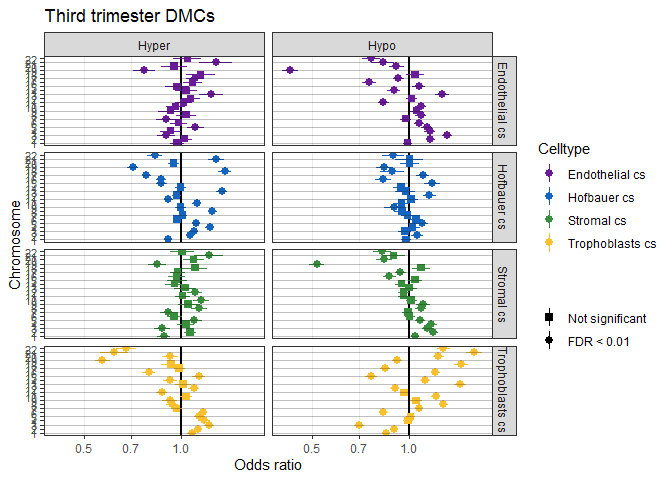
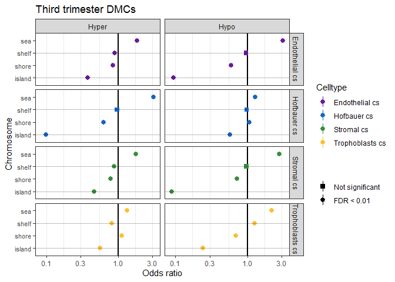

# Setup

## Libraries


```r
# libraries and data
library(tidyverse)
```

```
## -- Attaching packages -------------------------------------------------- tidyverse 1.2.1 --
```

```
## v ggplot2 3.2.0     v purrr   0.3.2
## v tibble  2.1.3     v dplyr   0.8.1
## v tidyr   0.8.3     v stringr 1.4.0
## v readr   1.3.1     v forcats 0.4.0
```

```
## Warning: package 'tibble' was built under R version 3.6.1
```

```
## -- Conflicts ----------------------------------------------------- tidyverse_conflicts() --
## x dplyr::filter() masks stats::filter()
## x dplyr::lag()    masks stats::lag()
```

```r
library(readxl)
library(annotatr)
library(fuzzyjoin)
```

```
## Warning: package 'fuzzyjoin' was built under R version 3.6.1
```

```r
library(formattable)
```

```
## Warning: package 'formattable' was built under R version 3.6.1
```

```r
library(kableExtra)
```

```
## 
## Attaching package: 'kableExtra'
```

```
## The following object is masked from 'package:dplyr':
## 
##     group_rows
```

## Data


```r
pDat <- readRDS('../../data/main/interim/2_3_pDat_contam.rds')
pDat <- pDat %>%
  mutate(Tissue = case_when(
    !(Tissue %in% c('Villi', 'Villi maternal', 'Syncytiotrophoblast')) ~ paste(Tissue, 'cs'),
    Tissue == 'Syncytiotrophoblast' ~ 'Trophoblasts enz',
    TRUE ~ Tissue
  )) 

# raw methylation data
betas <- readRDS('../../data/main/interim/1_4_betas_noob_filt.rds')

mset_noob <- readRDS('../../data/main/interim/1_4_mset_noob.rds') # for mvals
colnames(mset_noob) <- colnames(betas) <- pDat$Sample_Name
```

```
## Loading required package: minfi
```

```
## Loading required package: BiocGenerics
```

```
## Loading required package: parallel
```

```
## 
## Attaching package: 'BiocGenerics'
```

```
## The following objects are masked from 'package:parallel':
## 
##     clusterApply, clusterApplyLB, clusterCall, clusterEvalQ,
##     clusterExport, clusterMap, parApply, parCapply, parLapply,
##     parLapplyLB, parRapply, parSapply, parSapplyLB
```

```
## The following object is masked from 'package:formattable':
## 
##     normalize
```

```
## The following objects are masked from 'package:dplyr':
## 
##     combine, intersect, setdiff, union
```

```
## The following objects are masked from 'package:stats':
## 
##     IQR, mad, sd, var, xtabs
```

```
## The following objects are masked from 'package:base':
## 
##     anyDuplicated, append, as.data.frame, basename, cbind,
##     colnames, dirname, do.call, duplicated, eval, evalq, Filter,
##     Find, get, grep, grepl, intersect, is.unsorted, lapply, Map,
##     mapply, match, mget, order, paste, pmax, pmax.int, pmin,
##     pmin.int, Position, rank, rbind, Reduce, rownames, sapply,
##     setdiff, sort, table, tapply, union, unique, unsplit, which,
##     which.max, which.min
```

```
## Loading required package: GenomicRanges
```

```
## Loading required package: stats4
```

```
## Loading required package: S4Vectors
```

```
## 
## Attaching package: 'S4Vectors'
```

```
## The following objects are masked from 'package:dplyr':
## 
##     first, rename
```

```
## The following object is masked from 'package:tidyr':
## 
##     expand
```

```
## The following object is masked from 'package:base':
## 
##     expand.grid
```

```
## Loading required package: IRanges
```

```
## 
## Attaching package: 'IRanges'
```

```
## The following objects are masked from 'package:dplyr':
## 
##     collapse, desc, slice
```

```
## The following object is masked from 'package:purrr':
## 
##     reduce
```

```
## The following object is masked from 'package:grDevices':
## 
##     windows
```

```
## Loading required package: GenomeInfoDb
```

```
## Loading required package: SummarizedExperiment
```

```
## Loading required package: Biobase
```

```
## Welcome to Bioconductor
## 
##     Vignettes contain introductory material; view with
##     'browseVignettes()'. To cite Bioconductor, see
##     'citation("Biobase")', and for packages 'citation("pkgname")'.
```

```
## Loading required package: DelayedArray
```

```
## Loading required package: matrixStats
```

```
## 
## Attaching package: 'matrixStats'
```

```
## The following objects are masked from 'package:Biobase':
## 
##     anyMissing, rowMedians
```

```
## The following object is masked from 'package:dplyr':
## 
##     count
```

```
## Loading required package: BiocParallel
```

```
## 
## Attaching package: 'DelayedArray'
```

```
## The following objects are masked from 'package:matrixStats':
## 
##     colMaxs, colMins, colRanges, rowMaxs, rowMins, rowRanges
```

```
## The following object is masked from 'package:purrr':
## 
##     simplify
```

```
## The following objects are masked from 'package:base':
## 
##     aperm, apply, rowsum
```

```
## Loading required package: Biostrings
```

```
## Loading required package: XVector
```

```
## 
## Attaching package: 'XVector'
```

```
## The following object is masked from 'package:purrr':
## 
##     compact
```

```
## 
## Attaching package: 'Biostrings'
```

```
## The following object is masked from 'package:DelayedArray':
## 
##     type
```

```
## The following object is masked from 'package:base':
## 
##     strsplit
```

```
## Loading required package: bumphunter
```

```
## Loading required package: foreach
```

```
## 
## Attaching package: 'foreach'
```

```
## The following objects are masked from 'package:purrr':
## 
##     accumulate, when
```

```
## Loading required package: iterators
```

```
## Loading required package: locfit
```

```
## locfit 1.5-9.1 	 2013-03-22
```

```
## Setting options('download.file.method.GEOquery'='auto')
```

```
## Setting options('GEOquery.inmemory.gpl'=FALSE)
```

```r
mvals <- getM(mset_noob)

probe_anno <- readRDS('../../data/main/interim/1_1_probe_anno.rds')

# color key
pheatmap_color_code <- readRDS('../../data/main/interim/1_1_color_code.rds')

color_code <- readRDS('../../data/main/interim/2_3_color_code.rds')
color_code_tissue <- setNames(color_code$Colors_Tissue, color_code$label)

# DMCs
dmcs <- readRDS('../../data/main/interim/2_4_dmcs.rds')

# annotation
anno <- readRDS('Z:/Victor/Repositories/EPIC_annotation/hg19_epic_annotation.rds')

#color code
color_code <- readRDS('../../data/main/interim/2_3_color_code.rds')
color_code_tissue <- setNames(color_code$Colors_Tissue, color_code$label)
```

## Remove samples

remove contamined and non-interesting samples


```r
pDat_filt <- pDat %>% 
  filter(maternal_contamination_norm_flip < 0.35,
         !Sample_Name %in% c('PM364_hofb_cs', 'PL293_v_R2', 'PM366_vc_R2', 'P131_hofb_cs'),
         !Tissue %in% c('Villi maternal', 'Trophoblasts enz', 'Mixture cs', 'Dead Cells and Lymphocytes cs'))

# filter to first trimester
mvals_filt <- mvals[rownames(betas),pDat_filt$Sample_Name]
betas_filt <- betas[,pDat_filt$Sample_Name]
```

## Test for genomic enrichment

The strategy is to first dummy variable every genomic element that we want to test enrichment for. And then join that to the linear modelling results data frame.

Dummy variables:  for exmaple one column might be something like "intron, intron, exon, intron, 3'UTR, intergene, ...,". Which will be transformed so that we have separate columns for each category: intron: "T, T, F, T, F, F, ...", exon: "F, F, T, F, F, F, ..." etc.

Once every feature is "dummy variable'd" and we join this to the linear modelling data, then we can calculate the numbers required to run a fisher's exact test.

Note that the input list of dmcs is a 'long' table, where there is 4 celltypes/contrasts * ~800000 tested cpgs. Technically, we only need the ones defined as significant, so for now conditionally calculate the number of cpgs that are differentially methylated. An improvement to this code would be to expect as input the list of DMCS, and then another list of the background cpgs.

This took a long time to figure how to do, so eventually I would like to see this code put somewhere public that others can contribute towards.

**August 27** Separated DMCs by hypo/hyper


```r
p_thresh <- 0.01
b_thresh <- 0.25

# dummy variable all categories
annotation <- anno %>% 
  
  # mutate spread is clean, but slow. Can only work with those that have non-duplicated strings in each element
  mutate(var = 1) %>%
  spread(cpg_id, var, fill = 0) %>% 
  
  mutate(var = 1) %>%
  spread(chr, var, fill = 0) %>% 
  
  mutate(
         # cannot follow the spread strategy above, since we have numerous occurences in each element
         `1to5kb` = ifelse(grepl('1to5kb', genes_id), 1, 0),
         `3UTR` = ifelse(grepl('3UTR', genes_id), 1, 0),
         `5UTR` = ifelse(grepl('5UTR', genes_id), 1, 0),
         exon = ifelse(grepl("exon", genes_id), 1, 0),
         intergenic = ifelse(grepl('intergenic', genes_id), 1, 0),
         intron = ifelse(grepl('intron', genes_id), 1, 0),
         intronexonboundary = ifelse(grepl('intronexonboundary', genes_id), 1, 0),
         promoter = ifelse(grepl("promoter", genes_id), 1, 0),
         
         enhancer = !is.na(enhancers_id),
         pmd = !is.na(pmd_id),
         imprinted_gene_placenta = !is.na(imprinted_gene_placenta),
         imprinted_gene_general = !is.na(imprinted_gene_general),
         imprinted_dmr_general = !is.na(imprinted_dmr_general),
         imprinted_dmr_placenta = !is.na(imprinted_dmr_placenta))

# add gene annotation to dmcs
dmcs <- dmcs %>% left_join(annotation, by = c('gene' = 'cpg'))

# filter to all tested cpgs
annotation <- annotation %>%
  filter(cpg %in% dmcs$gene)
  
# tabulate the background frequency per genomic element
expected <-  annotation %>%
  dplyr::select(cpg, island:pmd, contains('imprint')) %>%
  gather(key = genomic_feature, value = present, -cpg) %>%
  
  group_by(genomic_feature) %>%
  summarize(Expected_n_in = sum(present), 
            
            Expected_n_out = nrow(annotation) - Expected_n_in,
            Expected_p_in = Expected_n_in/ nrow(annotation),
            Expected_p_out = Expected_n_out / nrow(annotation))

# tabulate observed frequency for significant cpgs
observed <- dmcs %>% 
  
  # add hypo hyper as group
  mutate(Group1 = paste0(Group1, ifelse(delta_b > 0, '.Hyper', '.Hypo'))) %>%
  
  # calculate total dmcs per cell type
  group_by(Group1) %>%
  mutate(n_total = sum(bonferroni < p_thresh & abs(delta_b) > b_thresh )) %>%
  
  # filter to just dmcs
  filter(bonferroni < p_thresh, abs(delta_b) > b_thresh) %>%
  select(Group1, gene, island:pmd, contains('imprint'), n_total) %>%

  # calculated the number of dmcs in each feature, and then the number out
  gather(key = genomic_feature, value = present, -gene, -Group1, -n_total) %>%
  group_by(Group1, genomic_feature) %>%
  summarize(Observed_n_in = sum(present), 
            
            Observed_n_out = unique(n_total) - Observed_n_in,
            Observed_p_in = Observed_n_in / unique(n_total),
            Observed_p_out = Observed_n_out / unique(n_total))

# fisher's test for enrichment
# (1) # of DMCs on var1 (already calcualted, 'Freq')
# (2) # of non-DMCs on var1
# (3) # of DMCs not on var1
# (4) # of non-DMCs not on var1


# calculate (2) (3) (4), and test enrichment
tests <- observed %>%
  
  ungroup() %>%
  
  # add in all_cpgs datarfame for calculations
  left_join(expected, by = 'genomic_feature') %>%
  
  # calculate (2), (4)
  mutate(Observed_notDMC_in = Expected_n_in - Observed_n_in,   #(2) # non-DMCs in var1
         
         # for (4)
         Observed_notDMC_out = Expected_n_out - Observed_n_out) %>%  # of non-DMCs out of Var1
  
  # test enrichment
  rowwise() %>%
  mutate(test_in = list(matrix(c(Observed_n_in, Observed_notDMC_in, 
                                   Observed_n_out, Observed_notDMC_out),2,2))) %>%
  ungroup() %>%
  
  mutate(test_out = map(test_in, ~fisher.test(., conf.int = 0.95)),
         p = map_dbl(test_out, 'p.value'),
         confidence_interval_min = map_dbl(test_out, ~.$conf.int[1]),
         confidence_interval_max = map_dbl(test_out, ~.$conf.int[2]),
         odds_ratio = map_dbl(test_out, 'estimate'),
         FDR = p.adjust(p, method = 'fdr'),
         bonferroni = p.adjust(p, method = 'bonferroni'),
         FDR01 = FDR < 0.01,
         bonferroni01 = bonferroni < 0.01) %>% 
  select(odds_ratio, contains('confidence'), FDR, FDR01, bonferroni, bonferroni01, p, everything())


tests
```

```
## # A tibble: 672 x 22
##    odds_ratio confidence_inte~ confidence_inte~      FDR FDR01 bonferroni
##         <dbl>            <dbl>            <dbl>    <dbl> <lgl>      <dbl>
##  1      0.711            0.670            0.755 6.21e-31 TRUE    1.14e-28
##  2      0.708            0.618            0.808 1.70e- 7 TRUE    4.94e- 5
##  3      0.475            0.421            0.533 1.28e-44 TRUE    2.08e-42
##  4      1.05             0.980            1.12  2.15e- 1 FALSE   1.00e+ 0
##  5      1.12             1.02             1.22  2.33e- 2 FALSE   1.00e+ 0
##  6      0.944            0.865            1.03  2.56e- 1 FALSE   1.00e+ 0
##  7      1.09             1.000            1.19  6.94e- 2 FALSE   1.00e+ 0
##  8      1.08             0.955            1.22  2.67e- 1 FALSE   1.00e+ 0
##  9      0.860            0.765            0.964 1.42e- 2 FALSE   1.00e+ 0
## 10      0.883            0.785            0.991 5.03e- 2 FALSE   1.00e+ 0
## # ... with 662 more rows, and 16 more variables: bonferroni01 <lgl>,
## #   p <dbl>, Group1 <chr>, genomic_feature <chr>, Observed_n_in <dbl>,
## #   Observed_n_out <dbl>, Observed_p_in <dbl>, Observed_p_out <dbl>,
## #   Expected_n_in <dbl>, Expected_n_out <dbl>, Expected_p_in <dbl>,
## #   Expected_p_out <dbl>, Observed_notDMC_in <dbl>,
## #   Observed_notDMC_out <dbl>, test_in <list>, test_out <list>
```

```r
# clean
tests <- tests %>%
  separate(Group1, into = c('Trimester', 'Celltype', 'Direction'), sep = '\\.') %>%
  mutate(Celltype = case_when(
    Celltype == 'Endo_cs' ~ 'Endothelial cs',
    Celltype == 'Hofb_cs' ~ 'Hofbauer cs',
    Celltype == 'Strom_cs' ~ 'Stromal cs',
    Celltype == 'Troph_cs' ~ 'Trophoblasts cs')) 
  
colors <- color_code %>% 
  filter(label %in% c('Endothelial cs', 'Hofbauer cs', 'Stromal cs', 'Trophoblasts cs'))
colors <- setNames(colors$Colors_Tissue, unique(tests$Celltype))

# categorize genomic features
tests <- tests %>% 
  mutate(
    genomic_feature_category = case_when(
      grepl('chr', genomic_feature) ~ 'chr',
      genomic_feature %in% c('1to5kb', '3UTR', '5UTR', 'exon', 'intron', 
                             'intergenic', 'intronexonboundary', 'promoter') ~ 'gene',
      genomic_feature %in% c('island', 'shore', 'shelf', 'sea') ~ 'cpg_island',
      grepl('imprint', genomic_feature) ~ 'imprinting',
      genomic_feature == 'pmd' ~ 'pmd',
      genomic_feature == 'enhancer' ~ 'enhancer'),
    FDR_cat = case_when(
      FDR < 0.05 ~ "FDR < 0.05",
      FDR < 0.01 ~ "FDR < 0.01",
      FDR < 0.001 ~ "FDR < 0.001",
      TRUE ~ "n.s")
    ) 
```

## Visualize enrichment


```r
# plot function
plot_enrich <- function(x) {
  g <- ggplot(data = x) +
  geom_hline(yintercept = 1, color = 'black', linetype = 'solid', size = 1) +
  geom_pointrange(aes(x = genomic_feature, 
                      ymin = confidence_interval_min, 
                      ymax = confidence_interval_max,
                      shape = FDR01, y = odds_ratio, color = Celltype),
                  position = position_dodge(width =0.5 )) +
  geom_vline(xintercept = seq(1, 22, 2), alpha = 0.25) +
  facet_grid(Celltype~Direction) +
  scale_color_manual(values= color_code_tissue[unique(tests$Celltype)]) +
  scale_y_log10() +
  scale_shape_manual(values = c('TRUE' = 16, 'FALSE' = 15), 
                     labels = c('Not significant', 'FDR < 0.01')) +
  coord_flip() +
  theme_bw() +
  theme(panel.grid.minor.x = element_blank(),
        panel.grid.major.y = element_blank(),
        axis.text.y = element_text(size = 8))
  print(g)
}
#chromosome
tests %>% 
  filter(genomic_feature_category == 'chr',
         !genomic_feature %in% c('chrX', 'chrY'),
         Trimester == 'Third') %>%
  mutate(genomic_feature = factor(genomic_feature, levels = paste0('chr', 1:22))) %>%
  plot_enrich() +
  scale_x_discrete(labels = 1:22) +
  labs(title = 'Third trimester DMCs', shape = '', y = 'Odds ratio', x = 'Chromosome') 
```

<!-- --><!-- -->

```r
tests %>% 
  filter(genomic_feature_category == 'chr',
         !genomic_feature %in% c('chrX', 'chrY'),
         Trimester == 'First') %>%
  mutate(genomic_feature = factor(genomic_feature, levels = paste0('chr', 1:22))) %>%
  plot_enrich() +
  scale_x_discrete(labels = 1:22) +
  labs(title = 'Third trimester DMCs', shape = '', y = 'Odds ratio', x = 'Chromosome') 
```

<!-- --><!-- -->

```r
#gene/enhancer/cpg island
tests %>% 
  filter(genomic_feature_category == 'gene' | 
           genomic_feature == 'enhancer' |
           genomic_feature_category == 'cpg_island',
         Trimester == 'Third') %>%
  mutate(genomic_feature = factor(genomic_feature, 
                                  levels = c('enhancer', '1to5kb', 'promoter', '5UTR', 'exon',
                                             'intron', 
                                             'intronexonboundary','3UTR','intergenic',
                                             
                                             'island', 'shore', 'shelf', 'sea'))) %>% 
  plot_enrich() +
  labs(title = 'Third trimester DMCs', shape = '', y = 'Odds ratio', x = '') 
```

<!-- --><!-- -->

```r
tests %>% 
  filter(genomic_feature_category == 'gene' | 
           genomic_feature == 'enhancer' |
           genomic_feature_category == 'cpg_island',
         Trimester == 'First') %>%
  mutate(genomic_feature = factor(genomic_feature, 
                                  levels = c('enhancer', '1to5kb', 'promoter', '5UTR', 'exon',
                                             'intron', 
                                             'intronexonboundary','3UTR','intergenic',
                                             
                                             'island', 'shore', 'shelf', 'sea'))) %>% 
  plot_enrich() +
  labs(title = 'First trimester DMCs', shape = '', y = 'Odds ratio', x = '') 
```

<!-- --><!-- -->

```r
# cpg islands
tests %>% 
  filter(genomic_feature_category == 'cpg_island',
         Trimester == 'Third') %>%
  mutate(genomic_feature = factor(genomic_feature, 
                                  levels = c('island', 'shore', 'shelf', 'sea'))) %>%
  ggplot() +
  geom_hline(yintercept = 1, color = 'black', linetype = 'solid', size = 1) +
  geom_pointrange(aes(x = genomic_feature, 
                      ymin = confidence_interval_min, 
                      ymax = confidence_interval_max,
                      shape = FDR01, y = odds_ratio, color = Celltype),
                  position = position_dodge(width =0.5 )) +
  geom_vline(xintercept = seq(1, 22, 2), alpha = 0.25) +
  facet_grid(Celltype~Direction) +
  scale_color_manual(values= color_code_tissue[unique(tests$Celltype)]) +
  scale_y_log10() +
  #scale_x_discrete(labels = 1:22) +
  scale_shape_manual(values = c('TRUE' = 16, 'FALSE' = 15), 
                     labels = c('Not significant', 'FDR < 0.01')) +
  coord_flip() +
  labs(title = 'Third trimester DMCs', shape = '', y = 'Odds ratio', x = 'Chromosome') +
  theme_bw() +
  theme(#panel.grid.minor.x = element_blank(),
        panel.grid.major.y = element_blank(),
        axis.text.y = element_text(size = 8))
```

<!-- -->

```r
tests %>% 
  filter(genomic_feature_category == 'cpg_island',
         Trimester == 'First') %>%
  mutate(genomic_feature = factor(genomic_feature, 
                                  levels = c('island', 'shore', 'shelf', 'sea'))) %>%
  ggplot() +
  geom_hline(yintercept = 1, color = 'black', linetype = 'solid', size = 1) +
  geom_pointrange(aes(x = genomic_feature, 
                      ymin = confidence_interval_min, 
                      ymax = confidence_interval_max,
                      shape = FDR01, y = odds_ratio, color = Celltype),
                  position = position_dodge(width =0.5 )) +
  geom_vline(xintercept = seq(1, 22, 2), alpha = 0.25) +
  facet_grid(Celltype~Direction) +
  scale_color_manual(values= color_code_tissue[unique(tests$Celltype)]) +
  scale_y_log10() +
  #scale_x_discrete(labels = 1:22) +
  scale_shape_manual(values = c('TRUE' = 16, 'FALSE' = 15), 
                     labels = c('Not significant', 'FDR < 0.01')) +
  coord_flip() +
  labs(title = 'First trimester DMCs', shape = '', y = 'Odds ratio', x = 'Chromosome') +
  theme_bw() +
  theme(#panel.grid.minor.x = element_blank(),
        panel.grid.major.y = element_blank(),
        axis.text.y = element_text(size = 8))
```

<!-- -->

```r
# pmd
tests %>% 
  filter(genomic_feature_category == 'pmd') %>%
  ggplot() +
  geom_hline(yintercept = 1, color = 'black', linetype = 'solid', size = 1) +
  geom_pointrange(aes(x = Trimester, 
                      ymin = confidence_interval_min, 
                      ymax = confidence_interval_max,
                      shape = FDR01, y = odds_ratio, color = Celltype),
                  position = position_dodge(width =0.5 )) +
#  geom_vline(xintercept = seq(1, 22, 2), alpha = 0.25) +
  facet_grid(.~Direction) +
  scale_color_manual(values= color_code_tissue[unique(tests$Celltype)]) +
  scale_y_log10() +
  #scale_x_discrete(labels = 1:22) +
  scale_shape_manual(values = c('TRUE' = 16, 'FALSE' = 15), 
                     labels = c('Not significant', 'FDR < 0.01')) +
  coord_flip() +
  labs(title = 'Partially Methylated Domains', shape = '', y = 'Odds ratio', x = '') +
  theme_bw() +
  theme(#panel.grid.minor.x = element_blank(),
        #panel.grid.major.y = element_blank(),
        axis.text.y = element_text(size = 8))
```

<!-- -->

```r
# imprint
tests %>% 
  filter(genomic_feature_category == 'imprinting', 
         Trimester == 'Third') %>%
  ggplot() +
  geom_hline(yintercept = 1, color = 'black', linetype = 'solid', size = 1) +
  geom_pointrange(aes(x = genomic_feature, 
                      ymin = confidence_interval_min, 
                      ymax = confidence_interval_max,
                      shape = FDR01, y = odds_ratio, color = Celltype),
                  position = position_dodge(width =0.5 )) +
#  geom_vline(xintercept = seq(1, 22, 2), alpha = 0.25) +
  facet_grid(Celltype~Direction) +
  scale_color_manual(values= color_code_tissue[unique(tests$Celltype)]) +
  scale_y_log10() +
  #scale_x_discrete(labels = 1:22) +
  scale_shape_manual(values = c('TRUE' = 16, 'FALSE' = 15), 
                     labels = c('Not significant', 'FDR < 0.01')) +
  coord_flip() +
  labs(title = 'Third', shape = '', y = 'Odds ratio', x = '') +
  theme_bw() +
  theme(#panel.grid.minor.x = element_blank(),
        #panel.grid.major.y = element_blank(),
        axis.text.y = element_text(size = 8))
```

<!-- -->

```r
mult_format <- function() {
     function(x) format(100*x,digits = 2) 
}

tests %>% 
  filter(genomic_feature_category == 'imprinting', 
         Trimester == 'First') %>%
  ggplot() +
  geom_hline(yintercept = 1, color = 'black', linetype = 'solid', size = 1) +
  geom_pointrange(aes(x = genomic_feature, 
                      ymin = confidence_interval_min, 
                      ymax = confidence_interval_max,
                      shape = FDR01, y = odds_ratio, color = Celltype),
                  position = position_dodge(width =0.5 )) +
#  geom_vline(xintercept = seq(1, 22, 2), alpha = 0.25) +
  facet_grid(Celltype~Direction) +
  scale_color_manual(values= color_code_tissue[unique(tests$Celltype)]) +
  #scale_y_continuous(trans = scales::log2_trans(), labels = function(x) formatC(x,digits = 1)) +
  #scale_x_discrete(labels = 1:22) +
  scale_shape_manual(values = c('TRUE' = 16, 'FALSE' = 15), 
                     labels = c('Not significant', 'FDR < 0.01')) +
  scale_y_log10() +
  coord_flip() +
  labs(title = 'First', shape = '', y = 'Odds ratio', x = '') +
  theme_bw() +
  theme(#panel.grid.minor.x = element_blank(),
        #panel.grid.major.y = element_blank(),
        axis.text.y = element_text(size = 8))
```

```
## Warning: Transformation introduced infinite values in continuous y-axis

## Warning: Transformation introduced infinite values in continuous y-axis
```

<!-- -->


```r
cb <- function(x) {
  range <- max(abs(x))
  width <- round(abs(x / range * 50), 2)
  ifelse(
    x > 0,
    paste0(
      '<span style="display: inline-block; border-radius: 2px; ', 
      'padding-right: 2px; background-color: lightgreen; width: ', 
      width, '%; margin-left: 50%; text-align: left;">', percent(x), '</span>'
    ),
    paste0(
      '<span style="display: inline-block; border-radius: 2px; ', 
      'padding-right: 2px; background-color: lightpink; width: ', 
      width, '%; margin-right: 50%; text-align: right; float: right; ">', percent(x), '</span>'
    )
  )
}

tests %>% 
  # filter to chromosome
  filter(genomic_feature_category == 'chr',
         !genomic_feature %in% c('chrX', 'chrY')) %>%
  # create key
  mutate(genomic_feature = factor(genomic_feature, levels = paste0('chr', 1:22)),
         key = paste0(Trimester , '_', Celltype , '_', Direction),
         Observed_p_minus_expected = (Observed_p_in - Expected_p_in)) %>%
  select(key, genomic_feature, Observed_p_minus_expected)  %>%
  mutate(Observed_p_minus_expected = cb(Observed_p_minus_expected)) %>%
  
  
  spread(key= key, value = Observed_p_minus_expected) %>%
  kable(escape = F) %>%
  kable_styling()
```

<table class="table" style="margin-left: auto; margin-right: auto;">
 <thead>
  <tr>
   <th style="text-align:left;"> genomic_feature </th>
   <th style="text-align:left;"> First_Endothelial cs_Hyper </th>
   <th style="text-align:left;"> First_Endothelial cs_Hypo </th>
   <th style="text-align:left;"> First_Hofbauer cs_Hyper </th>
   <th style="text-align:left;"> First_Hofbauer cs_Hypo </th>
   <th style="text-align:left;"> First_Stromal cs_Hyper </th>
   <th style="text-align:left;"> First_Stromal cs_Hypo </th>
   <th style="text-align:left;"> First_Trophoblasts cs_Hyper </th>
   <th style="text-align:left;"> First_Trophoblasts cs_Hypo </th>
   <th style="text-align:left;"> Third_Endothelial cs_Hyper </th>
   <th style="text-align:left;"> Third_Endothelial cs_Hypo </th>
   <th style="text-align:left;"> Third_Hofbauer cs_Hyper </th>
   <th style="text-align:left;"> Third_Hofbauer cs_Hypo </th>
   <th style="text-align:left;"> Third_Stromal cs_Hyper </th>
   <th style="text-align:left;"> Third_Stromal cs_Hypo </th>
   <th style="text-align:left;"> Third_Trophoblasts cs_Hyper </th>
   <th style="text-align:left;"> Third_Trophoblasts cs_Hypo </th>
  </tr>
 </thead>
<tbody>
  <tr>
   <td style="text-align:left;"> chr1 </td>
   <td style="text-align:left;"> <span style="display: inline-block; border-radius: 2px; padding-right: 2px; background-color: lightgreen; width: 7.03%; margin-left: 50%; text-align: left;">0.41%</span> </td>
   <td style="text-align:left;"> <span style="display: inline-block; border-radius: 2px; padding-right: 2px; background-color: lightpink; width: 16.39%; margin-right: 50%; text-align: right; float: right; ">-0.95%</span> </td>
   <td style="text-align:left;"> <span style="display: inline-block; border-radius: 2px; padding-right: 2px; background-color: lightgreen; width: 8.58%; margin-left: 50%; text-align: left;">0.50%</span> </td>
   <td style="text-align:left;"> <span style="display: inline-block; border-radius: 2px; padding-right: 2px; background-color: lightgreen; width: 0.81%; margin-left: 50%; text-align: left;">0.05%</span> </td>
   <td style="text-align:left;"> <span style="display: inline-block; border-radius: 2px; padding-right: 2px; background-color: lightpink; width: 17.83%; margin-right: 50%; text-align: right; float: right; ">-1.04%</span> </td>
   <td style="text-align:left;"> <span style="display: inline-block; border-radius: 2px; padding-right: 2px; background-color: lightpink; width: 2.49%; margin-right: 50%; text-align: right; float: right; ">-0.14%</span> </td>
   <td style="text-align:left;"> <span style="display: inline-block; border-radius: 2px; padding-right: 2px; background-color: lightgreen; width: 4%; margin-left: 50%; text-align: left;">0.23%</span> </td>
   <td style="text-align:left;"> <span style="display: inline-block; border-radius: 2px; padding-right: 2px; background-color: lightpink; width: 1.66%; margin-right: 50%; text-align: right; float: right; ">-0.10%</span> </td>
   <td style="text-align:left;"> <span style="display: inline-block; border-radius: 2px; padding-right: 2px; background-color: lightpink; width: 4.8%; margin-right: 50%; text-align: right; float: right; ">-0.28%</span> </td>
   <td style="text-align:left;"> <span style="display: inline-block; border-radius: 2px; padding-right: 2px; background-color: lightpink; width: 1.49%; margin-right: 50%; text-align: right; float: right; ">-0.09%</span> </td>
   <td style="text-align:left;"> <span style="display: inline-block; border-radius: 2px; padding-right: 2px; background-color: lightpink; width: 12.02%; margin-right: 50%; text-align: right; float: right; ">-0.70%</span> </td>
   <td style="text-align:left;"> <span style="display: inline-block; border-radius: 2px; padding-right: 2px; background-color: lightpink; width: 2.94%; margin-right: 50%; text-align: right; float: right; ">-0.17%</span> </td>
   <td style="text-align:left;"> <span style="display: inline-block; border-radius: 2px; padding-right: 2px; background-color: lightpink; width: 17.51%; margin-right: 50%; text-align: right; float: right; ">-1.02%</span> </td>
   <td style="text-align:left;"> <span style="display: inline-block; border-radius: 2px; padding-right: 2px; background-color: lightgreen; width: 6.06%; margin-left: 50%; text-align: left;">0.35%</span> </td>
   <td style="text-align:left;"> <span style="display: inline-block; border-radius: 2px; padding-right: 2px; background-color: lightgreen; width: 10.44%; margin-left: 50%; text-align: left;">0.61%</span> </td>
   <td style="text-align:left;"> <span style="display: inline-block; border-radius: 2px; padding-right: 2px; background-color: lightpink; width: 21.14%; margin-right: 50%; text-align: right; float: right; ">-1.23%</span> </td>
  </tr>
  <tr>
   <td style="text-align:left;"> chr2 </td>
   <td style="text-align:left;"> <span style="display: inline-block; border-radius: 2px; padding-right: 2px; background-color: lightgreen; width: 18.8%; margin-left: 50%; text-align: left;">1.09%</span> </td>
   <td style="text-align:left;"> <span style="display: inline-block; border-radius: 2px; padding-right: 2px; background-color: lightgreen; width: 16.7%; margin-left: 50%; text-align: left;">0.97%</span> </td>
   <td style="text-align:left;"> <span style="display: inline-block; border-radius: 2px; padding-right: 2px; background-color: lightgreen; width: 8.46%; margin-left: 50%; text-align: left;">0.49%</span> </td>
   <td style="text-align:left;"> <span style="display: inline-block; border-radius: 2px; padding-right: 2px; background-color: lightgreen; width: 10.34%; margin-left: 50%; text-align: left;">0.60%</span> </td>
   <td style="text-align:left;"> <span style="display: inline-block; border-radius: 2px; padding-right: 2px; background-color: lightgreen; width: 25.2%; margin-left: 50%; text-align: left;">1.47%</span> </td>
   <td style="text-align:left;"> <span style="display: inline-block; border-radius: 2px; padding-right: 2px; background-color: lightgreen; width: 16.8%; margin-left: 50%; text-align: left;">0.98%</span> </td>
   <td style="text-align:left;"> <span style="display: inline-block; border-radius: 2px; padding-right: 2px; background-color: lightgreen; width: 23.39%; margin-left: 50%; text-align: left;">1.36%</span> </td>
   <td style="text-align:left;"> <span style="display: inline-block; border-radius: 2px; padding-right: 2px; background-color: lightgreen; width: 6.21%; margin-left: 50%; text-align: left;">0.36%</span> </td>
   <td style="text-align:left;"> <span style="display: inline-block; border-radius: 2px; padding-right: 2px; background-color: lightgreen; width: 2.71%; margin-left: 50%; text-align: left;">0.16%</span> </td>
   <td style="text-align:left;"> <span style="display: inline-block; border-radius: 2px; padding-right: 2px; background-color: lightgreen; width: 18.33%; margin-left: 50%; text-align: left;">1.07%</span> </td>
   <td style="text-align:left;"> <span style="display: inline-block; border-radius: 2px; padding-right: 2px; background-color: lightgreen; width: 6.38%; margin-left: 50%; text-align: left;">0.37%</span> </td>
   <td style="text-align:left;"> <span style="display: inline-block; border-radius: 2px; padding-right: 2px; background-color: lightgreen; width: 6.82%; margin-left: 50%; text-align: left;">0.40%</span> </td>
   <td style="text-align:left;"> <span style="display: inline-block; border-radius: 2px; padding-right: 2px; background-color: lightgreen; width: 7.58%; margin-left: 50%; text-align: left;">0.44%</span> </td>
   <td style="text-align:left;"> <span style="display: inline-block; border-radius: 2px; padding-right: 2px; background-color: lightgreen; width: 20.94%; margin-left: 50%; text-align: left;">1.22%</span> </td>
   <td style="text-align:left;"> <span style="display: inline-block; border-radius: 2px; padding-right: 2px; background-color: lightgreen; width: 14.12%; margin-left: 50%; text-align: left;">0.82%</span> </td>
   <td style="text-align:left;"> <span style="display: inline-block; border-radius: 2px; padding-right: 2px; background-color: lightpink; width: 11.53%; margin-right: 50%; text-align: right; float: right; ">-0.67%</span> </td>
  </tr>
  <tr>
   <td style="text-align:left;"> chr3 </td>
   <td style="text-align:left;"> <span style="display: inline-block; border-radius: 2px; padding-right: 2px; background-color: lightpink; width: 3.12%; margin-right: 50%; text-align: right; float: right; ">-0.18%</span> </td>
   <td style="text-align:left;"> <span style="display: inline-block; border-radius: 2px; padding-right: 2px; background-color: lightgreen; width: 22.46%; margin-left: 50%; text-align: left;">1.31%</span> </td>
   <td style="text-align:left;"> <span style="display: inline-block; border-radius: 2px; padding-right: 2px; background-color: lightgreen; width: 3.25%; margin-left: 50%; text-align: left;">0.19%</span> </td>
   <td style="text-align:left;"> <span style="display: inline-block; border-radius: 2px; padding-right: 2px; background-color: lightgreen; width: 1.49%; margin-left: 50%; text-align: left;">0.09%</span> </td>
   <td style="text-align:left;"> <span style="display: inline-block; border-radius: 2px; padding-right: 2px; background-color: lightgreen; width: 18.02%; margin-left: 50%; text-align: left;">1.05%</span> </td>
   <td style="text-align:left;"> <span style="display: inline-block; border-radius: 2px; padding-right: 2px; background-color: lightgreen; width: 22.14%; margin-left: 50%; text-align: left;">1.29%</span> </td>
   <td style="text-align:left;"> <span style="display: inline-block; border-radius: 2px; padding-right: 2px; background-color: lightgreen; width: 10.81%; margin-left: 50%; text-align: left;">0.63%</span> </td>
   <td style="text-align:left;"> <span style="display: inline-block; border-radius: 2px; padding-right: 2px; background-color: lightpink; width: 10.05%; margin-right: 50%; text-align: right; float: right; ">-0.58%</span> </td>
   <td style="text-align:left;"> <span style="display: inline-block; border-radius: 2px; padding-right: 2px; background-color: lightpink; width: 9.83%; margin-right: 50%; text-align: right; float: right; ">-0.57%</span> </td>
   <td style="text-align:left;"> <span style="display: inline-block; border-radius: 2px; padding-right: 2px; background-color: lightgreen; width: 26.51%; margin-left: 50%; text-align: left;">1.54%</span> </td>
   <td style="text-align:left;"> <span style="display: inline-block; border-radius: 2px; padding-right: 2px; background-color: lightgreen; width: 7.91%; margin-left: 50%; text-align: left;">0.46%</span> </td>
   <td style="text-align:left;"> <span style="display: inline-block; border-radius: 2px; padding-right: 2px; background-color: lightpink; width: 2.58%; margin-right: 50%; text-align: right; float: right; ">-0.15%</span> </td>
   <td style="text-align:left;"> <span style="display: inline-block; border-radius: 2px; padding-right: 2px; background-color: lightpink; width: 12.24%; margin-right: 50%; text-align: right; float: right; ">-0.71%</span> </td>
   <td style="text-align:left;"> <span style="display: inline-block; border-radius: 2px; padding-right: 2px; background-color: lightgreen; width: 11.65%; margin-left: 50%; text-align: left;">0.68%</span> </td>
   <td style="text-align:left;"> <span style="display: inline-block; border-radius: 2px; padding-right: 2px; background-color: lightgreen; width: 19.12%; margin-left: 50%; text-align: left;">1.11%</span> </td>
   <td style="text-align:left;"> <span style="display: inline-block; border-radius: 2px; padding-right: 2px; background-color: lightpink; width: 26.56%; margin-right: 50%; text-align: right; float: right; ">-1.55%</span> </td>
  </tr>
  <tr>
   <td style="text-align:left;"> chr4 </td>
   <td style="text-align:left;"> <span style="display: inline-block; border-radius: 2px; padding-right: 2px; background-color: lightpink; width: 6.5%; margin-right: 50%; text-align: right; float: right; ">-0.38%</span> </td>
   <td style="text-align:left;"> <span style="display: inline-block; border-radius: 2px; padding-right: 2px; background-color: lightgreen; width: 3.62%; margin-left: 50%; text-align: left;">0.21%</span> </td>
   <td style="text-align:left;"> <span style="display: inline-block; border-radius: 2px; padding-right: 2px; background-color: lightpink; width: 0.61%; margin-right: 50%; text-align: right; float: right; ">-0.04%</span> </td>
   <td style="text-align:left;"> <span style="display: inline-block; border-radius: 2px; padding-right: 2px; background-color: lightpink; width: 2.24%; margin-right: 50%; text-align: right; float: right; ">-0.13%</span> </td>
   <td style="text-align:left;"> <span style="display: inline-block; border-radius: 2px; padding-right: 2px; background-color: lightgreen; width: 10.88%; margin-left: 50%; text-align: left;">0.63%</span> </td>
   <td style="text-align:left;"> <span style="display: inline-block; border-radius: 2px; padding-right: 2px; background-color: lightgreen; width: 14.53%; margin-left: 50%; text-align: left;">0.85%</span> </td>
   <td style="text-align:left;"> <span style="display: inline-block; border-radius: 2px; padding-right: 2px; background-color: lightgreen; width: 8.09%; margin-left: 50%; text-align: left;">0.47%</span> </td>
   <td style="text-align:left;"> <span style="display: inline-block; border-radius: 2px; padding-right: 2px; background-color: lightpink; width: 0.78%; margin-right: 50%; text-align: right; float: right; ">-0.05%</span> </td>
   <td style="text-align:left;"> <span style="display: inline-block; border-radius: 2px; padding-right: 2px; background-color: lightpink; width: 5.17%; margin-right: 50%; text-align: right; float: right; ">-0.30%</span> </td>
   <td style="text-align:left;"> <span style="display: inline-block; border-radius: 2px; padding-right: 2px; background-color: lightgreen; width: 10.31%; margin-left: 50%; text-align: left;">0.60%</span> </td>
   <td style="text-align:left;"> <span style="display: inline-block; border-radius: 2px; padding-right: 2px; background-color: lightgreen; width: 13.39%; margin-left: 50%; text-align: left;">0.78%</span> </td>
   <td style="text-align:left;"> <span style="display: inline-block; border-radius: 2px; padding-right: 2px; background-color: lightgreen; width: 1.66%; margin-left: 50%; text-align: left;">0.10%</span> </td>
   <td style="text-align:left;"> <span style="display: inline-block; border-radius: 2px; padding-right: 2px; background-color: lightgreen; width: 2.25%; margin-left: 50%; text-align: left;">0.13%</span> </td>
   <td style="text-align:left;"> <span style="display: inline-block; border-radius: 2px; padding-right: 2px; background-color: lightgreen; width: 11.24%; margin-left: 50%; text-align: left;">0.65%</span> </td>
   <td style="text-align:left;"> <span style="display: inline-block; border-radius: 2px; padding-right: 2px; background-color: lightgreen; width: 11.34%; margin-left: 50%; text-align: left;">0.66%</span> </td>
   <td style="text-align:left;"> <span style="display: inline-block; border-radius: 2px; padding-right: 2px; background-color: lightpink; width: 0.5%; margin-right: 50%; text-align: right; float: right; ">-0.03%</span> </td>
  </tr>
  <tr>
   <td style="text-align:left;"> chr5 </td>
   <td style="text-align:left;"> <span style="display: inline-block; border-radius: 2px; padding-right: 2px; background-color: lightgreen; width: 8.77%; margin-left: 50%; text-align: left;">0.51%</span> </td>
   <td style="text-align:left;"> <span style="display: inline-block; border-radius: 2px; padding-right: 2px; background-color: lightgreen; width: 18.85%; margin-left: 50%; text-align: left;">1.10%</span> </td>
   <td style="text-align:left;"> <span style="display: inline-block; border-radius: 2px; padding-right: 2px; background-color: lightgreen; width: 0.62%; margin-left: 50%; text-align: left;">0.04%</span> </td>
   <td style="text-align:left;"> <span style="display: inline-block; border-radius: 2px; padding-right: 2px; background-color: lightpink; width: 2.43%; margin-right: 50%; text-align: right; float: right; ">-0.14%</span> </td>
   <td style="text-align:left;"> <span style="display: inline-block; border-radius: 2px; padding-right: 2px; background-color: lightgreen; width: 1.79%; margin-left: 50%; text-align: left;">0.10%</span> </td>
   <td style="text-align:left;"> <span style="display: inline-block; border-radius: 2px; padding-right: 2px; background-color: lightgreen; width: 10.84%; margin-left: 50%; text-align: left;">0.63%</span> </td>
   <td style="text-align:left;"> <span style="display: inline-block; border-radius: 2px; padding-right: 2px; background-color: lightgreen; width: 11.71%; margin-left: 50%; text-align: left;">0.68%</span> </td>
   <td style="text-align:left;"> <span style="display: inline-block; border-radius: 2px; padding-right: 2px; background-color: lightgreen; width: 6.29%; margin-left: 50%; text-align: left;">0.37%</span> </td>
   <td style="text-align:left;"> <span style="display: inline-block; border-radius: 2px; padding-right: 2px; background-color: lightgreen; width: 8.87%; margin-left: 50%; text-align: left;">0.52%</span> </td>
   <td style="text-align:left;"> <span style="display: inline-block; border-radius: 2px; padding-right: 2px; background-color: lightgreen; width: 10.54%; margin-left: 50%; text-align: left;">0.61%</span> </td>
   <td style="text-align:left;"> <span style="display: inline-block; border-radius: 2px; padding-right: 2px; background-color: lightgreen; width: 8.33%; margin-left: 50%; text-align: left;">0.48%</span> </td>
   <td style="text-align:left;"> <span style="display: inline-block; border-radius: 2px; padding-right: 2px; background-color: lightgreen; width: 7.88%; margin-left: 50%; text-align: left;">0.46%</span> </td>
   <td style="text-align:left;"> <span style="display: inline-block; border-radius: 2px; padding-right: 2px; background-color: lightgreen; width: 7.92%; margin-left: 50%; text-align: left;">0.46%</span> </td>
   <td style="text-align:left;"> <span style="display: inline-block; border-radius: 2px; padding-right: 2px; background-color: lightgreen; width: 6.54%; margin-left: 50%; text-align: left;">0.38%</span> </td>
   <td style="text-align:left;"> <span style="display: inline-block; border-radius: 2px; padding-right: 2px; background-color: lightgreen; width: 10.99%; margin-left: 50%; text-align: left;">0.64%</span> </td>
   <td style="text-align:left;"> <span style="display: inline-block; border-radius: 2px; padding-right: 2px; background-color: lightgreen; width: 0.84%; margin-left: 50%; text-align: left;">0.05%</span> </td>
  </tr>
  <tr>
   <td style="text-align:left;"> chr6 </td>
   <td style="text-align:left;"> <span style="display: inline-block; border-radius: 2px; padding-right: 2px; background-color: lightgreen; width: 7.32%; margin-left: 50%; text-align: left;">0.43%</span> </td>
   <td style="text-align:left;"> <span style="display: inline-block; border-radius: 2px; padding-right: 2px; background-color: lightgreen; width: 12.98%; margin-left: 50%; text-align: left;">0.76%</span> </td>
   <td style="text-align:left;"> <span style="display: inline-block; border-radius: 2px; padding-right: 2px; background-color: lightpink; width: 9.37%; margin-right: 50%; text-align: right; float: right; ">-0.55%</span> </td>
   <td style="text-align:left;"> <span style="display: inline-block; border-radius: 2px; padding-right: 2px; background-color: lightgreen; width: 5.09%; margin-left: 50%; text-align: left;">0.30%</span> </td>
   <td style="text-align:left;"> <span style="display: inline-block; border-radius: 2px; padding-right: 2px; background-color: lightpink; width: 9.38%; margin-right: 50%; text-align: right; float: right; ">-0.55%</span> </td>
   <td style="text-align:left;"> <span style="display: inline-block; border-radius: 2px; padding-right: 2px; background-color: lightpink; width: 8.64%; margin-right: 50%; text-align: right; float: right; ">-0.50%</span> </td>
   <td style="text-align:left;"> <span style="display: inline-block; border-radius: 2px; padding-right: 2px; background-color: lightgreen; width: 16.16%; margin-left: 50%; text-align: left;">0.94%</span> </td>
   <td style="text-align:left;"> <span style="display: inline-block; border-radius: 2px; padding-right: 2px; background-color: lightpink; width: 10.56%; margin-right: 50%; text-align: right; float: right; ">-0.61%</span> </td>
   <td style="text-align:left;"> <span style="display: inline-block; border-radius: 2px; padding-right: 2px; background-color: lightpink; width: 2.09%; margin-right: 50%; text-align: right; float: right; ">-0.12%</span> </td>
   <td style="text-align:left;"> <span style="display: inline-block; border-radius: 2px; padding-right: 2px; background-color: lightgreen; width: 7.01%; margin-left: 50%; text-align: left;">0.41%</span> </td>
   <td style="text-align:left;"> <span style="display: inline-block; border-radius: 2px; padding-right: 2px; background-color: lightpink; width: 2.83%; margin-right: 50%; text-align: right; float: right; ">-0.16%</span> </td>
   <td style="text-align:left;"> <span style="display: inline-block; border-radius: 2px; padding-right: 2px; background-color: lightgreen; width: 4.81%; margin-left: 50%; text-align: left;">0.28%</span> </td>
   <td style="text-align:left;"> <span style="display: inline-block; border-radius: 2px; padding-right: 2px; background-color: lightpink; width: 4.87%; margin-right: 50%; text-align: right; float: right; ">-0.28%</span> </td>
   <td style="text-align:left;"> <span style="display: inline-block; border-radius: 2px; padding-right: 2px; background-color: lightgreen; width: 0.44%; margin-left: 50%; text-align: left;">0.03%</span> </td>
   <td style="text-align:left;"> <span style="display: inline-block; border-radius: 2px; padding-right: 2px; background-color: lightgreen; width: 15.14%; margin-left: 50%; text-align: left;">0.88%</span> </td>
   <td style="text-align:left;"> <span style="display: inline-block; border-radius: 2px; padding-right: 2px; background-color: lightpink; width: 15.45%; margin-right: 50%; text-align: right; float: right; ">-0.90%</span> </td>
  </tr>
  <tr>
   <td style="text-align:left;"> chr7 </td>
   <td style="text-align:left;"> <span style="display: inline-block; border-radius: 2px; padding-right: 2px; background-color: lightpink; width: 14.73%; margin-right: 50%; text-align: right; float: right; ">-0.86%</span> </td>
   <td style="text-align:left;"> <span style="display: inline-block; border-radius: 2px; padding-right: 2px; background-color: lightpink; width: 6.43%; margin-right: 50%; text-align: right; float: right; ">-0.37%</span> </td>
   <td style="text-align:left;"> <span style="display: inline-block; border-radius: 2px; padding-right: 2px; background-color: lightpink; width: 3.5%; margin-right: 50%; text-align: right; float: right; ">-0.20%</span> </td>
   <td style="text-align:left;"> <span style="display: inline-block; border-radius: 2px; padding-right: 2px; background-color: lightpink; width: 2.89%; margin-right: 50%; text-align: right; float: right; ">-0.17%</span> </td>
   <td style="text-align:left;"> <span style="display: inline-block; border-radius: 2px; padding-right: 2px; background-color: lightpink; width: 9.15%; margin-right: 50%; text-align: right; float: right; ">-0.53%</span> </td>
   <td style="text-align:left;"> <span style="display: inline-block; border-radius: 2px; padding-right: 2px; background-color: lightpink; width: 2.36%; margin-right: 50%; text-align: right; float: right; ">-0.14%</span> </td>
   <td style="text-align:left;"> <span style="display: inline-block; border-radius: 2px; padding-right: 2px; background-color: lightgreen; width: 3.45%; margin-left: 50%; text-align: left;">0.20%</span> </td>
   <td style="text-align:left;"> <span style="display: inline-block; border-radius: 2px; padding-right: 2px; background-color: lightgreen; width: 2.5%; margin-left: 50%; text-align: left;">0.15%</span> </td>
   <td style="text-align:left;"> <span style="display: inline-block; border-radius: 2px; padding-right: 2px; background-color: lightpink; width: 9.05%; margin-right: 50%; text-align: right; float: right; ">-0.53%</span> </td>
   <td style="text-align:left;"> <span style="display: inline-block; border-radius: 2px; padding-right: 2px; background-color: lightpink; width: 1.88%; margin-right: 50%; text-align: right; float: right; ">-0.11%</span> </td>
   <td style="text-align:left;"> <span style="display: inline-block; border-radius: 2px; padding-right: 2px; background-color: lightgreen; width: 0.65%; margin-left: 50%; text-align: left;">0.04%</span> </td>
   <td style="text-align:left;"> <span style="display: inline-block; border-radius: 2px; padding-right: 2px; background-color: lightpink; width: 0.82%; margin-right: 50%; text-align: right; float: right; ">-0.05%</span> </td>
   <td style="text-align:left;"> <span style="display: inline-block; border-radius: 2px; padding-right: 2px; background-color: lightpink; width: 7.59%; margin-right: 50%; text-align: right; float: right; ">-0.44%</span> </td>
   <td style="text-align:left;"> <span style="display: inline-block; border-radius: 2px; padding-right: 2px; background-color: lightpink; width: 0.59%; margin-right: 50%; text-align: right; float: right; ">-0.03%</span> </td>
   <td style="text-align:left;"> <span style="display: inline-block; border-radius: 2px; padding-right: 2px; background-color: lightpink; width: 2.91%; margin-right: 50%; text-align: right; float: right; ">-0.17%</span> </td>
   <td style="text-align:left;"> <span style="display: inline-block; border-radius: 2px; padding-right: 2px; background-color: lightgreen; width: 5.68%; margin-left: 50%; text-align: left;">0.33%</span> </td>
  </tr>
  <tr>
   <td style="text-align:left;"> chr8 </td>
   <td style="text-align:left;"> <span style="display: inline-block; border-radius: 2px; padding-right: 2px; background-color: lightgreen; width: 5.68%; margin-left: 50%; text-align: left;">0.33%</span> </td>
   <td style="text-align:left;"> <span style="display: inline-block; border-radius: 2px; padding-right: 2px; background-color: lightgreen; width: 2.09%; margin-left: 50%; text-align: left;">0.12%</span> </td>
   <td style="text-align:left;"> <span style="display: inline-block; border-radius: 2px; padding-right: 2px; background-color: lightgreen; width: 7.68%; margin-left: 50%; text-align: left;">0.45%</span> </td>
   <td style="text-align:left;"> <span style="display: inline-block; border-radius: 2px; padding-right: 2px; background-color: lightpink; width: 1.91%; margin-right: 50%; text-align: right; float: right; ">-0.11%</span> </td>
   <td style="text-align:left;"> <span style="display: inline-block; border-radius: 2px; padding-right: 2px; background-color: lightgreen; width: 20.83%; margin-left: 50%; text-align: left;">1.21%</span> </td>
   <td style="text-align:left;"> <span style="display: inline-block; border-radius: 2px; padding-right: 2px; background-color: lightgreen; width: 15.75%; margin-left: 50%; text-align: left;">0.92%</span> </td>
   <td style="text-align:left;"> <span style="display: inline-block; border-radius: 2px; padding-right: 2px; background-color: lightpink; width: 6.22%; margin-right: 50%; text-align: right; float: right; ">-0.36%</span> </td>
   <td style="text-align:left;"> <span style="display: inline-block; border-radius: 2px; padding-right: 2px; background-color: lightgreen; width: 9.39%; margin-left: 50%; text-align: left;">0.55%</span> </td>
   <td style="text-align:left;"> <span style="display: inline-block; border-radius: 2px; padding-right: 2px; background-color: lightgreen; width: 2.48%; margin-left: 50%; text-align: left;">0.14%</span> </td>
   <td style="text-align:left;"> <span style="display: inline-block; border-radius: 2px; padding-right: 2px; background-color: lightgreen; width: 5.97%; margin-left: 50%; text-align: left;">0.35%</span> </td>
   <td style="text-align:left;"> <span style="display: inline-block; border-radius: 2px; padding-right: 2px; background-color: lightgreen; width: 15.4%; margin-left: 50%; text-align: left;">0.90%</span> </td>
   <td style="text-align:left;"> <span style="display: inline-block; border-radius: 2px; padding-right: 2px; background-color: lightpink; width: 3.46%; margin-right: 50%; text-align: right; float: right; ">-0.20%</span> </td>
   <td style="text-align:left;"> <span style="display: inline-block; border-radius: 2px; padding-right: 2px; background-color: lightgreen; width: 9.42%; margin-left: 50%; text-align: left;">0.55%</span> </td>
   <td style="text-align:left;"> <span style="display: inline-block; border-radius: 2px; padding-right: 2px; background-color: lightgreen; width: 5.92%; margin-left: 50%; text-align: left;">0.34%</span> </td>
   <td style="text-align:left;"> <span style="display: inline-block; border-radius: 2px; padding-right: 2px; background-color: lightpink; width: 4.56%; margin-right: 50%; text-align: right; float: right; ">-0.27%</span> </td>
   <td style="text-align:left;"> <span style="display: inline-block; border-radius: 2px; padding-right: 2px; background-color: lightgreen; width: 17.63%; margin-left: 50%; text-align: left;">1.03%</span> </td>
  </tr>
  <tr>
   <td style="text-align:left;"> chr9 </td>
   <td style="text-align:left;"> <span style="display: inline-block; border-radius: 2px; padding-right: 2px; background-color: lightgreen; width: 0.36%; margin-left: 50%; text-align: left;">0.02%</span> </td>
   <td style="text-align:left;"> <span style="display: inline-block; border-radius: 2px; padding-right: 2px; background-color: lightgreen; width: 12.07%; margin-left: 50%; text-align: left;">0.70%</span> </td>
   <td style="text-align:left;"> <span style="display: inline-block; border-radius: 2px; padding-right: 2px; background-color: lightgreen; width: 6.88%; margin-left: 50%; text-align: left;">0.40%</span> </td>
   <td style="text-align:left;"> <span style="display: inline-block; border-radius: 2px; padding-right: 2px; background-color: lightpink; width: 5.17%; margin-right: 50%; text-align: right; float: right; ">-0.30%</span> </td>
   <td style="text-align:left;"> <span style="display: inline-block; border-radius: 2px; padding-right: 2px; background-color: lightpink; width: 2.44%; margin-right: 50%; text-align: right; float: right; ">-0.14%</span> </td>
   <td style="text-align:left;"> <span style="display: inline-block; border-radius: 2px; padding-right: 2px; background-color: lightgreen; width: 6.86%; margin-left: 50%; text-align: left;">0.40%</span> </td>
   <td style="text-align:left;"> <span style="display: inline-block; border-radius: 2px; padding-right: 2px; background-color: lightpink; width: 8.34%; margin-right: 50%; text-align: right; float: right; ">-0.49%</span> </td>
   <td style="text-align:left;"> <span style="display: inline-block; border-radius: 2px; padding-right: 2px; background-color: lightgreen; width: 3.48%; margin-left: 50%; text-align: left;">0.20%</span> </td>
   <td style="text-align:left;"> <span style="display: inline-block; border-radius: 2px; padding-right: 2px; background-color: lightpink; width: 3.79%; margin-right: 50%; text-align: right; float: right; ">-0.22%</span> </td>
   <td style="text-align:left;"> <span style="display: inline-block; border-radius: 2px; padding-right: 2px; background-color: lightgreen; width: 2.65%; margin-left: 50%; text-align: left;">0.15%</span> </td>
   <td style="text-align:left;"> <span style="display: inline-block; border-radius: 2px; padding-right: 2px; background-color: lightpink; width: 0.31%; margin-right: 50%; text-align: right; float: right; ">-0.02%</span> </td>
   <td style="text-align:left;"> <span style="display: inline-block; border-radius: 2px; padding-right: 2px; background-color: lightpink; width: 5.11%; margin-right: 50%; text-align: right; float: right; ">-0.30%</span> </td>
   <td style="text-align:left;"> <span style="display: inline-block; border-radius: 2px; padding-right: 2px; background-color: lightgreen; width: 2.43%; margin-left: 50%; text-align: left;">0.14%</span> </td>
   <td style="text-align:left;"> <span style="display: inline-block; border-radius: 2px; padding-right: 2px; background-color: lightgreen; width: 4.92%; margin-left: 50%; text-align: left;">0.29%</span> </td>
   <td style="text-align:left;"> <span style="display: inline-block; border-radius: 2px; padding-right: 2px; background-color: lightpink; width: 3.82%; margin-right: 50%; text-align: right; float: right; ">-0.22%</span> </td>
   <td style="text-align:left;"> <span style="display: inline-block; border-radius: 2px; padding-right: 2px; background-color: lightgreen; width: 2.35%; margin-left: 50%; text-align: left;">0.14%</span> </td>
  </tr>
  <tr>
   <td style="text-align:left;"> chr10 </td>
   <td style="text-align:left;"> <span style="display: inline-block; border-radius: 2px; padding-right: 2px; background-color: lightgreen; width: 9.1%; margin-left: 50%; text-align: left;">0.53%</span> </td>
   <td style="text-align:left;"> <span style="display: inline-block; border-radius: 2px; padding-right: 2px; background-color: lightgreen; width: 9.6%; margin-left: 50%; text-align: left;">0.56%</span> </td>
   <td style="text-align:left;"> <span style="display: inline-block; border-radius: 2px; padding-right: 2px; background-color: lightgreen; width: 5.69%; margin-left: 50%; text-align: left;">0.33%</span> </td>
   <td style="text-align:left;"> <span style="display: inline-block; border-radius: 2px; padding-right: 2px; background-color: lightgreen; width: 0.32%; margin-left: 50%; text-align: left;">0.02%</span> </td>
   <td style="text-align:left;"> <span style="display: inline-block; border-radius: 2px; padding-right: 2px; background-color: lightgreen; width: 15.61%; margin-left: 50%; text-align: left;">0.91%</span> </td>
   <td style="text-align:left;"> <span style="display: inline-block; border-radius: 2px; padding-right: 2px; background-color: lightgreen; width: 10.72%; margin-left: 50%; text-align: left;">0.62%</span> </td>
   <td style="text-align:left;"> <span style="display: inline-block; border-radius: 2px; padding-right: 2px; background-color: lightgreen; width: 1.31%; margin-left: 50%; text-align: left;">0.08%</span> </td>
   <td style="text-align:left;"> <span style="display: inline-block; border-radius: 2px; padding-right: 2px; background-color: lightgreen; width: 9.94%; margin-left: 50%; text-align: left;">0.58%</span> </td>
   <td style="text-align:left;"> <span style="display: inline-block; border-radius: 2px; padding-right: 2px; background-color: lightpink; width: 3.19%; margin-right: 50%; text-align: right; float: right; ">-0.19%</span> </td>
   <td style="text-align:left;"> <span style="display: inline-block; border-radius: 2px; padding-right: 2px; background-color: lightgreen; width: 6.35%; margin-left: 50%; text-align: left;">0.37%</span> </td>
   <td style="text-align:left;"> <span style="display: inline-block; border-radius: 2px; padding-right: 2px; background-color: lightgreen; width: 7.97%; margin-left: 50%; text-align: left;">0.46%</span> </td>
   <td style="text-align:left;"> <span style="display: inline-block; border-radius: 2px; padding-right: 2px; background-color: lightpink; width: 3.94%; margin-right: 50%; text-align: right; float: right; ">-0.23%</span> </td>
   <td style="text-align:left;"> <span style="display: inline-block; border-radius: 2px; padding-right: 2px; background-color: lightgreen; width: 11.62%; margin-left: 50%; text-align: left;">0.68%</span> </td>
   <td style="text-align:left;"> <span style="display: inline-block; border-radius: 2px; padding-right: 2px; background-color: lightgreen; width: 1.22%; margin-left: 50%; text-align: left;">0.07%</span> </td>
   <td style="text-align:left;"> <span style="display: inline-block; border-radius: 2px; padding-right: 2px; background-color: lightgreen; width: 2.5%; margin-left: 50%; text-align: left;">0.15%</span> </td>
   <td style="text-align:left;"> <span style="display: inline-block; border-radius: 2px; padding-right: 2px; background-color: lightgreen; width: 14.57%; margin-left: 50%; text-align: left;">0.85%</span> </td>
  </tr>
  <tr>
   <td style="text-align:left;"> chr11 </td>
   <td style="text-align:left;"> <span style="display: inline-block; border-radius: 2px; padding-right: 2px; background-color: lightpink; width: 5.22%; margin-right: 50%; text-align: right; float: right; ">-0.30%</span> </td>
   <td style="text-align:left;"> <span style="display: inline-block; border-radius: 2px; padding-right: 2px; background-color: lightpink; width: 16.87%; margin-right: 50%; text-align: right; float: right; ">-0.98%</span> </td>
   <td style="text-align:left;"> <span style="display: inline-block; border-radius: 2px; padding-right: 2px; background-color: lightpink; width: 5.12%; margin-right: 50%; text-align: right; float: right; ">-0.30%</span> </td>
   <td style="text-align:left;"> <span style="display: inline-block; border-radius: 2px; padding-right: 2px; background-color: lightpink; width: 4.58%; margin-right: 50%; text-align: right; float: right; ">-0.27%</span> </td>
   <td style="text-align:left;"> <span style="display: inline-block; border-radius: 2px; padding-right: 2px; background-color: lightpink; width: 27.96%; margin-right: 50%; text-align: right; float: right; ">-1.63%</span> </td>
   <td style="text-align:left;"> <span style="display: inline-block; border-radius: 2px; padding-right: 2px; background-color: lightpink; width: 0.64%; margin-right: 50%; text-align: right; float: right; ">-0.04%</span> </td>
   <td style="text-align:left;"> <span style="display: inline-block; border-radius: 2px; padding-right: 2px; background-color: lightpink; width: 15.31%; margin-right: 50%; text-align: right; float: right; ">-0.89%</span> </td>
   <td style="text-align:left;"> <span style="display: inline-block; border-radius: 2px; padding-right: 2px; background-color: lightgreen; width: 2.56%; margin-left: 50%; text-align: left;">0.15%</span> </td>
   <td style="text-align:left;"> <span style="display: inline-block; border-radius: 2px; padding-right: 2px; background-color: lightgreen; width: 1.46%; margin-left: 50%; text-align: left;">0.09%</span> </td>
   <td style="text-align:left;"> <span style="display: inline-block; border-radius: 2px; padding-right: 2px; background-color: lightpink; width: 14.97%; margin-right: 50%; text-align: right; float: right; ">-0.87%</span> </td>
   <td style="text-align:left;"> <span style="display: inline-block; border-radius: 2px; padding-right: 2px; background-color: lightpink; width: 7.4%; margin-right: 50%; text-align: right; float: right; ">-0.43%</span> </td>
   <td style="text-align:left;"> <span style="display: inline-block; border-radius: 2px; padding-right: 2px; background-color: lightgreen; width: 1.5%; margin-left: 50%; text-align: left;">0.09%</span> </td>
   <td style="text-align:left;"> <span style="display: inline-block; border-radius: 2px; padding-right: 2px; background-color: lightgreen; width: 0.77%; margin-left: 50%; text-align: left;">0.04%</span> </td>
   <td style="text-align:left;"> <span style="display: inline-block; border-radius: 2px; padding-right: 2px; background-color: lightpink; width: 3.3%; margin-right: 50%; text-align: right; float: right; ">-0.19%</span> </td>
   <td style="text-align:left;"> <span style="display: inline-block; border-radius: 2px; padding-right: 2px; background-color: lightpink; width: 11.74%; margin-right: 50%; text-align: right; float: right; ">-0.68%</span> </td>
   <td style="text-align:left;"> <span style="display: inline-block; border-radius: 2px; padding-right: 2px; background-color: lightpink; width: 2.96%; margin-right: 50%; text-align: right; float: right; ">-0.17%</span> </td>
  </tr>
  <tr>
   <td style="text-align:left;"> chr12 </td>
   <td style="text-align:left;"> <span style="display: inline-block; border-radius: 2px; padding-right: 2px; background-color: lightgreen; width: 7.59%; margin-left: 50%; text-align: left;">0.44%</span> </td>
   <td style="text-align:left;"> <span style="display: inline-block; border-radius: 2px; padding-right: 2px; background-color: lightgreen; width: 3.74%; margin-left: 50%; text-align: left;">0.22%</span> </td>
   <td style="text-align:left;"> <span style="display: inline-block; border-radius: 2px; padding-right: 2px; background-color: lightpink; width: 0.57%; margin-right: 50%; text-align: right; float: right; ">-0.03%</span> </td>
   <td style="text-align:left;"> <span style="display: inline-block; border-radius: 2px; padding-right: 2px; background-color: lightgreen; width: 8.93%; margin-left: 50%; text-align: left;">0.52%</span> </td>
   <td style="text-align:left;"> <span style="display: inline-block; border-radius: 2px; padding-right: 2px; background-color: lightgreen; width: 17.35%; margin-left: 50%; text-align: left;">1.01%</span> </td>
   <td style="text-align:left;"> <span style="display: inline-block; border-radius: 2px; padding-right: 2px; background-color: lightpink; width: 6.26%; margin-right: 50%; text-align: right; float: right; ">-0.36%</span> </td>
   <td style="text-align:left;"> <span style="display: inline-block; border-radius: 2px; padding-right: 2px; background-color: lightgreen; width: 11.21%; margin-left: 50%; text-align: left;">0.65%</span> </td>
   <td style="text-align:left;"> <span style="display: inline-block; border-radius: 2px; padding-right: 2px; background-color: lightpink; width: 4.74%; margin-right: 50%; text-align: right; float: right; ">-0.28%</span> </td>
   <td style="text-align:left;"> <span style="display: inline-block; border-radius: 2px; padding-right: 2px; background-color: lightgreen; width: 5.79%; margin-left: 50%; text-align: left;">0.34%</span> </td>
   <td style="text-align:left;"> <span style="display: inline-block; border-radius: 2px; padding-right: 2px; background-color: lightgreen; width: 1.54%; margin-left: 50%; text-align: left;">0.09%</span> </td>
   <td style="text-align:left;"> <span style="display: inline-block; border-radius: 2px; padding-right: 2px; background-color: lightpink; width: 2.51%; margin-right: 50%; text-align: right; float: right; ">-0.15%</span> </td>
   <td style="text-align:left;"> <span style="display: inline-block; border-radius: 2px; padding-right: 2px; background-color: lightgreen; width: 12.69%; margin-left: 50%; text-align: left;">0.74%</span> </td>
   <td style="text-align:left;"> <span style="display: inline-block; border-radius: 2px; padding-right: 2px; background-color: lightgreen; width: 8.28%; margin-left: 50%; text-align: left;">0.48%</span> </td>
   <td style="text-align:left;"> <span style="display: inline-block; border-radius: 2px; padding-right: 2px; background-color: lightpink; width: 3.12%; margin-right: 50%; text-align: right; float: right; ">-0.18%</span> </td>
   <td style="text-align:left;"> <span style="display: inline-block; border-radius: 2px; padding-right: 2px; background-color: lightgreen; width: 7.26%; margin-left: 50%; text-align: left;">0.42%</span> </td>
   <td style="text-align:left;"> <span style="display: inline-block; border-radius: 2px; padding-right: 2px; background-color: lightpink; width: 7.57%; margin-right: 50%; text-align: right; float: right; ">-0.44%</span> </td>
  </tr>
  <tr>
   <td style="text-align:left;"> chr13 </td>
   <td style="text-align:left;"> <span style="display: inline-block; border-radius: 2px; padding-right: 2px; background-color: lightgreen; width: 3.37%; margin-left: 50%; text-align: left;">0.20%</span> </td>
   <td style="text-align:left;"> <span style="display: inline-block; border-radius: 2px; padding-right: 2px; background-color: lightgreen; width: 19.25%; margin-left: 50%; text-align: left;">1.12%</span> </td>
   <td style="text-align:left;"> <span style="display: inline-block; border-radius: 2px; padding-right: 2px; background-color: lightgreen; width: 3.62%; margin-left: 50%; text-align: left;">0.21%</span> </td>
   <td style="text-align:left;"> <span style="display: inline-block; border-radius: 2px; padding-right: 2px; background-color: lightpink; width: 1.22%; margin-right: 50%; text-align: right; float: right; ">-0.07%</span> </td>
   <td style="text-align:left;"> <span style="display: inline-block; border-radius: 2px; padding-right: 2px; background-color: lightgreen; width: 11.57%; margin-left: 50%; text-align: left;">0.67%</span> </td>
   <td style="text-align:left;"> <span style="display: inline-block; border-radius: 2px; padding-right: 2px; background-color: lightgreen; width: 0.46%; margin-left: 50%; text-align: left;">0.03%</span> </td>
   <td style="text-align:left;"> <span style="display: inline-block; border-radius: 2px; padding-right: 2px; background-color: lightgreen; width: 2.42%; margin-left: 50%; text-align: left;">0.14%</span> </td>
   <td style="text-align:left;"> <span style="display: inline-block; border-radius: 2px; padding-right: 2px; background-color: lightgreen; width: 7.45%; margin-left: 50%; text-align: left;">0.43%</span> </td>
   <td style="text-align:left;"> <span style="display: inline-block; border-radius: 2px; padding-right: 2px; background-color: lightgreen; width: 9.51%; margin-left: 50%; text-align: left;">0.55%</span> </td>
   <td style="text-align:left;"> <span style="display: inline-block; border-radius: 2px; padding-right: 2px; background-color: lightgreen; width: 10.05%; margin-left: 50%; text-align: left;">0.58%</span> </td>
   <td style="text-align:left;"> <span style="display: inline-block; border-radius: 2px; padding-right: 2px; background-color: lightgreen; width: 11.64%; margin-left: 50%; text-align: left;">0.68%</span> </td>
   <td style="text-align:left;"> <span style="display: inline-block; border-radius: 2px; padding-right: 2px; background-color: lightpink; width: 0.98%; margin-right: 50%; text-align: right; float: right; ">-0.06%</span> </td>
   <td style="text-align:left;"> <span style="display: inline-block; border-radius: 2px; padding-right: 2px; background-color: lightgreen; width: 1.13%; margin-left: 50%; text-align: left;">0.07%</span> </td>
   <td style="text-align:left;"> <span style="display: inline-block; border-radius: 2px; padding-right: 2px; background-color: lightpink; width: 0%; margin-right: 50%; text-align: right; float: right; ">-0.00%</span> </td>
   <td style="text-align:left;"> <span style="display: inline-block; border-radius: 2px; padding-right: 2px; background-color: lightgreen; width: 0.42%; margin-left: 50%; text-align: left;">0.02%</span> </td>
   <td style="text-align:left;"> <span style="display: inline-block; border-radius: 2px; padding-right: 2px; background-color: lightgreen; width: 15.37%; margin-left: 50%; text-align: left;">0.89%</span> </td>
  </tr>
  <tr>
   <td style="text-align:left;"> chr14 </td>
   <td style="text-align:left;"> <span style="display: inline-block; border-radius: 2px; padding-right: 2px; background-color: lightpink; width: 8.12%; margin-right: 50%; text-align: right; float: right; ">-0.47%</span> </td>
   <td style="text-align:left;"> <span style="display: inline-block; border-radius: 2px; padding-right: 2px; background-color: lightpink; width: 7.94%; margin-right: 50%; text-align: right; float: right; ">-0.46%</span> </td>
   <td style="text-align:left;"> <span style="display: inline-block; border-radius: 2px; padding-right: 2px; background-color: lightpink; width: 4.46%; margin-right: 50%; text-align: right; float: right; ">-0.26%</span> </td>
   <td style="text-align:left;"> <span style="display: inline-block; border-radius: 2px; padding-right: 2px; background-color: lightpink; width: 4.73%; margin-right: 50%; text-align: right; float: right; ">-0.28%</span> </td>
   <td style="text-align:left;"> <span style="display: inline-block; border-radius: 2px; padding-right: 2px; background-color: lightpink; width: 7.97%; margin-right: 50%; text-align: right; float: right; ">-0.46%</span> </td>
   <td style="text-align:left;"> <span style="display: inline-block; border-radius: 2px; padding-right: 2px; background-color: lightpink; width: 6.8%; margin-right: 50%; text-align: right; float: right; ">-0.40%</span> </td>
   <td style="text-align:left;"> <span style="display: inline-block; border-radius: 2px; padding-right: 2px; background-color: lightpink; width: 2.23%; margin-right: 50%; text-align: right; float: right; ">-0.13%</span> </td>
   <td style="text-align:left;"> <span style="display: inline-block; border-radius: 2px; padding-right: 2px; background-color: lightpink; width: 2.62%; margin-right: 50%; text-align: right; float: right; ">-0.15%</span> </td>
   <td style="text-align:left;"> <span style="display: inline-block; border-radius: 2px; padding-right: 2px; background-color: lightgreen; width: 1.84%; margin-left: 50%; text-align: left;">0.11%</span> </td>
   <td style="text-align:left;"> <span style="display: inline-block; border-radius: 2px; padding-right: 2px; background-color: lightpink; width: 5.69%; margin-right: 50%; text-align: right; float: right; ">-0.33%</span> </td>
   <td style="text-align:left;"> <span style="display: inline-block; border-radius: 2px; padding-right: 2px; background-color: lightpink; width: 0.31%; margin-right: 50%; text-align: right; float: right; ">-0.02%</span> </td>
   <td style="text-align:left;"> <span style="display: inline-block; border-radius: 2px; padding-right: 2px; background-color: lightpink; width: 3.03%; margin-right: 50%; text-align: right; float: right; ">-0.18%</span> </td>
   <td style="text-align:left;"> <span style="display: inline-block; border-radius: 2px; padding-right: 2px; background-color: lightpink; width: 2.76%; margin-right: 50%; text-align: right; float: right; ">-0.16%</span> </td>
   <td style="text-align:left;"> <span style="display: inline-block; border-radius: 2px; padding-right: 2px; background-color: lightpink; width: 2.87%; margin-right: 50%; text-align: right; float: right; ">-0.17%</span> </td>
   <td style="text-align:left;"> <span style="display: inline-block; border-radius: 2px; padding-right: 2px; background-color: lightpink; width: 4.12%; margin-right: 50%; text-align: right; float: right; ">-0.24%</span> </td>
   <td style="text-align:left;"> <span style="display: inline-block; border-radius: 2px; padding-right: 2px; background-color: lightgreen; width: 6.15%; margin-left: 50%; text-align: left;">0.36%</span> </td>
  </tr>
  <tr>
   <td style="text-align:left;"> chr15 </td>
   <td style="text-align:left;"> <span style="display: inline-block; border-radius: 2px; padding-right: 2px; background-color: lightpink; width: 6.47%; margin-right: 50%; text-align: right; float: right; ">-0.38%</span> </td>
   <td style="text-align:left;"> <span style="display: inline-block; border-radius: 2px; padding-right: 2px; background-color: lightgreen; width: 12.15%; margin-left: 50%; text-align: left;">0.71%</span> </td>
   <td style="text-align:left;"> <span style="display: inline-block; border-radius: 2px; padding-right: 2px; background-color: lightpink; width: 5.74%; margin-right: 50%; text-align: right; float: right; ">-0.33%</span> </td>
   <td style="text-align:left;"> <span style="display: inline-block; border-radius: 2px; padding-right: 2px; background-color: lightgreen; width: 2.61%; margin-left: 50%; text-align: left;">0.15%</span> </td>
   <td style="text-align:left;"> <span style="display: inline-block; border-radius: 2px; padding-right: 2px; background-color: lightpink; width: 0.63%; margin-right: 50%; text-align: right; float: right; ">-0.04%</span> </td>
   <td style="text-align:left;"> <span style="display: inline-block; border-radius: 2px; padding-right: 2px; background-color: lightgreen; width: 4.46%; margin-left: 50%; text-align: left;">0.26%</span> </td>
   <td style="text-align:left;"> <span style="display: inline-block; border-radius: 2px; padding-right: 2px; background-color: lightgreen; width: 4.49%; margin-left: 50%; text-align: left;">0.26%</span> </td>
   <td style="text-align:left;"> <span style="display: inline-block; border-radius: 2px; padding-right: 2px; background-color: lightpink; width: 7.28%; margin-right: 50%; text-align: right; float: right; ">-0.42%</span> </td>
   <td style="text-align:left;"> <span style="display: inline-block; border-radius: 2px; padding-right: 2px; background-color: lightpink; width: 1.62%; margin-right: 50%; text-align: right; float: right; ">-0.09%</span> </td>
   <td style="text-align:left;"> <span style="display: inline-block; border-radius: 2px; padding-right: 2px; background-color: lightgreen; width: 3.69%; margin-left: 50%; text-align: left;">0.21%</span> </td>
   <td style="text-align:left;"> <span style="display: inline-block; border-radius: 2px; padding-right: 2px; background-color: lightpink; width: 6.63%; margin-right: 50%; text-align: right; float: right; ">-0.39%</span> </td>
   <td style="text-align:left;"> <span style="display: inline-block; border-radius: 2px; padding-right: 2px; background-color: lightgreen; width: 9.3%; margin-left: 50%; text-align: left;">0.54%</span> </td>
   <td style="text-align:left;"> <span style="display: inline-block; border-radius: 2px; padding-right: 2px; background-color: lightpink; width: 1.78%; margin-right: 50%; text-align: right; float: right; ">-0.10%</span> </td>
   <td style="text-align:left;"> <span style="display: inline-block; border-radius: 2px; padding-right: 2px; background-color: lightgreen; width: 2.25%; margin-left: 50%; text-align: left;">0.13%</span> </td>
   <td style="text-align:left;"> <span style="display: inline-block; border-radius: 2px; padding-right: 2px; background-color: lightgreen; width: 6.79%; margin-left: 50%; text-align: left;">0.40%</span> </td>
   <td style="text-align:left;"> <span style="display: inline-block; border-radius: 2px; padding-right: 2px; background-color: lightpink; width: 12.23%; margin-right: 50%; text-align: right; float: right; ">-0.71%</span> </td>
  </tr>
  <tr>
   <td style="text-align:left;"> chr16 </td>
   <td style="text-align:left;"> <span style="display: inline-block; border-radius: 2px; padding-right: 2px; background-color: lightpink; width: 8.84%; margin-right: 50%; text-align: right; float: right; ">-0.51%</span> </td>
   <td style="text-align:left;"> <span style="display: inline-block; border-radius: 2px; padding-right: 2px; background-color: lightpink; width: 12.35%; margin-right: 50%; text-align: right; float: right; ">-0.72%</span> </td>
   <td style="text-align:left;"> <span style="display: inline-block; border-radius: 2px; padding-right: 2px; background-color: lightpink; width: 2.65%; margin-right: 50%; text-align: right; float: right; ">-0.15%</span> </td>
   <td style="text-align:left;"> <span style="display: inline-block; border-radius: 2px; padding-right: 2px; background-color: lightpink; width: 4.66%; margin-right: 50%; text-align: right; float: right; ">-0.27%</span> </td>
   <td style="text-align:left;"> <span style="display: inline-block; border-radius: 2px; padding-right: 2px; background-color: lightpink; width: 10.49%; margin-right: 50%; text-align: right; float: right; ">-0.61%</span> </td>
   <td style="text-align:left;"> <span style="display: inline-block; border-radius: 2px; padding-right: 2px; background-color: lightpink; width: 16.63%; margin-right: 50%; text-align: right; float: right; ">-0.97%</span> </td>
   <td style="text-align:left;"> <span style="display: inline-block; border-radius: 2px; padding-right: 2px; background-color: lightpink; width: 15.88%; margin-right: 50%; text-align: right; float: right; ">-0.92%</span> </td>
   <td style="text-align:left;"> <span style="display: inline-block; border-radius: 2px; padding-right: 2px; background-color: lightgreen; width: 3.85%; margin-left: 50%; text-align: left;">0.22%</span> </td>
   <td style="text-align:left;"> <span style="display: inline-block; border-radius: 2px; padding-right: 2px; background-color: lightgreen; width: 5.79%; margin-left: 50%; text-align: left;">0.34%</span> </td>
   <td style="text-align:left;"> <span style="display: inline-block; border-radius: 2px; padding-right: 2px; background-color: lightpink; width: 17.12%; margin-right: 50%; text-align: right; float: right; ">-1.00%</span> </td>
   <td style="text-align:left;"> <span style="display: inline-block; border-radius: 2px; padding-right: 2px; background-color: lightpink; width: 8.8%; margin-right: 50%; text-align: right; float: right; ">-0.51%</span> </td>
   <td style="text-align:left;"> <span style="display: inline-block; border-radius: 2px; padding-right: 2px; background-color: lightpink; width: 11.72%; margin-right: 50%; text-align: right; float: right; ">-0.68%</span> </td>
   <td style="text-align:left;"> <span style="display: inline-block; border-radius: 2px; padding-right: 2px; background-color: lightpink; width: 2.34%; margin-right: 50%; text-align: right; float: right; ">-0.14%</span> </td>
   <td style="text-align:left;"> <span style="display: inline-block; border-radius: 2px; padding-right: 2px; background-color: lightpink; width: 8.94%; margin-right: 50%; text-align: right; float: right; ">-0.52%</span> </td>
   <td style="text-align:left;"> <span style="display: inline-block; border-radius: 2px; padding-right: 2px; background-color: lightpink; width: 14.34%; margin-right: 50%; text-align: right; float: right; ">-0.83%</span> </td>
   <td style="text-align:left;"> <span style="display: inline-block; border-radius: 2px; padding-right: 2px; background-color: lightgreen; width: 13.03%; margin-left: 50%; text-align: left;">0.76%</span> </td>
  </tr>
  <tr>
   <td style="text-align:left;"> chr17 </td>
   <td style="text-align:left;"> <span style="display: inline-block; border-radius: 2px; padding-right: 2px; background-color: lightpink; width: 0.83%; margin-right: 50%; text-align: right; float: right; ">-0.05%</span> </td>
   <td style="text-align:left;"> <span style="display: inline-block; border-radius: 2px; padding-right: 2px; background-color: lightpink; width: 3.28%; margin-right: 50%; text-align: right; float: right; ">-0.19%</span> </td>
   <td style="text-align:left;"> <span style="display: inline-block; border-radius: 2px; padding-right: 2px; background-color: lightpink; width: 5.59%; margin-right: 50%; text-align: right; float: right; ">-0.32%</span> </td>
   <td style="text-align:left;"> <span style="display: inline-block; border-radius: 2px; padding-right: 2px; background-color: lightgreen; width: 9.62%; margin-left: 50%; text-align: left;">0.56%</span> </td>
   <td style="text-align:left;"> <span style="display: inline-block; border-radius: 2px; padding-right: 2px; background-color: lightpink; width: 9.52%; margin-right: 50%; text-align: right; float: right; ">-0.55%</span> </td>
   <td style="text-align:left;"> <span style="display: inline-block; border-radius: 2px; padding-right: 2px; background-color: lightgreen; width: 0.44%; margin-left: 50%; text-align: left;">0.03%</span> </td>
   <td style="text-align:left;"> <span style="display: inline-block; border-radius: 2px; padding-right: 2px; background-color: lightgreen; width: 9.6%; margin-left: 50%; text-align: left;">0.56%</span> </td>
   <td style="text-align:left;"> <span style="display: inline-block; border-radius: 2px; padding-right: 2px; background-color: lightpink; width: 11.5%; margin-right: 50%; text-align: right; float: right; ">-0.67%</span> </td>
   <td style="text-align:left;"> <span style="display: inline-block; border-radius: 2px; padding-right: 2px; background-color: lightgreen; width: 8.72%; margin-left: 50%; text-align: left;">0.51%</span> </td>
   <td style="text-align:left;"> <span style="display: inline-block; border-radius: 2px; padding-right: 2px; background-color: lightpink; width: 5.99%; margin-right: 50%; text-align: right; float: right; ">-0.35%</span> </td>
   <td style="text-align:left;"> <span style="display: inline-block; border-radius: 2px; padding-right: 2px; background-color: lightpink; width: 17.26%; margin-right: 50%; text-align: right; float: right; ">-1.00%</span> </td>
   <td style="text-align:left;"> <span style="display: inline-block; border-radius: 2px; padding-right: 2px; background-color: lightgreen; width: 8.44%; margin-left: 50%; text-align: left;">0.49%</span> </td>
   <td style="text-align:left;"> <span style="display: inline-block; border-radius: 2px; padding-right: 2px; background-color: lightpink; width: 2.25%; margin-right: 50%; text-align: right; float: right; ">-0.13%</span> </td>
   <td style="text-align:left;"> <span style="display: inline-block; border-radius: 2px; padding-right: 2px; background-color: lightpink; width: 4.72%; margin-right: 50%; text-align: right; float: right; ">-0.27%</span> </td>
   <td style="text-align:left;"> <span style="display: inline-block; border-radius: 2px; padding-right: 2px; background-color: lightpink; width: 1.23%; margin-right: 50%; text-align: right; float: right; ">-0.07%</span> </td>
   <td style="text-align:left;"> <span style="display: inline-block; border-radius: 2px; padding-right: 2px; background-color: lightpink; width: 12.29%; margin-right: 50%; text-align: right; float: right; ">-0.72%</span> </td>
  </tr>
  <tr>
   <td style="text-align:left;"> chr18 </td>
   <td style="text-align:left;"> <span style="display: inline-block; border-radius: 2px; padding-right: 2px; background-color: lightgreen; width: 7.03%; margin-left: 50%; text-align: left;">0.41%</span> </td>
   <td style="text-align:left;"> <span style="display: inline-block; border-radius: 2px; padding-right: 2px; background-color: lightgreen; width: 0.58%; margin-left: 50%; text-align: left;">0.03%</span> </td>
   <td style="text-align:left;"> <span style="display: inline-block; border-radius: 2px; padding-right: 2px; background-color: lightgreen; width: 3.16%; margin-left: 50%; text-align: left;">0.18%</span> </td>
   <td style="text-align:left;"> <span style="display: inline-block; border-radius: 2px; padding-right: 2px; background-color: lightpink; width: 1.48%; margin-right: 50%; text-align: right; float: right; ">-0.09%</span> </td>
   <td style="text-align:left;"> <span style="display: inline-block; border-radius: 2px; padding-right: 2px; background-color: lightgreen; width: 12.13%; margin-left: 50%; text-align: left;">0.71%</span> </td>
   <td style="text-align:left;"> <span style="display: inline-block; border-radius: 2px; padding-right: 2px; background-color: lightgreen; width: 4.36%; margin-left: 50%; text-align: left;">0.25%</span> </td>
   <td style="text-align:left;"> <span style="display: inline-block; border-radius: 2px; padding-right: 2px; background-color: lightpink; width: 7.41%; margin-right: 50%; text-align: right; float: right; ">-0.43%</span> </td>
   <td style="text-align:left;"> <span style="display: inline-block; border-radius: 2px; padding-right: 2px; background-color: lightgreen; width: 7.32%; margin-left: 50%; text-align: left;">0.43%</span> </td>
   <td style="text-align:left;"> <span style="display: inline-block; border-radius: 2px; padding-right: 2px; background-color: lightgreen; width: 4.36%; margin-left: 50%; text-align: left;">0.25%</span> </td>
   <td style="text-align:left;"> <span style="display: inline-block; border-radius: 2px; padding-right: 2px; background-color: lightgreen; width: 1.2%; margin-left: 50%; text-align: left;">0.07%</span> </td>
   <td style="text-align:left;"> <span style="display: inline-block; border-radius: 2px; padding-right: 2px; background-color: lightgreen; width: 9.21%; margin-left: 50%; text-align: left;">0.54%</span> </td>
   <td style="text-align:left;"> <span style="display: inline-block; border-radius: 2px; padding-right: 2px; background-color: lightpink; width: 3.34%; margin-right: 50%; text-align: right; float: right; ">-0.19%</span> </td>
   <td style="text-align:left;"> <span style="display: inline-block; border-radius: 2px; padding-right: 2px; background-color: lightgreen; width: 2.95%; margin-left: 50%; text-align: left;">0.17%</span> </td>
   <td style="text-align:left;"> <span style="display: inline-block; border-radius: 2px; padding-right: 2px; background-color: lightgreen; width: 2.52%; margin-left: 50%; text-align: left;">0.15%</span> </td>
   <td style="text-align:left;"> <span style="display: inline-block; border-radius: 2px; padding-right: 2px; background-color: lightpink; width: 2.03%; margin-right: 50%; text-align: right; float: right; ">-0.12%</span> </td>
   <td style="text-align:left;"> <span style="display: inline-block; border-radius: 2px; padding-right: 2px; background-color: lightgreen; width: 11.57%; margin-left: 50%; text-align: left;">0.67%</span> </td>
  </tr>
  <tr>
   <td style="text-align:left;"> chr19 </td>
   <td style="text-align:left;"> <span style="display: inline-block; border-radius: 2px; padding-right: 2px; background-color: lightpink; width: 25.72%; margin-right: 50%; text-align: right; float: right; ">-1.50%</span> </td>
   <td style="text-align:left;"> <span style="display: inline-block; border-radius: 2px; padding-right: 2px; background-color: lightpink; width: 45.46%; margin-right: 50%; text-align: right; float: right; ">-2.65%</span> </td>
   <td style="text-align:left;"> <span style="display: inline-block; border-radius: 2px; padding-right: 2px; background-color: lightpink; width: 18.76%; margin-right: 50%; text-align: right; float: right; ">-1.09%</span> </td>
   <td style="text-align:left;"> <span style="display: inline-block; border-radius: 2px; padding-right: 2px; background-color: lightpink; width: 12.35%; margin-right: 50%; text-align: right; float: right; ">-0.72%</span> </td>
   <td style="text-align:left;"> <span style="display: inline-block; border-radius: 2px; padding-right: 2px; background-color: lightpink; width: 37.42%; margin-right: 50%; text-align: right; float: right; ">-2.18%</span> </td>
   <td style="text-align:left;"> <span style="display: inline-block; border-radius: 2px; padding-right: 2px; background-color: lightpink; width: 50%; margin-right: 50%; text-align: right; float: right; ">-2.91%</span> </td>
   <td style="text-align:left;"> <span style="display: inline-block; border-radius: 2px; padding-right: 2px; background-color: lightpink; width: 22.5%; margin-right: 50%; text-align: right; float: right; ">-1.31%</span> </td>
   <td style="text-align:left;"> <span style="display: inline-block; border-radius: 2px; padding-right: 2px; background-color: lightpink; width: 21.75%; margin-right: 50%; text-align: right; float: right; ">-1.27%</span> </td>
   <td style="text-align:left;"> <span style="display: inline-block; border-radius: 2px; padding-right: 2px; background-color: lightpink; width: 16.97%; margin-right: 50%; text-align: right; float: right; ">-0.99%</span> </td>
   <td style="text-align:left;"> <span style="display: inline-block; border-radius: 2px; padding-right: 2px; background-color: lightpink; width: 41.77%; margin-right: 50%; text-align: right; float: right; ">-2.43%</span> </td>
   <td style="text-align:left;"> <span style="display: inline-block; border-radius: 2px; padding-right: 2px; background-color: lightpink; width: 19.79%; margin-right: 50%; text-align: right; float: right; ">-1.15%</span> </td>
   <td style="text-align:left;"> <span style="display: inline-block; border-radius: 2px; padding-right: 2px; background-color: lightpink; width: 11.62%; margin-right: 50%; text-align: right; float: right; ">-0.68%</span> </td>
   <td style="text-align:left;"> <span style="display: inline-block; border-radius: 2px; padding-right: 2px; background-color: lightpink; width: 11.51%; margin-right: 50%; text-align: right; float: right; ">-0.67%</span> </td>
   <td style="text-align:left;"> <span style="display: inline-block; border-radius: 2px; padding-right: 2px; background-color: lightpink; width: 34.94%; margin-right: 50%; text-align: right; float: right; ">-2.03%</span> </td>
   <td style="text-align:left;"> <span style="display: inline-block; border-radius: 2px; padding-right: 2px; background-color: lightpink; width: 31%; margin-right: 50%; text-align: right; float: right; ">-1.80%</span> </td>
   <td style="text-align:left;"> <span style="display: inline-block; border-radius: 2px; padding-right: 2px; background-color: lightpink; width: 5.3%; margin-right: 50%; text-align: right; float: right; ">-0.31%</span> </td>
  </tr>
  <tr>
   <td style="text-align:left;"> chr20 </td>
   <td style="text-align:left;"> <span style="display: inline-block; border-radius: 2px; padding-right: 2px; background-color: lightgreen; width: 4.96%; margin-left: 50%; text-align: left;">0.29%</span> </td>
   <td style="text-align:left;"> <span style="display: inline-block; border-radius: 2px; padding-right: 2px; background-color: lightpink; width: 12.74%; margin-right: 50%; text-align: right; float: right; ">-0.74%</span> </td>
   <td style="text-align:left;"> <span style="display: inline-block; border-radius: 2px; padding-right: 2px; background-color: lightgreen; width: 4.5%; margin-left: 50%; text-align: left;">0.26%</span> </td>
   <td style="text-align:left;"> <span style="display: inline-block; border-radius: 2px; padding-right: 2px; background-color: lightgreen; width: 2.34%; margin-left: 50%; text-align: left;">0.14%</span> </td>
   <td style="text-align:left;"> <span style="display: inline-block; border-radius: 2px; padding-right: 2px; background-color: lightpink; width: 2.76%; margin-right: 50%; text-align: right; float: right; ">-0.16%</span> </td>
   <td style="text-align:left;"> <span style="display: inline-block; border-radius: 2px; padding-right: 2px; background-color: lightpink; width: 9.54%; margin-right: 50%; text-align: right; float: right; ">-0.56%</span> </td>
   <td style="text-align:left;"> <span style="display: inline-block; border-radius: 2px; padding-right: 2px; background-color: lightpink; width: 4.99%; margin-right: 50%; text-align: right; float: right; ">-0.29%</span> </td>
   <td style="text-align:left;"> <span style="display: inline-block; border-radius: 2px; padding-right: 2px; background-color: lightgreen; width: 6.43%; margin-left: 50%; text-align: left;">0.37%</span> </td>
   <td style="text-align:left;"> <span style="display: inline-block; border-radius: 2px; padding-right: 2px; background-color: lightpink; width: 2.28%; margin-right: 50%; text-align: right; float: right; ">-0.13%</span> </td>
   <td style="text-align:left;"> <span style="display: inline-block; border-radius: 2px; padding-right: 2px; background-color: lightpink; width: 3.77%; margin-right: 50%; text-align: right; float: right; ">-0.22%</span> </td>
   <td style="text-align:left;"> <span style="display: inline-block; border-radius: 2px; padding-right: 2px; background-color: lightpink; width: 2.22%; margin-right: 50%; text-align: right; float: right; ">-0.13%</span> </td>
   <td style="text-align:left;"> <span style="display: inline-block; border-radius: 2px; padding-right: 2px; background-color: lightgreen; width: 0.14%; margin-left: 50%; text-align: left;">0.01%</span> </td>
   <td style="text-align:left;"> <span style="display: inline-block; border-radius: 2px; padding-right: 2px; background-color: lightgreen; width: 4.07%; margin-left: 50%; text-align: left;">0.24%</span> </td>
   <td style="text-align:left;"> <span style="display: inline-block; border-radius: 2px; padding-right: 2px; background-color: lightpink; width: 7.17%; margin-right: 50%; text-align: right; float: right; ">-0.42%</span> </td>
   <td style="text-align:left;"> <span style="display: inline-block; border-radius: 2px; padding-right: 2px; background-color: lightpink; width: 3.45%; margin-right: 50%; text-align: right; float: right; ">-0.20%</span> </td>
   <td style="text-align:left;"> <span style="display: inline-block; border-radius: 2px; padding-right: 2px; background-color: lightgreen; width: 9.5%; margin-left: 50%; text-align: left;">0.55%</span> </td>
  </tr>
  <tr>
   <td style="text-align:left;"> chr21 </td>
   <td style="text-align:left;"> <span style="display: inline-block; border-radius: 2px; padding-right: 2px; background-color: lightgreen; width: 5.35%; margin-left: 50%; text-align: left;">0.31%</span> </td>
   <td style="text-align:left;"> <span style="display: inline-block; border-radius: 2px; padding-right: 2px; background-color: lightpink; width: 2.46%; margin-right: 50%; text-align: right; float: right; ">-0.14%</span> </td>
   <td style="text-align:left;"> <span style="display: inline-block; border-radius: 2px; padding-right: 2px; background-color: lightgreen; width: 3.22%; margin-left: 50%; text-align: left;">0.19%</span> </td>
   <td style="text-align:left;"> <span style="display: inline-block; border-radius: 2px; padding-right: 2px; background-color: lightgreen; width: 1.96%; margin-left: 50%; text-align: left;">0.11%</span> </td>
   <td style="text-align:left;"> <span style="display: inline-block; border-radius: 2px; padding-right: 2px; background-color: lightgreen; width: 7.01%; margin-left: 50%; text-align: left;">0.41%</span> </td>
   <td style="text-align:left;"> <span style="display: inline-block; border-radius: 2px; padding-right: 2px; background-color: lightpink; width: 1.37%; margin-right: 50%; text-align: right; float: right; ">-0.08%</span> </td>
   <td style="text-align:left;"> <span style="display: inline-block; border-radius: 2px; padding-right: 2px; background-color: lightpink; width: 8.52%; margin-right: 50%; text-align: right; float: right; ">-0.50%</span> </td>
   <td style="text-align:left;"> <span style="display: inline-block; border-radius: 2px; padding-right: 2px; background-color: lightgreen; width: 3.79%; margin-left: 50%; text-align: left;">0.22%</span> </td>
   <td style="text-align:left;"> <span style="display: inline-block; border-radius: 2px; padding-right: 2px; background-color: lightgreen; width: 5.61%; margin-left: 50%; text-align: left;">0.33%</span> </td>
   <td style="text-align:left;"> <span style="display: inline-block; border-radius: 2px; padding-right: 2px; background-color: lightpink; width: 3.34%; margin-right: 50%; text-align: right; float: right; ">-0.19%</span> </td>
   <td style="text-align:left;"> <span style="display: inline-block; border-radius: 2px; padding-right: 2px; background-color: lightgreen; width: 4.85%; margin-left: 50%; text-align: left;">0.28%</span> </td>
   <td style="text-align:left;"> <span style="display: inline-block; border-radius: 2px; padding-right: 2px; background-color: lightgreen; width: 0.06%; margin-left: 50%; text-align: left;">0.00%</span> </td>
   <td style="text-align:left;"> <span style="display: inline-block; border-radius: 2px; padding-right: 2px; background-color: lightgreen; width: 4.32%; margin-left: 50%; text-align: left;">0.25%</span> </td>
   <td style="text-align:left;"> <span style="display: inline-block; border-radius: 2px; padding-right: 2px; background-color: lightpink; width: 2.04%; margin-right: 50%; text-align: right; float: right; ">-0.12%</span> </td>
   <td style="text-align:left;"> <span style="display: inline-block; border-radius: 2px; padding-right: 2px; background-color: lightpink; width: 7.64%; margin-right: 50%; text-align: right; float: right; ">-0.44%</span> </td>
   <td style="text-align:left;"> <span style="display: inline-block; border-radius: 2px; padding-right: 2px; background-color: lightgreen; width: 10.22%; margin-left: 50%; text-align: left;">0.59%</span> </td>
  </tr>
  <tr>
   <td style="text-align:left;"> chr22 </td>
   <td style="text-align:left;"> <span style="display: inline-block; border-radius: 2px; padding-right: 2px; background-color: lightpink; width: 5.81%; margin-right: 50%; text-align: right; float: right; ">-0.34%</span> </td>
   <td style="text-align:left;"> <span style="display: inline-block; border-radius: 2px; padding-right: 2px; background-color: lightpink; width: 10.17%; margin-right: 50%; text-align: right; float: right; ">-0.59%</span> </td>
   <td style="text-align:left;"> <span style="display: inline-block; border-radius: 2px; padding-right: 2px; background-color: lightgreen; width: 0.72%; margin-left: 50%; text-align: left;">0.04%</span> </td>
   <td style="text-align:left;"> <span style="display: inline-block; border-radius: 2px; padding-right: 2px; background-color: lightgreen; width: 0.15%; margin-left: 50%; text-align: left;">0.01%</span> </td>
   <td style="text-align:left;"> <span style="display: inline-block; border-radius: 2px; padding-right: 2px; background-color: lightpink; width: 4.83%; margin-right: 50%; text-align: right; float: right; ">-0.28%</span> </td>
   <td style="text-align:left;"> <span style="display: inline-block; border-radius: 2px; padding-right: 2px; background-color: lightpink; width: 2.61%; margin-right: 50%; text-align: right; float: right; ">-0.15%</span> </td>
   <td style="text-align:left;"> <span style="display: inline-block; border-radius: 2px; padding-right: 2px; background-color: lightpink; width: 15.24%; margin-right: 50%; text-align: right; float: right; ">-0.89%</span> </td>
   <td style="text-align:left;"> <span style="display: inline-block; border-radius: 2px; padding-right: 2px; background-color: lightgreen; width: 1.74%; margin-left: 50%; text-align: left;">0.10%</span> </td>
   <td style="text-align:left;"> <span style="display: inline-block; border-radius: 2px; padding-right: 2px; background-color: lightgreen; width: 1.57%; margin-left: 50%; text-align: left;">0.09%</span> </td>
   <td style="text-align:left;"> <span style="display: inline-block; border-radius: 2px; padding-right: 2px; background-color: lightpink; width: 8.12%; margin-right: 50%; text-align: right; float: right; ">-0.47%</span> </td>
   <td style="text-align:left;"> <span style="display: inline-block; border-radius: 2px; padding-right: 2px; background-color: lightpink; width: 5.63%; margin-right: 50%; text-align: right; float: right; ">-0.33%</span> </td>
   <td style="text-align:left;"> <span style="display: inline-block; border-radius: 2px; padding-right: 2px; background-color: lightpink; width: 3.78%; margin-right: 50%; text-align: right; float: right; ">-0.22%</span> </td>
   <td style="text-align:left;"> <span style="display: inline-block; border-radius: 2px; padding-right: 2px; background-color: lightgreen; width: 0.13%; margin-left: 50%; text-align: left;">0.01%</span> </td>
   <td style="text-align:left;"> <span style="display: inline-block; border-radius: 2px; padding-right: 2px; background-color: lightpink; width: 5.97%; margin-right: 50%; text-align: right; float: right; ">-0.35%</span> </td>
   <td style="text-align:left;"> <span style="display: inline-block; border-radius: 2px; padding-right: 2px; background-color: lightpink; width: 11.3%; margin-right: 50%; text-align: right; float: right; ">-0.66%</span> </td>
   <td style="text-align:left;"> <span style="display: inline-block; border-radius: 2px; padding-right: 2px; background-color: lightgreen; width: 8.62%; margin-left: 50%; text-align: left;">0.50%</span> </td>
  </tr>
</tbody>
</table>

```r
tests %>% 
  
  # genomic features
  filter(genomic_feature_category == 'chr',
         !genomic_feature %in% c('chrX', 'chrY')) %>%
  
  # prepare text and shape of table
  mutate(genomic_feature = factor(genomic_feature, levels = paste0('chr', 1:22)),
         key = paste0(Trimester , '_', Celltype , '_', Direction)) %>%
  select(key, genomic_feature, Observed_p_in, Expected_p_in, FDR01) %>%
  
   # prepare colors
  group_by(genomic_feature) %>%
  mutate(
    value = ifelse(Observed_p_in > Expected_p_in,
                   cell_spec(Observed_p_in, 
                             background = spec_color(Observed_p_in, 
                                                     begin = 0.5, 
                                                     direction = 1)),
                   cell_spec(Observed_p_in, 
                             background = spec_color(Observed_p_in, 
                                                     begin = 0,
                                                     end = 0.5, direction = -1)))) %>%
  select(genomic_feature, key, value, Expected_p_in) %>%
  spread(key= key, value = value) %>%
  kable(escape = F) %>%
  kable_styling()
```

<table class="table" style="margin-left: auto; margin-right: auto;">
 <thead>
  <tr>
   <th style="text-align:left;"> genomic_feature </th>
   <th style="text-align:right;"> Expected_p_in </th>
   <th style="text-align:left;"> First_Endothelial cs_Hyper </th>
   <th style="text-align:left;"> First_Endothelial cs_Hypo </th>
   <th style="text-align:left;"> First_Hofbauer cs_Hyper </th>
   <th style="text-align:left;"> First_Hofbauer cs_Hypo </th>
   <th style="text-align:left;"> First_Stromal cs_Hyper </th>
   <th style="text-align:left;"> First_Stromal cs_Hypo </th>
   <th style="text-align:left;"> First_Trophoblasts cs_Hyper </th>
   <th style="text-align:left;"> First_Trophoblasts cs_Hypo </th>
   <th style="text-align:left;"> Third_Endothelial cs_Hyper </th>
   <th style="text-align:left;"> Third_Endothelial cs_Hypo </th>
   <th style="text-align:left;"> Third_Hofbauer cs_Hyper </th>
   <th style="text-align:left;"> Third_Hofbauer cs_Hypo </th>
   <th style="text-align:left;"> Third_Stromal cs_Hyper </th>
   <th style="text-align:left;"> Third_Stromal cs_Hypo </th>
   <th style="text-align:left;"> Third_Trophoblasts cs_Hyper </th>
   <th style="text-align:left;"> Third_Trophoblasts cs_Hypo </th>
  </tr>
 </thead>
<tbody>
  <tr>
   <td style="text-align:left;"> chr1 </td>
   <td style="text-align:right;"> 0.0971093 </td>
   <td style="text-align:left;"> <span style="     border-radius: 4px; padding-right: 4px; padding-left: 4px; background-color: rgba(218, 227, 25, 1) !important;">0.101199325998612</span> </td>
   <td style="text-align:left;"> <span style="     border-radius: 4px; padding-right: 4px; padding-left: 4px; background-color: rgba(39, 126, 142, 1) !important;">0.0875754469878146</span> </td>
   <td style="text-align:left;"> <span style="     border-radius: 4px; padding-right: 4px; padding-left: 4px; background-color: rgba(235, 229, 27, 1) !important;">0.102099914724275</span> </td>
   <td style="text-align:left;"> <span style="     border-radius: 4px; padding-right: 4px; padding-left: 4px; background-color: rgba(152, 216, 62, 1) !important;">0.0975809013752099</span> </td>
   <td style="text-align:left;"> <span style="     border-radius: 4px; padding-right: 4px; padding-left: 4px; background-color: rgba(37, 131, 142, 1) !important;">0.086734693877551</span> </td>
   <td style="text-align:left;"> <span style="     border-radius: 4px; padding-right: 4px; padding-left: 4px; background-color: rgba(64, 69, 136, 1) !important;">0.0956605904178093</span> </td>
   <td style="text-align:left;"> <span style="     border-radius: 4px; padding-right: 4px; padding-left: 4px; background-color: rgba(186, 222, 40, 1) !important;">0.0994352705697334</span> </td>
   <td style="text-align:left;"> <span style="     border-radius: 4px; padding-right: 4px; padding-left: 4px; background-color: rgba(66, 65, 134, 1) !important;">0.0961417741078758</span> </td>
   <td style="text-align:left;"> <span style="     border-radius: 4px; padding-right: 4px; padding-left: 4px; background-color: rgba(60, 79, 139, 1) !important;">0.0943192259877844</span> </td>
   <td style="text-align:left;"> <span style="     border-radius: 4px; padding-right: 4px; padding-left: 4px; background-color: rgba(66, 64, 134, 1) !important;">0.0962398106757823</span> </td>
   <td style="text-align:left;"> <span style="     border-radius: 4px; padding-right: 4px; padding-left: 4px; background-color: rgba(46, 109, 142, 1) !important;">0.0901146575766966</span> </td>
   <td style="text-align:left;"> <span style="     border-radius: 4px; padding-right: 4px; padding-left: 4px; background-color: rgba(63, 71, 136, 1) !important;">0.0953965776220069</span> </td>
   <td style="text-align:left;"> <span style="     border-radius: 4px; padding-right: 4px; padding-left: 4px; background-color: rgba(38, 130, 142, 1) !important;">0.086922382317145</span> </td>
   <td style="text-align:left;"> <span style="     border-radius: 4px; padding-right: 4px; padding-left: 4px; background-color: rgba(209, 226, 28, 1) !important;">0.100636174180103</span> </td>
   <td style="text-align:left;"> <span style="     border-radius: 4px; padding-right: 4px; padding-left: 4px; background-color: rgba(253, 231, 37, 1) !important;">0.103185098424453</span> </td>
   <td style="text-align:left;"> <span style="     border-radius: 4px; padding-right: 4px; padding-left: 4px; background-color: rgba(33, 144, 140, 1) !important;">0.0848085183616674</span> </td>
  </tr>
  <tr>
   <td style="text-align:left;"> chr2 </td>
   <td style="text-align:right;"> 0.0771758 </td>
   <td style="text-align:left;"> <span style="     border-radius: 4px; padding-right: 4px; padding-left: 4px; background-color: rgba(197, 224, 33, 1) !important;">0.088115769650114</span> </td>
   <td style="text-align:left;"> <span style="     border-radius: 4px; padding-right: 4px; padding-left: 4px; background-color: rgba(177, 221, 46, 1) !important;">0.0868921535132673</span> </td>
   <td style="text-align:left;"> <span style="     border-radius: 4px; padding-right: 4px; padding-left: 4px; background-color: rgba(105, 205, 91, 1) !important;">0.082095650938033</span> </td>
   <td style="text-align:left;"> <span style="     border-radius: 4px; padding-right: 4px; padding-left: 4px; background-color: rgba(121, 209, 82, 1) !important;">0.0831933917305859</span> </td>
   <td style="text-align:left;"> <span style="     border-radius: 4px; padding-right: 4px; padding-left: 4px; background-color: rgba(253, 231, 37, 1) !important;">0.0918367346938776</span> </td>
   <td style="text-align:left;"> <span style="     border-radius: 4px; padding-right: 4px; padding-left: 4px; background-color: rgba(178, 221, 45, 1) !important;">0.0869495079851589</span> </td>
   <td style="text-align:left;"> <span style="     border-radius: 4px; padding-right: 4px; padding-left: 4px; background-color: rgba(237, 229, 27, 1) !important;">0.0907856172707127</span> </td>
   <td style="text-align:left;"> <span style="     border-radius: 4px; padding-right: 4px; padding-left: 4px; background-color: rgba(88, 199, 101, 1) !important;">0.0807861316335893</span> </td>
   <td style="text-align:left;"> <span style="     border-radius: 4px; padding-right: 4px; padding-left: 4px; background-color: rgba(64, 189, 114, 1) !important;">0.0787524998648722</span> </td>
   <td style="text-align:left;"> <span style="     border-radius: 4px; padding-right: 4px; padding-left: 4px; background-color: rgba(192, 223, 37, 1) !important;">0.0878429310193707</span> </td>
   <td style="text-align:left;"> <span style="     border-radius: 4px; padding-right: 4px; padding-left: 4px; background-color: rgba(89, 200, 100, 1) !important;">0.0808904038838963</span> </td>
   <td style="text-align:left;"> <span style="     border-radius: 4px; padding-right: 4px; padding-left: 4px; background-color: rgba(92, 200, 99, 1) !important;">0.0811415780637941</span> </td>
   <td style="text-align:left;"> <span style="     border-radius: 4px; padding-right: 4px; padding-left: 4px; background-color: rgba(99, 203, 95, 1) !important;">0.0815829767186212</span> </td>
   <td style="text-align:left;"> <span style="     border-radius: 4px; padding-right: 4px; padding-left: 4px; background-color: rgba(216, 226, 25, 1) !important;">0.0893568790903441</span> </td>
   <td style="text-align:left;"> <span style="     border-radius: 4px; padding-right: 4px; padding-left: 4px; background-color: rgba(154, 217, 61, 1) !important;">0.0853893527789323</span> </td>
   <td style="text-align:left;"> <span style="     border-radius: 4px; padding-right: 4px; padding-left: 4px; background-color: rgba(33, 144, 140, 1) !important;">0.070470082884627</span> </td>
  </tr>
  <tr>
   <td style="text-align:left;"> chr3 </td>
   <td style="text-align:right;"> 0.0589052 </td>
   <td style="text-align:left;"> <span style="     border-radius: 4px; padding-right: 4px; padding-left: 4px; background-color: rgba(55, 90, 140, 1) !important;">0.0570918822479929</span> </td>
   <td style="text-align:left;"> <span style="     border-radius: 4px; padding-right: 4px; padding-left: 4px; background-color: rgba(230, 228, 25, 1) !important;">0.0719735793189842</span> </td>
   <td style="text-align:left;"> <span style="     border-radius: 4px; padding-right: 4px; padding-left: 4px; background-color: rgba(110, 206, 88, 1) !important;">0.0607944855031268</span> </td>
   <td style="text-align:left;"> <span style="     border-radius: 4px; padding-right: 4px; padding-left: 4px; background-color: rgba(101, 203, 94, 1) !important;">0.0597739754005356</span> </td>
   <td style="text-align:left;"> <span style="     border-radius: 4px; padding-right: 4px; padding-left: 4px; background-color: rgba(201, 224, 32, 1) !important;">0.0693877551020408</span> </td>
   <td style="text-align:left;"> <span style="     border-radius: 4px; padding-right: 4px; padding-left: 4px; background-color: rgba(228, 228, 25, 1) !important;">0.0717857718986933</span> </td>
   <td style="text-align:left;"> <span style="     border-radius: 4px; padding-right: 4px; padding-left: 4px; background-color: rgba(156, 217, 59, 1) !important;">0.0651940810636929</span> </td>
   <td style="text-align:left;"> <span style="     border-radius: 4px; padding-right: 4px; padding-left: 4px; background-color: rgba(47, 107, 142, 1) !important;">0.053059056448887</span> </td>
   <td style="text-align:left;"> <span style="     border-radius: 4px; padding-right: 4px; padding-left: 4px; background-color: rgba(48, 107, 142, 1) !important;">0.0531863142532836</span> </td>
   <td style="text-align:left;"> <span style="     border-radius: 4px; padding-right: 4px; padding-left: 4px; background-color: rgba(253, 231, 37, 1) !important;">0.0743272854763783</span> </td>
   <td style="text-align:left;"> <span style="     border-radius: 4px; padding-right: 4px; padding-left: 4px; background-color: rgba(138, 214, 71, 1) !important;">0.063505836173949</span> </td>
   <td style="text-align:left;"> <span style="     border-radius: 4px; padding-right: 4px; padding-left: 4px; background-color: rgba(56, 89, 140, 1) !important;">0.0574028804523901</span> </td>
   <td style="text-align:left;"> <span style="     border-radius: 4px; padding-right: 4px; padding-left: 4px; background-color: rgba(45, 112, 142, 1) !important;">0.0517843822386243</span> </td>
   <td style="text-align:left;"> <span style="     border-radius: 4px; padding-right: 4px; padding-left: 4px; background-color: rgba(161, 218, 56, 1) !important;">0.0656831560089211</span> </td>
   <td style="text-align:left;"> <span style="     border-radius: 4px; padding-right: 4px; padding-left: 4px; background-color: rgba(209, 226, 28, 1) !important;">0.0700306041485624</span> </td>
   <td style="text-align:left;"> <span style="     border-radius: 4px; padding-right: 4px; padding-left: 4px; background-color: rgba(33, 144, 140, 1) !important;">0.0434509044709299</span> </td>
  </tr>
  <tr>
   <td style="text-align:left;"> chr4 </td>
   <td style="text-align:right;"> 0.0433312 </td>
   <td style="text-align:left;"> <span style="     border-radius: 4px; padding-right: 4px; padding-left: 4px; background-color: rgba(33, 144, 140, 1) !important;">0.0395480225988701</span> </td>
   <td style="text-align:left;"> <span style="     border-radius: 4px; padding-right: 4px; padding-left: 4px; background-color: rgba(88, 199, 101, 1) !important;">0.0454390160573966</span> </td>
   <td style="text-align:left;"> <span style="     border-radius: 4px; padding-right: 4px; padding-left: 4px; background-color: rgba(46, 111, 142, 1) !important;">0.0429754121660034</span> </td>
   <td style="text-align:left;"> <span style="     border-radius: 4px; padding-right: 4px; padding-left: 4px; background-color: rgba(42, 120, 142, 1) !important;">0.0420278672899741</span> </td>
   <td style="text-align:left;"> <span style="     border-radius: 4px; padding-right: 4px; padding-left: 4px; background-color: rgba(197, 224, 33, 1) !important;">0.0496598639455782</span> </td>
   <td style="text-align:left;"> <span style="     border-radius: 4px; padding-right: 4px; padding-left: 4px; background-color: rgba(253, 231, 37, 1) !important;">0.0517825455718664</span> </td>
   <td style="text-align:left;"> <span style="     border-radius: 4px; padding-right: 4px; padding-left: 4px; background-color: rgba(152, 216, 62, 1) !important;">0.0480377439416685</span> </td>
   <td style="text-align:left;"> <span style="     border-radius: 4px; padding-right: 4px; padding-left: 4px; background-color: rgba(45, 112, 142, 1) !important;">0.0428799072866869</span> </td>
   <td style="text-align:left;"> <span style="     border-radius: 4px; padding-right: 4px; padding-left: 4px; background-color: rgba(35, 136, 142, 1) !important;">0.0403221447489325</span> </td>
   <td style="text-align:left;"> <span style="     border-radius: 4px; padding-right: 4px; padding-left: 4px; background-color: rgba(187, 223, 39, 1) !important;">0.0493294767288982</span> </td>
   <td style="text-align:left;"> <span style="     border-radius: 4px; padding-right: 4px; padding-left: 4px; background-color: rgba(236, 229, 27, 1) !important;">0.0511207519884309</span> </td>
   <td style="text-align:left;"> <span style="     border-radius: 4px; padding-right: 4px; padding-left: 4px; background-color: rgba(64, 189, 114, 1) !important;">0.0442965275527936</span> </td>
   <td style="text-align:left;"> <span style="     border-radius: 4px; padding-right: 4px; padding-left: 4px; background-color: rgba(71, 193, 110, 1) !important;">0.0446390012170704</span> </td>
   <td style="text-align:left;"> <span style="     border-radius: 4px; padding-right: 4px; padding-left: 4px; background-color: rgba(202, 225, 31, 1) !important;">0.0498702058425652</span> </td>
   <td style="text-align:left;"> <span style="     border-radius: 4px; padding-right: 4px; padding-left: 4px; background-color: rgba(203, 225, 30, 1) !important;">0.0499301016359995</span> </td>
   <td style="text-align:left;"> <span style="     border-radius: 4px; padding-right: 4px; padding-left: 4px; background-color: rgba(46, 110, 142, 1) !important;">0.0430395063222216</span> </td>
  </tr>
  <tr>
   <td style="text-align:left;"> chr5 </td>
   <td style="text-align:right;"> 0.0533793 </td>
   <td style="text-align:left;"> <span style="     border-radius: 4px; padding-right: 4px; padding-left: 4px; background-color: rgba(100, 203, 95, 1) !important;">0.0584795321637427</span> </td>
   <td style="text-align:left;"> <span style="     border-radius: 4px; padding-right: 4px; padding-left: 4px; background-color: rgba(253, 231, 37, 1) !important;">0.0643434688532058</span> </td>
   <td style="text-align:left;"> <span style="     border-radius: 4px; padding-right: 4px; padding-left: 4px; background-color: rgba(31, 161, 135, 1) !important;">0.0537414724275156</span> </td>
   <td style="text-align:left;"> <span style="     border-radius: 4px; padding-right: 4px; padding-left: 4px; background-color: rgba(33, 144, 140, 1) !important;">0.0519675032905188</span> </td>
   <td style="text-align:left;"> <span style="     border-radius: 4px; padding-right: 4px; padding-left: 4px; background-color: rgba(34, 168, 132, 1) !important;">0.054421768707483</span> </td>
   <td style="text-align:left;"> <span style="     border-radius: 4px; padding-right: 4px; padding-left: 4px; background-color: rgba(129, 211, 77, 1) !important;">0.05968704629779</span> </td>
   <td style="text-align:left;"> <span style="     border-radius: 4px; padding-right: 4px; padding-left: 4px; background-color: rgba(142, 214, 69, 1) !important;">0.0601901494031024</span> </td>
   <td style="text-align:left;"> <span style="     border-radius: 4px; padding-right: 4px; padding-left: 4px; background-color: rgba(69, 191, 111, 1) !important;">0.0570380028007147</span> </td>
   <td style="text-align:left;"> <span style="     border-radius: 4px; padding-right: 4px; padding-left: 4px; background-color: rgba(101, 203, 94, 1) !important;">0.0585373763580347</span> </td>
   <td style="text-align:left;"> <span style="     border-radius: 4px; padding-right: 4px; padding-left: 4px; background-color: rgba(126, 211, 79, 1) !important;">0.0595144184415812</span> </td>
   <td style="text-align:left;"> <span style="     border-radius: 4px; padding-right: 4px; padding-left: 4px; background-color: rgba(94, 201, 98, 1) !important;">0.0582274558413387</span> </td>
   <td style="text-align:left;"> <span style="     border-radius: 4px; padding-right: 4px; padding-left: 4px; background-color: rgba(89, 200, 100, 1) !important;">0.0579624775424852</span> </td>
   <td style="text-align:left;"> <span style="     border-radius: 4px; padding-right: 4px; padding-left: 4px; background-color: rgba(89, 200, 100, 1) !important;">0.0579875152133799</span> </td>
   <td style="text-align:left;"> <span style="     border-radius: 4px; padding-right: 4px; padding-left: 4px; background-color: rgba(72, 193, 110, 1) !important;">0.057182552740302</span> </td>
   <td style="text-align:left;"> <span style="     border-radius: 4px; padding-right: 4px; padding-left: 4px; background-color: rgba(132, 212, 75, 1) !important;">0.0597725469452526</span> </td>
   <td style="text-align:left;"> <span style="     border-radius: 4px; padding-right: 4px; padding-left: 4px; background-color: rgba(31, 162, 135, 1) !important;">0.0538689575896908</span> </td>
  </tr>
  <tr>
   <td style="text-align:left;"> chr6 </td>
   <td style="text-align:right;"> 0.0629405 </td>
   <td style="text-align:left;"> <span style="     border-radius: 4px; padding-right: 4px; padding-left: 4px; background-color: rgba(161, 218, 56, 1) !important;">0.0672019030627416</span> </td>
   <td style="text-align:left;"> <span style="     border-radius: 4px; padding-right: 4px; padding-left: 4px; background-color: rgba(221, 227, 24, 1) !important;">0.0704931101241316</span> </td>
   <td style="text-align:left;"> <span style="     border-radius: 4px; padding-right: 4px; padding-left: 4px; background-color: rgba(41, 121, 142, 1) !important;">0.0574900511654349</span> </td>
   <td style="text-align:left;"> <span style="     border-radius: 4px; padding-right: 4px; padding-left: 4px; background-color: rgba(138, 214, 71, 1) !important;">0.0659011482775836</span> </td>
   <td style="text-align:left;"> <span style="     border-radius: 4px; padding-right: 4px; padding-left: 4px; background-color: rgba(41, 121, 142, 1) !important;">0.0574829931972789</span> </td>
   <td style="text-align:left;"> <span style="     border-radius: 4px; padding-right: 4px; padding-left: 4px; background-color: rgba(42, 118, 142, 1) !important;">0.0579125665429908</span> </td>
   <td style="text-align:left;"> <span style="     border-radius: 4px; padding-right: 4px; padding-left: 4px; background-color: rgba(253, 231, 37, 1) !important;">0.0723425548645364</span> </td>
   <td style="text-align:left;"> <span style="     border-radius: 4px; padding-right: 4px; padding-left: 4px; background-color: rgba(39, 126, 142, 1) !important;">0.0567965618813076</span> </td>
   <td style="text-align:left;"> <span style="     border-radius: 4px; padding-right: 4px; padding-left: 4px; background-color: rgba(54, 93, 141, 1) !important;">0.0617263931679369</span> </td>
   <td style="text-align:left;"> <span style="     border-radius: 4px; padding-right: 4px; padding-left: 4px; background-color: rgba(157, 217, 59, 1) !important;">0.0670172670698571</span> </td>
   <td style="text-align:left;"> <span style="     border-radius: 4px; padding-right: 4px; padding-left: 4px; background-color: rgba(53, 96, 141, 1) !important;">0.0612953207313294</span> </td>
   <td style="text-align:left;"> <span style="     border-radius: 4px; padding-right: 4px; padding-left: 4px; background-color: rgba(134, 213, 73, 1) !important;">0.0657379318469649</span> </td>
   <td style="text-align:left;"> <span style="     border-radius: 4px; padding-right: 4px; padding-left: 4px; background-color: rgba(49, 104, 142, 1) !important;">0.0601075733186761</span> </td>
   <td style="text-align:left;"> <span style="     border-radius: 4px; padding-right: 4px; padding-left: 4px; background-color: rgba(93, 200, 99, 1) !important;">0.0631969580636905</span> </td>
   <td style="text-align:left;"> <span style="     border-radius: 4px; padding-right: 4px; padding-left: 4px; background-color: rgba(244, 230, 30, 1) !important;">0.0717497260739789</span> </td>
   <td style="text-align:left;"> <span style="     border-radius: 4px; padding-right: 4px; padding-left: 4px; background-color: rgba(33, 144, 140, 1) !important;">0.0539536572085426</span> </td>
  </tr>
  <tr>
   <td style="text-align:left;"> chr7 </td>
   <td style="text-align:right;"> 0.0539639 </td>
   <td style="text-align:left;"> <span style="     border-radius: 4px; padding-right: 4px; padding-left: 4px; background-color: rgba(33, 144, 140, 1) !important;">0.0453959758152443</span> </td>
   <td style="text-align:left;"> <span style="     border-radius: 4px; padding-right: 4px; padding-left: 4px; background-color: rgba(53, 95, 141, 1) !important;">0.0502220703792279</span> </td>
   <td style="text-align:left;"> <span style="     border-radius: 4px; padding-right: 4px; padding-left: 4px; background-color: rgba(62, 75, 138, 1) !important;">0.0519293632745878</span> </td>
   <td style="text-align:left;"> <span style="     border-radius: 4px; padding-right: 4px; padding-left: 4px; background-color: rgba(64, 71, 136, 1) !important;">0.0522852085508101</span> </td>
   <td style="text-align:left;"> <span style="     border-radius: 4px; padding-right: 4px; padding-left: 4px; background-color: rgba(45, 111, 142, 1) !important;">0.0486394557823129</span> </td>
   <td style="text-align:left;"> <span style="     border-radius: 4px; padding-right: 4px; padding-left: 4px; background-color: rgba(65, 67, 135, 1) !important;">0.0525891272785933</span> </td>
   <td style="text-align:left;"> <span style="     border-radius: 4px; padding-right: 4px; padding-left: 4px; background-color: rgba(218, 227, 25, 1) !important;">0.0559725498606048</span> </td>
   <td style="text-align:left;"> <span style="     border-radius: 4px; padding-right: 4px; padding-left: 4px; background-color: rgba(202, 225, 31, 1) !important;">0.0554155198222995</span> </td>
   <td style="text-align:left;"> <span style="     border-radius: 4px; padding-right: 4px; padding-left: 4px; background-color: rgba(46, 111, 142, 1) !important;">0.0487000702664721</span> </td>
   <td style="text-align:left;"> <span style="     border-radius: 4px; padding-right: 4px; padding-left: 4px; background-color: rgba(66, 63, 133, 1) !important;">0.0528705408011219</span> </td>
   <td style="text-align:left;"> <span style="     border-radius: 4px; padding-right: 4px; padding-left: 4px; background-color: rgba(171, 220, 49, 1) !important;">0.0543435595496333</span> </td>
   <td style="text-align:left;"> <span style="     border-radius: 4px; padding-right: 4px; padding-left: 4px; background-color: rgba(69, 56, 129, 1) !important;">0.0534857008217242</span> </td>
   <td style="text-align:left;"> <span style="     border-radius: 4px; padding-right: 4px; padding-left: 4px; background-color: rgba(49, 102, 142, 1) !important;">0.0495465431274783</span> </td>
   <td style="text-align:left;"> <span style="     border-radius: 4px; padding-right: 4px; padding-left: 4px; background-color: rgba(69, 53, 129, 1) !important;">0.0536177836276553</span> </td>
   <td style="text-align:left;"> <span style="     border-radius: 4px; padding-right: 4px; padding-left: 4px; background-color: rgba(64, 71, 136, 1) !important;">0.0522726414025012</span> </td>
   <td style="text-align:left;"> <span style="     border-radius: 4px; padding-right: 4px; padding-left: 4px; background-color: rgba(253, 231, 37, 1) !important;">0.0572690422893097</span> </td>
  </tr>
  <tr>
   <td style="text-align:left;"> chr8 </td>
   <td style="text-align:right;"> 0.0453644 </td>
   <td style="text-align:left;"> <span style="     border-radius: 4px; padding-right: 4px; padding-left: 4px; background-color: rgba(77, 195, 108, 1) !important;">0.0486668649023689</span> </td>
   <td style="text-align:left;"> <span style="     border-radius: 4px; padding-right: 4px; padding-left: 4px; background-color: rgba(48, 180, 124, 1) !important;">0.0465778385149755</span> </td>
   <td style="text-align:left;"> <span style="     border-radius: 4px; padding-right: 4px; padding-left: 4px; background-color: rgba(96, 202, 96, 1) !important;">0.0498330017055145</span> </td>
   <td style="text-align:left;"> <span style="     border-radius: 4px; padding-right: 4px; padding-left: 4px; background-color: rgba(40, 125, 142, 1) !important;">0.0442518041120138</span> </td>
   <td style="text-align:left;"> <span style="     border-radius: 4px; padding-right: 4px; padding-left: 4px; background-color: rgba(253, 231, 37, 1) !important;">0.0574829931972789</span> </td>
   <td style="text-align:left;"> <span style="     border-radius: 4px; padding-right: 4px; padding-left: 4px; background-color: rgba(192, 223, 37, 1) !important;">0.0545249233747379</span> </td>
   <td style="text-align:left;"> <span style="     border-radius: 4px; padding-right: 4px; padding-left: 4px; background-color: rgba(33, 144, 140, 1) !important;">0.0417470869969262</span> </td>
   <td style="text-align:left;"> <span style="     border-radius: 4px; padding-right: 4px; padding-left: 4px; background-color: rgba(115, 208, 86, 1) !important;">0.0508281423535661</span> </td>
   <td style="text-align:left;"> <span style="     border-radius: 4px; padding-right: 4px; padding-left: 4px; background-color: rgba(51, 182, 121, 1) !important;">0.0468082806334793</span> </td>
   <td style="text-align:left;"> <span style="     border-radius: 4px; padding-right: 4px; padding-left: 4px; background-color: rgba(80, 196, 106, 1) !important;">0.0488386361644316</span> </td>
   <td style="text-align:left;"> <span style="     border-radius: 4px; padding-right: 4px; padding-left: 4px; background-color: rgba(187, 223, 39, 1) !important;">0.0543229005268051</span> </td>
   <td style="text-align:left;"> <span style="     border-radius: 4px; padding-right: 4px; padding-left: 4px; background-color: rgba(37, 132, 142, 1) !important;">0.0433540482431597</span> </td>
   <td style="text-align:left;"> <span style="     border-radius: 4px; padding-right: 4px; padding-left: 4px; background-color: rgba(115, 208, 86, 1) !important;">0.050842134191826</span> </td>
   <td style="text-align:left;"> <span style="     border-radius: 4px; padding-right: 4px; padding-left: 4px; background-color: rgba(79, 195, 106, 1) !important;">0.0488099155423933</span> </td>
   <td style="text-align:left;"> <span style="     border-radius: 4px; padding-right: 4px; padding-left: 4px; background-color: rgba(35, 136, 142, 1) !important;">0.042713567839196</span> </td>
   <td style="text-align:left;"> <span style="     border-radius: 4px; padding-right: 4px; padding-left: 4px; background-color: rgba(216, 226, 25, 1) !important;">0.0556234496944764</span> </td>
  </tr>
  <tr>
   <td style="text-align:left;"> chr9 </td>
   <td style="text-align:right;"> 0.0310138 </td>
   <td style="text-align:left;"> <span style="     border-radius: 4px; padding-right: 4px; padding-left: 4px; background-color: rgba(74, 193, 109, 1) !important;">0.0312221231043711</span> </td>
   <td style="text-align:left;"> <span style="     border-radius: 4px; padding-right: 4px; padding-left: 4px; background-color: rgba(253, 231, 37, 1) !important;">0.038036670083134</span> </td>
   <td style="text-align:left;"> <span style="     border-radius: 4px; padding-right: 4px; padding-left: 4px; background-color: rgba(169, 219, 51, 1) !important;">0.0350163445139284</span> </td>
   <td style="text-align:left;"> <span style="     border-radius: 4px; padding-right: 4px; padding-left: 4px; background-color: rgba(40, 126, 142, 1) !important;">0.0280034493713975</span> </td>
   <td style="text-align:left;"> <span style="     border-radius: 4px; padding-right: 4px; padding-left: 4px; background-color: rgba(46, 109, 142, 1) !important;">0.0295918367346939</span> </td>
   <td style="text-align:left;"> <span style="     border-radius: 4px; padding-right: 4px; padding-left: 4px; background-color: rgba(169, 219, 51, 1) !important;">0.0350056460719471</span> </td>
   <td style="text-align:left;"> <span style="     border-radius: 4px; padding-right: 4px; padding-left: 4px; background-color: rgba(33, 144, 140, 1) !important;">0.0261634141110873</span> </td>
   <td style="text-align:left;"> <span style="     border-radius: 4px; padding-right: 4px; padding-left: 4px; background-color: rgba(116, 208, 85, 1) !important;">0.0330387754116568</span> </td>
   <td style="text-align:left;"> <span style="     border-radius: 4px; padding-right: 4px; padding-left: 4px; background-color: rgba(43, 117, 142, 1) !important;">0.028809253553862</span> </td>
   <td style="text-align:left;"> <span style="     border-radius: 4px; padding-right: 4px; padding-left: 4px; background-color: rgba(103, 204, 92, 1) !important;">0.0325532474362345</span> </td>
   <td style="text-align:left;"> <span style="     border-radius: 4px; padding-right: 4px; padding-left: 4px; background-color: rgba(52, 96, 141, 1) !important;">0.0308335915711187</span> </td>
   <td style="text-align:left;"> <span style="     border-radius: 4px; padding-right: 4px; padding-left: 4px; background-color: rgba(40, 126, 142, 1) !important;">0.0280387594616087</span> </td>
   <td style="text-align:left;"> <span style="     border-radius: 4px; padding-right: 4px; padding-left: 4px; background-color: rgba(101, 203, 94, 1) !important;">0.0324290369439755</span> </td>
   <td style="text-align:left;"> <span style="     border-radius: 4px; padding-right: 4px; padding-left: 4px; background-color: rgba(138, 214, 71, 1) !important;">0.0338744470037659</span> </td>
   <td style="text-align:left;"> <span style="     border-radius: 4px; padding-right: 4px; padding-left: 4px; background-color: rgba(43, 117, 142, 1) !important;">0.0287905693882949</span> </td>
   <td style="text-align:left;"> <span style="     border-radius: 4px; padding-right: 4px; padding-left: 4px; background-color: rgba(100, 203, 95, 1) !important;">0.0323794542924557</span> </td>
  </tr>
  <tr>
   <td style="text-align:left;"> chr10 </td>
   <td style="text-align:right;"> 0.0494187 </td>
   <td style="text-align:left;"> <span style="     border-radius: 4px; padding-right: 4px; padding-left: 4px; background-color: rgba(143, 215, 68, 1) !important;">0.0547130538209932</span> </td>
   <td style="text-align:left;"> <span style="     border-radius: 4px; padding-right: 4px; padding-left: 4px; background-color: rgba(152, 216, 62, 1) !important;">0.0550051247010591</span> </td>
   <td style="text-align:left;"> <span style="     border-radius: 4px; padding-right: 4px; padding-left: 4px; background-color: rgba(91, 200, 100, 1) !important;">0.0527288231949972</span> </td>
   <td style="text-align:left;"> <span style="     border-radius: 4px; padding-right: 4px; padding-left: 4px; background-color: rgba(37, 171, 130, 1) !important;">0.0496074070712114</span> </td>
   <td style="text-align:left;"> <span style="     border-radius: 4px; padding-right: 4px; padding-left: 4px; background-color: rgba(253, 231, 37, 1) !important;">0.0585034013605442</span> </td>
   <td style="text-align:left;"> <span style="     border-radius: 4px; padding-right: 4px; padding-left: 4px; background-color: rgba(170, 220, 50, 1) !important;">0.0556541377641555</span> </td>
   <td style="text-align:left;"> <span style="     border-radius: 4px; padding-right: 4px; padding-left: 4px; background-color: rgba(42, 176, 127, 1) !important;">0.0501822860819215</span> </td>
   <td style="text-align:left;"> <span style="     border-radius: 4px; padding-right: 4px; padding-left: 4px; background-color: rgba(157, 217, 59, 1) !important;">0.0552030518132213</span> </td>
   <td style="text-align:left;"> <span style="     border-radius: 4px; padding-right: 4px; padding-left: 4px; background-color: rgba(34, 140, 141, 1) !important;">0.0475649964866764</span> </td>
   <td style="text-align:left;"> <span style="     border-radius: 4px; padding-right: 4px; padding-left: 4px; background-color: rgba(100, 203, 95, 1) !important;">0.0531159610833552</span> </td>
   <td style="text-align:left;"> <span style="     border-radius: 4px; padding-right: 4px; padding-left: 4px; background-color: rgba(124, 210, 80, 1) !important;">0.0540543332300382</span> </td>
   <td style="text-align:left;"> <span style="     border-radius: 4px; padding-right: 4px; padding-left: 4px; background-color: rgba(33, 144, 140, 1) !important;">0.0471239654816953</span> </td>
   <td style="text-align:left;"> <span style="     border-radius: 4px; padding-right: 4px; padding-left: 4px; background-color: rgba(186, 222, 40, 1) !important;">0.0561815397903498</span> </td>
   <td style="text-align:left;"> <span style="     border-radius: 4px; padding-right: 4px; padding-left: 4px; background-color: rgba(41, 175, 127, 1) !important;">0.050126137983986</span> </td>
   <td style="text-align:left;"> <span style="     border-radius: 4px; padding-right: 4px; padding-left: 4px; background-color: rgba(52, 182, 121, 1) !important;">0.0508746741224922</span> </td>
   <td style="text-align:left;"> <span style="     border-radius: 4px; padding-right: 4px; padding-left: 4px; background-color: rgba(236, 229, 27, 1) !important;">0.0578982394579224</span> </td>
  </tr>
  <tr>
   <td style="text-align:left;"> chr11 </td>
   <td style="text-align:right;"> 0.0584441 </td>
   <td style="text-align:left;"> <span style="     border-radius: 4px; padding-right: 4px; padding-left: 4px; background-color: rgba(71, 45, 124, 1) !important;">0.0554068787788681</span> </td>
   <td style="text-align:left;"> <span style="     border-radius: 4px; padding-right: 4px; padding-left: 4px; background-color: rgba(50, 100, 142, 1) !important;">0.0486277189386175</span> </td>
   <td style="text-align:left;"> <span style="     border-radius: 4px; padding-right: 4px; padding-left: 4px; background-color: rgba(71, 45, 123, 1) !important;">0.055464752700398</span> </td>
   <td style="text-align:left;"> <span style="     border-radius: 4px; padding-right: 4px; padding-left: 4px; background-color: rgba(71, 42, 122, 1) !important;">0.0557799664140153</span> </td>
   <td style="text-align:left;"> <span style="     border-radius: 4px; padding-right: 4px; padding-left: 4px; background-color: rgba(33, 144, 140, 1) !important;">0.0421768707482993</span> </td>
   <td style="text-align:left;"> <span style="     border-radius: 4px; padding-right: 4px; padding-left: 4px; background-color: rgba(72, 21, 104, 1) !important;">0.0580738828843362</span> </td>
   <td style="text-align:left;"> <span style="     border-radius: 4px; padding-right: 4px; padding-left: 4px; background-color: rgba(54, 94, 141, 1) !important;">0.0495389234398456</span> </td>
   <td style="text-align:left;"> <span style="     border-radius: 4px; padding-right: 4px; padding-left: 4px; background-color: rgba(253, 231, 37, 1) !important;">0.0599352938335989</span> </td>
   <td style="text-align:left;"> <span style="     border-radius: 4px; padding-right: 4px; padding-left: 4px; background-color: rgba(242, 229, 29, 1) !important;">0.0592940922112318</span> </td>
   <td style="text-align:left;"> <span style="     border-radius: 4px; padding-right: 4px; padding-left: 4px; background-color: rgba(54, 93, 141, 1) !important;">0.0497326671925673</span> </td>
   <td style="text-align:left;"> <span style="     border-radius: 4px; padding-right: 4px; padding-left: 4px; background-color: rgba(69, 56, 131, 1) !important;">0.0541369693213511</span> </td>
   <td style="text-align:left;"> <span style="     border-radius: 4px; padding-right: 4px; padding-left: 4px; background-color: rgba(242, 229, 29, 1) !important;">0.0593172915500839</span> </td>
   <td style="text-align:left;"> <span style="     border-radius: 4px; padding-right: 4px; padding-left: 4px; background-color: rgba(235, 229, 27, 1) !important;">0.058890502924895</span> </td>
   <td style="text-align:left;"> <span style="     border-radius: 4px; padding-right: 4px; padding-left: 4px; background-color: rgba(72, 36, 116, 1) !important;">0.0565244415195057</span> </td>
   <td style="text-align:left;"> <span style="     border-radius: 4px; padding-right: 4px; padding-left: 4px; background-color: rgba(61, 78, 138, 1) !important;">0.0516114406619564</span> </td>
   <td style="text-align:left;"> <span style="     border-radius: 4px; padding-right: 4px; padding-left: 4px; background-color: rgba(72, 33, 115, 1) !important;">0.0567245447395487</span> </td>
  </tr>
  <tr>
   <td style="text-align:left;"> chr12 </td>
   <td style="text-align:right;"> 0.0531691 </td>
   <td style="text-align:left;"> <span style="     border-radius: 4px; padding-right: 4px; padding-left: 4px; background-color: rgba(124, 210, 80, 1) !important;">0.0575874715036178</span> </td>
   <td style="text-align:left;"> <span style="     border-radius: 4px; padding-right: 4px; padding-left: 4px; background-color: rgba(81, 197, 106, 1) !important;">0.0553467714383328</span> </td>
   <td style="text-align:left;"> <span style="     border-radius: 4px; padding-right: 4px; padding-left: 4px; background-color: rgba(46, 111, 142, 1) !important;">0.0528354178510517</span> </td>
   <td style="text-align:left;"> <span style="     border-radius: 4px; padding-right: 4px; padding-left: 4px; background-color: rgba(142, 214, 69, 1) !important;">0.0583669949621023</span> </td>
   <td style="text-align:left;"> <span style="     border-radius: 4px; padding-right: 4px; padding-left: 4px; background-color: rgba(253, 231, 37, 1) !important;">0.063265306122449</span> </td>
   <td style="text-align:left;"> <span style="     border-radius: 4px; padding-right: 4px; padding-left: 4px; background-color: rgba(35, 138, 141, 1) !important;">0.0495241167930311</span> </td>
   <td style="text-align:left;"> <span style="     border-radius: 4px; padding-right: 4px; padding-left: 4px; background-color: rgba(171, 220, 49, 1) !important;">0.0596897562370434</span> </td>
   <td style="text-align:left;"> <span style="     border-radius: 4px; padding-right: 4px; padding-left: 4px; background-color: rgba(38, 130, 142, 1) !important;">0.050412863972186</span> </td>
   <td style="text-align:left;"> <span style="     border-radius: 4px; padding-right: 4px; padding-left: 4px; background-color: rgba(103, 204, 92, 1) !important;">0.0565374844602994</span> </td>
   <td style="text-align:left;"> <span style="     border-radius: 4px; padding-right: 4px; padding-left: 4px; background-color: rgba(59, 187, 117, 1) !important;">0.0540625821719695</span> </td>
   <td style="text-align:left;"> <span style="     border-radius: 4px; padding-right: 4px; padding-left: 4px; background-color: rgba(42, 120, 142, 1) !important;">0.0517095341390352</span> </td>
   <td style="text-align:left;"> <span style="     border-radius: 4px; padding-right: 4px; padding-left: 4px; background-color: rgba(192, 223, 37, 1) !important;">0.0605542956439784</span> </td>
   <td style="text-align:left;"> <span style="     border-radius: 4px; padding-right: 4px; padding-left: 4px; background-color: rgba(133, 213, 74, 1) !important;">0.0579875152133799</span> </td>
   <td style="text-align:left;"> <span style="     border-radius: 4px; padding-right: 4px; padding-left: 4px; background-color: rgba(41, 122, 142, 1) !important;">0.0513509560893569</span> </td>
   <td style="text-align:left;"> <span style="     border-radius: 4px; padding-right: 4px; padding-left: 4px; background-color: rgba(121, 209, 82, 1) !important;">0.0573922242792912</span> </td>
   <td style="text-align:left;"> <span style="     border-radius: 4px; padding-right: 4px; padding-left: 4px; background-color: rgba(33, 144, 140, 1) !important;">0.0487627805674874</span> </td>
  </tr>
  <tr>
   <td style="text-align:left;"> chr13 </td>
   <td style="text-align:right;"> 0.0248992 </td>
   <td style="text-align:left;"> <span style="     border-radius: 4px; padding-right: 4px; padding-left: 4px; background-color: rgba(37, 171, 130, 1) !important;">0.0268609376548716</span> </td>
   <td style="text-align:left;"> <span style="     border-radius: 4px; padding-right: 4px; padding-left: 4px; background-color: rgba(253, 231, 37, 1) !important;">0.03610067190525</span> </td>
   <td style="text-align:left;"> <span style="     border-radius: 4px; padding-right: 4px; padding-left: 4px; background-color: rgba(37, 173, 130, 1) !important;">0.027003979533826</span> </td>
   <td style="text-align:left;"> <span style="     border-radius: 4px; padding-right: 4px; padding-left: 4px; background-color: rgba(33, 144, 140, 1) !important;">0.0241909862479009</span> </td>
   <td style="text-align:left;"> <span style="     border-radius: 4px; padding-right: 4px; padding-left: 4px; background-color: rgba(129, 211, 77, 1) !important;">0.0316326530612245</span> </td>
   <td style="text-align:left;"> <span style="     border-radius: 4px; padding-right: 4px; padding-left: 4px; background-color: rgba(31, 154, 138, 1) !important;">0.025165349249879</span> </td>
   <td style="text-align:left;"> <span style="     border-radius: 4px; padding-right: 4px; padding-left: 4px; background-color: rgba(33, 165, 133, 1) !important;">0.0263063835871042</span> </td>
   <td style="text-align:left;"> <span style="     border-radius: 4px; padding-right: 4px; padding-left: 4px; background-color: rgba(73, 193, 109, 1) !important;">0.0292336665218021</span> </td>
   <td style="text-align:left;"> <span style="     border-radius: 4px; padding-right: 4px; padding-left: 4px; background-color: rgba(100, 203, 95, 1) !important;">0.0304307875249986</span> </td>
   <td style="text-align:left;"> <span style="     border-radius: 4px; padding-right: 4px; padding-left: 4px; background-color: rgba(106, 205, 91, 1) !important;">0.0307476553598037</span> </td>
   <td style="text-align:left;"> <span style="     border-radius: 4px; padding-right: 4px; padding-left: 4px; background-color: rgba(131, 211, 76, 1) !important;">0.0316702819956616</span> </td>
   <td style="text-align:left;"> <span style="     border-radius: 4px; padding-right: 4px; padding-left: 4px; background-color: rgba(33, 143, 141, 1) !important;">0.0243277471799252</span> </td>
   <td style="text-align:left;"> <span style="     border-radius: 4px; padding-right: 4px; padding-left: 4px; background-color: rgba(31, 158, 137, 1) !important;">0.0255584782694044</span> </td>
   <td style="text-align:left;"> <span style="     border-radius: 4px; padding-right: 4px; padding-left: 4px; background-color: rgba(35, 137, 142, 1) !important;">0.0248985411867939</span> </td>
   <td style="text-align:left;"> <span style="     border-radius: 4px; padding-right: 4px; padding-left: 4px; background-color: rgba(31, 153, 138, 1) !important;">0.0251445195904334</span> </td>
   <td style="text-align:left;"> <span style="     border-radius: 4px; padding-right: 4px; padding-left: 4px; background-color: rgba(192, 223, 37, 1) !important;">0.0338435477040353</span> </td>
  </tr>
  <tr>
   <td style="text-align:left;"> chr14 </td>
   <td style="text-align:right;"> 0.0352512 </td>
   <td style="text-align:left;"> <span style="     border-radius: 4px; padding-right: 4px; padding-left: 4px; background-color: rgba(33, 144, 140, 1) !important;">0.0305282981464962</span> </td>
   <td style="text-align:left;"> <span style="     border-radius: 4px; padding-right: 4px; padding-left: 4px; background-color: rgba(33, 143, 141, 1) !important;">0.0306343241088714</span> </td>
   <td style="text-align:left;"> <span style="     border-radius: 4px; padding-right: 4px; padding-left: 4px; background-color: rgba(44, 113, 142, 1) !important;">0.0326534963047186</span> </td>
   <td style="text-align:left;"> <span style="     border-radius: 4px; padding-right: 4px; padding-left: 4px; background-color: rgba(43, 115, 142, 1) !important;">0.0324967094812327</span> </td>
   <td style="text-align:left;"> <span style="     border-radius: 4px; padding-right: 4px; padding-left: 4px; background-color: rgba(33, 143, 141, 1) !important;">0.0306122448979592</span> </td>
   <td style="text-align:left;"> <span style="     border-radius: 4px; padding-right: 4px; padding-left: 4px; background-color: rgba(37, 132, 142, 1) !important;">0.0312953702210034</span> </td>
   <td style="text-align:left;"> <span style="     border-radius: 4px; padding-right: 4px; padding-left: 4px; background-color: rgba(53, 94, 141, 1) !important;">0.0339552505540067</span> </td>
   <td style="text-align:left;"> <span style="     border-radius: 4px; padding-right: 4px; padding-left: 4px; background-color: rgba(52, 97, 141, 1) !important;">0.0337244676227727</span> </td>
   <td style="text-align:left;"> <span style="     border-radius: 4px; padding-right: 4px; padding-left: 4px; background-color: rgba(154, 217, 61, 1) !important;">0.036322360953462</span> </td>
   <td style="text-align:left;"> <span style="     border-radius: 4px; padding-right: 4px; padding-left: 4px; background-color: rgba(40, 124, 142, 1) !important;">0.0319396967306512</span> </td>
   <td style="text-align:left;"> <span style="     border-radius: 4px; padding-right: 4px; padding-left: 4px; background-color: rgba(62, 76, 138, 1) !important;">0.0350686912509038</span> </td>
   <td style="text-align:left;"> <span style="     border-radius: 4px; padding-right: 4px; padding-left: 4px; background-color: rgba(50, 101, 142, 1) !important;">0.0334874679704297</span> </td>
   <td style="text-align:left;"> <span style="     border-radius: 4px; padding-right: 4px; padding-left: 4px; background-color: rgba(51, 98, 141, 1) !important;">0.0336461073377567</span> </td>
   <td style="text-align:left;"> <span style="     border-radius: 4px; padding-right: 4px; padding-left: 4px; background-color: rgba(51, 100, 141, 1) !important;">0.0335819531278564</span> </td>
   <td style="text-align:left;"> <span style="     border-radius: 4px; padding-right: 4px; padding-left: 4px; background-color: rgba(46, 111, 142, 1) !important;">0.0328522310802131</span> </td>
   <td style="text-align:left;"> <span style="     border-radius: 4px; padding-right: 4px; padding-left: 4px; background-color: rgba(253, 231, 37, 1) !important;">0.0388287252707363</span> </td>
  </tr>
  <tr>
   <td style="text-align:left;"> chr15 </td>
   <td style="text-align:right;"> 0.0336995 </td>
   <td style="text-align:left;"> <span style="     border-radius: 4px; padding-right: 4px; padding-left: 4px; background-color: rgba(43, 115, 142, 1) !important;">0.0299335910397463</span> </td>
   <td style="text-align:left;"> <span style="     border-radius: 4px; padding-right: 4px; padding-left: 4px; background-color: rgba(253, 231, 37, 1) !important;">0.0407698439813233</span> </td>
   <td style="text-align:left;"> <span style="     border-radius: 4px; padding-right: 4px; padding-left: 4px; background-color: rgba(45, 113, 142, 1) !important;">0.0303617111995452</span> </td>
   <td style="text-align:left;"> <span style="     border-radius: 4px; padding-right: 4px; padding-left: 4px; background-color: rgba(124, 210, 80, 1) !important;">0.0352198974265874</span> </td>
   <td style="text-align:left;"> <span style="     border-radius: 4px; padding-right: 4px; padding-left: 4px; background-color: rgba(57, 85, 140, 1) !important;">0.0333333333333333</span> </td>
   <td style="text-align:left;"> <span style="     border-radius: 4px; padding-right: 4px; padding-left: 4px; background-color: rgba(149, 216, 64, 1) !important;">0.0362961768027101</span> </td>
   <td style="text-align:left;"> <span style="     border-radius: 4px; padding-right: 4px; padding-left: 4px; background-color: rgba(149, 216, 64, 1) !important;">0.0363142469082851</span> </td>
   <td style="text-align:left;"> <span style="     border-radius: 4px; padding-right: 4px; padding-left: 4px; background-color: rgba(42, 120, 142, 1) !important;">0.0294654498044329</span> </td>
   <td style="text-align:left;"> <span style="     border-radius: 4px; padding-right: 4px; padding-left: 4px; background-color: rgba(55, 91, 141, 1) !important;">0.0327549862169612</span> </td>
   <td style="text-align:left;"> <span style="     border-radius: 4px; padding-right: 4px; padding-left: 4px; background-color: rgba(139, 214, 70, 1) !important;">0.0358488912262249</span> </td>
   <td style="text-align:left;"> <span style="     border-radius: 4px; padding-right: 4px; padding-left: 4px; background-color: rgba(43, 116, 142, 1) !important;">0.0298419584753641</span> </td>
   <td style="text-align:left;"> <span style="     border-radius: 4px; padding-right: 4px; padding-left: 4px; background-color: rgba(216, 226, 25, 1) !important;">0.0391128913498071</span> </td>
   <td style="text-align:left;"> <span style="     border-radius: 4px; padding-right: 4px; padding-left: 4px; background-color: rgba(54, 92, 141, 1) !important;">0.0326645989556751</span> </td>
   <td style="text-align:left;"> <span style="     border-radius: 4px; padding-right: 4px; padding-left: 4px; background-color: rgba(119, 209, 83, 1) !important;">0.0350078607729151</span> </td>
   <td style="text-align:left;"> <span style="     border-radius: 4px; padding-right: 4px; padding-left: 4px; background-color: rgba(181, 222, 43, 1) !important;">0.0376506593115956</span> </td>
   <td style="text-align:left;"> <span style="     border-radius: 4px; padding-right: 4px; padding-left: 4px; background-color: rgba(33, 144, 140, 1) !important;">0.0265835803738883</span> </td>
  </tr>
  <tr>
   <td style="text-align:left;"> chr16 </td>
   <td style="text-align:right;"> 0.0441966 </td>
   <td style="text-align:left;"> <span style="     border-radius: 4px; padding-right: 4px; padding-left: 4px; background-color: rgba(45, 111, 142, 1) !important;">0.0390524333432451</span> </td>
   <td style="text-align:left;"> <span style="     border-radius: 4px; padding-right: 4px; padding-left: 4px; background-color: rgba(40, 126, 142, 1) !important;">0.0370117298713131</span> </td>
   <td style="text-align:left;"> <span style="     border-radius: 4px; padding-right: 4px; padding-left: 4px; background-color: rgba(58, 85, 140, 1) !important;">0.0426556281978397</span> </td>
   <td style="text-align:left;"> <span style="     border-radius: 4px; padding-right: 4px; padding-left: 4px; background-color: rgba(53, 94, 141, 1) !important;">0.0414832297009032</span> </td>
   <td style="text-align:left;"> <span style="     border-radius: 4px; padding-right: 4px; padding-left: 4px; background-color: rgba(43, 117, 142, 1) !important;">0.0380952380952381</span> </td>
   <td style="text-align:left;"> <span style="     border-radius: 4px; padding-right: 4px; padding-left: 4px; background-color: rgba(33, 142, 141, 1) !important;">0.034521697047911</span> </td>
   <td style="text-align:left;"> <span style="     border-radius: 4px; padding-right: 4px; padding-left: 4px; background-color: rgba(34, 140, 141, 1) !important;">0.0349560368861248</span> </td>
   <td style="text-align:left;"> <span style="     border-radius: 4px; padding-right: 4px; padding-left: 4px; background-color: rgba(152, 216, 62, 1) !important;">0.0464339176203583</span> </td>
   <td style="text-align:left;"> <span style="     border-radius: 4px; padding-right: 4px; padding-left: 4px; background-color: rgba(175, 220, 47, 1) !important;">0.0475649964866764</span> </td>
   <td style="text-align:left;"> <span style="     border-radius: 4px; padding-right: 4px; padding-left: 4px; background-color: rgba(33, 144, 140, 1) !important;">0.0342361293715488</span> </td>
   <td style="text-align:left;"> <span style="     border-radius: 4px; padding-right: 4px; padding-left: 4px; background-color: rgba(45, 111, 142, 1) !important;">0.0390765416795786</span> </td>
   <td style="text-align:left;"> <span style="     border-radius: 4px; padding-right: 4px; padding-left: 4px; background-color: rgba(41, 122, 142, 1) !important;">0.0373751951226696</span> </td>
   <td style="text-align:left;"> <span style="     border-radius: 4px; padding-right: 4px; padding-left: 4px; background-color: rgba(58, 83, 139, 1) !important;">0.0428330257940403</span> </td>
   <td style="text-align:left;"> <span style="     border-radius: 4px; padding-right: 4px; padding-left: 4px; background-color: rgba(45, 112, 142, 1) !important;">0.0389930898321816</span> </td>
   <td style="text-align:left;"> <span style="     border-radius: 4px; padding-right: 4px; padding-left: 4px; background-color: rgba(37, 132, 142, 1) !important;">0.0358559715872596</span> </td>
   <td style="text-align:left;"> <span style="     border-radius: 4px; padding-right: 4px; padding-left: 4px; background-color: rgba(253, 231, 37, 1) !important;">0.0517756670094985</span> </td>
  </tr>
  <tr>
   <td style="text-align:left;"> chr17 </td>
   <td style="text-align:right;"> 0.0528164 </td>
   <td style="text-align:left;"> <span style="     border-radius: 4px; padding-right: 4px; padding-left: 4px; background-color: rgba(65, 65, 134, 1) !important;">0.0523342253939935</span> </td>
   <td style="text-align:left;"> <span style="     border-radius: 4px; padding-right: 4px; padding-left: 4px; background-color: rgba(60, 79, 138, 1) !important;">0.0509053638537752</span> </td>
   <td style="text-align:left;"> <span style="     border-radius: 4px; padding-right: 4px; padding-left: 4px; background-color: rgba(55, 91, 141, 1) !important;">0.0495665150653781</span> </td>
   <td style="text-align:left;"> <span style="     border-radius: 4px; padding-right: 4px; padding-left: 4px; background-color: rgba(253, 231, 37, 1) !important;">0.0584123814278582</span> </td>
   <td style="text-align:left;"> <span style="     border-radius: 4px; padding-right: 4px; padding-left: 4px; background-color: rgba(46, 110, 142, 1) !important;">0.0472789115646259</span> </td>
   <td style="text-align:left;"> <span style="     border-radius: 4px; padding-right: 4px; padding-left: 4px; background-color: rgba(141, 214, 69, 1) !important;">0.0530730763026295</span> </td>
   <td style="text-align:left;"> <span style="     border-radius: 4px; padding-right: 4px; padding-left: 4px; background-color: rgba(253, 231, 37, 1) !important;">0.0584030309528916</span> </td>
   <td style="text-align:left;"> <span style="     border-radius: 4px; padding-right: 4px; padding-left: 4px; background-color: rgba(42, 118, 142, 1) !important;">0.0461248732435173</span> </td>
   <td style="text-align:left;"> <span style="     border-radius: 4px; padding-right: 4px; padding-left: 4px; background-color: rgba(242, 229, 29, 1) !important;">0.05788876276958</span> </td>
   <td style="text-align:left;"> <span style="     border-radius: 4px; padding-right: 4px; padding-left: 4px; background-color: rgba(54, 93, 141, 1) !important;">0.0493294767288982</span> </td>
   <td style="text-align:left;"> <span style="     border-radius: 4px; padding-right: 4px; padding-left: 4px; background-color: rgba(33, 144, 140, 1) !important;">0.04277450676583</span> </td>
   <td style="text-align:left;"> <span style="     border-radius: 4px; padding-right: 4px; padding-left: 4px; background-color: rgba(240, 229, 29, 1) !important;">0.0577268577150767</span> </td>
   <td style="text-align:left;"> <span style="     border-radius: 4px; padding-right: 4px; padding-left: 4px; background-color: rgba(62, 73, 137, 1) !important;">0.0515095598916415</span> </td>
   <td style="text-align:left;"> <span style="     border-radius: 4px; padding-right: 4px; padding-left: 4px; background-color: rgba(57, 86, 140, 1) !important;">0.0500712953822529</span> </td>
   <td style="text-align:left;"> <span style="     border-radius: 4px; padding-right: 4px; padding-left: 4px; background-color: rgba(65, 69, 135, 1) !important;">0.0521026183549326</span> </td>
   <td style="text-align:left;"> <span style="     border-radius: 4px; padding-right: 4px; padding-left: 4px; background-color: rgba(41, 122, 142, 1) !important;">0.0456651945066247</span> </td>
  </tr>
  <tr>
   <td style="text-align:left;"> chr18 </td>
   <td style="text-align:right;"> 0.0181105 </td>
   <td style="text-align:left;"> <span style="     border-radius: 4px; padding-right: 4px; padding-left: 4px; background-color: rgba(167, 219, 53, 1) !important;">0.0222023986519972</span> </td>
   <td style="text-align:left;"> <span style="     border-radius: 4px; padding-right: 4px; padding-left: 4px; background-color: rgba(69, 191, 111, 1) !important;">0.0184489238127776</span> </td>
   <td style="text-align:left;"> <span style="     border-radius: 4px; padding-right: 4px; padding-left: 4px; background-color: rgba(104, 205, 91, 1) !important;">0.0199509664582149</span> </td>
   <td style="text-align:left;"> <span style="     border-radius: 4px; padding-right: 4px; padding-left: 4px; background-color: rgba(47, 108, 142, 1) !important;">0.0172468569872464</span> </td>
   <td style="text-align:left;"> <span style="     border-radius: 4px; padding-right: 4px; padding-left: 4px; background-color: rgba(253, 231, 37, 1) !important;">0.0251700680272109</span> </td>
   <td style="text-align:left;"> <span style="     border-radius: 4px; padding-right: 4px; padding-left: 4px; background-color: rgba(123, 209, 80, 1) !important;">0.0206484916922084</span> </td>
   <td style="text-align:left;"> <span style="     border-radius: 4px; padding-right: 4px; padding-left: 4px; background-color: rgba(33, 144, 140, 1) !important;">0.013796554435628</span> </td>
   <td style="text-align:left;"> <span style="     border-radius: 4px; padding-right: 4px; padding-left: 4px; background-color: rgba(171, 220, 49, 1) !important;">0.0223670867738664</span> </td>
   <td style="text-align:left;"> <span style="     border-radius: 4px; padding-right: 4px; padding-left: 4px; background-color: rgba(123, 209, 80, 1) !important;">0.0206475325658073</span> </td>
   <td style="text-align:left;"> <span style="     border-radius: 4px; padding-right: 4px; padding-left: 4px; background-color: rgba(77, 195, 108, 1) !important;">0.0188097116311684</span> </td>
   <td style="text-align:left;"> <span style="     border-radius: 4px; padding-right: 4px; padding-left: 4px; background-color: rgba(205, 225, 29, 1) !important;">0.0234686499328582</span> </td>
   <td style="text-align:left;"> <span style="     border-radius: 4px; padding-right: 4px; padding-left: 4px; background-color: rgba(42, 119, 142, 1) !important;">0.0161694106559067</span> </td>
   <td style="text-align:left;"> <span style="     border-radius: 4px; padding-right: 4px; padding-left: 4px; background-color: rgba(101, 203, 94, 1) !important;">0.019826469318048</span> </td>
   <td style="text-align:left;"> <span style="     border-radius: 4px; padding-right: 4px; padding-left: 4px; background-color: rgba(95, 202, 97, 1) !important;">0.0195788088186904</span> </td>
   <td style="text-align:left;"> <span style="     border-radius: 4px; padding-right: 4px; padding-left: 4px; background-color: rgba(45, 111, 142, 1) !important;">0.0169267389579476</span> </td>
   <td style="text-align:left;"> <span style="     border-radius: 4px; padding-right: 4px; padding-left: 4px; background-color: rgba(245, 230, 31, 1) !important;">0.024841188214653</span> </td>
  </tr>
  <tr>
   <td style="text-align:left;"> chr19 </td>
   <td style="text-align:right;"> 0.0448992 </td>
   <td style="text-align:left;"> <span style="     border-radius: 4px; padding-right: 4px; padding-left: 4px; background-color: rgba(61, 77, 138, 1) !important;">0.0299335910397463</span> </td>
   <td style="text-align:left;"> <span style="     border-radius: 4px; padding-right: 4px; padding-left: 4px; background-color: rgba(37, 132, 142, 1) !important;">0.0184489238127776</span> </td>
   <td style="text-align:left;"> <span style="     border-radius: 4px; padding-right: 4px; padding-left: 4px; background-color: rgba(70, 52, 129, 1) !important;">0.0339859295054008</span> </td>
   <td style="text-align:left;"> <span style="     border-radius: 4px; padding-right: 4px; padding-left: 4px; background-color: rgba(72, 29, 111, 1) !important;">0.0377161530431625</span> </td>
   <td style="text-align:left;"> <span style="     border-radius: 4px; padding-right: 4px; padding-left: 4px; background-color: rgba(46, 111, 142, 1) !important;">0.0231292517006803</span> </td>
   <td style="text-align:left;"> <span style="     border-radius: 4px; padding-right: 4px; padding-left: 4px; background-color: rgba(33, 144, 140, 1) !important;">0.0158090014518471</span> </td>
   <td style="text-align:left;"> <span style="     border-radius: 4px; padding-right: 4px; padding-left: 4px; background-color: rgba(66, 65, 134, 1) !important;">0.0318107084137537</span> </td>
   <td style="text-align:left;"> <span style="     border-radius: 4px; padding-right: 4px; padding-left: 4px; background-color: rgba(66, 63, 133, 1) !important;">0.0322468491960017</span> </td>
   <td style="text-align:left;"> <span style="     border-radius: 4px; padding-right: 4px; padding-left: 4px; background-color: rgba(71, 47, 124, 1) !important;">0.0350251337765526</span> </td>
   <td style="text-align:left;"> <span style="     border-radius: 4px; padding-right: 4px; padding-left: 4px; background-color: rgba(41, 122, 142, 1) !important;">0.0205977736874397</span> </td>
   <td style="text-align:left;"> <span style="     border-radius: 4px; padding-right: 4px; padding-left: 4px; background-color: rgba(69, 56, 131, 1) !important;">0.0333849808904039</span> </td>
   <td style="text-align:left;"> <span style="     border-radius: 4px; padding-right: 4px; padding-left: 4px; background-color: rgba(72, 27, 109, 1) !important;">0.0381409595617471</span> </td>
   <td style="text-align:left;"> <span style="     border-radius: 4px; padding-right: 4px; padding-left: 4px; background-color: rgba(72, 27, 109, 1) !important;">0.0382003062306152</span> </td>
   <td style="text-align:left;"> <span style="     border-radius: 4px; padding-right: 4px; padding-left: 4px; background-color: rgba(49, 103, 142, 1) !important;">0.0245694855763957</span> </td>
   <td style="text-align:left;"> <span style="     border-radius: 4px; padding-right: 4px; padding-left: 4px; background-color: rgba(54, 93, 141, 1) !important;">0.0268636415158499</span> </td>
   <td style="text-align:left;"> <span style="     border-radius: 4px; padding-right: 4px; padding-left: 4px; background-color: rgba(68, 1, 84, 1) !important;">0.0418174118216468</span> </td>
  </tr>
  <tr>
   <td style="text-align:left;"> chr20 </td>
   <td style="text-align:right;"> 0.0281369 </td>
   <td style="text-align:left;"> <span style="     border-radius: 4px; padding-right: 4px; padding-left: 4px; background-color: rgba(186, 222, 40, 1) !important;">0.0310238874021211</span> </td>
   <td style="text-align:left;"> <span style="     border-radius: 4px; padding-right: 4px; padding-left: 4px; background-color: rgba(33, 144, 140, 1) !important;">0.0207265687279353</span> </td>
   <td style="text-align:left;"> <span style="     border-radius: 4px; padding-right: 4px; padding-left: 4px; background-color: rgba(179, 221, 44, 1) !important;">0.0307525582717453</span> </td>
   <td style="text-align:left;"> <span style="     border-radius: 4px; padding-right: 4px; padding-left: 4px; background-color: rgba(147, 215, 65, 1) !important;">0.0295012027413425</span> </td>
   <td style="text-align:left;"> <span style="     border-radius: 4px; padding-right: 4px; padding-left: 4px; background-color: rgba(56, 89, 140, 1) !important;">0.026530612244898</span> </td>
   <td style="text-align:left;"> <span style="     border-radius: 4px; padding-right: 4px; padding-left: 4px; background-color: rgba(39, 127, 142, 1) !important;">0.022584287788353</span> </td>
   <td style="text-align:left;"> <span style="     border-radius: 4px; padding-right: 4px; padding-left: 4px; background-color: rgba(49, 102, 142, 1) !important;">0.0252341125169776</span> </td>
   <td style="text-align:left;"> <span style="     border-radius: 4px; padding-right: 4px; padding-left: 4px; background-color: rgba(209, 226, 28, 1) !important;">0.0318798589985031</span> </td>
   <td style="text-align:left;"> <span style="     border-radius: 4px; padding-right: 4px; padding-left: 4px; background-color: rgba(57, 85, 140, 1) !important;">0.0268093616561267</span> </td>
   <td style="text-align:left;"> <span style="     border-radius: 4px; padding-right: 4px; padding-left: 4px; background-color: rgba(53, 95, 141, 1) !important;">0.0259444298360943</span> </td>
   <td style="text-align:left;"> <span style="     border-radius: 4px; padding-right: 4px; padding-left: 4px; background-color: rgba(57, 85, 140, 1) !important;">0.0268464001652722</span> </td>
   <td style="text-align:left;"> <span style="     border-radius: 4px; padding-right: 4px; padding-left: 4px; background-color: rgba(116, 208, 85, 1) !important;">0.0282154743321651</span> </td>
   <td style="text-align:left;"> <span style="     border-radius: 4px; padding-right: 4px; padding-left: 4px; background-color: rgba(173, 220, 48, 1) !important;">0.0305052805150956</span> </td>
   <td style="text-align:left;"> <span style="     border-radius: 4px; padding-right: 4px; padding-left: 4px; background-color: rgba(44, 113, 142, 1) !important;">0.0239662169573325</span> </td>
   <td style="text-align:left;"> <span style="     border-radius: 4px; padding-right: 4px; padding-left: 4px; background-color: rgba(54, 94, 141, 1) !important;">0.0261268749763857</span> </td>
   <td style="text-align:left;"> <span style="     border-radius: 4px; padding-right: 4px; padding-left: 4px; background-color: rgba(253, 231, 37, 1) !important;">0.0336620485207817</span> </td>
  </tr>
  <tr>
   <td style="text-align:left;"> chr21 </td>
   <td style="text-align:right;"> 0.0122495 </td>
   <td style="text-align:left;"> <span style="     border-radius: 4px; padding-right: 4px; padding-left: 4px; background-color: rgba(168, 219, 52, 1) !important;">0.0153632669243731</span> </td>
   <td style="text-align:left;"> <span style="     border-radius: 4px; padding-right: 4px; padding-left: 4px; background-color: rgba(48, 105, 142, 1) !important;">0.0108188133469992</span> </td>
   <td style="text-align:left;"> <span style="     border-radius: 4px; padding-right: 4px; padding-left: 4px; background-color: rgba(131, 211, 76, 1) !important;">0.0141237919272314</span> </td>
   <td style="text-align:left;"> <span style="     border-radius: 4px; padding-right: 4px; padding-left: 4px; background-color: rgba(110, 206, 88, 1) !important;">0.0133890073979939</span> </td>
   <td style="text-align:left;"> <span style="     border-radius: 4px; padding-right: 4px; padding-left: 4px; background-color: rgba(197, 224, 33, 1) !important;">0.0163265306122449</span> </td>
   <td style="text-align:left;"> <span style="     border-radius: 4px; padding-right: 4px; padding-left: 4px; background-color: rgba(51, 98, 141, 1) !important;">0.0114534602355219</span> </td>
   <td style="text-align:left;"> <span style="     border-radius: 4px; padding-right: 4px; padding-left: 4px; background-color: rgba(33, 144, 140, 1) !important;">0.00729144327686039</span> </td>
   <td style="text-align:left;"> <span style="     border-radius: 4px; padding-right: 4px; padding-left: 4px; background-color: rgba(141, 214, 69, 1) !important;">0.0144574822540924</span> </td>
   <td style="text-align:left;"> <span style="     border-radius: 4px; padding-right: 4px; padding-left: 4px; background-color: rgba(171, 220, 49, 1) !important;">0.0155126749905411</span> </td>
   <td style="text-align:left;"> <span style="     border-radius: 4px; padding-right: 4px; padding-left: 4px; background-color: rgba(46, 111, 142, 1) !important;">0.0103076518537996</span> </td>
   <td style="text-align:left;"> <span style="     border-radius: 4px; padding-right: 4px; padding-left: 4px; background-color: rgba(159, 217, 58, 1) !important;">0.0150707571531867</span> </td>
   <td style="text-align:left;"> <span style="     border-radius: 4px; padding-right: 4px; padding-left: 4px; background-color: rgba(82, 197, 105, 1) !important;">0.0122816835036668</span> </td>
   <td style="text-align:left;"> <span style="     border-radius: 4px; padding-right: 4px; padding-left: 4px; background-color: rgba(149, 216, 64, 1) !important;">0.014761886066507</span> </td>
   <td style="text-align:left;"> <span style="     border-radius: 4px; padding-right: 4px; padding-left: 4px; background-color: rgba(49, 102, 142, 1) !important;">0.011059924682827</span> </td>
   <td style="text-align:left;"> <span style="     border-radius: 4px; padding-right: 4px; padding-left: 4px; background-color: rgba(35, 139, 141, 1) !important;">0.00780216873842899</span> </td>
   <td style="text-align:left;"> <span style="     border-radius: 4px; padding-right: 4px; padding-left: 4px; background-color: rgba(253, 231, 37, 1) !important;">0.0181983181075685</span> </td>
  </tr>
  <tr>
   <td style="text-align:left;"> chr22 </td>
   <td style="text-align:right;"> 0.0215191 </td>
   <td style="text-align:left;"> <span style="     border-radius: 4px; padding-right: 4px; padding-left: 4px; background-color: rgba(52, 96, 141, 1) !important;">0.0181385667558727</span> </td>
   <td style="text-align:left;"> <span style="     border-radius: 4px; padding-right: 4px; padding-left: 4px; background-color: rgba(42, 119, 142, 1) !important;">0.0156018676688304</span> </td>
   <td style="text-align:left;"> <span style="     border-radius: 4px; padding-right: 4px; padding-left: 4px; background-color: rgba(144, 215, 67, 1) !important;">0.0219407333712337</span> </td>
   <td style="text-align:left;"> <span style="     border-radius: 4px; padding-right: 4px; padding-left: 4px; background-color: rgba(136, 213, 73, 1) !important;">0.0216039576998139</span> </td>
   <td style="text-align:left;"> <span style="     border-radius: 4px; padding-right: 4px; padding-left: 4px; background-color: rgba(55, 91, 141, 1) !important;">0.0187074829931973</span> </td>
   <td style="text-align:left;"> <span style="     border-radius: 4px; padding-right: 4px; padding-left: 4px; background-color: rgba(61, 78, 138, 1) !important;">0.0200032263268269</span> </td>
   <td style="text-align:left;"> <span style="     border-radius: 4px; padding-right: 4px; padding-left: 4px; background-color: rgba(33, 144, 140, 1) !important;">0.012652798627493</span> </td>
   <td style="text-align:left;"> <span style="     border-radius: 4px; padding-right: 4px; padding-left: 4px; background-color: rgba(157, 217, 59, 1) !important;">0.0225312665990632</span> </td>
   <td style="text-align:left;"> <span style="     border-radius: 4px; padding-right: 4px; padding-left: 4px; background-color: rgba(156, 217, 59, 1) !important;">0.0224312199340576</span> </td>
   <td style="text-align:left;"> <span style="     border-radius: 4px; padding-right: 4px; padding-left: 4px; background-color: rgba(47, 108, 142, 1) !important;">0.0167937593128232</span> </td>
   <td style="text-align:left;"> <span style="     border-radius: 4px; padding-right: 4px; padding-left: 4px; background-color: rgba(53, 95, 141, 1) !important;">0.0182419171573185</span> </td>
   <td style="text-align:left;"> <span style="     border-radius: 4px; padding-right: 4px; padding-left: 4px; background-color: rgba(58, 85, 140, 1) !important;">0.0193208258474951</span> </td>
   <td style="text-align:left;"> <span style="     border-radius: 4px; padding-right: 4px; padding-left: 4px; background-color: rgba(136, 213, 73, 1) !important;">0.0215931844057948</span> </td>
   <td style="text-align:left;"> <span style="     border-radius: 4px; padding-right: 4px; padding-left: 4px; background-color: rgba(52, 97, 141, 1) !important;">0.0180432159701656</span> </td>
   <td style="text-align:left;"> <span style="     border-radius: 4px; padding-right: 4px; padding-left: 4px; background-color: rgba(40, 124, 142, 1) !important;">0.0149431367363131</span> </td>
   <td style="text-align:left;"> <span style="     border-radius: 4px; padding-right: 4px; padding-left: 4px; background-color: rgba(253, 231, 37, 1) !important;">0.0265351805916873</span> </td>
  </tr>
</tbody>
</table>

# Densities

Here I look at PMDs and imprinting regions more closely. There is an expectation for the methylation levels 
at these regions, however we can test how much cell-specificity are these methylation sites.

1. What is the distribution of methylation across all imprinting and pmd-related sites
2. How many sites are cell-specific and to what cell type?


Also I look at the distribution of the methylation for dmcs compared to all tested in each celltype.
This code can then be applied to 1. and 2.

First I calculate densities for each set of cpgs


```r
# cpg vectors
pmd_cpg <- anno %>% 
  filter(cpg %in% dmcs$gene, !is.na(pmd_id)) %>% pull(cpg)
imprinted_gene_general_cpg <- anno %>% 
  filter(cpg %in% dmcs$gene, !is.na(imprinted_gene_general)) %>% pull(cpg)
imprinted_dmr_general_cpg <- anno %>% 
  filter(cpg %in% dmcs$gene, !is.na(imprinted_dmr_general)) %>% pull(cpg)
imprinted_dmr_placenta_cpg <- anno %>% 
  filter(cpg %in% dmcs$gene, !is.na(imprinted_dmr_placenta)) %>% pull(cpg)


# first I do dnesities for dmc cpgs
densities_dmcs <- dmcs %>%
  # filter to significant sites
  filter(bonferroni < 0.01, abs(delta_b) > 0.25) %>%
  
  # fix trimester and celltype variables
  separate(Group1, into = c('Trimester', 'Celltype'), sep = '\\.') %>%
  mutate(Celltype = case_when(
    Celltype == 'Endo_cs' ~ 'Endothelial cs',
    Celltype == 'Hofb_cs' ~ 'Hofbauer cs',
    Celltype == 'Strom_cs' ~ 'Stromal cs',
    Celltype == 'Troph_cs' ~ 'Trophoblasts cs'))  %>%

  # get dmcs in list colu,m
  group_by(Trimester, Celltype) %>% 
  nest(gene) %>% 
  mutate(dmcs = map(data, ~.$gene)) %>% 
  select(-data) %>%
  
  # get sample names for each tissue
  mutate(samples = map2(Trimester, Celltype, ~ pDat_filt %>% 
                          filter(Trimester == .x, Tissue == .y) %>%
                          pull(Sample_Name)),
         
         # 1. get betas for each tissue, filtering to mmcs
         betas = map2(dmcs, samples, ~as.vector(betas_filt[.x,.y])),
         
         # 2. get x and y coordinates for densites on these betas
         densities = map(betas, ~ density(.)),
         x = map(densities, 'x'),
         y = map(densities, 'y')) %>%
 # remove input data
  select(Trimester, Celltype, contains('x'), contains('y')) %>%
  unnest()

dmcs_sig <- dmcs %>%
  # filter to significant sites
  filter(bonferroni < 0.01, abs(delta_b) > 0.25) %>%
  
  # fix trimester and celltype variables
  separate(Group1, into = c('Trimester', 'Celltype'), sep = '\\.') %>%
  mutate(Celltype = case_when(
    Celltype == 'Endo_cs' ~ 'Endothelial cs',
    Celltype == 'Hofb_cs' ~ 'Hofbauer cs',
    Celltype == 'Strom_cs' ~ 'Stromal cs',
    Celltype == 'Troph_cs' ~ 'Trophoblasts cs'))  

# for all cpgs, pmds, imprints, I repeat but also include villi
densities_all <- pDat_filt %>%
  select(Trimester, Tissue, Sample_Name) %>%
  dplyr::rename(Celltype = Tissue) %>%
  group_by(Trimester, Celltype) %>%
  summarize(Samples =list(Sample_Name))
  
densities_dmcs <- densities_all %>% filter(Celltype != 'Villi') %>%
  mutate(
        #dmcs
        dmcs = map2(Trimester, Celltype,
                    ~ dmcs_sig %>% 
                      filter(Trimester == .x, Celltype == .y) %>%
                      pull(gene)),
        densities_dmcs = map2(Samples, dmcs, ~ as.vector(betas_filt[.y,.x]) %>% density()),
        x_dmcs = map(densities_dmcs, 'x'),
        y_dmcs = map(densities_dmcs, 'y'))
        
densities <- densities_all %>% left_join(densities_dmcs %>% select(-Samples)) %>%
  
  mutate(# density for all cpgs         
         densities_all = map(Samples, ~as.vector(betas_filt[,.]) %>% density()),
         x_all = map(densities_all, 'x'),
         y_all = map(densities_all, 'y'),
         
         # Repeat for pmds
         densities_pmd = map(Samples, ~as.vector(betas_filt[pmd_cpg,.]) %>% density()),
         x_pmd = map(densities_pmd, 'x'),
         y_pmd = map(densities_pmd, 'y'),
         
         # Repeat for imprints
         ## imprinted genes
         densities_imprint_gene_general = map(Samples, 
                                              ~as.vector(betas_filt[imprinted_gene_general_cpg, .]) %>%
                                                density()),
         x_imprint_gene_general = map(densities_imprint_gene_general, 'x'),
         y_imprint_gene_general = map(densities_imprint_gene_general, 'y'),
         
         ## imprinted dmrs general
         densities_imprint_dmr_gen = map(Samples, 
                                              ~as.vector(betas_filt[imprinted_dmr_general_cpg, .]) %>%
                                                density()),
         x_imprint_dmr_gen = map(densities_imprint_dmr_gen, 'x'),
         y_imprint_dmr_gen = map(densities_imprint_dmr_gen, 'y'),
         
         ## imprinted dmrs placental specific
         densities_imprint_dmr_pl = map(Samples, 
                                              ~as.vector(betas_filt[imprinted_dmr_placenta_cpg, .]) %>%
                                                density()),
         x_imprint_dmr_pl = map(densities_imprint_dmr_pl, 'x'),
         y_imprint_dmr_pl = map(densities_imprint_dmr_pl, 'y')
         ) %>%
  
  # remove input data
  select(Trimester, Celltype, contains('x'), contains('y')) 
```

```
## Joining, by = c("Trimester", "Celltype")
```

```r
x <- densities %>% filter(Celltype != 'Villi') %>% 
  unnest() 
y <- densities %>% filter(Celltype == 'Villi') %>%
  mutate(x_dmcs = list(rep(NA, 512)),
         y_dmcs = list(rep(NA, 512))) %>%
  unnest()

densities <- bind_rows(x, y) %>% ungroup

## plot just dmcs
densities %>%
  filter(Celltype != 'Villi') %>%
  {
    ggplot(data = .) +
    geom_line(aes(x = x_all, y = y_all, color = 'All CpGs'),
              linetype = 'longdash', alpha = 0.8, size = 2) +
    geom_line(size = 2,aes(x = x_dmcs, y = y_dmcs, color = Celltype)) + theme_bw() +
    scale_x_continuous(breaks = c(0, 0.25, 0.5, 0.75, 1)) +
    facet_grid(Trimester~Celltype) +
    scale_color_manual(values= c(color_code_tissue[unique(.$Celltype)],
                                 'All CpGs' = 'grey'),
                       labels = c('All tested CpGs',
                                  paste0('DMCs for ', 
                                         names(color_code_tissue[unique(.$Celltype)])))) +
    labs(x = '% methylation', y = 'density', color = '')
  }
```

<!-- -->

```r
## just pmds
ggplot(densities) +
  geom_line(size = 2,aes(x = x_pmd, y = y_pmd, color = Celltype)) + theme_bw() +
  scale_x_continuous(breaks = c(0, 0.25, 0.5, 0.75, 1)) +
  facet_grid(Trimester~Celltype) +
  scale_color_manual(values= color_code_tissue[unique(densities$Celltype)]) +
  labs(x = '% methylation', y = 'density', color = '')
```

<!-- -->

```r
## just imprints
### calculate the bin size to calculate the area under the curve at  0.25 < x < 0.75 
dx_gene_gen <- densities$x_imprint_gene_general[2L] - densities$x_imprint_gene_general[1L]
dx_dmr_gen <- densities$x_imprint_dmr_gen[2L] - densities$x_imprint_dmr_gen[1L]
dx_dmr_pl <- densities$x_imprint_dmr_pl[2L] - densities$x_imprint_dmr_pl[1L]
  
AUC_imprint_gene_gen <- densities %>%  
  group_by(Trimester, Celltype) %>%
  summarize(C = sum(y_imprint_gene_general)*dx_gene_gen, # normalizing constant
            AUC = sum(ifelse(x_imprint_gene_general > 0.25 & x_imprint_gene_general < 0.75,
                             y_imprint_gene_general, 0)*dx_gene_gen/C),
            AUC_label = percent(AUC, digits = 0))
AUC_imprint_dmr_gen <- densities %>%  
  group_by(Trimester, Celltype) %>%
  summarize(C = sum(y_imprint_dmr_gen)*dx_dmr_gen, # normalizing constant
            AUC = sum(ifelse(x_imprint_dmr_gen > 0.25 & x_imprint_dmr_gen < 0.75,
                             y_imprint_dmr_gen, 0)*dx_dmr_gen/C),
            AUC_label = percent(AUC, digits = 0))

AUC_imprint_dmr_pl <- densities %>%  
  group_by(Trimester, Celltype) %>%
  summarize(C = sum(y_imprint_dmr_pl)*dx_dmr_pl, # normalizing constant
            AUC = sum(ifelse(x_imprint_dmr_pl > 0.25 & x_imprint_dmr_pl < 0.75,
                             y_imprint_dmr_pl, 0)*dx_dmr_pl/C),
            AUC_label = percent(AUC, digits = 0))

# plot results
ggplot(densities, aes(x = x_imprint_gene_general, y = y_imprint_gene_general, color = Celltype)) +
  geom_line(size = 2) + 
  theme_bw() +
  geom_area(data = densities %>% filter(x_imprint_gene_general > 0.25, x_imprint_gene_general < 0.75), 
            aes(fill = Celltype), color = NA, alpha = 0.25, show.legend = F) +
  geom_label(data = AUC_imprint_gene_gen, x = 0.5, y = 1.75, aes(label = AUC_label), show.legend = F) +
  scale_x_continuous(breaks = c(0, 0.25, 0.5, 0.75, 1),
                     labels = c(0, 25, 50, 75, 100)) +
  scale_y_continuous(expand = c(0,0)) +
  facet_grid(Trimester~Celltype) +
  scale_color_manual(values= color_code_tissue[unique(densities$Celltype)]) +
  scale_fill_manual(values= color_code_tissue[unique(densities$Celltype)]) +
  labs(x = '% methylation', y = 'density', color = '', title = 'Imprinted genes')
```

<!-- -->

```r
ggplot(densities, aes(x = x_imprint_dmr_gen, y = y_imprint_dmr_gen, color = Celltype)) +
  geom_line(size = 2) + 
  theme_bw() +
  geom_area(data = densities %>% filter(x_imprint_dmr_gen > 0.25, x_imprint_dmr_gen < 0.75), 
            aes(fill = Celltype), color = NA, alpha = 0.25, show.legend = F) +
  geom_label(data = AUC_imprint_dmr_gen, x = 0.5, y = 1.75, aes(label = AUC_label), show.legend = F) +
  scale_x_continuous(breaks = c(0, 0.25, 0.5, 0.75, 1),
                     labels = c(0, 25, 50, 75, 100)) +
  scale_y_continuous(expand = c(0,0)) +
  facet_grid(Trimester~Celltype) +
  scale_color_manual(values= color_code_tissue[unique(densities$Celltype)]) +
  scale_fill_manual(values= color_code_tissue[unique(densities$Celltype)]) +
  labs(x = '% methylation', y = 'density', color = '', title = 'Imprinted DMRs')
```

<!-- -->

```r
ggplot(densities, aes(x = x_imprint_dmr_pl, y = y_imprint_dmr_pl, color = Celltype)) +
  geom_line(size = 2) + 
  theme_bw() +
  geom_area(data = densities %>% filter(x_imprint_dmr_pl > 0.25, x_imprint_dmr_pl < 0.75), 
            aes(fill = Celltype), color = NA, alpha = 0.25, show.legend = F) +
  geom_label(data = AUC_imprint_dmr_pl, x = 0.5, y = 3, aes(label = AUC_label), show.legend = F) +
  scale_x_continuous(breaks = c(0, 0.25, 0.5, 0.75, 1),
                     labels = c(0, 25, 50, 75, 100)) +
  scale_y_continuous(expand = c(0,0)) +
  facet_grid(Trimester~Celltype) +
  scale_color_manual(values= color_code_tissue[unique(densities$Celltype)]) +
  scale_fill_manual(values= color_code_tissue[unique(densities$Celltype)]) +
  labs(x = '% methylation', y = 'density', color = '', title = 'placental-specific imprinted DMRs')
```

<!-- -->

# Save data


```r
saveRDS(tests, '../../data/main/interim/2_5_enrich_tests.rds')
saveRDS(densities, '../../data/main/interim/2_5_densities.rds')
```
