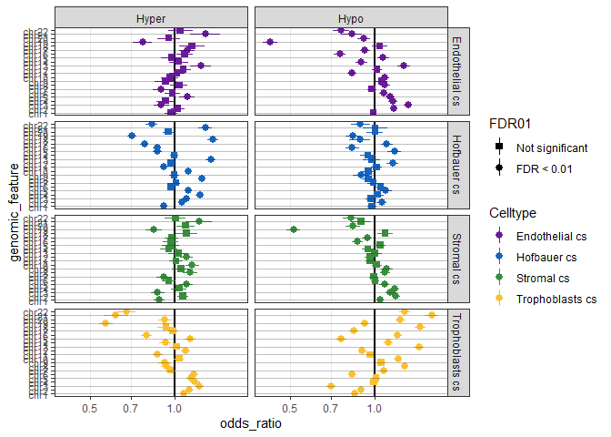
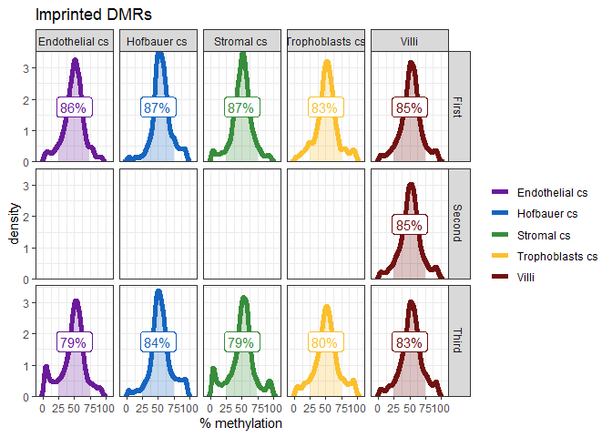

# Setup

## Libraries


```r
# libraries and data
library(tidyverse)
```

```
## -- Attaching packages ----------------------------------------------- tidyverse 1.2.1 --
```

```
## v ggplot2 3.2.0     v purrr   0.3.2
## v tibble  2.1.3     v dplyr   0.8.1
## v tidyr   0.8.3     v stringr 1.4.0
## v readr   1.3.1     v forcats 0.4.0
```

```
## -- Conflicts -------------------------------------------------- tidyverse_conflicts() --
## x dplyr::filter() masks stats::filter()
## x dplyr::lag()    masks stats::lag()
```

```r
library(readxl)
library(annotatr)
library(fuzzyjoin)
```

```
## Warning: package 'fuzzyjoin' was built under R version 3.6.1
```

```r
library(formattable)
```

```
## Warning: package 'formattable' was built under R version 3.6.1
```

```r
library(kableExtra)
```

```
## 
## Attaching package: 'kableExtra'
```

```
## The following object is masked from 'package:dplyr':
## 
##     group_rows
```

## Data


```r
pDat <- readRDS('../../data/main/interim/2_3_pDat_contam.rds')
pDat <- pDat %>%
  mutate(Tissue = case_when(
    !(Tissue %in% c('Villi', 'Villi maternal', 'Syncytiotrophoblast')) ~ paste(Tissue, 'cs'),
    Tissue == 'Syncytiotrophoblast' ~ 'Trophoblasts enz',
    TRUE ~ Tissue
  )) 

# raw methylation data
betas <- readRDS('../../data/main/interim/1_4_betas_noob_filt.rds')

mset_noob <- readRDS('../../data/main/interim/1_4_mset_noob.rds') # for mvals
colnames(mset_noob) <- colnames(betas) <- pDat$Sample_Name
```

```
## Loading required package: minfi
```

```
## Loading required package: BiocGenerics
```

```
## Loading required package: parallel
```

```
## 
## Attaching package: 'BiocGenerics'
```

```
## The following objects are masked from 'package:parallel':
## 
##     clusterApply, clusterApplyLB, clusterCall, clusterEvalQ,
##     clusterExport, clusterMap, parApply, parCapply, parLapply,
##     parLapplyLB, parRapply, parSapply, parSapplyLB
```

```
## The following object is masked from 'package:formattable':
## 
##     normalize
```

```
## The following objects are masked from 'package:dplyr':
## 
##     combine, intersect, setdiff, union
```

```
## The following objects are masked from 'package:stats':
## 
##     IQR, mad, sd, var, xtabs
```

```
## The following objects are masked from 'package:base':
## 
##     anyDuplicated, append, as.data.frame, basename, cbind,
##     colnames, dirname, do.call, duplicated, eval, evalq, Filter,
##     Find, get, grep, grepl, intersect, is.unsorted, lapply, Map,
##     mapply, match, mget, order, paste, pmax, pmax.int, pmin,
##     pmin.int, Position, rank, rbind, Reduce, rownames, sapply,
##     setdiff, sort, table, tapply, union, unique, unsplit, which,
##     which.max, which.min
```

```
## Loading required package: GenomicRanges
```

```
## Loading required package: stats4
```

```
## Loading required package: S4Vectors
```

```
## 
## Attaching package: 'S4Vectors'
```

```
## The following objects are masked from 'package:dplyr':
## 
##     first, rename
```

```
## The following object is masked from 'package:tidyr':
## 
##     expand
```

```
## The following object is masked from 'package:base':
## 
##     expand.grid
```

```
## Loading required package: IRanges
```

```
## 
## Attaching package: 'IRanges'
```

```
## The following objects are masked from 'package:dplyr':
## 
##     collapse, desc, slice
```

```
## The following object is masked from 'package:purrr':
## 
##     reduce
```

```
## The following object is masked from 'package:grDevices':
## 
##     windows
```

```
## Loading required package: GenomeInfoDb
```

```
## Loading required package: SummarizedExperiment
```

```
## Loading required package: Biobase
```

```
## Welcome to Bioconductor
## 
##     Vignettes contain introductory material; view with
##     'browseVignettes()'. To cite Bioconductor, see
##     'citation("Biobase")', and for packages 'citation("pkgname")'.
```

```
## Loading required package: DelayedArray
```

```
## Loading required package: matrixStats
```

```
## 
## Attaching package: 'matrixStats'
```

```
## The following objects are masked from 'package:Biobase':
## 
##     anyMissing, rowMedians
```

```
## The following object is masked from 'package:dplyr':
## 
##     count
```

```
## Loading required package: BiocParallel
```

```
## 
## Attaching package: 'DelayedArray'
```

```
## The following objects are masked from 'package:matrixStats':
## 
##     colMaxs, colMins, colRanges, rowMaxs, rowMins, rowRanges
```

```
## The following object is masked from 'package:purrr':
## 
##     simplify
```

```
## The following objects are masked from 'package:base':
## 
##     aperm, apply, rowsum
```

```
## Loading required package: Biostrings
```

```
## Loading required package: XVector
```

```
## 
## Attaching package: 'XVector'
```

```
## The following object is masked from 'package:purrr':
## 
##     compact
```

```
## 
## Attaching package: 'Biostrings'
```

```
## The following object is masked from 'package:DelayedArray':
## 
##     type
```

```
## The following object is masked from 'package:base':
## 
##     strsplit
```

```
## Loading required package: bumphunter
```

```
## Loading required package: foreach
```

```
## 
## Attaching package: 'foreach'
```

```
## The following objects are masked from 'package:purrr':
## 
##     accumulate, when
```

```
## Loading required package: iterators
```

```
## Loading required package: locfit
```

```
## locfit 1.5-9.1 	 2013-03-22
```

```
## Setting options('download.file.method.GEOquery'='auto')
```

```
## Setting options('GEOquery.inmemory.gpl'=FALSE)
```

```r
mvals <- getM(mset_noob)

probe_anno <- readRDS('../../data/main/interim/1_1_probe_anno.rds')

# color key
pheatmap_color_code <- readRDS('../../data/main/interim/1_1_color_code.rds')

color_code <- readRDS('../../data/main/interim/2_3_color_code.rds')
color_code_tissue <- setNames(color_code$Colors_Tissue, color_code$label)

# DMCs
dmcs <- readRDS('../../data/main/interim/2_4_dmcs.rds')

# annotation
anno <- readRDS('Z:/Victor/Repositories/EPIC_annotation/hg19_epic_annotation.rds')

#color code
color_code <- readRDS('../../data/main/interim/2_3_color_code.rds')
color_code_tissue <- setNames(color_code$Colors_Tissue, color_code$label)
```

## Remove samples

remove contamined and non-interesting samples


```r
pDat_filt <- pDat %>% 
  filter(maternal_contamination_norm_flip < 0.35,
         !Sample_Name %in% c('PM364_hofb_cs', 'PL293_v_R2', 'PM366_vc_R2', 'P131_hofb_cs'),
         !Tissue %in% c('Villi maternal', 'Trophoblasts enz', 'Mixture cs', 'Dead Cells and Lymphocytes cs'))

# filter to first trimester
mvals_filt <- mvals[rownames(betas),pDat_filt$Sample_Name]
betas_filt <- betas[,pDat_filt$Sample_Name]
```

## Test for genomic enrichment

The strategy is to first dummy variable every genomic element that we want to test enrichment for. And then join that to the linear modelling results data frame.

Dummy variables:  for exmaple one column might be something like "intron, intron, exon, intron, 3'UTR, intergene, ...,". Which will be transformed so that we have separate columns for each category: intron: "T, T, F, T, F, F, ...", exon: "F, F, T, F, F, F, ..." etc.

Once every feature is "dummy variable'd" and we join this to the linear modelling data, then we can calculate the numbers required to run a fisher's exact test.

Note that the input list of dmcs is a 'long' table, where there is 4 celltypes/contrasts * ~800000 tested cpgs. Technically, we only need the ones defined as significant, so for now conditionally calculate the number of cpgs that are differentially methylated. An improvement to this code would be to expect as input the list of DMCS, and then another list of the background cpgs.

This took a long time to figure how to do, so eventually I would like to see this code put somewhere public that others can contribute towards.


```r
p_thresh <- 0.01
b_thresh <- 0.25

# dummy variable all categories
annotation <- anno %>% 
  
  # mutate spread is clean, but slow. Can only work with those that have non-duplicated strings in each element
  mutate(var = 1) %>%
  spread(cpg_id, var, fill = 0) %>% 
  
  mutate(var = 1) %>%
  spread(chr, var, fill = 0) %>% 
  
  mutate(
         # cannot follow the spread strategy above, since we have numerous occurences in each element
         `1to5kb` = ifelse(grepl('1to5kb', genes_id), 1, 0),
         `3UTR` = ifelse(grepl('3UTR', genes_id), 1, 0),
         `5UTR` = ifelse(grepl('5UTR', genes_id), 1, 0),
         exon = ifelse(grepl("exon", genes_id), 1, 0),
         intergenic = ifelse(grepl('intergenic', genes_id), 1, 0),
         intron = ifelse(grepl('intron', genes_id), 1, 0),
         intronexonboundary = ifelse(grepl('intronexonboundary', genes_id), 1, 0),
         promoter = ifelse(grepl("promoter", genes_id), 1, 0),
         
         enhancer = !is.na(enhancers_id),
         pmd = !is.na(pmd_id),
         imprinted_gene_placenta = !is.na(imprinted_gene_placenta),
         imprinted_gene_general = !is.na(imprinted_gene_general),
         imprinted_dmr_general = !is.na(imprinted_dmr_general),
         imprinted_dmr_placenta = !is.na(imprinted_dmr_placenta))

# add gene annotation to dmcs
dmcs <- dmcs %>% left_join(annotation, by = c('gene' = 'cpg'))

# filter to all tested cpgs
annotation <- annotation %>%
  filter(cpg %in% dmcs$gene)
  
# tabulate the background frequency per genomic element
expected <-  annotation %>%
  dplyr::select(cpg, island:pmd, contains('imprint')) %>%
  gather(key = genomic_feature, value = present, -cpg) %>%
  
  group_by(genomic_feature) %>%
  summarize(Expected_n_in = sum(present), 
            
            Expected_n_out = nrow(annotation) - Expected_n_in,
            Expected_p_in = Expected_n_in/ nrow(annotation),
            Expected_p_out = Expected_n_out / nrow(annotation))

# tabulate observed frequency for significant cpgs
observed <- dmcs %>% 
  
  # calculate total dmcs per cell type
  group_by(Group1) %>%
  mutate(n_total = sum(bonferroni < p_thresh & abs(delta_b) > b_thresh )) %>%
  
  # filter to just dmcs
  filter(bonferroni < p_thresh, abs(delta_b) > b_thresh) %>%
  select(Group1, gene, island:pmd, contains('imprint'), n_total) %>%

  # calculated the number of dmcs in each feature, and then the number out
  gather(key = genomic_feature, value = present, -gene, -Group1, -n_total) %>%
  group_by(Group1, genomic_feature) %>%
  summarize(Observed_n_in = sum(present), 
            
            Observed_n_out = unique(n_total) - Observed_n_in,
            Observed_p_in = Observed_n_in / unique(n_total),
            Observed_p_out = Observed_n_out / unique(n_total))

# fisher's test for enrichment
# (1) # of DMCs on var1 (already calcualted, 'Freq')
# (2) # of non-DMCs on var1
# (3) # of DMCs not on var1
# (4) # of non-DMCs not on var1


# calculate (2) (3) (4), and test enrichment
tests <- observed %>%
  
  ungroup() %>%
  
  # add in all_cpgs datarfame for calculations
  left_join(expected, by = 'genomic_feature') %>%
  
  # calculate (2), (4)
  mutate(Observed_notDMC_in = Expected_n_in - Observed_n_in,   #(2) # non-DMCs in var1
         
         # for (4)
         Observed_notDMC_out = Expected_n_out - Observed_n_out) %>%  # of non-DMCs out of Var1
  
  # test enrichment
  rowwise() %>%
  mutate(test_in = list(matrix(c(Observed_n_in, Observed_notDMC_in, 
                                   Observed_n_out, Observed_notDMC_out),2,2))) %>%
  ungroup() %>%
  
  mutate(test_out = map(test_in, ~chisq.test(.)),
         p = map_dbl(test_out, 'p.value'),
         FDR = p.adjust(p, method = 'fdr'),
         bonferroni = p.adjust(p, method = 'bonferroni'),
         FDR01 = FDR < 0.01,
         bonferroni01 = bonferroni < 0.01) %>% 
  select(FDR, FDR01, bonferroni, bonferroni01, p, everything())
```

```
## Warning in chisq.test(.): Chi-squared approximation may be incorrect

## Warning in chisq.test(.): Chi-squared approximation may be incorrect

## Warning in chisq.test(.): Chi-squared approximation may be incorrect

## Warning in chisq.test(.): Chi-squared approximation may be incorrect

## Warning in chisq.test(.): Chi-squared approximation may be incorrect

## Warning in chisq.test(.): Chi-squared approximation may be incorrect

## Warning in chisq.test(.): Chi-squared approximation may be incorrect

## Warning in chisq.test(.): Chi-squared approximation may be incorrect

## Warning in chisq.test(.): Chi-squared approximation may be incorrect

## Warning in chisq.test(.): Chi-squared approximation may be incorrect

## Warning in chisq.test(.): Chi-squared approximation may be incorrect

## Warning in chisq.test(.): Chi-squared approximation may be incorrect

## Warning in chisq.test(.): Chi-squared approximation may be incorrect

## Warning in chisq.test(.): Chi-squared approximation may be incorrect

## Warning in chisq.test(.): Chi-squared approximation may be incorrect

## Warning in chisq.test(.): Chi-squared approximation may be incorrect
```

```r
tests
```

```
## # A tibble: 336 x 19
##         FDR FDR01 bonferroni bonferroni01        p Group1 genomic_feature
##       <dbl> <lgl>      <dbl> <lgl>           <dbl> <chr>  <chr>          
##  1 1.95e-58 TRUE    1.85e-56 TRUE         5.65e-59 First~ 1to5kb         
##  2 1.29e- 2 FALSE   1.00e+ 0 FALSE        9.57e- 3 First~ 3UTR           
##  3 4.11e-84 TRUE    3.49e-82 TRUE         1.07e-84 First~ 5UTR           
##  4 3.32e- 1 FALSE   1.00e+ 0 FALSE        2.94e- 1 First~ chr1           
##  5 8.14e- 4 TRUE    1.73e- 1 FALSE        5.29e- 4 First~ chr10          
##  6 4.58e- 4 TRUE    9.44e- 2 FALSE        2.88e- 4 First~ chr11          
##  7 4.77e- 2 FALSE   1.00e+ 0 FALSE        3.81e- 2 First~ chr12          
##  8 5.99e- 8 TRUE    1.00e- 5 TRUE         3.05e- 8 First~ chr13          
##  9 6.98e- 4 TRUE    1.47e- 1 FALSE        4.49e- 4 First~ chr14          
## 10 3.77e- 1 FALSE   1.00e+ 0 FALSE        3.37e- 1 First~ chr15          
## # ... with 326 more rows, and 12 more variables: Observed_n_in <dbl>,
## #   Observed_n_out <dbl>, Observed_p_in <dbl>, Observed_p_out <dbl>,
## #   Expected_n_in <dbl>, Expected_n_out <dbl>, Expected_p_in <dbl>,
## #   Expected_p_out <dbl>, Observed_notDMC_in <dbl>,
## #   Observed_notDMC_out <dbl>, test_in <list>, test_out <list>
```

```r
# clean
tests <- tests %>%
  separate(Group1, into = c('Trimester', 'Celltype'), sep = '\\.') %>%
  mutate(Celltype = case_when(
    Celltype == 'Endo_cs' ~ 'Endothelial cs',
    Celltype == 'Hofb_cs' ~ 'Hofbauer cs',
    Celltype == 'Strom_cs' ~ 'Stromal cs',
    Celltype == 'Troph_cs' ~ 'Trophoblasts cs')) 
  
# color code
colors <- color_code %>% 
  filter(label %in% c('Endothelial cs', 'Hofbauer cs', 'Stromal cs', 'Trophoblasts cs'))
colors <- setNames(colors$Colors_Tissue, unique(tests$Celltype))

# categorize genomic features
tests <- tests %>% 
  mutate(genomic_feature_category = case_when(
    grepl('chr', genomic_feature) ~ 'chr',
    genomic_feature %in% c('1to5kb', '3UTR', '5UTR', 'exon', 'intron', 
                           'intergenic', 'intronexonboundary', 'promoter') ~ 'gene',
    genomic_feature %in% c('island', 'shore', 'shelf', 'sea') ~ 'cpg_island',
    grepl('imprint', genomic_feature) ~ 'imprinting',
    genomic_feature == 'pmd' ~ 'pmd',
    genomic_feature == 'enhancer' ~ 'enhancer'
  )) 
```

## Visualize enrichment


```r
plot_enrich <- function(x) {
  
  ggplot(data = x) +
  geom_pointrange(aes(x = genomic_feature, y = Observed_p_minus_expected, ymin = ymin, ymax = ymax, 
                      color =Celltype, shape = bonferroni01),
                  fill = 'white',
           stat = 'identity', position = position_dodge(width = 0.75),
           fatten = 4) +
  geom_hline(yintercept = 0, color = 'black', size = 1) +
  scale_color_manual(values = colors)  + 
  facet_grid(. ~ Trimester , scales = 'free_y', space = 'free') +
  coord_flip() +
  scale_y_continuous( expand = c(0.05,0)) +
  theme_bw(base_size = 14) + 
  theme(legend.position = 'right', legend.direction = 'vertical',
        legend.spacing.y = unit(-0.2, 'cm')) +
  labs(color = '', x = '', y = 'Observed - Expected frequency (in percentage)', shape = '', linetype = '') +
  scale_shape_manual(values = c('TRUE' = 18, 'FALSE' = 21), na.translate = F, 
                     labels = c('TRUE' = 'Bonferroni < 0.01', 'FALSE' = 'n.s.')) 
}

#chromosome
tests %>% 
  filter(genomic_feature_category == 'chr',
         !genomic_feature %in% c('chrX', 'chrY')) %>%
  mutate(genomic_feature = factor(genomic_feature, levels = paste0('chr', 1:22)),
         
         Observed_p_minus_expected = 100*(Observed_p_in - Expected_p_in),
    
    # linerange ymin ymax values
         ymin = pmin(Observed_p_minus_expected, 0),
         ymax = pmax(Observed_p_minus_expected, 0)) %>%
  plot_enrich()
```

<!-- -->

```r
#gene/enhancer
tests %>% 
  filter(genomic_feature_category == 'gene' | genomic_feature == 'enhancer') %>%
  mutate(genomic_feature = factor(genomic_feature, 
                                  levels = c('enhancer', '1to5kb', 'promoter', '5UTR', 'exon', 'intron', 
                                             'intronexonboundary','3UTR','intergenic')),

         Observed_p_minus_expected = 100*(Observed_p_in - Expected_p_in),
    
    # linerange ymin ymax values
         ymin = pmin(Observed_p_minus_expected, 0),
         ymax = pmax(Observed_p_minus_expected, 0)) %>%
  plot_enrich
```

<!-- -->

```r
# cpg islands
tests %>% 
  filter(genomic_feature_category == 'cpg_island') %>%
  mutate(genomic_feature = factor(genomic_feature, 
                                  levels = c('island', 'shore', 'shelf', 'sea')),
         
         Observed_p_minus_expected = 100*(Observed_p_in - Expected_p_in),
    
    # linerange ymin ymax values
         ymin = pmin(Observed_p_minus_expected, 0),
         ymax = pmax(Observed_p_minus_expected, 0)) %>%
  plot_enrich
```

<!-- -->

```r
# pmd
tests %>% 
  filter(genomic_feature_category == 'pmd') %>%
  mutate(Observed_p_minus_expected = 100*(Observed_p_in - Expected_p_in),
    
    # linerange ymin ymax values
         ymin = pmin(Observed_p_minus_expected, 0),
         ymax = pmax(Observed_p_minus_expected, 0)) %>%
  plot_enrich
```

<!-- -->

```r
# imprint
tests %>% 
  filter(genomic_feature_category == 'imprinting') %>%
  mutate(Observed_p_minus_expected = 100*(Observed_p_in - Expected_p_in),
    
    # linerange ymin ymax values
         ymin = pmin(Observed_p_minus_expected, 0),
         ymax = pmax(Observed_p_minus_expected, 0)) %>%
  plot_enrich
```

<!-- -->


```r
cb <- function(x) {
  range <- max(abs(x))
  width <- round(abs(x / range * 50), 2)
  ifelse(
    x > 0,
    paste0(
      '<span style="display: inline-block; border-radius: 2px; ', 
      'padding-right: 2px; background-color: lightgreen; width: ', 
      width, '%; margin-left: 50%; text-align: left;">', percent(x), '</span>'
    ),
    paste0(
      '<span style="display: inline-block; border-radius: 2px; ', 
      'padding-right: 2px; background-color: lightpink; width: ', 
      width, '%; margin-right: 50%; text-align: right; float: right; ">', percent(x), '</span>'
    )
  )
}

tests %>% 
  # filter to chromosome
  filter(genomic_feature_category == 'chr',
         !genomic_feature %in% c('chrX', 'chrY')) %>%
  # create key
  mutate(genomic_feature = factor(genomic_feature, levels = paste0('chr', 1:22)),
         key = paste0(Trimester , '_', Celltype),
         Observed_p_minus_expected = (Observed_p_in - Expected_p_in)) %>%
  select(key, genomic_feature, Observed_p_minus_expected)  %>%
  mutate(Observed_p_minus_expected = cb(Observed_p_minus_expected)) %>%
  
  
  spread(key= key, value = Observed_p_minus_expected) %>%
  kable(escape = F) %>%
  kable_styling()
```

<table class="table" style="margin-left: auto; margin-right: auto;">
 <thead>
  <tr>
   <th style="text-align:left;"> genomic_feature </th>
   <th style="text-align:left;"> First_Endothelial cs </th>
   <th style="text-align:left;"> First_Hofbauer cs </th>
   <th style="text-align:left;"> First_Stromal cs </th>
   <th style="text-align:left;"> First_Trophoblasts cs </th>
   <th style="text-align:left;"> Third_Endothelial cs </th>
   <th style="text-align:left;"> Third_Hofbauer cs </th>
   <th style="text-align:left;"> Third_Stromal cs </th>
   <th style="text-align:left;"> Third_Trophoblasts cs </th>
  </tr>
 </thead>
<tbody>
  <tr>
   <td style="text-align:left;"> chr1 </td>
   <td style="text-align:left;"> <span style="display: inline-block; border-radius: 2px; padding-right: 2px; background-color: lightpink; width: 4.24%; margin-right: 50%; text-align: right; float: right; ">-0.23%</span> </td>
   <td style="text-align:left;"> <span style="display: inline-block; border-radius: 2px; padding-right: 2px; background-color: lightgreen; width: 6.95%; margin-left: 50%; text-align: left;">0.37%</span> </td>
   <td style="text-align:left;"> <span style="display: inline-block; border-radius: 2px; padding-right: 2px; background-color: lightpink; width: 8.08%; margin-right: 50%; text-align: right; float: right; ">-0.43%</span> </td>
   <td style="text-align:left;"> <span style="display: inline-block; border-radius: 2px; padding-right: 2px; background-color: lightpink; width: 1.12%; margin-right: 50%; text-align: right; float: right; ">-0.06%</span> </td>
   <td style="text-align:left;"> <span style="display: inline-block; border-radius: 2px; padding-right: 2px; background-color: lightpink; width: 2.51%; margin-right: 50%; text-align: right; float: right; ">-0.13%</span> </td>
   <td style="text-align:left;"> <span style="display: inline-block; border-radius: 2px; padding-right: 2px; background-color: lightpink; width: 10.54%; margin-right: 50%; text-align: right; float: right; ">-0.56%</span> </td>
   <td style="text-align:left;"> <span style="display: inline-block; border-radius: 2px; padding-right: 2px; background-color: lightpink; width: 1.56%; margin-right: 50%; text-align: right; float: right; ">-0.08%</span> </td>
   <td style="text-align:left;"> <span style="display: inline-block; border-radius: 2px; padding-right: 2px; background-color: lightpink; width: 9.62%; margin-right: 50%; text-align: right; float: right; ">-0.51%</span> </td>
  </tr>
  <tr>
   <td style="text-align:left;"> chr2 </td>
   <td style="text-align:left;"> <span style="display: inline-block; border-radius: 2px; padding-right: 2px; background-color: lightgreen; width: 19.41%; margin-left: 50%; text-align: left;">1.04%</span> </td>
   <td style="text-align:left;"> <span style="display: inline-block; border-radius: 2px; padding-right: 2px; background-color: lightgreen; width: 9.78%; margin-left: 50%; text-align: left;">0.52%</span> </td>
   <td style="text-align:left;"> <span style="display: inline-block; border-radius: 2px; padding-right: 2px; background-color: lightgreen; width: 21.27%; margin-left: 50%; text-align: left;">1.14%</span> </td>
   <td style="text-align:left;"> <span style="display: inline-block; border-radius: 2px; padding-right: 2px; background-color: lightgreen; width: 8.96%; margin-left: 50%; text-align: left;">0.48%</span> </td>
   <td style="text-align:left;"> <span style="display: inline-block; border-radius: 2px; padding-right: 2px; background-color: lightgreen; width: 15.81%; margin-left: 50%; text-align: left;">0.84%</span> </td>
   <td style="text-align:left;"> <span style="display: inline-block; border-radius: 2px; padding-right: 2px; background-color: lightgreen; width: 7.07%; margin-left: 50%; text-align: left;">0.38%</span> </td>
   <td style="text-align:left;"> <span style="display: inline-block; border-radius: 2px; padding-right: 2px; background-color: lightgreen; width: 18.19%; margin-left: 50%; text-align: left;">0.97%</span> </td>
   <td style="text-align:left;"> <span style="display: inline-block; border-radius: 2px; padding-right: 2px; background-color: lightpink; width: 1.66%; margin-right: 50%; text-align: right; float: right; ">-0.09%</span> </td>
  </tr>
  <tr>
   <td style="text-align:left;"> chr3 </td>
   <td style="text-align:left;"> <span style="display: inline-block; border-radius: 2px; padding-right: 2px; background-color: lightgreen; width: 9.56%; margin-left: 50%; text-align: left;">0.51%</span> </td>
   <td style="text-align:left;"> <span style="display: inline-block; border-radius: 2px; padding-right: 2px; background-color: lightgreen; width: 2.99%; margin-left: 50%; text-align: left;">0.16%</span> </td>
   <td style="text-align:left;"> <span style="display: inline-block; border-radius: 2px; padding-right: 2px; background-color: lightgreen; width: 22.69%; margin-left: 50%; text-align: left;">1.21%</span> </td>
   <td style="text-align:left;"> <span style="display: inline-block; border-radius: 2px; padding-right: 2px; background-color: lightpink; width: 8.27%; margin-right: 50%; text-align: right; float: right; ">-0.44%</span> </td>
   <td style="text-align:left;"> <span style="display: inline-block; border-radius: 2px; padding-right: 2px; background-color: lightgreen; width: 19.19%; margin-left: 50%; text-align: left;">1.02%</span> </td>
   <td style="text-align:left;"> <span style="display: inline-block; border-radius: 2px; padding-right: 2px; background-color: lightgreen; width: 5.65%; margin-left: 50%; text-align: left;">0.30%</span> </td>
   <td style="text-align:left;"> <span style="display: inline-block; border-radius: 2px; padding-right: 2px; background-color: lightgreen; width: 4.42%; margin-left: 50%; text-align: left;">0.24%</span> </td>
   <td style="text-align:left;"> <span style="display: inline-block; border-radius: 2px; padding-right: 2px; background-color: lightpink; width: 9.52%; margin-right: 50%; text-align: right; float: right; ">-0.51%</span> </td>
  </tr>
  <tr>
   <td style="text-align:left;"> chr4 </td>
   <td style="text-align:left;"> <span style="display: inline-block; border-radius: 2px; padding-right: 2px; background-color: lightpink; width: 1.96%; margin-right: 50%; text-align: right; float: right; ">-0.10%</span> </td>
   <td style="text-align:left;"> <span style="display: inline-block; border-radius: 2px; padding-right: 2px; background-color: lightpink; width: 1.18%; margin-right: 50%; text-align: right; float: right; ">-0.06%</span> </td>
   <td style="text-align:left;"> <span style="display: inline-block; border-radius: 2px; padding-right: 2px; background-color: lightgreen; width: 14.56%; margin-left: 50%; text-align: left;">0.78%</span> </td>
   <td style="text-align:left;"> <span style="display: inline-block; border-radius: 2px; padding-right: 2px; background-color: lightgreen; width: 0.29%; margin-left: 50%; text-align: left;">0.02%</span> </td>
   <td style="text-align:left;"> <span style="display: inline-block; border-radius: 2px; padding-right: 2px; background-color: lightgreen; width: 7.11%; margin-left: 50%; text-align: left;">0.38%</span> </td>
   <td style="text-align:left;"> <span style="display: inline-block; border-radius: 2px; padding-right: 2px; background-color: lightgreen; width: 11.27%; margin-left: 50%; text-align: left;">0.60%</span> </td>
   <td style="text-align:left;"> <span style="display: inline-block; border-radius: 2px; padding-right: 2px; background-color: lightgreen; width: 9.13%; margin-left: 50%; text-align: left;">0.49%</span> </td>
   <td style="text-align:left;"> <span style="display: inline-block; border-radius: 2px; padding-right: 2px; background-color: lightgreen; width: 4.49%; margin-left: 50%; text-align: left;">0.24%</span> </td>
  </tr>
  <tr>
   <td style="text-align:left;"> chr5 </td>
   <td style="text-align:left;"> <span style="display: inline-block; border-radius: 2px; padding-right: 2px; background-color: lightgreen; width: 14.65%; margin-left: 50%; text-align: left;">0.78%</span> </td>
   <td style="text-align:left;"> <span style="display: inline-block; border-radius: 2px; padding-right: 2px; background-color: lightpink; width: 0.27%; margin-right: 50%; text-align: right; float: right; ">-0.01%</span> </td>
   <td style="text-align:left;"> <span style="display: inline-block; border-radius: 2px; padding-right: 2px; background-color: lightgreen; width: 8.65%; margin-left: 50%; text-align: left;">0.46%</span> </td>
   <td style="text-align:left;"> <span style="display: inline-block; border-radius: 2px; padding-right: 2px; background-color: lightgreen; width: 7.53%; margin-left: 50%; text-align: left;">0.40%</span> </td>
   <td style="text-align:left;"> <span style="display: inline-block; border-radius: 2px; padding-right: 2px; background-color: lightgreen; width: 11.05%; margin-left: 50%; text-align: left;">0.59%</span> </td>
   <td style="text-align:left;"> <span style="display: inline-block; border-radius: 2px; padding-right: 2px; background-color: lightgreen; width: 8.95%; margin-left: 50%; text-align: left;">0.48%</span> </td>
   <td style="text-align:left;"> <span style="display: inline-block; border-radius: 2px; padding-right: 2px; background-color: lightgreen; width: 7.6%; margin-left: 50%; text-align: left;">0.41%</span> </td>
   <td style="text-align:left;"> <span style="display: inline-block; border-radius: 2px; padding-right: 2px; background-color: lightgreen; width: 5.23%; margin-left: 50%; text-align: left;">0.28%</span> </td>
  </tr>
  <tr>
   <td style="text-align:left;"> chr6 </td>
   <td style="text-align:left;"> <span style="display: inline-block; border-radius: 2px; padding-right: 2px; background-color: lightgreen; width: 10.87%; margin-left: 50%; text-align: left;">0.58%</span> </td>
   <td style="text-align:left;"> <span style="display: inline-block; border-radius: 2px; padding-right: 2px; background-color: lightpink; width: 5.76%; margin-right: 50%; text-align: right; float: right; ">-0.31%</span> </td>
   <td style="text-align:left;"> <span style="display: inline-block; border-radius: 2px; padding-right: 2px; background-color: lightpink; width: 9.64%; margin-right: 50%; text-align: right; float: right; ">-0.51%</span> </td>
   <td style="text-align:left;"> <span style="display: inline-block; border-radius: 2px; padding-right: 2px; background-color: lightpink; width: 8.03%; margin-right: 50%; text-align: right; float: right; ">-0.43%</span> </td>
   <td style="text-align:left;"> <span style="display: inline-block; border-radius: 2px; padding-right: 2px; background-color: lightgreen; width: 5.25%; margin-left: 50%; text-align: left;">0.28%</span> </td>
   <td style="text-align:left;"> <span style="display: inline-block; border-radius: 2px; padding-right: 2px; background-color: lightpink; width: 0.89%; margin-right: 50%; text-align: right; float: right; ">-0.05%</span> </td>
   <td style="text-align:left;"> <span style="display: inline-block; border-radius: 2px; padding-right: 2px; background-color: lightpink; width: 1.33%; margin-right: 50%; text-align: right; float: right; ">-0.07%</span> </td>
   <td style="text-align:left;"> <span style="display: inline-block; border-radius: 2px; padding-right: 2px; background-color: lightpink; width: 3.79%; margin-right: 50%; text-align: right; float: right; ">-0.20%</span> </td>
  </tr>
  <tr>
   <td style="text-align:left;"> chr7 </td>
   <td style="text-align:left;"> <span style="display: inline-block; border-radius: 2px; padding-right: 2px; background-color: lightpink; width: 11.81%; margin-right: 50%; text-align: right; float: right; ">-0.63%</span> </td>
   <td style="text-align:left;"> <span style="display: inline-block; border-radius: 2px; padding-right: 2px; background-color: lightpink; width: 3.61%; margin-right: 50%; text-align: right; float: right; ">-0.19%</span> </td>
   <td style="text-align:left;"> <span style="display: inline-block; border-radius: 2px; padding-right: 2px; background-color: lightpink; width: 4.91%; margin-right: 50%; text-align: right; float: right; ">-0.26%</span> </td>
   <td style="text-align:left;"> <span style="display: inline-block; border-radius: 2px; padding-right: 2px; background-color: lightgreen; width: 2.83%; margin-left: 50%; text-align: left;">0.15%</span> </td>
   <td style="text-align:left;"> <span style="display: inline-block; border-radius: 2px; padding-right: 2px; background-color: lightpink; width: 3.97%; margin-right: 50%; text-align: right; float: right; ">-0.21%</span> </td>
   <td style="text-align:left;"> <span style="display: inline-block; border-radius: 2px; padding-right: 2px; background-color: lightgreen; width: 0.25%; margin-left: 50%; text-align: left;">0.01%</span> </td>
   <td style="text-align:left;"> <span style="display: inline-block; border-radius: 2px; padding-right: 2px; background-color: lightpink; width: 3.08%; margin-right: 50%; text-align: right; float: right; ">-0.16%</span> </td>
   <td style="text-align:left;"> <span style="display: inline-block; border-radius: 2px; padding-right: 2px; background-color: lightgreen; width: 2.56%; margin-left: 50%; text-align: left;">0.14%</span> </td>
  </tr>
  <tr>
   <td style="text-align:left;"> chr8 </td>
   <td style="text-align:left;"> <span style="display: inline-block; border-radius: 2px; padding-right: 2px; background-color: lightgreen; width: 4.36%; margin-left: 50%; text-align: left;">0.23%</span> </td>
   <td style="text-align:left;"> <span style="display: inline-block; border-radius: 2px; padding-right: 2px; background-color: lightgreen; width: 5.42%; margin-left: 50%; text-align: left;">0.29%</span> </td>
   <td style="text-align:left;"> <span style="display: inline-block; border-radius: 2px; padding-right: 2px; background-color: lightgreen; width: 18.95%; margin-left: 50%; text-align: left;">1.01%</span> </td>
   <td style="text-align:left;"> <span style="display: inline-block; border-radius: 2px; padding-right: 2px; background-color: lightgreen; width: 8.19%; margin-left: 50%; text-align: left;">0.44%</span> </td>
   <td style="text-align:left;"> <span style="display: inline-block; border-radius: 2px; padding-right: 2px; background-color: lightgreen; width: 5.58%; margin-left: 50%; text-align: left;">0.30%</span> </td>
   <td style="text-align:left;"> <span style="display: inline-block; border-radius: 2px; padding-right: 2px; background-color: lightgreen; width: 11.45%; margin-left: 50%; text-align: left;">0.61%</span> </td>
   <td style="text-align:left;"> <span style="display: inline-block; border-radius: 2px; padding-right: 2px; background-color: lightgreen; width: 7.66%; margin-left: 50%; text-align: left;">0.41%</span> </td>
   <td style="text-align:left;"> <span style="display: inline-block; border-radius: 2px; padding-right: 2px; background-color: lightgreen; width: 9.77%; margin-left: 50%; text-align: left;">0.52%</span> </td>
  </tr>
  <tr>
   <td style="text-align:left;"> chr9 </td>
   <td style="text-align:left;"> <span style="display: inline-block; border-radius: 2px; padding-right: 2px; background-color: lightgreen; width: 6.32%; margin-left: 50%; text-align: left;">0.34%</span> </td>
   <td style="text-align:left;"> <span style="display: inline-block; border-radius: 2px; padding-right: 2px; background-color: lightgreen; width: 3.8%; margin-left: 50%; text-align: left;">0.20%</span> </td>
   <td style="text-align:left;"> <span style="display: inline-block; border-radius: 2px; padding-right: 2px; background-color: lightgreen; width: 4.22%; margin-left: 50%; text-align: left;">0.23%</span> </td>
   <td style="text-align:left;"> <span style="display: inline-block; border-radius: 2px; padding-right: 2px; background-color: lightgreen; width: 2.25%; margin-left: 50%; text-align: left;">0.12%</span> </td>
   <td style="text-align:left;"> <span style="display: inline-block; border-radius: 2px; padding-right: 2px; background-color: lightgreen; width: 1.17%; margin-left: 50%; text-align: left;">0.06%</span> </td>
   <td style="text-align:left;"> <span style="display: inline-block; border-radius: 2px; padding-right: 2px; background-color: lightpink; width: 1.7%; margin-right: 50%; text-align: right; float: right; ">-0.09%</span> </td>
   <td style="text-align:left;"> <span style="display: inline-block; border-radius: 2px; padding-right: 2px; background-color: lightgreen; width: 4.5%; margin-left: 50%; text-align: left;">0.24%</span> </td>
   <td style="text-align:left;"> <span style="display: inline-block; border-radius: 2px; padding-right: 2px; background-color: lightpink; width: 0.07%; margin-right: 50%; text-align: right; float: right; ">-0.00%</span> </td>
  </tr>
  <tr>
   <td style="text-align:left;"> chr10 </td>
   <td style="text-align:left;"> <span style="display: inline-block; border-radius: 2px; padding-right: 2px; background-color: lightgreen; width: 10.16%; margin-left: 50%; text-align: left;">0.54%</span> </td>
   <td style="text-align:left;"> <span style="display: inline-block; border-radius: 2px; padding-right: 2px; background-color: lightgreen; width: 4.54%; margin-left: 50%; text-align: left;">0.24%</span> </td>
   <td style="text-align:left;"> <span style="display: inline-block; border-radius: 2px; padding-right: 2px; background-color: lightgreen; width: 13.41%; margin-left: 50%; text-align: left;">0.72%</span> </td>
   <td style="text-align:left;"> <span style="display: inline-block; border-radius: 2px; padding-right: 2px; background-color: lightgreen; width: 9.69%; margin-left: 50%; text-align: left;">0.52%</span> </td>
   <td style="text-align:left;"> <span style="display: inline-block; border-radius: 2px; padding-right: 2px; background-color: lightgreen; width: 4.38%; margin-left: 50%; text-align: left;">0.23%</span> </td>
   <td style="text-align:left;"> <span style="display: inline-block; border-radius: 2px; padding-right: 2px; background-color: lightgreen; width: 5.31%; margin-left: 50%; text-align: left;">0.28%</span> </td>
   <td style="text-align:left;"> <span style="display: inline-block; border-radius: 2px; padding-right: 2px; background-color: lightgreen; width: 4.93%; margin-left: 50%; text-align: left;">0.26%</span> </td>
   <td style="text-align:left;"> <span style="display: inline-block; border-radius: 2px; padding-right: 2px; background-color: lightgreen; width: 10.74%; margin-left: 50%; text-align: left;">0.57%</span> </td>
  </tr>
  <tr>
   <td style="text-align:left;"> chr11 </td>
   <td style="text-align:left;"> <span style="display: inline-block; border-radius: 2px; padding-right: 2px; background-color: lightpink; width: 11.49%; margin-right: 50%; text-align: right; float: right; ">-0.61%</span> </td>
   <td style="text-align:left;"> <span style="display: inline-block; border-radius: 2px; padding-right: 2px; background-color: lightpink; width: 5.33%; margin-right: 50%; text-align: right; float: right; ">-0.28%</span> </td>
   <td style="text-align:left;"> <span style="display: inline-block; border-radius: 2px; padding-right: 2px; background-color: lightpink; width: 10.46%; margin-right: 50%; text-align: right; float: right; ">-0.56%</span> </td>
   <td style="text-align:left;"> <span style="display: inline-block; border-radius: 2px; padding-right: 2px; background-color: lightgreen; width: 0.66%; margin-left: 50%; text-align: left;">0.04%</span> </td>
   <td style="text-align:left;"> <span style="display: inline-block; border-radius: 2px; padding-right: 2px; background-color: lightpink; width: 11.81%; margin-right: 50%; text-align: right; float: right; ">-0.63%</span> </td>
   <td style="text-align:left;"> <span style="display: inline-block; border-radius: 2px; padding-right: 2px; background-color: lightpink; width: 5.5%; margin-right: 50%; text-align: right; float: right; ">-0.29%</span> </td>
   <td style="text-align:left;"> <span style="display: inline-block; border-radius: 2px; padding-right: 2px; background-color: lightpink; width: 2.13%; margin-right: 50%; text-align: right; float: right; ">-0.11%</span> </td>
   <td style="text-align:left;"> <span style="display: inline-block; border-radius: 2px; padding-right: 2px; background-color: lightpink; width: 6.89%; margin-right: 50%; text-align: right; float: right; ">-0.37%</span> </td>
  </tr>
  <tr>
   <td style="text-align:left;"> chr12 </td>
   <td style="text-align:left;"> <span style="display: inline-block; border-radius: 2px; padding-right: 2px; background-color: lightgreen; width: 6.31%; margin-left: 50%; text-align: left;">0.34%</span> </td>
   <td style="text-align:left;"> <span style="display: inline-block; border-radius: 2px; padding-right: 2px; background-color: lightgreen; width: 2.28%; margin-left: 50%; text-align: left;">0.12%</span> </td>
   <td style="text-align:left;"> <span style="display: inline-block; border-radius: 2px; padding-right: 2px; background-color: lightgreen; width: 1.46%; margin-left: 50%; text-align: left;">0.08%</span> </td>
   <td style="text-align:left;"> <span style="display: inline-block; border-radius: 2px; padding-right: 2px; background-color: lightpink; width: 3.12%; margin-right: 50%; text-align: right; float: right; ">-0.17%</span> </td>
   <td style="text-align:left;"> <span style="display: inline-block; border-radius: 2px; padding-right: 2px; background-color: lightgreen; width: 2.81%; margin-left: 50%; text-align: left;">0.15%</span> </td>
   <td style="text-align:left;"> <span style="display: inline-block; border-radius: 2px; padding-right: 2px; background-color: lightgreen; width: 1.56%; margin-left: 50%; text-align: left;">0.08%</span> </td>
   <td style="text-align:left;"> <span style="display: inline-block; border-radius: 2px; padding-right: 2px; background-color: lightgreen; width: 0.54%; margin-left: 50%; text-align: left;">0.03%</span> </td>
   <td style="text-align:left;"> <span style="display: inline-block; border-radius: 2px; padding-right: 2px; background-color: lightpink; width: 1.95%; margin-right: 50%; text-align: right; float: right; ">-0.10%</span> </td>
  </tr>
  <tr>
   <td style="text-align:left;"> chr13 </td>
   <td style="text-align:left;"> <span style="display: inline-block; border-radius: 2px; padding-right: 2px; background-color: lightgreen; width: 11.66%; margin-left: 50%; text-align: left;">0.62%</span> </td>
   <td style="text-align:left;"> <span style="display: inline-block; border-radius: 2px; padding-right: 2px; background-color: lightgreen; width: 2.4%; margin-left: 50%; text-align: left;">0.13%</span> </td>
   <td style="text-align:left;"> <span style="display: inline-block; border-radius: 2px; padding-right: 2px; background-color: lightgreen; width: 4.23%; margin-left: 50%; text-align: left;">0.23%</span> </td>
   <td style="text-align:left;"> <span style="display: inline-block; border-radius: 2px; padding-right: 2px; background-color: lightgreen; width: 7.46%; margin-left: 50%; text-align: left;">0.40%</span> </td>
   <td style="text-align:left;"> <span style="display: inline-block; border-radius: 2px; padding-right: 2px; background-color: lightgreen; width: 10.65%; margin-left: 50%; text-align: left;">0.57%</span> </td>
   <td style="text-align:left;"> <span style="display: inline-block; border-radius: 2px; padding-right: 2px; background-color: lightgreen; width: 9.05%; margin-left: 50%; text-align: left;">0.48%</span> </td>
   <td style="text-align:left;"> <span style="display: inline-block; border-radius: 2px; padding-right: 2px; background-color: lightgreen; width: 0.29%; margin-left: 50%; text-align: left;">0.02%</span> </td>
   <td style="text-align:left;"> <span style="display: inline-block; border-radius: 2px; padding-right: 2px; background-color: lightgreen; width: 10.28%; margin-left: 50%; text-align: left;">0.55%</span> </td>
  </tr>
  <tr>
   <td style="text-align:left;"> chr14 </td>
   <td style="text-align:left;"> <span style="display: inline-block; border-radius: 2px; padding-right: 2px; background-color: lightpink; width: 8.76%; margin-right: 50%; text-align: right; float: right; ">-0.47%</span> </td>
   <td style="text-align:left;"> <span style="display: inline-block; border-radius: 2px; padding-right: 2px; background-color: lightpink; width: 4.96%; margin-right: 50%; text-align: right; float: right; ">-0.26%</span> </td>
   <td style="text-align:left;"> <span style="display: inline-block; border-radius: 2px; padding-right: 2px; background-color: lightpink; width: 7.82%; margin-right: 50%; text-align: right; float: right; ">-0.42%</span> </td>
   <td style="text-align:left;"> <span style="display: inline-block; border-radius: 2px; padding-right: 2px; background-color: lightpink; width: 2.82%; margin-right: 50%; text-align: right; float: right; ">-0.15%</span> </td>
   <td style="text-align:left;"> <span style="display: inline-block; border-radius: 2px; padding-right: 2px; background-color: lightpink; width: 4.19%; margin-right: 50%; text-align: right; float: right; ">-0.22%</span> </td>
   <td style="text-align:left;"> <span style="display: inline-block; border-radius: 2px; padding-right: 2px; background-color: lightpink; width: 1.11%; margin-right: 50%; text-align: right; float: right; ">-0.06%</span> </td>
   <td style="text-align:left;"> <span style="display: inline-block; border-radius: 2px; padding-right: 2px; background-color: lightpink; width: 3.09%; margin-right: 50%; text-align: right; float: right; ">-0.17%</span> </td>
   <td style="text-align:left;"> <span style="display: inline-block; border-radius: 2px; padding-right: 2px; background-color: lightgreen; width: 2.33%; margin-left: 50%; text-align: left;">0.12%</span> </td>
  </tr>
  <tr>
   <td style="text-align:left;"> chr15 </td>
   <td style="text-align:left;"> <span style="display: inline-block; border-radius: 2px; padding-right: 2px; background-color: lightgreen; width: 2.38%; margin-left: 50%; text-align: left;">0.13%</span> </td>
   <td style="text-align:left;"> <span style="display: inline-block; border-radius: 2px; padding-right: 2px; background-color: lightpink; width: 3.7%; margin-right: 50%; text-align: right; float: right; ">-0.20%</span> </td>
   <td style="text-align:left;"> <span style="display: inline-block; border-radius: 2px; padding-right: 2px; background-color: lightgreen; width: 3.08%; margin-left: 50%; text-align: left;">0.16%</span> </td>
   <td style="text-align:left;"> <span style="display: inline-block; border-radius: 2px; padding-right: 2px; background-color: lightpink; width: 6.42%; margin-right: 50%; text-align: right; float: right; ">-0.34%</span> </td>
   <td style="text-align:left;"> <span style="display: inline-block; border-radius: 2px; padding-right: 2px; background-color: lightgreen; width: 2.61%; margin-left: 50%; text-align: left;">0.14%</span> </td>
   <td style="text-align:left;"> <span style="display: inline-block; border-radius: 2px; padding-right: 2px; background-color: lightpink; width: 2.72%; margin-right: 50%; text-align: right; float: right; ">-0.15%</span> </td>
   <td style="text-align:left;"> <span style="display: inline-block; border-radius: 2px; padding-right: 2px; background-color: lightgreen; width: 1.05%; margin-left: 50%; text-align: left;">0.06%</span> </td>
   <td style="text-align:left;"> <span style="display: inline-block; border-radius: 2px; padding-right: 2px; background-color: lightpink; width: 5.24%; margin-right: 50%; text-align: right; float: right; ">-0.28%</span> </td>
  </tr>
  <tr>
   <td style="text-align:left;"> chr16 </td>
   <td style="text-align:left;"> <span style="display: inline-block; border-radius: 2px; padding-right: 2px; background-color: lightpink; width: 11.41%; margin-right: 50%; text-align: right; float: right; ">-0.61%</span> </td>
   <td style="text-align:left;"> <span style="display: inline-block; border-radius: 2px; padding-right: 2px; background-color: lightpink; width: 3.5%; margin-right: 50%; text-align: right; float: right; ">-0.19%</span> </td>
   <td style="text-align:left;"> <span style="display: inline-block; border-radius: 2px; padding-right: 2px; background-color: lightpink; width: 15.95%; margin-right: 50%; text-align: right; float: right; ">-0.85%</span> </td>
   <td style="text-align:left;"> <span style="display: inline-block; border-radius: 2px; padding-right: 2px; background-color: lightgreen; width: 1.63%; margin-left: 50%; text-align: left;">0.09%</span> </td>
   <td style="text-align:left;"> <span style="display: inline-block; border-radius: 2px; padding-right: 2px; background-color: lightpink; width: 12.53%; margin-right: 50%; text-align: right; float: right; ">-0.67%</span> </td>
   <td style="text-align:left;"> <span style="display: inline-block; border-radius: 2px; padding-right: 2px; background-color: lightpink; width: 10.41%; margin-right: 50%; text-align: right; float: right; ">-0.56%</span> </td>
   <td style="text-align:left;"> <span style="display: inline-block; border-radius: 2px; padding-right: 2px; background-color: lightpink; width: 7.45%; margin-right: 50%; text-align: right; float: right; ">-0.40%</span> </td>
   <td style="text-align:left;"> <span style="display: inline-block; border-radius: 2px; padding-right: 2px; background-color: lightgreen; width: 2.56%; margin-left: 50%; text-align: left;">0.14%</span> </td>
  </tr>
  <tr>
   <td style="text-align:left;"> chr17 </td>
   <td style="text-align:left;"> <span style="display: inline-block; border-radius: 2px; padding-right: 2px; background-color: lightpink; width: 2.16%; margin-right: 50%; text-align: right; float: right; ">-0.12%</span> </td>
   <td style="text-align:left;"> <span style="display: inline-block; border-radius: 2px; padding-right: 2px; background-color: lightpink; width: 1.44%; margin-right: 50%; text-align: right; float: right; ">-0.08%</span> </td>
   <td style="text-align:left;"> <span style="display: inline-block; border-radius: 2px; padding-right: 2px; background-color: lightpink; width: 3.01%; margin-right: 50%; text-align: right; float: right; ">-0.16%</span> </td>
   <td style="text-align:left;"> <span style="display: inline-block; border-radius: 2px; padding-right: 2px; background-color: lightpink; width: 9.82%; margin-right: 50%; text-align: right; float: right; ">-0.52%</span> </td>
   <td style="text-align:left;"> <span style="display: inline-block; border-radius: 2px; padding-right: 2px; background-color: lightpink; width: 2.61%; margin-right: 50%; text-align: right; float: right; ">-0.14%</span> </td>
   <td style="text-align:left;"> <span style="display: inline-block; border-radius: 2px; padding-right: 2px; background-color: lightpink; width: 11.54%; margin-right: 50%; text-align: right; float: right; ">-0.62%</span> </td>
   <td style="text-align:left;"> <span style="display: inline-block; border-radius: 2px; padding-right: 2px; background-color: lightpink; width: 4.29%; margin-right: 50%; text-align: right; float: right; ">-0.23%</span> </td>
   <td style="text-align:left;"> <span style="display: inline-block; border-radius: 2px; padding-right: 2px; background-color: lightpink; width: 8.7%; margin-right: 50%; text-align: right; float: right; ">-0.46%</span> </td>
  </tr>
  <tr>
   <td style="text-align:left;"> chr18 </td>
   <td style="text-align:left;"> <span style="display: inline-block; border-radius: 2px; padding-right: 2px; background-color: lightgreen; width: 4.39%; margin-left: 50%; text-align: left;">0.23%</span> </td>
   <td style="text-align:left;"> <span style="display: inline-block; border-radius: 2px; padding-right: 2px; background-color: lightgreen; width: 2.02%; margin-left: 50%; text-align: left;">0.11%</span> </td>
   <td style="text-align:left;"> <span style="display: inline-block; border-radius: 2px; padding-right: 2px; background-color: lightgreen; width: 7.48%; margin-left: 50%; text-align: left;">0.40%</span> </td>
   <td style="text-align:left;"> <span style="display: inline-block; border-radius: 2px; padding-right: 2px; background-color: lightgreen; width: 6.05%; margin-left: 50%; text-align: left;">0.32%</span> </td>
   <td style="text-align:left;"> <span style="display: inline-block; border-radius: 2px; padding-right: 2px; background-color: lightgreen; width: 2.15%; margin-left: 50%; text-align: left;">0.11%</span> </td>
   <td style="text-align:left;"> <span style="display: inline-block; border-radius: 2px; padding-right: 2px; background-color: lightgreen; width: 6.49%; margin-left: 50%; text-align: left;">0.35%</span> </td>
   <td style="text-align:left;"> <span style="display: inline-block; border-radius: 2px; padding-right: 2px; background-color: lightgreen; width: 2.9%; margin-left: 50%; text-align: left;">0.15%</span> </td>
   <td style="text-align:left;"> <span style="display: inline-block; border-radius: 2px; padding-right: 2px; background-color: lightgreen; width: 6.82%; margin-left: 50%; text-align: left;">0.36%</span> </td>
  </tr>
  <tr>
   <td style="text-align:left;"> chr19 </td>
   <td style="text-align:left;"> <span style="display: inline-block; border-radius: 2px; padding-right: 2px; background-color: lightpink; width: 37.97%; margin-right: 50%; text-align: right; float: right; ">-2.03%</span> </td>
   <td style="text-align:left;"> <span style="display: inline-block; border-radius: 2px; padding-right: 2px; background-color: lightpink; width: 18.45%; margin-right: 50%; text-align: right; float: right; ">-0.99%</span> </td>
   <td style="text-align:left;"> <span style="display: inline-block; border-radius: 2px; padding-right: 2px; background-color: lightpink; width: 50%; margin-right: 50%; text-align: right; float: right; ">-2.67%</span> </td>
   <td style="text-align:left;"> <span style="display: inline-block; border-radius: 2px; padding-right: 2px; background-color: lightpink; width: 23.73%; margin-right: 50%; text-align: right; float: right; ">-1.27%</span> </td>
   <td style="text-align:left;"> <span style="display: inline-block; border-radius: 2px; padding-right: 2px; background-color: lightpink; width: 38.82%; margin-right: 50%; text-align: right; float: right; ">-2.07%</span> </td>
   <td style="text-align:left;"> <span style="display: inline-block; border-radius: 2px; padding-right: 2px; background-color: lightpink; width: 19.22%; margin-right: 50%; text-align: right; float: right; ">-1.03%</span> </td>
   <td style="text-align:left;"> <span style="display: inline-block; border-radius: 2px; padding-right: 2px; background-color: lightpink; width: 29.98%; margin-right: 50%; text-align: right; float: right; ">-1.60%</span> </td>
   <td style="text-align:left;"> <span style="display: inline-block; border-radius: 2px; padding-right: 2px; background-color: lightpink; width: 16.63%; margin-right: 50%; text-align: right; float: right; ">-0.89%</span> </td>
  </tr>
  <tr>
   <td style="text-align:left;"> chr20 </td>
   <td style="text-align:left;"> <span style="display: inline-block; border-radius: 2px; padding-right: 2px; background-color: lightpink; width: 3.6%; margin-right: 50%; text-align: right; float: right; ">-0.19%</span> </td>
   <td style="text-align:left;"> <span style="display: inline-block; border-radius: 2px; padding-right: 2px; background-color: lightgreen; width: 4.3%; margin-left: 50%; text-align: left;">0.23%</span> </td>
   <td style="text-align:left;"> <span style="display: inline-block; border-radius: 2px; padding-right: 2px; background-color: lightpink; width: 7.95%; margin-right: 50%; text-align: right; float: right; ">-0.42%</span> </td>
   <td style="text-align:left;"> <span style="display: inline-block; border-radius: 2px; padding-right: 2px; background-color: lightgreen; width: 5.57%; margin-left: 50%; text-align: left;">0.30%</span> </td>
   <td style="text-align:left;"> <span style="display: inline-block; border-radius: 2px; padding-right: 2px; background-color: lightpink; width: 3.82%; margin-right: 50%; text-align: right; float: right; ">-0.20%</span> </td>
   <td style="text-align:left;"> <span style="display: inline-block; border-radius: 2px; padding-right: 2px; background-color: lightpink; width: 1.71%; margin-right: 50%; text-align: right; float: right; ">-0.09%</span> </td>
   <td style="text-align:left;"> <span style="display: inline-block; border-radius: 2px; padding-right: 2px; background-color: lightpink; width: 3.88%; margin-right: 50%; text-align: right; float: right; ">-0.21%</span> </td>
   <td style="text-align:left;"> <span style="display: inline-block; border-radius: 2px; padding-right: 2px; background-color: lightgreen; width: 4.85%; margin-left: 50%; text-align: left;">0.26%</span> </td>
  </tr>
  <tr>
   <td style="text-align:left;"> chr21 </td>
   <td style="text-align:left;"> <span style="display: inline-block; border-radius: 2px; padding-right: 2px; background-color: lightgreen; width: 1.87%; margin-left: 50%; text-align: left;">0.10%</span> </td>
   <td style="text-align:left;"> <span style="display: inline-block; border-radius: 2px; padding-right: 2px; background-color: lightgreen; width: 3.12%; margin-left: 50%; text-align: left;">0.17%</span> </td>
   <td style="text-align:left;"> <span style="display: inline-block; border-radius: 2px; padding-right: 2px; background-color: lightgreen; width: 1.45%; margin-left: 50%; text-align: left;">0.08%</span> </td>
   <td style="text-align:left;"> <span style="display: inline-block; border-radius: 2px; padding-right: 2px; background-color: lightgreen; width: 2.53%; margin-left: 50%; text-align: left;">0.14%</span> </td>
   <td style="text-align:left;"> <span style="display: inline-block; border-radius: 2px; padding-right: 2px; background-color: lightpink; width: 1.25%; margin-right: 50%; text-align: right; float: right; ">-0.07%</span> </td>
   <td style="text-align:left;"> <span style="display: inline-block; border-radius: 2px; padding-right: 2px; background-color: lightgreen; width: 3.93%; margin-left: 50%; text-align: left;">0.21%</span> </td>
   <td style="text-align:left;"> <span style="display: inline-block; border-radius: 2px; padding-right: 2px; background-color: lightpink; width: 0.03%; margin-right: 50%; text-align: right; float: right; ">-0.00%</span> </td>
   <td style="text-align:left;"> <span style="display: inline-block; border-radius: 2px; padding-right: 2px; background-color: lightgreen; width: 3.54%; margin-left: 50%; text-align: left;">0.19%</span> </td>
  </tr>
  <tr>
   <td style="text-align:left;"> chr22 </td>
   <td style="text-align:left;"> <span style="display: inline-block; border-radius: 2px; padding-right: 2px; background-color: lightpink; width: 8.55%; margin-right: 50%; text-align: right; float: right; ">-0.46%</span> </td>
   <td style="text-align:left;"> <span style="display: inline-block; border-radius: 2px; padding-right: 2px; background-color: lightgreen; width: 0.61%; margin-left: 50%; text-align: left;">0.03%</span> </td>
   <td style="text-align:left;"> <span style="display: inline-block; border-radius: 2px; padding-right: 2px; background-color: lightpink; width: 3.62%; margin-right: 50%; text-align: right; float: right; ">-0.19%</span> </td>
   <td style="text-align:left;"> <span style="display: inline-block; border-radius: 2px; padding-right: 2px; background-color: lightpink; width: 0.32%; margin-right: 50%; text-align: right; float: right; ">-0.02%</span> </td>
   <td style="text-align:left;"> <span style="display: inline-block; border-radius: 2px; padding-right: 2px; background-color: lightpink; width: 6.27%; margin-right: 50%; text-align: right; float: right; ">-0.33%</span> </td>
   <td style="text-align:left;"> <span style="display: inline-block; border-radius: 2px; padding-right: 2px; background-color: lightpink; width: 5.62%; margin-right: 50%; text-align: right; float: right; ">-0.30%</span> </td>
   <td style="text-align:left;"> <span style="display: inline-block; border-radius: 2px; padding-right: 2px; background-color: lightpink; width: 4.4%; margin-right: 50%; text-align: right; float: right; ">-0.23%</span> </td>
   <td style="text-align:left;"> <span style="display: inline-block; border-radius: 2px; padding-right: 2px; background-color: lightgreen; width: 0.92%; margin-left: 50%; text-align: left;">0.05%</span> </td>
  </tr>
</tbody>
</table>

```r
tests %>% 
  
  # genomic features
  filter(genomic_feature_category == 'chr',
         !genomic_feature %in% c('chrX', 'chrY')) %>%
  
  # prepare text and shape of table
  mutate(genomic_feature = factor(genomic_feature, levels = paste0('chr', 1:22)),
         key = paste0(Trimester , '_', Celltype)) %>%
  select(key, genomic_feature, Observed_p_in, Expected_p_in, FDR01) %>%
  
   # prepare colors
  group_by(genomic_feature) %>%
  mutate(
    value = ifelse(Observed_p_in > Expected_p_in,
                   cell_spec(Observed_p_in, 
                             background = spec_color(Observed_p_in, 
                                                     begin = 0.5, 
                                                     direction = 1)),
                   cell_spec(Observed_p_in, 
                             background = spec_color(Observed_p_in, 
                                                     begin = 0,
                                                     end = 0.5, direction = -1)))) %>%
  select(genomic_feature, key, value, Expected_p_in) %>%
  spread(key= key, value = value) %>%
  kable(escape = F) %>%
  kable_styling()
```

<table class="table" style="margin-left: auto; margin-right: auto;">
 <thead>
  <tr>
   <th style="text-align:left;"> genomic_feature </th>
   <th style="text-align:right;"> Expected_p_in </th>
   <th style="text-align:left;"> First_Endothelial cs </th>
   <th style="text-align:left;"> First_Hofbauer cs </th>
   <th style="text-align:left;"> First_Stromal cs </th>
   <th style="text-align:left;"> First_Trophoblasts cs </th>
   <th style="text-align:left;"> Third_Endothelial cs </th>
   <th style="text-align:left;"> Third_Hofbauer cs </th>
   <th style="text-align:left;"> Third_Stromal cs </th>
   <th style="text-align:left;"> Third_Trophoblasts cs </th>
  </tr>
 </thead>
<tbody>
  <tr>
   <td style="text-align:left;"> chr1 </td>
   <td style="text-align:right;"> 0.0971359 </td>
   <td style="text-align:left;"> <span style="     border-radius: 4px; padding-right: 4px; padding-left: 4px; background-color: rgba(50, 101, 142, 1) !important;">0.094874648857794</span> </td>
   <td style="text-align:left;"> <span style="     border-radius: 4px; padding-right: 4px; padding-left: 4px; background-color: rgba(253, 231, 37, 1) !important;">0.100844091994534</span> </td>
   <td style="text-align:left;"> <span style="     border-radius: 4px; padding-right: 4px; padding-left: 4px; background-color: rgba(39, 128, 142, 1) !important;">0.0928196147110333</span> </td>
   <td style="text-align:left;"> <span style="     border-radius: 4px; padding-right: 4px; padding-left: 4px; background-color: rgba(61, 77, 138, 1) !important;">0.0965386971615275</span> </td>
   <td style="text-align:left;"> <span style="     border-radius: 4px; padding-right: 4px; padding-left: 4px; background-color: rgba(56, 88, 140, 1) !important;">0.0957960940086064</span> </td>
   <td style="text-align:left;"> <span style="     border-radius: 4px; padding-right: 4px; padding-left: 4px; background-color: rgba(33, 144, 140, 1) !important;">0.0915071175602181</span> </td>
   <td style="text-align:left;"> <span style="     border-radius: 4px; padding-right: 4px; padding-left: 4px; background-color: rgba(60, 80, 139, 1) !important;">0.0963033199006899</span> </td>
   <td style="text-align:left;"> <span style="     border-radius: 4px; padding-right: 4px; padding-left: 4px; background-color: rgba(35, 138, 141, 1) !important;">0.092000914771344</span> </td>
  </tr>
  <tr>
   <td style="text-align:left;"> chr2 </td>
   <td style="text-align:right;"> 0.0771969 </td>
   <td style="text-align:left;"> <span style="     border-radius: 4px; padding-right: 4px; padding-left: 4px; background-color: rgba(228, 228, 25, 1) !important;">0.0875602904542323</span> </td>
   <td style="text-align:left;"> <span style="     border-radius: 4px; padding-right: 4px; padding-left: 4px; background-color: rgba(92, 200, 99, 1) !important;">0.0824170912666488</span> </td>
   <td style="text-align:left;"> <span style="     border-radius: 4px; padding-right: 4px; padding-left: 4px; background-color: rgba(253, 231, 37, 1) !important;">0.0885507880910683</span> </td>
   <td style="text-align:left;"> <span style="     border-radius: 4px; padding-right: 4px; padding-left: 4px; background-color: rgba(83, 197, 104, 1) !important;">0.0819804642298006</span> </td>
   <td style="text-align:left;"> <span style="     border-radius: 4px; padding-right: 4px; padding-left: 4px; background-color: rgba(175, 220, 47, 1) !important;">0.0856405163853029</span> </td>
   <td style="text-align:left;"> <span style="     border-radius: 4px; padding-right: 4px; padding-left: 4px; background-color: rgba(63, 188, 115, 1) !important;">0.0809741993222828</span> </td>
   <td style="text-align:left;"> <span style="     border-radius: 4px; padding-right: 4px; padding-left: 4px; background-color: rgba(210, 226, 27, 1) !important;">0.0869087869449677</span> </td>
   <td style="text-align:left;"> <span style="     border-radius: 4px; padding-right: 4px; padding-left: 4px; background-color: rgba(33, 144, 140, 1) !important;">0.0763096353455844</span> </td>
  </tr>
  <tr>
   <td style="text-align:left;"> chr3 </td>
   <td style="text-align:right;"> 0.0589214 </td>
   <td style="text-align:left;"> <span style="     border-radius: 4px; padding-right: 4px; padding-left: 4px; background-color: rgba(119, 209, 83, 1) !important;">0.0640271373297292</span> </td>
   <td style="text-align:left;"> <span style="     border-radius: 4px; padding-right: 4px; padding-left: 4px; background-color: rgba(64, 189, 114, 1) !important;">0.0605166711361402</span> </td>
   <td style="text-align:left;"> <span style="     border-radius: 4px; padding-right: 4px; padding-left: 4px; background-color: rgba(253, 231, 37, 1) !important;">0.0710376532399299</span> </td>
   <td style="text-align:left;"> <span style="     border-radius: 4px; padding-right: 4px; padding-left: 4px; background-color: rgba(34, 140, 141, 1) !important;">0.054506160234157</span> </td>
   <td style="text-align:left;"> <span style="     border-radius: 4px; padding-right: 4px; padding-left: 4px; background-color: rgba(218, 227, 25, 1) !important;">0.0691691492883151</span> </td>
   <td style="text-align:left;"> <span style="     border-radius: 4px; padding-right: 4px; padding-left: 4px; background-color: rgba(85, 197, 104, 1) !important;">0.0619353950418028</span> </td>
   <td style="text-align:left;"> <span style="     border-radius: 4px; padding-right: 4px; padding-left: 4px; background-color: rgba(75, 193, 108, 1) !important;">0.0612827966514042</span> </td>
   <td style="text-align:left;"> <span style="     border-radius: 4px; padding-right: 4px; padding-left: 4px; background-color: rgba(33, 144, 140, 1) !important;">0.0538387199102934</span> </td>
  </tr>
  <tr>
   <td style="text-align:left;"> chr4 </td>
   <td style="text-align:right;"> 0.0433431 </td>
   <td style="text-align:left;"> <span style="     border-radius: 4px; padding-right: 4px; padding-left: 4px; background-color: rgba(33, 144, 140, 1) !important;">0.0422960725075529</span> </td>
   <td style="text-align:left;"> <span style="     border-radius: 4px; padding-right: 4px; padding-left: 4px; background-color: rgba(35, 139, 141, 1) !important;">0.0427153966976976</span> </td>
   <td style="text-align:left;"> <span style="     border-radius: 4px; padding-right: 4px; padding-left: 4px; background-color: rgba(253, 231, 37, 1) !important;">0.0511164623467601</span> </td>
   <td style="text-align:left;"> <span style="     border-radius: 4px; padding-right: 4px; padding-left: 4px; background-color: rgba(31, 161, 136, 1) !important;">0.0434960179701858</span> </td>
   <td style="text-align:left;"> <span style="     border-radius: 4px; padding-right: 4px; padding-left: 4px; background-color: rgba(106, 205, 91, 1) !important;">0.0471367096987752</span> </td>
   <td style="text-align:left;"> <span style="     border-radius: 4px; padding-right: 4px; padding-left: 4px; background-color: rgba(187, 223, 39, 1) !important;">0.0493601462522852</span> </td>
   <td style="text-align:left;"> <span style="     border-radius: 4px; padding-right: 4px; padding-left: 4px; background-color: rgba(144, 215, 67, 1) !important;">0.0482202787169538</span> </td>
   <td style="text-align:left;"> <span style="     border-radius: 4px; padding-right: 4px; padding-left: 4px; background-color: rgba(65, 190, 114, 1) !important;">0.0457385672024964</span> </td>
  </tr>
  <tr>
   <td style="text-align:left;"> chr5 </td>
   <td style="text-align:right;"> 0.0533939 </td>
   <td style="text-align:left;"> <span style="     border-radius: 4px; padding-right: 4px; padding-left: 4px; background-color: rgba(253, 231, 37, 1) !important;">0.0612179996819844</span> </td>
   <td style="text-align:left;"> <span style="     border-radius: 4px; padding-right: 4px; padding-left: 4px; background-color: rgba(33, 144, 140, 1) !important;">0.0532505842240356</span> </td>
   <td style="text-align:left;"> <span style="     border-radius: 4px; padding-right: 4px; padding-left: 4px; background-color: rgba(121, 209, 82, 1) !important;">0.0580122591943958</span> </td>
   <td style="text-align:left;"> <span style="     border-radius: 4px; padding-right: 4px; padding-left: 4px; background-color: rgba(99, 203, 95, 1) !important;">0.0574161050983595</span> </td>
   <td style="text-align:left;"> <span style="     border-radius: 4px; padding-right: 4px; padding-left: 4px; background-color: rgba(173, 220, 48, 1) !important;">0.0592916252896392</span> </td>
   <td style="text-align:left;"> <span style="     border-radius: 4px; padding-right: 4px; padding-left: 4px; background-color: rgba(128, 211, 77, 1) !important;">0.0581719994186625</span> </td>
   <td style="text-align:left;"> <span style="     border-radius: 4px; padding-right: 4px; padding-left: 4px; background-color: rgba(100, 203, 95, 1) !important;">0.0574526218606914</span> </td>
   <td style="text-align:left;"> <span style="     border-radius: 4px; padding-right: 4px; padding-left: 4px; background-color: rgba(60, 188, 117, 1) !important;">0.056184665776486</span> </td>
  </tr>
  <tr>
   <td style="text-align:left;"> chr6 </td>
   <td style="text-align:right;"> 0.0629387 </td>
   <td style="text-align:left;"> <span style="     border-radius: 4px; padding-right: 4px; padding-left: 4px; background-color: rgba(253, 231, 37, 1) !important;">0.0687443684740552</span> </td>
   <td style="text-align:left;"> <span style="     border-radius: 4px; padding-right: 4px; padding-left: 4px; background-color: rgba(41, 121, 142, 1) !important;">0.0598654049981484</span> </td>
   <td style="text-align:left;"> <span style="     border-radius: 4px; padding-right: 4px; padding-left: 4px; background-color: rgba(33, 144, 140, 1) !important;">0.0577933450087566</span> </td>
   <td style="text-align:left;"> <span style="     border-radius: 4px; padding-right: 4px; padding-left: 4px; background-color: rgba(36, 134, 142, 1) !important;">0.0586498536518957</span> </td>
   <td style="text-align:left;"> <span style="     border-radius: 4px; padding-right: 4px; padding-left: 4px; background-color: rgba(162, 218, 55, 1) !important;">0.0657398212512413</span> </td>
   <td style="text-align:left;"> <span style="     border-radius: 4px; padding-right: 4px; padding-left: 4px; background-color: rgba(54, 92, 141, 1) !important;">0.0624631883304139</span> </td>
   <td style="text-align:left;"> <span style="     border-radius: 4px; padding-right: 4px; padding-left: 4px; background-color: rgba(53, 95, 141, 1) !important;">0.0622309832445448</span> </td>
   <td style="text-align:left;"> <span style="     border-radius: 4px; padding-right: 4px; padding-left: 4px; background-color: rgba(46, 110, 142, 1) !important;">0.0609134434501634</span> </td>
  </tr>
  <tr>
   <td style="text-align:left;"> chr7 </td>
   <td style="text-align:right;"> 0.0539543 </td>
   <td style="text-align:left;"> <span style="     border-radius: 4px; padding-right: 4px; padding-left: 4px; background-color: rgba(33, 144, 140, 1) !important;">0.0476493348174061</span> </td>
   <td style="text-align:left;"> <span style="     border-radius: 4px; padding-right: 4px; padding-left: 4px; background-color: rgba(62, 73, 137, 1) !important;">0.052024671493698</span> </td>
   <td style="text-align:left;"> <span style="     border-radius: 4px; padding-right: 4px; padding-left: 4px; background-color: rgba(57, 85, 140, 1) !important;">0.0513353765323993</span> </td>
   <td style="text-align:left;"> <span style="     border-radius: 4px; padding-right: 4px; padding-left: 4px; background-color: rgba(253, 231, 37, 1) !important;">0.0554676332448438</span> </td>
   <td style="text-align:left;"> <span style="     border-radius: 4px; padding-right: 4px; padding-left: 4px; background-color: rgba(61, 77, 138, 1) !important;">0.051837140019861</span> </td>
   <td style="text-align:left;"> <span style="     border-radius: 4px; padding-right: 4px; padding-left: 4px; background-color: rgba(195, 224, 34, 1) !important;">0.054087338315498</span> </td>
   <td style="text-align:left;"> <span style="     border-radius: 4px; padding-right: 4px; padding-left: 4px; background-color: rgba(65, 69, 135, 1) !important;">0.0523124524347186</span> </td>
   <td style="text-align:left;"> <span style="     border-radius: 4px; padding-right: 4px; padding-left: 4px; background-color: rgba(247, 230, 33, 1) !important;">0.0553215347502453</span> </td>
  </tr>
  <tr>
   <td style="text-align:left;"> chr8 </td>
   <td style="text-align:right;"> 0.0453755 </td>
   <td style="text-align:left;"> <span style="     border-radius: 4px; padding-right: 4px; padding-left: 4px; background-color: rgba(33, 144, 140, 1) !important;">0.0477023374145333</span> </td>
   <td style="text-align:left;"> <span style="     border-radius: 4px; padding-right: 4px; padding-left: 4px; background-color: rgba(31, 153, 138, 1) !important;">0.0482703137570394</span> </td>
   <td style="text-align:left;"> <span style="     border-radius: 4px; padding-right: 4px; padding-left: 4px; background-color: rgba(253, 231, 37, 1) !important;">0.0554947460595447</span> </td>
   <td style="text-align:left;"> <span style="     border-radius: 4px; padding-right: 4px; padding-left: 4px; background-color: rgba(41, 175, 127, 1) !important;">0.0497498468450071</span> </td>
   <td style="text-align:left;"> <span style="     border-radius: 4px; padding-right: 4px; padding-left: 4px; background-color: rgba(31, 154, 138, 1) !important;">0.04835484938762</span> </td>
   <td style="text-align:left;"> <span style="     border-radius: 4px; padding-right: 4px; padding-left: 4px; background-color: rgba(89, 200, 100, 1) !important;">0.0514866177629214</span> </td>
   <td style="text-align:left;"> <span style="     border-radius: 4px; padding-right: 4px; padding-left: 4px; background-color: rgba(37, 171, 130, 1) !important;">0.0494678926552967</span> </td>
   <td style="text-align:left;"> <span style="     border-radius: 4px; padding-right: 4px; padding-left: 4px; background-color: rgba(61, 188, 116, 1) !important;">0.0505927570765678</span> </td>
  </tr>
  <tr>
   <td style="text-align:left;"> chr9 </td>
   <td style="text-align:right;"> 0.0310223 </td>
   <td style="text-align:left;"> <span style="     border-radius: 4px; padding-right: 4px; padding-left: 4px; background-color: rgba(253, 231, 37, 1) !important;">0.0343986855355912</span> </td>
   <td style="text-align:left;"> <span style="     border-radius: 4px; padding-right: 4px; padding-left: 4px; background-color: rgba(149, 216, 64, 1) !important;">0.0330485640220154</span> </td>
   <td style="text-align:left;"> <span style="     border-radius: 4px; padding-right: 4px; padding-left: 4px; background-color: rgba(167, 219, 53, 1) !important;">0.0332749562171629</span> </td>
   <td style="text-align:left;"> <span style="     border-radius: 4px; padding-right: 4px; padding-left: 4px; background-color: rgba(90, 200, 100, 1) !important;">0.0322221087740794</span> </td>
   <td style="text-align:left;"> <span style="     border-radius: 4px; padding-right: 4px; padding-left: 4px; background-color: rgba(58, 186, 118, 1) !important;">0.03164515061238</span> </td>
   <td style="text-align:left;"> <span style="     border-radius: 4px; padding-right: 4px; padding-left: 4px; background-color: rgba(33, 144, 140, 1) !important;">0.0301148141632182</span> </td>
   <td style="text-align:left;"> <span style="     border-radius: 4px; padding-right: 4px; padding-left: 4px; background-color: rgba(178, 221, 45, 1) !important;">0.0334235774082068</span> </td>
   <td style="text-align:left;"> <span style="     border-radius: 4px; padding-right: 4px; padding-left: 4px; background-color: rgba(42, 120, 142, 1) !important;">0.0309841906855621</span> </td>
  </tr>
  <tr>
   <td style="text-align:left;"> chr10 </td>
   <td style="text-align:right;"> 0.0494322 </td>
   <td style="text-align:left;"> <span style="     border-radius: 4px; padding-right: 4px; padding-left: 4px; background-color: rgba(134, 213, 73, 1) !important;">0.0548576880267133</span> </td>
   <td style="text-align:left;"> <span style="     border-radius: 4px; padding-right: 4px; padding-left: 4px; background-color: rgba(32, 146, 140, 1) !important;">0.0518586624781315</span> </td>
   <td style="text-align:left;"> <span style="     border-radius: 4px; padding-right: 4px; padding-left: 4px; background-color: rgba(253, 231, 37, 1) !important;">0.0565893169877408</span> </td>
   <td style="text-align:left;"> <span style="     border-radius: 4px; padding-right: 4px; padding-left: 4px; background-color: rgba(118, 208, 84, 1) !important;">0.0546082635627255</span> </td>
   <td style="text-align:left;"> <span style="     border-radius: 4px; padding-right: 4px; padding-left: 4px; background-color: rgba(33, 144, 140, 1) !important;">0.051770936775902</span> </td>
   <td style="text-align:left;"> <span style="     border-radius: 4px; padding-right: 4px; padding-left: 4px; background-color: rgba(30, 157, 137, 1) !important;">0.0522668339286944</span> </td>
   <td style="text-align:left;"> <span style="     border-radius: 4px; padding-right: 4px; padding-left: 4px; background-color: rgba(31, 151, 139, 1) !important;">0.05206292964705</span> </td>
   <td style="text-align:left;"> <span style="     border-radius: 4px; padding-right: 4px; padding-left: 4px; background-color: rgba(156, 217, 59, 1) !important;">0.0551666137968175</span> </td>
  </tr>
  <tr>
   <td style="text-align:left;"> chr11 </td>
   <td style="text-align:right;"> 0.0583420 </td>
   <td style="text-align:left;"> <span style="     border-radius: 4px; padding-right: 4px; padding-left: 4px; background-color: rgba(34, 141, 141, 1) !important;">0.0522075581703503</span> </td>
   <td style="text-align:left;"> <span style="     border-radius: 4px; padding-right: 4px; padding-left: 4px; background-color: rgba(60, 79, 138, 1) !important;">0.055498090896321</span> </td>
   <td style="text-align:left;"> <span style="     border-radius: 4px; padding-right: 4px; padding-left: 4px; background-color: rgba(38, 130, 142, 1) !important;">0.0527583187390543</span> </td>
   <td style="text-align:left;"> <span style="     border-radius: 4px; padding-right: 4px; padding-left: 4px; background-color: rgba(253, 231, 37, 1) !important;">0.0586923967054659</span> </td>
   <td style="text-align:left;"> <span style="     border-radius: 4px; padding-right: 4px; padding-left: 4px; background-color: rgba(33, 144, 140, 1) !important;">0.0520357497517378</span> </td>
   <td style="text-align:left;"> <span style="     border-radius: 4px; padding-right: 4px; padding-left: 4px; background-color: rgba(59, 81, 139, 1) !important;">0.0554029969479779</span> </td>
   <td style="text-align:left;"> <span style="     border-radius: 4px; padding-right: 4px; padding-left: 4px; background-color: rgba(72, 41, 120, 1) !important;">0.0572030990730228</span> </td>
   <td style="text-align:left;"> <span style="     border-radius: 4px; padding-right: 4px; padding-left: 4px; background-color: rgba(52, 96, 141, 1) !important;">0.0546649649952417</span> </td>
  </tr>
  <tr>
   <td style="text-align:left;"> chr12 </td>
   <td style="text-align:right;"> 0.0531836 </td>
   <td style="text-align:left;"> <span style="     border-radius: 4px; padding-right: 4px; padding-left: 4px; background-color: rgba(253, 231, 37, 1) !important;">0.0565537711347856</span> </td>
   <td style="text-align:left;"> <span style="     border-radius: 4px; padding-right: 4px; padding-left: 4px; background-color: rgba(114, 208, 87, 1) !important;">0.054399877408727</span> </td>
   <td style="text-align:left;"> <span style="     border-radius: 4px; padding-right: 4px; padding-left: 4px; background-color: rgba(89, 200, 100, 1) !important;">0.05396234676007</span> </td>
   <td style="text-align:left;"> <span style="     border-radius: 4px; padding-right: 4px; padding-left: 4px; background-color: rgba(33, 144, 140, 1) !important;">0.051519637873528</span> </td>
   <td style="text-align:left;"> <span style="     border-radius: 4px; padding-right: 4px; padding-left: 4px; background-color: rgba(131, 211, 76, 1) !important;">0.054683879510096</span> </td>
   <td style="text-align:left;"> <span style="     border-radius: 4px; padding-right: 4px; padding-left: 4px; background-color: rgba(92, 200, 99, 1) !important;">0.0540184957126357</span> </td>
   <td style="text-align:left;"> <span style="     border-radius: 4px; padding-right: 4px; padding-left: 4px; background-color: rgba(64, 189, 114, 1) !important;">0.0534727333973775</span> </td>
   <td style="text-align:left;"> <span style="     border-radius: 4px; padding-right: 4px; padding-left: 4px; background-color: rgba(38, 130, 142, 1) !important;">0.0521419666108459</span> </td>
  </tr>
  <tr>
   <td style="text-align:left;"> chr13 </td>
   <td style="text-align:right;"> 0.0248857 </td>
   <td style="text-align:left;"> <span style="     border-radius: 4px; padding-right: 4px; padding-left: 4px; background-color: rgba(253, 231, 37, 1) !important;">0.0311125245137012</span> </td>
   <td style="text-align:left;"> <span style="     border-radius: 4px; padding-right: 4px; padding-left: 4px; background-color: rgba(33, 166, 133, 1) !important;">0.0261655748381412</span> </td>
   <td style="text-align:left;"> <span style="     border-radius: 4px; padding-right: 4px; padding-left: 4px; background-color: rgba(55, 184, 119, 1) !important;">0.0271453590192644</span> </td>
   <td style="text-align:left;"> <span style="     border-radius: 4px; padding-right: 4px; padding-left: 4px; background-color: rgba(132, 212, 75, 1) !important;">0.0288697161527466</span> </td>
   <td style="text-align:left;"> <span style="     border-radius: 4px; padding-right: 4px; padding-left: 4px; background-color: rgba(224, 228, 24, 1) !important;">0.030572658060245</span> </td>
   <td style="text-align:left;"> <span style="     border-radius: 4px; padding-right: 4px; padding-left: 4px; background-color: rgba(177, 221, 46, 1) !important;">0.0297170569022359</span> </td>
   <td style="text-align:left;"> <span style="     border-radius: 4px; padding-right: 4px; padding-left: 4px; background-color: rgba(33, 144, 140, 1) !important;">0.0250396117425424</span> </td>
   <td style="text-align:left;"> <span style="     border-radius: 4px; padding-right: 4px; padding-left: 4px; background-color: rgba(215, 226, 25, 1) !important;">0.0303718840601093</span> </td>
  </tr>
  <tr>
   <td style="text-align:left;"> chr14 </td>
   <td style="text-align:right;"> 0.0352608 </td>
   <td style="text-align:left;"> <span style="     border-radius: 4px; padding-right: 4px; padding-left: 4px; background-color: rgba(33, 144, 140, 1) !important;">0.0305824985424286</span> </td>
   <td style="text-align:left;"> <span style="     border-radius: 4px; padding-right: 4px; padding-left: 4px; background-color: rgba(49, 102, 142, 1) !important;">0.0326143865966875</span> </td>
   <td style="text-align:left;"> <span style="     border-radius: 4px; padding-right: 4px; padding-left: 4px; background-color: rgba(36, 134, 142, 1) !important;">0.0310858143607706</span> </td>
   <td style="text-align:left;"> <span style="     border-radius: 4px; padding-right: 4px; padding-left: 4px; background-color: rgba(61, 77, 138, 1) !important;">0.033753658702607</span> </td>
   <td style="text-align:left;"> <span style="     border-radius: 4px; padding-right: 4px; padding-left: 4px; background-color: rgba(53, 94, 141, 1) !important;">0.0330221780867263</span> </td>
   <td style="text-align:left;"> <span style="     border-radius: 4px; padding-right: 4px; padding-left: 4px; background-color: rgba(69, 54, 129, 1) !important;">0.0346660751302273</span> </td>
   <td style="text-align:left;"> <span style="     border-radius: 4px; padding-right: 4px; padding-left: 4px; background-color: rgba(60, 81, 139, 1) !important;">0.0336107194989582</span> </td>
   <td style="text-align:left;"> <span style="     border-radius: 4px; padding-right: 4px; padding-left: 4px; background-color: rgba(253, 231, 37, 1) !important;">0.0365023275028955</span> </td>
  </tr>
  <tr>
   <td style="text-align:left;"> chr15 </td>
   <td style="text-align:right;"> 0.0337087 </td>
   <td style="text-align:left;"> <span style="     border-radius: 4px; padding-right: 4px; padding-left: 4px; background-color: rgba(230, 228, 25, 1) !important;">0.0349817141039911</span> </td>
   <td style="text-align:left;"> <span style="     border-radius: 4px; padding-right: 4px; padding-left: 4px; background-color: rgba(46, 110, 142, 1) !important;">0.0317332618217574</span> </td>
   <td style="text-align:left;"> <span style="     border-radius: 4px; padding-right: 4px; padding-left: 4px; background-color: rgba(253, 231, 37, 1) !important;">0.0353546409807356</span> </td>
   <td style="text-align:left;"> <span style="     border-radius: 4px; padding-right: 4px; padding-left: 4px; background-color: rgba(33, 144, 140, 1) !important;">0.0302821455312777</span> </td>
   <td style="text-align:left;"> <span style="     border-radius: 4px; padding-right: 4px; padding-left: 4px; background-color: rgba(237, 229, 27, 1) !important;">0.0351009599470374</span> </td>
   <td style="text-align:left;"> <span style="     border-radius: 4px; padding-right: 4px; padding-left: 4px; background-color: rgba(52, 97, 141, 1) !important;">0.032256584030046</span> </td>
   <td style="text-align:left;"> <span style="     border-radius: 4px; padding-right: 4px; padding-left: 4px; background-color: rgba(184, 222, 41, 1) !important;">0.03427195488628</span> </td>
   <td style="text-align:left;"> <span style="     border-radius: 4px; padding-right: 4px; padding-left: 4px; background-color: rgba(38, 130, 142, 1) !important;">0.0309104188029774</span> </td>
  </tr>
  <tr>
   <td style="text-align:left;"> chr16 </td>
   <td style="text-align:right;"> 0.0442005 </td>
   <td style="text-align:left;"> <span style="     border-radius: 4px; padding-right: 4px; padding-left: 4px; background-color: rgba(44, 114, 142, 1) !important;">0.0381088673344994</span> </td>
   <td style="text-align:left;"> <span style="     border-radius: 4px; padding-right: 4px; padding-left: 4px; background-color: rgba(69, 56, 131, 1) !important;">0.0423322989694671</span> </td>
   <td style="text-align:left;"> <span style="     border-radius: 4px; padding-right: 4px; padding-left: 4px; background-color: rgba(33, 144, 140, 1) !important;">0.0356830122591944</span> </td>
   <td style="text-align:left;"> <span style="     border-radius: 4px; padding-right: 4px; padding-left: 4px; background-color: rgba(237, 229, 27, 1) !important;">0.0450701109522837</span> </td>
   <td style="text-align:left;"> <span style="     border-radius: 4px; padding-right: 4px; padding-left: 4px; background-color: rgba(41, 122, 142, 1) !important;">0.0375107580271433</span> </td>
   <td style="text-align:left;"> <span style="     border-radius: 4px; padding-right: 4px; padding-left: 4px; background-color: rgba(47, 108, 142, 1) !important;">0.0386436477400503</span> </td>
   <td style="text-align:left;"> <span style="     border-radius: 4px; padding-right: 4px; padding-left: 4px; background-color: rgba(56, 88, 140, 1) !important;">0.0402230733721757</span> </td>
   <td style="text-align:left;"> <span style="     border-radius: 4px; padding-right: 4px; padding-left: 4px; background-color: rgba(253, 231, 37, 1) !important;">0.0455688918725517</span> </td>
  </tr>
  <tr>
   <td style="text-align:left;"> chr17 </td>
   <td style="text-align:right;"> 0.0528309 </td>
   <td style="text-align:left;"> <span style="     border-radius: 4px; padding-right: 4px; padding-left: 4px; background-color: rgba(71, 14, 97, 1) !important;">0.0516775321990778</span> </td>
   <td style="text-align:left;"> <span style="     border-radius: 4px; padding-right: 4px; padding-left: 4px; background-color: rgba(68, 1, 84, 1) !important;">0.0520629812665211</span> </td>
   <td style="text-align:left;"> <span style="     border-radius: 4px; padding-right: 4px; padding-left: 4px; background-color: rgba(72, 29, 111, 1) !important;">0.0512259194395797</span> </td>
   <td style="text-align:left;"> <span style="     border-radius: 4px; padding-right: 4px; padding-left: 4px; background-color: rgba(40, 123, 142, 1) !important;">0.0475886597236403</span> </td>
   <td style="text-align:left;"> <span style="     border-radius: 4px; padding-right: 4px; padding-left: 4px; background-color: rgba(72, 23, 105, 1) !important;">0.0514399205561073</span> </td>
   <td style="text-align:left;"> <span style="     border-radius: 4px; padding-right: 4px; padding-left: 4px; background-color: rgba(33, 144, 140, 1) !important;">0.0466676355625588</span> </td>
   <td style="text-align:left;"> <span style="     border-radius: 4px; padding-right: 4px; padding-left: 4px; background-color: rgba(70, 50, 126, 1) !important;">0.0505408406422717</span> </td>
   <td style="text-align:left;"> <span style="     border-radius: 4px; padding-right: 4px; padding-left: 4px; background-color: rgba(46, 111, 142, 1) !important;">0.0481877937043075</span> </td>
  </tr>
  <tr>
   <td style="text-align:left;"> chr18 </td>
   <td style="text-align:right;"> 0.0181155 </td>
   <td style="text-align:left;"> <span style="     border-radius: 4px; padding-right: 4px; padding-left: 4px; background-color: rgba(76, 194, 108, 1) !important;">0.0204590024911221</span> </td>
   <td style="text-align:left;"> <span style="     border-radius: 4px; padding-right: 4px; padding-left: 4px; background-color: rgba(33, 144, 140, 1) !important;">0.0191931961843466</span> </td>
   <td style="text-align:left;"> <span style="     border-radius: 4px; padding-right: 4px; padding-left: 4px; background-color: rgba(253, 231, 37, 1) !important;">0.0221103327495622</span> </td>
   <td style="text-align:left;"> <span style="     border-radius: 4px; padding-right: 4px; padding-left: 4px; background-color: rgba(167, 219, 53, 1) !important;">0.0213481042815329</span> </td>
   <td style="text-align:left;"> <span style="     border-radius: 4px; padding-right: 4px; padding-left: 4px; background-color: rgba(32, 146, 140, 1) !important;">0.0192651439920556</span> </td>
   <td style="text-align:left;"> <span style="     border-radius: 4px; padding-right: 4px; padding-left: 4px; background-color: rgba(193, 223, 36, 1) !important;">0.0215783314082902</span> </td>
   <td style="text-align:left;"> <span style="     border-radius: 4px; padding-right: 4px; padding-left: 4px; background-color: rgba(32, 163, 134, 1) !important;">0.0196623956682844</span> </td>
   <td style="text-align:left;"> <span style="     border-radius: 4px; padding-right: 4px; padding-left: 4px; background-color: rgba(215, 226, 25, 1) !important;">0.0217553281742197</span> </td>
  </tr>
  <tr>
   <td style="text-align:left;"> chr19 </td>
   <td style="text-align:right;"> 0.0448653 </td>
   <td style="text-align:left;"> <span style="     border-radius: 4px; padding-right: 4px; padding-left: 4px; background-color: rgba(50, 101, 142, 1) !important;">0.0245932050670483</span> </td>
   <td style="text-align:left;"> <span style="     border-radius: 4px; padding-right: 4px; padding-left: 4px; background-color: rgba(70, 11, 94, 1) !important;">0.0350151323602651</span> </td>
   <td style="text-align:left;"> <span style="     border-radius: 4px; padding-right: 4px; padding-left: 4px; background-color: rgba(33, 144, 140, 1) !important;">0.018169877408056</span> </td>
   <td style="text-align:left;"> <span style="     border-radius: 4px; padding-right: 4px; padding-left: 4px; background-color: rgba(72, 38, 119, 1) !important;">0.0321965829419372</span> </td>
   <td style="text-align:left;"> <span style="     border-radius: 4px; padding-right: 4px; padding-left: 4px; background-color: rgba(49, 104, 142, 1) !important;">0.0241377027474346</span> </td>
   <td style="text-align:left;"> <span style="     border-radius: 4px; padding-right: 4px; padding-left: 4px; background-color: rgba(71, 16, 99, 1) !important;">0.0346048817054607</span> </td>
   <td style="text-align:left;"> <span style="     border-radius: 4px; padding-right: 4px; padding-left: 4px; background-color: rgba(65, 68, 135, 1) !important;">0.0288573103938717</span> </td>
   <td style="text-align:left;"> <span style="     border-radius: 4px; padding-right: 4px; padding-left: 4px; background-color: rgba(68, 1, 84, 1) !important;">0.0359859243248028</span> </td>
  </tr>
  <tr>
   <td style="text-align:left;"> chr20 </td>
   <td style="text-align:right;"> 0.0281080 </td>
   <td style="text-align:left;"> <span style="     border-radius: 4px; padding-right: 4px; padding-left: 4px; background-color: rgba(48, 105, 142, 1) !important;">0.0261832829808661</span> </td>
   <td style="text-align:left;"> <span style="     border-radius: 4px; padding-right: 4px; padding-left: 4px; background-color: rgba(223, 227, 24, 1) !important;">0.0304051896972251</span> </td>
   <td style="text-align:left;"> <span style="     border-radius: 4px; padding-right: 4px; padding-left: 4px; background-color: rgba(33, 144, 140, 1) !important;">0.023861646234676</span> </td>
   <td style="text-align:left;"> <span style="     border-radius: 4px; padding-right: 4px; padding-left: 4px; background-color: rgba(253, 231, 37, 1) !important;">0.0310819549383977</span> </td>
   <td style="text-align:left;"> <span style="     border-radius: 4px; padding-right: 4px; padding-left: 4px; background-color: rgba(47, 108, 142, 1) !important;">0.0260708374710361</span> </td>
   <td style="text-align:left;"> <span style="     border-radius: 4px; padding-right: 4px; padding-left: 4px; background-color: rgba(57, 87, 140, 1) !important;">0.0271928281306174</span> </td>
   <td style="text-align:left;"> <span style="     border-radius: 4px; padding-right: 4px; padding-left: 4px; background-color: rgba(47, 108, 142, 1) !important;">0.0260377028932167</span> </td>
   <td style="text-align:left;"> <span style="     border-radius: 4px; padding-right: 4px; padding-left: 4px; background-color: rgba(236, 229, 27, 1) !important;">0.0306964803434819</span> </td>
  </tr>
  <tr>
   <td style="text-align:left;"> chr21 </td>
   <td style="text-align:right;"> 0.0122529 </td>
   <td style="text-align:left;"> <span style="     border-radius: 4px; padding-right: 4px; padding-left: 4px; background-color: rgba(123, 209, 80, 1) !important;">0.0132506492818148</span> </td>
   <td style="text-align:left;"> <span style="     border-radius: 4px; padding-right: 4px; padding-left: 4px; background-color: rgba(202, 225, 31, 1) !important;">0.0139192174590405</span> </td>
   <td style="text-align:left;"> <span style="     border-radius: 4px; padding-right: 4px; padding-left: 4px; background-color: rgba(99, 203, 95, 1) !important;">0.0130253940455342</span> </td>
   <td style="text-align:left;"> <span style="     border-radius: 4px; padding-right: 4px; padding-left: 4px; background-color: rgba(163, 218, 55, 1) !important;">0.0136052685317541</span> </td>
   <td style="text-align:left;"> <span style="     border-radius: 4px; padding-right: 4px; padding-left: 4px; background-color: rgba(33, 144, 140, 1) !important;">0.0115855676928169</span> </td>
   <td style="text-align:left;"> <span style="     border-radius: 4px; padding-right: 4px; padding-left: 4px; background-color: rgba(253, 231, 37, 1) !important;">0.0143498581077463</span> </td>
   <td style="text-align:left;"> <span style="     border-radius: 4px; padding-right: 4px; padding-left: 4px; background-color: rgba(43, 115, 142, 1) !important;">0.012239092735144</span> </td>
   <td style="text-align:left;"> <span style="     border-radius: 4px; padding-right: 4px; padding-left: 4px; background-color: rgba(230, 228, 25, 1) !important;">0.0141420698914816</span> </td>
  </tr>
  <tr>
   <td style="text-align:left;"> chr22 </td>
   <td style="text-align:right;"> 0.0215250 </td>
   <td style="text-align:left;"> <span style="     border-radius: 4px; padding-right: 4px; padding-left: 4px; background-color: rgba(33, 144, 140, 1) !important;">0.016960831080723</span> </td>
   <td style="text-align:left;"> <span style="     border-radius: 4px; padding-right: 4px; padding-left: 4px; background-color: rgba(244, 230, 30, 1) !important;">0.0218493404334112</span> </td>
   <td style="text-align:left;"> <span style="     border-radius: 4px; padding-right: 4px; padding-left: 4px; background-color: rgba(60, 79, 138, 1) !important;">0.019592819614711</span> </td>
   <td style="text-align:left;"> <span style="     border-radius: 4px; padding-right: 4px; padding-left: 4px; background-color: rgba(72, 25, 107, 1) !important;">0.021356612892247</span> </td>
   <td style="text-align:left;"> <span style="     border-radius: 4px; padding-right: 4px; padding-left: 4px; background-color: rgba(44, 115, 142, 1) !important;">0.0181794107911288</span> </td>
   <td style="text-align:left;"> <span style="     border-radius: 4px; padding-right: 4px; padding-left: 4px; background-color: rgba(47, 107, 142, 1) !important;">0.0185263093480606</span> </td>
   <td style="text-align:left;"> <span style="     border-radius: 4px; padding-right: 4px; padding-left: 4px; background-color: rgba(55, 91, 140, 1) !important;">0.0191758262323307</span> </td>
   <td style="text-align:left;"> <span style="     border-radius: 4px; padding-right: 4px; padding-left: 4px; background-color: rgba(253, 231, 37, 1) !important;">0.022013529763266</span> </td>
  </tr>
</tbody>
</table>

# Densities

Here I look at PMDs and imprinting regions more closely. There is an expectation for the methylation levels 
at these regions, however we can test how much cell-specificity are these methylation sites.

1. What is the distribution of methylation across all imprinting and pmd-related sites
2. How many sites are cell-specific and to what cell type?


Also I look at the distribution of the methylation for dmcs compared to all tested in each celltype.
This code can then be applied to 1. and 2.

First I calculate densities for each set of cpgs


```r
# cpg vectors
pmd_cpg <- anno %>% 
  filter(cpg %in% dmcs$gene, !is.na(pmd_id)) %>% pull(cpg)
imprinted_gene_general_cpg <- anno %>% 
  filter(cpg %in% dmcs$gene, !is.na(imprinted_gene_general)) %>% pull(cpg)
imprinted_dmr_placenta_cpg <- anno %>% 
  filter(cpg %in% dmcs$gene, !is.na(imprinted_dmr_placenta)) %>% pull(cpg)


densities <- dmcs %>%
  # filter to significant sites
  filter(bonferroni < 0.01, abs(delta_b) > 0.25) %>%
  
  # fix trimester and celltype variables
  separate(Group1, into = c('Trimester', 'Celltype'), sep = '\\.') %>%
  mutate(Celltype = case_when(
    Celltype == 'Endo_cs' ~ 'Endothelial cs',
    Celltype == 'Hofb_cs' ~ 'Hofbauer cs',
    Celltype == 'Strom_cs' ~ 'Stromal cs',
    Celltype == 'Troph_cs' ~ 'Trophoblasts cs'))  %>%

  # get dmcs in list colu,m
  group_by(Trimester, Celltype) %>% 
  nest(gene) %>% 
  mutate(dmcs = map(data, ~.$gene)) %>% 
  select(-data) %>%
  
  # get sample names for each tissue
  mutate(samples = map2(Trimester, Celltype, ~ pDat_filt %>% 
                          filter(Trimester == .x, Tissue == .y) %>%
                          pull(Sample_Name)),
         
         # 1. get betas for each tissue, filtering to mmcs
         betas = map2(dmcs, samples, ~as.vector(betas_filt[.x,.y])),
         
         # 2. get x and y coordinates for densites on these betas
         densities = map(betas, ~ density(.)),
         x = map(densities, 'x'),
         y = map(densities, 'y'),
         
         # Repeat 1. and 2. but for all cpgs, not just dmcs
         densities_all = map(samples, ~as.vector(betas_filt[,.]) %>% density()),
         x_all = map(densities_all, 'x'),
         y_all = map(densities_all, 'y'),
         
         # Repeat for pmds
         densities_pmd = map(samples, ~as.vector(betas_filt[pmd_cpg,.]) %>% density()),
         x_pmd = map(densities_pmd, 'x'),
         y_pmd = map(densities_pmd, 'y'),
         
         # Repeat for imprints
         densities_imprint_gene_general = map(samples, 
                                              ~as.vector(betas_filt[imprinted_gene_general_cpg, .]) %>%
                                                density()),
         x_imprint_gene_general = map(densities_imprint_gene_general, 'x'),
         y_imprint_gene_general = map(densities_imprint_gene_general, 'y'),
         
         densities_imprint_dmr_pl = map(samples, 
                                              ~as.vector(betas_filt[imprinted_dmr_placenta_cpg, .]) %>%
                                                density()),
         x_imprint_dmr_pl = map(densities_imprint_dmr_pl, 'x'),
         y_imprint_dmr_pl = map(densities_imprint_dmr_pl, 'y'),
         ) %>%
  
  # remove input data
  select(Trimester, Celltype, contains('x'), contains('y')) %>%
  unnest()

## just dmcs
ggplot(densities) +
  geom_line(aes(x = x_all, y = y_all, color = 'All CpGs'),
            linetype = 'longdash', alpha = 0.8, size = 2) +
  geom_line(size = 2,aes(x = x, y = y, color = Celltype)) + theme_bw() +
  scale_x_continuous(breaks = c(0, 0.25, 0.5, 0.75, 1)) +
  facet_grid(Trimester~Celltype) +
  scale_color_manual(values= c(color_code_tissue[unique(densities$Celltype)],
                               'All CpGs' = 'grey'),
                     labels = c('All tested CpGs',
                                paste0('DMCs for ', 
                                       names(color_code_tissue[unique(densities$Celltype)])))) +
  labs(x = '% methylation', y = 'density', color = '')
```

<!-- -->

```r
## just pmds
ggplot(densities) +
  geom_line(size = 2,aes(x = x_pmd, y = y_pmd, color = Celltype)) + theme_bw() +
  scale_x_continuous(breaks = c(0, 0.25, 0.5, 0.75, 1)) +
  facet_grid(Trimester~Celltype) +
  scale_color_manual(values= color_code_tissue[unique(densities$Celltype)]) +
  labs(x = '% methylation', y = 'density', color = '')
```

<!-- -->

```r
## just imprints
### calculate the bin size to calculate the area under the curve at  0.25 < x < 0.75 
dx_gene <- densities$x_imprint_gene_general[2L] - densities$x_imprint_gene_general[1L]
dx_dmr <- densities$x_imprint_dmr_pl[2L] - densities$x_imprint_dmr_pl[1L]
  
AUC_imprint_gene <- densities %>%  
  group_by(Trimester, Celltype) %>%
  summarize(C = sum(y_imprint_gene_general)*dx_gene, # normalizing constant
            AUC = sum(ifelse(x_imprint_gene_general > 0.25 & x_imprint_gene_general < 0.75,
                             y_imprint_gene_general, 0)*dx_gene/C),
            AUC_label = percent(AUC, digits = 0))
AUC_imprint_dmr <- densities %>%  
  group_by(Trimester, Celltype) %>%
  summarize(C = sum(y_imprint_dmr_pl)*dx_gene, # normalizing constant
            AUC = sum(ifelse(x_imprint_dmr_pl > 0.25 & x_imprint_dmr_pl < 0.75,
                             y_imprint_dmr_pl, 0)*dx_dmr/C),
            AUC_label = percent(AUC, digits = 0))

ggplot(densities, aes(x = x_imprint_gene_general, y = y_imprint_gene_general, color = Celltype)) +
  geom_line(size = 2) + 
  theme_bw() +
  geom_area(data = densities %>% filter(x_imprint_gene_general > 0.25, x_imprint_gene_general < 0.75), 
            aes(fill = Celltype), color = NA, alpha = 0.25, show.legend = F) +
  geom_label(data = AUC_imprint_gene, x = 0.5, y = 1.75, aes(label = AUC_label), show.legend = F) +
  scale_x_continuous(breaks = c(0, 0.25, 0.5, 0.75, 1),
                     labels = c(0, 25, 50, 75, 100)) +
  scale_y_continuous(expand = c(0,0)) +
  facet_grid(Trimester~Celltype) +
  scale_color_manual(values= color_code_tissue[unique(densities$Celltype)]) +
  scale_fill_manual(values= color_code_tissue[unique(densities$Celltype)]) +
  labs(x = '% methylation', y = 'density', color = '', title = 'Imprinted genes')
```

<!-- -->

```r
ggplot(densities, aes(x = x_imprint_dmr_pl, y = y_imprint_dmr_pl, color = Celltype)) +
  geom_line(size = 2) + 
  theme_bw() +
  geom_area(data = densities %>% filter(x_imprint_dmr_pl > 0.25, x_imprint_dmr_pl < 0.75), 
            aes(fill = Celltype), color = NA, alpha = 0.25, show.legend = F) +
  geom_label(data = AUC_imprint_dmr, x = 0.5, y = 3, aes(label = AUC_label), show.legend = F) +
  scale_x_continuous(breaks = c(0, 0.25, 0.5, 0.75, 1),
                     labels = c(0, 25, 50, 75, 100)) +
  scale_y_continuous(expand = c(0,0)) +
  facet_grid(Trimester~Celltype) +
  scale_color_manual(values= color_code_tissue[unique(densities$Celltype)]) +
  scale_fill_manual(values= color_code_tissue[unique(densities$Celltype)]) +
  labs(x = '% methylation', y = 'density', color = '', title = 'placental-specific imprinted DMRs')
```

<!-- -->


