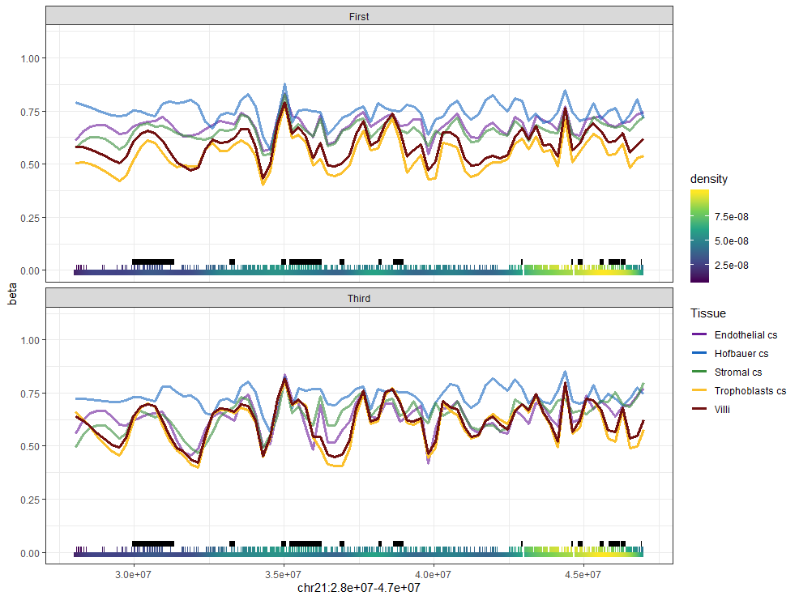
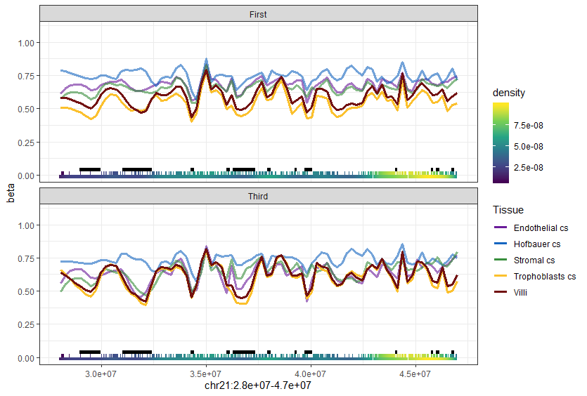

# Summary

This report describes the results of an analysis of PMD regions using placental cell DNAm data.

- Placental PMDs are a trophoblast-specific feature
- Hofbaeur cell methylation is highly specific, often hypermethylated compared to other placental cells
- PMD methylation changes across gestation

# Some background

Placental PMDs were original discovered using MethylC sequencing over the entire genome:

](../../data/external/F1AD.png)

They validate many of these PMDs with pyrosequencing in additional placentas, and also use some 450k array data.

For the 450k array validation, they filtered out cpgs to account for the biased cpg-representation: 

"Because the arrays are biased toward coverage of promoters, CpG islands, and CpG island shores, which often have low methylation, we removed them from the Infinium data and separated the remaining CpG sites into our previously defined placental PMDs and HMDs"

They did not show what the PMDs looked like before filtering (i.e. whether this is adequate enough to account for any bias in representation). Plus we have 850k data now. So below I compare what PMD methylation looks like **with/without filtering**, and on **450k/850k** cpgs.

# Genome build is important {#anchor}

Before going into the analysis, **I wanted to mention that my previous reports involving pmd analysis will need to be revised**. This is because I just recently found out that the list of PMDs were in *hg18* coordinates, whereas all my work has been in *hg19.* So in this report I repeat some of the analysis before, using the remapped coordinates.

Here is the location of the PMDs (black bars) using the **wrong** coordinates:




I noticed the black bars were not lined up to any dips in methylation (definition of a PMD), so I double-checked everything and found out I had the wrong genome build. Here is the same region with the **correct** coordinates:



Notice that the black bars corresponding to the pmd locations are now overlapping regions of intermediate methylation (in villi).

&nbsp;&nbsp;**Takeaway**: Always explore the data, especially if anything is unusual. To quote Maria, "never hesitate to doubt".

```{r include = FALSE}
knitr::opts_chunk$set(echo=FALSE, message=F, warning = F) #hide code
```

```{r, message = FALSE, warning = FALSE}
# libraries and data
library(tidyverse); theme_set(theme_bw())
library(glue)
library(scales)
library(DT)

pDat <- readRDS('../../data/main/interim/2_3_pDat_contam.rds')
pDat <- pDat %>%
  mutate(Tissue = case_when(
    !(Tissue %in% c('Villi', 'Villi maternal', 'Syncytiotrophoblast')) ~ paste(Tissue, 'cs'),
    Tissue == 'Syncytiotrophoblast' ~ 'Trophoblasts enz',
    TRUE ~ Tissue
  )) 


# raw methylation data
betas <- readRDS('../../data/main/interim/1_4_betas_noob_filt.rds')
colnames(betas) <- pDat$Sample_Name

# annotation
anno <- readRDS('Z:/Victor/Repositories/EPIC_annotation/hg19_epic_annotation.rds')

#color code
color_code <- readRDS('../../data/main/interim/2_3_color_code.rds')
color_code_tissue <- setNames(color_code$Colors_Tissue, color_code$label)

pDat_filt <- pDat %>% 
  filter(maternal_contamination_norm_flip < 0.35,
         !Sample_Name %in% c('PM364_hofb_cs', 'PL293_v_R2', 'PM366_vc_R2', 'P131_hofb_cs'),
         !Tissue %in% c('Villi maternal', 'Trophoblasts enz', 'Mixture cs', 'Dead Cells and Lymphocytes cs'))

# filter to first trimester
betas_filt <- betas[,pDat_filt$Sample_Name]

densities_pmds_plots <- readRDS('../../data/main/interim/2_7_pmd_density_plots.rds')
coverage <- readRDS('../../data/main/interim/2_7_pmd_coverage.rds') 
densities_high_res <- readRDS('../../data/main/interim/2_7_pmd_high_res_density.rds')

#color code
color_code <- readRDS('../../data/main/interim/2_3_color_code.rds')
color_code_tissue <- setNames(color_code$Colors_Tissue, color_code$label)

w1 <- 5.5
f1 <- 8
e1 <- TRUE
```

# Addressing bias for assessing PMD methylation 

A problem with assessing PMD methylation with arrays, is that 450k is biased towards gene-rich regions, whereas PMDs tend to occur in gene-porr regions. 850k theoretically should be better, because of improved coverage to enhancer and gene-poor regions 

## 450k/EPIC coverage of PMDs

For each PMD, what percent of CpGs are measured on the 450k/850k arrays?

```{r}
coverage %>%
  ggplot(aes(y = prop, x = count_type)) +
  geom_boxplot() +
  scale_y_continuous(labels = percent) +
  labs(y = 'Coverage over PMDs', x = '')
```

```{r}
coverage %>% 
  group_by(count_type) %>%
  summarize(median = median(prop), IQR = IQR(prop),
            mean = mean(prop), sd = sd(prop)) %>%
  mutate_if(is.numeric, percent) 
```

The EPIC array has more mean coverage over PMDs than the 450k array **(2.072% vs 1.429%)**

# Distribution of PMD methylation {.tabset}

We have an expectation that in placental villi, PMD methylation is highly intermediate. How does this compare to PMD methylation in placental cell types?

The below plots show the distribution of methylation across all PMDs, in first/third trimester cell samples and villi. I decided to compare 450k/850k and unfiltered/filtered cpg sets.

*Note that "filtered" here means, "cpgs not in **shores**, **islands**, or gene **promoter** regions".*

**Processing differences, comparing between plots:**

- EPIC cpgs have more intermediate methylation (0.4-0.7) than 450k cpgs across all subsets, indicating that there is better coverage of PMDs with EPIC data.
- Comparing Filtered/EPIC vs Unfiltered/EPIC, we can see that, as expected, more cpgs are intermediate and highly methylated in the filtered set. 
- However, it seems that the differences between tissues remains unchanged, whether we look at filtered or unfiltered. 

**Takeaway**: Prefer using filtered EPIC data for assessing PMD methylation. But unfiltered and 450k are probably fine too.

**Tissue differences:**

Here I look at the "filtered EPIC" plot, 

- There is more *hypomethylation* (0-0.4) in trophoblast and villi compared to other cell types (range 37.3%-46.6% vs 12.6%-29.75%)
- There is more *intermediate methylation* (0.4-0.7) in trophoblast and villi compared to other cell types (33.0%-43.9% vs 17.8%-39.0%)
- There is less *hypermethylation* (0.7-1.0) in trophoblast and villi compared to other cell types (17.2%-20.6% vs 37.86%-69.6%)

**Takeaway**: Villi and trophoblast have similar PMD methylation profiles, with lower methylation across most sites (hypo- and intermediate). Hofbaeur is very hypermethylated compared to others.

## Filtered, EPIC

```{r, fig.width=w1, fig.height=f1}
densities_pmds_plots$plots[[4]]
```

## Filtered, 450k

```{r, fig.width=w1, fig.height=f1, eval = e1}
densities_pmds_plots$plots[[3]]
```

## Unfiltered, 450k

```{r, fig.width=w1, fig.height=f1, eval = e1}
densities_pmds_plots$plots[[1]]
```

## Unfiltered, EPIC

```{r, fig.width=w1, fig.height=f1, eval = e1}
densities_pmds_plots$plots[[2]]
```

# PMD methylation across gestation {.tabset}

Here we examine the change in methylation within cell types, between third and first trimester.

* All cell types show an increase in hypomethylated sites with gestation
* Proportion of sites with intermediate methylation goes down in all cell types, except hofbauer cells
* There is a slight increase in hypermethylated sites for Villi and trophoblast, a decrease for endo and hofbauer cells. Stromal cells stay the same.

## Small interval

```{r, fig.height = 7}
densities_high_res %>%
  # extract data
  filter(filt == 'filtered', array == 'EPIC') %>%
  
  # remove density coords
  select(Trimester, Celltype, range, prop) %>%
  distinct() %>%
  
  {
    ggplot(data = ., aes(x = Trimester, y = prop, col = Celltype)) +
      geom_point() +
      geom_line(aes(group = Celltype)) +
      facet_wrap(~range, ncol = 5) +
      scale_color_manual(values= color_code_tissue[unique(.$Celltype)]) +
      scale_y_continuous(limits = c(0,NA), labels = percent) +
      labs(color = '', title = 'Percent of total CpGs in different methylation intervals',
           y = '') +
      theme(legend.position = 'bottom')
  }
```

## Large intervals

```{r, fig.height = 7}
densities_high_res %>%
  # extract data
  filter(filt == 'filtered', array == 'EPIC') %>%
  
  # remove density coords
  select(Trimester, Celltype, range, prop) %>%
  distinct() %>%
  
  # widen
  pivot_wider(id_cols = c(Trimester, Celltype),
              names_from = range,
              values_from = prop) %>%
  # sum intervals
  mutate(`Hypomethylated [0, 0.3]` = `(-Inf,0.1]` + `(0.1,0.2]` + `(0.2,0.3]`,
         `Intermediate (0.3, 0.7]` = `(0.3,0.4]` + `(0.4,0.5]` + `(0.5,0.6]` + `(0.6,0.7]`,
         `Methylated (0.7, 1]` = `(0.7,0.8]` + `(0.8,0.9]` + `(0.9, Inf]`) %>%
  select(Trimester, Celltype, contains('Hypo'), contains('Inter'), contains('Methylated')) %>%
  pivot_longer(cols = c(`Hypomethylated [0, 0.3]`:`Methylated (0.7, 1]`),
               names_to = 'range',
               values_to = 'prop') %>%
  
  {
    ggplot(data = ., aes(x = Trimester, y = prop, col = Celltype)) +
      geom_point() +
      geom_line(aes(group = Celltype)) +
      facet_wrap(~range, ncol = 5) +
      scale_color_manual(values= color_code_tissue[unique(.$Celltype)]) +
      scale_y_continuous(limits = c(0,NA), breaks = seq(0,1, by = 0.1), labels = percent) +
      labs(color = '', title = 'Percent of total CpGs in different methylation intervals',
           y = '') +
      theme(legend.position = 'bottom')
  }
```

# Exploring specific regions containing PMDs

I wanted to explore a couple of regions containing PMDs. 

**How to read the following plots,**

- The black bars at the bottom of each graph shows the region covered by a PMD. 
- The colored green/yellow "blocks" beneath the black bar mark where cpgs lie. The color of this cpg track represents the density of cpgs (more yellow means more cpgs lie at this spot).
- not all cpgs show up in the plot. Only those regions with many cpgs are shown.

**General observations:** 

- Hofbauer cells tend to be hypermethylated compared to other cells
- Villi and trophoblast tend to be hypomethylated compared to others, with trophoblast often being slightly more hypomethylated
- Stromal and endo are often intermediate between hofbauer and villi/troph. However, in third trimester they are sometimes similarly as hypomethylated as villi/troph.

**Takeaway**: Observed placenta PMDs may be a trophoblast-specific feature. 

```{r}
# define plotting function
plot_region <- function(c, s, e, span = 0.1, cpg_size = NULL,
                        filtered = TRUE, array = 'EPIC') {
  
  if (is.null(cpg_size)) {
    cpg_size <- (e-s)*0.0005
  }
  
  # requires anno, betas_filt, anno_450k, pDat_filt
  if (filtered) {
    region1 <- anno %>%
      filter(chr == c, between(start, s, e),
             cpg %in% rownames(betas_filt),
             !cpg_id %in% c('island', 'shore'),
             !grepl('promoter', genes_id)) %>%
      pull(cpg)
  } else {
    region1 <- anno %>%
      filter(chr == c, between(start, s, e),
             cpg %in% rownames(betas_filt)) %>%
      pull(cpg)
  }
  
  if (array == '450K') {
    region1 <- intersect(anno_450k$Name, region1)
  } 
  
  # subset to cpgs in region
  region1_data <- betas_filt[region1, ] %>%
    
    t() %>%
    as.data.frame() %>%
    bind_cols(Sample_Name = rownames(.), .) %>%
    
    # melt
    gather(cpg, beta, -Sample_Name) %>%
    
    # add trimester and sex
    inner_join(pDat_filt %>% select(Sample_Name, Trimester, Tissue)) %>%
    
    # add cpg coordinates
    inner_join(anno %>% select(cpg, chr, pos = start)) %>%
    
    # set a grouping variable to control alpha for placenta/troph
    mutate(alpha_group = if_else(Tissue %in% c('Trophoblasts cs', 'Villi'),
                                 1, 0.6)) %>%
    
    # remove second trimester data
    filter(Trimester != 'Second')
  
  # cpg density for measured cpgs
  cpg_dens <- anno %>%
    filter(cpg %in% region1) %>%
    select(chr, start, end) %>%
    mutate(dens = approxfun(density(start))(start))
  
  # get pmd data
  pmd_data <- anno %>%
    filter(chr == c, between(start, s, e), 
           !is.na(pmd_id)) %>%
    select(pmd_id) %>%
    separate(pmd_id, into = c('chr', 'start', 'end'), remove = FALSE) %>%
    mutate(chr = factor(chr, levels = paste0('chr', c(1:22, 'X'))),
           start = as.numeric(start),
           end = as.numeric(end)) %>%
    arrange(chr, start) %>%
    distinct()
  
  ggplot(region1_data) +
    geom_line(stat = 'smooth', span = span, method = 'loess', se = FALSE,
              aes(x = pos, y = beta, color = Tissue, alpha = alpha_group), size = 1.25) +
    geom_rect(data = pmd_data, 
              aes(xmin = start, xmax = end), 
              ymin = 0.025, ymax = 0.05, fill = 'black') +
    geom_rect(data = cpg_dens, aes(xmin = start - cpg_size/2, xmax = start + cpg_size/2,
                                   fill = dens),
              ymin = 0, ymax = 0.025) +
    theme_bw(base_size = 18) +
    facet_wrap(~Trimester, ncol = 1) +
    scale_color_manual(values= color_code_tissue[unique(region1_data$Tissue)]) +
    scale_fill_viridis_c(option = 'inferno', end = 0.75, guide = "none") +
    scale_y_continuous(expand = c(0,0), limits = c(0, 1.1), 
                       breaks = c(0, 0.25, 0.5, 0.75, 1), labels = percent) +
    scale_x_continuous(limits = c(s, e), labels = comma) +
    scale_alpha_identity() +
    labs(x = 'Chromosome position (bp)', y = 'Methylation',
         title = paste0(c, ':', comma(s), '-', comma(e)), color = '')
}

w2 <- 10
h2 <- 7
```

## Figure 1D

*I showed this before at the beginning in the ["Genome build is important" section](#anchor).*

Here is figure 1D from [D.I. Schroeder et al. 2013](https://www.pnas.org/content/110/15/6037):


A recent paper also examined this same region, using villi 450k data:

. Orange line are normal villi samples.](../../data/external/F2C.PNG)

Same region, but with our data:

```{r, fig.width = w2, fig.height = h2}
plot_region(c = 'chr21', s = 25000000, e = 47000000, span = 0.05, filtered = T, #cpg_size = 5000,
            array = 'EPIC') 
```

## Figure S1c

](../../data/external/FS1C.PNG)

Same region, our data:

```{r, fig.width = w2, fig.height = h2}
plot_region(c = 'chr21', s = 13000000, e = 48000000, span = 0.01, filtered = T, #cpg_size = 5000,
            array = 'EPIC') +
  scale_x_continuous(limits = c(13000000, 48000000), breaks = seq(15000000, 45000000, 
                                                                  length.out = 7),
                     labels = comma(seq(15000000, 45000000, length.out = 7) / 1000000)) +
  labs(x = 'Chromosome position (mb)')
```

## PM324 V1 {.tabset}

Giulia sent me the coordinates for the CNVs of PM324_v1. I thought it would be interesting to see the methylation at any PMDs that are impacted by these CNVs.

*Dashed vertical lines correspond to CNV boundaries*

### 1q32.1

```{r, fig.width = w2, fig.height = h2}
plot_region(c = 'chr1', s = 167000000, e = 173500000, span = 0.08, filtered = T, #cpg_size = 10000,
            array = 'EPIC') +
  geom_vline(xintercept = 169133115, linetype = 'dashed') +
  geom_vline(xintercept = 172752205, linetype = 'dashed')
```

We can zoom into this CNV region more closely

```{r, fig.width = w2, fig.height = h2}
plot_region(c = 'chr1', s = 169133115, e = 172752205, span = 0.06, filtered = T, 
            cpg_size = 0.005 * (172752205-169133115),
            array = 'EPIC') 
```

### 5q35.1

```{r, fig.width = w2, fig.height = h2}
cnv_start <- 169133115
cnv_end <- 172752205

plot_region(c = 'chr5', s = cnv_start - 3500000, e = cnv_end + 3500000, 
            span = 0.05, filtered = T, array = 'EPIC') +
  geom_vline(xintercept = cnv_start, linetype = 'dashed') +
  geom_vline(xintercept = cnv_end, linetype = 'dashed')
```

### 6q12

```{r, fig.width = w2, fig.height = h2}
cnv_start <- 66855754
cnv_end <- 69301518

plot_region(c = 'chr6', s = cnv_start - 3500000, e = cnv_end + 3500000, 
            span = 0.08, filtered = T, array = 'EPIC') +
  geom_vline(xintercept = cnv_start, linetype = 'dashed') +
  geom_vline(xintercept = cnv_end, linetype = 'dashed')
```

### 7q11.21-11.22

```{r, fig.width = w2, fig.height = h2}
cnv_start <- 65791671
cnv_end <- 69249095

plot_region(c = 'chr5', s = cnv_start - 3500000, e = cnv_end + 3500000, 
            span = 0.08, filtered = T, array = 'EPIC') +
  geom_vline(xintercept = cnv_start, linetype = 'dashed') +
  geom_vline(xintercept = cnv_end, linetype = 'dashed')
```

### 8q21.3-22.1

```{r, fig.width = w2, fig.height = h2}
cnv_start <- 92757374
cnv_end <- 96311905

plot_region(c = 'chr5', s = cnv_start - 3500000, e = cnv_end + 3500000, 
            span = 0.08, filtered = T, array = 'EPIC') +
  geom_vline(xintercept = cnv_start, linetype = 'dashed') +
  geom_vline(xintercept = cnv_end, linetype = 'dashed')
```

### 11p11.2

```{r, fig.width = w2, fig.height = h2}
cnv_start <- 43851111
cnv_end <- 47385923

plot_region(c = 'chr5', s = cnv_start - 3500000, e = cnv_end + 3500000, 
            span = 0.08, filtered = T, array = 'EPIC') +
  geom_vline(xintercept = cnv_start, linetype = 'dashed') +
  geom_vline(xintercept = cnv_end, linetype = 'dashed')
```

### 11q14.3-21

```{r, fig.width = w2, fig.height = h2}
cnv_start <- 90310352
cnv_end <- 93636999

plot_region(c = 'chr5', s = cnv_start - 3500000, e = cnv_end + 3500000, 
            span = 0.08, filtered = T, array = 'EPIC') +
  geom_vline(xintercept = cnv_start, linetype = 'dashed') +
  geom_vline(xintercept = cnv_end, linetype = 'dashed')
```

### 17q21.33-22

```{r, fig.width = w2, fig.height = h2}
cnv_start <- 48475076
cnv_end <- 52011849

plot_region(c = 'chr5', s = cnv_start - 3500000, e = cnv_end + 3500000, 
            span = 0.08, filtered = T, array = 'EPIC') +
  geom_vline(xintercept = cnv_start, linetype = 'dashed') +
  geom_vline(xintercept = cnv_end, linetype = 'dashed')
```

## Other regions

I manually went through the location of all PMDs (in the below table) and chose a few regions that I thought would be interesting to plot. 

```{r}
anno %>%
  filter(cpg %in% rownames(betas_filt)) %>%
  
  # count number of cpgs per pmd, parse the pmd_id into position
  group_by(pmd_id) %>%
  summarize(n = n(), pmd_width = paste(unique(pmd_width), collapse = ', ')) %>%
  filter(!is.na(pmd_id)) %>%
  separate(pmd_id, into = c('chr', 'start', 'end')) %>%
  mutate(chr = factor(chr, levels = paste0('chr', c(1:22, 'X'))),
         start = as.numeric(start),
         end = as.numeric(end)) %>%
  arrange(chr, start) %>%
  
  # filter out pmds with low coverage
  filter(n > 20) %>%
  datatable()
```


```{r, fig.width = w2, fig.height = h2}
plot_region(c = 'chr1', s = 1000000, e = 1130000, span = 0.25,filtered = T, 
            array = 'EPIC') 
```


```{r, fig.width = w2, fig.height = h2}
plot_region(c = 'chr4', s = 6400000, e = 6600000, span = 0.15, filtered = T, #cpg_size = 250,
            array = 'EPIC')
```

```{r, fig.width = w2, fig.height = h2}
plot_region(c = 'chr7', s = 850000, e = 1025000, span = 0.15, filtered = T)
```

```{r, fig.width = w2, fig.height = h2}
plot_region(c = 'chr19', s = 22000000, e = 58000000, span = 0.01, filtered = T)
```

