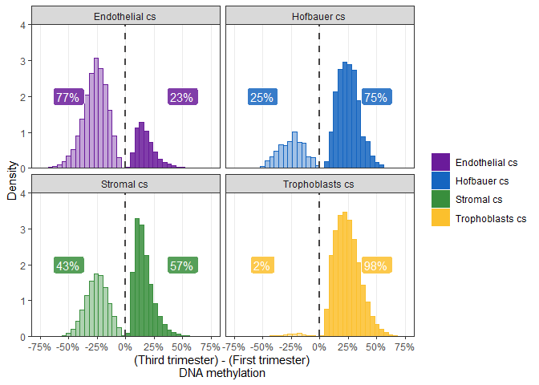
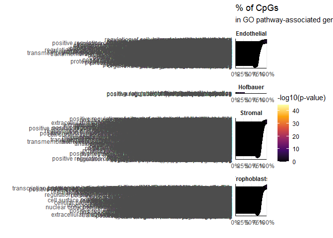
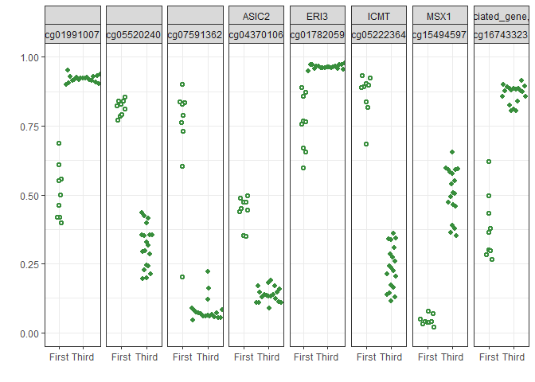

# Setup

## Libraries


```r
# libraries and data
library(minfi)
library(limma)
library(biobroom)
library(scales)
library(ggrepel)
library(here)
library(missMethyl)
library(IlluminaHumanMethylationEPICanno.ilm10b4.hg19)
library(ggridges)
library(ggbeeswarm)
library(tidyverse)
theme_set(theme_bw())
```

## Data


```r
base_path <- file.path('data', 'main', 'interim')

pDat <- readRDS(here(base_path, '2_3_pDat_contam.rds'))
pDat <- pDat %>%
  mutate(Tissue = case_when(
    !(Tissue %in% c('Villi', 'Villi maternal', 'Syncytiotrophoblast')) ~ paste(Tissue, 'cs'),
    Tissue == 'Syncytiotrophoblast' ~ 'Trophoblasts enz',
    TRUE ~ Tissue
  )) 

# raw methylation data
betas <- readRDS(here(base_path, '1_4_betas_noob_filt.rds'))

mset_noob <- readRDS(here(base_path, '1_4_mset_noob.rds')) # for mvals
colnames(mset_noob) <- colnames(betas) <- pDat$Sample_Name
mvals <- getM(mset_noob)

# annotation
anno <- readRDS('Z:/Victor/Repositories/EPIC_annotation/hg19_epic_annotation.rds')
anno <- anno %>%
  as_tibble() %>%
  filter(cpg %in% rownames(betas)) # filter to filtered betas cpgs
probe_anno <- readRDS(here(base_path, '1_1_probe_anno.rds'))

# color key
pheatmap_color_code <- readRDS(here(base_path, '1_1_color_code.rds'))

color_code <- readRDS(here(base_path, '2_3_color_code.rds'))
color_code_tissue <- setNames(color_code$Colors_Tissue, color_code$label)
```

## Remove samples


```r
pDat_filt <- pDat %>% 
  filter(maternal_contamination_norm_flip < 0.35,
         !Sample_Name %in% c('PM364_hofb_cs', 'PL293_v_R2', 'PM366_vc_R2', 'P131_hofb_cs', 
                             'PM324_V4', 'PM324_V1'),
         !Tissue %in% c('Villi maternal', 'Trophoblasts enz', 'Mixture cs', 
                        'Dead Cells and Lymphocytes cs', 'Villi'),)

# filter to first trimester
mvals_filt <- mvals[rownames(betas),pDat_filt$Sample_Name]
betas_filt <- betas[,pDat_filt$Sample_Name]
```

#Linear modelling

## DMCs


```r
# design matrix with Tissue and trimester
design <- pDat_filt %>% 
  select(Tissue, Case_ID, Trimester, Sex) %>%
  mutate(Tissue = gsub('Endothelial cs', 'Endo_cs',
                       gsub('Hofbauer cs', 'Hofb_cs',
                            gsub('Trophoblasts cs', 'Troph_cs',
                                 gsub('Stromal cs', 'Strom_cs',
                                      gsub(':', '\\.', 
                                           Tissue))))))

design <- model.matrix(~0 + Trimester:Tissue, data = design)
colnames(design) <- gsub(':', '\\.', 
                               gsub('Tissue', '',
                                    gsub('Trimester', '', 
                                         colnames(design)))) # rename columns

# account for subject-specific variation
#corfit <- duplicateCorrelation(mvals_filt, design, block = pDat_filt$Case_ID)
#corfitb <- duplicateCorrelation(betas_filt, design, block = pDat_filt$Case_ID)
#saveRDS(list(m = corfit, b = corfitb), '../../data/main/interim/2_4_corfit_mvals.rds')
#corfit <- readRDS('../../data/main/interim/2_4_corfit_mvals.rds')
#corfitb <- corfit$b
#corfitm <- corfit$m;rm(corfit)

#START HEREE JULY 9
contMatrix <- makeContrasts(
  Third.Endo_cs - First.Endo_cs,
  Third.Hofb_cs - First.Hofb_cs,
  Third.Strom_cs - First.Strom_cs,
  Third.Troph_cs - First.Troph_cs,
  
  levels=design)

# fit the linear model
fit_m <- lmFit(mvals_filt, design) %>%
  contrasts.fit(contMatrix) %>%
  eBayes()%>%
  tidy()  %>%
  group_by(term) %>%
  mutate(fdr = p.adjust(p.value, method = "fdr"),
         bonferroni = p.adjust(p.value, method = 'bonferroni'))  %>%
  ungroup() 
```

```
## Warning: `tbl_df()` is deprecated as of dplyr 1.0.0.
## Please use `tibble::as_tibble()` instead.
## This warning is displayed once every 8 hours.
## Call `lifecycle::last_warnings()` to see where this warning was generated.
```

```r
# add delta betas
fit_b <- lmFit(betas_filt, design) %>%
  contrasts.fit(contMatrix) %>%
  eBayes() %>%
  tidy() %>%
  dplyr::rename(delta_b = estimate) %>%
  select(gene, term, delta_b)

dmcs <- fit_m %>% left_join(fit_b) %>%
  mutate(Tissue = case_when(
           grepl('Endo', term) ~ 'Endothelial cs',
           grepl('Strom', term) ~ 'Stromal cs',
           grepl('Hofb', term) ~ 'Hofbauer cs',
           grepl('Troph', term) ~ 'Trophoblasts cs'))
```

```
## Joining, by = c("gene", "term")
```


## Distribution of mean change in methylation across gestation

What is the general direction of methylation change between third and first trimester samples across all EPIC cpgs?

Here I find the change in mean methylation between third and first trimester cells for each cpg, and then plot the distribution


```r
# generate histogram on delta betas across tissue
histogram_dmc <- function(data, 
                          
                          xlim = c(-0.5, 0.5), ylim = NULL, 
                          label_x = 20, label_y = 6) {
    
  # set xlim and ylim to NULL if you want the axes to be auto-zoomed
  # label_y / label_x is the position of the labels
  
  # all effect sizes, calculate density:
  effect_size_dens <- data %>%
    group_by(Tissue) %>%
    summarize(hist = list(hist(delta_b, breaks = seq(-1, 1, 0.04), plot = FALSE))) %>%
    
    mutate(# get the xmin/xmax of bins,
           breaks = map(hist, 'breaks'),
           xmin = map(breaks, ~.[1:length(.)-1]),
           xmax = map(breaks, ~.[2:length(.)]),
           
           # midpoint of bin
           xmean = map(hist, 'mids'),
           
           # density is the height of the bins
           y = map(hist, 'density')) %>%
    select(-hist, -breaks) %>%
    unnest(c(xmin:y)) %>%
    
    # categorize bins
    mutate(alpha = ifelse(xmean >= 0, 'Increases', 'Decreases'))
  
    
  # proportion hypo / hyper
  effect_size_prop <- data %>%
    group_by(Tissue) %>%
    summarize(Decreases = percent(sum(delta_b < 0) / n()),
              Increases = percent(sum(delta_b > 0) / n())) %>%
    pivot_longer(cols = -Tissue,
                 names_to = 'alpha',
                 values_to = 'proportion') %>%
    
    # make coordinates for label position
    mutate(x = ifelse(alpha == 'Decreases', -label_x/100, label_x/100),
           y = label_y)
  
  # plot
  p <- ggplot(data = effect_size_dens) +
    geom_rect(aes(xmin = xmin, 
                  xmax = xmax, 
                  ymin = 0, 
                  ymax = y, 
                    
                  fill = Tissue, 
                  color = Tissue, 
                  alpha = alpha)) +
    geom_label(data = effect_size_prop,
               aes(label = proportion, 
                   x = x, 
                   y = y,
                   fill = Tissue),
               colour = 'white', 
               alpha = 0.85, 
               show.legend = FALSE) + 
    geom_vline(xintercept = 0, 
               color = '#454343', 
               linetype = 'dashed', 
               size = 1) +
    facet_wrap(~Tissue) +
    scale_fill_manual(values = color_code_tissue[effect_size_dens$Tissue]) +
    scale_color_manual(values = color_code_tissue[effect_size_dens$Tissue]) +
    scale_alpha_manual(values = c(0.4, 0.85), 
                       guide = "none") +
    scale_x_continuous(labels = percent_format(accuracy = 1L), 
                       breaks = seq(-1, 1, 0.2)) +
    scale_y_continuous(expand = c(0,0)) +
    coord_cartesian(xlim = xlim, ylim = ylim) +
    theme(panel.grid.minor.y = element_blank(),
          panel.grid.minor.x = element_blank(),
          panel.grid.major.y = element_blank()) +
    labs(x = '(Third trimester) - (First trimester)\nDNA methylation', 
         y = 'Density', 
         fill = '', 
         color = '')
  
  p
}

histogram_dmc(dmcs)
```

```
## `summarise()` ungrouping output (override with `.groups` argument)
## `summarise()` ungrouping output (override with `.groups` argument)
```

<!-- -->

Let's see how this distribution changes as we filter to statistically / biologically significant CpGs / DMCs:


```r
# bonferroni p < 0.01
dmcs %>%
  filter(bonferroni < 0.01) %>%
  histogram_dmc(xlim = c(-0.75, 0.75), ylim = c(0, 4), 
                label_x = 50, label_y = 2) +
  scale_x_continuous(labels = percent_format(accuracy = 1L), 
                     breaks = seq(-0.75, 0.75, 0.25)) 
```

```
## `summarise()` ungrouping output (override with `.groups` argument)
## `summarise()` ungrouping output (override with `.groups` argument)
```

```
## Scale for 'x' is already present. Adding another scale for 'x', which will
## replace the existing scale.
```

<!-- -->

```r
# bonferroni p < 0.01, delta_b > 0.05
dmcs %>%
  filter(bonferroni < 0.01, abs(delta_b) > 0.05) %>%
  histogram_dmc(xlim = c(-0.75, 0.75), ylim = c(0, 4), 
                label_x = 50, label_y = 2) +
  scale_x_continuous(labels = percent_format(accuracy = 1L), 
                     breaks = seq(-0.75, 0.75, 0.25))
```

```
## `summarise()` ungrouping output (override with `.groups` argument)
```

```
## `summarise()` ungrouping output (override with `.groups` argument)
```

```
## Scale for 'x' is already present. Adding another scale for 'x', which will
## replace the existing scale.
```

<!-- -->

```r
# define cutoffs
p_thresh <- 0.01
b_thresh <- 0.05

# count number of significant cpgs per cell
dmcs_sig <- dmcs %>% 
  group_by(term) %>% 
  summarize(b01db05_all = sum(bonferroni < p_thresh & abs(delta_b) > b_thresh), 
            b01db05_hypo = sum(bonferroni < p_thresh & delta_b < -b_thresh),
            b01db05_hyper = sum(bonferroni < p_thresh & delta_b > b_thresh)) 
```

```
## `summarise()` ungrouping output (override with `.groups` argument)
```

```r
dmcs_sig
```

```
## # A tibble: 4 x 4
##   term                            b01db05_all b01db05_hypo b01db05_hyper
##   <fct>                                 <int>        <int>         <int>
## 1 Third.Endo_cs - First.Endo_cs         63420        48885         14535
## 2 Third.Hofb_cs - First.Hofb_cs          1549          378          1171
## 3 Third.Strom_cs - First.Strom_cs       94595        41094         53501
## 4 Third.Troph_cs - First.Troph_cs      108793         1917        106876
```

# Functional enrichment

## GO terms


```r
#GO testing
gst <- dmcs %>% 
  group_by(term) %>%
  nest(lm_summary = -term) %>%
  mutate(GO_results = map(lm_summary, . %>% 
                            filter(bonferroni < p_thresh, abs(delta_b) > b_thresh) %>%
                            pull(gene) %>% 
                            gometh(all.cpg= rownames(betas), 
                                   collection = 'GO',
                                   array.type = 'EPIC') %>%
                            mutate(ID = rownames(.)) %>%
                            arrange(FDR)),
         # number significnat at FDR < 0.05
         FDR05_signif = map_dbl(GO_results, . %>% filter(FDR < 0.05) %>% nrow())) %>%
  
  # process results
  mutate(Celltype = case_when(
    grepl("Endo_cs", term) ~ 'Endothelial cs',
    grepl('Hofb_cs', term) ~ 'Hofbauer cs',
    grepl('Strom_cs', term) ~ 'Stromal cs',
    grepl('Troph_cs', term) ~ 'Trophoblasts cs'),
    
    # filter to significant results
    GO_results = map(GO_results, . %>% filter(FDR < 0.05))) %>%
  
  select(-lm_summary) %>%
  unnest(GO_results) %>% 
  
  # number of DE cpgs per total cpgs in each gene
  mutate(Generatio = DE/N, 
         neg_log_P = -log(P.DE, base = 10)) %>%
  
  # set up ordering for plot
  ungroup() %>%
  arrange(Celltype, Generatio) %>%
  mutate(Order = row_number())

# plot results
gst %>%
  ggplot(aes(x = Order, y = Generatio, fill = neg_log_P)) +
  geom_segment(aes(x = Order, xend = Order, y = 0, yend = Generatio)) +
  geom_point(stat = 'identity', shape = 21, color = 'black', size = 3) +
  theme_bw() +
  theme(panel.background = element_blank(),
        strip.background = element_blank(),
        strip.text = element_text(face = 'bold'),
        axis.ticks = element_blank(),
        panel.grid.minor = element_blank(),
        panel.grid.major.y = element_blank(),
        panel.border = element_blank(),
        axis.line = element_line()) +
  ggforce::facet_col(vars(Celltype), scales = "free", space = "free",
                     labeller = labeller(Celltype = function(x)gsub(' cs', '', x))) +
  scale_x_continuous(expand = c(0.1, 0.1),
                     breaks = gst$Order,
                     labels = gst$TERM) +
  coord_flip() +
  scale_y_continuous(expand = c(0,0), limits = c(0,1), labels = scales::percent) +
  scale_fill_viridis_c(option = 'B', begin = 0, limits = c(0, NA)) +
  labs(fill = '-log10(p-value)', x = '', 
       title = '% of CpGs',
       y = '',
       subtitle = 'in GO pathway-associated genes that are DMCs')
```

<!-- -->

## KEGG


```r
kegg <- dmcs %>% 
  group_by(term) %>%
  nest(lm_summary = -term) %>%
  mutate(results = map(lm_summary, . %>% 
                            filter(bonferroni < p_thresh, abs(delta_b) > b_thresh) %>%
                            pull(gene) %>% 
                            gometh(all.cpg= rownames(betas), 
                                   collection = 'KEGG',
                                   array.type = 'EPIC') %>%
                            mutate(ID = rownames(.)) %>%
                            arrange(FDR)),
         # number significnat at FDR < 0.05
         FDR05_signif = map_dbl(results, . %>% filter(FDR < 0.05) %>% nrow())) %>%
  
  # process results
  mutate(Celltype = case_when(
    grepl("Endo_cs", term) ~ 'Endothelial cs',
    grepl('Hofb_cs', term) ~ 'Hofbauer cs',
    grepl('Strom_cs', term) ~ 'Stromal cs',
    grepl('Troph_cs', term) ~ 'Trophoblasts cs'),
    
    # filter to significant results
    results = map(results, . %>% filter(FDR < 0.05))) %>%
  
  select(-lm_summary) %>%
  unnest(results) %>% 
  
  # number of DE cpgs per total cpgs in each gene
  mutate(Generatio = DE/N, 
         neg_log_P = -log(P.DE, base = 10)) %>%
  
  # set up ordering for plot
  ungroup() %>%
  arrange(Celltype, Generatio) %>%
  mutate(Order = row_number())

# plot results
kegg %>%
  
  # take top 10 significant
  group_by(term) %>%
  dplyr::slice(1:10) %>%
  
    ggplot(aes(x = Order, y = Generatio, fill = neg_log_P)) +
  geom_segment(aes(x = Order, xend = Order, y = 0, yend = Generatio)) +
  geom_point(stat = 'identity', shape = 21, color = 'black', size = 3) +
  theme_bw() +
  theme(panel.background = element_blank(),
        strip.background = element_blank(),
        strip.text = element_text(face = 'bold'),
        axis.ticks = element_blank(),
        panel.grid.minor = element_blank(),
        panel.grid.major.y = element_blank(),
        panel.border = element_blank(),
        axis.line = element_line()) +
  ggforce::facet_col(vars(Celltype), scales = "free", space = "free",
                     labeller = labeller(Celltype = function(x)gsub(' cs', '', x))) +
  scale_x_continuous(expand = c(0.1, 0.1),
                     breaks = kegg$Order,
                     labels = kegg$Description) +
  coord_flip() +
  scale_y_continuous(expand = c(0,0), limits = c(0,1), labels = scales::percent) +
  scale_fill_viridis_c(option = 'B', begin = 0, limits = c(0, NA)) +
  labs(fill = '-log10(p-value)', x = '', 
       title = '% of CpGs',
       y = '',
       subtitle = 'in KEGG pathway-associated genes that are DMCs')
```

<!-- -->


# Genomic enrichment

*Copied from `2_5_enrichment_analysis.Rmd`*

## Conduct tests


```r
# dummy variable all categories
annotation <- anno %>% 
  
  # mutate spread is clean, but slow. Can only work with those that have non-duplicated strings in each element
  mutate(var = 1) %>%
  spread(cpg_id, var, fill = 0) %>% 
  
  mutate(var = 1) %>%
  spread(chr, var, fill = 0) %>% 
  
  mutate(
         # cannot follow the spread strategy above, since we have numerous occurences in each element
         `1to5kb` = ifelse(grepl('1to5kb', genes_id), 1, 0),
         `3UTR` = ifelse(grepl('3UTR', genes_id), 1, 0),
         `5UTR` = ifelse(grepl('5UTR', genes_id), 1, 0),
         exon = ifelse(grepl("exon", genes_id), 1, 0),
         intergenic = ifelse(grepl('intergenic', genes_id), 1, 0),
         intron = ifelse(grepl('intron', genes_id), 1, 0),
         intronexonboundary = ifelse(grepl('intronexonboundary', genes_id), 1, 0),
         promoter = ifelse(grepl("promoter", genes_id), 1, 0),
         
         enhancer = !is.na(enhancers_id),
         pmd = !is.na(pmd_id),
         imprinted_dmr_placenta = ifelse(grepl('placental-specific', imprint_tissue_specificity), 
                                         1, 0),
         imprinted_dmr_general = ifelse(grepl('other', imprint_tissue_specificity), 
                                        1, 0))

# add gene annotation to dmcs
dmcs <- dmcs %>% left_join(annotation, by = c('gene' = 'cpg'))

# filter to all tested cpgs
annotation <- annotation %>%
  filter(cpg %in% dmcs$gene)
  
# tabulate the background frequency per genomic element
expected <-  annotation %>%
  dplyr::select(cpg, island:pmd, imprinted_dmr_placenta, imprinted_dmr_general) %>%
  gather(key = genomic_feature, value = present, -cpg) %>%
  
  group_by(genomic_feature) %>%
  summarize(Expected_n_in = sum(present), 
            
            Expected_n_out = nrow(annotation) - Expected_n_in,
            Expected_p_in = Expected_n_in/ nrow(annotation),
            Expected_p_out = Expected_n_out / nrow(annotation))
```

```
## `summarise()` ungrouping output (override with `.groups` argument)
```

```r
# tabulate observed frequency for significant cpgs
observed <- dmcs %>% 
  
  # add hypo hyper as group
  mutate(Group1 = paste0(Tissue, ifelse(delta_b > 0, '.Hyper', '.Hypo'))) %>%
  
  # calculate total dmcs per cell type
  group_by(Group1) %>%
  mutate(n_total = sum(bonferroni < p_thresh & abs(delta_b) > b_thresh )) %>%
  
  # filter to just dmcs
  filter(bonferroni < p_thresh, abs(delta_b) > b_thresh) %>%
  select(Group1, gene, island:pmd, imprinted_dmr_placenta, imprinted_dmr_general, n_total) %>%

  # calculated the number of dmcs in each feature, and then the number out
  gather(key = genomic_feature, value = present, -gene, -Group1, -n_total) %>%
  group_by(Group1, genomic_feature) %>%
  summarize(Observed_n_in = sum(present), 
            
            Observed_n_out = unique(n_total) - Observed_n_in,
            Observed_p_in = Observed_n_in / unique(n_total),
            Observed_p_out = Observed_n_out / unique(n_total))
```

```
## `summarise()` regrouping output by 'Group1' (override with `.groups` argument)
```

```r
# fisher's test for enrichment
# (1) # of DMCs on var1 (already calcualted, 'Freq')
# (2) # of non-DMCs on var1
# (3) # of DMCs not on var1
# (4) # of non-DMCs not on var1


# calculate (2) (3) (4), and test enrichment
tests <- observed %>%
  
  ungroup() %>%
  
  # add in all_cpgs datarfame for calculations
  left_join(expected, by = 'genomic_feature') %>%
  
  # calculate (2), (4)
  mutate(Observed_notDMC_in = Expected_n_in - Observed_n_in,   #(2) # non-DMCs in var1
         
         # for (4)
         Observed_notDMC_out = Expected_n_out - Observed_n_out) %>%  # of non-DMCs out of Var1
  
  # test enrichment
  rowwise() %>%
  mutate(test_in = list(matrix(c(Observed_n_in, Observed_notDMC_in, 
                                   Observed_n_out, Observed_notDMC_out),2,2))) %>%
  ungroup() %>%
  
  mutate(test_out = map(test_in, ~fisher.test(., conf.int = 0.95)),
         p = map_dbl(test_out, 'p.value'),
         confidence_interval_min = map_dbl(test_out, ~.$conf.int[1]),
         confidence_interval_max = map_dbl(test_out, ~.$conf.int[2]),
         odds_ratio = map_dbl(test_out, 'estimate'),
         FDR = p.adjust(p, method = 'fdr'),
         bonferroni = p.adjust(p, method = 'bonferroni'),
         FDR01 = FDR < 0.01,
         bonferroni01 = bonferroni < 0.01) %>% 
  select(odds_ratio, contains('confidence'), FDR, FDR01, 
         bonferroni, bonferroni01, p, everything()) %>%
  separate(Group1, into = c('Celltype', 'Direction'), sep = '\\.') 
  
colors <- color_code %>% 
  filter(label %in% c('Endothelial cs', 'Hofbauer cs', 'Stromal cs', 'Trophoblasts cs'))
colors <- setNames(colors$Colors_Tissue, unique(tests$Celltype))

# categorize genomic features
tests <- tests %>% 
  mutate(
    genomic_feature_category = case_when(
      grepl('chr', genomic_feature) ~ 'chr',
      genomic_feature %in% c('1to5kb', '3UTR', '5UTR', 'exon', 'intron', 
                             'intergenic', 'intronexonboundary', 'promoter') ~ 'gene',
      genomic_feature %in% c('island', 'shore', 'shelf', 'sea') ~ 'cpg_island',
      grepl('imprint', genomic_feature) ~ 'imprinting',
      genomic_feature == 'pmd' ~ 'pmd',
      genomic_feature == 'enhancer' ~ 'enhancer'),
    FDR_cat = case_when(
      FDR < 0.05 ~ "FDR < 0.05",
      FDR < 0.01 ~ "FDR < 0.01",
      FDR < 0.001 ~ "FDR < 0.001",
      TRUE ~ "n.s")
    ) 
```

## Visualize


```r
dmcs %>% 
    
    # add hypo hyper as group
    mutate(Group1 = paste0(Tissue, ifelse(delta_b > 0, '.Hyper', '.Hypo'))) %>%
    
    # calculate total dmcs per cell type
    group_by(Group1) %>% 
    summarize(n = sum(bonferroni < p_thresh & 
                      abs(delta_b) > b_thresh & island == 1, na.rm = T),
      all = sum(bonferroni < p_thresh & abs(delta_b) > b_thresh, na.rm = T),
      p =n/all)
```

```
## `summarise()` ungrouping output (override with `.groups` argument)
```

```
## # A tibble: 8 x 4
##   Group1                    n    all      p
##   <chr>                 <int>  <int>  <dbl>
## 1 Endothelial cs.Hyper   2083  14535 0.143 
## 2 Endothelial cs.Hypo     992  48885 0.0203
## 3 Hofbauer cs.Hyper        51   1171 0.0436
## 4 Hofbauer cs.Hypo         44    378 0.116 
## 5 Stromal cs.Hyper       4903  53501 0.0916
## 6 Stromal cs.Hypo        1082  41094 0.0263
## 7 Trophoblasts cs.Hyper  2724 106876 0.0255
## 8 Trophoblasts cs.Hypo    209   1917 0.109
```

```r
# plot function
plot_enrich <- function(x) {
  g <- ggplot(data = x) +
  geom_hline(yintercept = 1, color = 'black', linetype = 'solid', size = 1) +
  geom_pointrange(aes(x = genomic_feature, 
                      ymin = confidence_interval_min, 
                      ymax = confidence_interval_max,
                      shape = FDR01, 
                      y = odds_ratio, 
                      color = Celltype,
                      alpha = FDR01),
                  position = position_dodge(width =0.5 )) +
  geom_vline(xintercept = seq(1, 22, 2), alpha = 0.25) +
  facet_grid(Celltype~Direction) +
  scale_color_manual(values= color_code_tissue[unique(tests$Celltype)]) +
  scale_y_log10() +
  scale_shape_manual(values = c('TRUE' = 16, 'FALSE' = 0), 
                     labels = c('Not significant', 'FDR < 0.01')) +
  scale_alpha_manual(values = c('TRUE' = 1, 'FALSE' = 1),
                     guide = FALSE) +
  coord_flip() +
  theme_bw() +
  theme(panel.grid.minor.x = element_blank(),
        panel.grid.major.y = element_blank(),
        axis.text.y = element_text(size = 8))
  print(g)
}

plot_bar <- function(x){
  x %>%
    # ordering in plot
    mutate(# linerange ymin ymax values
           ymin = pmin(Observed_p_in, Expected_p_in),
           ymax = pmax(Observed_p_in, Expected_p_in)) %>%
    
    ggplot() +
    
    # for cell type dmc enrichment lines and points
    geom_linerange(aes(x = genomic_feature, 
                        ymin = ymin, ymax = ymax, 
                        color = Celltype),
             stat = 'identity', 
             position = position_dodge(width = 0.75),
             #fatten = 0.01, 
             size = 0.75) +
    #geom_point(aes(x = genomic_feature,  y = Observed_p_in,
    #               color = Celltype, alpha = bonferroni001),
    #         stat = 'identity',
    #         position = position_dodge(width = 0.75),
             #fatten = 0.01, 
    #         size = 0.03) +
    
    # for expected frequency in legend
    geom_linerange(aes(x = genomic_feature, 
                      ymin = Expected_p_in, 
                      ymax = Expected_p_in, 
                      linetype = 'Expected frequency')) +
    
    # for generating the expected frequency bars
    geom_errorbar(aes(x = genomic_feature, 
                      ymin = Expected_p_in, 
                      ymax = Expected_p_in, 
                      linetype = 'Expected frequency'),
                  show.legend = FALSE) +

    # add significance asterisks
    geom_text(data = . %>%
                filter(bonferroni001),
              aes(x = genomic_feature,
                  y = ymax + 0.035, 
                  group = Celltype, 
                  size = bonferroni001),
              position = position_dodge(0.85), 
              label = '*') +
    
    facet_grid(genomic_feature_category~ Direction , 
               scales = 'free', space = 'free', drop = TRUE) +
    coord_flip() +
    theme_bw(base_size = 10) + 
    theme(legend.position = 'right', legend.direction = 'vertical',
          legend.spacing.y = unit(-0.2, 'cm'),
          strip.background = element_blank(),
          strip.text.x = element_text(face = 'bold'),
          strip.text.y = element_blank(),
          axis.ticks.y = element_blank(),
          panel.grid.major.y = element_blank(),
          panel.border = element_rect(color = 'grey'),
          panel.spacing.y = unit(0.15, 'cm')) +
    

    labs(color = '', x = '', y = '', shape = '', linetype = '', size = '',
         title = 'Percentage of trimester-specific DMCs', subtitle = 'located in various genomic features') +
    scale_color_manual(values = color_code_tissue,
                       guide = guide_legend(override.aes = list(size = 0.75),
                                            order = 3)) +
    scale_linetype(guide =guide_legend(order = 2,
                                       override.aes = list(size = 1))) +
    scale_size_manual(values = c('TRUE' = 1), 
                      na.translate = F, 
                      labels = c('Enriched\n(bonferroni p < 0.001)'), 
                      guide = guide_legend(override.aes = list(size = 4),
                                            order = 1)) +
    scale_y_continuous(limits = c(0,1), expand = c(0.075,0),
                       breaks = c(0, 0.5, 1),
                       labels = function(x)scales::percent(x, accuracy = 1)) 
    #scale_alpha_discrete(range = c(0.6,1), breaks = c('TRUE', 'FALSE'), guide = FALSE)
}

p1 <- tests %>% 
  filter(genomic_feature_category %in% c('pmd', 'gene', 'enhancer', 'cpg_island')) %>%
  arrange(genomic_feature_category, genomic_feature) %>%
  mutate(genomic_feature = as_factor(genomic_feature),
         bonferroni001 = bonferroni < 0.001) %>%
  plot_bar();p1
```

<!-- -->

```r
p2 <- tests %>% 
  filter(genomic_feature_category %in% c('pmd', 'gene', 'enhancer', 'cpg_island')) %>%
  arrange(genomic_feature_category, genomic_feature) %>%
  mutate(genomic_feature = as_factor(genomic_feature)) %>%
  plot_bar()
```

### Chromosome


```r
#chromosome
tests %>% 
  filter(genomic_feature_category == 'chr',
         !genomic_feature %in% c('chrX', 'chrY')) %>%
  mutate(genomic_feature = factor(genomic_feature, levels = paste0('chr', 1:22))) %>%
  plot_enrich() +
  scale_x_discrete(labels = 1:22) +
  labs(title = 'Third - First trimester DMCs', shape = '', y = 'Odds ratio', x = 'Chromosome') 
```

<!-- --><!-- -->

### gene/cpgisland/enhancer


```r
tests %>% 
  filter(genomic_feature_category == 'gene' | 
           genomic_feature == 'enhancer' |
           genomic_feature_category == 'cpg_island') %>%
  mutate(genomic_feature = factor(genomic_feature, 
                                  levels = c('enhancer', '1to5kb', 'promoter', '5UTR', 'exon',
                                             'intron', 
                                             'intronexonboundary','3UTR','intergenic',
                                             
                                             'island', 'shore', 'shelf', 'sea'))) %>% 
  plot_enrich() +
  labs(title = 'Third - First trimester DMCs', shape = '', y = 'Odds ratio', x = '') 
```

<!-- --><!-- -->

### PMD


```r
# pmd
tests %>% 
  filter(genomic_feature_category == 'pmd') %>%
  ggplot() +
  geom_hline(yintercept = 1, color = 'black', linetype = 'solid', size = 1) +
  geom_pointrange(aes(x = Celltype, 
                      ymin = confidence_interval_min, 
                      ymax = confidence_interval_max,
                      shape = FDR01, y = odds_ratio, color = Celltype),
                  position = position_dodge(width =0.5 )) +
#  geom_vline(xintercept = seq(1, 22, 2), alpha = 0.25) +
  facet_grid(.~Direction) +
  scale_color_manual(values= color_code_tissue[unique(tests$Celltype)]) +
  scale_y_log10() +
  #scale_x_discrete(labels = 1:22) +
  scale_shape_manual(values = c('TRUE' = 16, 'FALSE' = 15), 
                     labels = c('Not significant', 'FDR < 0.01')) +
  coord_flip() +
  labs(title = 'Partially Methylated Domains', shape = '', y = 'Odds ratio', x = '') +
  theme_bw() +
  theme(#panel.grid.minor.x = element_blank(),
        #panel.grid.major.y = element_blank(),
        axis.text.y = element_text(size = 8))
```

<!-- -->

### Imprinting


```r
# imprint
tests %>% 
  filter(genomic_feature_category == 'imprinting') %>%
  ggplot() +
  geom_hline(yintercept = 1, color = 'black', linetype = 'solid', size = 1) +
  geom_pointrange(aes(x = genomic_feature, 
                      ymin = confidence_interval_min, 
                      ymax = confidence_interval_max,
                      shape = FDR01, y = odds_ratio, color = Celltype),
                  position = position_dodge(width =0.5 )) +
#  geom_vline(xintercept = seq(1, 22, 2), alpha = 0.25) +
  facet_grid(Celltype~Direction) +
  scale_color_manual(values= color_code_tissue[unique(tests$Celltype)]) +
  scale_y_log10(breaks= c(0.01, 0.1, 1, 10)) +
  #scale_x_discrete(labels = 1:22) +
  scale_shape_manual(values = c('TRUE' = 16, 'FALSE' = 15), 
                     labels = c('Not significant', 'FDR < 0.01')) +
  coord_flip() +
  labs(title = 'Imprinting', shape = '', y = 'Odds ratio', x = '') +
  theme_bw() +
  theme(#panel.grid.minor.x = element_blank(),
        #panel.grid.major.y = element_blank(),
        axis.text.y = element_text(size = 8))
```

```
## Warning: Transformation introduced infinite values in continuous y-axis

## Warning: Transformation introduced infinite values in continuous y-axis
```

<!-- -->

# Specific sites


```r
topdmcs <- dmcs %>% 
  filter(bonferroni < p_thresh, abs(delta_b) > b_thresh) %>% 
  
  mutate(Direction = ifelse(delta_b > 0, 'Hypermethylated', 'Hypomethylated')) %>%
  group_by(term, Direction)%>% 
  arrange(bonferroni) %>%
  
  # identify the unique genes that each cpg maps to
  mutate(gene_label = str_split(genes_symbol, ', ') %>%
           
           # remove duplicated symbols
           map(unique)  %>%
           
           # discard the character NAs
           map(., ~purrr::discard(., . == 'NA')) %>%
           
           # discard the NAs
           map(., ~ifelse(is.na(.), '', .)) %>%
           
           # paste it back together with comma delimiter
           map_chr(., ~paste(., collapse = ', '))) %>%
  dplyr::rename(cpg = gene) %>%
  
  # reorder columns
  select(term, cpg, gene_label, Direction, everything()) %>% 
  
  # select top n for hypo hyper per group
  group_by(term, Direction) %>%
  arrange(bonferroni) %>%
  top_n(-25, bonferroni) %>%
  ungroup() %>%
  
  mutate(cpg_gene_label = paste(cpg, gene_label, sep = '; '))


# pull out betas
topdmcs_b <- 
  
  # combine betas to pDat
  bind_cols(pDat_filt %>% select(Sample_Name, Tissue, Trimester),
            as.data.frame(t(betas_filt[topdmcs$cpg,]))) %>%
  pivot_longer(cols = c(-Sample_Name, -Tissue, -Trimester),
              names_to = 'cpg', 
              values_to = 'beta') %>%
  
  # Join to annotation
  left_join(topdmcs %>% 
              select(cpg, term, Direction, cpg_gene_label, gene_label, p.value, delta_b), 
            by =c('cpg')) %>%
  arrange(term, delta_b) %>%
  mutate(cpg_gene_label = factor(as.character(cpg_gene_label), 
                                 levels = unique(as.character(cpg_gene_label)))) 
```

```
## New names:
## * cg22572890 -> cg22572890...11
## * cg19996272 -> cg19996272...96
## * cg19996272 -> cg19996272...115
## * cg22572890 -> cg22572890...124
```

```r
plot_dmcs <- function(data, n_cpgs){
  data %>%
    arrange(p.value) %>%
    group_by(Direction, Sample_Name) %>%
    dplyr::slice(n_cpgs) %>%
    ggplot(aes(x = Trimester, y = beta, color = Tissue)) +
    geom_beeswarm(cex = 4.5, size = 1.2, priority = 'density', 
                  aes(shape = Trimester),
                  fill = 'white',
                  stroke = 1.5) +
    scale_color_manual(values= color_code_tissue[unique(topdmcs_b$Tissue)], guide = FALSE) +
    scale_shape_manual(values = c('First' = 21, 'Third' = 16), guide = FALSE) +
    scale_y_continuous(limits = c(0, 1)) +
    facet_wrap(gene_label~cpg, nrow = 1, scales = 'free_x') +
    labs(x = '', y = '') 
}

topdmcs_b %>%
  filter(Tissue == 'Endothelial cs', grepl('Endo', term)) %>%
  plot_dmcs(n_cpgs = 1:4)
```

<!-- -->

```r
topdmcs_b %>%
  filter(Tissue == 'Trophoblasts cs', grepl('Troph', term)) %>%
  plot_dmcs(n_cpgs = 1:4)
```

<!-- -->

```r
topdmcs_b %>%
  filter(Tissue == 'Stromal cs', grepl('Strom', term)) %>%
  plot_dmcs(n_cpgs = 1:4)
```

<!-- -->

```r
topdmcs_b %>%
  filter(Tissue == 'Hofbauer cs', grepl('Hofb', term))%>%
  plot_dmcs(n_cpgs = 1:4)
```

<!-- -->

# Save Data


```r
dmcs %>%
  filter(bonferroni < 0.01, abs(delta_b) > 0.05) %>%
  saveRDS(here('data', 'main', 'interim', '2_8_all_third_vs_first_dmcs.rds'))

saveRDS(list(GO = gst, KEGG = kegg), 
        here('data', 'main', 'interim', '2_8_functional_enrichment_results.rds'))
saveRDS(tests, 
        here('data', 'main', 'interim', '2_8_genomic_enrichment_results.rds'))
saveRDS(topdmcs_b, 
        here(base_path, '2_8_topdmcs_b.rds'))

# write out significant dmcs to share with others
dmcs %>% 
  filter(bonferroni < p_thresh, abs(delta_b) > b_thresh) %>%
  dplyr::rename(cpg_id = gene) %>%
  select(-estimate, -statistic, -lod, -c(island:pmd)) %>%
  mutate(cpg_chr = factor(cpg_chr, levels = paste0('chr', c(1:22, 'X')))) %>%
  arrange(cpg_chr, start) %>%
  write_csv(here('outs', '2_8_third_vs_first_dmcs.csv'))
```

# Session info


```r
sessionInfo()
```

```
## R version 3.6.2 (2019-12-12)
## Platform: x86_64-w64-mingw32/x64 (64-bit)
## Running under: Windows Server x64 (build 14393)
## 
## Matrix products: default
## 
## locale:
## [1] LC_COLLATE=English_Canada.1252  LC_CTYPE=English_Canada.1252   
## [3] LC_MONETARY=English_Canada.1252 LC_NUMERIC=C                   
## [5] LC_TIME=English_Canada.1252    
## 
## attached base packages:
## [1] stats4    parallel  stats     graphics  grDevices utils     datasets 
## [8] methods   base     
## 
## other attached packages:
##  [1] forcats_0.4.0                                      
##  [2] stringr_1.4.0                                      
##  [3] dplyr_1.0.1                                        
##  [4] purrr_0.3.3                                        
##  [5] readr_1.3.1                                        
##  [6] tidyr_1.0.2                                        
##  [7] tibble_2.1.3                                       
##  [8] tidyverse_1.3.0                                    
##  [9] ggbeeswarm_0.6.0                                   
## [10] ggridges_0.5.2                                     
## [11] IlluminaHumanMethylationEPICanno.ilm10b4.hg19_0.6.0
## [12] missMethyl_1.20.4                                  
## [13] here_0.1                                           
## [14] ggrepel_0.8.1                                      
## [15] ggplot2_3.3.0                                      
## [16] scales_1.1.1                                       
## [17] biobroom_1.18.0                                    
## [18] broom_0.5.4                                        
## [19] limma_3.42.2                                       
## [20] minfi_1.32.0                                       
## [21] bumphunter_1.28.0                                  
## [22] locfit_1.5-9.1                                     
## [23] iterators_1.0.12                                   
## [24] foreach_1.4.8                                      
## [25] Biostrings_2.54.0                                  
## [26] XVector_0.26.0                                     
## [27] SummarizedExperiment_1.16.1                        
## [28] DelayedArray_0.12.2                                
## [29] BiocParallel_1.20.1                                
## [30] matrixStats_0.55.0                                 
## [31] Biobase_2.46.0                                     
## [32] GenomicRanges_1.38.0                               
## [33] GenomeInfoDb_1.22.0                                
## [34] IRanges_2.20.2                                     
## [35] S4Vectors_0.24.3                                   
## [36] BiocGenerics_0.32.0                                
## 
## loaded via a namespace (and not attached):
##   [1] readxl_1.3.1                                      
##   [2] backports_1.1.5                                   
##   [3] BiocFileCache_1.10.2                              
##   [4] plyr_1.8.5                                        
##   [5] splines_3.6.2                                     
##   [6] digest_0.6.23                                     
##   [7] htmltools_0.4.0                                   
##   [8] GO.db_3.10.0                                      
##   [9] fansi_0.4.1                                       
##  [10] magrittr_1.5                                      
##  [11] memoise_1.1.0                                     
##  [12] annotate_1.64.0                                   
##  [13] modelr_0.1.5                                      
##  [14] askpass_1.1                                       
##  [15] siggenes_1.60.0                                   
##  [16] prettyunits_1.1.1                                 
##  [17] colorspace_1.4-1                                  
##  [18] rvest_0.3.5                                       
##  [19] blob_1.2.1                                        
##  [20] rappdirs_0.3.1                                    
##  [21] haven_2.2.0                                       
##  [22] BiasedUrn_1.07                                    
##  [23] xfun_0.12                                         
##  [24] jsonlite_1.6.1                                    
##  [25] crayon_1.3.4                                      
##  [26] RCurl_1.98-1.1                                    
##  [27] genefilter_1.68.0                                 
##  [28] GEOquery_2.54.1                                   
##  [29] survival_3.1-8                                    
##  [30] IlluminaHumanMethylationEPICmanifest_0.3.0        
##  [31] glue_1.4.1                                        
##  [32] polyclip_1.10-0                                   
##  [33] ruv_0.9.7.1                                       
##  [34] gtable_0.3.0                                      
##  [35] zlibbioc_1.32.0                                   
##  [36] Rhdf5lib_1.8.0                                    
##  [37] HDF5Array_1.14.2                                  
##  [38] DBI_1.1.0                                         
##  [39] rngtools_1.5                                      
##  [40] Rcpp_1.0.4                                        
##  [41] viridisLite_0.3.0                                 
##  [42] xtable_1.8-4                                      
##  [43] progress_1.2.2                                    
##  [44] bit_1.1-15.2                                      
##  [45] mclust_5.4.5                                      
##  [46] preprocessCore_1.48.0                             
##  [47] httr_1.4.1                                        
##  [48] RColorBrewer_1.1-2                                
##  [49] ellipsis_0.3.0                                    
##  [50] farver_2.0.3                                      
##  [51] pkgconfig_2.0.3                                   
##  [52] reshape_0.8.8                                     
##  [53] XML_3.99-0.3                                      
##  [54] dbplyr_1.4.2                                      
##  [55] utf8_1.1.4                                        
##  [56] labeling_0.3                                      
##  [57] tidyselect_1.1.0                                  
##  [58] rlang_0.4.7                                       
##  [59] AnnotationDbi_1.48.0                              
##  [60] cellranger_1.1.0                                  
##  [61] munsell_0.5.0                                     
##  [62] tools_3.6.2                                       
##  [63] cli_2.0.1                                         
##  [64] generics_0.0.2                                    
##  [65] RSQLite_2.2.0                                     
##  [66] evaluate_0.14                                     
##  [67] yaml_2.2.1                                        
##  [68] fs_1.3.1                                          
##  [69] org.Hs.eg.db_3.10.0                               
##  [70] knitr_1.28                                        
##  [71] bit64_0.9-7                                       
##  [72] beanplot_1.2                                      
##  [73] scrime_1.3.5                                      
##  [74] methylumi_2.32.0                                  
##  [75] nlme_3.1-144                                      
##  [76] doRNG_1.8.2                                       
##  [77] nor1mix_1.3-0                                     
##  [78] xml2_1.2.2                                        
##  [79] biomaRt_2.42.0                                    
##  [80] rstudioapi_0.11                                   
##  [81] compiler_3.6.2                                    
##  [82] beeswarm_0.2.3                                    
##  [83] curl_4.3                                          
##  [84] reprex_0.3.0                                      
##  [85] tweenr_1.0.1                                      
##  [86] statmod_1.4.33                                    
##  [87] stringi_1.4.4                                     
##  [88] GenomicFeatures_1.38.1                            
##  [89] IlluminaHumanMethylation450kanno.ilmn12.hg19_0.6.0
##  [90] lattice_0.20-38                                   
##  [91] Matrix_1.2-18                                     
##  [92] IlluminaHumanMethylation450kmanifest_0.4.0        
##  [93] multtest_2.42.0                                   
##  [94] vctrs_0.3.2                                       
##  [95] pillar_1.4.3                                      
##  [96] lifecycle_0.2.0                                   
##  [97] data.table_1.12.8                                 
##  [98] bitops_1.0-6                                      
##  [99] rtracklayer_1.46.0                                
## [100] R6_2.4.1                                          
## [101] gridExtra_2.3                                     
## [102] vipor_0.4.5                                       
## [103] codetools_0.2-16                                  
## [104] MASS_7.3-51.5                                     
## [105] assertthat_0.2.1                                  
## [106] rhdf5_2.30.1                                      
## [107] openssl_1.4.1                                     
## [108] rprojroot_1.3-2                                   
## [109] withr_2.1.2                                       
## [110] GenomicAlignments_1.22.1                          
## [111] Rsamtools_2.2.1                                   
## [112] GenomeInfoDbData_1.2.2                            
## [113] hms_0.5.3                                         
## [114] quadprog_1.5-8                                    
## [115] grid_3.6.2                                        
## [116] base64_2.0                                        
## [117] rmarkdown_2.1                                     
## [118] DelayedMatrixStats_1.8.0                          
## [119] illuminaio_0.28.0                                 
## [120] ggforce_0.3.1                                     
## [121] lubridate_1.7.4
```
