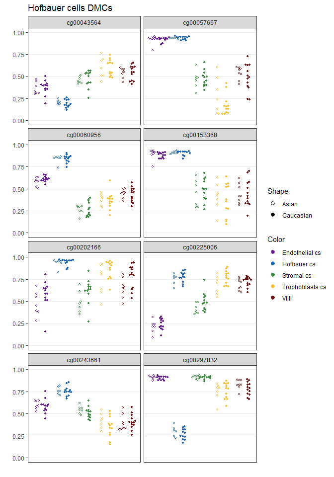
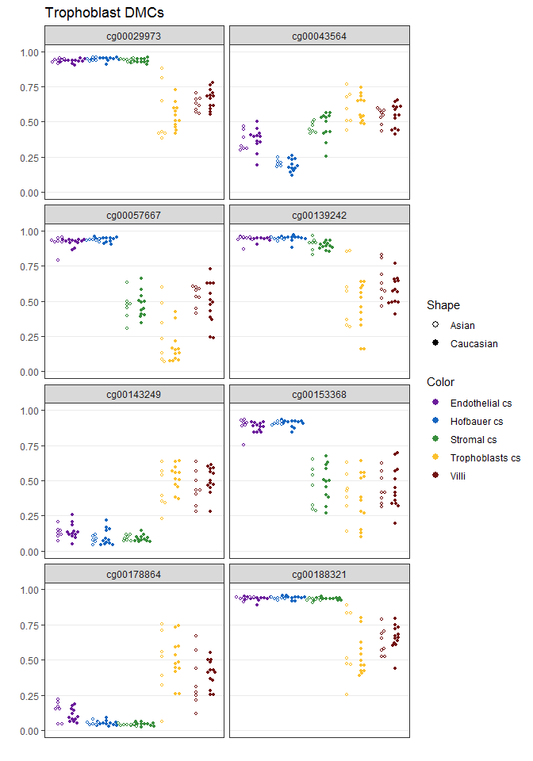
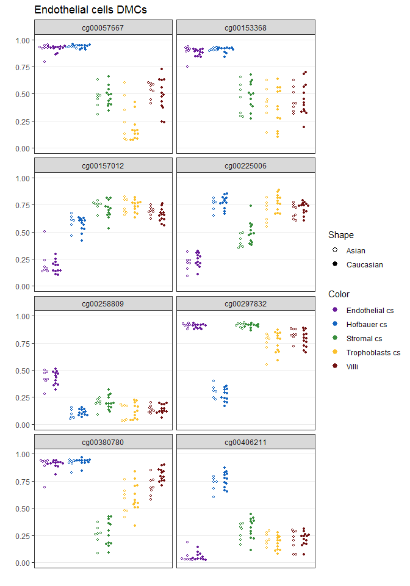
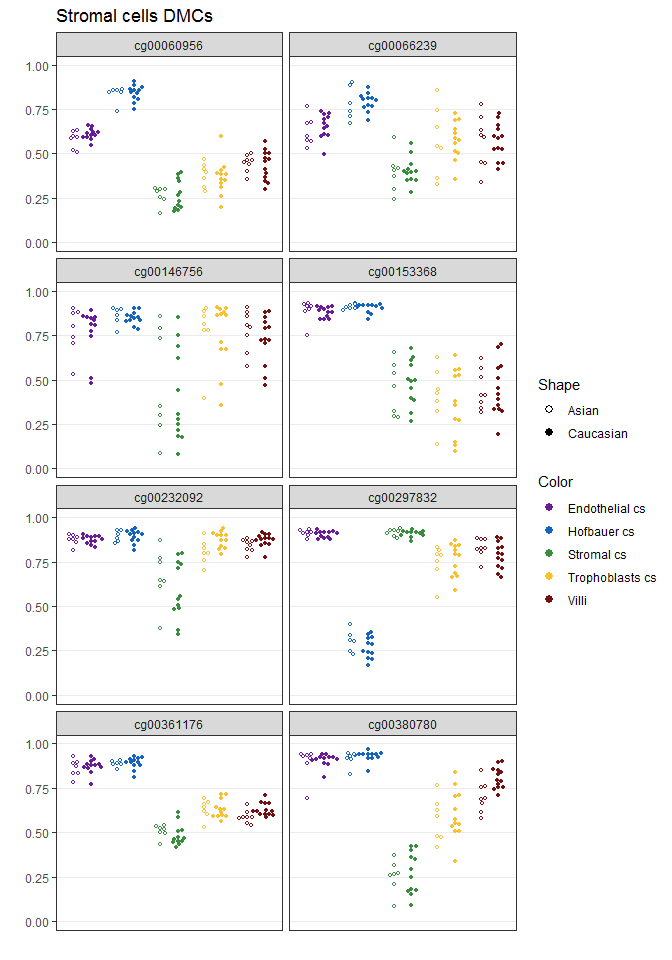
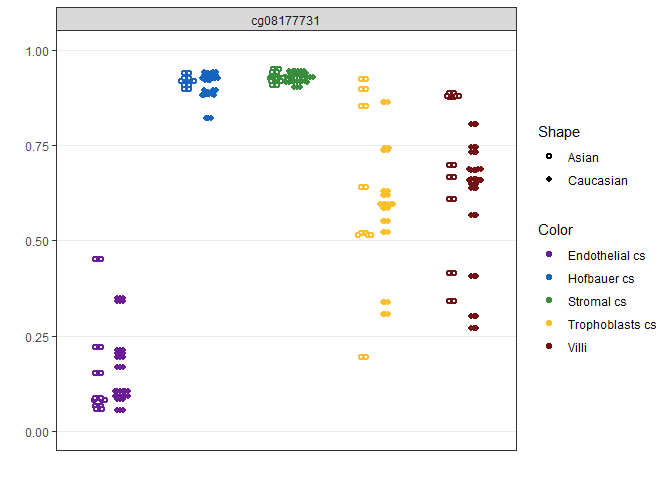
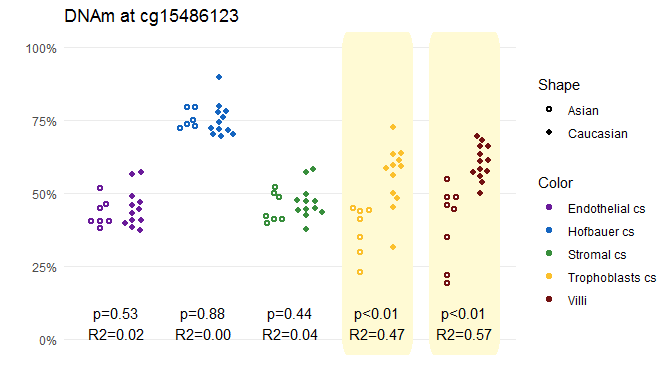
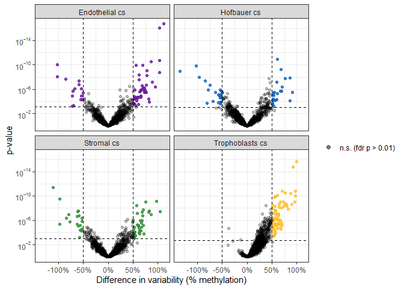
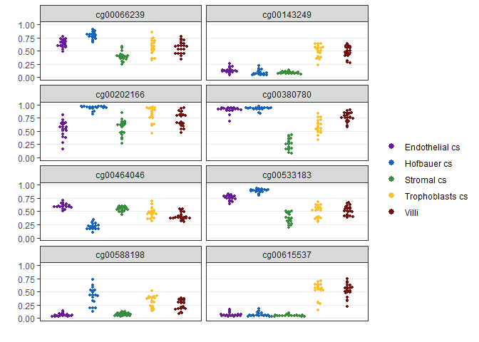
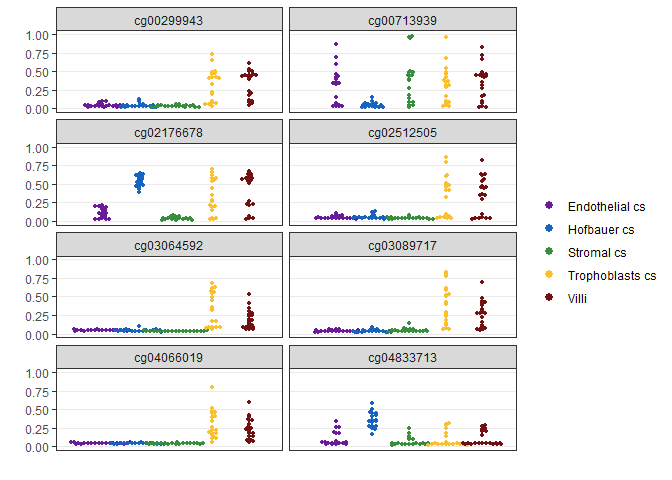

In this script, I analyze the overlap between cell specific sites and those sites in:

1) mQTLs
2) placental epigenetic clocks

# Setup

## Libraries


```r
# libraries and data
library(minfi)
library(tidyverse)
library(scales)
library(here)
library(readxl)
library(planet)
library(limma)
library(missMethyl)
library(biobroom)
theme_set(theme_bw())
```

## Data


```r
base_path <- file.path('data', 'main', 'interim')

# pData
pDat <- readRDS(here(base_path, '2_3_pDat_contam.rds'))
pDat <- pDat %>%
  mutate(Tissue = case_when(
    !(Tissue %in% c('Villi', 'Villi maternal', 'Syncytiotrophoblast')) ~ paste(Tissue, 'cs'),
    Tissue == 'Syncytiotrophoblast' ~ 'Trophoblasts enz',
    TRUE ~ Tissue
  )) 

# raw methylation data
betas <- readRDS(here(base_path, '1_4_betas_noob_filt.rds'))

mset_noob <- readRDS(here(base_path, '1_4_mset_noob.rds')) # for mvals
colnames(mset_noob) <- pDat$Sample_Name
mvals <- getM(mset_noob)

# annotation
anno <- readRDS('Z:/Victor/Repositories/EPIC_annotation/hg19_epic_annotation.rds')
anno <- anno %>%
  as_tibble() %>%
  filter(cpg %in% rownames(betas)) # filter to filtered betas cpgs
probe_anno <- readRDS(here(base_path, '1_1_probe_anno.rds'))

# color key
pheatmap_color_code <- readRDS(here(base_path, '1_1_color_code.rds'))

color_code <- readRDS(here(base_path, '2_3_color_code.rds'))
color_code_tissue <- setNames(color_code$Colors_Tissue, color_code$label)

#dmcs
dmcs_cell <- readRDS(here(base_path, '2_4_dmcs.rds'))
dmcs_trim <- readRDS(here(base_path, '2_8_all_third_vs_first_dmcs.rds'))

# enrichment results
func_enrich <- readRDS(here(base_path, '2_8_functional_enrichment_results.rds'))
tests <- readRDS(here(base_path, '2_8_genomic_enrichment_results.rds'))
```

## Remove samples


```r
pDat_filt <- pDat %>% 
  filter(maternal_contamination_norm_flip < 0.35,
         !Sample_Name %in% c('PM364_hofb_cs', 'PL293_v_R2', 'PM366_vc_R2', 'P131_hofb_cs', 
                             'PM324_V4', 'PM324_V1'),
         !Tissue %in% c('Villi maternal', 'Trophoblasts enz', 'Mixture cs', 
                        'Dead Cells and Lymphocytes cs'),)

# filter to first trimester
betas_filt <- betas[,pDat_filt$Sentrix]
colnames(betas_filt) <- pDat_filt$Sample_Name
```

# mQTLs


```r
#load mqtls in
mqtls <- read_excel(here('data', 'external', 'journal.pgen.1007785.s018.xlsx'), skip = 1)
```

```
## Warning in read_fun(path = enc2native(normalizePath(path)), sheet_i =
## sheet, : Expecting numeric in H1586 / R1586C8: got '5.11901415656116e-320'
```

```
## Warning in read_fun(path = enc2native(normalizePath(path)), sheet_i =
## sheet, : Expecting numeric in I1586 / R1586C9: got '2.41092769238639e-314'
```

```r
sum(anno$cpg %in% mqtls$cpgID) # 3313 / 4342 mqtl cpgs are in epic
```

```
## [1] 3313
```

```r
# The number of mQTLs athat are also cell-specific:
dmcs_cell %>%
  filter(bonferroni < 0.01 & abs(delta_b) > 0.25) %>%
  separate(col = Group1, sep = '\\.', into = c('Trimester', 'Celltype')) %>%
  filter(Trimester == 'Third') %>%
  select(gene) %>%
  distinct() %>%
  filter(gene %in% mqtls$cpgID) %>%
  nrow() #1022
```

```
## [1] 1483
```

1022 / 3313 (30.85%) cpgs that are placental-specific mQTLs are also DMCs


```r
# calculate number of DMCs that are mQTLs
dmcs_cell %>%
  mutate(placental_mqtl = gene %in% mqtls$cpgID,
         sig = (bonferroni < 0.01 & abs(delta_b) > 0.25)) %>%
  separate(col = Group1, sep = '\\.', into = c('Trimester', 'Celltype')) %>%
  filter(Trimester == 'Third') %>%
  
  group_by(Celltype) %>%
  summarize(
    # total DMCs / mQTLs
    n_sig = sum(sig == TRUE),
    n_mqtl = sum(placental_mqtl == TRUE),
    
    # DMC that is also mqtl
    dmc_and_mqtl = sum(
      (placental_mqtl == TRUE) & 
      (sig == TRUE)),
    
    # DMC that is mQTL / total DMCs
    p_dmc_in_mqtl = percent(dmc_and_mqtl/n_sig),
    
    # DMC that is mQTL / total mQTLs
    p_mqtl_in_dmc = percent(dmc_and_mqtl/n_mqtl))
```

```
## # A tibble: 4 x 6
##   Celltype  n_sig n_mqtl dmc_and_mqtl p_dmc_in_mqtl p_mqtl_in_dmc
##   <chr>     <int>  <int>        <int> <chr>         <chr>        
## 1 Endo_cs   75525   3313          384 0.508%        11.6%        
## 2 Hofb_cs  130733   3313          705 0.539%        21.3%        
## 3 Strom_cs  80153   3313          431 0.538%        13.0%        
## 4 Troph_cs 135553   3313          710 0.524%        21.4%
```

Let's visualize some of these mQTLs that are also cell specific

It'll be good to have ethnicity information. We don't have this currently, so I will use inferred 
ethnicity from planet for now, which I calculated in `1_6_ethnicity_ancestry.html`.


```r
# get inferred ethnicity info
pDat_eth <- readRDS(here(base_path, '1_6_pDat.rds'))
pDat_filt <- pDat_eth %>% 
  select(Sample_Name, contains('ethnicity'), contains('Prob'), -contains('Logodds')) %>%
  left_join(pDat_filt, .)
```

```
## Joining, by = c("Sample_Name", "failed_probes", "Prob_SNP_outlier")
```

```r
#list of dmcs that are also mqtls
dmc_and_mqtl <- dmcs_cell %>%
  filter(bonferroni < 0.01 & abs(delta_b) > 0.25) %>%
  separate(col = Group1, sep = '\\.', into = c('Trimester', 'Celltype')) %>%
  filter(Trimester == 'Third',
         gene %in% mqtls$cpgID) %>%
  dplyr::rename(dmc_for_class = Celltype) %>%
  select(gene, dmc_for_class, bonferroni, delta_b)

# join dmc information onto betas
dmcs_and_mqtl_betas <- betas_filt[intersect(rownames(betas_filt), dmc_and_mqtl$gene),] %>%
  
  # transpose, remove rownames
  t() %>%
  as.data.frame() %>%
  bind_cols(Sample_Name = rownames(.), .) %>%
  
  # bind to pData
  left_join(pDat_filt %>% 
              select(Sample_Name,
                     Trimester, 
                     Tissue, 
                     contains('Prob_'), 
                     -contains('SNP'),
                     Predicted_ethnicity_nothresh), 
            .,
            by = 'Sample_Name') %>%
  filter(Trimester == 'Third') %>%
  select(-Trimester) %>%
  
  pivot_longer(cols = -c(Sample_Name:Predicted_ethnicity_nothresh),
               names_to = 'cpg_id',
               values_to = 'beta') %>%
  
  # join to dmc data
  left_join(dmc_and_mqtl, by = c('cpg_id' = 'gene'))

# plot function:
plot_dmcs <- function(data) {
  data %>%
    {
      ggplot(data = ., aes(x = Tissue, y= beta, color = Tissue)) +
        ggbeeswarm::geom_beeswarm(cex = 2,
                                  size = 0.7,
                                  priority = 'density',
                                  dodge.width = 0.8,
                                  aes(shape = Predicted_ethnicity_nothresh),
                                  fill = 'white',
                                  stroke = 1) +
        facet_wrap(~cpg_id, ncol = 2) +
        scale_color_manual(values = color_code_tissue[pDat_filt$Tissue],
                           guide = guide_legend(override.aes = list(size = 2))) +
        scale_y_continuous(limits = c(0,1)) +
        scale_shape_manual(values = c('Asian' = 21, 'Caucasian' = 16),
                           guide = guide_legend(override.aes = list(size = 2))) +
        theme(axis.text.x = element_blank(),
              axis.ticks.x = element_blank(),
              panel.grid.major.x = element_blank(),
              panel.grid.minor.y = element_blank()) +
        labs(x = '', y= '', shape = 'Shape', color = 'Color') 
  }
}

dmcs_and_mqtl_betas %>%
  filter(dmc_for_class == 'Hofb_cs') %>%
  group_by(Sample_Name) %>%
  arrange(cpg_id) %>%
  dplyr::slice(1:8) %>%
  plot_dmcs() +
  labs(title = 'Hofbauer cells DMCs')
```

<!-- -->

```r
dmcs_and_mqtl_betas %>%
  filter(dmc_for_class == 'Troph_cs') %>%
  group_by(Sample_Name) %>%
  arrange(cpg_id) %>%
  dplyr::slice(1:8) %>%
  plot_dmcs() +
  labs(title = 'Trophoblast DMCs')
```

<!-- -->

```r
dmcs_and_mqtl_betas %>%
  filter(dmc_for_class == 'Endo_cs') %>%
  group_by(Sample_Name) %>%
  arrange(cpg_id) %>%
  dplyr::slice(1:8) %>%
  plot_dmcs() +
  labs(title = 'Endothelial cells DMCs')
```

<!-- -->

```r
dmcs_and_mqtl_betas %>%
  filter(dmc_for_class == 'Strom_cs') %>%
  group_by(Sample_Name) %>%
  arrange(cpg_id) %>%
  dplyr::slice(1:8) %>%
  plot_dmcs() +
  labs(title = 'Stromal cells DMCs')
```

<!-- -->

Now let's investigate some mqtls they showed in Delhaye et al 2019

Only 3 out of the 4 cpgs are in my data. Either do not exist in EPIC, or were filtered out for quality.


```r
dmcs_and_mqtl_betas %>%
  filter(cpg_id %in% c('cg08177731', 'cg21139150', 'cg17519949', 'cg26371521')) %>%
  
  {
    ggplot(data = ., aes(x = Tissue, y= beta, color = Tissue)) +
      ggbeeswarm::geom_beeswarm(cex = 0.6,
                                size = 1, 
                                priority = 'density',
                                dodge.width = 0.5,
                                aes(shape = Predicted_ethnicity_nothresh),
                                fill = 'white',
                                stroke = 1.5) +
      facet_wrap(~cpg_id) +
      scale_color_manual(values = color_code_tissue[pDat_filt$Tissue]) +
      scale_y_continuous(limits = c(0,1)) +
      scale_shape_manual(values = c('Asian' = 21, 'Caucasian' = 16)) +
      theme(axis.text.x = element_blank(),
            axis.ticks.x = element_blank(),
            panel.grid.major.x = element_blank(),
            panel.grid.minor.y = element_blank()) +
      labs(x = '', y= '', shape = 'Shape', color = 'Color')
  }
```

<!-- -->

To determine if placental mQTLs identified by Delahaye et al. are cell-specific, I will use differential variability testing between placenta and each cell type. Those cpgs with significantly less variability compared to the placenta are likely to be cell-specific.

## Wendy's exmaple

>Also (this is really for Victor)  I had a great question after my talk which I unfortunately didnt understand at the time... but I think what was being asked was in the figure with the mQTL that shows Asian  samples with lower DNAme for all genotypes than European ancestry, could this be due to cell composition changes, since apparently some structrual/cell composition differences have been reported between Asian and Caucasian placentas. Now that you have cell data you could ask if that particular CpG (and any others showing a similar pattern) differs by cell type and if so, do other CpG sites correlated with that same cell-specific DNAme pattern also show lower DNAme in Asian placentas??


```r
bmiq <- readRDS(here(base_path, '1_6_bmiq.rds'))
dim(bmiq)
```

```
## [1] 866091    192
```

```r
pDat_filt %>%
  filter(Trimester == 'Third') %>%
  mutate(cg15486123 = bmiq['cg15486123' , .$Sentrix]) %>%
  {
    ggplot(data = ., aes(x = Tissue, y= cg15486123)) +
      geom_ribbon(data = . %>%
                    mutate(ymin = 0, ymax = 1) %>%
                    filter(Tissue %in% c('Trophoblasts cs', 'Villi')),
                  aes(ymin = ymin, ymax = ymax), 
                  color = '#fffad4',
                  size = 25, alpha = 0.00005) +
      ggbeeswarm::geom_beeswarm(cex = 2,
                                size = 1.25, 
                                priority = 'density',
                                dodge.width = 0.75,
                                aes(shape = Predicted_ethnicity_nothresh,
                                    color = Tissue),
                                fill = 'white',
                                stroke = 1.5) +
      geom_text(data = . %>%
                   nest(data = c(-Tissue)) %>%
                   mutate(lmfit = map(data,
                                      function(x) 
                                        glance(lm(cg15486123 ~ Predicted_ethnicity_nothresh,
                                                  data = x)))) %>%
                   unnest(lmfit) %>%
                   mutate(label = paste0(scales::pvalue(p.value, 
                                                        add_p = TRUE, 
                                                        accuracy = 0.01), 
                                         '\nR2=', 
                                         scales::number(r.squared, accuracy = 0.01))),
                 aes(label = label, x = Tissue), 
                y = 0, color = 'black', vjust = 0, hjust = 0.5) +
      
      scale_color_manual(values = color_code_tissue[.$Tissue]) +
      scale_y_continuous(limits = c(0,1), labels = percent) +
      scale_shape_manual(values = c('Asian' = 21, 'Caucasian' = 16)) +
      theme(axis.text.x = element_blank(),
            axis.ticks = element_blank(),
            panel.grid.major.x = element_blank(),
            panel.grid.minor.y = element_blank(),
            panel.border = element_blank()) +
      labs(x = '', y= '', title = 'DNAm at cg15486123', shape = 'Shape', color = 'Color')
  }
```

<!-- -->

# Differential variability testing

Design matrix + contrasts


```r
# design matrix with Tissue and trimester
design <- pDat_filt %>% 
  filter(Trimester == 'Third') %>%
  select(Tissue, Case_ID) %>%
  mutate(Tissue = gsub('Endothelial cs', 'Endo_cs',
                       gsub('Hofbauer cs', 'Hofb_cs',
                            gsub('Trophoblasts cs', 'Troph_cs',
                                 gsub('Stromal cs', 'Strom_cs',
                                      gsub(':', '\\.', 
                                           Tissue))))))

design <- model.matrix(~0 + Tissue + Case_ID, data = design)
colnames(design) <- gsub('Tissue', '', colnames(design)) # rename columns

# specify contrasts
contMatrix <- makeContrasts(
  Endo_cs - Villi,
  Hofb_cs - Villi,
  Strom_cs - Villi,
  Troph_cs - Villi,
  levels = design)
```

## Fit models

We only apply the differential variability testing to the dmc/mqtls. 


```r
# fit models to mvalues
fitvar_m <- varFit( 
  
  # filter to mQTL cpgs and samples in third trim
  data = mvals[intersect(rownames(betas_filt), dmc_and_mqtl$gene),
               
               pDat_filt %>%
                 filter(Trimester == 'Third') %>%
                 pull(Sample_Name)], 
  
  design = design, coef = 1:5)

# apply contrasts
fitvar_m <- contrasts.varFit(fitvar_m, contrasts = contMatrix)

# repeat for betas
fitvar_b <- varFit( 
  
  # filter to mQTL cpgs and samples in third trim
  data = betas_filt[intersect(rownames(betas_filt), dmc_and_mqtl$gene),
               
               pDat_filt %>%
                 filter(Trimester == 'Third') %>%
                 pull(Sample_Name)], 
  
  design = design, coef = 1:5)

# apply contrasts
fitvar_b <- contrasts.varFit(fitvar_b, contrasts = contMatrix)
```

Process

1. tidy both mvalue and betas results df and join together (keeping only the `estimate` column in betas)
2. multiple test correct
3. determine if significant (bonf <0.01, |delta_b| > 0.25).
4. determine non significant (p > 0.05)


```r
fitvar_results <- fitvar_m %>%
  tidy() %>%
  
  # add delta betas
  left_join(fitvar_b %>% 
              tidy() %>% 
              select(gene, term, estimate) %>% 
              dplyr::rename(delta_b = estimate)) %>%
  
  group_by(term) %>%
  mutate(fdr = p.adjust(p.value, method = "fdr"),
         bonferroni = p.adjust(p.value, method = 'bonferroni'),
         DMV = case_when(
           grepl('Endo', term) ~ 'Endothelial cs',
           grepl('Strom', term) ~ 'Stromal cs',
           grepl('Hofb', term) ~ 'Hofbauer cs',
           grepl('Troph', term) ~ 'Trophoblasts cs'),
         
         direction = ifelse(estimate > 0, '+', '-'),
         significant = case_when(
           fdr < 0.01 & abs(delta_b) > 0.5 ~ '*',
           p.value > 0.05 ~ 'n.s. (p>0.05)')) %>%
  ungroup() %>%
  select(cpg = gene, DMV, p = p.value, fdr, significant, delta_m = estimate, delta_b, 
         direction) 
```

```
## Joining, by = c("gene", "term")
```

```r
# summarize results
fitvar_results %>%
  group_by(DMV) %>%
  summarize(n_up = sum(significant == '*' & delta_m > 0, na.rm = TRUE),
            n_same = sum(significant == 'n.s. (p>0.05)', na.rm = TRUE),
            n_down = sum(significant == '*' & delta_m < 0, na.rm = TRUE))
```

```
## # A tibble: 4 x 4
##   DMV              n_up n_same n_down
##   <chr>           <int>  <int>  <int>
## 1 Endothelial cs     44   1075     15
## 2 Hofbauer cs        24   1035     23
## 3 Stromal cs         36   1045     20
## 4 Trophoblasts cs    73    815      0
```

```r
# volcano plot
fitvar_results %>%
  mutate(negp = -p) %>%
  {
    ggplot(data = filter(., fdr < 0.01, abs(delta_b) > 0.5),
           aes(x = delta_b, y = p)) +
      geom_point(aes(color = DMV), alpha = 0.8) +
      geom_point(data = filter(., fdr >= 0.01 | abs(delta_b) <= 0.5),
                 aes(fill = 'n.s. (fdr p > 0.01)'), 
                 alpha = 0.25, shape = 19) +
      
      # add fdr p = 0.01 line
      geom_hline(data = group_by(., DMV) %>%
                   filter(fdr <= 0.01) %>%
                   arrange(desc(fdr)) %>%
                   summarize(threshold = max(p)),
                 linetype = 'dashed',
                 aes(yintercept = threshold)) +
      geom_vline(linetype = 'dashed', xintercept = 0.5) +
      geom_vline(linetype = 'dashed', xintercept = -0.5) + 
      
      facet_wrap(~DMV) +
      scale_x_continuous(labels = percent) +
      scale_y_continuous(trans = trans_new('neglog', 
                                           transform = function(x)(-log(x)), 
                                           inverse = function(x)(exp(-x)),
                                           breaks = log_breaks()),
                         label = function(x) {
                           parse(text = gsub("1e", "10^", scales::scientific_format()(x)))
                           }) +
      scale_color_manual(values = color_code_tissue[fitvar_results$DMV],
                         guide = FALSE) +
      scale_fill_manual(values = c('n.s. (FDR > 0.01)' = 'grey'), 
                        guide = guide_legend(override.aes = list(size = 2, alpha = 0.5))) +
      labs(x = 'Difference in variability (% methylation)', y = 'p-value',
           color = '', fill = '')
  }
```

<!-- -->

## Plot a couple of differential variable cpgs:

1. add betas to dmv list
2. plot


```r
# process betas
dmv_mqtl_dmc <- fitvar_results %>%
  left_join(dmcs_and_mqtl_betas %>%
              select(-bonferroni, -delta_b, -dmc_for_class) %>%
              distinct(), by = c('cpg' = 'cpg_id'))
# plot_dmv
# plot function:
plot_dmv <- function(data) {
  data %>%
    {
      ggplot(data = ., aes(x = Tissue, y= beta, color = Tissue)) +
        ggbeeswarm::geom_beeswarm(cex = 2,
                                  size = 0.7,
                                  priority = 'density',
                                  dodge.width = 0.8,
                                  fill = 'white',
                                  stroke = 1) +
        facet_wrap(~cpg, ncol = 2) +
        scale_color_manual(values = color_code_tissue[pDat_filt$Tissue],
                           guide = guide_legend(override.aes = list(size = 2))) +
        scale_y_continuous(limits = c(0,1)) +
        theme(axis.text.x = element_blank(),
              axis.ticks.x = element_blank(),
              panel.grid.major.x = element_blank(),
              panel.grid.minor.y = element_blank()) +
        labs(x = '', y= '', color = '') 
  }
}


# cpgs that are same variability
dmv_mqtl_dmc %>%
  arrange(cpg, Sample_Name) %>% 
  group_by(cpg) %>%
  filter(all(significant == 'n.s. (p>0.05)')) %>%
  
  # 1 row per sample/cpg
  select(-(DMV:direction)) %>%
  distinct() %>%
  
  group_by(Sample_Name) %>%
  arrange(cpg) %>%
  dplyr::slice(1:8) %>%
  plot_dmv()
```

<!-- -->

```r
# cpgs that are less variable in 1 or more
dmv_mqtl_dmc %>%
  arrange(cpg, Sample_Name) %>% 
  group_by(cpg) %>%
  filter(any(significant == '*' & direction == '-')) %>%
  
  select(-(DMV:direction)) %>%
  distinct() %>%
  
  group_by(Sample_Name) %>%
  arrange(cpg) %>%
  dplyr::slice(1:8) %>%
  plot_dmv()
```

<!-- -->

# Save data


```r
dmcs_and_mqtl_betas %>% saveRDS(here('data', 'main', 'interim', '2_9_dmcs_and_mqtls_betas.rds'))
fitvar_results %>% saveRDS(here('data', 'main', 'interim', '2_9_dmvs.rds'))
```

# Session info


```r
sessionInfo()
```

```
## R version 3.6.0 (2019-04-26)
## Platform: x86_64-w64-mingw32/x64 (64-bit)
## Running under: Windows Server x64 (build 14393)
## 
## Matrix products: default
## 
## locale:
## [1] LC_COLLATE=English_Canada.1252  LC_CTYPE=English_Canada.1252   
## [3] LC_MONETARY=English_Canada.1252 LC_NUMERIC=C                   
## [5] LC_TIME=English_Canada.1252    
## 
## attached base packages:
## [1] stats4    parallel  stats     graphics  grDevices utils     datasets 
## [8] methods   base     
## 
## other attached packages:
##  [1] biobroom_1.16.0             broom_0.5.2                
##  [3] missMethyl_1.18.0           limma_3.40.2               
##  [5] planet_0.0.1                readxl_1.3.1               
##  [7] here_0.1                    scales_1.0.0               
##  [9] forcats_0.4.0               stringr_1.4.0              
## [11] dplyr_0.8.3                 purrr_0.3.2                
## [13] readr_1.3.1                 tidyr_1.0.0                
## [15] tibble_2.1.3                ggplot2_3.2.0              
## [17] tidyverse_1.2.1             minfi_1.30.0               
## [19] bumphunter_1.26.0           locfit_1.5-9.1             
## [21] iterators_1.0.10            foreach_1.4.4              
## [23] Biostrings_2.52.0           XVector_0.24.0             
## [25] SummarizedExperiment_1.14.0 DelayedArray_0.10.0        
## [27] BiocParallel_1.17.18        matrixStats_0.54.0         
## [29] Biobase_2.44.0              GenomicRanges_1.36.0       
## [31] GenomeInfoDb_1.20.0         IRanges_2.18.1             
## [33] S4Vectors_0.22.0            BiocGenerics_0.30.0        
## 
## loaded via a namespace (and not attached):
##   [1] backports_1.1.4                                    
##   [2] plyr_1.8.4                                         
##   [3] lazyeval_0.2.2                                     
##   [4] splines_3.6.0                                      
##   [5] digest_0.6.19                                      
##   [6] htmltools_0.3.6                                    
##   [7] GO.db_3.8.2                                        
##   [8] fansi_0.4.0                                        
##   [9] magrittr_1.5                                       
##  [10] memoise_1.1.0                                      
##  [11] annotate_1.62.0                                    
##  [12] modelr_0.1.4                                       
##  [13] askpass_1.1                                        
##  [14] siggenes_1.58.0                                    
##  [15] prettyunits_1.0.2                                  
##  [16] colorspace_1.4-1                                   
##  [17] blob_1.1.1                                         
##  [18] rvest_0.3.4                                        
##  [19] BiasedUrn_1.07                                     
##  [20] haven_2.1.0                                        
##  [21] xfun_0.7                                           
##  [22] crayon_1.3.4                                       
##  [23] RCurl_1.95-4.12                                    
##  [24] jsonlite_1.6                                       
##  [25] genefilter_1.66.0                                  
##  [26] GEOquery_2.52.0                                    
##  [27] zeallot_0.1.0                                      
##  [28] IlluminaHumanMethylationEPICmanifest_0.3.0         
##  [29] survival_2.44-1.1                                  
##  [30] glue_1.3.1                                         
##  [31] ruv_0.9.7                                          
##  [32] registry_0.5-1                                     
##  [33] gtable_0.3.0                                       
##  [34] zlibbioc_1.30.0                                    
##  [35] IlluminaHumanMethylationEPICanno.ilm10b4.hg19_0.6.0
##  [36] Rhdf5lib_1.6.0                                     
##  [37] HDF5Array_1.12.1                                   
##  [38] DBI_1.0.0                                          
##  [39] rngtools_1.3.1.1                                   
##  [40] bibtex_0.4.2                                       
##  [41] Rcpp_1.0.1                                         
##  [42] xtable_1.8-4                                       
##  [43] progress_1.2.2                                     
##  [44] bit_1.1-14                                         
##  [45] mclust_5.4.3                                       
##  [46] preprocessCore_1.46.0                              
##  [47] httr_1.4.0                                         
##  [48] RColorBrewer_1.1-2                                 
##  [49] ellipsis_0.2.0                                     
##  [50] pkgconfig_2.0.2                                    
##  [51] reshape_0.8.8                                      
##  [52] XML_3.98-1.20                                      
##  [53] utf8_1.1.4                                         
##  [54] labeling_0.3                                       
##  [55] tidyselect_0.2.5.9000                              
##  [56] rlang_0.4.0                                        
##  [57] AnnotationDbi_1.46.0                               
##  [58] munsell_0.5.0                                      
##  [59] cellranger_1.1.0                                   
##  [60] tools_3.6.0                                        
##  [61] cli_1.1.0                                          
##  [62] generics_0.0.2                                     
##  [63] RSQLite_2.1.1                                      
##  [64] evaluate_0.14                                      
##  [65] yaml_2.2.0                                         
##  [66] org.Hs.eg.db_3.8.2                                 
##  [67] knitr_1.23                                         
##  [68] bit64_0.9-7                                        
##  [69] beanplot_1.2                                       
##  [70] scrime_1.3.5                                       
##  [71] methylumi_2.30.0                                   
##  [72] nlme_3.1-140                                       
##  [73] doRNG_1.7.1                                        
##  [74] nor1mix_1.3-0                                      
##  [75] xml2_1.2.0                                         
##  [76] biomaRt_2.40.0                                     
##  [77] compiler_3.6.0                                     
##  [78] rstudioapi_0.10                                    
##  [79] beeswarm_0.2.3                                     
##  [80] statmod_1.4.32                                     
##  [81] stringi_1.4.3                                      
##  [82] IlluminaHumanMethylation450kanno.ilmn12.hg19_0.6.0 
##  [83] GenomicFeatures_1.36.2                             
##  [84] lattice_0.20-38                                    
##  [85] Matrix_1.2-17                                      
##  [86] IlluminaHumanMethylation450kmanifest_0.4.0         
##  [87] multtest_2.40.0                                    
##  [88] vctrs_0.2.0                                        
##  [89] pillar_1.4.2                                       
##  [90] lifecycle_0.1.0                                    
##  [91] data.table_1.12.2                                  
##  [92] bitops_1.0-6                                       
##  [93] rtracklayer_1.44.2                                 
##  [94] R6_2.4.0                                           
##  [95] gridExtra_2.3                                      
##  [96] vipor_0.4.5                                        
##  [97] codetools_0.2-16                                   
##  [98] MASS_7.3-51.4                                      
##  [99] assertthat_0.2.1                                   
## [100] rhdf5_2.28.0                                       
## [101] openssl_1.4                                        
## [102] pkgmaker_0.27                                      
## [103] rprojroot_1.3-2                                    
## [104] withr_2.1.2                                        
## [105] GenomicAlignments_1.20.1                           
## [106] Rsamtools_2.0.0                                    
## [107] GenomeInfoDbData_1.2.1                             
## [108] hms_0.4.2                                          
## [109] quadprog_1.5-7                                     
## [110] grid_3.6.0                                         
## [111] base64_2.0                                         
## [112] rmarkdown_1.13                                     
## [113] DelayedMatrixStats_1.6.0                           
## [114] illuminaio_0.26.0                                  
## [115] lubridate_1.7.4                                    
## [116] ggbeeswarm_0.6.0
```
